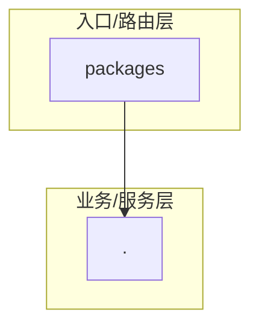

# jiaoyi — 代码库 Wiki

> 自动生成于 2026-05-31 16:53 | 提交: e88fead0

## 模块导航

| [.](./README.md) | 82 | bat | - |
| [packages](./packages/README.md) | 262 | ts | packages/mobile/src/types/index.ts |

## 技术栈概览

.ts, .tsx, .png, .css, .bat, .json

## 入口文件

_未检测到标准入口文件_

## 架构总览

