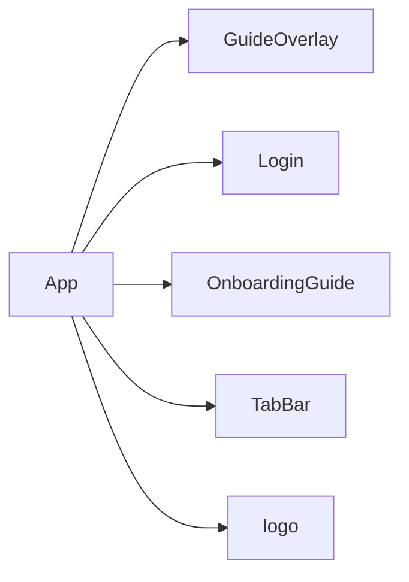

# packages

> 文件数: 262 | 主要语言: ts | 入口: packages/mobile/src/types/index.ts

## 文件清单

| 文件 | 大小 | 说明 |
|------|------|------|
| design-preview.html | 0B | 2026-05-11 |
| dist.tar.gz | 205KB | 2026-05-11 |
| index.html | 1KB | 2026-05-11 |
| package.json | 699B | 2026-04-21 |
| apple-touch-icon.png | 2KB | 2026-05-11 |
| avatar-logo.png | 9KB | 2026-05-11 |
| favicon.png | 846B | 2026-05-11 |
| favicon.svg | 277B | 2026-05-11 |
| logo-192x192.png | 3KB | 2026-05-11 |
| logo-512x512.png | 9KB | 2026-05-11 |
| logo.png | 9KB | 2026-05-11 |
| manifest.json | 589B | 2026-05-11 |
| sw.js | 3KB | 2026-05-11 |
| App.tsx | 4KB | 2026-05-11 |
| apple-touch-icon.png | 2KB | 2026-05-11 |
| avatar-logo.png | 9KB | 2026-05-11 |
| favicon.png | 846B | 2026-05-11 |
| logo-192x192.png | 3KB | 2026-05-11 |
| logo-512x512.png | 9KB | 2026-05-11 |
| logo.png | 9KB | 2026-05-11 |
| logo.svg | 428B | 2026-05-11 |
| DrugCard.css | 5KB | 2026-05-11 |
| DrugCard.tsx | 9KB | 2026-05-11 |
| ErrorBoundary.tsx | 2KB | 2026-04-21 |
| GuideOverlay.css | 5KB | 2026-05-11 |
| GuideOverlay.tsx | 7KB | 2026-05-11 |
| OnboardingGuide.css | 4KB | 2026-05-11 |
| OnboardingGuide.tsx | 6KB | 2026-05-11 |
| TabBar.css | 2KB | 2026-05-11 |
| TabBar.tsx | 4KB | 2026-05-11 |

## 依赖关系



## 概述

```ts
// 用户类型
export interface User {
  id: number
  username: string
  realName?: string
  phone?: string
  role: 'admin' | 'investor'
  status: 'active' | 'inactive'
  createdAt: string
}

// 药品类型
export interface Drug {
  id: number
  name: string
  code: string
  spec?: string
  purchasePrice: number
  sellingPrice: number
  actualSellingPrice?: number
  actualPriceUpdatedAt?: string
  totalQuantity: number
  subscribedQuantity: number
  remainingQuantity: number
  operationFeeRate: number
  slowS
```

