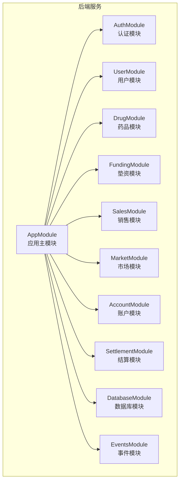
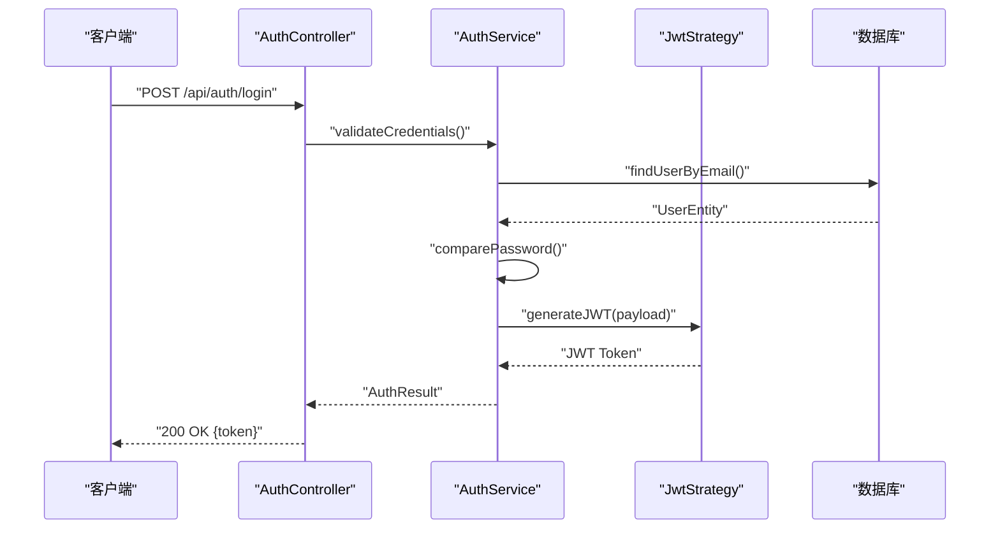
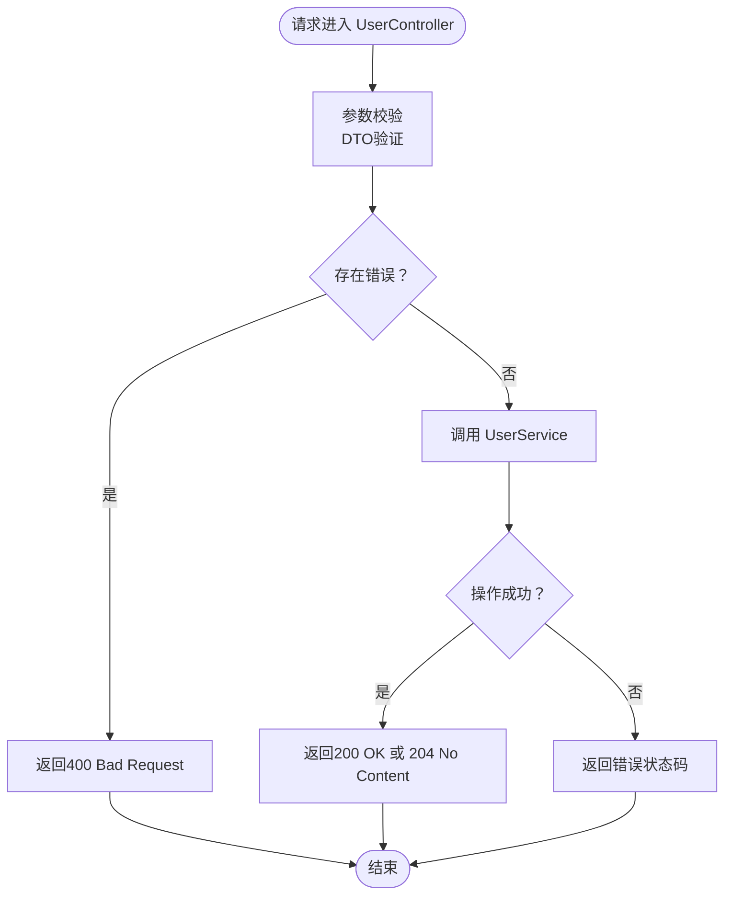
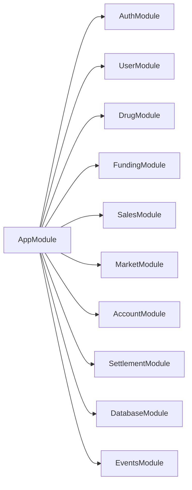
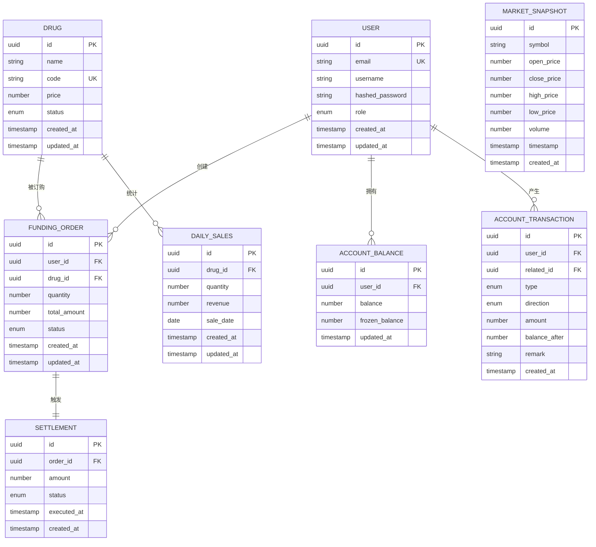

# API接口文档

<cite>
**本文档引用的文件**
- [package.json](file://package.json)
- [pnpm-workspace.yaml](file://pnpm-workspace.yaml)
- [app.module.ts](file://packages/server/src/app.module.ts)
- [auth.controller.ts](file://packages/server/src/modules/auth/auth.controller.ts)
- [auth.service.ts](file://packages/server/src/modules/auth/auth.service.ts)
- [jwt.strategy.ts](file://packages/server/src/modules/auth/jwt.strategy.ts)
- [jwt-auth.guard.ts](file://packages/server/src/common/guards/jwt-auth.guard.ts)
- [admin.guard.ts](file://packages/server/src/common/guards/admin.guard.ts)
- [roles.guard.ts](file://packages/server/src/common/guards/roles.guard.ts)
- [roles.decorator.ts](file://packages/server/src/common/decorators/roles.decorator.ts)
- [current-user.decorator.ts](file://packages/server/src/modules/auth/decorators/current-user.decorator.ts)
- [login.dto.ts](file://packages/server/src/modules/auth/dto/login.dto.ts)
- [register.dto.ts](file://packages/server/src/modules/auth/dto/register.dto.ts)
- [user.controller.ts](file://packages/server/src/modules/user/user.controller.ts)
- [update-user.dto.ts](file://packages/server/src/modules/user/dto/update-user.dto.ts)
- [drug.controller.ts](file://packages/server/src/modules/drug/drug.controller.ts)
- [create-drug.dto.ts](file://packages/server/src/modules/drug/dto/create-drug.dto.ts)
- [update-drug.dto.ts](file://packages/server/src/modules/drug/dto/update-drug.dto.ts)
- [query-drug.dto.ts](file://packages/server/src/modules/drug/dto/query-drug.dto.ts)
- [funding.controller.ts](file://packages/server/src/modules/funding/funding.controller.ts)
- [create-funding-order.dto.ts](file://packages/server/src/modules/funding/dto/create-funding-order.dto.ts)
- [query-funding-order.dto.ts](file://packages/server/src/modules/funding/dto/query-funding-order.dto.ts)
- [sales.controller.ts](file://packages/server/src/modules/sales/sales.controller.ts)
- [create-daily-sales.dto.ts](file://packages/server/src/modules/sales/dto/create-daily-sales.dto.ts)
- [query-sales.dto.ts](file://packages/server/src/modules/sales/dto/query-sales.dto.ts)
- [market.controller.ts](file://packages/server/src/modules/market/market.controller.ts)
- [create-snapshot.dto.ts](file://packages/server/src/modules/market/dto/create-snapshot.dto.ts)
- [query-kline.dto.ts](file://packages/server/src/modules/market/dto/query-kline.dto.ts)
- [account.controller.ts](file://packages/server/src/modules/account/account.controller.ts)
- [recharge.dto.ts](file://packages/server/src/modules/account/dto/recharge.dto.ts)
- [transaction-query.dto.ts](file://packages/server/src/modules/account/dto/transaction-query.dto.ts)
- [settlement.controller.ts](file://packages/server/src/modules/settlement/settlement.controller.ts)
- [execute-settlement.dto.ts](file://packages/server/src/modules/settlement/dto/execute-settlement.dto.ts)
- [query-settlement.dto.ts](file://packages/server/src/modules/settlement/dto/query-settlement.dto.ts)
- [user.entity.ts](file://packages/server/src/database/entities/user.entity.ts)
- [drug.entity.ts](file://packages/server/src/database/entities/drug.entity.ts)
- [funding-order.entity.ts](file://packages/server/src/database/entities/funding-order.entity.ts)
- [daily-sales.entity.ts](file://packages/server/src/database/entities/daily-sales.entity.ts)
- [market-snapshot.entity.ts](file://packages/server/src/database/entities/market-snapshot.entity.ts)
- [account-balance.entity.ts](file://packages/server/src/database/entities/account-balance.entity.ts)
- [account-transaction.entity.ts](file://packages/server/src/database/entities/account-transaction.entity.ts)
- [settlement.entity.ts](file://packages/server/src/database/entities/settlement.entity.ts)
- [events.gateway.ts](file://packages/server/src/common/events/events.gateway.ts)
- [events.module.ts](file://packages/server/src/common/events/events.module.ts)
- [data-source.ts](file://packages/server/src/database/data-source.ts)
- [database.module.ts](file://packages/server/src/database/database.module.ts)
- [1712160000000-InitialSchema.ts](file://packages/server/src/database/migrations/1712160000000-InitialSchema.ts)
- [initial.seed.ts](file://packages/server/src/database/seeds/initial.seed.ts)
</cite>

## 目录
1. [简介](#简介)
2. [项目结构](#项目结构)
3. [核心组件](#核心组件)
4. [架构总览](#架构总览)
5. [详细组件分析](#详细组件分析)
6. [依赖关系分析](#依赖关系分析)
7. [性能考虑](#性能考虑)
8. [故障排除指南](#故障排除指南)
9. [结论](#结论)
10. [附录](#附录)

## 简介
本项目为“药品垫资交易平台”，采用NestJS微服务架构（monorepo），通过TypeORM进行数据库访问，提供认证与授权、用户管理、药品管理、垫资交易、销售统计、市场行情、账户管理、清算结算等模块的RESTful API。系统支持JWT认证、基于角色的权限控制（RBAC）、WebSocket事件推送以及数据库迁移与种子数据初始化。

## 项目结构
- 仓库采用monorepo布局，使用pnpm工作区管理前后端包。
- 后端位于packages/server，包含模块化业务层（auth、user、drug、funding、sales、market、account、settlement）与通用基础设施（guards、decorators、events、database）。
- 前端位于packages/web，提供Web界面与WebSocket客户端集成。

**图表来源**
- [app.module.ts:15-50](file://packages/server/src/app.module.ts#L15-L50)

**章节来源**
- [pnpm-workspace.yaml:1-3](file://pnpm-workspace.yaml#L1-L3)
- [package.json:6-13](file://package.json#L6-L13)
- [app.module.ts:15-50](file://packages/server/src/app.module.ts#L15-L50)

## 核心组件
- 认证与授权：JWT策略、JWT守卫、管理员守卫、角色守卫、角色装饰器、当前用户装饰器。
- 数据模型：用户、药品、垫资订单、日销售、市场快照、账户余额、账户流水、结算单。
- WebSocket：事件网关与模块，用于实时行情与通知推送。
- 数据库：PostgreSQL连接配置、TypeORM实体映射、迁移脚本与初始种子数据。

**章节来源**
- [jwt.strategy.ts:1-200](file://packages/server/src/modules/auth/jwt.strategy.ts)
- [jwt-auth.guard.ts:1-200](file://packages/server/src/common/guards/jwt-auth.guard.ts)
- [admin.guard.ts:1-200](file://packages/server/src/common/guards/admin.guard.ts)
- [roles.guard.ts:1-200](file://packages/server/src/common/guards/roles.guard.ts)
- [roles.decorator.ts:1-200](file://packages/server/src/common/decorators/roles.decorator.ts)
- [current-user.decorator.ts:1-200](file://packages/server/src/modules/auth/decorators/current-user.decorator.ts)
- [events.gateway.ts:1-200](file://packages/server/src/common/events/events.gateway.ts)
- [events.module.ts:1-200](file://packages/server/src/common/events/events.module.ts)
- [data-source.ts:1-200](file://packages/server/src/database/data-source.ts)
- [database.module.ts:1-200](file://packages/server/src/database/database.module.ts)
- [1712160000000-InitialSchema.ts:1-200](file://packages/server/src/database/migrations/1712160000000-InitialSchema.ts)
- [initial.seed.ts:1-200](file://packages/server/src/database/seeds/initial.seed.ts)

## 架构总览
系统采用分层架构：控制器负责HTTP路由与参数校验；服务层封装业务逻辑；TypeORM实体与仓储负责数据持久化；守卫与装饰器实现认证与授权；WebSocket模块提供事件推送。

```mermaid
graph TB
CLIENT["客户端/前端"]
CTRL_AUTH["AuthController"]
CTRL_USER["UserController"]
CTRL_DRUG["DrugController"]
CTRL_FUND["FundingController"]
CTRL_SALES["SalesController"]
CTRL_MARKET["MarketController"]
CTRL_ACC["AccountController"]
CTRL_SETT["SettlementController"]
SVC_AUTH["AuthService"]
SVC_USER["UserService"]
SVC_DRUG["DrugService"]
SVC_FUND["FundingService"]
SVC_SALES["SalesService"]
SVC_MARKET["MarketService"]
SVC_ACC["AccountService"]
SVC_SETT["SettlementService"]
GUARD_JWT["JwtAuthGuard"]
GUARD_ROLE["RolesGuard"]
GUARD_ADMIN["AdminGuard"]
DECORATOR_ROLE["RolesDecorator"]
DECORATOR_USER["CurrentUserDecorator"]
ENTITY_USER["UserEntity"]
ENTITY_DRUG["DrugEntity"]
ENTITY_FUND["FundingOrderEntity"]
ENTITY_SALES["DailySalesEntity"]
ENTITY_MARKET["MarketSnapshotEntity"]
ENTITY_ACC_BAL["AccountBalanceEntity"]
ENTITY_ACC_TX["AccountTransactionEntity"]
ENTITY_SETT["SettlementEntity"]
DB["PostgreSQL"]
WS["EventsGateway/WebSocket"]
CLIENT --> CTRL_AUTH
CLIENT --> CTRL_USER
CLIENT --> CTRL_DRUG
CLIENT --> CTRL_FUND
CLIENT --> CTRL_SALES
CLIENT --> CTRL_MARKET
CLIENT --> CTRL_ACC
CLIENT --> CTRL_SETT
CTRL_AUTH --> SVC_AUTH
CTRL_USER --> SVC_USER
CTRL_DRUG --> SVC_DRUG
CTRL_FUND --> SVC_FUND
CTRL_SALES --> SVC_SALES
CTRL_MARKET --> SVC_MARKET
CTRL_ACC --> SVC_ACC
CTRL_SETT --> SVC_SETT
SVC_AUTH --> ENTITY_USER
SVC_USER --> ENTITY_USER
SVC_DRUG --> ENTITY_DRUG
SVC_FUND --> ENTITY_FUND
SVC_SALES --> ENTITY_SALES
SVC_MARKET --> ENTITY_MARKET
SVC_ACC --> ENTITY_ACC_BAL
SVC_ACC --> ENTITY_ACC_TX
SVC_SETT --> ENTITY_SETT
ENTITY_USER --> DB
ENTITY_DRUG --> DB
ENTITY_FUND --> DB
ENTITY_SALES --> DB
ENTITY_MARKET --> DB
ENTITY_ACC_BAL --> DB
ENTITY_ACC_TX --> DB
ENTITY_SETT --> DB
CTRL_AUTH -.-> GUARD_JWT
CTRL_AUTH -.-> GUARD_ROLE
CTRL_AUTH -.-> GUARD_ADMIN
CTRL_AUTH -.-> DECORATOR_ROLE
CTRL_AUTH -.-> DECORATOR_USER
CTRL_AUTH --> WS
CTRL_USER --> WS
CTRL_DRUG --> WS
CTRL_FUND --> WS
CTRL_SALES --> WS
CTRL_MARKET --> WS
CTRL_ACC --> WS
CTRL_SETT --> WS
```

**图表来源**
- [app.module.ts:15-50](file://packages/server/src/app.module.ts#L15-L50)
- [auth.controller.ts:1-200](file://packages/server/src/modules/auth/auth.controller.ts)
- [user.controller.ts:1-200](file://packages/server/src/modules/user/user.controller.ts)
- [drug.controller.ts:1-200](file://packages/server/src/modules/drug/drug.controller.ts)
- [funding.controller.ts:1-200](file://packages/server/src/modules/funding/funding.controller.ts)
- [sales.controller.ts:1-200](file://packages/server/src/modules/sales/sales.controller.ts)
- [market.controller.ts:1-200](file://packages/server/src/modules/market/market.controller.ts)
- [account.controller.ts:1-200](file://packages/server/src/modules/account/account.controller.ts)
- [settlement.controller.ts:1-200](file://packages/server/src/modules/settlement/settlement.controller.ts)
- [jwt-auth.guard.ts:1-200](file://packages/server/src/common/guards/jwt-auth.guard.ts)
- [roles.guard.ts:1-200](file://packages/server/src/common/guards/roles.guard.ts)
- [admin.guard.ts:1-200](file://packages/server/src/common/guards/admin.guard.ts)
- [roles.decorator.ts:1-200](file://packages/server/src/common/decorators/roles.decorator.ts)
- [current-user.decorator.ts:1-200](file://packages/server/src/modules/auth/decorators/current-user.decorator.ts)
- [events.gateway.ts:1-200](file://packages/server/src/common/events/events.gateway.ts)

## 详细组件分析

### 认证与授权接口
- JWT认证机制
  - 登录获取令牌：POST /api/auth/login
  - 注册账户：POST /api/auth/register
  - 当前用户信息：GET /api/auth/me
  - 刷新令牌：POST /api/auth/refresh（如实现）
- 权限控制
  - JwtAuthGuard：保护需要登录的路由
  - RolesGuard：基于角色的访问控制
  - AdminGuard：管理员专用路由
  - RolesDecorator：声明所需角色
  - CurrentUserDecorator：在处理器中注入当前用户上下文

**图表来源**
- [auth.controller.ts:1-200](file://packages/server/src/modules/auth/auth.controller.ts)
- [auth.service.ts:1-200](file://packages/server/src/modules/auth/auth.service.ts)
- [jwt.strategy.ts:1-200](file://packages/server/src/modules/auth/jwt.strategy.ts)

**章节来源**
- [auth.controller.ts:1-200](file://packages/server/src/modules/auth/auth.controller.ts)
- [auth.service.ts:1-200](file://packages/server/src/modules/auth/auth.service.ts)
- [jwt.strategy.ts:1-200](file://packages/server/src/modules/auth/jwt.strategy.ts)
- [jwt-auth.guard.ts:1-200](file://packages/server/src/common/guards/jwt-auth.guard.ts)
- [roles.guard.ts:1-200](file://packages/server/src/common/guards/roles.guard.ts)
- [admin.guard.ts:1-200](file://packages/server/src/common/guards/admin.guard.ts)
- [roles.decorator.ts:1-200](file://packages/server/src/common/decorators/roles.decorator.ts)
- [current-user.decorator.ts:1-200](file://packages/server/src/modules/auth/decorators/current-user.decorator.ts)

### 用户管理接口
- 获取用户列表：GET /api/users
- 获取单个用户：GET /api/users/:id
- 更新用户信息：PUT /api/users/:id
- 删除用户：DELETE /api/users/:id
- DTO：update-user.dto.ts

**图表来源**
- [user.controller.ts:1-200](file://packages/server/src/modules/user/user.controller.ts)
- [update-user.dto.ts:1-200](file://packages/server/src/modules/user/dto/update-user.dto.ts)

**章节来源**
- [user.controller.ts:1-200](file://packages/server/src/modules/user/user.controller.ts)
- [update-user.dto.ts:1-200](file://packages/server/src/modules/user/dto/update-user.dto.ts)

### 药品管理接口
- 创建药品：POST /api/drugs
- 查询药品：GET /api/drugs
- 更新药品：PUT /api/drugs/:id
- 更新药品状态：PATCH /api/drugs/:id/status
- 删除药品：DELETE /api/drugs/:id
- DTO：create-drug.dto.ts, update-drug.dto.ts, query-drug.dto.ts

**章节来源**
- [drug.controller.ts:1-200](file://packages/server/src/modules/drug/drug.controller.ts)
- [create-drug.dto.ts:1-200](file://packages/server/src/modules/drug/dto/create-drug.dto.ts)
- [update-drug.dto.ts:1-200](file://packages/server/src/modules/drug/dto/update-drug.dto.ts)
- [query-drug.dto.ts:1-200](file://packages/server/src/modules/drug/dto/query-drug.dto.ts)

### 垫资交易接口
- 创建垫资订单：POST /api/funding/orders
- 查询垫资订单：GET /api/funding/orders
- 取消垫资订单：DELETE /api/funding/orders/:id
- DTO：create-funding-order.dto.ts, query-funding-order.dto.ts

**章节来源**
- [funding.controller.ts:1-200](file://packages/server/src/modules/funding/funding.controller.ts)
- [create-funding-order.dto.ts:1-200](file://packages/server/src/modules/funding/dto/create-funding-order.dto.ts)
- [query-funding-order.dto.ts:1-200](file://packages/server/src/modules/funding/dto/query-funding-order.dto.ts)

### 销售统计接口
- 创建日销售：POST /api/sales/daily
- 查询日销售：GET /api/sales/daily
- 更新日销售：PUT /api/sales/daily/:id
- 删除日销售：DELETE /api/sales/daily/:id
- DTO：create-daily-sales.dto.ts, query-sales.dto.ts

**章节来源**
- [sales.controller.ts:1-200](file://packages/server/src/modules/sales/sales.controller.ts)
- [create-daily-sales.dto.ts:1-200](file://packages/server/src/modules/sales/dto/create-daily-sales.dto.ts)
- [query-sales.dto.ts:1-200](file://packages/server/src/modules/sales/dto/query-sales.dto.ts)

### 市场行情接口
- 创建市场快照：POST /api/market/snapshots
- 查询K线：GET /api/market/kline
- DTO：create-snapshot.dto.ts, query-kline.dto.ts

**章节来源**
- [market.controller.ts:1-200](file://packages/server/src/modules/market/market.controller.ts)
- [create-snapshot.dto.ts:1-200](file://packages/server/src/modules/market/dto/create-snapshot.dto.ts)
- [query-kline.dto.ts:1-200](file://packages/server/src/modules/market/dto/query-kline.dto.ts)

### 账户管理接口
- 充值：POST /api/account/recharge
- 查询账户流水：GET /api/account/transactions
- 查询账户余额：GET /api/account/balance
- DTO：recharge.dto.ts, transaction-query.dto.ts

**章节来源**
- [account.controller.ts:1-200](file://packages/server/src/modules/account/account.controller.ts)
- [recharge.dto.ts:1-200](file://packages/server/src/modules/account/dto/recharge.dto.ts)
- [transaction-query.dto.ts:1-200](file://packages/server/src/modules/account/dto/transaction-query.dto.ts)

### 清算结算接口
- 执行结算：POST /api/settlement/execute
- 查询结算单：GET /api/settlement
- DTO：execute-settlement.dto.ts, query-settlement.dto.ts

**章节来源**
- [settlement.controller.ts:1-200](file://packages/server/src/modules/settlement/settlement.controller.ts)
- [execute-settlement.dto.ts:1-200](file://packages/server/src/modules/settlement/dto/execute-settlement.dto.ts)
- [query-settlement.dto.ts:1-200](file://packages/server/src/modules/settlement/dto/query-settlement.dto.ts)

## 依赖关系分析
- 模块导入：AppModule集中导入各业务模块与数据库、事件模块。
- 控制器依赖：各模块控制器依赖对应服务；服务依赖实体与仓储。
- 守卫与装饰器：控制器通过守卫与装饰器实现认证与授权。
- WebSocket：事件模块与各业务模块解耦，通过事件网关推送消息。

**图表来源**
- [app.module.ts:15-50](file://packages/server/src/app.module.ts#L15-L50)

**章节来源**
- [app.module.ts:15-50](file://packages/server/src/app.module.ts#L15-L50)

## 性能考虑
- 数据库连接与迁移：生产环境禁用同步，启用迁移执行，减少启动时schema变更开销。
- 查询优化：对高频查询字段建立索引（如用户邮箱、药品标识、订单状态等）。
- 缓存策略：热点数据可引入Redis缓存（如市场快照、用户会话）。
- 分页与过滤：对列表接口统一使用分页与条件过滤DTO，避免全表扫描。
- 并发控制：垫资与结算涉及资金安全，需结合数据库事务与锁机制保证一致性。
- WebSocket：合理设置连接池与消息队列，避免高并发下的内存压力。

[本节为通用指导，无需特定文件引用]

## 故障排除指南
- 认证失败
  - 检查JWT签名密钥与过期时间配置。
  - 确认客户端携带正确的Authorization头（Bearer Token）。
- 权限不足
  - 验证用户角色与路由所需角色是否匹配。
  - 检查RolesGuard与AdminGuard的配置。
- 参数校验失败
  - 对照各DTO定义，确认请求体字段类型与必填项。
- 数据库异常
  - 检查PostgreSQL连接参数与迁移脚本执行情况。
  - 查看TypeORM日志定位SQL错误。
- WebSocket无法接收消息
  - 确认EventsModule已注册且事件网关正常运行。

**章节来源**
- [jwt-auth.guard.ts:1-200](file://packages/server/src/common/guards/jwt-auth.guard.ts)
- [roles.guard.ts:1-200](file://packages/server/src/common/guards/roles.guard.ts)
- [admin.guard.ts:1-200](file://packages/server/src/common/guards/admin.guard.ts)
- [events.gateway.ts:1-200](file://packages/server/src/common/events/events.gateway.ts)
- [data-source.ts:1-200](file://packages/server/src/database/data-source.ts)

## 结论
本API文档覆盖了Jiaoyi平台的核心RESTful接口与认证授权机制，明确了模块职责与数据模型。建议在生产环境中完善限流与监控、强化安全审计，并持续演进API版本以保持向后兼容性。

[本节为总结，无需特定文件引用]

## 附录

### 数据模型关系图

**图表来源**
- [user.entity.ts:1-200](file://packages/server/src/database/entities/user.entity.ts)
- [drug.entity.ts:1-200](file://packages/server/src/database/entities/drug.entity.ts)
- [funding-order.entity.ts:1-200](file://packages/server/src/database/entities/funding-order.entity.ts)
- [daily-sales.entity.ts:1-200](file://packages/server/src/database/entities/daily-sales.entity.ts)
- [market-snapshot.entity.ts:1-200](file://packages/server/src/database/entities/market-snapshot.entity.ts)
- [account-balance.entity.ts:1-200](file://packages/server/src/database/entities/account-balance.entity.ts)
- [account-transaction.entity.ts:1-200](file://packages/server/src/database/entities/account-transaction.entity.ts)
- [settlement.entity.ts:1-200](file://packages/server/src/database/entities/settlement.entity.ts)

### API测试指南与示例
- Postman集合
  - 导入环境变量：BASE_URL、ACCESS_TOKEN、USER_ID、DRUG_ID等。
  - 认证流程：先POST /api/auth/register注册，再POST /api/auth/login获取token。
  - 使用Bearer Token在Headers中携带Authorization。
- curl示例
  - 获取用户列表：curl -H "Authorization: Bearer $TOKEN" "$BASE_URL/api/users"
  - 创建药品：curl -X POST -H "Authorization: Bearer $TOKEN" -H "Content-Type: application/json" -d '{}' "$BASE_URL/api/drugs"
  - 充值：curl -X POST -H "Authorization: Bearer $TOKEN" -H "Content-Type: application/json" -d '{}' "$BASE_URL/api/account/recharge"

[本节为通用指导，无需特定文件引用]

### 版本管理、向后兼容与废弃策略
- 版本管理
  - API路径前缀：/api/v1（建议在路由中统一添加版本前缀）。
  - 配置层面：通过NestJS的全局路由前缀或模块级前缀实现。
- 向后兼容
  - 新增字段使用可选属性，不破坏现有客户端。
  - 修改字段时保留旧字段一段时间并标注废弃。
- 废弃策略
  - 为废弃端点提供明确的迁移指引与最后支持日期。
  - 在响应头或文档中标注Deprecation与Sunset。

[本节为通用指导，无需特定文件引用]

### 限流与速率限制
- 建议方案
  - 基于IP的滑动窗口限流（如每分钟120次）。
  - 对敏感接口（登录、充值、下单）实施更严格限流。
  - 使用Redis存储计数器，支持多实例部署。
- 实施位置
  - NestJS拦截器或中间件实现全局限流。
  - 对认证失败与重复请求进行额外防护。

[本节为通用指导，无需特定文件引用]