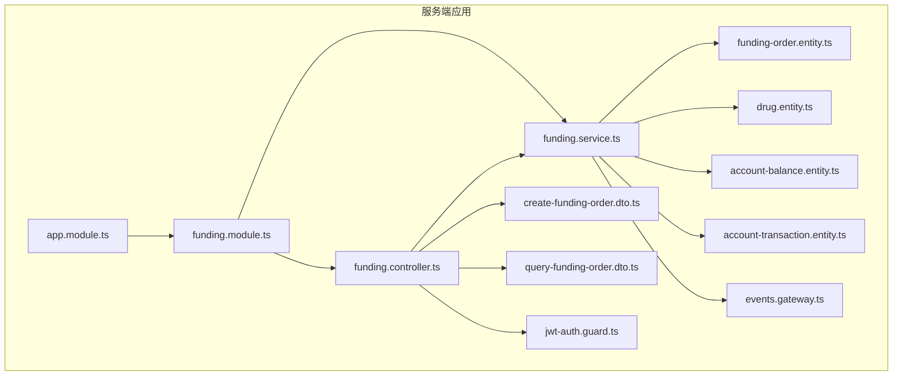
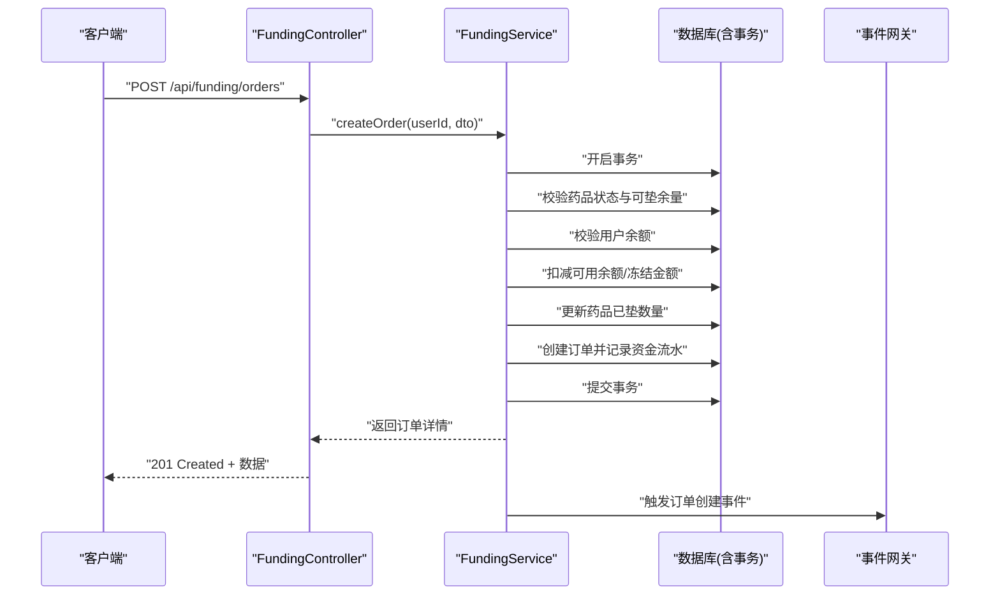
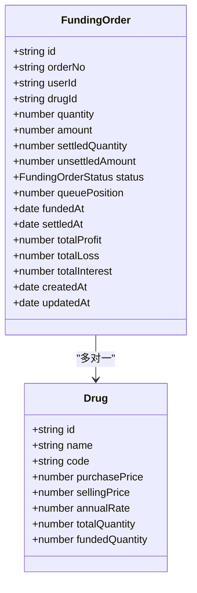
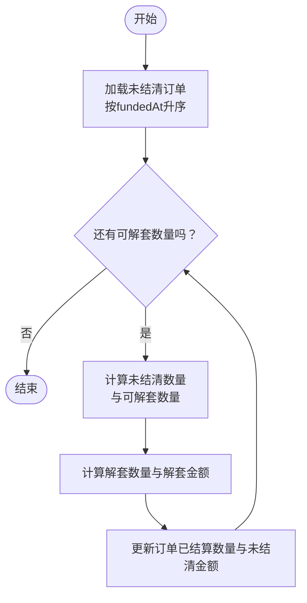
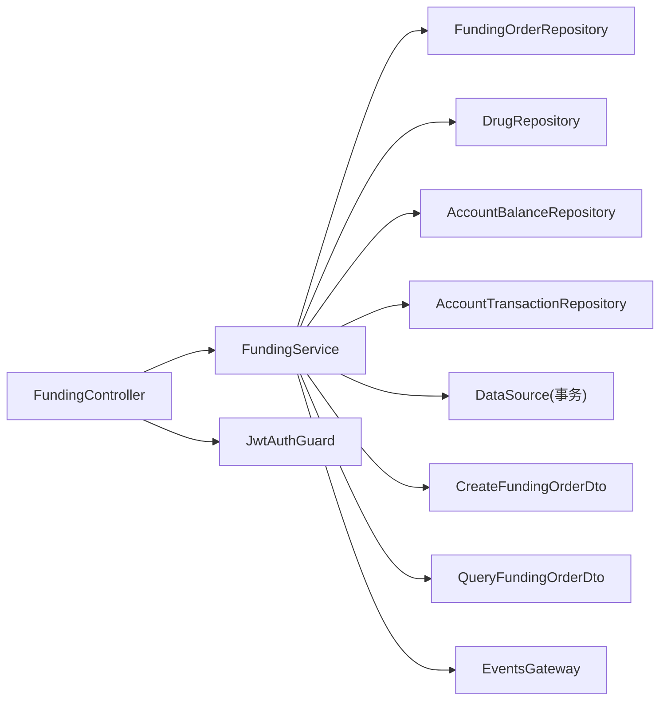
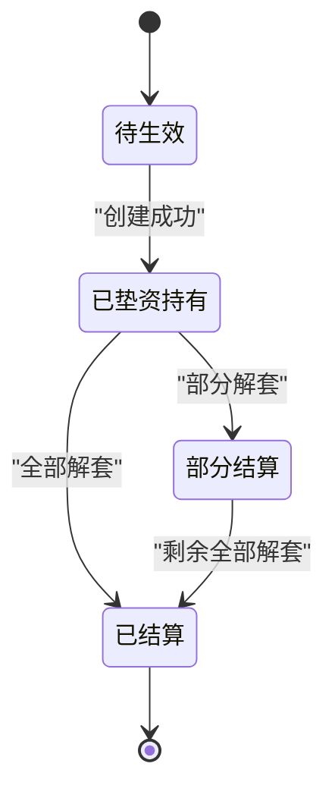

# 垫资交易接口

<cite>
**本文引用的文件**
- [packages/server/src/modules/funding/funding.controller.ts](file://packages/server/src/modules/funding/funding.controller.ts)
- [packages/server/src/modules/funding/funding.service.ts](file://packages/server/src/modules/funding/funding.service.ts)
- [packages/server/src/modules/funding/funding.module.ts](file://packages/server/src/modules/funding/funding.module.ts)
- [packages/server/src/modules/funding/dto/create-funding-order.dto.ts](file://packages/server/src/modules/funding/dto/create-funding-order.dto.ts)
- [packages/server/src/modules/funding/dto/query-funding-order.dto.ts](file://packages/server/src/modules/funding/dto/query-funding-order.dto.ts)
- [packages/server/src/database/entities/funding-order.entity.ts](file://packages/server/src/database/entities/funding-order.entity.ts)
- [packages/server/src/database/entities/drug.entity.ts](file://packages/server/src/database/entities/drug.entity.ts)
- [packages/server/src/database/entities/account-balance.entity.ts](file://packages/server/src/database/entities/account-balance.entity.ts)
- [packages/server/src/database/entities/account-transaction.entity.ts](file://packages/server/src/database/entities/account-transaction.entity.ts)
- [packages/server/src/common/guards/jwt-auth.guard.ts](file://packages/server/src/common/guards/jwt-auth.guard.ts)
- [packages/server/src/common/decorators/roles.decorator.ts](file://packages/server/src/common/decorators/roles.decorator.ts)
- [packages/server/src/common/guards/admin.guard.ts](file://packages/server/src/common/guards/admin.guard.ts)
- [packages/server/src/common/events/events.gateway.ts](file://packages/server/src/common/events/events.gateway.ts)
- [packages/server/src/common/events/events.module.ts](file://packages/server/src/common/events/events.module.ts)
- [packages/server/src/database/data-source.ts](file://packages/server/src/database/data-source.ts)
- [packages/server/src/database/database.module.ts](file://packages/server/src/database/database.module.ts)
- [packages/server/src/app.module.ts](file://packages/server/src/app.module.ts)
- [package.json](file://package.json)
- [pnpm-workspace.yaml](file://pnpm-workspace.yaml)
</cite>

## 目录
1. [简介](#简介)
2. [项目结构](#项目结构)
3. [核心组件](#核心组件)
4. [架构概览](#架构概览)
5. [详细组件分析](#详细组件分析)
6. [依赖关系分析](#依赖关系分析)
7. [性能考虑](#性能考虑)
8. [故障排查指南](#故障排查指南)
9. [结论](#结论)
10. [附录](#附录)

## 简介
本文件为“垫资交易模块”的完整API文档，覆盖垫资订单的创建、查询、队列与统计等接口；阐述订单撮合与利息计算的业务逻辑；明确订单状态流转与执行进度跟踪；给出参数校验规则与分页查询规范；并说明风险控制、限额管理与合规检查的接口实现思路。文档同时包含订单执行通知、状态推送与异常处理机制的设计建议。

## 项目结构
垫资交易模块位于服务端工程 packages/server 的 modules/funding 目录下，采用 NestJS 模块化设计，配合 TypeORM 实体与 DTO 校验，形成清晰的分层架构。

图表来源
- [packages/server/src/app.module.ts](file://packages/server/src/app.module.ts)
- [packages/server/src/modules/funding/funding.module.ts](file://packages/server/src/modules/funding/funding.module.ts)
- [packages/server/src/modules/funding/funding.controller.ts](file://packages/server/src/modules/funding/funding.controller.ts)
- [packages/server/src/modules/funding/funding.service.ts](file://packages/server/src/modules/funding/funding.service.ts)
- [packages/server/src/modules/funding/dto/create-funding-order.dto.ts](file://packages/server/src/modules/funding/dto/create-funding-order.dto.ts)
- [packages/server/src/modules/funding/dto/query-funding-order.dto.ts](file://packages/server/src/modules/funding/dto/query-funding-order.dto.ts)
- [packages/server/src/database/entities/funding-order.entity.ts](file://packages/server/src/database/entities/funding-order.entity.ts)
- [packages/server/src/database/entities/drug.entity.ts](file://packages/server/src/database/entities/drug.entity.ts)
- [packages/server/src/database/entities/account-balance.entity.ts](file://packages/server/src/database/entities/account-balance.entity.ts)
- [packages/server/src/database/entities/account-transaction.entity.ts](file://packages/server/src/database/entities/account-transaction.entity.ts)
- [packages/server/src/common/guards/jwt-auth.guard.ts](file://packages/server/src/common/guards/jwt-auth.guard.ts)
- [packages/server/src/common/events/events.gateway.ts](file://packages/server/src/common/events/events.gateway.ts)

章节来源
- [packages/server/src/app.module.ts](file://packages/server/src/app.module.ts)
- [packages/server/src/modules/funding/funding.module.ts](file://packages/server/src/modules/funding/funding.module.ts)
- [pnpm-workspace.yaml](file://pnpm-workspace.yaml)
- [package.json](file://package.json)

## 核心组件
- 控制器（FundingController）：暴露REST接口，负责路由与鉴权。
- 服务（FundingService）：实现业务逻辑，包括订单创建、查询、队列与统计。
- DTO：输入参数校验与类型约束。
- 实体：数据库映射，定义订单状态、金额、数量等字段。
- 鉴权：JWT守卫保障接口访问安全。
- 事件网关：用于订单执行通知与状态推送。

章节来源
- [packages/server/src/modules/funding/funding.controller.ts](file://packages/server/src/modules/funding/funding.controller.ts)
- [packages/server/src/modules/funding/funding.service.ts](file://packages/server/src/modules/funding/funding.service.ts)
- [packages/server/src/modules/funding/dto/create-funding-order.dto.ts](file://packages/server/src/modules/funding/dto/create-funding-order.dto.ts)
- [packages/server/src/modules/funding/dto/query-funding-order.dto.ts](file://packages/server/src/modules/funding/dto/query-funding-order.dto.ts)
- [packages/server/src/database/entities/funding-order.entity.ts](file://packages/server/src/database/entities/funding-order.entity.ts)
- [packages/server/src/common/guards/jwt-auth.guard.ts](file://packages/server/src/common/guards/jwt-auth.guard.ts)
- [packages/server/src/common/events/events.gateway.ts](file://packages/server/src/common/events/events.gateway.ts)

## 架构概览
垫资交易模块遵循控制器-服务-仓储（TypeORM）三层架构，使用数据库事务确保一致性；通过DTO进行参数校验；通过JWT守卫保护接口；通过事件网关实现状态变更通知。

图表来源
- [packages/server/src/modules/funding/funding.controller.ts](file://packages/server/src/modules/funding/funding.controller.ts)
- [packages/server/src/modules/funding/funding.service.ts](file://packages/server/src/modules/funding/funding.service.ts)
- [packages/server/src/common/events/events.gateway.ts](file://packages/server/src/common/events/events.gateway.ts)

## 详细组件分析

### API接口清单与规范

- 基础路径
  - 前缀：/api/funding
  - 鉴权：均需携带有效JWT令牌（除公开接口外）

- 创建垫资订单
  - 方法：POST
  - 路径：/orders
  - 鉴权：是
  - 请求头：Content-Type: application/json
  - 请求体：CreateFundingOrderDto
  - 成功响应：201 Created，返回 { success: true, data, message }
  - 失败响应：400/401/403/404/500
  - 示例请求体路径：[create-funding-order.dto.ts](file://packages/server/src/modules/funding/dto/create-funding-order.dto.ts)

- 获取我的垫资订单列表
  - 方法：GET
  - 路径：/orders
  - 鉴权：是
  - 查询参数：QueryFundingOrderDto（status、drugId、page、pageSize）
  - 成功响应：200 OK，返回 { success: true, data: { list, pagination } }
  - 分页：pagination包含page、pageSize、total、totalPages
  - 示例请求体路径：[query-funding-order.dto.ts](file://packages/server/src/modules/funding/dto/query-funding-order.dto.ts)

- 获取订单详情
  - 方法：GET
  - 路径：/orders/{id}
  - 鉴权：是
  - 路径参数：id（UUID v4）
  - 成功响应：200 OK，返回 { success: true, data }
  - 数据包含：订单基础信息、药品信息、持有天数、日估算收益等

- 当前持仓摘要
  - 方法：GET
  - 路径：/orders/active/summary
  - 鉴权：是
  - 成功响应：200 OK，返回 { success: true, data: { totalHoldingAmount, totalUnsettledPrincipal, holdingOrderCount, todayEstimatedProfit } }

- 获取某药品的垫资排队队列
  - 方法：GET
  - 路径：/queue/{drugId}
  - 鉴权：是
  - 路径参数：drugId（UUID v4）
  - 成功响应：200 OK，返回 { drugId, drugName, drugCode, purchasePrice, totalQuantity, fundedQuantity, remainingQuantity, queue[], queueDepth }

- 个人垫资统计
  - 方法：GET
  - 路径：/statistics
  - 鉴权：是
  - 成功响应：200 OK，返回 { totalFundingCount, totalFundingAmount, totalProfit, totalLoss, totalInterest, netProfit, averageHoldingDays }

- 某药品的我的持仓订单
  - 方法：GET
  - 路径：/holdings/{drugId}
  - 鉴权：是
  - 路径参数：drugId（UUID v4）
  - 成功响应：200 OK，返回订单数组（仅包含基础持仓信息）

章节来源
- [packages/server/src/modules/funding/funding.controller.ts](file://packages/server/src/modules/funding/funding.controller.ts)
- [packages/server/src/modules/funding/dto/create-funding-order.dto.ts](file://packages/server/src/modules/funding/dto/create-funding-order.dto.ts)
- [packages/server/src/modules/funding/dto/query-funding-order.dto.ts](file://packages/server/src/modules/funding/dto/query-funding-order.dto.ts)

### 参数校验规则

- 创建订单（CreateFundingOrderDto）
  - drugId：UUID v4，必填
  - quantity：整数，≥1，必填

- 订单查询（QueryFundingOrderDto）
  - status：枚举值（可选），有效值来自 FundingOrderStatus
  - drugId：UUID v4（可选）
  - page：整数，≥1，默认1
  - pageSize：整数，≥1，默认10

章节来源
- [packages/server/src/modules/funding/dto/create-funding-order.dto.ts](file://packages/server/src/modules/funding/dto/create-funding-order.dto.ts)
- [packages/server/src/modules/funding/dto/query-funding-order.dto.ts](file://packages/server/src/modules/funding/dto/query-funding-order.dto.ts)

### 订单状态与数据模型

- 订单状态（FundingOrderStatus）
  - pending：待生效
  - holding：已垫资持有
  - partial_settled：部分结算
  - settled：已结算

- 关键字段
  - 订单编号（orderNo）、用户ID（userId）、药品ID（drugId）
  - 数量（quantity）、金额（amount）、未结算本金（unsettledAmount）
  - 已结算数量（settledQuantity）、状态（status）、排队序号（queuePosition）
  - 基金日期（fundedAt）、结算日期（settledAt）
  - 总收益/损失/利息（totalProfit、totalLoss、totalInterest）
  - 创建与更新时间（createdAt、updatedAt）

图表来源
- [packages/server/src/database/entities/funding-order.entity.ts](file://packages/server/src/database/entities/funding-order.entity.ts)
- [packages/server/src/database/entities/drug.entity.ts](file://packages/server/src/database/entities/drug.entity.ts)

章节来源
- [packages/server/src/database/entities/funding-order.entity.ts](file://packages/server/src/database/entities/funding-order.entity.ts)
- [packages/server/src/database/entities/drug.entity.ts](file://packages/server/src/database/entities/drug.entity.ts)

### 业务逻辑接口

- 订单创建流程
  - 校验药品状态与可垫余量
  - 校验用户余额
  - 扣减可用余额、冻结对应金额
  - 更新药品已垫数量
  - 创建订单并记录资金流水
  - 提交事务，返回订单详情

- 订单查询与分页
  - 支持按状态过滤
  - 支持按药品过滤
  - 支持分页（page、pageSize）
  - 返回列表与分页信息

- 队列与排队序号
  - 按最大排队序号+1分配
  - 支持查询某药品的排队队列（含累计金额）

- 统计与摘要
  - 当前持仓摘要：总持有金额、未结清本金、今日预估收益
  - 个人统计：总垫资次数、金额、总收益/损失/利息、净收益、平均持有天数
  - 某药品我的持仓：按入金时间倒序

- 利息计算（估算）
  - 日估算收益 = 未结清本金 × （年化利率 / 100 / 360）
  - 仅在持有状态下计算

章节来源
- [packages/server/src/modules/funding/funding.service.ts](file://packages/server/src/modules/funding/funding.service.ts)

### 订单撮合与价格匹配

- 撮合策略（基于现有实现）
  - FIFO（先进先出）：按 fundedAt 升序处理
  - 未结清订单范围：holding 与 partial_settled
  - 解套数量 = min(未结清数量, 销售数量)
  - 解套金额 = 解套数量 × 药品采购价
  - 更新订单的已结算数量与未结清金额

图表来源
- [packages/server/src/modules/settlement/settlement.service.ts](file://packages/server/src/modules/settlement/settlement.service.ts)

章节来源
- [packages/server/src/modules/settlement/settlement.service.ts](file://packages/server/src/modules/settlement/settlement.service.ts)

### 风险控制、限额管理与合规检查

- 现有实现要点
  - 药品状态校验：仅当状态为可垫资时允许下单
  - 可垫余量校验：剩余可垫数量必须 ≥ 下单数量
  - 用户余额校验：可用余额必须 ≥ 垫资金额
  - 数据库事务：确保资金与库存变动一致
  - 排队序号：避免并发导致的重复或错配

- 建议扩展（接口设计思路）
  - 限额管理接口：查询/设置用户/药品维度的垫资限额
  - 合规检查接口：校验用户是否满足垫资资格（如实名认证、风控等级）
  - 异常处理接口：记录风控拦截原因与处置结果

章节来源
- [packages/server/src/modules/funding/funding.service.ts](file://packages/server/src/modules/funding/funding.service.ts)

### 订单执行通知、状态推送与异常处理

- 事件网关
  - 通过事件网关发布订单状态变更事件，供前端或订阅者实时接收
  - 建议在订单创建、结算、状态变更时触发相应事件

- 异常处理
  - 400：参数错误、余额不足、可垫余量不足
  - 401：未授权（JWT无效）
  - 403：权限不足
  - 404：资源不存在（药品、订单）
  - 500：服务器内部错误（事务回滚后抛出）

章节来源
- [packages/server/src/common/events/events.gateway.ts](file://packages/server/src/common/events/events.gateway.ts)
- [packages/server/src/modules/funding/funding.service.ts](file://packages/server/src/modules/funding/funding.service.ts)

## 依赖关系分析

图表来源
- [packages/server/src/modules/funding/funding.controller.ts](file://packages/server/src/modules/funding/funding.controller.ts)
- [packages/server/src/modules/funding/funding.service.ts](file://packages/server/src/modules/funding/funding.service.ts)
- [packages/server/src/common/guards/jwt-auth.guard.ts](file://packages/server/src/common/guards/jwt-auth.guard.ts)
- [packages/server/src/common/events/events.gateway.ts](file://packages/server/src/common/events/events.gateway.ts)

章节来源
- [packages/server/src/modules/funding/funding.module.ts](file://packages/server/src/modules/funding/funding.module.ts)
- [packages/server/src/database/data-source.ts](file://packages/server/src/database/data-source.ts)
- [packages/server/src/database/database.module.ts](file://packages/server/src/database/database.module.ts)

## 性能考虑
- 数据库索引：实体已建立复合索引，有助于按药品、状态、入金时间查询
- 分页查询：服务端分页避免一次性返回大量数据
- 事务边界：订单创建与资金变动在同一事务内，减少锁竞争
- 排队序号：通过MAX(queuePosition)+1分配，避免高并发下的重复或冲突
- 计算优化：利息估算为纯内存计算，复杂度低

## 故障排查指南
- 创建失败（400）
  - 检查药品状态是否为可垫资
  - 检查可垫余量是否足够
  - 检查用户可用余额是否充足
- 查询异常（404）
  - 确认订单ID或药品ID是否正确
- 权限问题（401/403）
  - 确认JWT令牌有效且未过期
- 事务回滚
  - 查看服务端日志定位具体异常点

章节来源
- [packages/server/src/modules/funding/funding.service.ts](file://packages/server/src/modules/funding/funding.service.ts)
- [packages/server/src/common/guards/jwt-auth.guard.ts](file://packages/server/src/common/guards/jwt-auth.guard.ts)

## 结论
垫资交易模块提供了完整的订单生命周期管理能力，涵盖创建、查询、队列、统计与结算辅助功能。通过严格的参数校验、数据库事务与状态机设计，保障了业务一致性与安全性。建议后续完善限额管理与合规检查接口，并强化事件推送与异常监控体系。

## 附录

### 响应通用结构
- 成功响应：{ success: true, data, message? }
- 失败响应：{ success: false, code?, message }

### 订单状态流转图

[此图为概念性状态流转示意，不直接映射具体源码文件]