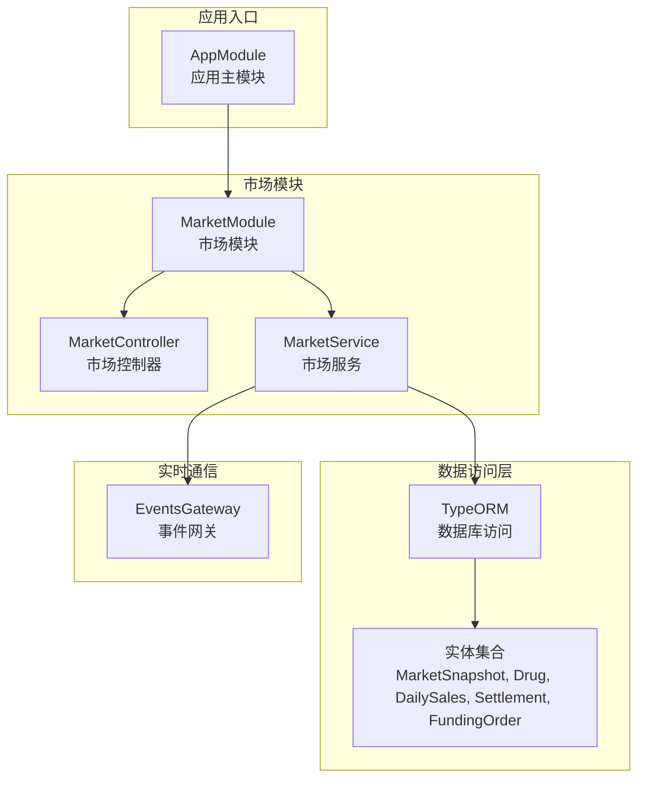
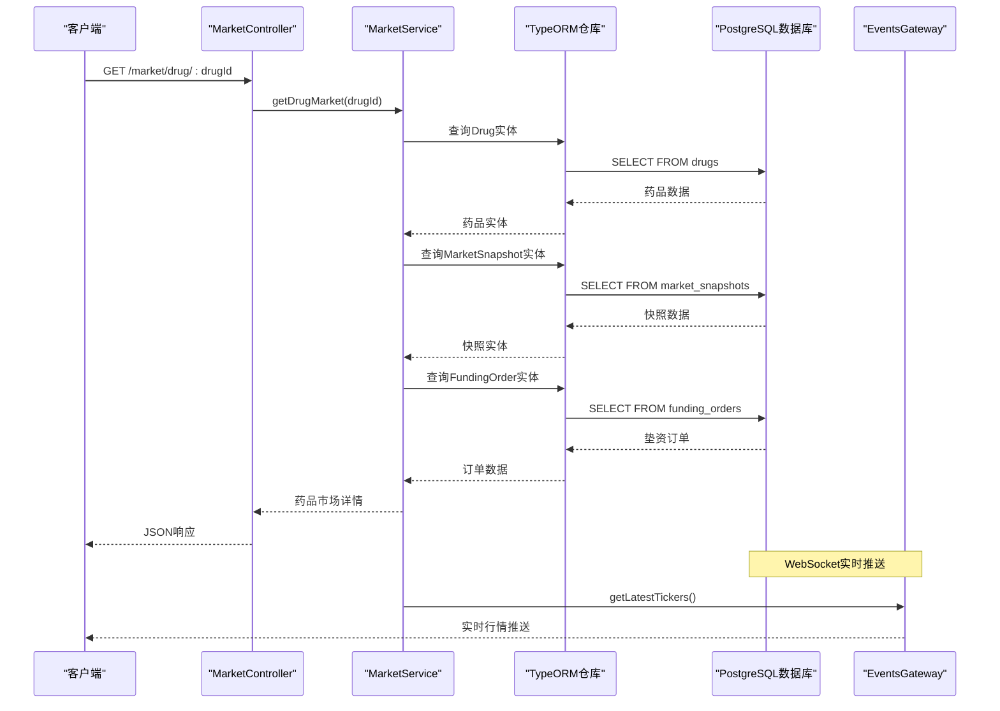
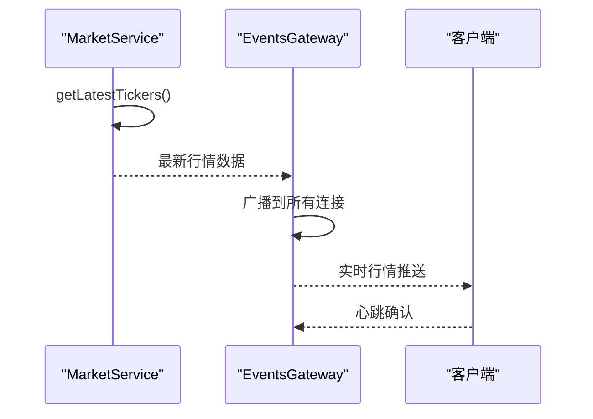
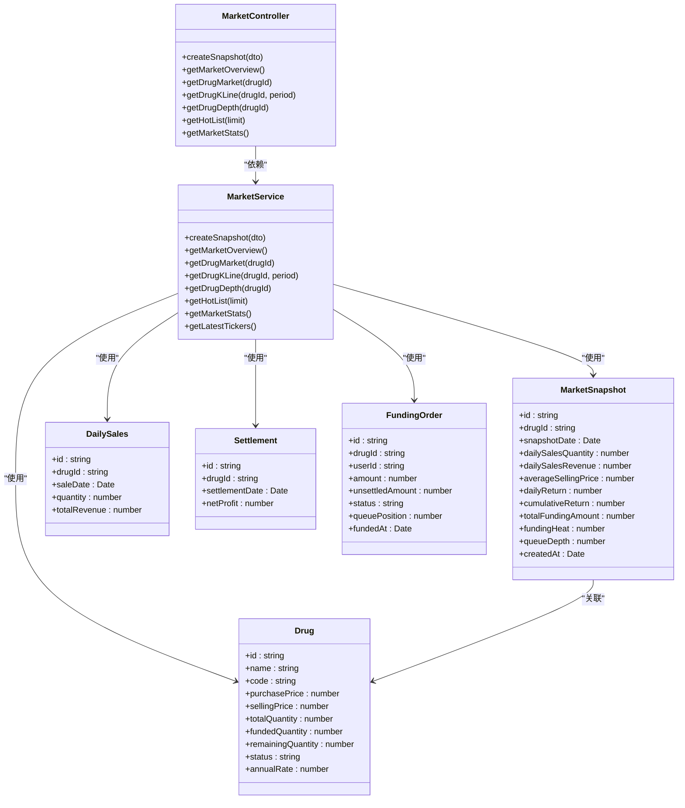

# 市场行情接口

<cite>
**本文引用的文件**
- [app.module.ts](file://packages/server/src/app.module.ts)
- [market.module.ts](file://packages/server/src/modules/market/market.module.ts)
- [market.controller.ts](file://packages/server/src/modules/market/market.controller.ts)
- [market.service.ts](file://packages/server/src/modules/market/market.service.ts)
- [query-kline.dto.ts](file://packages/server/src/modules/market/dto/query-kline.dto.ts)
- [market-snapshot.entity.ts](file://packages/server/src/database/entities/market-snapshot.entity.ts)
- [drug.entity.ts](file://packages/server/src/database/entities/drug.entity.ts)
- [daily-sales.entity.ts](file://packages/server/src/database/entities/daily-sales.entity.ts)
- [settlement.entity.ts](file://packages/server/src/database/entities/settlement.entity.ts)
- [funding-order.entity.ts](file://packages/server/src/database/entities/funding-order.entity.ts)
- [events.gateway.ts](file://packages/server/src/common/events/events.gateway.ts)
</cite>

## 目录
1. [简介](#简介)
2. [项目结构](#项目结构)
3. [核心组件](#核心组件)
4. [架构概览](#架构概览)
5. [详细组件分析](#详细组件分析)
6. [依赖关系分析](#依赖关系分析)
7. [性能考虑](#性能考虑)
8. [故障排除指南](#故障排除指南)
9. [结论](#结论)

## 简介
本文件为市场行情模块的完整API文档，涵盖实时行情、K线图、深度图等数据接口规范。文档详细说明了HTTP方法、URL路径、请求参数和响应格式，并解释了市场快照数据、价格序列、成交量等行情指标的获取方式。同时包含K线图的时间周期、数据点数量和精度控制说明，以及市场指数、涨跌幅、成交量等技术分析数据的接口规范。文档还提供了多品种、多市场的数据聚合和筛选查询功能说明，描述了数据更新频率、缓存策略和性能优化建议，并包含WebSocket实时推送和历史数据回放的接口说明。

## 项目结构
市场行情模块位于NestJS应用中，采用标准的分层架构设计。模块通过控制器暴露REST API，服务层处理业务逻辑，TypeORM实体负责数据持久化。



**图表来源**
- [app.module.ts:15-50](file://packages/server/src/app.module.ts#L15-L50)
- [market.module.ts:11-25](file://packages/server/src/modules/market/market.module.ts#L11-L25)

**章节来源**
- [app.module.ts:15-50](file://packages/server/src/app.module.ts#L15-L50)
- [market.module.ts:11-25](file://packages/server/src/modules/market/market.module.ts#L11-L25)

## 核心组件
市场行情模块由四个核心组件构成：控制器、服务、DTO和实体。控制器负责HTTP请求处理和响应封装；服务层实现具体的业务逻辑；DTO定义输入验证规则；实体映射数据库表结构。

**章节来源**
- [market.controller.ts:16-113](file://packages/server/src/modules/market/market.controller.ts#L16-L113)
- [market.service.ts:80-93](file://packages/server/src/modules/market/market.service.ts#L80-L93)
- [query-kline.dto.ts:10-14](file://packages/server/src/modules/market/dto/query-kline.dto.ts#L10-L14)

## 架构概览
市场行情模块采用典型的MVC架构模式，结合TypeORM进行数据持久化，通过WebSocket实现实时数据推送。



**图表来源**
- [market.controller.ts:50-58](file://packages/server/src/modules/market/market.controller.ts#L50-L58)
- [market.service.ts:287-327](file://packages/server/src/modules/market/market.service.ts#L287-L327)

## 详细组件分析

### REST API 接口规范

#### 1. 生成每日行情快照
- **HTTP方法**: POST
- **URL路径**: `/market/snapshot`
- **认证要求**: JWT认证 + 管理员角色
- **请求参数**: CreateSnapshotDto（包含drugId、snapshotDate）
- **响应格式**: 
  ```json
  {
    "success": true,
    "data": "MarketSnapshot对象",
    "message": "行情快照生成成功"
  }
  ```

#### 2. 获取市场总览
- **HTTP方法**: GET
- **URL路径**: `/market/overview`
- **认证要求**: JWT认证
- **请求参数**: 无
- **响应格式**: MarketOverviewItem数组

#### 3. 获取单药品行情详情
- **HTTP方法**: GET
- **URL路径**: `/market/drug/:drugId`
- **认证要求**: JWT认证
- **路径参数**: 
  - drugId: 药品唯一标识符
- **响应格式**: 
```json
{
  "success": true,
  "data": {
    "drug": "药品基本信息",
    "market": "市场快照数据",
    "fundingStats": "垫资统计信息"
  }
}
```

#### 4. 获取K线数据
- **HTTP方法**: GET
- **URL路径**: `/market/drug/:drugId/kline`
- **认证要求**: JWT认证
- **路径参数**: 
  - drugId: 药品唯一标识符
- **查询参数**:
  - period: 时间周期（可选，默认30天）
    - 7d: 7天
    - 30d: 30天（默认）
    - 90d: 90天
    - all: 全量数据
- **响应格式**: KLineData数组

#### 5. 获取垫资深度数据
- **HTTP方法**: GET
- **URL路径**: `/market/drug/:drugId/depth`
- **认证要求**: JWT认证
- **路径参数**: 
  - drugId: 药品唯一标识符
- **响应格式**: 
```json
{
  "ranges": [
    {
      "min": 0,
      "max": 5000,
      "label": "0-5千",
      "count": 0,
      "amount": 0
    }
  ],
  "totalAmount": 0,
  "totalCount": 0
}
```

#### 6. 获取热门药品排行
- **HTTP方法**: GET
- **URL路径**: `/market/hot-list`
- **认证要求**: JWT认证
- **查询参数**:
  - limit: 返回条数（可选，默认10）
- **响应格式**: MarketOverviewItem数组

#### 7. 获取平台全局统计
- **HTTP方法**: GET
- **URL路径**: `/market/stats`
- **认证要求**: JWT认证
- **请求参数**: 无
- **响应格式**: 
```json
{
  "totalDrugs": 0,
  "totalFundingAmount": 0,
  "totalSalesRevenue": 0,
  "totalSettlementCount": 0,
  "activeFunderCount": 0
}
```

**章节来源**
- [market.controller.ts:24-112](file://packages/server/src/modules/market/market.controller.ts#L24-L112)
- [query-kline.dto.ts:3-8](file://packages/server/src/modules/market/dto/query-kline.dto.ts#L3-L8)

### 数据模型定义

#### 市场快照实体 (MarketSnapshot)
| 字段名 | 类型 | 精度 | 描述 | 约束 |
|--------|------|------|------|------|
| id | UUID | - | 主键 | PK |
| drugId | UUID | - | 药品ID | FK |
| snapshotDate | Date | - | 快照日期 | - |
| dailySalesQuantity | Integer | - | 日销量 | - |
| dailySalesRevenue | Decimal | 12,2 | 日销售额 | - |
| averageSellingPrice | Decimal | 10,2 | 平均售价 | - |
| dailyReturn | Decimal | 8,4 | 日收益率(%) | - |
| cumulativeReturn | Decimal | 8,4 | 累计收益率(%) | - |
| totalFundingAmount | Decimal | 12,2 | 垫资总额 | - |
| fundingHeat | Integer | - | 垫资热度 | - |
| queueDepth | Integer | - | 排队深度 | - |
| createdAt | Timestamp | - | 创建时间 | - |

#### K线数据结构 (KLineData)
| 字段名 | 类型 | 精度 | 描述 |
|--------|------|------|------|
| date | String | - | 日期字符串(YYYY-MM-DD) |
| dailySalesQuantity | Integer | - | 日销量 |
| dailySalesRevenue | Decimal | 12,2 | 日销售额 |
| averageSellingPrice | Decimal | 10,2 | 平均售价 |
| dailyReturn | Decimal | 8,4 | 日收益率(%) |
| totalFundingAmount | Decimal | 12,2 | 垫资总额 |

#### 市场概览项 (MarketOverviewItem)
| 字段名 | 类型 | 精度 | 描述 |
|--------|------|------|------|
| drugId | String | - | 药品ID |
| drugName | String | - | 药品名称 |
| drugCode | String | - | 药品编码 |
| purchasePrice | Number | - | 进货价 |
| sellingPrice | Number | - | 销售价 |
| dailySalesQuantity | Integer | - | 日销量 |
| dailySalesRevenue | Number | - | 日销售额 |
| averageSellingPrice | Number | - | 平均售价 |
| dailyReturn | Number | - | 日收益率(%) |
| cumulativeReturn | Number | - | 累计收益率(%) |
| totalFundingAmount | Number | - | 垫资总额 |
| fundingHeat | Integer | - | 垫资热度 |
| queueDepth | Integer | - | 排队深度 |
| snapshotDate | Date | - | 快照日期 |

**章节来源**
- [market-snapshot.entity.ts:12-54](file://packages/server/src/database/entities/market-snapshot.entity.ts#L12-L54)
- [market.service.ts:51-78](file://packages/server/src/modules/market/market.service.ts#L51-L78)

### WebSocket 实时推送

#### 实时行情推送
- **推送内容**: 所有药品的最新行情数据
- **推送字段**: drugId, drugName, drugCode, sellingPrice, dailyReturn, cumulativeReturn, fundingHeat
- **推送频率**: 基于定时任务触发
- **连接管理**: 通过EventsGateway实现WebSocket连接



**图表来源**
- [market.service.ts:474-496](file://packages/server/src/modules/market/market.service.ts#L474-L496)
- [events.gateway.ts](file://packages/server/src/common/events/events.gateway.ts)

**章节来源**
- [market.service.ts:474-496](file://packages/server/src/modules/market/market.service.ts#L474-L496)

## 依赖关系分析



**图表来源**
- [market.controller.ts:13-19](file://packages/server/src/modules/market/market.controller.ts#L13-L19)
- [market.service.ts:82-93](file://packages/server/src/modules/market/market.service.ts#L82-L93)
- [market-snapshot.entity.ts:12-54](file://packages/server/src/database/entities/market-snapshot.entity.ts#L12-L54)

**章节来源**
- [market.module.ts:11-25](file://packages/server/src/modules/market/market.module.ts#L11-L25)

## 性能考虑

### 数据更新频率
- **行情快照生成**: 支持按日生成，可通过API手动触发
- **实时推送**: 基于定时任务，建议配置合理的推送间隔
- **K线数据**: 支持7天、30天、90天、全量四种时间周期

### 缓存策略
- **数据库索引**: MarketSnapshot实体在(drugId, snapshotDate)上建立复合索引
- **查询优化**: 使用TypeORM的批量查询和连接查询减少数据库往返
- **内存缓存**: 可考虑在应用层添加Redis缓存热点数据

### 性能优化建议
1. **批量查询**: 在getMarketOverview中使用循环批量查询，可考虑改为JOIN查询
2. **分页机制**: 对于大量数据的查询，建议实现分页功能
3. **异步处理**: 将耗时的数据计算操作放入后台任务
4. **连接池**: 配置合适的数据库连接池大小

**章节来源**
- [market-snapshot.entity.ts:13](file://packages/server/src/database/entities/market-snapshot.entity.ts#L13)
- [market.service.ts:221-282](file://packages/server/src/modules/market/market.service.ts#L221-L282)

## 故障排除指南

### 常见错误及解决方案

#### 1. 药品不存在
- **错误类型**: NotFoundException
- **触发场景**: 查询不存在的drugId
- **解决方案**: 验证drugId的有效性，提供默认值或错误提示

#### 2. 权限不足
- **错误类型**: UnauthorizedException
- **触发场景**: 非管理员用户调用/snapshot接口
- **解决方案**: 确保调用者具有ADMIN角色权限

#### 3. 数据库连接问题
- **症状**: 查询超时或连接失败
- **解决方案**: 检查数据库连接配置，增加连接池大小

### 监控指标
- **响应时间**: 记录各API的平均响应时间
- **错误率**: 监控各接口的错误发生频率
- **数据库性能**: 监控慢查询和连接数

**章节来源**
- [market.service.ts:98-107](file://packages/server/src/modules/market/market.service.ts#L98-L107)
- [market.controller.ts:25-27](file://packages/server/src/modules/market/market.controller.ts#L25-L27)

## 结论
市场行情模块提供了完整的市场数据服务，包括实时行情、历史K线、深度数据等功能。通过清晰的API设计和合理的数据模型，实现了多品种、多市场的数据聚合和查询。建议在生产环境中实施适当的缓存策略和监控机制，以确保系统的高性能和稳定性。WebSocket实时推送功能为用户提供及时的市场动态，配合REST API满足不同场景下的数据需求。