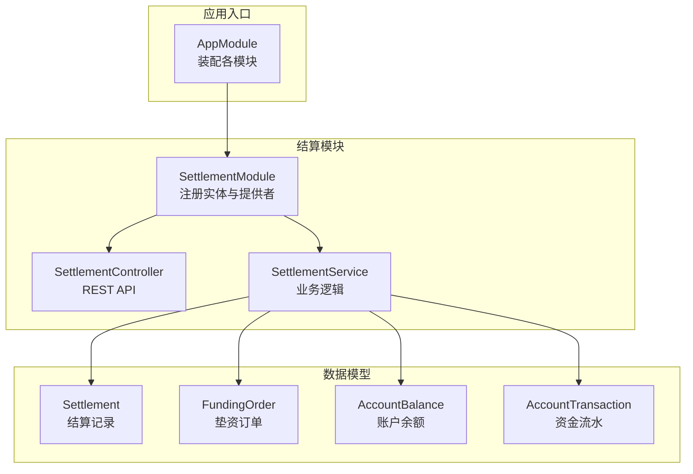
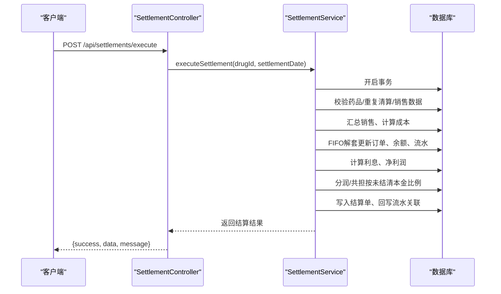
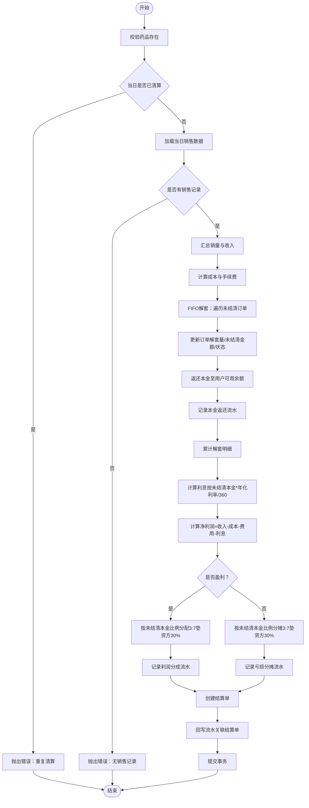
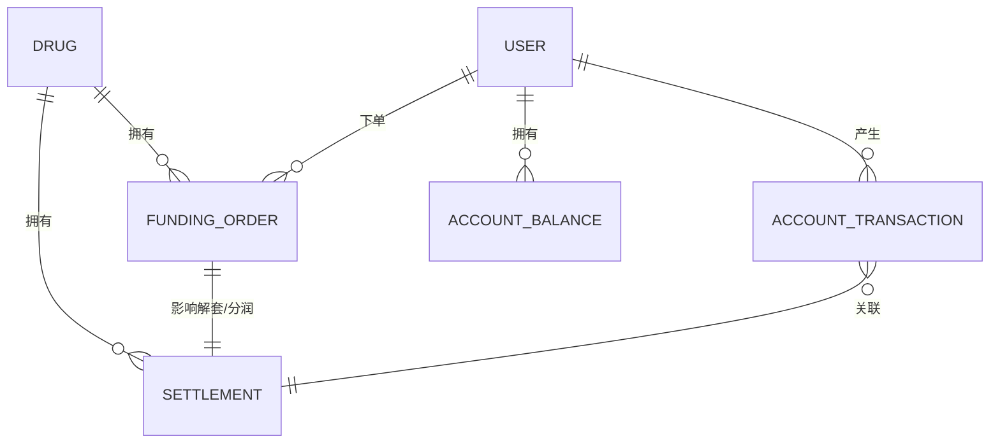
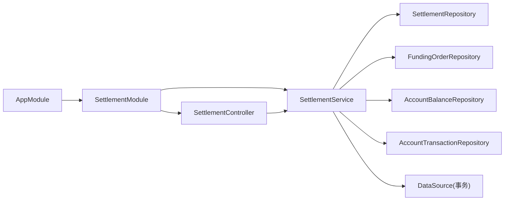

# 清算结算接口

<cite>
**本文引用的文件**
- [packages/server/src/app.module.ts](file://packages/server/src/app.module.ts)
- [packages/server/src/modules/settlement/settlement.controller.ts](file://packages/server/src/modules/settlement/settlement.controller.ts)
- [packages/server/src/modules/settlement/settlement.service.ts](file://packages/server/src/modules/settlement/settlement.service.ts)
- [packages/server/src/modules/settlement/settlement.module.ts](file://packages/server/src/modules/settlement/settlement.module.ts)
- [packages/server/src/modules/settlement/dto/execute-settlement.dto.ts](file://packages/server/src/modules/settlement/dto/execute-settlement.dto.ts)
- [packages/server/src/modules/settlement/dto/query-settlement.dto.ts](file://packages/server/src/modules/settlement/dto/query-settlement.dto.ts)
- [packages/server/src/database/entities/settlement.entity.ts](file://packages/server/src/database/entities/settlement.entity.ts)
- [packages/server/src/database/entities/funding-order.entity.ts](file://packages/server/src/database/entities/funding-order.entity.ts)
- [packages/server/src/database/entities/account-transaction.entity.ts](file://packages/server/src/database/entities/account-transaction.entity.ts)
- [packages/server/src/database/entities/account-balance.entity.ts](file://packages/server/src/database/entities/account-balance.entity.ts)
</cite>

## 目录
1. [简介](#简介)
2. [项目结构](#项目结构)
3. [核心组件](#核心组件)
4. [架构概览](#架构概览)
5. [详细组件分析](#详细组件分析)
6. [依赖分析](#依赖分析)
7. [性能考虑](#性能考虑)
8. [故障排查指南](#故障排查指南)
9. [结论](#结论)
10. [附录](#附录)

## 简介
本文件为“清算结算模块”的完整API文档，覆盖日常结算、资金划转、利息分配、FIFO解套算法、成本核算与收益分配等核心业务逻辑，并给出结算周期、对账流程、异常处理机制、结算报表、资金流水、税务处理、批量结算、手动干预与重算、风控与合规、监管报告以及结算进度跟踪与历史追溯的接口规范。

## 项目结构
- 后端采用 NestJS 架构，通过 AppModule 统一装配模块，其中 SettlementModule 负责清算结算相关能力。
- 数据模型由 TypeORM 实体定义，涵盖结算记录、垫资订单、账户余额与资金流水等。
- 控制器层提供 REST API，服务层封装业务流程，DTO 层负责输入校验。

**图表来源**
- [packages/server/src/app.module.ts:15-49](file://packages/server/src/app.module.ts#L15-L49)
- [packages/server/src/modules/settlement/settlement.module.ts:12-26](file://packages/server/src/modules/settlement/settlement.module.ts#L12-L26)

**章节来源**
- [packages/server/src/app.module.ts:15-49](file://packages/server/src/app.module.ts#L15-L49)
- [packages/server/src/modules/settlement/settlement.module.ts:12-26](file://packages/server/src/modules/settlement/settlement.module.ts#L12-L26)

## 核心组件
- SettlementController：提供执行日清日结、预览、汇总统计、个人记录与详情查询等接口。
- SettlementService：实现完整的7步清算流程（汇总销售、计算成本、FIFO解套、计息、净利润、分润/共担、生成结算单），并支持预览、列表与详情查询。
- DTO：对请求参数进行严格校验（UUID、日期、分页等）。
- 实体：Settlement、FundingOrder、AccountBalance、AccountTransaction。

**章节来源**
- [packages/server/src/modules/settlement/settlement.controller.ts:24-151](file://packages/server/src/modules/settlement/settlement.controller.ts#L24-L151)
- [packages/server/src/modules/settlement/settlement.service.ts:32-472](file://packages/server/src/modules/settlement/settlement.service.ts#L32-L472)
- [packages/server/src/modules/settlement/dto/execute-settlement.dto.ts:7-15](file://packages/server/src/modules/settlement/dto/execute-settlement.dto.ts#L7-L15)
- [packages/server/src/modules/settlement/dto/query-settlement.dto.ts:10-42](file://packages/server/src/modules/settlement/dto/query-settlement.dto.ts#L10-L42)
- [packages/server/src/database/entities/settlement.entity.ts:18-76](file://packages/server/src/database/entities/settlement.entity.ts#L18-L76)
- [packages/server/src/database/entities/funding-order.entity.ts:21-86](file://packages/server/src/database/entities/funding-order.entity.ts#L21-L86)
- [packages/server/src/database/entities/account-balance.entity.ts:11-37](file://packages/server/src/database/entities/account-balance.entity.ts#L11-L37)
- [packages/server/src/database/entities/account-transaction.entity.ts:22-61](file://packages/server/src/database/entities/account-transaction.entity.ts#L22-L61)

## 架构概览
- 控制器层：暴露REST接口，鉴权与角色控制由守卫完成；返回统一结构 { success, data, message? }。
- 服务层：核心业务在数据库事务中执行，确保原子性；涉及销售汇总、成本计算、FIFO解套、利息计算、分润/共担、结算单生成与资金流水写入。
- 数据层：通过 TypeORM 实体与仓储操作，使用悲观锁保障并发一致性。

**图表来源**
- [packages/server/src/modules/settlement/settlement.controller.ts:32-46](file://packages/server/src/modules/settlement/settlement.controller.ts#L32-L46)
- [packages/server/src/modules/settlement/settlement.service.ts:54-472](file://packages/server/src/modules/settlement/settlement.service.ts#L54-L472)

## 详细组件分析

### 接口总览
- 执行日清日结（管理员）
  - 方法：POST
  - 路径：/api/settlements/execute
  - 权限：管理员
  - 请求体：ExecuteSettlementDto（drugId、settlementDate）
  - 响应：{ success: true, data: 结算结果, message: "清算执行成功" }
- 清算预览（管理员）
  - 方法：GET
  - 路径：/api/settlements/preview
  - 权限：管理员
  - 查询参数：SettlementPreviewQueryDto（drugId、date）
  - 响应：{ success: true, data: 预览结果 }
- 清算汇总统计（管理员）
  - 方法：GET
  - 路径：/api/settlements/summary/all
  - 权限：管理员
  - 响应：{ success: true, data: 汇总统计 }
- 我的清算记录（垫资方）
  - 方法：GET
  - 路径：/api/settlements/my/list
  - 权限：垫资方（JWT）
  - 查询参数：QuerySettlementDto（drugId、startDate、endDate、page、pageSize）
  - 响应：{ success: true, data: 列表与分页 }
- 我的清算统计（垫资方）
  - 方法：GET
  - 路径：/api/settlements/my/stats
  - 权限：垫资方（JWT）
  - 响应：{ success: true, data: 统计 }
- 清算记录列表（管理员）
  - 方法：GET
  - 路径：/api/settlements
  - 权限：管理员
  - 查询参数：QuerySettlementDto（drugId、startDate、endDate、page、pageSize）
  - 响应：{ success: true, data: 列表与分页 }
- 清算详情（管理员/垫资方）
  - 方法：GET
  - 路径：/api/settlements/:id
  - 权限：管理员/JWT
  - 参数：id（UUID v4）
  - 响应：{ success: true, data: 结算详情 + 订单明细 + 流水 }

**章节来源**
- [packages/server/src/modules/settlement/settlement.controller.ts:32-149](file://packages/server/src/modules/settlement/settlement.controller.ts#L32-L149)
- [packages/server/src/modules/settlement/dto/execute-settlement.dto.ts:7-15](file://packages/server/src/modules/settlement/dto/execute-settlement.dto.ts#L7-L15)
- [packages/server/src/modules/settlement/dto/query-settlement.dto.ts:10-42](file://packages/server/src/modules/settlement/dto/query-settlement.dto.ts#L10-L42)

### 执行日清日结（管理员）
- 功能：按日对某药品进行结算，包含销售汇总、成本计算、FIFO解套、计息、净利润、分润/共担与结算单生成。
- 输入校验：drugId（UUID v4）、settlementDate（日期字符串）。
- 并发与一致性：使用数据库事务与悲观锁，确保销售、订单、余额与流水的一致性。
- 输出：返回结算单与订单解套明细（含每笔订单的解套本金、利润分成、亏损分摊）。

**图表来源**
- [packages/server/src/modules/settlement/settlement.service.ts:54-472](file://packages/server/src/modules/settlement/settlement.service.ts#L54-L472)

**章节来源**
- [packages/server/src/modules/settlement/settlement.controller.ts:32-46](file://packages/server/src/modules/settlement/settlement.controller.ts#L32-L46)
- [packages/server/src/modules/settlement/settlement.service.ts:54-472](file://packages/server/src/modules/settlement/settlement.service.ts#L54-L472)

### 清算预览（管理员）
- 功能：在执行清算前，预估当日销售、成本、利息、净利润与分润/共担分配。
- 输入：drugId、date。
- 输出：包含销售汇总、成本汇总、预计解套清单、剩余未解套数量、预计利润（是否盈利及双方分摊额）。

**章节来源**
- [packages/server/src/modules/settlement/settlement.controller.ts:52-64](file://packages/server/src/modules/settlement/settlement.controller.ts#L52-L64)
- [packages/server/src/modules/settlement/settlement.service.ts:477-631](file://packages/server/src/modules/settlement/settlement.service.ts#L477-L631)

### 清算汇总统计（管理员）
- 功能：提供全局或按条件的结算统计信息（如总次数、总净利等）。
- 输出：汇总统计对象（具体字段见服务实现）。

**章节来源**
- [packages/server/src/modules/settlement/settlement.controller.ts:70-79](file://packages/server/src/modules/settlement/settlement.controller.ts#L70-L79)
- [packages/server/src/modules/settlement/settlement.service.ts:796-800](file://packages/server/src/modules/settlement/settlement.service.ts#L796-L800)

### 我的清算记录（垫资方）
- 功能：垫资方查看自己的结算记录，支持按药品、时间范围与分页查询。
- 权限：JWT 认证。
- 输出：列表与分页信息。

**章节来源**
- [packages/server/src/modules/settlement/settlement.controller.ts:85-99](file://packages/server/src/modules/settlement/settlement.controller.ts#L85-L99)
- [packages/server/src/modules/settlement/settlement.service.ts:636-708](file://packages/server/src/modules/settlement/settlement.service.ts#L636-L708)

### 我的清算统计（垫资方）
- 功能：垫资方查看自己的结算统计。
- 权限：JWT 认证。
- 输出：统计对象（具体字段见服务实现）。

**章节来源**
- [packages/server/src/modules/settlement/settlement.controller.ts:105-113](file://packages/server/src/modules/settlement/settlement.controller.ts#L105-L113)
- [packages/server/src/modules/settlement/settlement.service.ts:710-791](file://packages/server/src/modules/settlement/settlement.service.ts#L710-L791)

### 清算记录列表（管理员）
- 功能：管理员查看全量结算记录，支持按药品、时间范围与分页查询。
- 权限：管理员。
- 输出：列表与分页信息。

**章节来源**
- [packages/server/src/modules/settlement/settlement.controller.ts:119-133](file://packages/server/src/modules/settlement/settlement.controller.ts#L119-L133)
- [packages/server/src/modules/settlement/settlement.service.ts:636-708](file://packages/server/src/modules/settlement/settlement.service.ts#L636-L708)

### 清算详情（管理员/垫资方）
- 功能：查看某次结算的详细信息，包含结算单、订单明细与相关流水。
- 权限：管理员/JWT。
- 输出：结算单、订单明细、流水列表。

**章节来源**
- [packages/server/src/modules/settlement/settlement.controller.ts:139-149](file://packages/server/src/modules/settlement/settlement.controller.ts#L139-L149)
- [packages/server/src/modules/settlement/settlement.service.ts:713-791](file://packages/server/src/modules/settlement/settlement.service.ts#L713-L791)

### 数据模型与关系

**图表来源**
- [packages/server/src/database/entities/settlement.entity.ts:18-76](file://packages/server/src/database/entities/settlement.entity.ts#L18-L76)
- [packages/server/src/database/entities/funding-order.entity.ts:21-86](file://packages/server/src/database/entities/funding-order.entity.ts#L21-L86)
- [packages/server/src/database/entities/account-balance.entity.ts:11-37](file://packages/server/src/database/entities/account-balance.entity.ts#L11-L37)
- [packages/server/src/database/entities/account-transaction.entity.ts:22-61](file://packages/server/src/database/entities/account-transaction.entity.ts#L22-L61)

## 依赖分析
- 模块依赖：AppModule 引入 SettlementModule；SettlementModule 注册实体与提供者。
- 控制器依赖：SettlementController 依赖 SettlementService。
- 服务依赖：SettlementService 依赖多个实体仓储与 DataSource（事务）。
- DTO 依赖：类验证器与类型转换器。

**图表来源**
- [packages/server/src/app.module.ts:45-45](file://packages/server/src/app.module.ts#L45-L45)
- [packages/server/src/modules/settlement/settlement.module.ts:14-21](file://packages/server/src/modules/settlement/settlement.module.ts#L14-L21)
- [packages/server/src/modules/settlement/settlement.controller.ts:24-26](file://packages/server/src/modules/settlement/settlement.controller.ts#L24-L26)
- [packages/server/src/modules/settlement/settlement.service.ts:34-48](file://packages/server/src/modules/settlement/settlement.service.ts#L34-L48)

**章节来源**
- [packages/server/src/app.module.ts:45-45](file://packages/server/src/app.module.ts#L45-L45)
- [packages/server/src/modules/settlement/settlement.module.ts:14-21](file://packages/server/src/modules/settlement/settlement.module.ts#L14-L21)
- [packages/server/src/modules/settlement/settlement.controller.ts:24-26](file://packages/server/src/modules/settlement/settlement.controller.ts#L24-L26)
- [packages/server/src/modules/settlement/settlement.service.ts:34-48](file://packages/server/src/modules/settlement/settlement.service.ts#L34-L48)

## 性能考虑
- 数据库事务：所有结算步骤在单一事务内执行，避免中间态数据不一致，但需注意长事务对锁竞争的影响。
- 悲观锁：对销售、订单、余额等关键资源使用悲观写锁，降低并发冲突带来的风险。
- 分页查询：列表接口支持分页，建议前端按需拉取，避免一次性加载过多数据。
- 索引：实体已建立必要索引（如结算日期+药品、用户+时间等），有助于查询性能。
- 数值精度：金额字段使用 decimal(12,2)，计算中多次保留两位小数，减少累积误差。

[本节为通用性能建议，无需特定文件来源]

## 故障排查指南
- 常见错误类型与触发场景
  - 药品不存在：执行或预览时校验失败。
  - 当日已清算：重复执行同一日期的结算。
  - 无销售记录：当日无销售导致无法结算。
  - 参数校验失败：drugId 非 UUID、日期格式错误、分页参数非法。
- 错误处理策略
  - 控制器层统一返回 { success: false, message, data? }（根据实现调整）。
  - 服务层捕获异常后回滚事务，确保数据一致性。
  - 建议在网关或中间件层记录请求ID与上下文，便于定位问题。
- 排查步骤
  - 确认药品ID与日期有效且未重复。
  - 检查当日销售数据是否存在。
  - 查看结算单与相关流水，确认事务是否完整提交。
  - 关注数值精度与小数点处理，避免累计误差。

**章节来源**
- [packages/server/src/modules/settlement/settlement.service.ts:77-105](file://packages/server/src/modules/settlement/settlement.service.ts#L77-L105)
- [packages/server/src/modules/settlement/settlement.service.ts:464-472](file://packages/server/src/modules/settlement/settlement.service.ts#L464-L472)

## 结论
本模块提供了完整的日清日结能力，涵盖销售汇总、成本与费用计算、FIFO解套、利息与净利润计算、分润/共担、资金流水与结算单生成。通过严格的参数校验、数据库事务与悲观锁，保障了业务一致性与数据安全。建议在生产环境结合监控与告警体系，持续优化查询与事务性能。

[本节为总结性内容，无需特定文件来源]

## 附录

### API 规范汇总
- 执行日清日结（管理员）
  - 方法：POST
  - 路径：/api/settlements/execute
  - 请求体：{
      drugId: "UUID(v4)",
      settlementDate: "YYYY-MM-DD"
    }
  - 响应：{
      success: true,
      data: {
        settlement: "结算单",
        orderDetails: "解套明细数组"
      },
      message: "清算执行成功"
    }
- 清算预览（管理员）
  - 方法：GET
  - 路径：/api/settlements/preview
  - 查询参数：{
      drugId: "UUID(v4)",
      date: "YYYY-MM-DD"
    }
  - 响应：{
      success: true,
      data: "预览结果"
    }
- 清算汇总统计（管理员）
  - 方法：GET
  - 路径：/api/settlements/summary/all
  - 响应：{
      success: true,
      data: "汇总统计"
    }
- 我的清算记录（垫资方）
  - 方法：GET
  - 路径：/api/settlements/my/list
  - 查询参数：{
      drugId?: "UUID(v4)",
      startDate?: "YYYY-MM-DD",
      endDate?: "YYYY-MM-DD",
      page?: number,
      pageSize?: number
    }
  - 响应：{
      success: true,
      data: "列表与分页"
    }
- 我的清算统计（垫资方）
  - 方法：GET
  - 路径：/api/settlements/my/stats
  - 响应：{
      success: true,
      data: "统计"
    }
- 清算记录列表（管理员）
  - 方法：GET
  - 路径：/api/settlements
  - 查询参数：{
      drugId?: "UUID(v4)",
      startDate?: "YYYY-MM-DD",
      endDate?: "YYYY-MM-DD",
      page?: number,
      pageSize?: number
    }
  - 响应：{
      success: true,
      data: "列表与分页"
    }
- 清算详情（管理员/垫资方）
  - 方法：GET
  - 路径：/api/settlements/:id
  - 参数：{
      id: "UUID(v4)"
    }
  - 响应：{
      success: true,
      data: "结算详情 + 订单明细 + 流水"
    }

**章节来源**
- [packages/server/src/modules/settlement/settlement.controller.ts:32-149](file://packages/server/src/modules/settlement/settlement.controller.ts#L32-L149)
- [packages/server/src/modules/settlement/dto/execute-settlement.dto.ts:7-15](file://packages/server/src/modules/settlement/dto/execute-settlement.dto.ts#L7-L15)
- [packages/server/src/modules/settlement/dto/query-settlement.dto.ts:10-42](file://packages/server/src/modules/settlement/dto/query-settlement.dto.ts#L10-L42)

### 业务逻辑接口说明
- FIFO 解套算法
  - 按订单创建时间升序（最早下单优先）进行解套。
  - 计算每笔订单可解套数量与金额，更新订单状态与未结清金额。
  - 将解套本金返还至用户可用余额，并记录本金返还流水。
- 成本核算
  - 成本 = 销售数量 × 单位采购价；费用 = 销售数量 × 单位手续费。
- 收益分配
  - 净利润为正：按未结清本金比例分配，垫资方30%，平台70%。
  - 净利润为负：按未结清本金比例分摊，垫资方30%，平台70%。
- 利息分配
  - 日利息 = 未结清本金 × 年化利率 ÷ 100 ÷ 360。
- 对账与流水
  - 解套、分润、亏损均生成对应资金流水，支持按结算单回溯。
- 报表与统计
  - 支持按药品、日期范围查询结算列表与详情，支持汇总统计。
- 手动干预与重算
  - 可通过预览接口评估影响；若需重算，建议删除已有结算单并重新执行（需谨慎处理幂等与一致性）。
- 风控与合规
  - 通过权限守卫限制访问；对关键操作（执行结算）仅管理员可操作。
- 监管报告
  - 可基于结算单与流水导出监管所需字段（结算日期、药品、收入、成本、费用、利息、分润/共担、状态等）。
- 进度跟踪与历史追溯
  - 通过结算详情与流水可追踪每笔订单的解套、分润/分摊过程与余额变化。

**章节来源**
- [packages/server/src/modules/settlement/settlement.service.ts:126-426](file://packages/server/src/modules/settlement/settlement.service.ts#L126-L426)
- [packages/server/src/database/entities/account-transaction.entity.ts:12-20](file://packages/server/src/database/entities/account-transaction.entity.ts#L12-L20)