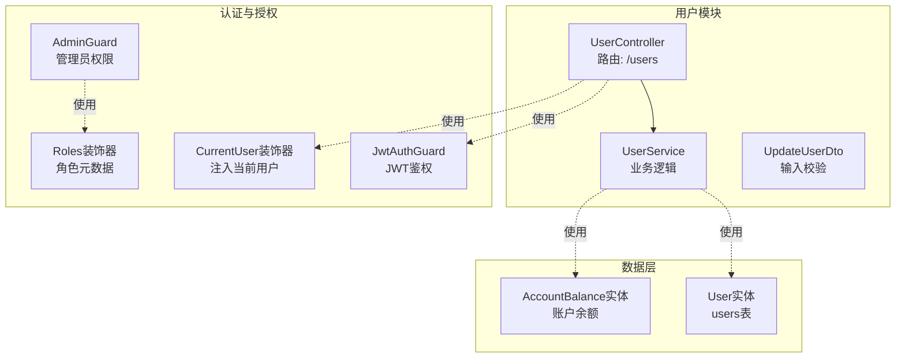
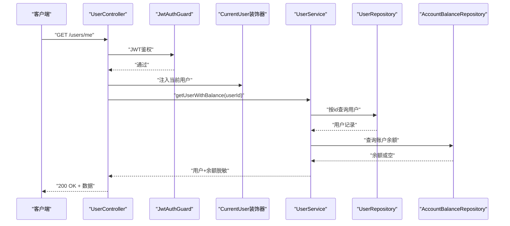
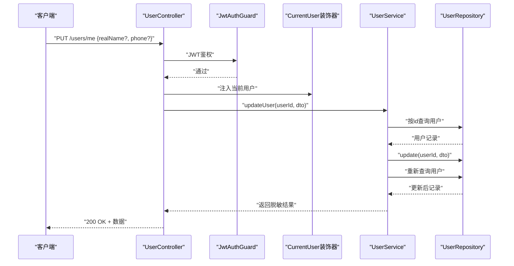
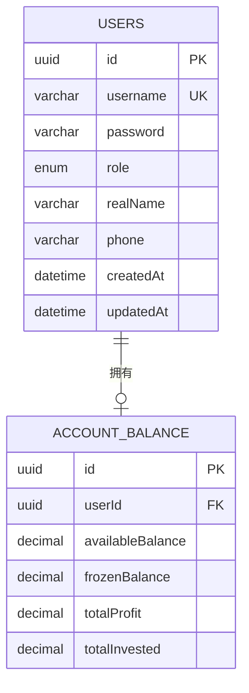
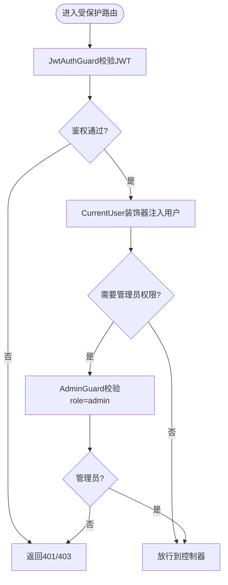
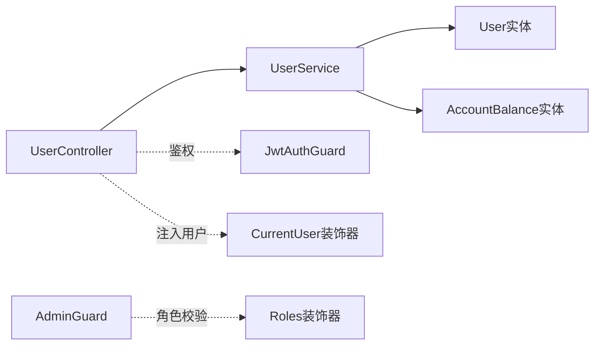

# 用户管理接口

<cite>
**本文引用的文件**
- [packages/server/src/modules/user/user.controller.ts](file://packages/server/src/modules/user/user.controller.ts)
- [packages/server/src/modules/user/user.service.ts](file://packages/server/src/modules/user/user.service.ts)
- [packages/server/src/modules/user/dto/update-user.dto.ts](file://packages/server/src/modules/user/dto/update-user.dto.ts)
- [packages/server/src/modules/user/user.module.ts](file://packages/server/src/modules/user/user.module.ts)
- [packages/server/src/database/entities/user.entity.ts](file://packages/server/src/database/entities/user.entity.ts)
- [packages/server/src/modules/auth/decorators/current-user.decorator.ts](file://packages/server/src/modules/auth/decorators/current-user.decorator.ts)
- [packages/server/src/modules/auth/guards/jwt-auth.guard.ts](file://packages/server/src/modules/auth/guards/jwt-auth.guard.ts)
- [packages/server/src/common/guards/admin.guard.ts](file://packages/server/src/common/guards/admin.guard.ts)
- [packages/server/src/common/decorators/roles.decorator.ts](file://packages/server/src/common/decorators/roles.decorator.ts)
</cite>

## 目录
1. [简介](#简介)
2. [项目结构](#项目结构)
3. [核心组件](#核心组件)
4. [架构总览](#架构总览)
5. [详细组件分析](#详细组件分析)
6. [依赖关系分析](#依赖关系分析)
7. [性能考虑](#性能考虑)
8. [故障排查指南](#故障排查指南)
9. [结论](#结论)
10. [附录](#附录)

## 简介
本文件为用户管理模块的完整API文档，覆盖用户信息查询与更新能力，并对当前仓库中已实现的功能进行准确说明。根据现有代码，用户管理模块提供以下能力：
- 获取当前登录用户信息（含账户余额）
- 更新当前登录用户的实名与手机号
- 基于JWT的身份验证与权限控制
- 管理员角色校验（用于后续扩展）

注意：当前仓库未实现“删除用户”、“头像上传”、“密码修改”、“批量操作”、“分页查询”等接口；本文档仅基于实际实现进行说明。

## 项目结构
用户管理模块位于服务端工程的 modules/user 目录下，采用NestJS标准分层设计：
- 控制器（Controller）：对外暴露REST接口
- 服务（Service）：封装业务逻辑与数据访问
- DTO：输入参数的数据传输对象
- 实体（Entity）：数据库映射模型
- 装饰器与守卫：鉴权与权限控制

图表来源
- [packages/server/src/modules/user/user.controller.ts:1-26](file://packages/server/src/modules/user/user.controller.ts#L1-L26)
- [packages/server/src/modules/user/user.service.ts:1-66](file://packages/server/src/modules/user/user.service.ts#L1-L66)
- [packages/server/src/modules/user/dto/update-user.dto.ts:1-14](file://packages/server/src/modules/user/dto/update-user.dto.ts#L1-L14)
- [packages/server/src/modules/auth/guards/jwt-auth.guard.ts:1-6](file://packages/server/src/modules/auth/guards/jwt-auth.guard.ts#L1-L6)
- [packages/server/src/modules/auth/decorators/current-user.decorator.ts:1-11](file://packages/server/src/modules/auth/decorators/current-user.decorator.ts#L1-L11)
- [packages/server/src/common/guards/admin.guard.ts:1-32](file://packages/server/src/common/guards/admin.guard.ts#L1-L32)
- [packages/server/src/common/decorators/roles.decorator.ts:1-6](file://packages/server/src/common/decorators/roles.decorator.ts#L1-L6)
- [packages/server/src/database/entities/user.entity.ts:1-58](file://packages/server/src/database/entities/user.entity.ts#L1-L58)

章节来源
- [packages/server/src/modules/user/user.controller.ts:1-26](file://packages/server/src/modules/user/user.controller.ts#L1-L26)
- [packages/server/src/modules/user/user.service.ts:1-66](file://packages/server/src/modules/user/user.service.ts#L1-L66)
- [packages/server/src/modules/user/user.module.ts:1-15](file://packages/server/src/modules/user/user.module.ts#L1-L15)

## 核心组件
- 用户控制器（UserController）
  - 提供 /users/me 的GET与PUT接口，均需通过JWT鉴权
  - GET用于获取当前用户信息（含账户余额），PUT用于更新当前用户资料
- 用户服务（UserService）
  - 查询用户与账户余额，返回脱敏后的用户信息（不含密码）
  - 更新用户资料并返回脱敏结果
- 输入DTO（UpdateUserDto）
  - 对realName与phone字段进行可选、字符串与长度校验
- 实体（User）
  - 定义用户字段、枚举角色、关联账户余额与资金流水等

章节来源
- [packages/server/src/modules/user/user.controller.ts:1-26](file://packages/server/src/modules/user/user.controller.ts#L1-L26)
- [packages/server/src/modules/user/user.service.ts:1-66](file://packages/server/src/modules/user/user.service.ts#L1-L66)
- [packages/server/src/modules/user/dto/update-user.dto.ts:1-14](file://packages/server/src/modules/user/dto/update-user.dto.ts#L1-L14)
- [packages/server/src/database/entities/user.entity.ts:1-58](file://packages/server/src/database/entities/user.entity.ts#L1-L58)

## 架构总览
用户管理模块遵循NestJS典型架构：控制器负责路由与参数解析，服务封装业务，TypeORM实体映射数据库。鉴权通过JWT守卫与当前用户装饰器实现，管理员权限通过独立守卫与角色装饰器实现。

图表来源
- [packages/server/src/modules/user/user.controller.ts:11-15](file://packages/server/src/modules/user/user.controller.ts#L11-L15)
- [packages/server/src/modules/user/user.service.ts:21-45](file://packages/server/src/modules/user/user.service.ts#L21-L45)
- [packages/server/src/modules/auth/guards/jwt-auth.guard.ts:1-6](file://packages/server/src/modules/auth/guards/jwt-auth.guard.ts#L1-L6)
- [packages/server/src/modules/auth/decorators/current-user.decorator.ts:1-11](file://packages/server/src/modules/auth/decorators/current-user.decorator.ts#L1-L11)

## 详细组件分析

### 接口定义与调用流程

- 获取当前用户信息
  - 方法与路径：GET /users/me
  - 鉴权要求：JWT
  - 请求参数：无
  - 响应内容：包含用户基本信息与账户余额的对象（密码字段不返回）
  - 失败场景：用户不存在时返回错误
  - 参考实现位置：
    - [packages/server/src/modules/user/user.controller.ts:11-15](file://packages/server/src/modules/user/user.controller.ts#L11-L15)
    - [packages/server/src/modules/user/user.service.ts:21-45](file://packages/server/src/modules/user/user.service.ts#L21-L45)

- 更新当前用户资料
  - 方法与路径：PUT /users/me
  - 鉴权要求：JWT
  - 请求体：UpdateUserDto（可选字段realName、phone）
  - 响应内容：更新后的用户对象（密码字段不返回）
  - 失败场景：用户不存在时返回错误
  - 参考实现位置：
    - [packages/server/src/modules/user/user.controller.ts:17-24](file://packages/server/src/modules/user/user.controller.ts#L17-L24)
    - [packages/server/src/modules/user/user.service.ts:47-64](file://packages/server/src/modules/user/user.service.ts#L47-L64)
    - [packages/server/src/modules/user/dto/update-user.dto.ts:1-14](file://packages/server/src/modules/user/dto/update-user.dto.ts#L1-L14)

图表来源
- [packages/server/src/modules/user/user.controller.ts:17-24](file://packages/server/src/modules/user/user.controller.ts#L17-L24)
- [packages/server/src/modules/user/user.service.ts:47-64](file://packages/server/src/modules/user/user.service.ts#L47-L64)
- [packages/server/src/modules/auth/guards/jwt-auth.guard.ts:1-6](file://packages/server/src/modules/auth/guards/jwt-auth.guard.ts#L1-L6)
- [packages/server/src/modules/auth/decorators/current-user.decorator.ts:1-11](file://packages/server/src/modules/auth/decorators/current-user.decorator.ts#L1-L11)

### 数据模型与字段说明

图表来源
- [packages/server/src/database/entities/user.entity.ts:1-58](file://packages/server/src/database/entities/user.entity.ts#L1-L58)

章节来源
- [packages/server/src/database/entities/user.entity.ts:1-58](file://packages/server/src/database/entities/user.entity.ts#L1-L58)

### 鉴权与权限控制

- 当前用户注入
  - 通过CurrentUser装饰器从请求上下文提取当前用户对象或指定字段
  - 参考实现位置：
    - [packages/server/src/modules/auth/decorators/current-user.decorator.ts:1-11](file://packages/server/src/modules/auth/decorators/current-user.decorator.ts#L1-L11)

- JWT鉴权守卫
  - JwtAuthGuard继承自@nestjs/passport的AuthGuard('jwt')
  - 用于保护受控路由，确保请求携带有效JWT
  - 参考实现位置：
    - [packages/server/src/modules/auth/guards/jwt-auth.guard.ts:1-6](file://packages/server/src/modules/auth/guards/jwt-auth.guard.ts#L1-L6)

- 管理员权限守卫
  - AdminGuard校验请求用户是否为管理员角色
  - 若用户不存在或非管理员则抛出禁止访问异常
  - 参考实现位置：
    - [packages/server/src/common/guards/admin.guard.ts:1-32](file://packages/server/src/common/guards/admin.guard.ts#L1-L32)

- 角色元数据装饰器
  - Roles装饰器用于设置路由的角色元数据
  - 参考实现位置：
    - [packages/server/src/common/decorators/roles.decorator.ts:1-6](file://packages/server/src/common/decorators/roles.decorator.ts#L1-L6)

图表来源
- [packages/server/src/modules/auth/guards/jwt-auth.guard.ts:1-6](file://packages/server/src/modules/auth/guards/jwt-auth.guard.ts#L1-L6)
- [packages/server/src/modules/auth/decorators/current-user.decorator.ts:1-11](file://packages/server/src/modules/auth/decorators/current-user.decorator.ts#L1-L11)
- [packages/server/src/common/guards/admin.guard.ts:1-32](file://packages/server/src/common/guards/admin.guard.ts#L1-L32)
- [packages/server/src/common/decorators/roles.decorator.ts:1-6](file://packages/server/src/common/decorators/roles.decorator.ts#L1-L6)

## 依赖关系分析
- 控制器依赖服务：UserController通过构造函数注入UserService
- 服务依赖实体与仓储：UserService使用TypeORM仓储访问User与AccountBalance
- 鉴权依赖守卫与装饰器：控制器通过JwtAuthGuard与CurrentUser装饰器实现鉴权与用户注入
- 权限扩展依赖管理员守卫与角色装饰器：AdminGuard与Roles装饰器用于后续权限控制

图表来源
- [packages/server/src/modules/user/user.controller.ts:1-26](file://packages/server/src/modules/user/user.controller.ts#L1-L26)
- [packages/server/src/modules/user/user.service.ts:1-66](file://packages/server/src/modules/user/user.service.ts#L1-L66)
- [packages/server/src/modules/auth/guards/jwt-auth.guard.ts:1-6](file://packages/server/src/modules/auth/guards/jwt-auth.guard.ts#L1-L6)
- [packages/server/src/modules/auth/decorators/current-user.decorator.ts:1-11](file://packages/server/src/modules/auth/decorators/current-user.decorator.ts#L1-L11)
- [packages/server/src/common/guards/admin.guard.ts:1-32](file://packages/server/src/common/guards/admin.guard.ts#L1-L32)
- [packages/server/src/common/decorators/roles.decorator.ts:1-6](file://packages/server/src/common/decorators/roles.decorator.ts#L1-L6)

章节来源
- [packages/server/src/modules/user/user.controller.ts:1-26](file://packages/server/src/modules/user/user.controller.ts#L1-L26)
- [packages/server/src/modules/user/user.service.ts:1-66](file://packages/server/src/modules/user/user.service.ts#L1-L66)
- [packages/server/src/modules/user/user.module.ts:1-15](file://packages/server/src/modules/user/user.module.ts#L1-L15)

## 性能考虑
- 查询优化
  - 使用惰性加载与关联查询时，建议在服务层合并查询，避免N+1问题
  - 对高频查询建立合适的索引（如username唯一索引）
- 响应脱敏
  - 服务层统一移除敏感字段（如password），减少不必要的数据传输
- 缓存策略
  - 对热点用户信息可引入缓存中间件，降低数据库压力
- 并发控制
  - 更新用户资料时建议使用乐观锁或事务，保证一致性

## 故障排查指南
- 401 未授权
  - 现象：访问受保护路由时返回未授权
  - 原因：缺少或无效的JWT
  - 处理：确认已登录并携带有效令牌
  - 参考实现位置：
    - [packages/server/src/modules/auth/guards/jwt-auth.guard.ts:1-6](file://packages/server/src/modules/auth/guards/jwt-auth.guard.ts#L1-L6)

- 403 禁止访问
  - 现象：管理员相关接口返回禁止访问
  - 原因：当前用户非管理员
  - 处理：确认用户角色为admin
  - 参考实现位置：
    - [packages/server/src/common/guards/admin.guard.ts:1-32](file://packages/server/src/common/guards/admin.guard.ts#L1-L32)

- 404 用户不存在
  - 现象：查询或更新用户时报错
  - 原因：用户ID无效或已被删除
  - 处理：确认userId正确且用户存在
  - 参考实现位置：
    - [packages/server/src/modules/user/user.service.ts:26-28](file://packages/server/src/modules/user/user.service.ts#L26-L28)
    - [packages/server/src/modules/user/user.service.ts:52-54](file://packages/server/src/modules/user/user.service.ts#L52-L54)

- 参数校验失败
  - 现象：更新用户资料时返回参数错误
  - 原因：realName或phone不符合DTO校验规则
  - 处理：确保字段类型与长度符合要求
  - 参考实现位置：
    - [packages/server/src/modules/user/dto/update-user.dto.ts:1-14](file://packages/server/src/modules/user/dto/update-user.dto.ts#L1-L14)

## 结论
当前用户管理模块实现了基于JWT的用户信息查询与资料更新能力，并通过守卫与装饰器完成鉴权与权限控制。对于未实现的功能（如删除、头像上传、密码修改、批量与分页查询），可在现有架构基础上扩展：新增控制器方法、完善DTO校验、补充服务逻辑与数据库实体映射，并在必要时引入管理员权限守卫与角色装饰器。

## 附录

### API清单（基于现有实现）
- GET /users/me
  - 鉴权：是
  - 功能：获取当前用户信息（含账户余额）
  - 成功响应：用户对象（不含密码）
  - 失败响应：401/404
  - 参考实现位置：
    - [packages/server/src/modules/user/user.controller.ts:11-15](file://packages/server/src/modules/user/user.controller.ts#L11-L15)
    - [packages/server/src/modules/user/user.service.ts:21-45](file://packages/server/src/modules/user/user.service.ts#L21-L45)

- PUT /users/me
  - 鉴权：是
  - 功能：更新当前用户资料（realName、phone）
  - 请求体：UpdateUserDto
  - 成功响应：更新后的用户对象（不含密码）
  - 失败响应：401/404/参数校验错误
  - 参考实现位置：
    - [packages/server/src/modules/user/user.controller.ts:17-24](file://packages/server/src/modules/user/user.controller.ts#L17-L24)
    - [packages/server/src/modules/user/user.service.ts:47-64](file://packages/server/src/modules/user/user.service.ts#L47-L64)
    - [packages/server/src/modules/user/dto/update-user.dto.ts:1-14](file://packages/server/src/modules/user/dto/update-user.dto.ts#L1-L14)

### 数据验证规则
- realName
  - 类型：字符串
  - 可选：是
  - 长度限制：最大50字符
  - 参考实现位置：
    - [packages/server/src/modules/user/dto/update-user.dto.ts:4-7](file://packages/server/src/modules/user/dto/update-user.dto.ts#L4-L7)

- phone
  - 类型：字符串
  - 可选：是
  - 长度限制：最大20字符
  - 参考实现位置：
    - [packages/server/src/modules/user/dto/update-user.dto.ts:9-12](file://packages/server/src/modules/user/dto/update-user.dto.ts#L9-L12)

### 安全与隐私
- 密码字段在服务层返回前被移除，避免泄露
- 所有受保护接口均需JWT鉴权
- 管理员相关功能可通过AdminGuard与Roles装饰器扩展

章节来源
- [packages/server/src/modules/user/user.service.ts:34-63](file://packages/server/src/modules/user/user.service.ts#L34-L63)