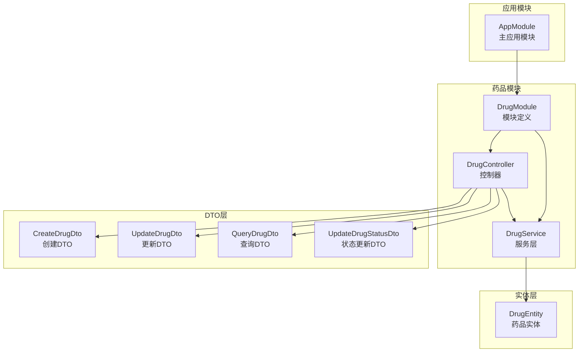
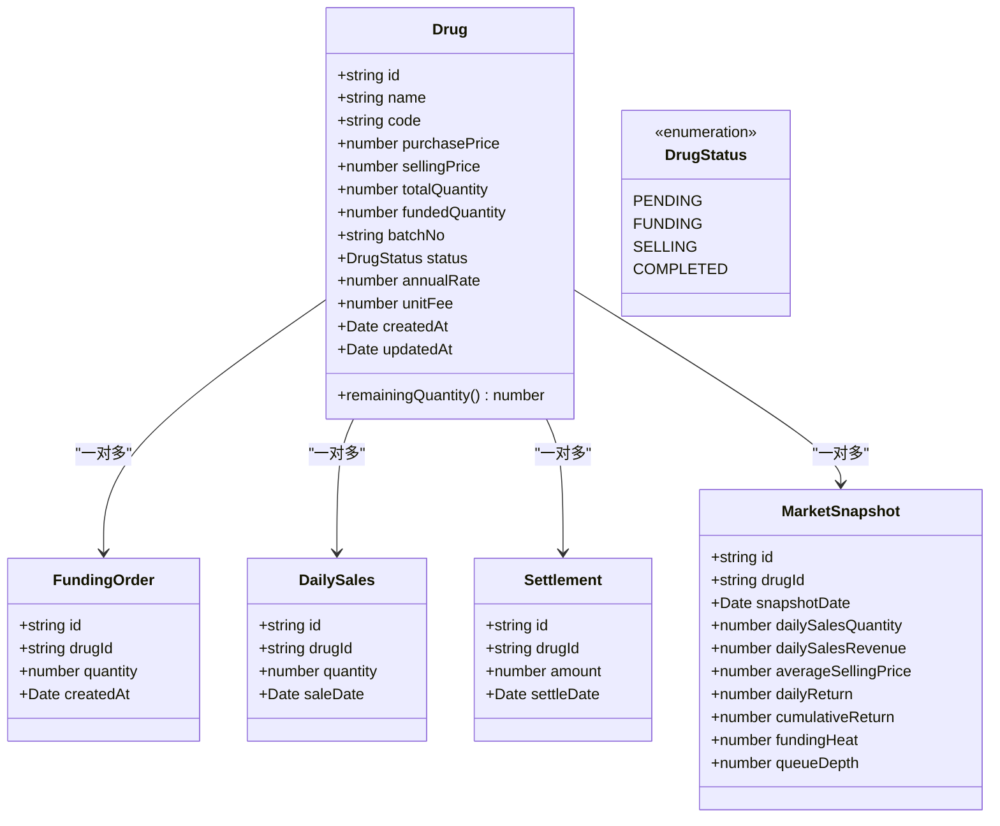
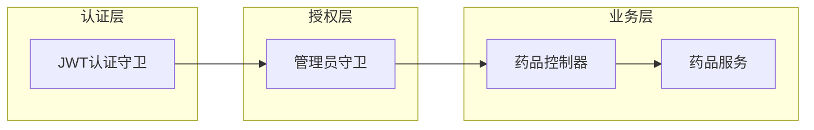
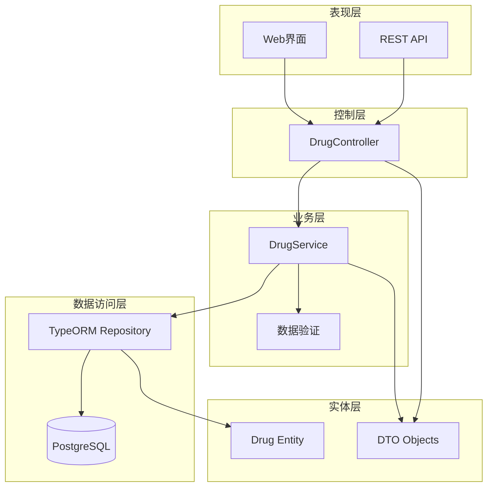
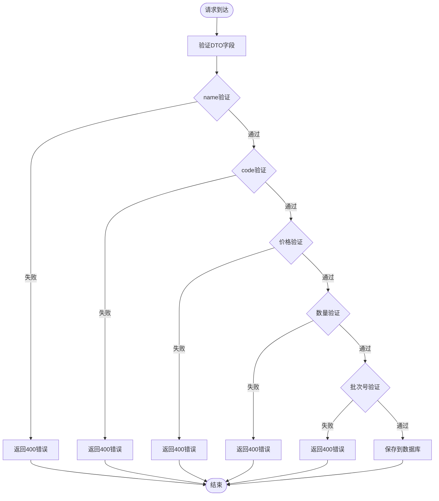
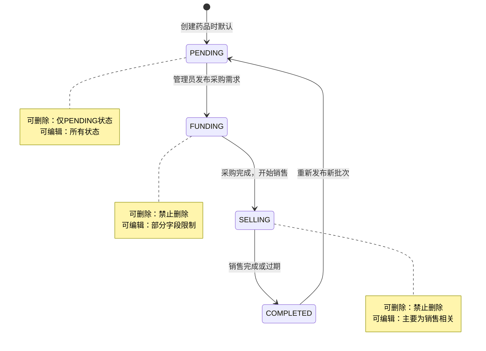
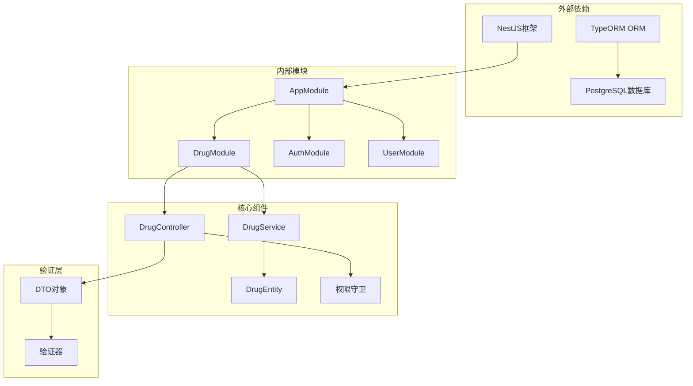
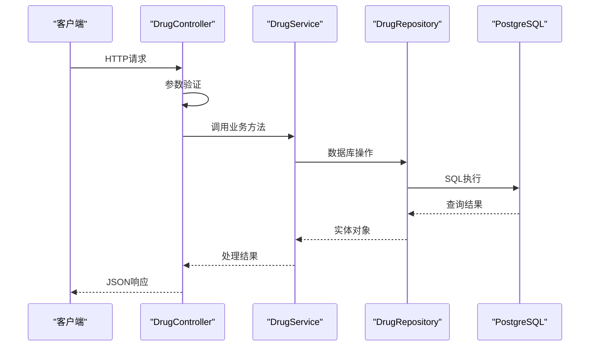

# 药品管理接口

<cite>
**本文档引用的文件**
- [app.module.ts](file://packages/server/src/app.module.ts)
- [drug.module.ts](file://packages/server/src/modules/drug/drug.module.ts)
- [drug.controller.ts](file://packages/server/src/modules/drug/drug.controller.ts)
- [drug.service.ts](file://packages/server/src/modules/drug/drug.service.ts)
- [drug.entity.ts](file://packages/server/src/database/entities/drug.entity.ts)
- [create-drug.dto.ts](file://packages/server/src/modules/drug/dto/create-drug.dto.ts)
- [update-drug.dto.ts](file://packages/server/src/modules/drug/dto/update-drug.dto.ts)
- [query-drug.dto.ts](file://packages/server/src/modules/drug/dto/query-drug.dto.ts)
- [update-drug-status.dto.ts](file://packages/server/src/modules/drug/dto/update-drug-status.dto.ts)
</cite>

## 目录
1. [简介](#简介)
2. [项目结构](#项目结构)
3. [核心组件](#核心组件)
4. [架构概览](#架构概览)
5. [详细组件分析](#详细组件分析)
6. [依赖关系分析](#依赖关系分析)
7. [性能考虑](#性能考虑)
8. [故障排除指南](#故障排除指南)
9. [结论](#结论)

## 简介

本文件为药品管理模块的完整API文档，涵盖药品信息的增删改查接口、状态管理、批量操作、搜索筛选、排序以及相关验证规则。该系统基于NestJS框架构建，使用TypeORM进行数据库操作，支持药品生命周期管理与合规性检查。

## 项目结构

药品管理模块位于`packages/server/src/modules/drug/`目录下，采用标准的NestJS模块结构：



**图表来源**
- [app.module.ts:15-50](file://packages/server/src/app.module.ts#L15-L50)
- [drug.module.ts:8-14](file://packages/server/src/modules/drug/drug.module.ts#L8-L14)

**章节来源**
- [app.module.ts:15-50](file://packages/server/src/app.module.ts#L15-L50)
- [drug.module.ts:8-14](file://packages/server/src/modules/drug/drug.module.ts#L8-L14)

## 核心组件

### 数据模型

药品实体定义了完整的药品信息结构，包括基础信息、财务信息和状态管理：



**图表来源**
- [drug.entity.ts:14-82](file://packages/server/src/database/entities/drug.entity.ts#L14-L82)

### 权限控制

系统采用多层权限控制机制：



**图表来源**
- [drug.controller.ts:15-16](file://packages/server/src/modules/drug/drug.controller.ts#L15-L16)

**章节来源**
- [drug.entity.ts:14-19](file://packages/server/src/database/entities/drug.entity.ts#L14-L19)
- [drug.controller.ts:15-16](file://packages/server/src/modules/drug/drug.controller.ts#L15-L16)

## 架构概览

药品管理系统的整体架构采用分层设计模式：



**图表来源**
- [drug.controller.ts:24](file://packages/server/src/modules/drug/drug.controller.ts#L24)
- [drug.service.ts:18-25](file://packages/server/src/modules/drug/drug.service.ts#L18-L25)

## 详细组件分析

### API接口规范

#### 1. 创建药品接口

**HTTP方法**: POST  
**URL路径**: `/api/drugs`  
**认证要求**: 需要JWT认证和管理员权限  
**请求头**: `Content-Type: application/json`  
**请求体**: CreateDrugDto对象

**请求参数**:
- name: 药品名称 (字符串, 1-100字符)
- code: 药品编码 (字符串, 1-50字符, 唯一)
- purchasePrice: 采购价格 (数字, 最多2位小数, ≥0)
- sellingPrice: 售价 (数字, 最多2位小数, ≥0)
- totalQuantity: 总数量 (整数, >0)
- batchNo: 批次号 (字符串, 1-50字符)
- annualRate: 年化利率 (可选, 数字, 0-100%, 最多2位小数)
- unitFee: 单位费用 (可选, 数字, ≥0, 最多2位小数)

**响应格式**:
```json
{
  "success": true,
  "data": {
    "id": "string",
    "name": "string",
    "code": "string",
    "purchasePrice": number,
    "sellingPrice": number,
    "totalQuantity": number,
    "fundedQuantity": number,
    "batchNo": "string",
    "status": "pending|funding|selling|completed",
    "annualRate": number,
    "unitFee": number,
    "createdAt": "date",
    "updatedAt": "date"
  },
  "message": "药品创建成功"
}
```

**错误处理**:
- 400 Bad Request: 药品编码已存在
- 401 Unauthorized: 未认证
- 403 Forbidden: 非管理员用户

**章节来源**
- [drug.controller.ts:32-42](file://packages/server/src/modules/drug/drug.controller.ts#L32-L42)
- [create-drug.dto.ts:11-51](file://packages/server/src/modules/drug/dto/create-drug.dto.ts#L11-L51)
- [drug.service.ts:31-48](file://packages/server/src/modules/drug/drug.service.ts#L31-L48)

#### 2. 获取药品列表接口

**HTTP方法**: GET  
**URL路径**: `/api/drugs`  
**认证要求**: 公开访问  
**查询参数**:
- status: 状态过滤 (枚举: pending, funding, selling, completed)
- keyword: 搜索关键词 (字符串)
- page: 页码 (整数, ≥1, 默认1)
- pageSize: 每页数量 (整数, 1-100, 默认10)
- sortBy: 排序字段 (字符串, 默认createdAt)
- sortOrder: 排序方向 (ASC或DESC, 默认DESC)

**响应格式**:
```json
{
  "success": true,
  "data": {
    "items": [
      {
        "id": "string",
        "name": "string",
        "code": "string",
        "purchasePrice": number,
        "sellingPrice": number,
        "totalQuantity": number,
        "fundedQuantity": number,
        "remainingQuantity": number,
        "status": "pending|funding|selling|completed",
        "annualRate": number,
        "batchNo": "string",
        "unitFee": number,
        "createdAt": "date",
        "fundingProgress": number
      }
    ],
    "total": number,
    "page": number,
    "pageSize": number,
    "totalPages": number
  }
}
```

**章节来源**
- [drug.controller.ts:48-55](file://packages/server/src/modules/drug/drug.controller.ts#L48-L55)
- [query-drug.dto.ts:12-41](file://packages/server/src/modules/drug/dto/query-drug.dto.ts#L12-L41)
- [drug.service.ts:53-108](file://packages/server/src/modules/drug/drug.service.ts#L53-L108)

#### 3. 获取药品统计数据接口

**HTTP方法**: GET  
**URL路径**: `/api/drugs/statistics`  
**认证要求**: 公开访问

**响应格式**:
```json
{
  "success": true,
  "data": {
    "totalDrugs": number,
    "fundingDrugs": number,
    "totalFundingAmount": number
  }
}
```

**章节来源**
- [drug.controller.ts:61-68](file://packages/server/src/modules/drug/drug.controller.ts#L61-L68)
- [drug.service.ts:113-132](file://packages/server/src/modules/drug/drug.service.ts#L113-L132)

#### 4. 获取药品详情接口

**HTTP方法**: GET  
**URL路径**: `/api/drugs/:id`  
**认证要求**: 公开访问  
**路径参数**: id: 药品ID (UUID格式)

**响应格式**:
```json
{
  "success": true,
  "data": {
    "id": "string",
    "name": "string",
    "code": "string",
    "purchasePrice": number,
    "sellingPrice": number,
    "totalQuantity": number,
    "fundedQuantity": number,
    "remainingQuantity": number,
    "status": "pending|funding|selling|completed",
    "annualRate": number,
    "batchNo": "string",
    "unitFee": number,
    "createdAt": "date",
    "updatedAt": "date",
    "fundingProgress": number,
    "totalFundingAmount": number,
    "latestSnapshot": {
      "snapshotDate": "date",
      "dailySalesQuantity": number,
      "dailySalesRevenue": number,
      "averageSellingPrice": number,
      "dailyReturn": number,
      "cumulativeReturn": number,
      "fundingHeat": number,
      "queueDepth": number
    }
  }
}
```

**章节来源**
- [drug.controller.ts:74-81](file://packages/server/src/modules/drug/drug.controller.ts#L74-L81)
- [drug.service.ts:137-192](file://packages/server/src/modules/drug/drug.service.ts#L137-L192)

#### 5. 更新药品信息接口

**HTTP方法**: PUT  
**URL路径**: `/api/drugs/:id`  
**认证要求**: 需要JWT认证和管理员权限  
**路径参数**: id: 药品ID (UUID格式)  
**请求体**: UpdateDrugDto对象

**请求参数**:
- name: 药品名称 (可选, 字符串, 1-100字符)
- code: 药品编码 (可选, 字符串, 1-50字符)
- purchasePrice: 采购价格 (可选, 数字, 最多2位小数, ≥0)
- sellingPrice: 售价 (可选, 数字, 最多2位小数, ≥0)
- totalQuantity: 总数量 (可选, 整数, >0)
- batchNo: 批次号 (可选, 字符串, 1-50字符)
- annualRate: 年化利率 (可选, 数字, 0-100%, 最多2位小数)
- unitFee: 单位费用 (可选, 数字, ≥0, 最多2位小数)

**响应格式**: 同创建接口响应格式

**错误处理**:
- 404 Not Found: 药品不存在
- 400 Bad Request: 药品编码已存在

**章节来源**
- [drug.controller.ts:87-99](file://packages/server/src/modules/drug/drug.controller.ts#L87-L99)
- [update-drug.dto.ts:11-57](file://packages/server/src/modules/drug/dto/update-drug.dto.ts#L11-L57)
- [drug.service.ts:197-219](file://packages/server/src/modules/drug/drug.service.ts#L197-L219)

#### 6. 更新药品状态接口

**HTTP方法**: PUT  
**URL路径**: `/api/drugs/:id/status`  
**认证要求**: 需要JWT认证和管理员权限  
**路径参数**: id: 药品ID (UUID格式)  
**请求体**: UpdateDrugStatusDto对象

**请求参数**:
- status: 新状态 (枚举: pending, funding, selling, completed)
- reason: 变更原因 (可选, 字符串, ≤200字符)

**响应格式**: 同创建接口响应格式

**错误处理**:
- 404 Not Found: 药品不存在

**章节来源**
- [drug.controller.ts:105-117](file://packages/server/src/modules/drug/drug.controller.ts#L105-L117)
- [update-drug-status.dto.ts:4-12](file://packages/server/src/modules/drug/dto/update-drug-status.dto.ts#L4-L12)
- [drug.service.ts:224-237](file://packages/server/src/modules/drug/drug.service.ts#L224-L237)

#### 7. 删除药品接口

**HTTP方法**: DELETE  
**URL路径**: `/api/drugs/:id`  
**认证要求**: 需要JWT认证和管理员权限  
**路径参数**: id: 药品ID (UUID格式)

**响应格式**:
```json
{
  "success": true,
  "message": "药品删除成功"
}
```

**错误处理**:
- 404 Not Found: 药品不存在
- 403 Forbidden: 非pending状态的药品无法删除

**章节来源**
- [drug.controller.ts:123-132](file://packages/server/src/modules/drug/drug.controller.ts#L123-L132)
- [drug.service.ts:242-254](file://packages/server/src/modules/drug/drug.service.ts#L242-L254)

#### 8. 获取药品历史收益率接口

**HTTP方法**: GET  
**URL路径**: `/api/drugs/:id/history`  
**认证要求**: 公开访问  
**路径参数**: id: 药品ID (UUID格式)

**响应格式**:
```json
{
  "success": true,
  "data": [
    {
      "date": "date",
      "dailyReturn": number,
      "cumulativeReturn": number,
      "dailySalesQuantity": number,
      "fundingHeat": number
    }
  ]
}
```

**章节来源**
- [drug.controller.ts:138-145](file://packages/server/src/modules/drug/drug.controller.ts#L138-L145)
- [drug.service.ts:259-278](file://packages/server/src/modules/drug/drug.service.ts#L259-L278)

### 数据验证规则

系统采用class-validator进行数据验证，确保数据完整性：



**图表来源**
- [create-drug.dto.ts:12-51](file://packages/server/src/modules/drug/dto/create-drug.dto.ts#L12-L51)

**章节来源**
- [create-drug.dto.ts:11-51](file://packages/server/src/modules/drug/dto/create-drug.dto.ts#L11-L51)
- [update-drug.dto.ts:11-57](file://packages/server/src/modules/drug/dto/update-drug.dto.ts#L11-L57)
- [query-drug.dto.ts:12-41](file://packages/server/src/modules/drug/dto/query-drug.dto.ts#L12-L41)

### 业务逻辑约束

#### 状态流转控制



**图表来源**
- [drug.entity.ts:14-19](file://packages/server/src/database/entities/drug.entity.ts#L14-L19)
- [drug.service.ts:249-251](file://packages/server/src/modules/drug/drug.service.ts#L249-L251)

#### 库存管理

系统自动计算剩余库存：
- remainingQuantity = totalQuantity - fundedQuantity

**章节来源**
- [drug.entity.ts:78-80](file://packages/server/src/database/entities/drug.entity.ts#L78-L80)
- [drug.service.ts:95-99](file://packages/server/src/modules/drug/drug.service.ts#L95-L99)

## 依赖关系分析

### 组件依赖图



**图表来源**
- [app.module.ts:4-13](file://packages/server/src/app.module.ts#L4-L13)
- [drug.module.ts:8-14](file://packages/server/src/modules/drug/drug.module.ts#L8-L14)

### 数据流图



**图表来源**
- [drug.controller.ts:24](file://packages/server/src/modules/drug/drug.controller.ts#L24)
- [drug.service.ts:18-25](file://packages/server/src/modules/drug/drug.service.ts#L18-L25)

**章节来源**
- [app.module.ts:15-50](file://packages/server/src/app.module.ts#L15-L50)
- [drug.module.ts:8-14](file://packages/server/src/modules/drug/drug.module.ts#L8-L14)

## 性能考虑

### 查询优化

1. **索引策略**:
   - 药品编码(code)建立唯一索引
   - 名称(name)建立模糊查询索引
   - 状态(status)建立普通索引

2. **分页查询**:
   - 默认每页10条记录
   - 最大每页100条记录
   - 支持多种排序字段

3. **缓存策略**:
   - 使用TypeORM查询缓存
   - 对常用统计数据进行缓存

### 安全考虑

1. **输入验证**:
   - 所有输入参数进行严格验证
   - 防止SQL注入和XSS攻击

2. **权限控制**:
   - 管理员权限验证
   - JWT令牌验证

## 故障排除指南

### 常见错误及解决方案

| 错误代码 | 错误类型 | 可能原因 | 解决方案 |
|---------|---------|---------|---------|
| 400 | Bad Request | 数据验证失败 | 检查请求参数格式和范围 |
| 401 | Unauthorized | 未提供有效令牌 | 重新登录获取JWT令牌 |
| 403 | Forbidden | 权限不足或状态不允许 | 确认用户角色和药品状态 |
| 404 | Not Found | 资源不存在 | 检查ID是否正确 |
| 500 | Internal Server Error | 服务器内部错误 | 查看服务器日志 |

### 调试建议

1. **启用详细日志**:
   ```bash
   NODE_ENV=development npm run start:dev
   ```

2. **数据库连接检查**:
   - 验证数据库配置
   - 检查网络连接
   - 确认表结构同步

3. **API测试**:
   - 使用Postman或curl测试接口
   - 检查响应时间和错误信息

**章节来源**
- [drug.service.ts:3,4,5:3-6](file://packages/server/src/modules/drug/drug.service.ts#L3-L6)
- [drug.service.ts:38,143,201,231,246,263](file://packages/server/src/modules/drug/drug.service.ts#L38,L143,L201,L231,L246,L263)

## 结论

药品管理模块提供了完整的药品生命周期管理功能，包括基础信息管理、状态控制、数据统计和历史追踪。系统采用分层架构设计，具有良好的可扩展性和维护性。通过严格的权限控制和数据验证，确保了系统的安全性和数据完整性。

未来可以考虑的功能增强：
1. 批量操作接口
2. 图片上传和管理
3. 更丰富的搜索和筛选条件
4. 导出功能
5. 审计日志记录