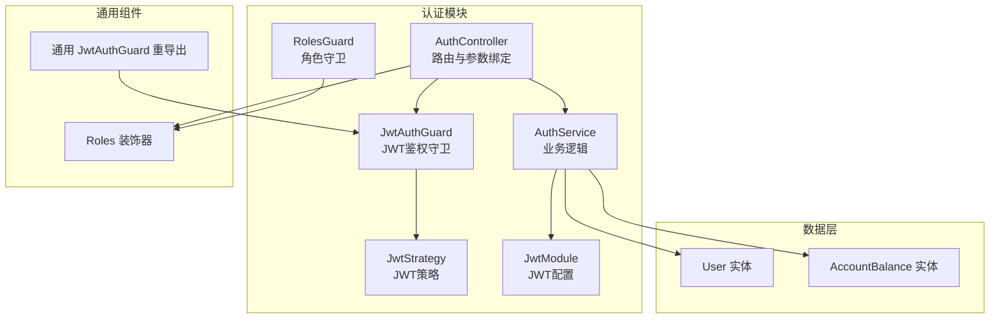
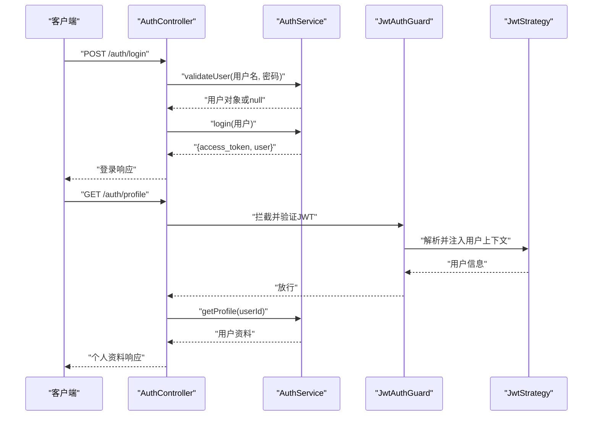
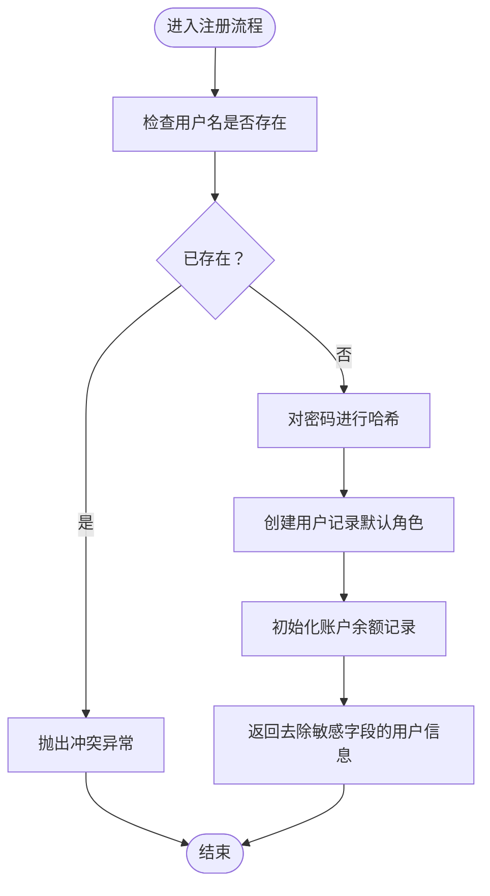
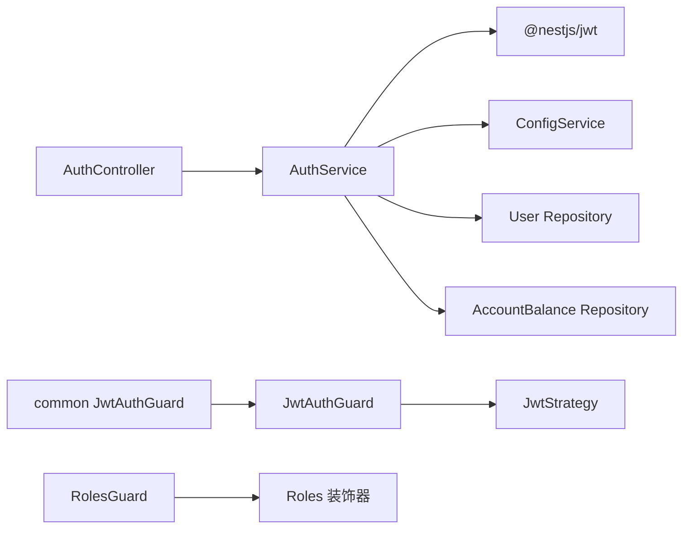

# 认证接口

<cite>
**本文引用的文件**
- [packages/server/src/modules/auth/auth.controller.ts](file://packages/server/src/modules/auth/auth.controller.ts)
- [packages/server/src/modules/auth/auth.service.ts](file://packages/server/src/modules/auth/auth.service.ts)
- [packages/server/src/modules/auth/auth.module.ts](file://packages/server/src/modules/auth/auth.module.ts)
- [packages/server/src/modules/auth/jwt.strategy.ts](file://packages/server/src/modules/auth/jwt.strategy.ts)
- [packages/server/src/modules/auth/guards/jwt-auth.guard.ts](file://packages/server/src/modules/auth/guards/jwt-auth.guard.ts)
- [packages/server/src/modules/auth/guards/roles.guard.ts](file://packages/server/src/modules/auth/guards/roles.guard.ts)
- [packages/server/src/common/decorators/roles.decorator.ts](file://packages/server/src/common/decorators/roles.decorator.ts)
- [packages/server/src/common/guards/jwt-auth.guard.ts](file://packages/server/src/common/guards/jwt-auth.guard.ts)
- [packages/server/src/database/entities/user.entity.ts](file://packages/server/src/database/entities/user.entity.ts)
- [packages/server/src/database/entities/account-balance.entity.ts](file://packages/server/src/database/entities/account-balance.entity.ts)
</cite>

## 目录
1. [简介](#简介)
2. [项目结构](#项目结构)
3. [核心组件](#核心组件)
4. [架构总览](#架构总览)
5. [详细组件分析](#详细组件分析)
6. [依赖关系分析](#依赖关系分析)
7. [性能与安全考量](#性能与安全考量)
8. [故障排查指南](#故障排查指南)
9. [结论](#结论)
10. [附录：API 定义与示例](#附录api-定义与示例)

## 简介
本文件为认证系统的完整API文档，覆盖用户注册、登录、登出与个人资料查询等接口；说明JWT令牌的签发、有效期与守卫机制；介绍基于角色的权限装饰器与守卫；给出常见错误码与处理建议，并提供最佳实践与安全注意事项。

## 项目结构
认证模块位于服务端工程的 modules/auth 子目录中，采用NestJS标准分层：控制器（Controller）负责HTTP路由与参数绑定，服务（Service）封装业务逻辑，守卫（Guard）与策略（Strategy）负责鉴权与授权，TypeORM实体用于数据模型。

图表来源
- [packages/server/src/modules/auth/auth.controller.ts:1-53](file://packages/server/src/modules/auth/auth.controller.ts#L1-L53)
- [packages/server/src/modules/auth/auth.service.ts:1-100](file://packages/server/src/modules/auth/auth.service.ts#L1-L100)
- [packages/server/src/modules/auth/auth.module.ts:1-34](file://packages/server/src/modules/auth/auth.module.ts#L1-L34)
- [packages/server/src/modules/auth/jwt.strategy.ts](file://packages/server/src/modules/auth/jwt.strategy.ts)
- [packages/server/src/modules/auth/guards/jwt-auth.guard.ts](file://packages/server/src/modules/auth/guards/jwt-auth.guard.ts)
- [packages/server/src/modules/auth/guards/roles.guard.ts](file://packages/server/src/modules/auth/guards/roles.guard.ts)
- [packages/server/src/common/decorators/roles.decorator.ts:1-6](file://packages/server/src/common/decorators/roles.decorator.ts#L1-L6)
- [packages/server/src/common/guards/jwt-auth.guard.ts:1-3](file://packages/server/src/common/guards/jwt-auth.guard.ts#L1-L3)
- [packages/server/src/database/entities/user.entity.ts](file://packages/server/src/database/entities/user.entity.ts)
- [packages/server/src/database/entities/account-balance.entity.ts](file://packages/server/src/database/entities/account-balance.entity.ts)

章节来源
- [packages/server/src/modules/auth/auth.controller.ts:1-53](file://packages/server/src/modules/auth/auth.controller.ts#L1-L53)
- [packages/server/src/modules/auth/auth.service.ts:1-100](file://packages/server/src/modules/auth/auth.service.ts#L1-L100)
- [packages/server/src/modules/auth/auth.module.ts:1-34](file://packages/server/src/modules/auth/auth.module.ts#L1-L34)

## 核心组件
- 控制器：提供 /auth/login、/auth/register、/auth/profile、/auth/logout 四个端点，分别处理登录、注册、获取个人资料与登出。
- 服务：实现用户校验、JWT签发、注册流程（含默认角色与账户初始化）、个人资料查询。
- 守卫：JwtAuthGuard 保护受JWT保护的路由；RolesGuard 结合 Roles 装饰器进行角色级访问控制。
- 策略：JwtStrategy 提供JWT解析与用户上下文注入能力。
- 配置：通过 JwtModule 注册，使用环境变量配置密钥与过期时间。

章节来源
- [packages/server/src/modules/auth/auth.controller.ts:8-52](file://packages/server/src/modules/auth/auth.controller.ts#L8-L52)
- [packages/server/src/modules/auth/auth.service.ts:19-98](file://packages/server/src/modules/auth/auth.service.ts#L19-L98)
- [packages/server/src/modules/auth/auth.module.ts:14-33](file://packages/server/src/modules/auth/auth.module.ts#L14-L33)
- [packages/server/src/modules/auth/jwt.strategy.ts](file://packages/server/src/modules/auth/jwt.strategy.ts)
- [packages/server/src/modules/auth/guards/jwt-auth.guard.ts](file://packages/server/src/modules/auth/guards/jwt-auth.guard.ts)
- [packages/server/src/modules/auth/guards/roles.guard.ts](file://packages/server/src/modules/auth/guards/roles.guard.ts)
- [packages/server/src/common/decorators/roles.decorator.ts:3-5](file://packages/server/src/common/decorators/roles.decorator.ts#L3-L5)

## 架构总览
下图展示认证端到端流程：客户端向控制器发起请求，服务执行业务逻辑并返回结果；受保护路由由JwtAuthGuard拦截并验证JWT；角色控制由RolesGuard与Roles装饰器配合完成。

图表来源
- [packages/server/src/modules/auth/auth.controller.ts:12-44](file://packages/server/src/modules/auth/auth.controller.ts#L12-L44)
- [packages/server/src/modules/auth/auth.service.ts:19-47](file://packages/server/src/modules/auth/auth.service.ts#L19-L47)
- [packages/server/src/modules/auth/guards/jwt-auth.guard.ts](file://packages/server/src/modules/auth/guards/jwt-auth.guard.ts)
- [packages/server/src/modules/auth/jwt.strategy.ts](file://packages/server/src/modules/auth/jwt.strategy.ts)

## 详细组件分析

### 控制器与路由
- 登录
  - 方法与路径：POST /auth/login
  - 请求体：包含用户名与密码
  - 成功响应：返回 access_token 与用户简要信息
  - 失败响应：用户名或密码错误
- 注册
  - 方法与路径：POST /auth/register
  - 请求体：用户名、密码、可选真实姓名与手机号
  - 成功响应：返回“注册成功”消息与新用户信息
  - 异常：用户名冲突时抛出冲突异常
- 获取个人资料
  - 方法与路径：GET /auth/profile
  - 安全：需要携带有效JWT
  - 成功响应：返回用户资料（不含敏感字段）
  - 异常：用户不存在时抛出未授权异常
- 登出
  - 方法与路径：POST /auth/logout
  - 安全：需要携带有效JWT
  - 成功响应：返回“登出成功”

章节来源
- [packages/server/src/modules/auth/auth.controller.ts:12-51](file://packages/server/src/modules/auth/auth.controller.ts#L12-L51)

### 服务与业务逻辑
- 用户校验
  - 依据用户名查询用户，使用哈希比对密码
  - 返回去除敏感字段的用户对象
- JWT签发
  - 使用包含用户ID、用户名与角色的载荷签发令牌
  - 返回access_token与用户简要信息
- 注册流程
  - 校验用户名唯一性
  - 对密码进行哈希处理
  - 创建默认角色用户并初始化账户余额记录
  - 返回去除敏感字段的新用户信息
- 个人资料查询
  - 依据当前用户ID查询用户
  - 返回去除敏感字段的用户资料

图表来源
- [packages/server/src/modules/auth/auth.service.ts:49-85](file://packages/server/src/modules/auth/auth.service.ts#L49-L85)

章节来源
- [packages/server/src/modules/auth/auth.service.ts:19-98](file://packages/server/src/modules/auth/auth.service.ts#L19-L98)

### JWT配置与策略
- JwtModule
  - 密钥与过期时间来自环境变量
  - 默认策略为jwt
- JwtStrategy
  - 负责从请求中提取并验证JWT，向请求上下文注入用户信息
- JwtAuthGuard
  - 受保护路由的统一入口，依赖JwtStrategy完成鉴权

章节来源
- [packages/server/src/modules/auth/auth.module.ts:14-33](file://packages/server/src/modules/auth/auth.module.ts#L14-L33)
- [packages/server/src/modules/auth/jwt.strategy.ts](file://packages/server/src/modules/auth/jwt.strategy.ts)
- [packages/server/src/modules/auth/guards/jwt-auth.guard.ts](file://packages/server/src/modules/auth/guards/jwt-auth.guard.ts)

### 角色权限与装饰器
- 角色装饰器
  - Roles(...) 将角色元数据写入路由
- 角色守卫
  - 与JwtAuthGuard配合，校验当前用户是否具备所需角色
- 通用导出
  - common/guards/jwt-auth.guard.ts 重导出模块内的JwtAuthGuard，便于跨模块使用

章节来源
- [packages/server/src/common/decorators/roles.decorator.ts:3-5](file://packages/server/src/common/decorators/roles.decorator.ts#L3-L5)
- [packages/server/src/modules/auth/guards/roles.guard.ts](file://packages/server/src/modules/auth/guards/roles.guard.ts)
- [packages/server/src/common/guards/jwt-auth.guard.ts:1-3](file://packages/server/src/common/guards/jwt-auth.guard.ts#L1-L3)

### 数据模型
- 用户实体
  - 包含用户名、密码、角色、真实姓名、手机号等字段
- 账户余额实体
  - 与用户关联，记录可用余额、冻结余额、累计收益与累计投资

章节来源
- [packages/server/src/database/entities/user.entity.ts](file://packages/server/src/database/entities/user.entity.ts)
- [packages/server/src/database/entities/account-balance.entity.ts](file://packages/server/src/database/entities/account-balance.entity.ts)

## 依赖关系分析
认证模块内部依赖清晰：控制器依赖服务；服务依赖JWT服务、配置服务与数据库仓库；守卫依赖策略；装饰器与守卫共同实现权限控制。

图表来源
- [packages/server/src/modules/auth/auth.controller.ts:1-10](file://packages/server/src/modules/auth/auth.controller.ts#L1-L10)
- [packages/server/src/modules/auth/auth.service.ts:11-17](file://packages/server/src/modules/auth/auth.service.ts#L11-L17)
- [packages/server/src/modules/auth/auth.module.ts:14-33](file://packages/server/src/modules/auth/auth.module.ts#L14-L33)
- [packages/server/src/common/decorators/roles.decorator.ts:3-5](file://packages/server/src/common/decorators/roles.decorator.ts#L3-L5)
- [packages/server/src/common/guards/jwt-auth.guard.ts:1-3](file://packages/server/src/common/guards/jwt-auth.guard.ts#L1-L3)

章节来源
- [packages/server/src/modules/auth/auth.controller.ts:1-10](file://packages/server/src/modules/auth/auth.controller.ts#L1-L10)
- [packages/server/src/modules/auth/auth.service.ts:11-17](file://packages/server/src/modules/auth/auth.service.ts#L11-L17)
- [packages/server/src/modules/auth/auth.module.ts:14-33](file://packages/server/src/modules/auth/auth.module.ts#L14-L33)

## 性能与安全考量
- 密码存储
  - 使用哈希算法对密码进行不可逆存储，降低泄露风险
- JWT配置
  - 过期时间应合理设置，避免过长导致令牌滥用；建议在生产环境启用HTTPS与安全的Cookie传输策略
- 幂等性
  - 登录与注册接口应避免重复提交造成副作用；可在客户端或网关层引入幂等键
- 错误信息最小化
  - 登录失败返回通用提示，避免泄露具体失败原因
- 角色控制
  - 对敏感操作使用角色守卫，确保最小权限原则

[本节为通用指导，不直接分析具体文件]

## 故障排查指南
- 登录失败
  - 现象：返回“用户名或密码错误”
  - 排查：确认用户名是否存在、密码是否正确、大小写与空格
- 注册失败（用户名冲突）
  - 现象：抛出冲突异常
  - 排查：检查用户名唯一性约束与输入格式
- 个人资料查询失败
  - 现象：未授权异常
  - 排查：确认JWT有效性、用户是否存在
- 令牌过期
  - 现象：受保护路由返回未授权
  - 排查：根据业务需求实现刷新令牌流程（如另行提供刷新端点），或调整过期时间
- 权限不足
  - 现象：被角色守卫拒绝
  - 排查：确认用户角色与所需角色匹配

章节来源
- [packages/server/src/modules/auth/auth.controller.ts:19-22](file://packages/server/src/modules/auth/auth.controller.ts#L19-L22)
- [packages/server/src/modules/auth/auth.service.ts:55-57](file://packages/server/src/modules/auth/auth.service.ts#L55-L57)
- [packages/server/src/modules/auth/auth.service.ts:92-94](file://packages/server/src/modules/auth/auth.service.ts#L92-L94)

## 结论
该认证系统以简洁的控制器与服务为核心，结合JWT守卫与角色装饰器实现基础的认证与授权；通过哈希存储与严格的异常处理保障安全性。建议在现有基础上补充令牌刷新机制与更细粒度的权限控制策略，并持续优化日志与监控体系。

[本节为总结，不直接分析具体文件]

## 附录：API 定义与示例

### 登录
- 方法与路径：POST /auth/login
- 请求体
  - username: string
  - password: string
- 成功响应
  - access_token: string
  - user: object
    - id: string
    - username: string
    - role: string
    - realName: string
    - phone: string
- 失败响应
  - message: "用户名或密码错误"

章节来源
- [packages/server/src/modules/auth/auth.controller.ts:12-23](file://packages/server/src/modules/auth/auth.controller.ts#L12-L23)
- [packages/server/src/modules/auth/auth.service.ts:31-47](file://packages/server/src/modules/auth/auth.service.ts#L31-L47)

### 注册
- 方法与路径：POST /auth/register
- 请求体
  - username: string
  - password: string
  - realName?: string
  - phone?: string
- 成功响应
  - message: "注册成功"
  - user: object（去除敏感字段）
- 失败响应
  - 冲突异常：用户名已存在

章节来源
- [packages/server/src/modules/auth/auth.controller.ts:25-38](file://packages/server/src/modules/auth/auth.controller.ts#L25-L38)
- [packages/server/src/modules/auth/auth.service.ts:49-85](file://packages/server/src/modules/auth/auth.service.ts#L49-L85)

### 获取个人资料
- 方法与路径：GET /auth/profile
- 安全：需要携带有效JWT
- 成功响应
  - 同上“注册成功响应”的 user 字段结构
- 失败响应
  - 未授权异常：用户不存在

章节来源
- [packages/server/src/modules/auth/auth.controller.ts:40-44](file://packages/server/src/modules/auth/auth.controller.ts#L40-L44)
- [packages/server/src/modules/auth/auth.service.ts:87-98](file://packages/server/src/modules/auth/auth.service.ts#L87-L98)

### 登出
- 方法与路径：POST /auth/logout
- 安全：需要携带有效JWT
- 成功响应
  - message: "登出成功"

章节来源
- [packages/server/src/modules/auth/auth.controller.ts:46-51](file://packages/server/src/modules/auth/auth.controller.ts#L46-L51)

### JWT 令牌生成、刷新与验证机制
- 生成
  - 服务使用包含用户ID、用户名与角色的载荷签发令牌
- 刷新
  - 当前代码未提供刷新端点；建议另行实现刷新令牌接口或调整过期时间
- 验证
  - JwtAuthGuard 与 JwtStrategy 共同完成令牌解析与用户上下文注入

章节来源
- [packages/server/src/modules/auth/auth.service.ts:31-47](file://packages/server/src/modules/auth/auth.service.ts#L31-L47)
- [packages/server/src/modules/auth/auth.module.ts:17-26](file://packages/server/src/modules/auth/auth.module.ts#L17-L26)
- [packages/server/src/modules/auth/guards/jwt-auth.guard.ts](file://packages/server/src/modules/auth/guards/jwt-auth.guard.ts)
- [packages/server/src/common/guards/jwt-auth.guard.ts:1-3](file://packages/server/src/common/guards/jwt-auth.guard.ts#L1-L3)

### 权限装饰器与守卫使用
- 角色装饰器
  - Roles(...roles) 在路由上声明所需角色
- 角色守卫
  - 与JwtAuthGuard配合，校验当前用户角色
- 通用导出
  - common/guards/jwt-auth.guard.ts 重导出模块内守卫，便于跨模块复用

章节来源
- [packages/server/src/common/decorators/roles.decorator.ts:3-5](file://packages/server/src/common/decorators/roles.decorator.ts#L3-L5)
- [packages/server/src/modules/auth/guards/roles.guard.ts](file://packages/server/src/modules/auth/guards/roles.guard.ts)
- [packages/server/src/common/guards/jwt-auth.guard.ts:1-3](file://packages/server/src/common/guards/jwt-auth.guard.ts#L1-L3)

### 错误码与处理建议
- 401 未授权
  - 场景：令牌无效、过期或用户不存在
  - 建议：引导用户重新登录或实现刷新流程
- 409 冲突
  - 场景：注册时用户名已存在
  - 建议：提示用户更换用户名
- 400 错误请求
  - 场景：缺少必要参数或参数格式错误
  - 建议：完善请求体校验与错误提示

章节来源
- [packages/server/src/modules/auth/auth.service.ts:55-57](file://packages/server/src/modules/auth/auth.service.ts#L55-L57)
- [packages/server/src/modules/auth/auth.service.ts:92-94](file://packages/server/src/modules/auth/auth.service.ts#L92-L94)