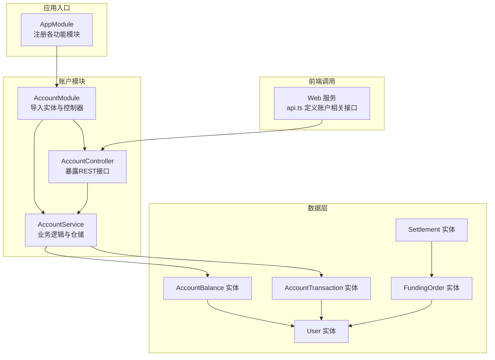
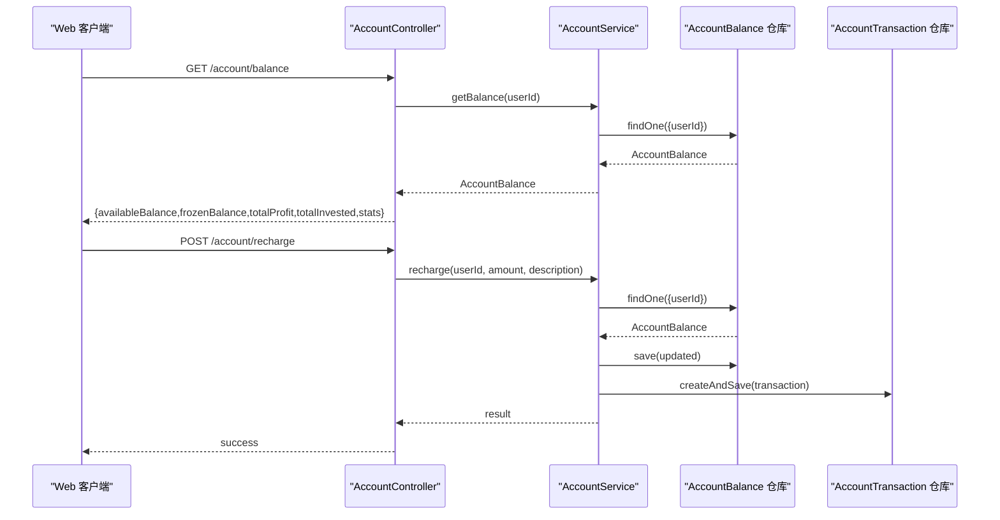
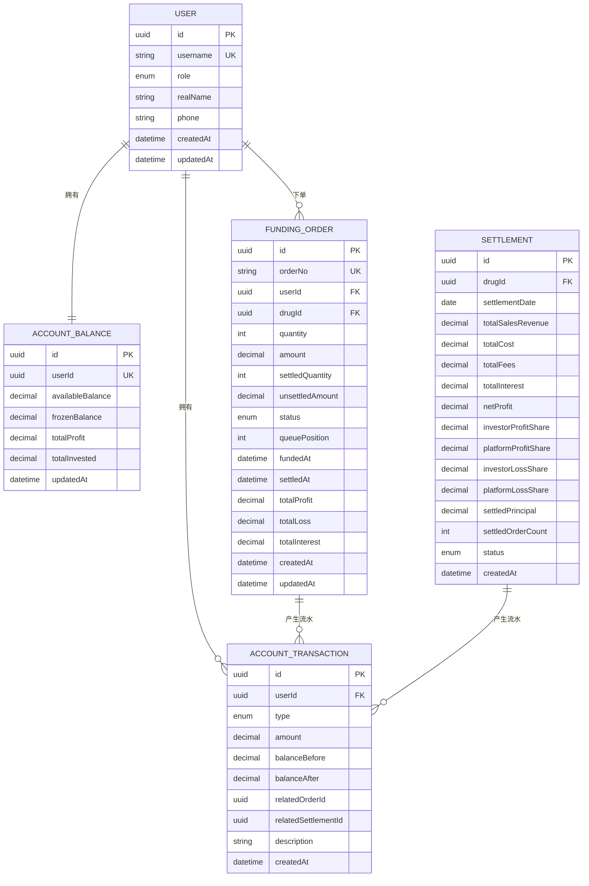
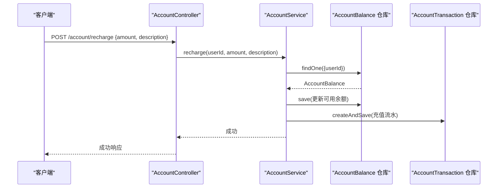
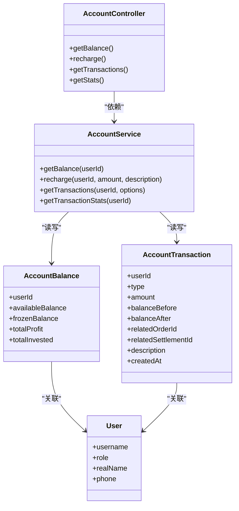

# 账户管理接口

<cite>
**本文引用的文件**
- [app.module.ts](file://packages/server/src/app.module.ts)
- [account.module.ts](file://packages/server/src/modules/account/account.module.ts)
- [account.controller.ts](file://packages/server/src/modules/account/account.controller.ts)
- [account.service.ts](file://packages/server/src/modules/account/account.service.ts)
- [recharge.dto.ts](file://packages/server/src/modules/account/dto/recharge.dto.ts)
- [transaction-query.dto.ts](file://packages/server/src/modules/account/dto/transaction-query.dto.ts)
- [account-balance.entity.ts](file://packages/server/src/database/entities/account-balance.entity.ts)
- [account-transaction.entity.ts](file://packages/server/src/database/entities/account-transaction.entity.ts)
- [user.entity.ts](file://packages/server/src/database/entities/user.entity.ts)
- [funding-order.entity.ts](file://packages/server/src/database/entities/funding-order.entity.ts)
- [settlement.entity.ts](file://packages/server/src/database/entities/settlement.entity.ts)
- [settlement.service.ts](file://packages/server/src/modules/settlement/settlement.service.ts)
- [api.ts](file://packages/web/src/services/api.ts)
</cite>

## 目录
1. [简介](#简介)
2. [项目结构](#项目结构)
3. [核心组件](#核心组件)
4. [架构总览](#架构总览)
5. [详细组件分析](#详细组件分析)
6. [依赖关系分析](#依赖关系分析)
7. [性能考虑](#性能考虑)
8. [故障排查指南](#故障排查指南)
9. [结论](#结论)
10. [附录](#附录)

## 简介
本文件为账户管理模块的完整API文档，覆盖账户余额查询、充值、交易流水查询与统计、资金结算联动、以及前端调用示例。文档基于实际代码结构进行梳理，明确HTTP方法、URL路径、请求参数、响应格式与数据模型，并补充对账与审计相关接口的说明思路。

## 项目结构
账户管理模块位于后端服务的独立子模块中，通过NestJS模块化组织，使用TypeORM实体定义数据模型，并由控制器暴露REST接口，服务层负责业务逻辑与数据访问。

**图表来源**
- [app.module.ts:15-49](file://packages/server/src/app.module.ts#L15-L49)
- [account.module.ts:8-13](file://packages/server/src/modules/account/account.module.ts#L8-L13)
- [account.controller.ts:8-53](file://packages/server/src/modules/account/account.controller.ts#L8-L53)
- [account-balance.entity.ts:11-37](file://packages/server/src/database/entities/account-balance.entity.ts#L11-L37)
- [account-transaction.entity.ts:22-61](file://packages/server/src/database/entities/account-transaction.entity.ts#L22-L61)
- [user.entity.ts:19-57](file://packages/server/src/database/entities/user.entity.ts#L19-L57)
- [funding-order.entity.ts:21-86](file://packages/server/src/database/entities/funding-order.entity.ts#L21-L86)
- [settlement.entity.ts:18-76](file://packages/server/src/database/entities/settlement.entity.ts#L18-L76)
- [api.ts:216-229](file://packages/web/src/services/api.ts#L216-L229)

**章节来源**
- [app.module.ts:15-49](file://packages/server/src/app.module.ts#L15-L49)
- [account.module.ts:8-13](file://packages/server/src/modules/account/account.module.ts#L8-L13)
- [account.controller.ts:8-53](file://packages/server/src/modules/account/account.controller.ts#L8-L53)

## 核心组件
- 账户模块：负责账户余额、交易流水、充值等接口的统一管理。
- 数据实体：AccountBalance、AccountTransaction、User、FundingOrder、Settlement。
- 控制器：AccountController 提供余额查询、充值、交易查询、统计等接口。
- 服务：AccountService 实现余额读取与充值逻辑；SettlementService 与交易流水联动，支持对账与审计。

**章节来源**
- [account.controller.ts:8-53](file://packages/server/src/modules/account/account.controller.ts#L8-L53)
- [account.service.ts:7-46](file://packages/server/src/modules/account/account.service.ts#L7-L46)
- [account-balance.entity.ts:11-37](file://packages/server/src/database/entities/account-balance.entity.ts#L11-L37)
- [account-transaction.entity.ts:22-61](file://packages/server/src/database/entities/account-transaction.entity.ts#L22-L61)
- [user.entity.ts:19-57](file://packages/server/src/database/entities/user.entity.ts#L19-L57)
- [funding-order.entity.ts:21-86](file://packages/server/src/database/entities/funding-order.entity.ts#L21-L86)
- [settlement.entity.ts:18-76](file://packages/server/src/database/entities/settlement.entity.ts#L18-L76)

## 架构总览
账户管理接口采用标准REST风格，结合JWT认证保护，控制器将请求转发至服务层，服务层通过TypeORM仓库访问数据库实体。前端通过api.ts封装的账户相关接口调用后端。

**图表来源**
- [account.controller.ts:12-34](file://packages/server/src/modules/account/account.controller.ts#L12-L34)
- [account.service.ts:16-46](file://packages/server/src/modules/account/account.service.ts#L16-L46)
- [account-balance.entity.ts:11-37](file://packages/server/src/database/entities/account-balance.entity.ts#L11-L37)
- [account-transaction.entity.ts:22-61](file://packages/server/src/database/entities/account-transaction.entity.ts#L22-L61)
- [api.ts:216-229](file://packages/web/src/services/api.ts#L216-L229)

## 详细组件分析

### 接口清单与规范

- 余额查询
  - 方法与路径：GET /account/balance
  - 认证：需要JWT
  - 请求参数：无
  - 响应字段：账户余额对象 + 统计信息
    - 可用余额、冻结余额、总收益、总投入、交易统计
  - 响应示例（结构）：见“响应格式”小节

- 充值
  - 方法与路径：POST /account/recharge
  - 认证：需要JWT
  - 请求体字段：
    - amount: number（最小值0.01）
    - description: string（可选）
  - 响应：成功标志

- 交易流水查询
  - 方法与路径：GET /account/transactions
  - 认证：需要JWT
  - 查询参数：
    - type: string（可选，交易类型过滤）
    - page: number（可选，默认第1页）
    - pageSize: number（可选，默认条数）
  - 响应：分页列表（含交易记录）

- 交易统计
  - 方法与路径：GET /account/stats
  - 认证：需要JWT
  - 请求参数：无
  - 响应：交易统计聚合结果

**章节来源**
- [account.controller.ts:12-53](file://packages/server/src/modules/account/account.controller.ts#L12-L53)
- [recharge.dto.ts:3-11](file://packages/server/src/modules/account/dto/recharge.dto.ts#L3-L11)
- [transaction-query.dto.ts:1-200](file://packages/server/src/modules/account/dto/transaction-query.dto.ts#L1-L200)

### 数据模型与查询方式

- 账户余额（AccountBalance）
  - 字段：userId、availableBalance、frozenBalance、totalProfit、totalInvested、updatedAt
  - 关系：一对一关联User
  - 查询：按userId查找或创建默认记录

- 交易流水（AccountTransaction）
  - 字段：userId、type（枚举）、amount、balanceBefore、balanceAfter、relatedOrderId、relatedSettlementId、description、createdAt
  - 关系：多对一关联User
  - 查询：按userId+时间索引查询，支持按type过滤

- 用户（User）
  - 字段：username、role、realName、phone、createdAt、updatedAt
  - 关系：一对多关联FundingOrder、一对一关联AccountBalance、一对多关联AccountTransaction

- 结算（Settlement）
  - 字段：drugId、settlementDate、财务汇总、状态、createdAt
  - 关联：与FundingOrder在结算日期范围内产生交易联动

- 垫资订单（FundingOrder）
  - 字段：orderNo、userId、drugId、quantity、amount、已结算数量、未结算金额、状态、队列位置、fundedAt、settledAt、收益/损失/利息汇总
  - 关联：与User、Drug、Settlement

**图表来源**
- [account-balance.entity.ts:11-37](file://packages/server/src/database/entities/account-balance.entity.ts#L11-L37)
- [account-transaction.entity.ts:22-61](file://packages/server/src/database/entities/account-transaction.entity.ts#L22-L61)
- [user.entity.ts:19-57](file://packages/server/src/database/entities/user.entity.ts#L19-L57)
- [funding-order.entity.ts:21-86](file://packages/server/src/database/entities/funding-order.entity.ts#L21-L86)
- [settlement.entity.ts:18-76](file://packages/server/src/database/entities/settlement.entity.ts#L18-L76)

### 充值流程时序

**图表来源**
- [account.controller.ts:23-34](file://packages/server/src/modules/account/account.controller.ts#L23-L34)
- [account.service.ts:36-46](file://packages/server/src/modules/account/account.service.ts#L36-L46)
- [account-transaction.entity.ts:22-61](file://packages/server/src/database/entities/account-transaction.entity.ts#L22-L61)

### 交易统计与对账思路
- 交易统计：可通过AccountController的统计接口获取聚合数据。
- 对账接口：建议扩展AccountController新增对账接口，按日期范围查询交易流水并汇总。
- 审计日志：可在服务层记录关键操作的日志，便于审计追踪。

**章节来源**
- [account.controller.ts:49-53](file://packages/server/src/modules/account/account.controller.ts#L49-L53)
- [settlement.service.ts:724-729](file://packages/server/src/modules/settlement/settlement.service.ts#L724-L729)
- [settlement.service.ts:882-903](file://packages/server/src/modules/settlement/settlement.service.ts#L882-L903)

### 银行账户绑定与支付渠道集成
- 当前代码未发现银行账户绑定与支付渠道集成的直接实现。
- 建议在AccountService中引入外部支付网关SDK，完成充值请求签名、回调验证与对账。
- 风控校验：可在充值前调用风控服务进行限额与黑名单校验，失败则拒绝交易并记录审计日志。

[本节为概念性说明，不直接对应具体源码文件]

### 资金安全、加密传输与合规
- 加密传输：建议使用HTTPS/TLS，确保传输层安全。
- 密钥管理：敏感配置通过环境变量注入，避免硬编码。
- 合规监管：对大额交易与可疑行为建立监控与上报机制，保留完整的审计日志。

[本节为概念性说明，不直接对应具体源码文件]

### 账户统计、报表导出与批量操作
- 账户统计：通过统计接口返回聚合指标。
- 报表导出：建议新增导出接口，支持CSV/Excel格式，按条件筛选。
- 批量操作：如批量充值或批量结算，需在服务层实现事务批处理与幂等控制。

[本节为概念性说明，不直接对应具体源码文件]

## 依赖关系分析

**图表来源**
- [account.controller.ts:8-53](file://packages/server/src/modules/account/account.controller.ts#L8-L53)
- [account.service.ts:7-46](file://packages/server/src/modules/account/account.service.ts#L7-L46)
- [account-balance.entity.ts:11-37](file://packages/server/src/database/entities/account-balance.entity.ts#L11-L37)
- [account-transaction.entity.ts:22-61](file://packages/server/src/database/entities/account-transaction.entity.ts#L22-L61)
- [user.entity.ts:19-57](file://packages/server/src/database/entities/user.entity.ts#L19-L57)

**章节来源**
- [account.controller.ts:8-53](file://packages/server/src/modules/account/account.controller.ts#L8-L53)
- [account.service.ts:7-46](file://packages/server/src/modules/account/account.service.ts#L7-L46)

## 性能考虑
- 索引优化：交易流水按(userId, createdAt)建立复合索引，提升查询效率。
- 分页策略：交易查询使用page/pageSize，避免一次性返回大量数据。
- 事务一致性：充值与流水生成在同一事务内完成，保证数据一致。
- 缓存策略：对高频统计可引入缓存，定期刷新。

[本节提供通用指导，不直接对应具体源码文件]

## 故障排查指南
- 余额查询为空：首次使用会自动创建默认账户记录；若仍为空，检查用户ID是否正确。
- 充值失败：确认金额大于等于最小值，且账户存在；查看服务层异常抛出与日志。
- 交易查询无数据：确认查询参数（type、page、pageSize）与用户权限。
- 对账不平：核对交易类型与金额精度，必要时通过结算服务查询相关流水。

**章节来源**
- [account.service.ts:21-33](file://packages/server/src/modules/account/account.service.ts#L21-L33)
- [account.service.ts:41-43](file://packages/server/src/modules/account/account.service.ts#L41-L43)

## 结论
账户管理模块提供了基础的余额查询、充值与交易统计能力，数据模型清晰、接口简洁。后续可在此基础上完善银行账户绑定、支付渠道集成、风控校验、对账与审计接口，以及报表导出与批量操作，以满足更复杂的业务场景。

## 附录

### 响应格式示例（结构）
- 余额查询响应
  - 字段：availableBalance、frozenBalance、totalProfit、totalInvested、stats
  - 示例结构：见“余额查询”接口说明

- 充值响应
  - 字段：success（布尔）
  - 示例结构：见“充值”接口说明

- 交易流水响应
  - 字段：list（数组）、pagination（分页信息）
  - 示例结构：见“交易流水查询”接口说明

- 交易统计响应
  - 字段：按类型聚合的统计项
  - 示例结构：见“交易统计”接口说明

**章节来源**
- [account.controller.ts:12-53](file://packages/server/src/modules/account/account.controller.ts#L12-L53)