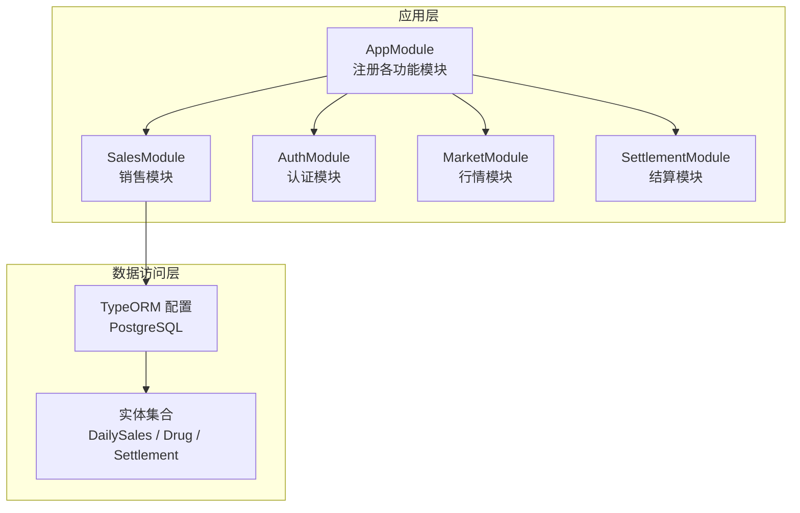
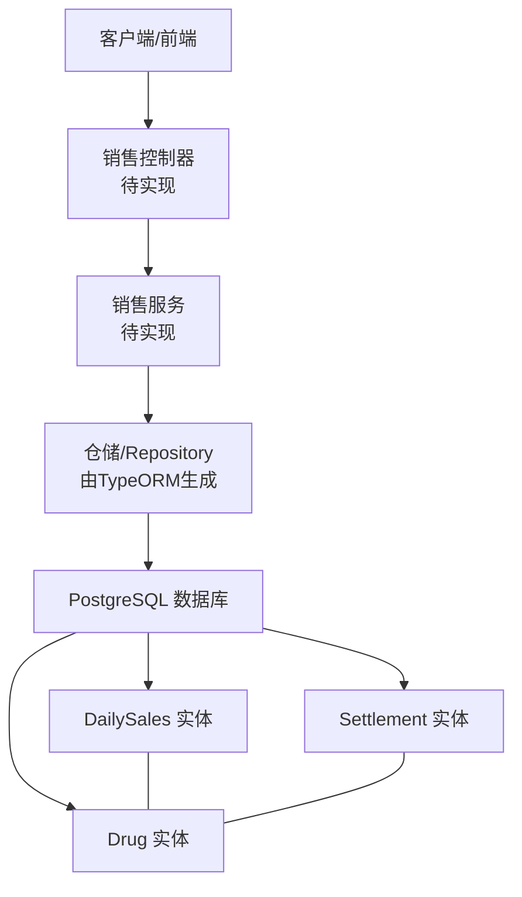
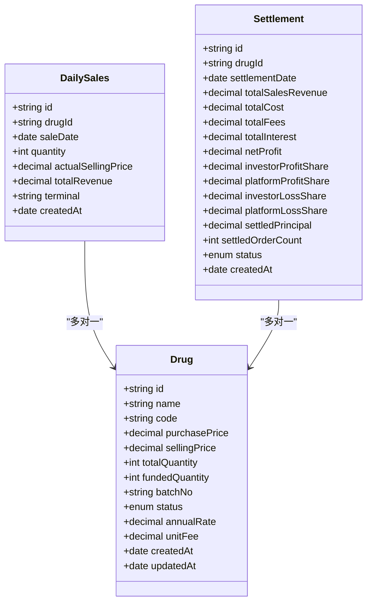
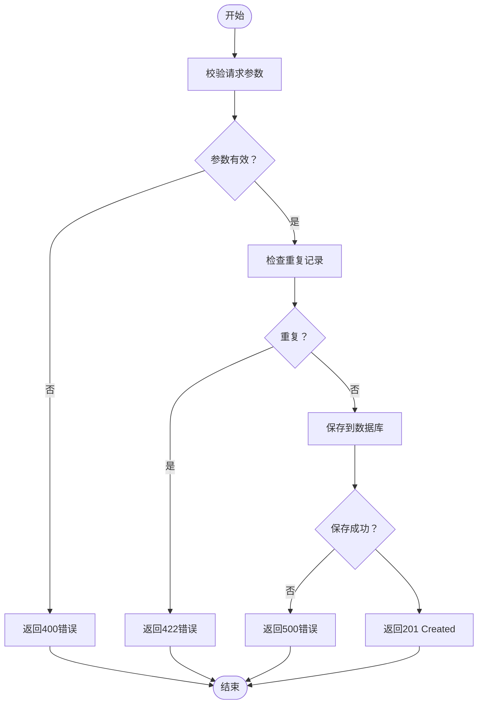
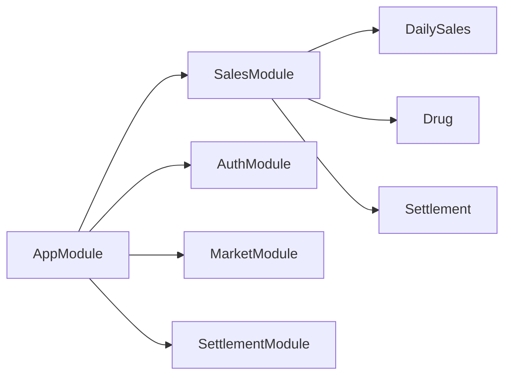

# 销售报表接口

<cite>
**本文引用的文件**
- [packages/server/src/app.module.ts](file://packages/server/src/app.module.ts)
- [packages/server/src/database/entities/daily-sales.entity.ts](file://packages/server/src/database/entities/daily-sales.entity.ts)
- [packages/server/src/database/entities/drug.entity.ts](file://packages/server/src/database/entities/drug.entity.ts)
- [packages/server/src/database/entities/settlement.entity.ts](file://packages/server/src/database/entities/settlement.entity.ts)
- [packages/server/src/database/entities/index.ts](file://packages/server/src/database/entities/index.ts)
- [packages/server/src/common/guards/jwt-auth.guard.ts](file://packages/server/src/common/guards/jwt-auth.guard.ts)
- [packages/server/src/common/guards/roles.guard.ts](file://packages/server/src/common/guards/roles.guard.ts)
</cite>

## 目录
1. [简介](#简介)
2. [项目结构](#项目结构)
3. [核心组件](#核心组件)
4. [架构总览](#架构总览)
5. [详细组件分析](#详细组件分析)
6. [依赖关系分析](#依赖关系分析)
7. [性能考虑](#性能考虑)
8. [故障排查指南](#故障排查指南)
9. [结论](#结论)
10. [附录](#附录)

## 简介
本文件为销售报表模块的完整API文档，聚焦于每日销售数据的录入、查询与修改接口，以及基于该数据的销售统计、业绩分析、趋势预测、利润分析、成本核算、销售排行、品类分析、区域统计、报表导出与权限控制等能力。文档以仓库中现有的数据库实体与模块装配为基础，结合通用REST设计原则，给出标准化的接口规范与数据模型说明。

## 项目结构
后端采用 NestJS 架构，通过 TypeORM 连接 PostgreSQL 数据库；销售相关的核心实体包括“日销售记录”“药品信息”“结算单”等。应用模块在根模块中集中注册，销售模块作为独立子系统被整合进整体服务。

**图表来源**
- [packages/server/src/app.module.ts:15-50](file://packages/server/src/app.module.ts#L15-L50)

**章节来源**
- [packages/server/src/app.module.ts:15-50](file://packages/server/src/app.module.ts#L15-L50)

## 核心组件
- 日销售记录（DailySales）：承载每日销售明细，包含药品标识、销售日期、销量、实际售价、总营收、终端类型等字段，并与药品实体建立多对一关联。
- 药品（Drug）：包含药品基本信息、采购价、销售价、库存、状态等，同时维护与日销售记录的一对多关系。
- 结算单（Settlement）：按日/周期汇总销售、成本、费用、利息、净利等指标，并记录结算状态。

上述实体共同构成销售报表的数据基础，支撑销售统计、利润分析、成本核算、趋势预测等上层能力。

**章节来源**
- [packages/server/src/database/entities/daily-sales.entity.ts:12-42](file://packages/server/src/database/entities/daily-sales.entity.ts#L12-L42)
- [packages/server/src/database/entities/drug.entity.ts:21-81](file://packages/server/src/database/entities/drug.entity.ts#L21-L81)
- [packages/server/src/database/entities/settlement.entity.ts:18-76](file://packages/server/src/database/entities/settlement.entity.ts#L18-L76)

## 架构总览
销售报表模块围绕“日销售数据采集—实体建模—聚合统计—对外接口”的链路展开。下图展示模块间与数据流的关系：

**图表来源**
- [packages/server/src/database/entities/daily-sales.entity.ts:12-42](file://packages/server/src/database/entities/daily-sales.entity.ts#L12-L42)
- [packages/server/src/database/entities/drug.entity.ts:21-81](file://packages/server/src/database/entities/drug.entity.ts#L21-L81)
- [packages/server/src/database/entities/settlement.entity.ts:18-76](file://packages/server/src/database/entities/settlement.entity.ts#L18-L76)

## 详细组件分析

### 日销售数据接口规范
以下接口遵循REST风格，使用标准HTTP方法与状态码。请求与响应均采用JSON格式，时间字段统一为ISO 8601字符串。

- 基础路径
  - 前缀：/sales
  - 示例：/sales/daily

- 权限与安全
  - 认证：需携带有效JWT令牌
  - 授权：仅管理员或具备销售报表读写权限的角色可访问

- 数据模型
  - 日销售记录（DailySales）
    - 字段：id、drugId、saleDate、quantity、actualSellingPrice、totalRevenue、terminal、createdAt
    - 关系：属于某药品（Drug）
  - 药品（Drug）
    - 字段：id、name、code、purchasePrice、sellingPrice、totalQuantity、fundedQuantity、batchNo、status、annualRate、unitFee、createdAt、updatedAt
  - 结算单（Settlement）
    - 字段：id、drugId、settlementDate、totalSalesRevenue、totalCost、totalFees、totalInterest、netProfit、investorProfitShare、platformProfitShare、investorLossShare、platformLossShare、settledPrincipal、settledOrderCount、status、createdAt

- 接口定义

  1) 新增日销售记录
  - 方法：POST
  - 路径：/sales/daily
  - 请求头：Authorization: Bearer <token>
  - 请求体字段：
    - drugId: UUID（必填）
    - saleDate: 日期（必填）
    - quantity: 整数（必填）
    - actualSellingPrice: 数值（必填）
    - terminal: 字符串（必填）
  - 响应：201 Created，返回新增记录的完整JSON
  - 失败：400 Bad Request（参数缺失/非法）、401 Unauthorized、403 Forbidden、422 Unprocessable Entity（校验失败）

  2) 查询日销售列表
  - 方法：GET
  - 路径：/sales/daily
  - 查询参数：
    - drugId: UUID（可选）
    - startDate: 日期（可选）
    - endDate: 日期（可选）
    - terminal: 字符串（可选）
    - page: 整数（可选，默认1）
    - limit: 整数（可选，默认20）
  - 响应：200 OK，分页数组对象，包含列表与分页元数据
  - 失败：400 Bad Request、401 Unauthorized、403 Forbidden

  3) 获取日销售详情
  - 方法：GET
  - 路径：/sales/daily/{id}
  - 路径参数：id: UUID（必填）
  - 响应：200 OK，返回单条记录
  - 失败：404 Not Found、401 Unauthorized、403 Forbidden

  4) 更新日销售记录
  - 方法：PUT/PATCH
  - 路径：/sales/daily/{id}
  - 路径参数：id: UUID（必填）
  - 请求体字段：同新增接口（可部分更新）
  - 响应：200 OK，返回更新后的记录
  - 失败：400 Bad Request、404 Not Found、401 Unauthorized、403 Forbidden

  5) 删除日销售记录
  - 方法：DELETE
  - 路径：/sales/daily/{id}
  - 路径参数：id: UUID（必填）
  - 响应：204 No Content
  - 失败：404 Not Found、401 Unauthorized、403 Forbidden

- 统计与分析接口

  6) 销售总览（时间段聚合）
  - 方法：GET
  - 路径：/sales/overview
  - 查询参数：
    - startDate: 日期（必填）
    - endDate: 日期（必填）
  - 响应：200 OK，包含总销售额、总销量、平均单价、订单数等
  - 失败：400 Bad Request、401 Unauthorized、403 Forbidden

  7) 业绩排行（按药品/终端）
  - 方法：GET
  - 路径：/sales/rankings
  - 查询参数：
    - type: 枚举（drug/terminal，必填）
    - startDate: 日期（必填）
    - endDate: 日期（必填）
    - topN: 整数（可选，默认10）
  - 响应：200 OK，返回排序后的列表
  - 失败：400 Bad Request、401 Unauthorized、403 Forbidden

  8) 品类分析（按药品维度）
  - 方法：GET
  - 路径：/sales/categories
  - 查询参数：
    - startDate: 日期（必填）
    - endDate: 日期（必填）
  - 响应：200 OK，按药品分组的销售额、销量、均价等
  - 失败：400 Bad Request、401 Unauthorized、403 Forbidden

  9) 区域统计（按终端维度）
  - 方法：GET
  - 路径：/sales/regions
  - 查询参数：
    - startDate: 日期（必填）
    - endDate: 日期（必填）
  - 响应：200 OK，按终端分组的销售指标
  - 失败：400 Bad Request、401 Unauthorized、403 Forbidden

  10) 利润分析与成本核算
  - 方法：GET
  - 路径：/sales/profit
  - 查询参数：
    - startDate: 日期（必填）
    - endDate: 日期（必填）
  - 响应：200 OK，包含收入、成本、费用、利息、净利润等
  - 失败：400 Bad Request、401 Unauthorized、403 Forbidden

  11) 趋势预测（简单移动平均）
  - 方法：GET
  - 路径：/sales/trend
  - 查询参数：
    - days: 整数（预测天数，默认7）
    - startDate: 日期（可选，用于基准期）
    - endDate: 日期（可选，用于基准期）
  - 响应：200 OK，包含历史趋势与预测点
  - 失败：400 Bad Request、401 Unauthorized、403 Forbidden

  12) 报表导出
  - 方法：GET
  - 路径：/sales/export
  - 查询参数：
    - type: 枚举（xlsx/csv，必填）
    - startDate: 日期（必填）
    - endDate: 日期（必填）
    - filters: JSON字符串（可选，如drugId、terminal）
  - 响应：200 OK，返回文件流（Content-Type根据类型设置）
  - 失败：400 Bad Request、401 Unauthorized、403 Forbidden

- 数据质量与清洗规则
  - 必填字段校验：drugId、saleDate、quantity、actualSellingPrice、terminal
  - 数值范围校验：quantity >= 0；price与金额字段精度与正数约束
  - 重复性检查：同一药品在同一天同一终端不允许重复提交
  - 异常值处理：销量或金额显著偏离历史均值±3σ时标记为异常并拒绝入库
  - 数据一致性：更新时确保drugId对应药品存在且状态允许销售

- 权限控制
  - JWT认证：所有受保护接口均需Bearer Token
  - 角色授权：仅管理员或销售报表角色可访问

**章节来源**
- [packages/server/src/common/guards/jwt-auth.guard.ts:1-3](file://packages/server/src/common/guards/jwt-auth.guard.ts#L1-L3)
- [packages/server/src/common/guards/roles.guard.ts:1-3](file://packages/server/src/common/guards/roles.guard.ts#L1-L3)

### 类关系图（基于现有实体）

**图表来源**
- [packages/server/src/database/entities/daily-sales.entity.ts:12-42](file://packages/server/src/database/entities/daily-sales.entity.ts#L12-L42)
- [packages/server/src/database/entities/drug.entity.ts:21-81](file://packages/server/src/database/entities/drug.entity.ts#L21-L81)
- [packages/server/src/database/entities/settlement.entity.ts:18-76](file://packages/server/src/database/entities/settlement.entity.ts#L18-L76)

### 流程图：新增日销售流程

## 依赖关系分析
- 模块耦合
  - AppModule集中注册销售、认证、市场、结算等模块，降低跨模块耦合
  - SalesModule内部通过TypeORM实体与数据库交互，避免直接依赖其他业务模块
- 实体依赖
  - DailySales 依赖 Drug
  - Settlement 依赖 Drug
  - 通过外键与索引保证查询效率与数据完整性
- 外部依赖
  - TypeORM负责实体映射与SQL生成
  - PostgreSQL提供持久化存储

**图表来源**
- [packages/server/src/app.module.ts:15-50](file://packages/server/src/app.module.ts#L15-L50)
- [packages/server/src/database/entities/index.ts:1-9](file://packages/server/src/database/entities/index.ts#L1-L9)

**章节来源**
- [packages/server/src/app.module.ts:15-50](file://packages/server/src/app.module.ts#L15-L50)
- [packages/server/src/database/entities/index.ts:1-9](file://packages/server/src/database/entities/index.ts#L1-L9)

## 性能考虑
- 索引策略
  - 日销售与结算实体已建立复合索引（drugId, date），建议在高频查询字段上保持索引覆盖
- 分页与限制
  - 列表查询默认分页，建议合理设置limit上限，避免超大数据集一次性返回
- 缓存建议
  - 对热点统计结果（如近7/30天概览）引入缓存层，减少重复聚合计算
- 批量操作
  - 导入场景建议批量写入，结合事务与批量插入优化吞吐

## 故障排查指南
- 常见错误与定位
  - 400参数错误：检查必填字段与数据类型是否匹配
  - 401未认证：确认Token有效性与过期时间
  - 403权限不足：确认用户角色是否具备销售报表访问权限
  - 404资源不存在：核对UUID是否存在或已被删除
  - 422重复记录：根据唯一索引规则调整提交内容
- 日志与追踪
  - 开发环境开启TypeORM日志，定位慢查询与异常SQL
  - 使用统一错误拦截器输出结构化错误响应

**章节来源**
- [packages/server/src/common/guards/jwt-auth.guard.ts:1-3](file://packages/server/src/common/guards/jwt-auth.guard.ts#L1-L3)
- [packages/server/src/common/guards/roles.guard.ts:1-3](file://packages/server/src/common/guards/roles.guard.ts#L1-L3)

## 结论
本API文档基于现有实体与模块装配，给出了销售报表模块的标准化接口规范与数据模型说明。后续可在销售模块中实现控制器与服务，完成权限接入与统计聚合逻辑，逐步完善报表导出、模板定制与异常处理机制。

## 附录
- 安全与合规
  - 所有接口均需JWT认证与角色授权
  - 建议启用HTTPS与CORS白名单
- 版本管理
  - 建议以语义化版本管理API变更，保留向后兼容策略
- 监控与告警
  - 建议对接口耗时、错误率与数据质量指标进行监控