# 前端应用

<cite>
**本文引用的文件**
- [main.tsx](file://packages/web/src/main.tsx)
- [App.tsx](file://packages/web/src/App.tsx)
- [BasicLayout.tsx](file://packages/web/src/layouts/BasicLayout.tsx)
- [Dashboard.tsx](file://packages/web/src/pages/Dashboard.tsx)
- [Market.tsx](file://packages/web/src/pages/Market.tsx)
- [Trade.tsx](file://packages/web/src/pages/Trade.tsx)
- [Portfolio.tsx](file://packages/web/src/pages/Portfolio.tsx)
- [Admin.tsx](file://packages/web/src/pages/Admin.tsx)
- [useWebSocket.ts](file://packages/web/src/hooks/useWebSocket.ts)
- [api.ts](file://packages/web/src/services/api.ts)
- [websocket.ts](file://packages/web/src/services/websocket.ts)
- [global.css](file://packages/web/src/styles/global.css)
- [Dashboard.css](file://packages/web/src/pages/Dashboard.css)
- [TickerBar/index.tsx](file://packages/web/src/components/TickerBar/index.tsx)
- [TickerBar/style.css](file://packages/web/src/components/TickerBar/style.css)
- [OrderBook/index.tsx](file://packages/web/src/components/OrderBook/index.tsx)
- [OrderBook/style.css](file://packages/web/src/components/OrderBook/style.css)
- [KLineChart/index.tsx](file://packages/web/src/components/KLineChart/index.tsx)
- [KLineChart/style.css](file://packages/web/src/components/KLineChart/style.css)
- [package.json](file://packages/web/package.json)
</cite>

## 目录
1. [简介](#简介)
2. [项目结构](#项目结构)
3. [核心组件](#核心组件)
4. [架构总览](#架构总览)
5. [详细组件分析](#详细组件分析)
6. [依赖关系分析](#依赖关系分析)
7. [性能考虑](#性能考虑)
8. [故障排查指南](#故障排查指南)
9. [结论](#结论)
10. [附录](#附录)

## 简介
本项目是一个基于 React 的药品垫资交易前端应用，采用 Vite 构建，Ant Design 作为 UI 组件库，支持暗色主题与深色生态。应用通过路由守卫控制访问权限，结合 Ant Design Pro Layout 提供统一布局与导航；页面涵盖仪表盘、市场行情、交易下单、账户与持仓、管理后台等功能模块，并通过 WebSocket 实现实时行情与交易动态推送。

## 项目结构
前端代码位于 packages/web 目录，采用按页面与功能模块划分的组织方式：
- src
  - components：通用可视化组件（K线图、委托簿、行情滚动条）
  - hooks：自定义 Hook（WebSocket 订阅）
  - layouts：布局容器（BasicLayout）
  - pages：页面组件（Dashboard、Market、Trade、Portfolio、Admin、Login 等）
  - services：API 与 WebSocket 封装
  - styles：全局样式
  - types：类型定义
  - main.tsx：应用入口
  - App.tsx：路由与权限控制

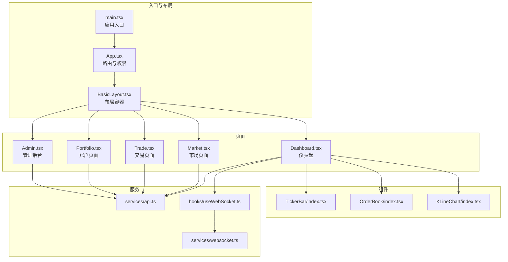

**图表来源**
- [main.tsx:1-80](file://packages/web/src/main.tsx#L1-L80)
- [App.tsx:1-58](file://packages/web/src/App.tsx#L1-L58)
- [BasicLayout.tsx:1-267](file://packages/web/src/layouts/BasicLayout.tsx#L1-L267)
- [Dashboard.tsx:1-573](file://packages/web/src/pages/Dashboard.tsx#L1-L573)
- [Market.tsx:1-537](file://packages/web/src/pages/Market.tsx#L1-L537)
- [Trade.tsx:1-984](file://packages/web/src/pages/Trade.tsx#L1-L984)
- [Portfolio.tsx:1-1225](file://packages/web/src/pages/Portfolio.tsx#L1-L1225)
- [Admin.tsx:1-1602](file://packages/web/src/pages/Admin.tsx#L1-L1602)
- [TickerBar/index.tsx](file://packages/web/src/components/TickerBar/index.tsx)
- [OrderBook/index.tsx](file://packages/web/src/components/OrderBook/index.tsx)
- [KLineChart/index.tsx](file://packages/web/src/components/KLineChart/index.tsx)
- [api.ts](file://packages/web/src/services/api.ts)
- [websocket.ts](file://packages/web/src/services/websocket.ts)
- [useWebSocket.ts](file://packages/web/src/hooks/useWebSocket.ts)

**章节来源**
- [main.tsx:1-80](file://packages/web/src/main.tsx#L1-L80)
- [App.tsx:1-58](file://packages/web/src/App.tsx#L1-L58)
- [BasicLayout.tsx:1-267](file://packages/web/src/layouts/BasicLayout.tsx#L1-L267)

## 核心组件
- 应用入口与主题配置：在入口中配置 Ant Design 暗色主题、算法与各组件 token，包裹 BrowserRouter 提供路由能力。
- 路由与权限：App 组件定义路由表与私有路由守卫，基于本地存储的 access_token 控制访问。
- 布局容器：BasicLayout 使用 ProLayout 提供混合布局、菜单、头部右侧信息区（余额、收益、用户下拉），并注入全局样式 token。
- 页面组件：Dashboard/Market/Trade/Portfolio/Admin 分别承载业务功能，均采用 Ant Design 组件与自定义样式。
- 通用组件：TickerBar（行情滚动）、OrderBook（垫资深度）、KLineChart（K线）。
- 服务层：api.ts 封装业务 API，websocket.ts 与 useWebSocket.ts 提供 WebSocket 订阅与事件处理。

**章节来源**
- [main.tsx:1-80](file://packages/web/src/main.tsx#L1-L80)
- [App.tsx:1-58](file://packages/web/src/App.tsx#L1-L58)
- [BasicLayout.tsx:1-267](file://packages/web/src/layouts/BasicLayout.tsx#L1-L267)
- [Dashboard.tsx:1-573](file://packages/web/src/pages/Dashboard.tsx#L1-L573)
- [Market.tsx:1-537](file://packages/web/src/pages/Market.tsx#L1-L537)
- [Trade.tsx:1-984](file://packages/web/src/pages/Trade.tsx#L1-L984)
- [Portfolio.tsx:1-1225](file://packages/web/src/pages/Portfolio.tsx#L1-L1225)
- [Admin.tsx:1-1602](file://packages/web/src/pages/Admin.tsx#L1-L1602)
- [TickerBar/index.tsx](file://packages/web/src/components/TickerBar/index.tsx)
- [OrderBook/index.tsx](file://packages/web/src/components/OrderBook/index.tsx)
- [KLineChart/index.tsx](file://packages/web/src/components/KLineChart/index.tsx)
- [api.ts](file://packages/web/src/services/api.ts)
- [websocket.ts](file://packages/web/src/services/websocket.ts)
- [useWebSocket.ts](file://packages/web/src/hooks/useWebSocket.ts)

## 架构总览
应用采用“入口配置 → 路由与权限 → 布局容器 → 页面组件 → 通用组件/服务”的分层架构。Ant Design 提供基础 UI 能力，ProLayout 提供统一布局与菜单；页面内通过自定义 Hook 与服务层完成数据获取与 WebSocket 实时订阅。

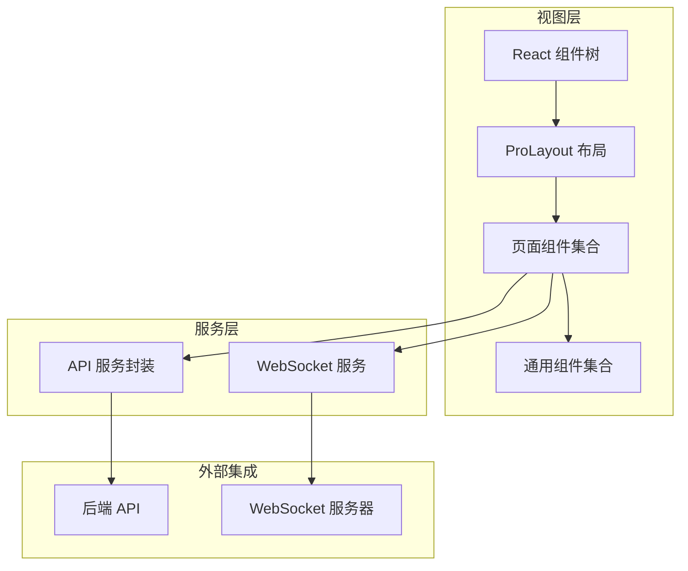

**图表来源**
- [App.tsx:1-58](file://packages/web/src/App.tsx#L1-L58)
- [BasicLayout.tsx:1-267](file://packages/web/src/layouts/BasicLayout.tsx#L1-L267)
- [Dashboard.tsx:1-573](file://packages/web/src/pages/Dashboard.tsx#L1-L573)
- [Market.tsx:1-537](file://packages/web/src/pages/Market.tsx#L1-L537)
- [Trade.tsx:1-984](file://packages/web/src/pages/Trade.tsx#L1-L984)
- [Portfolio.tsx:1-1225](file://packages/web/src/pages/Portfolio.tsx#L1-L1225)
- [Admin.tsx:1-1602](file://packages/web/src/pages/Admin.tsx#L1-L1602)
- [api.ts](file://packages/web/src/services/api.ts)
- [websocket.ts](file://packages/web/src/services/websocket.ts)

## 详细组件分析

### 路由与权限控制
- 私有路由守卫：读取本地 token，未登录则跳转到登录页；加载中返回空以避免闪烁。
- 路由表：首页、市场、交易、持仓、清算、管理后台等路径映射至对应页面组件。
- 登录页：独立路由，不参与权限守卫。

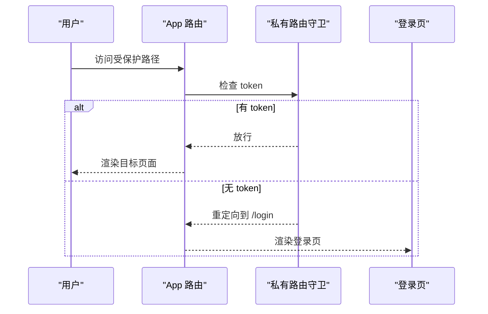

**图表来源**
- [App.tsx:12-31](file://packages/web/src/App.tsx#L12-L31)

**章节来源**
- [App.tsx:1-58](file://packages/web/src/App.tsx#L1-L58)

### 布局容器（BasicLayout）
- 功能：菜单导航、头部右侧信息区（余额、收益）、用户下拉登出、ProLayout token 注入。
- 数据：从本地存储读取用户信息，调用账户服务获取余额。
- 交互：点击菜单项跳转；登出清理本地存储并提示。

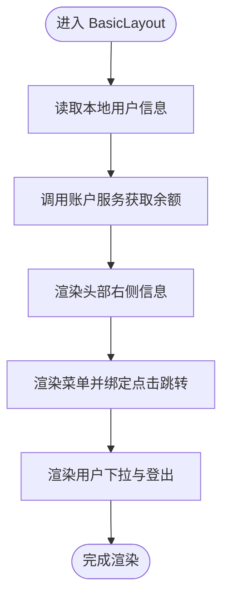

**图表来源**
- [BasicLayout.tsx:64-112](file://packages/web/src/layouts/BasicLayout.tsx#L64-L112)

**章节来源**
- [BasicLayout.tsx:1-267](file://packages/web/src/layouts/BasicLayout.tsx#L1-L267)

### 仪表盘（Dashboard）
- 数据源：市场总览、平台统计、K线、委托簿深度、活动动态。
- 实时更新：通过 useWebSocket 订阅市场行情、垫资与清算事件，增量更新市场列表与活动列表。
- 交互：选择药品切换 K 线周期与深度图；表格点击进入交易页。
- 视觉：统计卡片数字动画、颜色区分涨跌、进度条与标签。

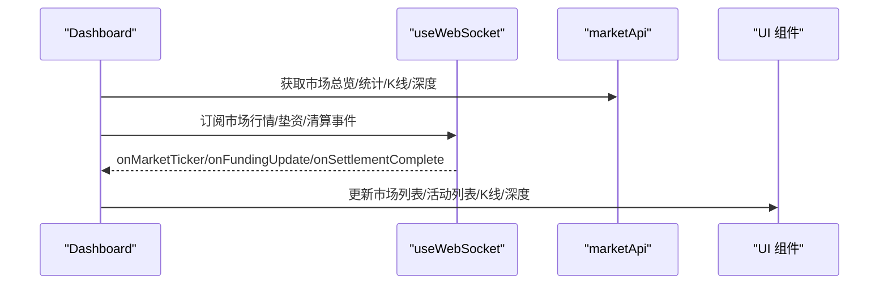

**图表来源**
- [Dashboard.tsx:184-234](file://packages/web/src/pages/Dashboard.tsx#L184-L234)
- [Dashboard.tsx:237-327](file://packages/web/src/pages/Dashboard.tsx#L237-L327)

**章节来源**
- [Dashboard.tsx:1-573](file://packages/web/src/pages/Dashboard.tsx#L1-L573)
- [TickerBar/index.tsx](file://packages/web/src/components/TickerBar/index.tsx)
- [OrderBook/index.tsx](file://packages/web/src/components/OrderBook/index.tsx)
- [KLineChart/index.tsx](file://packages/web/src/components/KLineChart/index.tsx)

### 市场页面（Market）
- 功能：药品列表展示、状态筛选、关键字搜索、分页、交易按钮跳转。
- 视觉：自定义表格样式、进度条颜色随状态变化、价格与收益统一字体与颜色。
- 交互：查询触发重新加载；点击“交易”跳转到交易页。

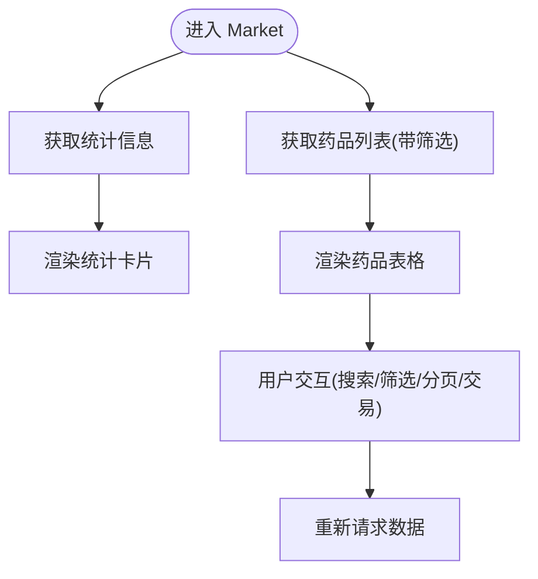

**图表来源**
- [Market.tsx:56-97](file://packages/web/src/pages/Market.tsx#L56-L97)

**章节来源**
- [Market.tsx:1-537](file://packages/web/src/pages/Market.tsx#L1-L537)

### 交易页面（Trade）
- 功能：药品信息展示、垫资深度图（ECharts）、下单表单、快捷比例、预计金额与日收益、我的持仓表格。
- 逻辑：根据余额与剩余可垫计算最大购买数量；下单前二次确认弹窗。
- 视觉：渐变按钮、金额与收益统一字体、正负颜色区分。

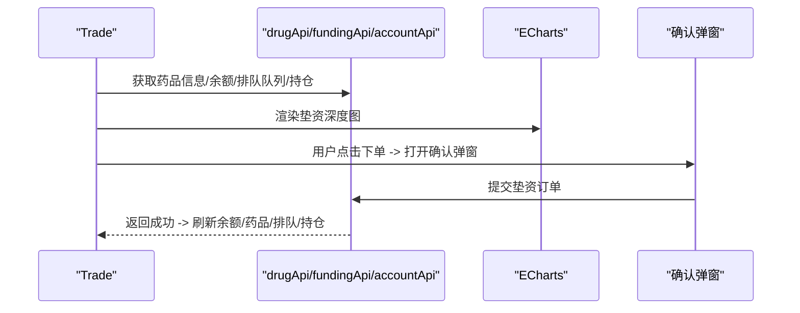

**图表来源**
- [Trade.tsx:112-161](file://packages/web/src/pages/Trade.tsx#L112-L161)
- [Trade.tsx:180-217](file://packages/web/src/pages/Trade.tsx#L180-L217)

**章节来源**
- [Trade.tsx:1-984](file://packages/web/src/pages/Trade.tsx#L1-L984)

### 账户页面（Portfolio）
- 功能：账户余额与收益概览、模拟充值、我的持仓、资金流水、统计卡片与汇总。
- 交互：Tab 切换、分页、筛选、悬浮卡片高亮。
- 视觉：统计数值统一字体与颜色、正负收益颜色区分、表格悬停背景。

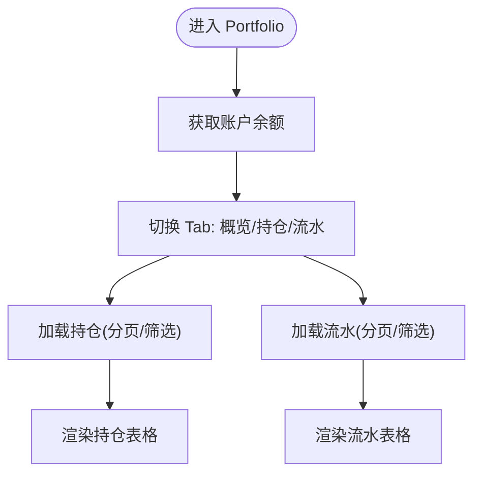

**图表来源**
- [Portfolio.tsx:151-167](file://packages/web/src/pages/Portfolio.tsx#L151-L167)

**章节来源**
- [Portfolio.tsx:1-1225](file://packages/web/src/pages/Portfolio.tsx#L1-L1225)

### 管理后台（Admin）
- 功能：用户管理（模拟）、药品管理（增删改）、销售管理（增删改）、日清日结（预览与执行）。
- 交互：弹窗表单、筛选器、分步流程展示、确认对话框。
- 视觉：渐变按钮、表格悬停样式、标签颜色区分状态。

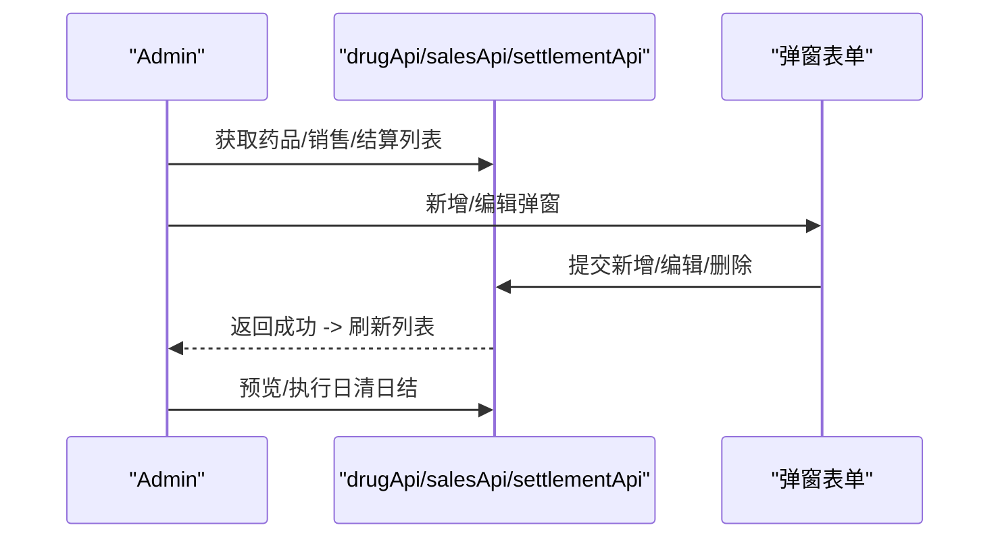

**图表来源**
- [Admin.tsx:108-132](file://packages/web/src/pages/Admin.tsx#L108-L132)
- [Admin.tsx:325-369](file://packages/web/src/pages/Admin.tsx#L325-L369)

**章节来源**
- [Admin.tsx:1-1602](file://packages/web/src/pages/Admin.tsx#L1-L1602)

### 实时数据与 WebSocket 集成
- 订阅钩子：useWebSocket 封装连接与事件回调，Dashboard 通过其订阅市场行情、垫资与清算事件。
- 事件处理：onMarketTicker 更新市场列表中的价格与收益；onFundingUpdate 与 onSettlementComplete 增量更新活动列表。
- 服务层：websocket.ts 提供底层连接与消息处理，api.ts 提供业务接口。

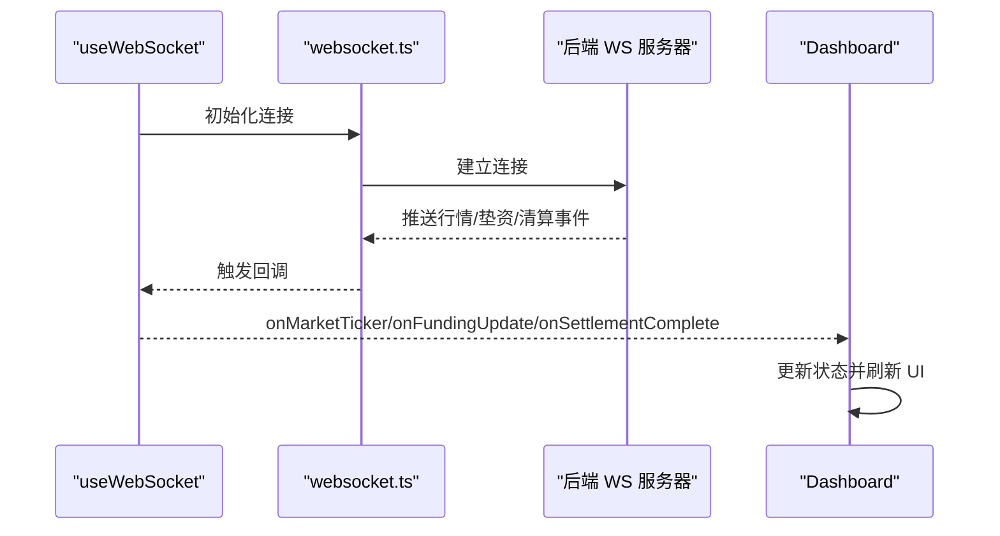

**图表来源**
- [useWebSocket.ts](file://packages/web/src/hooks/useWebSocket.ts)
- [Dashboard.tsx:184-234](file://packages/web/src/pages/Dashboard.tsx#L184-L234)
- [websocket.ts](file://packages/web/src/services/websocket.ts)

**章节来源**
- [useWebSocket.ts](file://packages/web/src/hooks/useWebSocket.ts)
- [Dashboard.tsx:184-234](file://packages/web/src/pages/Dashboard.tsx#L184-L234)
- [websocket.ts](file://packages/web/src/services/websocket.ts)

### UI 组件库与自定义样式
- Ant Design：大量使用 Card、Table、Typography、Button、Modal、Tabs、Progress、Statistic 等组件。
- Pro Components：ProLayout 提供布局与菜单能力。
- 自定义样式：全局样式覆盖表格、分页、下拉等组件样式；页面级样式（Dashboard.css、各组件 style.css）增强视觉一致性。

**章节来源**
- [main.tsx:10-79](file://packages/web/src/main.tsx#L10-L79)
- [Dashboard.tsx:18-18](file://packages/web/src/pages/Dashboard.tsx#L18-L18)
- [Market.tsx:484-531](file://packages/web/src/pages/Market.tsx#L484-L531)
- [Portfolio.tsx:1165-1220](file://packages/web/src/pages/Portfolio.tsx#L1165-L1220)
- [Admin.tsx:1551-1596](file://packages/web/src/pages/Admin.tsx#L1551-L1596)

## 依赖关系分析
- 依赖关系：页面组件依赖服务层（api.ts），通用组件依赖第三方图表库（ECharts），布局容器依赖 Ant Design Pro Components。
- 外部依赖：React、React Router、Ant Design、@ant-design/pro-components、@ant-design/icons、ECharts、Axios、Socket.IO 客户端、Day.js。
- 构建工具：Vite、TypeScript、ESLint。

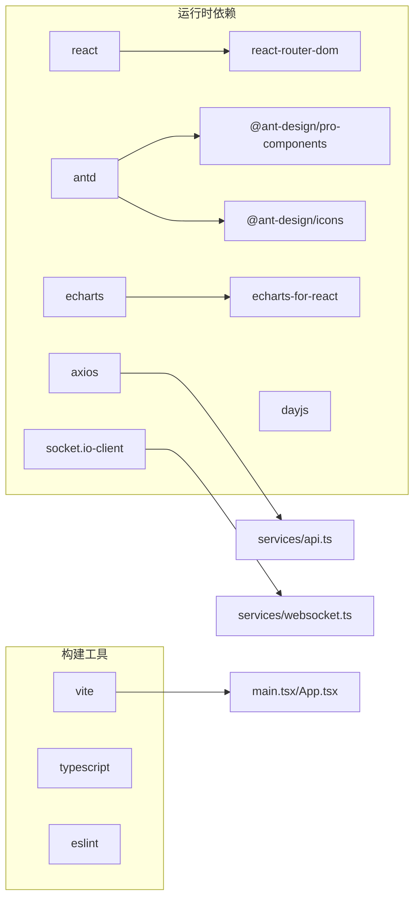

**图表来源**
- [package.json:13-36](file://packages/web/package.json#L13-L36)
- [api.ts](file://packages/web/src/services/api.ts)
- [websocket.ts](file://packages/web/src/services/websocket.ts)
- [main.tsx:1-80](file://packages/web/src/main.tsx#L1-L80)
- [App.tsx:1-58](file://packages/web/src/App.tsx#L1-L58)

**章节来源**
- [package.json:1-39](file://packages/web/package.json#L1-L39)

## 性能考虑
- 组件懒加载与按需渲染：页面组件按路由加载，ProLayout 包裹 Outlet，减少不必要的渲染。
- 列表渲染优化：表格使用固定列宽与小尺寸，配合滚动属性降低重排。
- 图表性能：ECharts 在 Trade 页面中按需渲染，避免频繁重建实例。
- 状态更新策略：Dashboard 使用增量更新市场列表与活动列表，减少全量重绘。
- 样式隔离：页面级样式与全局样式分离，避免样式冲突与过度重绘。

[本节为通用指导，无需特定文件引用]

## 故障排查指南
- 登录态异常：检查本地存储 access_token 是否存在；私有路由守卫会根据 token 决定是否跳转登录。
- 数据加载失败：查看对应页面的 API 请求错误日志；确认服务层封装是否正确返回数据结构。
- WebSocket 不生效：确认 useWebSocket 初始化与连接状态；检查后端推送事件名与数据格式。
- 样式异常：检查全局样式与页面级样式是否被覆盖；确认 Ant Design token 配置是否正确。
- 表格/分页问题：确认分页参数传递与后端返回结构一致；检查表格列配置与数据键名匹配。

**章节来源**
- [App.tsx:12-31](file://packages/web/src/App.tsx#L12-L31)
- [Dashboard.tsx:237-327](file://packages/web/src/pages/Dashboard.tsx#L237-L327)
- [Trade.tsx:112-161](file://packages/web/src/pages/Trade.tsx#L112-L161)
- [useWebSocket.ts](file://packages/web/src/hooks/useWebSocket.ts)
- [websocket.ts](file://packages/web/src/services/websocket.ts)

## 结论
本应用以 React + Ant Design 为基础，结合 ProLayout 提供统一布局与导航，页面围绕药品垫资交易场景展开，具备完整的路由权限控制、实时数据推送与丰富的可视化组件。通过服务层抽象与自定义 Hook，实现了清晰的数据流与良好的可维护性。建议后续持续完善管理后台功能、优化图表渲染性能与增强错误处理与埋点监控。

[本节为总结性内容，无需特定文件引用]

## 附录
- 响应式与移动端适配：页面广泛使用栅格布局与 Ant Design 组件的响应式特性，配合 ProLayout 的混合布局与菜单折叠，在桌面端提供高效工作流，在移动端保持良好可读性。
- 组件复用策略：将通用可视化组件（K线、委托簿、行情滚动条）拆分为独立模块，页面通过 props 传参复用；服务层统一 API 调用，减少重复代码。
- 调试方法：利用浏览器开发者工具检查网络请求与 WebSocket 事件；在关键节点添加日志输出；对复杂计算使用 useMemo/useCallback 优化性能。

[本节为通用指导，无需特定文件引用]