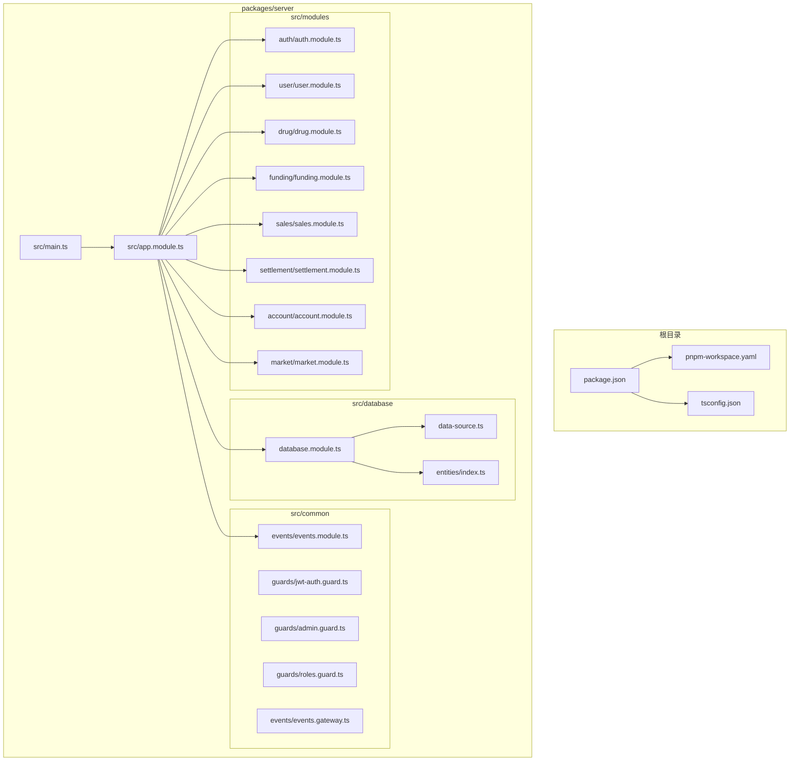
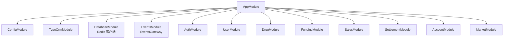
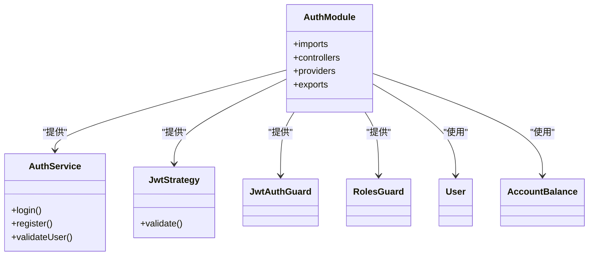
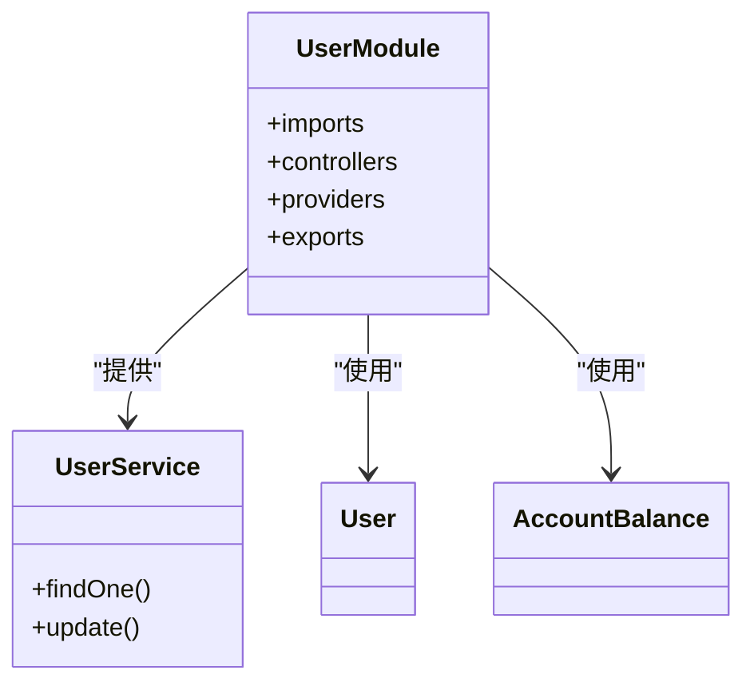
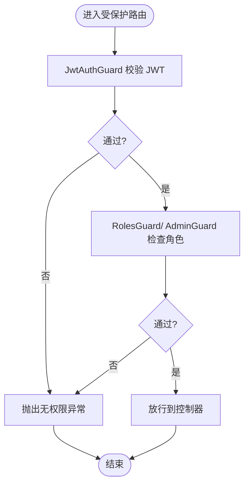
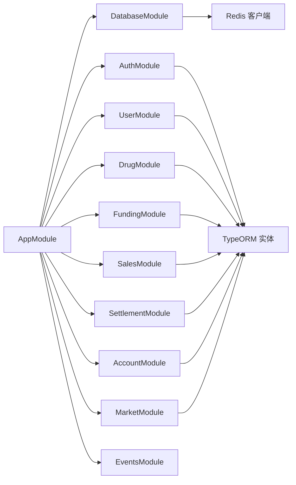
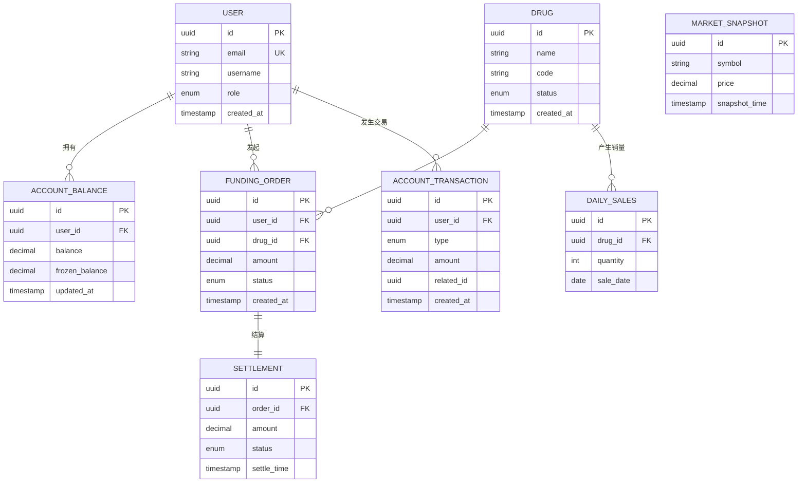

# 后端服务

<cite>
**本文引用的文件**
- [package.json](file://package.json)
- [pnpm-workspace.yaml](file://pnpm-workspace.yaml)
- [tsconfig.json](file://tsconfig.json)
- [main.ts](file://packages/server/src/main.ts)
- [app.module.ts](file://packages/server/src/app.module.ts)
- [database.module.ts](file://packages/server/src/database/database.module.ts)
- [data-source.ts](file://packages/server/src/database/data-source.ts)
- [index.ts（实体导出）](file://packages/server/src/database/entities/index.ts)
- [auth.module.ts](file://packages/server/src/modules/auth/auth.module.ts)
- [user.module.ts](file://packages/server/src/modules/user/user.module.ts)
- [drug.module.ts](file://packages/server/src/modules/drug/drug.module.ts)
- [funding.module.ts](file://packages/server/src/modules/funding/funding.module.ts)
- [sales.module.ts](file://packages/server/src/modules/sales/sales.module.ts)
- [settlement.module.ts](file://packages/server/src/modules/settlement/settlement.module.ts)
- [account.module.ts](file://packages/server/src/modules/account/account.module.ts)
- [market.module.ts](file://packages/server/src/modules/market/market.module.ts)
- [jwt-auth.guard.ts（公共导出）](file://packages/server/src/common/guards/jwt-auth.guard.ts)
- [admin.guard.ts](file://packages/server/src/common/guards/admin.guard.ts)
- [roles.guard.ts（公共导出）](file://packages/server/src/common/guards/roles.guard.ts)
- [events.module.ts](file://packages/server/src/common/events/events.module.ts)
- [events.gateway.ts](file://packages/server/src/common/events/events.gateway.ts)
</cite>

## 目录
1. [简介](#简介)
2. [项目结构](#项目结构)
3. [核心组件](#核心组件)
4. [架构总览](#架构总览)
5. [详细组件分析](#详细组件分析)
6. [依赖分析](#依赖分析)
7. [性能考虑](#性能考虑)
8. [故障排查指南](#故障排查指南)
9. [结论](#结论)
10. [附录](#附录)

## 简介
本文件面向Jiaoyi后端服务，系统性梳理基于NestJS的Monorepo工程在“药品垫资交易”业务背景下的整体架构与实现要点。重点覆盖模块化设计、依赖注入、控制器-服务分层、认证授权、用户与药品管理、垫资交易、市场行情、账户与清算结算等模块的职责边界；TypeORM实体关系映射与数据库设计；中间件、守卫与拦截器的使用场景；服务间通信、错误处理与日志记录；以及API设计规范与最佳实践。

## 项目结构
- 工程采用Monorepo组织方式，通过工作区定义统一管理前后端包。
- 后端位于packages/server，采用NestJS标准目录结构：src/common（通用装饰器/守卫/事件）、src/database（TypeORM数据源/实体/迁移/种子）、src/modules（按业务域划分的模块）。
- 根级脚本通过pnpm工作区聚合，分别启动前端与后端开发环境或构建产物。

图示来源
- [main.ts:1-29](file://packages/server/src/main.ts#L1-L29)
- [app.module.ts:1-51](file://packages/server/src/app.module.ts#L1-L51)
- [database.module.ts:1-26](file://packages/server/src/database/database.module.ts#L1-L26)
- [data-source.ts:1-18](file://packages/server/src/database/data-source.ts#L1-L18)
- [index.ts（实体导出）:1-9](file://packages/server/src/database/entities/index.ts#L1-L9)
- [auth.module.ts:1-34](file://packages/server/src/modules/auth/auth.module.ts#L1-L34)
- [user.module.ts:1-15](file://packages/server/src/modules/user/user.module.ts#L1-L15)
- [drug.module.ts](file://packages/server/src/modules/drug/drug.module.ts)
- [funding.module.ts](file://packages/server/src/modules/funding/funding.module.ts)
- [sales.module.ts](file://packages/server/src/modules/sales/sales.module.ts)
- [settlement.module.ts](file://packages/server/src/modules/settlement/settlement.module.ts)
- [account.module.ts](file://packages/server/src/modules/account/account.module.ts)
- [market.module.ts](file://packages/server/src/modules/market/market.module.ts)
- [events.module.ts](file://packages/server/src/common/events/events.module.ts)
- [events.gateway.ts](file://packages/server/src/common/events/events.gateway.ts)

章节来源
- [package.json:1-24](file://package.json#L1-L24)
- [pnpm-workspace.yaml:1-3](file://pnpm-workspace.yaml#L1-L3)
- [tsconfig.json:1-17](file://tsconfig.json#L1-L17)
- [main.ts:1-29](file://packages/server/src/main.ts#L1-L29)
- [app.module.ts:1-51](file://packages/server/src/app.module.ts#L1-L51)

## 核心组件
- 应用入口与全局配置
  - 入口文件负责创建Nest应用实例、注册全局验证管道、启用CORS，并从配置服务读取端口启动服务。
  - 全局验证管道开启白名单、转换与非白名单禁止，确保请求参数安全与类型一致。
- 应用模块AppModule
  - 集成ConfigModule、TypeOrmModule（异步工厂加载）、DatabaseModule（Redis客户端）、EventsModule（WebSocket事件网关）。
  - 注入各业务模块：认证、用户、药品、垫资、销售、结算、账户、市场。
- 数据库模块DatabaseModule
  - 提供全局Redis客户端实例，支持主机、端口、密码、数据库索引等配置项。
  - 作为全局模块导出，供其他模块注入使用。
- 数据源与实体
  - data-source.ts集中定义PostgreSQL连接参数与实体/迁移路径。
  - entities/index.ts统一导出所有实体，便于模块按需引入。

章节来源
- [main.ts:1-29](file://packages/server/src/main.ts#L1-L29)
- [app.module.ts:1-51](file://packages/server/src/app.module.ts#L1-L51)
- [database.module.ts:1-26](file://packages/server/src/database/database.module.ts#L1-L26)
- [data-source.ts:1-18](file://packages/server/src/database/data-source.ts#L1-L18)
- [index.ts（实体导出）:1-9](file://packages/server/src/database/entities/index.ts#L1-L9)

## 架构总览
下图展示后端服务的高层架构：应用模块聚合各子模块，数据库模块提供TypeORM与Redis，业务模块围绕控制器-服务分层实现功能，事件模块提供WebSocket能力。

图示来源
- [app.module.ts:1-51](file://packages/server/src/app.module.ts#L1-L51)
- [database.module.ts:1-26](file://packages/server/src/database/database.module.ts#L1-L26)
- [events.module.ts](file://packages/server/src/common/events/events.module.ts)
- [events.gateway.ts](file://packages/server/src/common/events/events.gateway.ts)

## 详细组件分析

### 认证与授权模块（AuthModule）
- 职责边界
  - 提供登录/注册、JWT签发与校验、角色权限控制。
  - 与User、AccountBalance实体交互，完成用户状态与账户余额相关操作。
- 关键点
  - 使用Passport默认策略为JWT，JwtModule异步工厂从配置注入密钥与过期时间。
  - 提供JwtAuthGuard与RolesGuard，配合装饰器实现路由级鉴权与角色限制。
  - 对外导出AuthService、JwtAuthGuard、RolesGuard，供其他模块复用。

图示来源
- [auth.module.ts:1-34](file://packages/server/src/modules/auth/auth.module.ts#L1-L34)

章节来源
- [auth.module.ts:1-34](file://packages/server/src/modules/auth/auth.module.ts#L1-L34)

### 用户管理模块（UserModule）
- 职责边界
  - 用户信息维护、更新与查询。
  - 与AccountBalance实体关联，支撑账户相关操作。
- 关键点
  - 使用TypeOrmModule.forFeature引入User与AccountBalance实体。
  - 对外导出UserService，供其他模块调用。

图示来源
- [user.module.ts:1-15](file://packages/server/src/modules/user/user.module.ts#L1-L15)

章节来源
- [user.module.ts:1-15](file://packages/server/src/modules/user/user.module.ts#L1-L15)

### 药品管理模块（DrugModule）
- 职责边界
  - 药品信息的增删改查、状态变更与查询过滤。
- 关键点
  - DTO定义创建、更新、状态变更与查询参数，控制器与服务解耦。

章节来源
- [drug.module.ts](file://packages/server/src/modules/drug/drug.module.ts)

### 垫资交易模块（FundingModule）
- 职责边界
  - 垫资订单的创建、状态管理与查询。
- 关键点
  - DTO定义订单创建与查询参数，服务层封装业务逻辑。

章节来源
- [funding.module.ts](file://packages/server/src/modules/funding/funding.module.ts)

### 销售模块（SalesModule）
- 职责边界
  - 日常销售数据的登记、更新与查询。
- 关键点
  - DTO定义销售记录创建、更新与查询参数。

章节来源
- [sales.module.ts](file://packages/server/src/modules/sales/sales.module.ts)

### 结算模块（SettlementModule）
- 职责边界
  - 结算执行、状态管理与查询。
- 关键点
  - DTO定义结算执行与查询参数。

章节来源
- [settlement.module.ts](file://packages/server/src/modules/settlement/settlement.module.ts)

### 账户模块（AccountModule）
- 职责边界
  - 账户余额与交易流水的管理，充值与交易查询。
- 关键点
  - DTO定义充值与交易查询参数。

章节来源
- [account.module.ts](file://packages/server/src/modules/account/account.module.ts)

### 市场模块（MarketModule）
- 职责边界
  - 市场快照与K线数据的维护与查询。
- 关键点
  - DTO定义快照创建与K线查询参数。

章节来源
- [market.module.ts](file://packages/server/src/modules/market/market.module.ts)

### 通用守卫与装饰器
- JwtAuthGuard（公共导出）
  - 统一从认证模块导出，用于路由级JWT鉴权。
- AdminGuard
  - 检查用户是否为管理员角色，否则抛出无权限异常。
- RolesGuard（公共导出）
  - 支持多角色权限控制，结合装饰器使用。

图示来源
- [jwt-auth.guard.ts（公共导出）:1-3](file://packages/server/src/common/guards/jwt-auth.guard.ts#L1-L3)
- [admin.guard.ts:1-32](file://packages/server/src/common/guards/admin.guard.ts#L1-L32)
- [roles.guard.ts（公共导出）:1-3](file://packages/server/src/common/guards/roles.guard.ts#L1-L3)

章节来源
- [jwt-auth.guard.ts（公共导出）:1-3](file://packages/server/src/common/guards/jwt-auth.guard.ts#L1-L3)
- [admin.guard.ts:1-32](file://packages/server/src/common/guards/admin.guard.ts#L1-L32)
- [roles.guard.ts（公共导出）:1-3](file://packages/server/src/common/guards/roles.guard.ts#L1-L3)

### 事件与WebSocket（EventsModule/EventsGateway）
- 职责边界
  - 提供事件模块与事件网关，用于实时消息推送与订阅。
- 关键点
  - 事件模块与网关文件存在，可扩展至行情推送、交易通知等场景。

章节来源
- [events.module.ts](file://packages/server/src/common/events/events.module.ts)
- [events.gateway.ts](file://packages/server/src/common/events/events.gateway.ts)

## 依赖分析
- 模块耦合
  - AppModule作为根模块，聚合业务模块与基础设施模块，体现高内聚、低耦合的设计。
  - DatabaseModule以Provider形式提供Redis客户端，被其他模块通过依赖注入使用。
- 外部依赖
  - TypeORM负责PostgreSQL实体映射与迁移；Redis用于缓存与会话存储。
  - NestJS生态：ConfigModule、JwtModule、PassportModule、ValidationPipe。

图示来源
- [app.module.ts:1-51](file://packages/server/src/app.module.ts#L1-L51)
- [database.module.ts:1-26](file://packages/server/src/database/database.module.ts#L1-L26)

章节来源
- [app.module.ts:1-51](file://packages/server/src/app.module.ts#L1-L51)
- [database.module.ts:1-26](file://packages/server/src/database/database.module.ts#L1-L26)

## 性能考虑
- 数据库访问
  - 使用TypeORM异步工厂配置连接，避免同步阻塞；生产环境建议关闭自动同步，启用迁移与日志开关按需开启。
  - 实体查询建议结合DTO参数校验与分页，减少不必要的字段加载。
- 缓存策略
  - DatabaseModule提供Redis客户端，可用于热点数据缓存、限流令牌、会话存储等，降低数据库压力。
- 中间件与管道
  - 全局ValidationPipe已启用，建议在控制器层补充更细粒度的拦截器进行耗时统计与请求追踪。
- 并发与事件
  - 事件网关适合高频推送场景，注意连接数与消息队列化策略，避免阻塞主业务流程。

## 故障排查指南
- 启动失败
  - 检查环境变量与端口占用；确认数据库连接参数正确且迁移已执行。
- 鉴权失败
  - 确认JWT密钥与过期时间配置；检查JwtAuthGuard与RolesGuard是否正确应用到路由。
- 数据持久化问题
  - 核对TypeORM配置与实体导入路径；确保迁移文件存在且已运行。
- Redis不可用
  - 检查Redis连接参数与网络连通性；确认DatabaseModule已成功注入Redis客户端。

章节来源
- [main.ts:1-29](file://packages/server/src/main.ts#L1-L29)
- [app.module.ts:1-51](file://packages/server/src/app.module.ts#L1-L51)
- [database.module.ts:1-26](file://packages/server/src/database/database.module.ts#L1-L26)

## 结论
Jiaoyi后端服务遵循NestJS模块化与依赖注入原则，采用控制器-服务分层实现业务模块，结合TypeORM与Redis构建数据与缓存基础设施。认证授权体系完善，具备扩展WebSocket事件推送的能力。建议在生产环境中强化日志与监控、完善缓存与数据库查询优化策略，并持续演进API设计与版本治理。

## 附录

### API设计规范与最佳实践
- 路由与资源命名
  - 使用名词复数形式表示资源集合，如/users；使用层级表达关系，如/users/:id/orders。
- 请求与响应
  - 使用DTO进行输入校验与文档化；统一返回结构，包含状态码、消息与数据载体。
- 分页与排序
  - 查询接口提供page/size与sort/direction参数，支持服务端分页与索引优化。
- 错误处理
  - 使用HTTP状态码与自定义错误码；区分业务异常与系统异常，避免泄露敏感信息。
- 安全
  - 所有写操作启用JwtAuthGuard与角色守卫；敏感操作增加二次确认或验证码。
- 文档与测试
  - 通过Swagger或OpenAPI文档化接口；为关键流程编写单元测试与集成测试。

### 数据模型与实体关系（概念示意）
