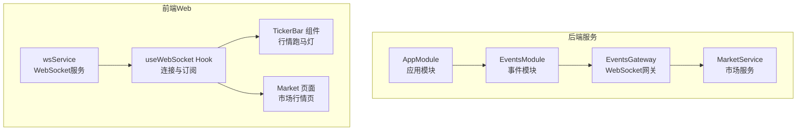
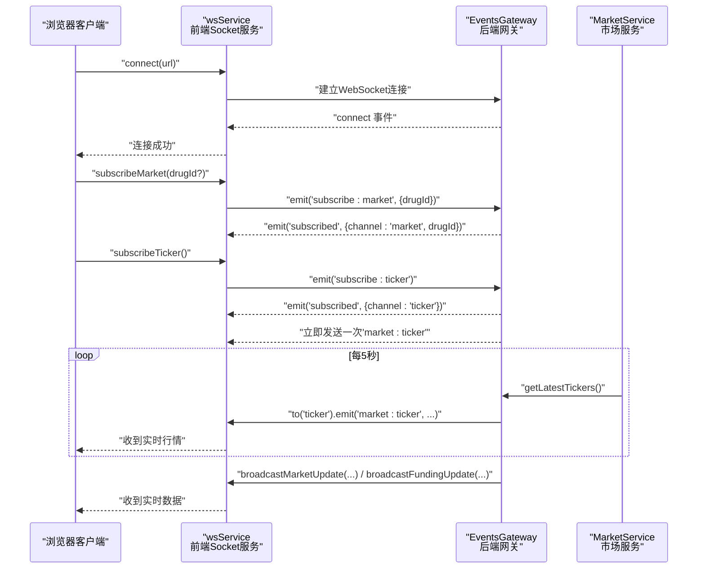
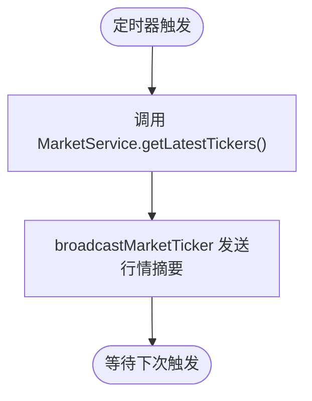
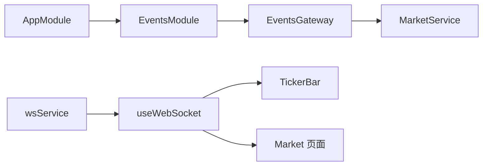

# 实时通信

<cite>
**本文引用的文件**
- [package.json](file://package.json)
- [pnpm-workspace.yaml](file://pnpm-workspace.yaml)
- [tsconfig.json](file://tsconfig.json)
- [packages/server/src/main.ts](file://packages/server/src/main.ts)
- [packages/server/src/app.module.ts](file://packages/server/src/app.module.ts)
- [packages/server/src/common/events/events.module.ts](file://packages/server/src/common/events/events.module.ts)
- [packages/server/src/common/events/events.gateway.ts](file://packages/server/src/common/events/events.gateway.ts)
- [packages/server/src/modules/market/market.service.ts](file://packages/server/src/modules/market/market.service.ts)
- [packages/web/src/services/websocket.ts](file://packages/web/src/services/websocket.ts)
- [packages/web/src/hooks/useWebSocket.ts](file://packages/web/src/hooks/useWebSocket.ts)
- [packages/web/src/components/TickerBar/index.tsx](file://packages/web/src/components/TickerBar/index.tsx)
- [packages/web/src/pages/Market.tsx](file://packages/web/src/pages/Market.tsx)
- [packages/web/src/App.tsx](file://packages/web/src/App.tsx)
</cite>

## 目录
1. [简介](#简介)
2. [项目结构](#项目结构)
3. [核心组件](#核心组件)
4. [架构总览](#架构总览)
5. [详细组件分析](#详细组件分析)
6. [依赖关系分析](#依赖关系分析)
7. [性能考量](#性能考量)
8. [故障排查指南](#故障排查指南)
9. [结论](#结论)
10. [附录](#附录)

## 简介
本文件面向Jiaoyi实时通信系统，聚焦于基于Socket.IO的WebSocket通信机制，涵盖连接建立、事件广播、客户端管理、消息格式与事件类型定义、实时数据推送（市场行情、订单状态、系统通知）、客户端重连与错误处理、安全与性能优化、监控方案以及前端Hook与组件的状态同步实践。目标是帮助开发者快速理解并正确使用该实时通信子系统。

## 项目结构
Jiaoyi采用Monorepo组织，分为后端服务与前端Web两部分。实时通信主要由后端NestJS + Socket.IO网关与前端React + socket.io-client组成，二者通过统一的事件通道进行交互。

图表来源
- [packages/server/src/app.module.ts:15-51](file://packages/server/src/app.module.ts#L15-L51)
- [packages/server/src/common/events/events.module.ts:1-15](file://packages/server/src/common/events/events.module.ts#L1-L15)
- [packages/server/src/common/events/events.gateway.ts:15-38](file://packages/server/src/common/events/events.gateway.ts#L15-L38)
- [packages/server/src/modules/market/market.service.ts:474-496](file://packages/server/src/modules/market/market.service.ts#L474-L496)
- [packages/web/src/services/websocket.ts:4-172](file://packages/web/src/services/websocket.ts#L4-L172)
- [packages/web/src/hooks/useWebSocket.ts:16-135](file://packages/web/src/hooks/useWebSocket.ts#L16-L135)
- [packages/web/src/components/TickerBar/index.tsx:20-89](file://packages/web/src/components/TickerBar/index.tsx#L20-L89)
- [packages/web/src/pages/Market.tsx:45-97](file://packages/web/src/pages/Market.tsx#L45-L97)

章节来源
- [package.json:1-24](file://package.json#L1-L24)
- [pnpm-workspace.yaml:1-3](file://pnpm-workspace.yaml#L1-L3)
- [tsconfig.json:1-17](file://tsconfig.json#L1-L17)

## 核心组件
- 后端网关与模块
  - EventsGateway：负责WebSocket初始化、连接生命周期管理、订阅处理、定时广播等。
  - EventsModule：装配ScheduleModule与MarketModule，注入EventsGateway。
  - MarketService：提供市场数据查询与聚合，支撑网关的定时广播。
- 前端服务与Hook
  - wsService：封装socket.io-client，提供连接、断开、订阅、事件派发与重连策略。
  - useWebSocket：React Hook，统一管理连接状态、订阅行为与事件回调注册/注销。
  - TickerBar与Market页面：展示实时行情与统计数据，体现数据绑定与状态同步。

章节来源
- [packages/server/src/common/events/events.gateway.ts:22-165](file://packages/server/src/common/events/events.gateway.ts#L22-L165)
- [packages/server/src/common/events/events.module.ts:1-15](file://packages/server/src/common/events/events.module.ts#L1-L15)
- [packages/server/src/modules/market/market.service.ts:474-496](file://packages/server/src/modules/market/market.service.ts#L474-L496)
- [packages/web/src/services/websocket.ts:4-172](file://packages/web/src/services/websocket.ts#L4-L172)
- [packages/web/src/hooks/useWebSocket.ts:16-135](file://packages/web/src/hooks/useWebSocket.ts#L16-L135)
- [packages/web/src/components/TickerBar/index.tsx:20-89](file://packages/web/src/components/TickerBar/index.tsx#L20-L89)
- [packages/web/src/pages/Market.tsx:45-97](file://packages/web/src/pages/Market.tsx#L45-L97)

## 架构总览
下图展示了从客户端发起订阅到服务端广播的完整链路，以及定时任务驱动的周期性推送。

图表来源
- [packages/web/src/services/websocket.ts:12-27](file://packages/web/src/services/websocket.ts#L12-L27)
- [packages/web/src/services/websocket.ts:103-120](file://packages/web/src/services/websocket.ts#L103-L120)
- [packages/web/src/services/websocket.ts:113-115](file://packages/web/src/services/websocket.ts#L113-L115)
- [packages/server/src/common/events/events.gateway.ts:34-38](file://packages/server/src/common/events/events.gateway.ts#L34-L38)
- [packages/server/src/common/events/events.gateway.ts:66-74](file://packages/server/src/common/events/events.gateway.ts#L66-L74)
- [packages/server/src/common/events/events.gateway.ts:127-143](file://packages/server/src/common/events/events.gateway.ts#L127-L143)
- [packages/server/src/common/events/events.gateway.ts:146-156](file://packages/server/src/common/events/events.gateway.ts#L146-L156)
- [packages/server/src/common/events/events.gateway.ts:77-84](file://packages/server/src/common/events/events.gateway.ts#L77-L84)
- [packages/server/src/common/events/events.gateway.ts:110-116](file://packages/server/src/common/events/events.gateway.ts#L110-L116)
- [packages/server/src/modules/market/market.service.ts:474-496](file://packages/server/src/modules/market/market.service.ts#L474-L496)

## 详细组件分析

### 后端：EventsGateway（WebSocket网关）
- 初始化与生命周期
  - afterInit：启动定时任务，周期性拉取最新行情并广播。
  - handleConnection/handleDisconnect：记录连接与断开日志。
- 订阅处理
  - subscribe:market：按药品维度加入房间；支持全局与按药房粒度推送。
  - subscribe:trades：按用户维度加入房间；仅向对应用户推送交易更新。
  - subscribe:ticker：加入“ticker”房间，立即回推一次当前行情。
- 广播方法
  - broadcastMarketUpdate/broadcastMarketSnapshot：全量与按药房推送市场数据。
  - broadcastMarketTicker：向“ticker”房间与全量推送行情摘要。
  - broadcastTradeUpdate/broadcastFundingUpdate/broadcastSettlementComplete：按需推送交易、垫资与结算完成通知。
- 定时广播流程

图表来源
- [packages/server/src/common/events/events.gateway.ts:127-143](file://packages/server/src/common/events/events.gateway.ts#L127-L143)
- [packages/server/src/common/events/events.gateway.ts:105-108](file://packages/server/src/common/events/events.gateway.ts#L105-L108)
- [packages/server/src/modules/market/market.service.ts:474-496](file://packages/server/src/modules/market/market.service.ts#L474-L496)

章节来源
- [packages/server/src/common/events/events.gateway.ts:22-165](file://packages/server/src/common/events/events.gateway.ts#L22-L165)
- [packages/server/src/common/events/events.module.ts:1-15](file://packages/server/src/common/events/events.module.ts#L1-L15)

### 后端：MarketService（市场数据服务）
- 提供getLatestTickers，返回各药品的最新行情摘要，供网关定时广播。
- 其他能力：生成市场快照、计算统计指标、K线数据、垫资深度等，支撑页面与组件渲染。

章节来源
- [packages/server/src/modules/market/market.service.ts:474-496](file://packages/server/src/modules/market/market.service.ts#L474-L496)

### 前端：wsService（Socket服务）
- 连接管理
  - connect：使用socket.io-client，限定传输协议为websocket，启用自动重连与最大尝试次数。
  - disconnect：断开连接并清理监听。
- 事件处理
  - setupEventHandlers：注册connect/disconnect/connect_error/subscribed及各类业务事件的转发。
  - emit：内部事件派发，避免外部直接访问socket回调。
- 订阅接口
  - subscribeMarket/subscribeTrades/subscribeTicker/unsubscribeTicker：向后端发送订阅消息。

章节来源
- [packages/web/src/services/websocket.ts:4-172](file://packages/web/src/services/websocket.ts#L4-L172)

### 前端：useWebSocket（React Hook）
- 功能
  - 统一连接、断开、订阅与事件监听；自动检测连接状态。
  - 生命周期内注册/注销事件监听，避免内存泄漏。
- 返回值
  - isConnected、connect、disconnect、subscribeMarket、subscribeTrades、subscribeTicker、unsubscribeTicker。

章节来源
- [packages/web/src/hooks/useWebSocket.ts:16-135](file://packages/web/src/hooks/useWebSocket.ts#L16-L135)

### 前端：TickerBar与Market页面
- TickerBar：展示实时行情跑马灯，支持鼠标悬停暂停滚动，点击跳转交易页。
- Market页面：组合统计卡片与表格，结合API与实时数据，形成完整的市场视图。

章节来源
- [packages/web/src/components/TickerBar/index.tsx:20-89](file://packages/web/src/components/TickerBar/index.tsx#L20-L89)
- [packages/web/src/pages/Market.tsx:45-97](file://packages/web/src/pages/Market.tsx#L45-L97)

## 依赖关系分析
- 后端
  - AppModule导入EventsModule与MarketModule，EventsModule导入ScheduleModule与MarketModule，EventsGateway依赖MarketService。
- 前端
  - wsService作为单例，被useWebSocket Hook与各页面组件复用；TickerBar与Market页面通过Hook接入实时数据。

图表来源
- [packages/server/src/app.module.ts:15-51](file://packages/server/src/app.module.ts#L15-L51)
- [packages/server/src/common/events/events.module.ts:1-15](file://packages/server/src/common/events/events.module.ts#L1-L15)
- [packages/server/src/common/events/events.gateway.ts:22-32](file://packages/server/src/common/events/events.gateway.ts#L22-L32)
- [packages/server/src/modules/market/market.service.ts:80-93](file://packages/server/src/modules/market/market.service.ts#L80-L93)
- [packages/web/src/services/websocket.ts:172-172](file://packages/web/src/services/websocket.ts#L172-L172)
- [packages/web/src/hooks/useWebSocket.ts:16-135](file://packages/web/src/hooks/useWebSocket.ts#L16-L135)
- [packages/web/src/components/TickerBar/index.tsx:20-89](file://packages/web/src/components/TickerBar/index.tsx#L20-L89)
- [packages/web/src/pages/Market.tsx:45-97](file://packages/web/src/pages/Market.tsx#L45-L97)

章节来源
- [packages/server/src/app.module.ts:15-51](file://packages/server/src/app.module.ts#L15-L51)
- [packages/web/src/services/websocket.ts:172-172](file://packages/web/src/services/websocket.ts#L172-L172)

## 性能考量
- 广播粒度控制
  - 使用房间（room）机制按药品或用户维度精准推送，避免全量广播造成带宽浪费。
- 定时任务节流
  - ticker广播周期固定为5秒，建议根据业务负载与网络状况调整频率。
- 前端事件去抖
  - 在高频更新场景下，可在前端对UI渲染做节流/防抖，减少重绘压力。
- 连接与重连
  - 合理设置reconnectionAttempts与reconnectionDelay，避免频繁重连导致服务器压力。
- 数据压缩
  - 对批量行情数据可考虑字段裁剪与序列化优化，降低消息体积。
- 监控指标
  - 建议采集：连接数、消息吞吐、广播延迟、重连次数、错误率等。

## 故障排查指南
- 连接问题
  - 检查后端CORS与跨域配置，确保前端域名与端口允许访问。
  - 查看后端日志中afterInit与连接事件输出，确认网关初始化成功。
- 订阅无效
  - 确认前端已调用subscribeMarket/subscribeTicker并收到“subscribed”确认。
  - 检查房间名拼写与参数传递（如drugId、userId）。
- 广播异常
  - 核查MarketService.getLatestTickers是否正常返回数据。
  - 关注网关定时任务执行日志，定位异常捕获与错误输出。
- 前端重连
  - 若出现connect_error，检查reconnectAttempts阈值与断线原因；超过阈值会主动断开避免资源占用。
- UI无更新
  - 确认useWebSocket已注册相应事件回调；在组件卸载时确保off已调用，避免内存泄漏。

章节来源
- [packages/server/src/common/events/events.gateway.ts:34-38](file://packages/server/src/common/events/events.gateway.ts#L34-L38)
- [packages/server/src/common/events/events.gateway.ts:132-142](file://packages/server/src/common/events/events.gateway.ts#L132-L142)
- [packages/web/src/services/websocket.ts:42-59](file://packages/web/src/services/websocket.ts#L42-L59)
- [packages/web/src/hooks/useWebSocket.ts:76-124](file://packages/web/src/hooks/useWebSocket.ts#L76-L124)

## 结论
Jiaoyi实时通信系统通过NestJS + Socket.IO实现了清晰的网关层与服务层分离，前端以Hook与服务封装提供一致的订阅与事件处理体验。系统具备房间级精准推送、定时广播、重连与错误处理等关键能力，能够满足市场行情、交易与系统通知的实时需求。建议在生产环境中完善监控与限流策略，持续优化广播频率与消息体大小，保障高并发下的稳定性与性能。

## 附录

### 事件类型与消息格式规范
- 订阅请求
  - subscribe:market：{ drugId?: string }
  - subscribe:trades：{ userId?: string }
  - subscribe:ticker：无参数
  - unsubscribe:ticker：无参数
- 订阅确认
  - subscribed：{ channel: 'market'|'trades'|'ticker', drugId?: string, userId?: string }
- 实时推送
  - market:update：市场明细更新（含drugId时仅推送到对应房间）
  - market:snapshot：市场快照更新（含drugId时仅推送到对应房间）
  - market:ticker：行情摘要（包含timestamp与tickers数组）
  - trade:update：交易状态更新（按user房间推送）
  - funding:update：垫资相关更新（按drug或全局推送）
  - settlement:complete：结算完成通知（按drug或全局推送）
  - system:notification：系统通知（全局推送）

章节来源
- [packages/server/src/common/events/events.gateway.ts:48-74](file://packages/server/src/common/events/events.gateway.ts#L48-L74)
- [packages/server/src/common/events/events.gateway.ts:86-124](file://packages/server/src/common/events/events.gateway.ts#L86-L124)
- [packages/web/src/services/websocket.ts:103-120](file://packages/web/src/services/websocket.ts#L103-L120)
- [packages/web/src/services/websocket.ts:66-99](file://packages/web/src/services/websocket.ts#L66-L99)

### 安全与合规建议
- 认证与授权
  - 在EventsGateway中引入鉴权守卫，确保订阅与推送权限可控。
- 防刷与限流
  - 对订阅与取消订阅接口增加速率限制，防止恶意刷取。
- 传输安全
  - 生产环境启用wss与TLS，避免明文传输。
- 数据脱敏
  - 对涉及用户隐私的字段在推送前做脱敏处理。

### 最佳实践
- 前端
  - 使用useWebSocket集中管理连接与订阅，避免重复连接。
  - 在组件卸载时显式off事件回调，防止内存泄漏。
  - 对高频UI更新做节流/防抖，提升交互流畅度。
- 后端
  - 将广播逻辑集中在网关层，服务层专注数据聚合。
  - 对异常进行统一捕获与日志记录，便于追踪。
  - 定时任务与数据库查询应尽量轻量化，避免阻塞。

### 与前端组件的数据绑定与状态同步
- useWebSocket返回isConnected与订阅方法，页面组件可据此切换UI状态与交互。
- TickerBar接收实时tickers数组，实现无缝滚动展示；Market页面结合API与实时数据，保持视图一致性。
- App路由层可结合鉴权状态与实时连接状态，决定页面渲染与导航行为。

章节来源
- [packages/web/src/hooks/useWebSocket.ts:16-135](file://packages/web/src/hooks/useWebSocket.ts#L16-L135)
- [packages/web/src/components/TickerBar/index.tsx:20-89](file://packages/web/src/components/TickerBar/index.tsx#L20-L89)
- [packages/web/src/pages/Market.tsx:45-97](file://packages/web/src/pages/Market.tsx#L45-L97)
- [packages/web/src/App.tsx:12-31](file://packages/web/src/App.tsx#L12-L31)