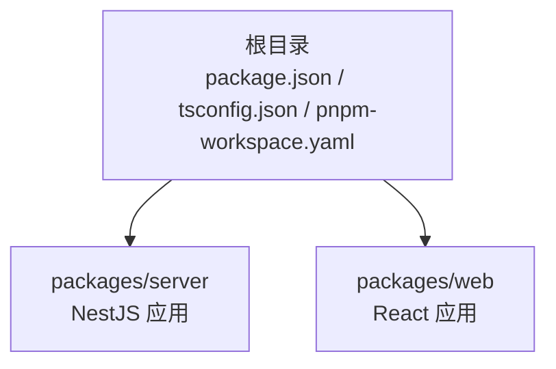
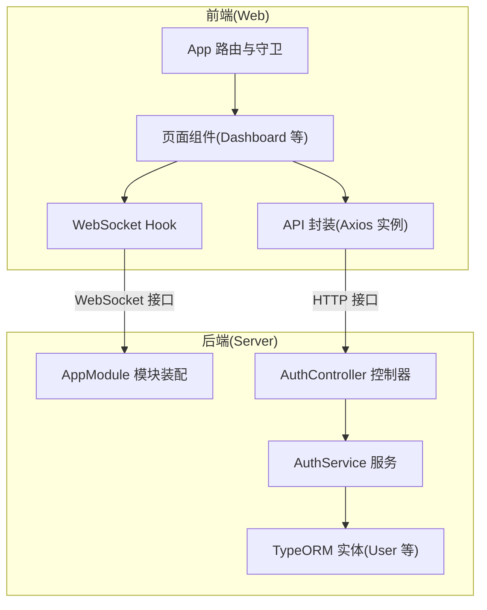
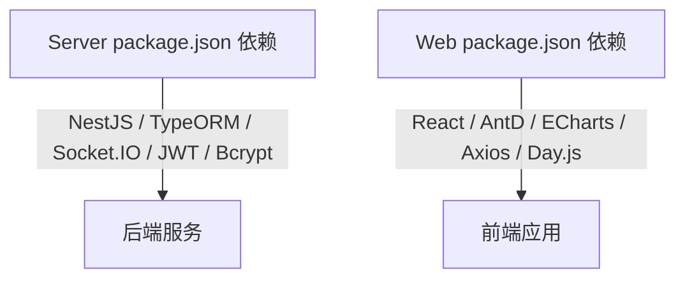

# 代码风格规范

<cite>
**本文引用的文件**
- [package.json](file://package.json)
- [pnpm-workspace.yaml](file://pnpm-workspace.yaml)
- [tsconfig.json](file://tsconfig.json)
- [packages/server/package.json](file://packages/server/package.json)
- [packages/server/nest-cli.json](file://packages/server/nest-cli.json)
- [packages/server/tsconfig.json](file://packages/server/tsconfig.json)
- [packages/server/src/app.module.ts](file://packages/server/src/app.module.ts)
- [packages/server/src/modules/auth/auth.controller.ts](file://packages/server/src/modules/auth/auth.controller.ts)
- [packages/server/src/modules/auth/auth.service.ts](file://packages/server/src/modules/auth/auth.service.ts)
- [packages/server/src/database/entities/user.entity.ts](file://packages/server/src/database/entities/user.entity.ts)
- [packages/web/package.json](file://packages/web/package.json)
- [packages/web/tsconfig.json](file://packages/web/tsconfig.json)
- [packages/web/tsconfig.node.json](file://packages/web/tsconfig.node.json)
- [packages/web/vite.config.ts](file://packages/web/vite.config.ts)
- [packages/web/src/App.tsx](file://packages/web/src/App.tsx)
- [packages/web/src/pages/Dashboard.tsx](file://packages/web/src/pages/Dashboard.tsx)
- [packages/web/src/services/api.ts](file://packages/web/src/services/api.ts)
- [packages/web/src/hooks/useWebSocket.ts](file://packages/web/src/hooks/useWebSocket.ts)
</cite>

## 目录
1. [引言](#引言)
2. [项目结构](#项目结构)
3. [核心组件](#核心组件)
4. [架构总览](#架构总览)
5. [详细组件分析](#详细组件分析)
6. [依赖分析](#依赖分析)
7. [性能考虑](#性能考虑)
8. [故障排查指南](#故障排查指南)
9. [结论](#结论)
10. [附录](#附录)

## 引言
本规范旨在统一 Jiaoyi 项目的 TypeScript 编码风格与工程化实践，覆盖 NestJS 后端与 React 前端的代码组织、TypeORM 实体定义、控制器与服务编写、Ant Design 组件使用、样式组织与 CSS-in-JS 最佳实践、代码格式化与自动化工具集成，以及注释与文档字符串标准。本文档以仓库现有实现为依据，提炼可复用的规范与流程。

## 项目结构
Jiaoyi 采用 monorepo 结构，通过工作区管理后端与前端两个子包，并在根级统一脚本与类型配置。后端使用 NestJS + TypeORM，前端使用 Vite + React + Ant Design。

图表来源
- [package.json:1-24](file://package.json#L1-L24)
- [pnpm-workspace.yaml:1-3](file://pnpm-workspace.yaml#L1-L3)

章节来源
- [package.json:1-24](file://package.json#L1-L24)
- [pnpm-workspace.yaml:1-3](file://pnpm-workspace.yaml#L1-L3)

## 核心组件
- 服务器入口与模块装配：应用模块集中导入各业务模块与数据库模块，统一配置 TypeORM、全局配置模块与事件模块。
- 认证模块：控制器负责登录、注册、登出与个人资料查询；服务层完成用户校验、JWT 签发、注册与资料查询。
- 数据模型：TypeORM 实体定义用户角色枚举、字段约束与关系映射。
- 前端路由与布局：基于 React Router 的私有路由守卫与基础布局，页面按功能分层组织。
- API 封装与拦截器：Axios 实例封装请求/响应拦截器，统一封装认证与错误处理。
- WebSocket 集成：自定义 Hook 管理连接生命周期与订阅主题。

章节来源
- [packages/server/src/app.module.ts:1-51](file://packages/server/src/app.module.ts#L1-L51)
- [packages/server/src/modules/auth/auth.controller.ts:1-53](file://packages/server/src/modules/auth/auth.controller.ts#L1-L53)
- [packages/server/src/modules/auth/auth.service.ts:1-100](file://packages/server/src/modules/auth/auth.service.ts#L1-L100)
- [packages/server/src/database/entities/user.entity.ts:1-58](file://packages/server/src/database/entities/user.entity.ts#L1-L58)
- [packages/web/src/App.tsx:1-58](file://packages/web/src/App.tsx#L1-L58)
- [packages/web/src/services/api.ts:1-311](file://packages/web/src/services/api.ts#L1-L311)
- [packages/web/src/hooks/useWebSocket.ts:1-138](file://packages/web/src/hooks/useWebSocket.ts#L1-L138)

## 架构总览
前后端通过代理与 API 封装协同，WebSocket 提供实时行情与交易流推送。

图表来源
- [packages/web/src/App.tsx:1-58](file://packages/web/src/App.tsx#L1-L58)
- [packages/web/src/services/api.ts:1-311](file://packages/web/src/services/api.ts#L1-L311)
- [packages/web/src/hooks/useWebSocket.ts:1-138](file://packages/web/src/hooks/useWebSocket.ts#L1-L138)
- [packages/server/src/app.module.ts:1-51](file://packages/server/src/app.module.ts#L1-L51)
- [packages/server/src/modules/auth/auth.controller.ts:1-53](file://packages/server/src/modules/auth/auth.controller.ts#L1-L53)
- [packages/server/src/modules/auth/auth.service.ts:1-100](file://packages/server/src/modules/auth/auth.service.ts#L1-L100)
- [packages/server/src/database/entities/user.entity.ts:1-58](file://packages/server/src/database/entities/user.entity.ts#L1-L58)

## 详细组件分析

### NestJS 后端：模块与文件组织
- 模块划分：按业务域拆分模块（如 auth、user、drug、funding、sales、settlement、account、market），每个模块内含 controller、service、dto、guards、decorators 等子目录，保持高内聚低耦合。
- 入口装配：AppModule 导入 ConfigModule、TypeOrmModule.forFeatureAsync、DatabaseModule、EventsModule 与各业务模块，集中配置数据库连接、同步与迁移策略。
- 控制器职责：仅处理路由、参数校验与鉴权装饰器，不包含业务逻辑。
- 服务职责：封装业务流程、调用仓储与外部服务，抛出领域异常。

章节来源
- [packages/server/src/app.module.ts:1-51](file://packages/server/src/app.module.ts#L1-L51)
- [packages/server/src/modules/auth/auth.controller.ts:1-53](file://packages/server/src/modules/auth/auth.controller.ts#L1-L53)
- [packages/server/src/modules/auth/auth.service.ts:1-100](file://packages/server/src/modules/auth/auth.service.ts#L1-L100)

### NestJS 控制器与服务编写标准
- 控制器
  - 使用装饰器标注路由与 HTTP 方法，明确状态码与鉴权要求。
  - 参数使用 DTO 校验，避免在控制器中进行复杂校验。
  - 返回值结构统一，便于前端消费。
- 服务
  - 业务逻辑集中在服务层，使用仓储访问实体。
  - 对外抛出语义化的异常（如未授权、冲突等）。
  - 关键流程添加注释说明输入输出与边界条件。

章节来源
- [packages/server/src/modules/auth/auth.controller.ts:1-53](file://packages/server/src/modules/auth/auth.controller.ts#L1-L53)
- [packages/server/src/modules/auth/auth.service.ts:1-100](file://packages/server/src/modules/auth/auth.service.ts#L1-L100)

### TypeORM 实体定义规范
- 实体命名：使用名词复数形式，文件名与类名一致，如 user.entity.ts。
- 字段设计：显式声明唯一性、可空性与默认值；枚举使用独立枚举类型。
- 关系映射：一对多、一对一使用装饰器声明，避免循环依赖。
- 时间戳：使用创建与更新时间装饰器，统一审计字段。
- 建议：实体文件导出索引，便于模块化引入。

章节来源
- [packages/server/src/database/entities/user.entity.ts:1-58](file://packages/server/src/database/entities/user.entity.ts#L1-L58)

### React 前端：文件命名与目录组织
- 页面与布局：页面组件按功能命名（如 Dashboard.tsx），布局组件以 BasicLayout 命名。
- 组件：通用展示组件位于 components 目录，按功能拆分子目录（如 KLineChart、OrderBook、TickerBar）。
- 服务：API 封装与 WebSocket 服务分别置于 services 目录。
- 钩子：自定义 Hook 放于 hooks 目录，命名 useXxx。
- 类型：全局类型统一放在 types/index.ts。
- 样式：全局样式在 styles/global.css，组件局部样式在对应组件目录下 style.css。

章节来源
- [packages/web/src/App.tsx:1-58](file://packages/web/src/App.tsx#L1-L58)
- [packages/web/src/pages/Dashboard.tsx:1-573](file://packages/web/src/pages/Dashboard.tsx#L1-L573)
- [packages/web/src/services/api.ts:1-311](file://packages/web/src/services/api.ts#L1-L311)
- [packages/web/src/hooks/useWebSocket.ts:1-138](file://packages/web/src/hooks/useWebSocket.ts#L1-L138)

### Ant Design 组件使用规范
- 图标：从 @ant-design/icons 引入所需图标，按需使用。
- 布局：使用 Card、Row、Col、Typography 等组件组合页面结构。
- 表格：列定义清晰，渲染函数中使用条件样式与图标，保证可读性。
- 动态效果：使用 Skeleton、Tag、Select 等组件提升交互体验。
- 自定义样式：组件样式通过 className 与全局样式结合，避免内联样式污染。

章节来源
- [packages/web/src/pages/Dashboard.tsx:1-573](file://packages/web/src/pages/Dashboard.tsx#L1-L573)

### 样式文件组织与 CSS-in-JS 最佳实践
- 全局样式：在 styles/global.css 中维护全局重置与主题变量。
- 局部样式：组件样式与组件同目录下的 style.css，便于维护与复用。
- 组件内样式：优先使用 className 与 CSS Modules，避免内联样式。
- 动画与过渡：通过 CSS 动画与 React 动画库配合，减少 JS 动画带来的性能问题。

章节来源
- [packages/web/src/pages/Dashboard.tsx:1-573](file://packages/web/src/pages/Dashboard.tsx#L1-L573)

### 代码格式化配置与自动化工具集成
- ESLint：前后端均配置 ESLint 规则，确保语法与风格一致性。
- TypeScript：根与子包分别维护 tsconfig，启用严格模式、声明文件生成与 Source Map。
- Nest CLI：后端使用 nest-cli.json 指定源码根目录与编译行为。
- Vite：前端通过 vite.config.ts 配置路径别名与开发代理，便于联调。

章节来源
- [packages/server/package.json:1-90](file://packages/server/package.json#L1-L90)
- [packages/web/package.json:1-39](file://packages/web/package.json#L1-L39)
- [packages/server/nest-cli.json:1-9](file://packages/server/nest-cli.json#L1-L9)
- [packages/web/vite.config.ts:1-28](file://packages/web/vite.config.ts#L1-L28)
- [tsconfig.json:1-17](file://tsconfig.json#L1-L17)
- [packages/server/tsconfig.json:1-17](file://packages/server/tsconfig.json#L1-L17)
- [packages/web/tsconfig.json:1-17](file://packages/web/tsconfig.json#L1-L17)
- [packages/web/tsconfig.node.json:1-17](file://packages/web/tsconfig.node.json#L1-L17)

### 注释规范与文档字符串标准
- 文件头部：简要说明模块用途与作者信息。
- 类与接口：对公共属性与方法进行注释，说明输入、输出与异常。
- 函数：对复杂逻辑添加注释，说明边界条件与返回值含义。
- API 文档：建议使用工具生成接口文档，保持与实现同步。

章节来源
- [packages/server/src/modules/auth/auth.service.ts:1-100](file://packages/server/src/modules/auth/auth.service.ts#L1-L100)
- [packages/web/src/services/api.ts:1-311](file://packages/web/src/services/api.ts#L1-L311)

## 依赖分析
- 后端依赖：NestJS 核心、TypeORM、JWT、Passport、Socket.IO、Bcrypt、Class-Validator 等。
- 前端依赖：React、React Router、Ant Design、ECharts、Axios、Socket.IO 客户端、Day.js 等。
- 测试与构建：Jest、Vite、ESLint、TypeScript。

图表来源
- [packages/server/package.json:1-90](file://packages/server/package.json#L1-L90)
- [packages/web/package.json:1-39](file://packages/web/package.json#L1-L39)

章节来源
- [packages/server/package.json:1-90](file://packages/server/package.json#L1-L90)
- [packages/web/package.json:1-39](file://packages/web/package.json#L1-L39)

## 性能考虑
- 前端
  - 使用骨架屏与懒加载优化首屏与表格渲染。
  - 合理使用状态与副作用，避免不必要的重渲染。
  - WebSocket 连接与订阅需在组件卸载时清理，防止内存泄漏。
- 后端
  - 使用仓储与查询优化，避免 N+1 查询。
  - 合理使用缓存与异步任务，降低数据库压力。
  - 日志级别与调试开关在不同环境区分配置。

## 故障排查指南
- 登录/鉴权
  - 检查请求拦截器是否正确注入 Authorization 头。
  - 响应拦截器对 401 的处理逻辑，确认本地存储的令牌状态。
- WebSocket
  - 确认代理配置与服务端 WS 地址一致。
  - 在组件卸载时调用断开连接与取消订阅。
- 数据库
  - 确认 TypeORM 连接参数与迁移配置，开发环境关闭同步，生产环境开启迁移运行。

章节来源
- [packages/web/src/services/api.ts:1-311](file://packages/web/src/services/api.ts#L1-L311)
- [packages/web/src/hooks/useWebSocket.ts:1-138](file://packages/web/src/hooks/useWebSocket.ts#L1-L138)
- [packages/server/src/app.module.ts:1-51](file://packages/server/src/app.module.ts#L1-L51)

## 结论
本规范以现有代码为蓝本，总结了 Jiaoyi 项目的 TypeScript 编码风格、模块划分与工程化实践。建议在后续迭代中持续完善注释与文档，统一新增模块的目录与文件命名，强化自动化检查与测试覆盖率，确保代码质量与团队协作效率。

## 附录

### 代码风格与命名约定清单
- TypeScript
  - 严格模式开启，启用声明文件与 Source Map。
  - 文件命名：类与实体使用 PascalCase，DTO 使用 XxxDto，枚举使用名词复数。
  - 目录命名：小写加连字符，如 modules、common、database。
- NestJS
  - 控制器：仅处理路由与鉴权，参数使用 DTO。
  - 服务：封装业务逻辑，抛出领域异常。
  - 模块：按业务域拆分，导出模块入口。
- React
  - 组件：函数式组件优先，Hook 命名 useXxx。
  - 目录：components、pages、services、hooks、styles、types。
  - 样式：全局样式与组件局部样式分离，避免内联样式。
- Ant Design
  - 图标与组件按需引入，统一使用 AntD 组件库。
  - 表格列与渲染函数保持一致的样式与可读性。

章节来源
- [packages/server/src/app.module.ts:1-51](file://packages/server/src/app.module.ts#L1-L51)
- [packages/server/src/modules/auth/auth.controller.ts:1-53](file://packages/server/src/modules/auth/auth.controller.ts#L1-L53)
- [packages/server/src/modules/auth/auth.service.ts:1-100](file://packages/server/src/modules/auth/auth.service.ts#L1-L100)
- [packages/server/src/database/entities/user.entity.ts:1-58](file://packages/server/src/database/entities/user.entity.ts#L1-L58)
- [packages/web/src/App.tsx:1-58](file://packages/web/src/App.tsx#L1-L58)
- [packages/web/src/pages/Dashboard.tsx:1-573](file://packages/web/src/pages/Dashboard.tsx#L1-L573)
- [packages/web/src/services/api.ts:1-311](file://packages/web/src/services/api.ts#L1-L311)
- [packages/web/src/hooks/useWebSocket.ts:1-138](file://packages/web/src/hooks/useWebSocket.ts#L1-L138)