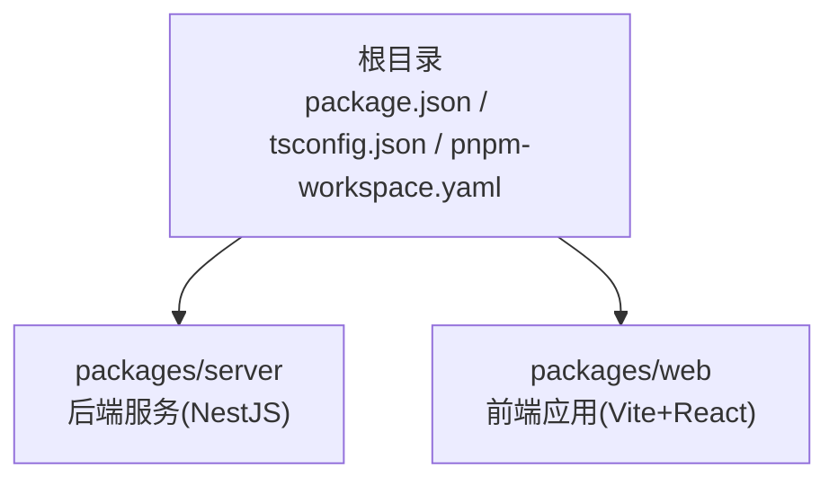
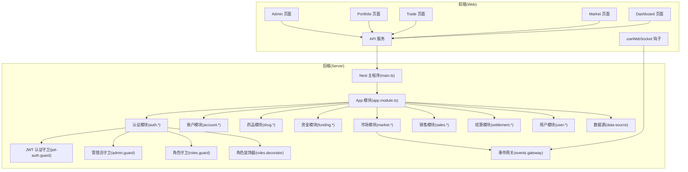
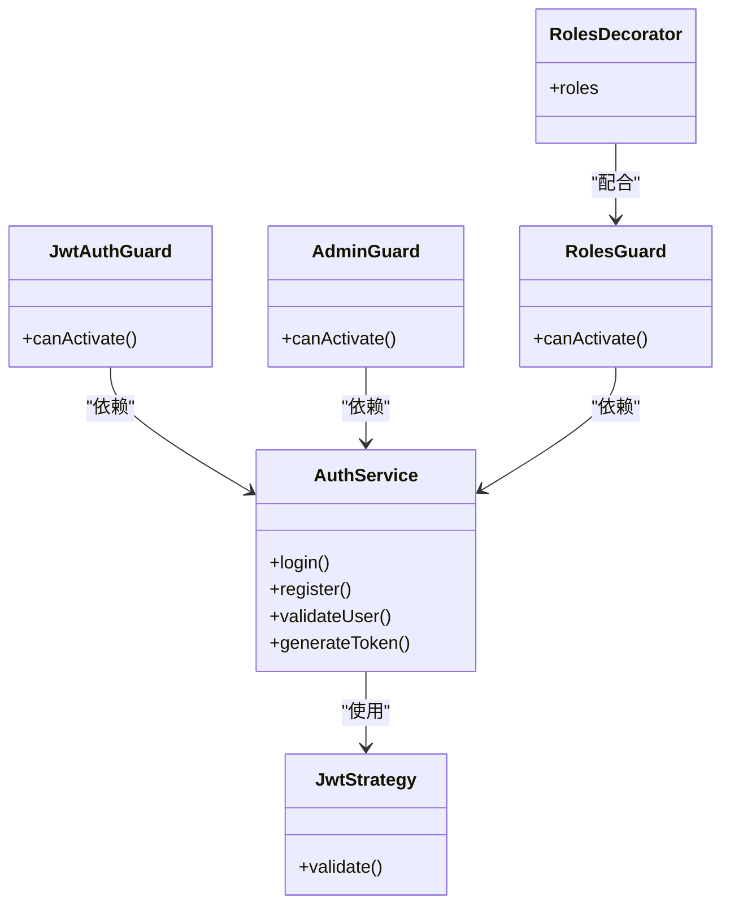
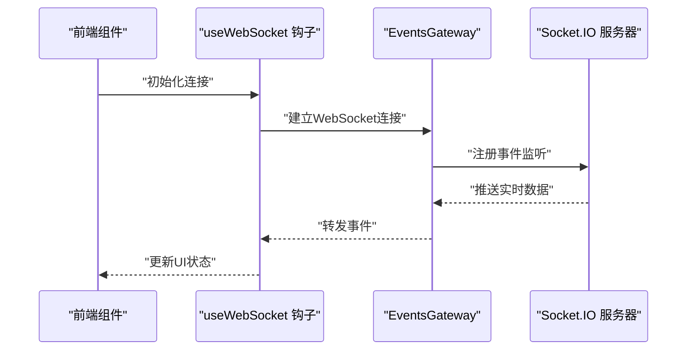
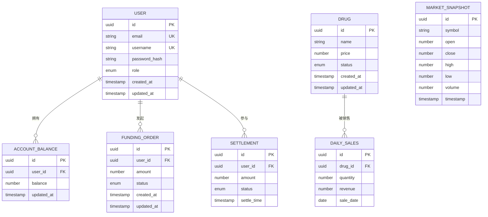
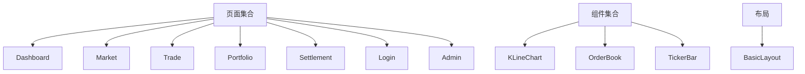
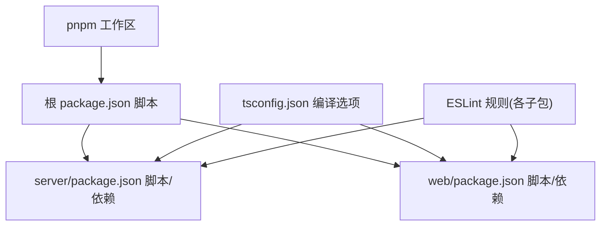

# 开发指南

<cite>
**本文引用的文件**
- [package.json](file://package.json)
- [pnpm-workspace.yaml](file://pnpm-workspace.yaml)
- [tsconfig.json](file://tsconfig.json)
- [packages/server/package.json](file://packages/server/package.json)
- [packages/web/package.json](file://packages/web/package.json)
- [packages/server/src/modules/auth/auth.service.ts](file://packages/server/src/modules/auth/auth.service.ts)
- [packages/server/src/modules/account/account.service.ts](file://packages/server/src/modules/account/account.service.ts)
- [packages/server/src/modules/drug/drug.service.ts](file://packages/server/src/modules/drug/drug.service.ts)
- [packages/server/src/modules/funding/funding.service.ts](file://packages/server/src/modules/funding/funding.service.ts)
- [packages/server/src/modules/market/market.service.ts](file://packages/server/src/modules/market/market.service.ts)
- [packages/server/src/modules/sales/sales.service.ts](file://packages/server/src/modules/sales/sales.service.ts)
- [packages/server/src/modules/settlement/settlement.service.ts](file://packages/server/src/modules/settlement/settlement.service.ts)
- [packages/server/src/modules/user/user.service.ts](file://packages/server/src/modules/user/user.service.ts)
- [packages/server/src/common/guards/jwt-auth.guard.ts](file://packages/server/src/common/guards/jwt-auth.guard.ts)
- [packages/server/src/common/guards/admin.guard.ts](file://packages/server/src/common/guards/admin.guard.ts)
- [packages/server/src/common/guards/roles.guard.ts](file://packages/server/src/common/guards/roles.guard.ts)
- [packages/server/src/common/decorators/roles.decorator.ts](file://packages/server/src/common/decorators/roles.decorator.ts)
- [packages/server/src/common/events/events.gateway.ts](file://packages/server/src/common/events/events.gateway.ts)
- [packages/server/src/common/events/events.module.ts](file://packages/server/src/common/events/events.module.ts)
- [packages/server/src/database/entities/index.ts](file://packages/server/src/database/entities/index.ts)
- [packages/server/src/database/data-source.ts](file://packages/server/src/database/data-source.ts)
- [packages/server/src/database/seeds/initial.seed.ts](file://packages/server/src/database/seeds/initial.seed.ts)
- [packages/server/src/app.module.ts](file://packages/server/src/app.module.ts)
- [packages/server/src/main.ts](file://packages/server/src/main.ts)
- [packages/web/src/services/api.ts](file://packages/web/src/services/api.ts)
- [packages/web/src/services/websocket.ts](file://packages/web/src/services/websocket.ts)
- [packages/web/src/hooks/useWebSocket.ts](file://packages/web/src/hooks/useWebSocket.ts)
- [packages/web/src/pages/Dashboard.tsx](file://packages/web/src/pages/Dashboard.tsx)
- [packages/web/src/pages/Login.tsx](file://packages/web/src/pages/Login.tsx)
- [packages/web/src/pages/Market.tsx](file://packages/web/src/pages/Market.tsx)
- [packages/web/src/pages/Trade.tsx](file://packages/web/src/pages/Trade.tsx)
- [packages/web/src/pages/Portfolio.tsx](file://packages/web/src/pages/Portfolio.tsx)
- [packages/web/src/pages/Admin.tsx](file://packages/web/src/pages/Admin.tsx)
- [packages/web/src/components/KLineChart/index.tsx](file://packages/web/src/components/KLineChart/index.tsx)
- [packages/web/src/components/OrderBook/index.tsx](file://packages/web/src/components/OrderBook/index.tsx)
- [packages/web/src/components/TickerBar/index.tsx](file://packages/web/src/components/TickerBar/index.tsx)
- [packages/web/src/layouts/BasicLayout.tsx](file://packages/web/src/layouts/BasicLayout.tsx)
- [packages/web/src/App.tsx](file://packages/web/src/App.tsx)
- [packages/web/src/main.tsx](file://packages/web/src/main.tsx)
</cite>

## 目录
1. [简介](#简介)
2. [项目结构](#项目结构)
3. [核心组件](#核心组件)
4. [架构总览](#架构总览)
5. [详细组件分析](#详细组件分析)
6. [依赖分析](#依赖分析)
7. [性能考虑](#性能考虑)
8. [故障排查指南](#故障排查指南)
9. [结论](#结论)
10. [附录](#附录)

## 简介
本开发指南面向Jiaoyi（药品垫资交易平台）项目的开发者，覆盖代码风格与提交规范、Git工作流、TypeScript与ESLint配置、测试策略（单元/集成/端到端）、代码审查标准、模块开发与接口设计原则、重构策略、调试与性能分析、团队协作与知识分享、以及开发工具与IDE配置建议。目标是帮助新老成员快速上手并保持高质量交付。

## 项目结构
Jiaoyi采用Monorepo结构，使用pnpm工作区管理前后端两个包：packages/server（后端NestJS）与packages/web（前端Vite+React）。根目录提供统一脚本与全局TypeScript配置；各子包独立管理依赖、构建与测试。

**图表来源**
- [pnpm-workspace.yaml:1-3](file://pnpm-workspace.yaml#L1-L3)
- [package.json:1-24](file://package.json#L1-L24)

**章节来源**
- [pnpm-workspace.yaml:1-3](file://pnpm-workspace.yaml#L1-L3)
- [package.json:1-24](file://package.json#L1-L24)
- [tsconfig.json:1-17](file://tsconfig.json#L1-L17)

## 核心组件
- 后端服务（Server）
  - 使用NestJS框架，模块化组织业务功能，如认证、账户、药品、资金、市场、销售、结算、用户等模块。
  - 提供JWT认证与角色守卫，支持WebSocket事件网关。
  - 数据层基于TypeORM，提供数据源配置、迁移与种子数据。
- 前端应用（Web）
  - React + Vite，Ant Design生态，提供看盘、交易、持仓、结算、管理后台等页面。
  - 封装API调用与WebSocket客户端，提供K线图、深度图、行情栏等组件。
- 全局配置
  - 统一TypeScript编译选项，启用严格模式、声明映射、SourceMap等。
  - 根脚本统一管理开发、构建、类型检查与代码质量检查。

**章节来源**
- [packages/server/package.json:1-90](file://packages/server/package.json#L1-L90)
- [packages/web/package.json:1-39](file://packages/web/package.json#L1-L39)
- [tsconfig.json:1-17](file://tsconfig.json#L1-L17)
- [packages/server/src/app.module.ts](file://packages/server/src/app.module.ts)
- [packages/server/src/main.ts](file://packages/server/src/main.ts)
- [packages/web/src/main.tsx](file://packages/web/src/main.tsx)

## 架构总览
系统由前端Web应用与后端Server组成，通过HTTP与WebSocket进行交互；后端提供REST接口与实时事件推送，数据库通过TypeORM管理。

**图表来源**
- [packages/server/src/main.ts](file://packages/server/src/main.ts)
- [packages/server/src/app.module.ts](file://packages/server/src/app.module.ts)
- [packages/server/src/common/guards/jwt-auth.guard.ts](file://packages/server/src/common/guards/jwt-auth.guard.ts)
- [packages/server/src/common/guards/admin.guard.ts](file://packages/server/src/common/guards/admin.guard.ts)
- [packages/server/src/common/guards/roles.guard.ts](file://packages/server/src/common/guards/roles.guard.ts)
- [packages/server/src/common/decorators/roles.decorator.ts](file://packages/server/src/common/decorators/roles.decorator.ts)
- [packages/server/src/common/events/events.gateway.ts](file://packages/server/src/common/events/events.gateway.ts)
- [packages/server/src/database/data-source.ts](file://packages/server/src/database/data-source.ts)
- [packages/web/src/services/api.ts](file://packages/web/src/services/api.ts)
- [packages/web/src/services/websocket.ts](file://packages/web/src/services/websocket.ts)
- [packages/web/src/hooks/useWebSocket.ts](file://packages/web/src/hooks/useWebSocket.ts)

## 详细组件分析

### 认证与权限模块
- 认证服务负责登录注册、密码加密与令牌签发；提供JWT策略与本地策略。
- 守卫体系包括JWT认证守卫与管理员守卫，配合角色装饰器实现RBAC。
- 控制器对路由进行保护，确保敏感操作仅限授权用户访问。

**图表来源**
- [packages/server/src/modules/auth/auth.service.ts](file://packages/server/src/modules/auth/auth.service.ts)
- [packages/server/src/common/guards/jwt-auth.guard.ts](file://packages/server/src/common/guards/jwt-auth.guard.ts)
- [packages/server/src/common/guards/admin.guard.ts](file://packages/server/src/common/guards/admin.guard.ts)
- [packages/server/src/common/guards/roles.guard.ts](file://packages/server/src/common/guards/roles.guard.ts)
- [packages/server/src/common/decorators/roles.decorator.ts](file://packages/server/src/common/decorators/roles.decorator.ts)

**章节来源**
- [packages/server/src/modules/auth/auth.service.ts](file://packages/server/src/modules/auth/auth.service.ts)
- [packages/server/src/common/guards/jwt-auth.guard.ts](file://packages/server/src/common/guards/jwt-auth.guard.ts)
- [packages/server/src/common/guards/admin.guard.ts](file://packages/server/src/common/guards/admin.guard.ts)
- [packages/server/src/common/guards/roles.guard.ts](file://packages/server/src/common/guards/roles.guard.ts)
- [packages/server/src/common/decorators/roles.decorator.ts](file://packages/server/src/common/decorators/roles.decorator.ts)

### 实时事件与WebSocket
- 事件网关提供实时行情与交易数据推送；前端通过自定义Hook订阅事件。
- 适合高频数据场景，降低轮询开销，提升用户体验。

**图表来源**
- [packages/web/src/hooks/useWebSocket.ts](file://packages/web/src/hooks/useWebSocket.ts)
- [packages/server/src/common/events/events.gateway.ts](file://packages/server/src/common/events/events.gateway.ts)

**章节来源**
- [packages/web/src/hooks/useWebSocket.ts](file://packages/web/src/hooks/useWebSocket.ts)
- [packages/server/src/common/events/events.gateway.ts](file://packages/server/src/common/events/events.gateway.ts)
- [packages/server/src/common/events/events.module.ts](file://packages/server/src/common/events/events.module.ts)

### 数据模型与仓储
- 实体涵盖账户余额、交易流水、日销售、药品、资金订单、市场快照、结算单、用户等。
- 数据源集中配置，迁移与种子用于初始化数据库结构与基础数据。

**图表来源**
- [packages/server/src/database/entities/index.ts](file://packages/server/src/database/entities/index.ts)
- [packages/server/src/database/data-source.ts](file://packages/server/src/database/data-source.ts)

**章节来源**
- [packages/server/src/database/entities/index.ts](file://packages/server/src/database/entities/index.ts)
- [packages/server/src/database/data-source.ts](file://packages/server/src/database/data-source.ts)
- [packages/server/src/database/seeds/initial.seed.ts](file://packages/server/src/database/seeds/initial.seed.ts)

### 前端页面与组件
- 页面：仪表盘、市场、交易、持仓、结算、登录、管理后台。
- 组件：K线图、深度图、行情栏，样式与逻辑分离。
- 布局：基础布局封装导航与容器。

**图表来源**
- [packages/web/src/pages/Dashboard.tsx](file://packages/web/src/pages/Dashboard.tsx)
- [packages/web/src/pages/Market.tsx](file://packages/web/src/pages/Market.tsx)
- [packages/web/src/pages/Trade.tsx](file://packages/web/src/pages/Trade.tsx)
- [packages/web/src/pages/Portfolio.tsx](file://packages/web/src/pages/Portfolio.tsx)
- [packages/web/src/pages/Settlement.tsx](file://packages/web/src/pages/Settlement.tsx)
- [packages/web/src/pages/Login.tsx](file://packages/web/src/pages/Login.tsx)
- [packages/web/src/pages/Admin.tsx](file://packages/web/src/pages/Admin.tsx)
- [packages/web/src/components/KLineChart/index.tsx](file://packages/web/src/components/KLineChart/index.tsx)
- [packages/web/src/components/OrderBook/index.tsx](file://packages/web/src/components/OrderBook/index.tsx)
- [packages/web/src/components/TickerBar/index.tsx](file://packages/web/src/components/TickerBar/index.tsx)
- [packages/web/src/layouts/BasicLayout.tsx](file://packages/web/src/layouts/BasicLayout.tsx)

**章节来源**
- [packages/web/src/pages/Dashboard.tsx](file://packages/web/src/pages/Dashboard.tsx)
- [packages/web/src/pages/Market.tsx](file://packages/web/src/pages/Market.tsx)
- [packages/web/src/pages/Trade.tsx](file://packages/web/src/pages/Trade.tsx)
- [packages/web/src/pages/Portfolio.tsx](file://packages/web/src/pages/Portfolio.tsx)
- [packages/web/src/pages/Settlement.tsx](file://packages/web/src/pages/Settlement.tsx)
- [packages/web/src/pages/Login.tsx](file://packages/web/src/pages/Login.tsx)
- [packages/web/src/pages/Admin.tsx](file://packages/web/src/pages/Admin.tsx)
- [packages/web/src/components/KLineChart/index.tsx](file://packages/web/src/components/KLineChart/index.tsx)
- [packages/web/src/components/OrderBook/index.tsx](file://packages/web/src/components/OrderBook/index.tsx)
- [packages/web/src/components/TickerBar/index.tsx](file://packages/web/src/components/TickerBar/index.tsx)
- [packages/web/src/layouts/BasicLayout.tsx](file://packages/web/src/layouts/BasicLayout.tsx)

## 依赖分析
- 工作区与脚本
  - pnpm工作区自动发现packages/*目录。
  - 根脚本统一触发前后端开发、构建、类型检查与代码质量检查。
- 语言与工具链
  - TypeScript版本与Node/PNPM版本要求在根配置中声明。
  - 各子包独立维护TypeScript与ESLint配置，保证一致性。
- 外部依赖
  - 后端：NestJS生态、TypeORM、Socket.IO、Passport、JWT、Redis等。
  - 前端：React、Ant Design、ECharts、Axios、Socket.IO客户端等。

**图表来源**
- [pnpm-workspace.yaml:1-3](file://pnpm-workspace.yaml#L1-L3)
- [package.json:6-14](file://package.json#L6-L14)
- [packages/server/package.json:8-24](file://packages/server/package.json#L8-L24)
- [packages/web/package.json:6-12](file://packages/web/package.json#L6-L12)
- [tsconfig.json:2-14](file://tsconfig.json#L2-L14)

**章节来源**
- [pnpm-workspace.yaml:1-3](file://pnpm-workspace.yaml#L1-L3)
- [package.json:6-14](file://package.json#L6-L14)
- [packages/server/package.json:8-24](file://packages/server/package.json#L8-L24)
- [packages/web/package.json:6-12](file://packages/web/package.json#L6-L12)
- [tsconfig.json:2-14](file://tsconfig.json#L2-L14)

## 性能考虑
- 前端
  - 使用Vite构建，按需加载与懒加载页面组件，减少首屏体积。
  - 图表组件（ECharts）建议在数据量大时开启采样与虚拟化渲染。
  - WebSocket长连接应避免频繁全量推送，采用增量更新与去抖策略。
- 后端
  - 使用TypeORM查询优化，合理索引与分页；批量写入与事务合并。
  - JWT令牌签发与校验成本可控，注意过期时间与刷新策略。
  - 事件网关按频道分区，避免广播风暴。
- 通用
  - 启用SourceMap便于生产调试；严格类型检查降低运行时错误。
  - 持续集成中加入性能回归检测（如Bundle大小阈值）。

[本节为通用指导，无需列出章节来源]

## 故障排查指南
- 开发启动失败
  - 检查Node与PNPM版本是否满足要求。
  - 清理node_modules与缓存后重装依赖。
- 构建报错
  - 运行类型检查与ESLint修复，定位TS/ESLint问题。
  - 分别在server与web目录执行对应脚本以缩小范围。
- 测试异常
  - 使用调试模式启动Jest，结合断点定位问题。
  - 关注覆盖率报告，优先修复高风险路径。
- 数据库问题
  - 使用迁移命令生成/运行/回滚迁移，核对数据源配置。
  - 种子数据用于快速初始化，确保环境一致。
- 实时通信问题
  - 检查事件网关是否正确注册，确认前端连接状态与重连逻辑。

**章节来源**
- [package.json:19-22](file://package.json#L19-L22)
- [packages/server/package.json:14-24](file://packages/server/package.json#L14-L24)
- [packages/server/package.json:72-88](file://packages/server/package.json#L72-L88)

## 结论
本指南提供了从工程配置到模块实现、从测试到运维的全流程开发规范。建议团队在日常工作中持续遵循这些约定，以保障代码质量、交付效率与可维护性。

[本节为总结性内容，无需列出章节来源]

## 附录

### 代码风格与提交规范
- 代码风格
  - 统一使用TypeScript与ESLint，启用严格模式与类型检查。
  - 命名规范：类/接口使用帕斯卡命名，函数/变量使用驼峰命名；常量使用大写下划线。
  - 文件组织：按功能模块拆分，DTO、Service、Controller职责清晰。
- Git工作流
  - 分支策略：主分支保护，特性分支从主干切出，完成后合并并删除分支。
  - 提交信息规范：类型(scope): 简要描述；正文说明动机与影响；关闭Issue编号。
    - 示例：feat(auth): 添加JWT登录流程；fix(server): 修复数据库连接超时；docs(web): 更新部署说明；chore: 升级依赖版本。
- 代码质量检查
  - 类型检查：在CI中强制执行类型检查。
  - ESLint：禁止未使用变量与禁用注释滥用，最大警告数限制为0。
  - 覆盖率：单元测试覆盖率不低于80%，关键路径必须覆盖。

**章节来源**
- [tsconfig.json:6-13](file://tsconfig.json#L6-L13)
- [packages/web/package.json:10](file://packages/web/package.json#L10)
- [packages/server/package.json:14](file://packages/server/package.json#L14)
- [packages/server/package.json:72-88](file://packages/server/package.json#L72-L88)

### 测试策略
- 单元测试
  - 针对Service与工具函数，使用Jest与ts-jest，隔离外部依赖。
  - 使用Mock与工厂模式构造输入，验证输出与副作用。
- 集成测试
  - 针对Controller与路由，使用Nest Testing模块，模拟数据库与外部服务。
  - 关注鉴权守卫与参数校验。
- 端到端测试
  - 使用浏览器自动化工具（如Playwright/Cypress）覆盖关键用户路径。
  - 包含登录、下单、查看行情、WebSocket实时数据等场景。

**章节来源**
- [packages/server/package.json:72-88](file://packages/server/package.json#L72-L88)

### 接口设计原则与重构策略
- 接口设计
  - DTO最小化：仅暴露必要字段；使用校验装饰器约束输入。
  - 错误处理：统一错误码与消息格式；区分业务错误与系统错误。
  - 版本控制：API版本化，兼容旧版本直至下线。
- 重构策略
  - 小步快跑：每次改动聚焦单一问题，保持可回滚。
  - 抽象复用：提取公共逻辑至Service或工具模块。
  - 逐步替换：先添加新实现，再迁移调用方，最后清理旧代码。

**章节来源**
- [packages/server/src/modules/auth/auth.service.ts](file://packages/server/src/modules/auth/auth.service.ts)
- [packages/server/src/modules/account/account.service.ts](file://packages/server/src/modules/account/account.service.ts)
- [packages/server/src/modules/drug/drug.service.ts](file://packages/server/src/modules/drug/drug.service.ts)
- [packages/server/src/modules/funding/funding.service.ts](file://packages/server/src/modules/funding/funding.service.ts)
- [packages/server/src/modules/market/market.service.ts](file://packages/server/src/modules/market/market.service.ts)
- [packages/server/src/modules/sales/sales.service.ts](file://packages/server/src/modules/sales/sales.service.ts)
- [packages/server/src/modules/settlement/settlement.service.ts](file://packages/server/src/modules/settlement/settlement.service.ts)
- [packages/server/src/modules/user/user.service.ts](file://packages/server/src/modules/user/user.service.ts)

### 调试技巧与性能分析
- 调试
  - 后端：使用调试模式启动，设置断点；结合日志定位问题。
  - 前端：浏览器开发者工具断点与网络面板；WebSocket调试面板观察事件。
- 性能分析
  - 前端：Bundle分析与慢加载资源识别；图表组件性能优化。
  - 后端：SQL执行计划与慢查询日志；缓存命中率与热点数据。

**章节来源**
- [packages/server/package.json:12-13](file://packages/server/package.json#L12-L13)
- [packages/web/package.json:10](file://packages/web/package.json#L10)

### 团队协作与知识分享
- 代码审查
  - PR模板：背景、变更点、测试与风险评估、影响面。
  - 审查清单：可读性、健壮性、安全性、性能、可测试性。
- 文档维护
  - 变更日志与README同步更新；接口文档随代码演进。
- 知识分享
  - 周会/站会同步进展；专题分享与Pair Programming。

[本节为通用协作规范，无需列出章节来源]

### 开发工具与IDE配置
- IDE推荐：VS Code（启用ESLint、TypeScript、Prettier插件）。
- 插件建议：ESLint、TypeScript Importer、Path Intellisense、Bracket Pair Colorizer。
- 工作区设置：统一缩进、换行符、尾随空格处理；保存时自动格式化。
- 调试配置：为前后端分别配置launch.json，支持断点与条件断点。

[本节为通用工具建议，无需列出章节来源]