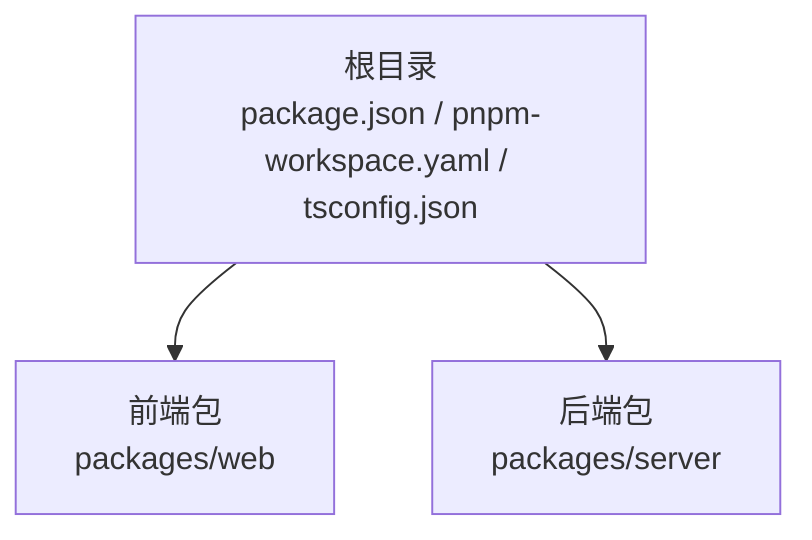
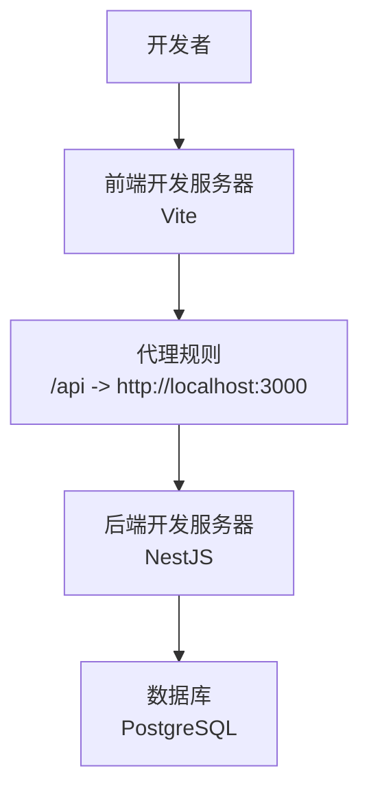
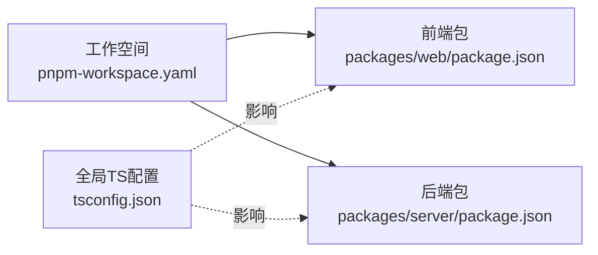

# 开发流程

<cite>
**本文档引用的文件**
- [package.json](file://package.json)
- [pnpm-workspace.yaml](file://pnpm-workspace.yaml)
- [tsconfig.json](file://tsconfig.json)
- [packages/server/package.json](file://packages/server/package.json)
- [packages/server/src/app.module.ts](file://packages/server/src/app.module.ts)
- [packages/server/nest-cli.json](file://packages/server/nest-cli.json)
- [packages/web/package.json](file://packages/web/package.json)
- [packages/web/vite.config.ts](file://packages/web/vite.config.ts)
</cite>

## 目录
1. [简介](#简介)
2. [项目结构](#项目结构)
3. [核心组件](#核心组件)
4. [架构总览](#架构总览)
5. [详细组件分析](#详细组件分析)
6. [依赖关系分析](#依赖关系分析)
7. [性能与可维护性建议](#性能与可维护性建议)
8. [故障排查指南](#故障排查指南)
9. [结论](#结论)
10. [附录：开发与协作规范](#附录开发与协作规范)

## 简介
本文件面向Jiaoyi项目的开发者，系统化梳理Monorepo开发流程、分支管理与版本控制策略、PNPM工作空间与包依赖管理、跨包引用机制、Git工作流与代码评审流程、功能开发与Bug修复流程、紧急发布流程、开发环境搭建与本地调试、问题排查方法、持续集成与自动化测试部署思路，以及团队协作规范与知识分享制度。

## 项目结构
Jiaoyi采用Monorepo架构，根目录通过脚本聚合前后端开发与构建命令，并由PNPM工作空间统一管理包依赖。前端位于packages/web，后端位于packages/server。TypeScript全局编译配置在根目录，便于统一编译选项与类型检查。

图表来源
- [package.json:1-24](file://package.json#L1-L24)
- [pnpm-workspace.yaml:1-3](file://pnpm-workspace.yaml#L1-L3)
- [tsconfig.json:1-17](file://tsconfig.json#L1-L17)

章节来源
- [package.json:1-24](file://package.json#L1-L24)
- [pnpm-workspace.yaml:1-3](file://pnpm-workspace.yaml#L1-L3)
- [tsconfig.json:1-17](file://tsconfig.json#L1-L17)

## 核心组件
- 根级脚本与工具链
  - 通过根脚本统一触发各包的开发、构建、类型检查与代码质量任务，确保多包一致性与可操作性。
  - 引擎约束要求Node与PNPM版本，保障环境一致性。
- PNPM工作空间
  - 工作空间声明packages/*，自动解析子包依赖与链接，减少重复安装与提升安装速度。
- TypeScript全局配置
  - 统一编译目标、严格模式、声明文件生成等，便于跨包共享类型与接口。
- 前端包（packages/web）
  - Vite开发服务器与代理配置，支持路径别名，便于模块化组织与跨包引用。
- 后端包（packages/server）
  - NestJS应用入口模块集中导入各业务模块与数据库模块，TypeORM配置集中管理，支持迁移与种子数据脚本。

章节来源
- [package.json:6-13](file://package.json#L6-L13)
- [package.json:19-22](file://package.json#L19-L22)
- [pnpm-workspace.yaml:1-3](file://pnpm-workspace.yaml#L1-L3)
- [tsconfig.json:2-14](file://tsconfig.json#L2-L14)
- [packages/web/package.json:6-12](file://packages/web/package.json#L6-L12)
- [packages/web/vite.config.ts:1-28](file://packages/web/vite.config.ts#L1-L28)
- [packages/server/src/app.module.ts:15-49](file://packages/server/src/app.module.ts#L15-L49)
- [packages/server/nest-cli.json:1-9](file://packages/server/nest-cli.json#L1-L9)

## 架构总览
下图展示开发与运行时的关键交互：前端通过Vite代理访问后端服务；后端通过TypeORM连接数据库；根脚本协调多包任务。

图表来源
- [packages/web/vite.config.ts:18-26](file://packages/web/vite.config.ts#L18-L26)
- [packages/server/src/app.module.ts:21-37](file://packages/server/src/app.module.ts#L21-L37)

## 详细组件分析

### 前端开发与调试
- 开发与构建
  - 使用Vite进行快速开发与打包，支持TypeScript与React生态。
  - 路径别名集中定义，便于跨包引用与模块化组织。
- 本地调试
  - 通过代理将/api前缀转发至后端开发端口，实现前后端联调。
- 类型检查与代码质量
  - 提供类型检查与ESLint脚本，确保代码风格与类型安全。

章节来源
- [packages/web/package.json:6-12](file://packages/web/package.json#L6-L12)
- [packages/web/vite.config.ts:1-28](file://packages/web/vite.config.ts#L1-L28)

### 后端开发与数据库
- 应用模块
  - AppModule集中导入认证、用户、药品、资金、销售、结算、账户、市场等模块，并配置全局ConfigModule与TypeORM。
- 数据库与迁移
  - TypeORM以异步工厂方式读取环境变量，启用迁移与日志；迁移文件按约定存放于database/migrations。
- 测试与类型检查
  - Jest配置覆盖所有测试文件，TypeScript类型检查禁用输出，确保类型安全。

章节来源
- [packages/server/src/app.module.ts:15-49](file://packages/server/src/app.module.ts#L15-L49)
- [packages/server/package.json:72-88](file://packages/server/package.json#L72-L88)

### 根脚本与多包任务编排
- 开发与构建
  - 通过pnpm --filter分别进入server与web执行对应脚本，保证任务隔离与可追踪。
- 质量与类型检查
  - lint与typecheck在两包间并行执行，提升反馈效率。

章节来源
- [package.json:7-13](file://package.json#L7-L13)

## 依赖关系分析
- 工作空间与包解析
  - pnpm-workspace.yaml声明packages/*，使子包成为工作空间成员，便于跨包依赖与统一安装。
- 全局TypeScript配置
  - 根tsconfig.json为所有包提供一致的编译选项，降低配置漂移风险。
- 前后端耦合点
  - 前端通过Vite代理访问后端API，形成清晰的边界；数据库连接在后端集中配置。

图表来源
- [pnpm-workspace.yaml:1-3](file://pnpm-workspace.yaml#L1-L3)
- [tsconfig.json:1-17](file://tsconfig.json#L1-L17)
- [packages/web/package.json:1-39](file://packages/web/package.json#L1-L39)
- [packages/server/package.json:1-90](file://packages/server/package.json#L1-L90)

章节来源
- [pnpm-workspace.yaml:1-3](file://pnpm-workspace.yaml#L1-L3)
- [tsconfig.json:1-17](file://tsconfig.json#L1-L17)
- [packages/web/package.json:1-39](file://packages/web/package.json#L1-L39)
- [packages/server/package.json:1-90](file://packages/server/package.json#L1-L90)

## 性能与可维护性建议
- 依赖管理
  - 利用工作空间统一升级与锁定版本，避免重复依赖与版本冲突。
- 构建与缓存
  - 前端使用Vite构建，后端使用NestJS编译，结合pnpm缓存提升安装与构建速度。
- 类型安全
  - 在根tsconfig中开启严格模式，配合包内类型检查脚本，确保跨包共享类型的稳定性。
- 数据库演进
  - 迁移脚本与TypeORM配置分离，便于在不同环境复用与回滚。

[本节为通用建议，无需列出章节来源]

## 故障排查指南
- 环境与工具链
  - 检查Node与pnpm版本是否满足根脚本引擎约束。
- 前端联调
  - 确认Vite代理规则已正确指向后端开发端口；若请求失败，优先检查代理配置与后端服务状态。
- 后端数据库
  - 确认TypeORM连接参数与环境变量一致；迁移未执行时检查迁移开关与日志。
- 类型与代码质量
  - 若类型检查失败，先在对应包内单独执行类型检查定位问题；再结合根脚本并行检查。

章节来源
- [package.json:19-22](file://package.json#L19-L22)
- [packages/web/vite.config.ts:18-26](file://packages/web/vite.config.ts#L18-L26)
- [packages/server/src/app.module.ts:21-37](file://packages/server/src/app.module.ts#L21-L37)
- [packages/server/package.json:72-88](file://packages/server/package.json#L72-L88)

## 结论
Jiaoyi采用清晰的Monorepo结构与脚本编排，结合PNPM工作空间与TypeScript全局配置，实现了前后端一体化开发与高效协作。建议在现有基础上完善CI/CD与自动化流程，明确分支与发布策略，持续优化团队协作规范与知识沉淀。

[本节为总结，无需列出章节来源]

## 附录：开发与协作规范

### 分支管理与版本控制策略
- 分支模型
  - 主分支用于稳定发布；特性分支从主分支切出，完成合并后删除；热修复分支从发布标签切出，修复后同时合并回主分支与开发分支。
- 提交信息规范
  - 格式：类型(作用域): 描述；如 feat(server): 添加用户登录接口。
  - 类型建议：feat、fix、docs、style、refactor、perf、test、chore、revert。
- 版本发布
  - 语义化版本：主版本号.次版本号.修订号；小改动打补丁，功能新增升次版本，破坏性变更升主版本。

[本节为通用规范，无需列出章节来源]

### Git工作流程与代码评审
- 提交流程
  - 在特性分支提交并通过本地类型检查与测试；推送远程后创建Pull Request。
- 代码评审
  - 至少一名同行评审通过后方可合并；评审关注点包括：逻辑正确性、可读性、性能与安全性、测试覆盖率。
- 冲突解决
  - 频繁与主分支同步，保持小步提交与清晰提交信息，减少冲突复杂度。

[本节为通用规范，无需列出章节来源]

### 功能开发流程
- 需求与设计
  - 明确需求背景与验收标准；必要时产出设计文档或原型。
- 开发与测试
  - 在特性分支开发，编写单元测试与集成测试；通过类型检查与代码质量检查。
- 合并与验证
  - PR通过评审后合并；在预发布环境验证；上线后观察监控指标。

[本节为通用流程，无需列出章节来源]

### Bug修复流程
- 复现与记录
  - 复现步骤、期望结果、实际结果；附带日志与截图。
- 修复与回归
  - 编写针对性测试用例；修复后进行回归测试。
- 发布与回滚
  - 通过热修复分支发布；如发现问题立即准备回滚方案。

[本节为通用流程，无需列出章节来源]

### 紧急发布流程
- 快速评估
  - 评估影响范围与风险等级；确定修复方案与回退预案。
- 发布执行
  - 通过热修复分支快速发布；通知相关方并监控效果。
- 复盘总结
  - 记录问题原因与改进措施，更新应急预案。

[本节为通用流程，无需列出章节来源]

### 开发环境搭建与本地调试
- 环境要求
  - Node与pnpm版本需满足根脚本引擎约束；安装依赖后启动数据库。
- 启动服务
  - 使用根脚本分别启动前端与后端开发服务；前端通过Vite代理访问后端API。
- 调试技巧
  - 前端：利用浏览器开发者工具与React DevTools；后端：使用调试模式启动并设置断点。
- 常见问题
  - 端口占用：调整Vite或后端端口；依赖缺失：重新安装并清理缓存。

章节来源
- [package.json:19-22](file://package.json#L19-L22)
- [packages/web/vite.config.ts:18-26](file://packages/web/vite.config.ts#L18-L26)
- [packages/server/package.json:8-24](file://packages/server/package.json#L8-L24)

### 持续集成与自动化
- 自动化测试
  - 在PR中强制执行类型检查与测试；覆盖率阈值建议逐步提升。
- 构建与部署
  - 建议在CI中分别构建前后端产物；后端镜像构建与数据库迁移在部署阶段执行。
- 发布策略
  - 自动化打标签与发布；生产发布前增加人工确认环节。

[本节为通用建议，无需列出章节来源]

### 团队协作规范、沟通机制与知识分享
- 角色与职责
  - 明确技术负责人、产品负责人与测试负责人；建立轮值机制处理紧急事务。
- 沟通机制
  - 日站会同步进展与阻塞；问题升级通道与响应时效。
- 知识分享
  - 周例会分享技术实践与踩坑总结；建立内部Wiki归档最佳实践与FAQ。

[本节为通用规范，无需列出章节来源]