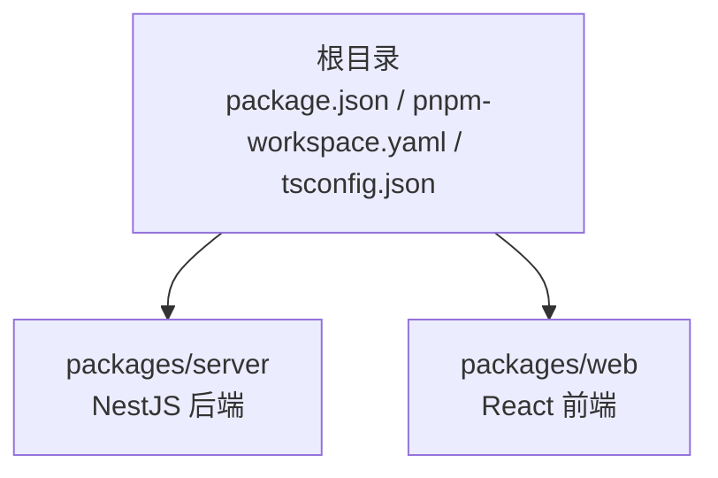
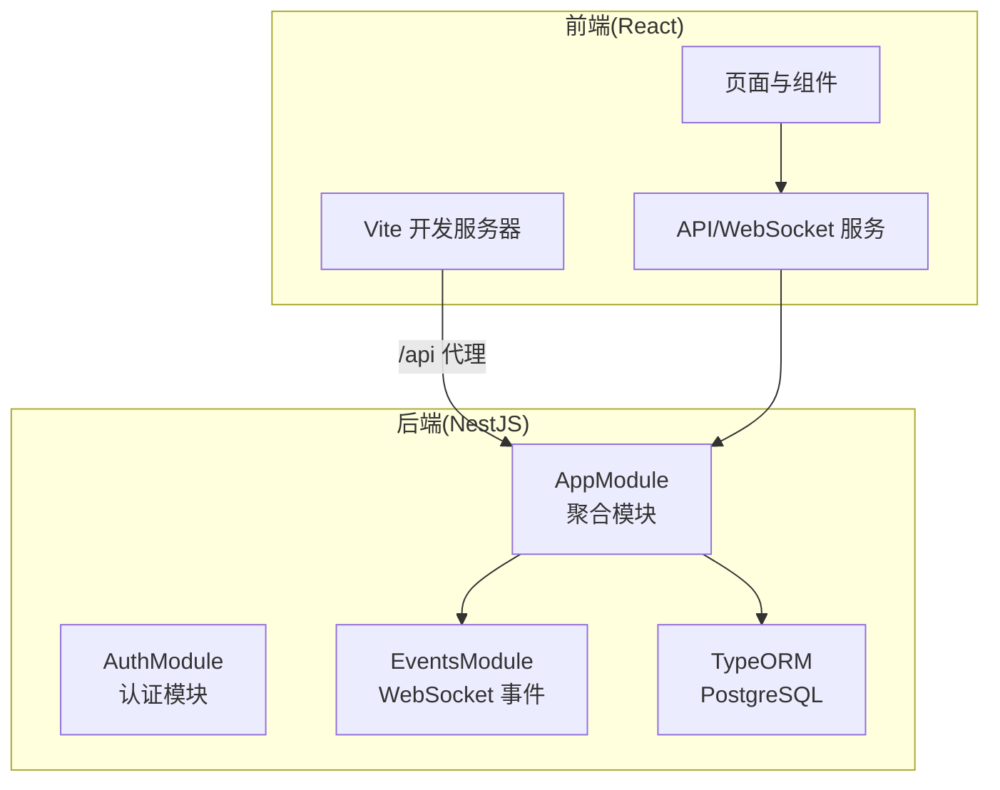
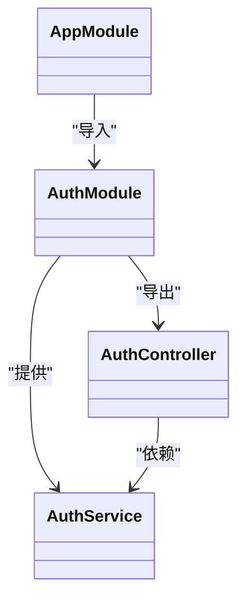
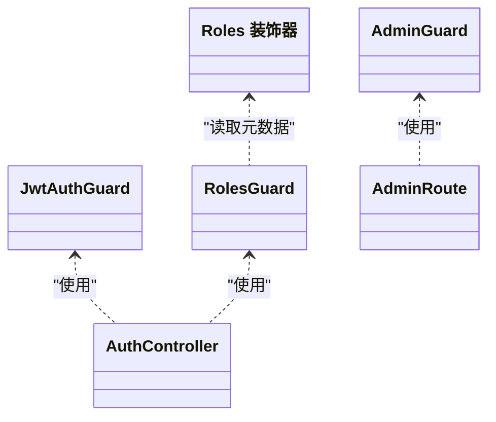
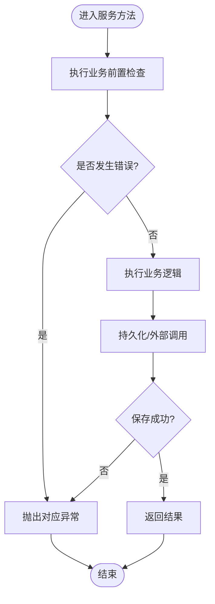
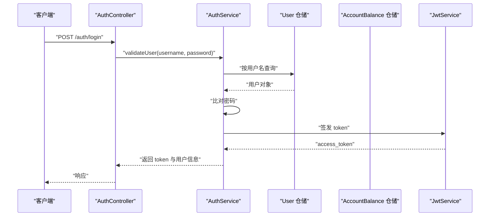
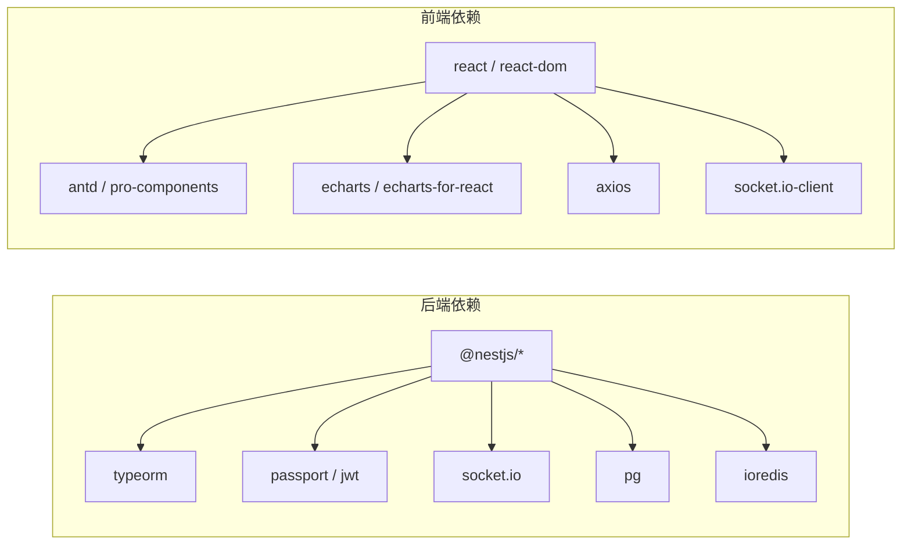

# 最佳实践

<cite>
**本文引用的文件**
- [package.json](file://package.json)
- [pnpm-workspace.yaml](file://pnpm-workspace.yaml)
- [tsconfig.json](file://tsconfig.json)
- [packages/server/nest-cli.json](file://packages/server/nest-cli.json)
- [packages/server/package.json](file://packages/server/package.json)
- [packages/server/src/main.ts](file://packages/server/src/main.ts)
- [packages/server/src/app.module.ts](file://packages/server/src/app.module.ts)
- [packages/server/src/modules/auth/auth.module.ts](file://packages/server/src/modules/auth/auth.module.ts)
- [packages/server/src/modules/auth/auth.service.ts](file://packages/server/src/modules/auth/auth.service.ts)
- [packages/server/src/modules/auth/auth.controller.ts](file://packages/server/src/modules/auth/auth.controller.ts)
- [packages/server/src/common/guards/admin.guard.ts](file://packages/server/src/common/guards/admin.guard.ts)
- [packages/server/src/common/decorators/roles.decorator.ts](file://packages/server/src/common/decorators/roles.decorator.ts)
- [packages/web/package.json](file://packages/web/package.json)
- [packages/web/vite.config.ts](file://packages/web/vite.config.ts)
</cite>

## 目录
1. [引言](#引言)
2. [项目结构](#项目结构)
3. [核心组件](#核心组件)
4. [架构总览](#架构总览)
5. [详细组件分析](#详细组件分析)
6. [依赖分析](#依赖分析)
7. [性能考虑](#性能考虑)
8. [故障排查指南](#故障排查指南)
9. [结论](#结论)
10. [附录](#附录)

## 引言
本最佳实践文档面向 Jiaoyi（药品垫资交易平台）的多包仓库（monorepo），聚焦后端 NestJS 应用与前端 React 应用的工程化实践，覆盖模块设计、依赖注入、错误处理、TypeORM 使用、数据库设计与查询优化、WebSocket 实时通信、安全与输入验证、可维护性与架构演进、以及团队协作与知识管理等主题。文档以仓库现有实现为依据，结合通用工程化原则，给出可操作的建议与图示。

## 项目结构
Jiaoyi 采用 pnpm workspace 的 monorepo 结构，分为 server（NestJS 后端）与 web（React 前端）两个子包，共享根级 TypeScript 配置与工作区定义。根脚本统一管理开发、构建、类型检查与 Lint。

**图表来源**
- [pnpm-workspace.yaml:1-3](file://pnpm-workspace.yaml#L1-L3)
- [package.json:6-13](file://package.json#L6-L13)

**章节来源**
- [pnpm-workspace.yaml:1-3](file://pnpm-workspace.yaml#L1-L3)
- [package.json:1-24](file://package.json#L1-L24)
- [tsconfig.json:1-17](file://tsconfig.json#L1-L17)

## 核心组件
- 全局引导与中间件：在后端入口启用全局验证管道与 CORS，确保输入校验与跨域访问控制。
- 应用模块聚合：AppModule 聚合配置、TypeORM、数据库模块与各业务模块，并引入事件模块用于 WebSocket。
- 认证模块：基于 JWT 的认证流程，包含登录、注册、个人资料与守卫。
- 守卫与装饰器：JwtAuthGuard、RolesGuard 与 Roles 装饰器，实现鉴权与授权。
- 前端工程：Vite + React + TypeScript，配置别名与代理，集成 Ant Design 与 ECharts。

**章节来源**
- [packages/server/src/main.ts:1-29](file://packages/server/src/main.ts#L1-L29)
- [packages/server/src/app.module.ts:1-51](file://packages/server/src/app.module.ts#L1-L51)
- [packages/server/src/modules/auth/auth.module.ts:1-34](file://packages/server/src/modules/auth/auth.module.ts#L1-L34)
- [packages/server/src/modules/auth/auth.service.ts:1-100](file://packages/server/src/modules/auth/auth.service.ts#L1-L100)
- [packages/server/src/modules/auth/auth.controller.ts:1-53](file://packages/server/src/modules/auth/auth.controller.ts#L1-L53)
- [packages/server/src/common/guards/admin.guard.ts:1-32](file://packages/server/src/common/guards/admin.guard.ts#L1-L32)
- [packages/server/src/common/decorators/roles.decorator.ts:1-6](file://packages/server/src/common/decorators/roles.decorator.ts#L1-L6)
- [packages/web/vite.config.ts:1-28](file://packages/web/vite.config.ts#L1-L28)

## 架构总览
后端采用模块化分层：控制器负责接口，服务封装业务逻辑，TypeORM 提供数据持久化，WebSocket 模块提供实时事件通道；前端通过 Vite 开发服务器与后端 API 代理联调，使用 Ant Design 与 ECharts 进行界面与可视化。

**图表来源**
- [packages/server/src/app.module.ts:14-48](file://packages/server/src/app.module.ts#L14-L48)
- [packages/server/src/modules/auth/auth.module.ts:14-32](file://packages/server/src/modules/auth/auth.module.ts#L14-L32)
- [packages/web/vite.config.ts:18-26](file://packages/web/vite.config.ts#L18-L26)

## 详细组件分析

### NestJS 模块设计与依赖注入
- 模块职责清晰：每个业务模块（如 auth、drug、funding 等）自包含 DTO、Service、Controller、Module，便于边界划分与测试。
- 依赖注入：服务通过构造函数注入仓储与工具类，控制器仅负责路由与参数绑定，降低耦合度。
- 全局配置：AppModule 使用 forRootAsync 注入配置，TypeORM 与数据库迁移同步运行，保证环境一致性。

**图表来源**
- [packages/server/src/app.module.ts:14-48](file://packages/server/src/app.module.ts#L14-L48)
- [packages/server/src/modules/auth/auth.module.ts:14-32](file://packages/server/src/modules/auth/auth.module.ts#L14-L32)
- [packages/server/src/modules/auth/auth.controller.ts:8-10](file://packages/server/src/modules/auth/auth.controller.ts#L8-L10)

**章节来源**
- [packages/server/src/app.module.ts:14-48](file://packages/server/src/app.module.ts#L14-L48)
- [packages/server/src/modules/auth/auth.module.ts:14-32](file://packages/server/src/modules/auth/auth.module.ts#L14-L32)
- [packages/server/src/modules/auth/auth.controller.ts:8-10](file://packages/server/src/modules/auth/auth.controller.ts#L8-L10)

### 依赖注入与守卫体系
- JwtAuthGuard：统一的 JWT 鉴权守卫，配合控制器使用，确保受保护接口的安全访问。
- RolesGuard 与 Roles 装饰器：通过元数据声明角色白名单，实现细粒度授权。
- AdminGuard：对管理员路径进行额外的管理员角色校验。

**图表来源**
- [packages/server/src/common/guards/admin.guard.ts:13-31](file://packages/server/src/common/guards/admin.guard.ts#L13-L31)
- [packages/server/src/common/decorators/roles.decorator.ts:3-5](file://packages/server/src/common/decorators/roles.decorator.ts#L3-L5)
- [packages/server/src/modules/auth/auth.controller.ts:4-6](file://packages/server/src/modules/auth/auth.controller.ts#L4-L6)

**章节来源**
- [packages/server/src/common/guards/admin.guard.ts:1-32](file://packages/server/src/common/guards/admin.guard.ts#L1-L32)
- [packages/server/src/common/decorators/roles.decorator.ts:1-6](file://packages/server/src/common/decorators/roles.decorator.ts#L1-L6)
- [packages/server/src/modules/auth/auth.controller.ts:4-6](file://packages/server/src/modules/auth/auth.controller.ts#L4-L6)

### 错误处理与异常模型
- 服务层抛出语义化异常：如注册用户名冲突、用户不存在、未登录、权限不足等，便于上层统一处理。
- 控制器层返回结构化响应：登录失败、注册成功等，保持对外一致的契约。
- 建议：结合 NestJS 的 ExceptionFilter 统一输出格式，避免泄露敏感信息。

**图表来源**
- [packages/server/src/modules/auth/auth.service.ts:49-85](file://packages/server/src/modules/auth/auth.service.ts#L49-L85)
- [packages/server/src/modules/auth/auth.service.ts:87-98](file://packages/server/src/modules/auth/auth.service.ts#L87-L98)

**章节来源**
- [packages/server/src/modules/auth/auth.service.ts:49-85](file://packages/server/src/modules/auth/auth.service.ts#L49-L85)
- [packages/server/src/modules/auth/auth.service.ts:87-98](file://packages/server/src/modules/auth/auth.service.ts#L87-L98)

### 认证与登录流程

**图表来源**
- [packages/server/src/modules/auth/auth.controller.ts:12-23](file://packages/server/src/modules/auth/auth.controller.ts#L12-L23)
- [packages/server/src/modules/auth/auth.service.ts:19-47](file://packages/server/src/modules/auth/auth.service.ts#L19-L47)

**章节来源**
- [packages/server/src/modules/auth/auth.controller.ts:12-23](file://packages/server/src/modules/auth/auth.controller.ts#L12-L23)
- [packages/server/src/modules/auth/auth.service.ts:19-47](file://packages/server/src/modules/auth/auth.service.ts#L19-L47)

### React 组件设计与状态管理
- 组件组织：页面与组件分层清晰，页面组件负责布局与路由，通用组件封装可视化与交互。
- 状态管理：建议在页面级使用 React 内置状态与 useEffect 管理异步数据，复杂场景可引入轻量状态库（如 Zustand）。
- 性能优化：合理拆分组件、使用 memo 与 useMemo/useCallback 缓存计算与渲染，避免不必要的重渲染。

[本节为概念性指导，不直接分析具体文件]

### WebSocket 实时通信最佳实践
- 连接管理：使用 Socket.IO 或 Nest WebSockets，集中处理连接建立、心跳检测与断线重连。
- 事件命名：采用领域驱动的命名空间（如 market、trade、settlement），避免全局事件污染。
- 权限与订阅：在连接阶段校验令牌，按用户角色与订阅主题推送消息，避免越权推送。
- 广播与点对点：区分全量广播与私有推送，减少无效消息传输。

[本节为概念性指导，不直接分析具体文件]

### TypeORM 使用最佳实践
- 实体设计：遵循单一职责，字段命名与约束明确，外键关系清晰，必要时添加索引。
- 查询优化：优先使用 Repository 的原生查询或 QueryBuilder，避免 N+1 查询；对高频查询建立复合索引。
- 迁移与种子：使用迁移管理版本化变更，种子数据用于本地开发初始化。
- 事务与并发：对写密集操作使用事务包裹，注意死锁与超时处理。

[本节为概念性指导，结合现有 TypeORM 配置与实体文件进行总结]

### 安全开发最佳实践
- 输入验证：全局 ValidationPipe 已开启白名单与转换，建议在 DTO 中补充更严格的规则。
- 身份认证：JWT 秘钥与过期时间通过配置管理，避免硬编码；服务端生成刷新令牌策略。
- 授权控制：结合 JwtAuthGuard 与 RolesGuard，对关键接口进行角色限制。
- 数据保护：密码使用强哈希算法存储，敏感字段不在响应中暴露。

**章节来源**
- [packages/server/src/main.ts:12-17](file://packages/server/src/main.ts#L12-L17)
- [packages/server/src/modules/auth/auth.module.ts:17-26](file://packages/server/src/modules/auth/auth.module.ts#L17-L26)
- [packages/server/src/modules/auth/auth.service.ts:49-85](file://packages/server/src/modules/auth/auth.service.ts#L49-L85)

## 依赖分析
- 后端依赖：NestJS 核心、TypeORM、Passport/JWT、Socket.IO、Pg、Redis 等，形成以模块化为核心的生态。
- 前端依赖：React 生态、Ant Design、ECharts、Axios、Socket.IO 客户端等，支持可视化与实时交互。
- 工具链：ESLint、Jest、TypeScript、Vite，保障质量与开发效率。

**图表来源**
- [packages/server/package.json:26-49](file://packages/server/package.json#L26-L49)
- [packages/web/package.json:13-24](file://packages/web/package.json#L13-L24)

**章节来源**
- [packages/server/package.json:1-90](file://packages/server/package.json#L1-L90)
- [packages/web/package.json:1-39](file://packages/web/package.json#L1-L39)

## 性能考虑
- 后端
  - 启用生产环境日志开关，避免开发模式过度输出。
  - 对高频接口增加缓存层（如 Redis），减少数据库压力。
  - 使用分页与懒加载，避免一次性拉取大量数据。
- 前端
  - 图表组件按需渲染与尺寸自适应，避免重复计算。
  - 使用虚拟列表展示长列表，降低 DOM 压力。
  - 将静态资源与第三方库 CDN 化，缩短首屏时间。

[本节为通用指导，不直接分析具体文件]

## 故障排查指南
- 启动与端口
  - 若端口被占用，调整配置中的端口值；确认前后端端口不冲突。
- CORS 问题
  - 确认后端已启用 CORS，前端代理目标地址正确。
- 鉴权失败
  - 检查 JWT 秘钥与过期时间配置，确认客户端携带正确的 Authorization 头。
- 数据库连接
  - 校验 TypeORM 连接参数与迁移是否成功执行。
- WebSocket 不可用
  - 检查事件模块是否导入，连接地址与路径是否匹配。

**章节来源**
- [packages/server/src/main.ts:19-23](file://packages/server/src/main.ts#L19-L23)
- [packages/web/vite.config.ts:18-26](file://packages/web/vite.config.ts#L18-L26)
- [packages/server/src/app.module.ts:21-37](file://packages/server/src/app.module.ts#L21-L37)

## 结论
Jiaoyi 项目在工程化层面已具备良好的基础：模块化分层清晰、依赖注入完善、安全与输入验证机制健全、前端工程化工具链完备。建议在此基础上进一步完善异常统一处理、实时通信与缓存策略、数据库查询优化与索引设计，并持续沉淀团队规范与知识库，以支撑业务长期演进。

## 附录
- 开发与构建命令
  - 后端：开发、构建、类型检查、Lint、测试、迁移与种子脚本。
  - 前端：开发、构建、预览、Lint、类型检查。
- 配置要点
  - 根 tsconfig 与工作区配置，确保类型与构建一致性。
  - Vite 别名与代理，提升开发体验。

**章节来源**
- [package.json:6-13](file://package.json#L6-L13)
- [packages/server/package.json:8-25](file://packages/server/package.json#L8-L25)
- [packages/web/package.json:6-12](file://packages/web/package.json#L6-L12)
- [tsconfig.json:1-17](file://tsconfig.json#L1-L17)
- [packages/web/vite.config.ts:5-27](file://packages/web/vite.config.ts#L5-L27)