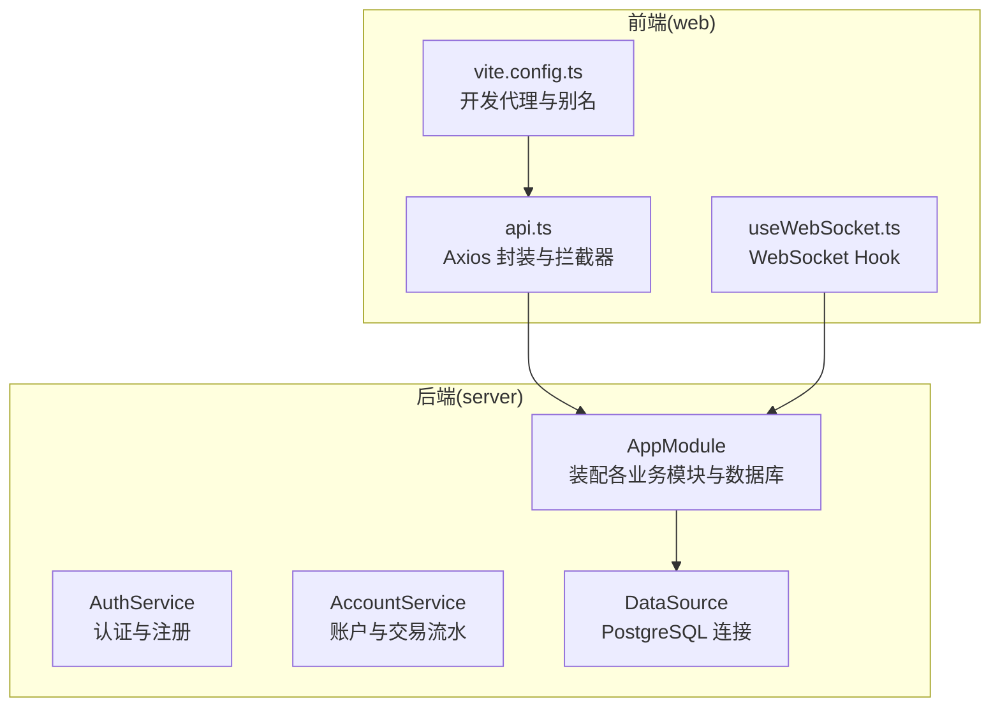
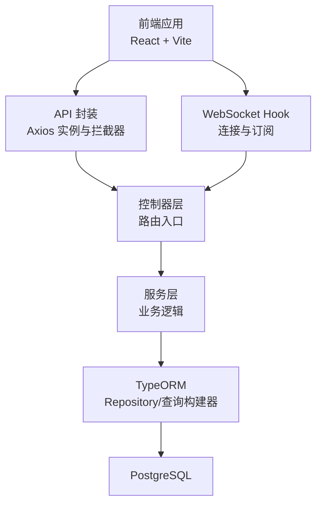
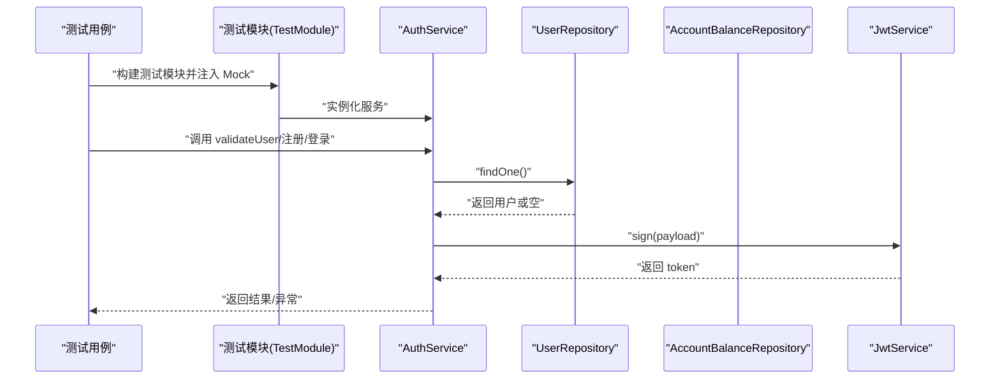
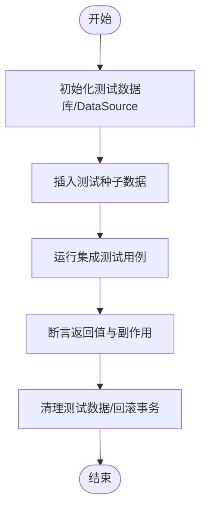
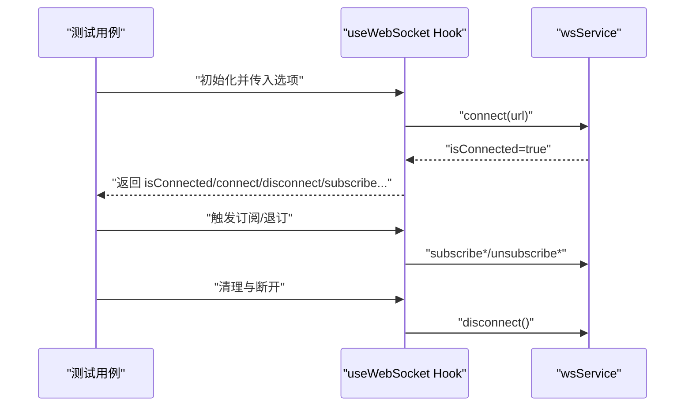
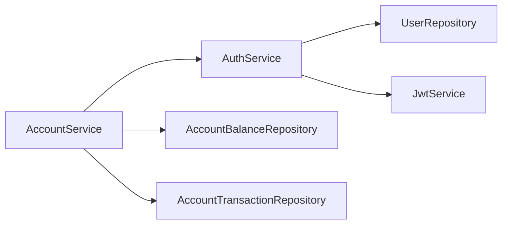

# 测试策略

<cite>
**本文引用的文件**
- [package.json](file://package.json)
- [pnpm-workspace.yaml](file://pnpm-workspace.yaml)
- [packages/server/package.json](file://packages/server/package.json)
- [packages/server/nest-cli.json](file://packages/server/nest-cli.json)
- [packages/server/src/app.module.ts](file://packages/server/src/app.module.ts)
- [packages/server/src/database/data-source.ts](file://packages/server/src/database/data-source.ts)
- [packages/server/src/modules/auth/auth.service.ts](file://packages/server/src/modules/auth/auth.service.ts)
- [packages/server/src/modules/account/account.service.ts](file://packages/server/src/modules/account/account.service.ts)
- [packages/web/vite.config.ts](file://packages/web/vite.config.ts)
- [packages/web/src/services/api.ts](file://packages/web/src/services/api.ts)
- [packages/web/src/hooks/useWebSocket.ts](file://packages/web/src/hooks/useWebSocket.ts)
</cite>

## 目录
1. [引言](#引言)
2. [项目结构](#项目结构)
3. [核心组件](#核心组件)
4. [架构总览](#架构总览)
5. [详细组件分析](#详细组件分析)
6. [依赖分析](#依赖分析)
7. [性能考虑](#性能考虑)
8. [故障排查指南](#故障排查指南)
9. [结论](#结论)
10. [附录](#附录)

## 引言
本测试策略文档面向 Jiaoyi 项目的后端与前端，系统化阐述单元测试、集成测试与端到端测试的编写方法与最佳实践；覆盖 NestJS 测试框架使用、Mock 对象创建与测试数据准备；同时给出 React 组件测试、Hook 测试与状态管理测试策略；明确测试覆盖率目标、测试环境配置与 CI/CD 集成建议；并提供数据库测试、API 测试与实时通信测试的实施方案，以及测试用例设计原则、断言方法与错误处理测试要点，最后补充性能测试、安全测试与兼容性测试指南。

## 项目结构
Jiaoyi 采用 monorepo 结构，分为 server 与 web 两大包：
- server：基于 NestJS 的后端服务，包含认证、用户、药品、垫资、销售、结算、账户、市场等模块，使用 PostgreSQL + TypeORM。
- web：基于 Vite + React 的前端应用，通过代理访问后端 API，并通过 WebSocket 接收市场与交易实时数据。

**图表来源**
- [packages/server/src/app.module.ts:15-50](file://packages/server/src/app.module.ts#L15-L50)
- [packages/server/src/database/data-source.ts:7-17](file://packages/server/src/database/data-source.ts#L7-L17)
- [packages/server/src/modules/auth/auth.service.ts:9-17](file://packages/server/src/modules/auth/auth.service.ts#L9-L17)
- [packages/server/src/modules/account/account.service.ts:7-14](file://packages/server/src/modules/account/account.service.ts#L7-L14)
- [packages/web/src/services/api.ts:1-311](file://packages/web/src/services/api.ts#L1-L311)
- [packages/web/src/hooks/useWebSocket.ts:1-138](file://packages/web/src/hooks/useWebSocket.ts#L1-L138)
- [packages/web/vite.config.ts:1-28](file://packages/web/vite.config.ts#L1-L28)

**章节来源**
- [package.json:6-13](file://package.json#L6-L13)
- [pnpm-workspace.yaml:1-3](file://pnpm-workspace.yaml#L1-L3)
- [packages/server/nest-cli.json:1-9](file://packages/server/nest-cli.json#L1-L9)
- [packages/web/vite.config.ts:1-28](file://packages/web/vite.config.ts#L1-L28)

## 核心组件
- 认证服务（AuthService）：负责用户校验、JWT 签发、注册与资料查询，涉及密码哈希、实体持久化与异常抛出。
- 账户服务（AccountService）：负责余额查询、充值、交易流水分页查询与统计聚合。
- 数据源（DataSource）：统一配置 PostgreSQL 连接参数与实体/迁移路径。
- API 封装（api.ts）：Axios 实例、请求/响应拦截器、认证头注入与 401 处理。
- WebSocket Hook（useWebSocket.ts）：连接、订阅、断开与事件监听封装。
- 开发代理（vite.config.ts）：本地开发时将 /api 代理至后端服务端口。

**章节来源**
- [packages/server/src/modules/auth/auth.service.ts:9-99](file://packages/server/src/modules/auth/auth.service.ts#L9-L99)
- [packages/server/src/modules/account/account.service.ts:7-134](file://packages/server/src/modules/account/account.service.ts#L7-L134)
- [packages/server/src/database/data-source.ts:7-17](file://packages/server/src/database/data-source.ts#L7-L17)
- [packages/web/src/services/api.ts:1-311](file://packages/web/src/services/api.ts#L1-L311)
- [packages/web/src/hooks/useWebSocket.ts:1-138](file://packages/web/src/hooks/useWebSocket.ts#L1-L138)
- [packages/web/vite.config.ts:18-26](file://packages/web/vite.config.ts#L18-L26)

## 架构总览
下图展示测试视角下的系统交互：前端通过 API 与 WebSocket 与后端交互，后端通过 TypeORM 访问数据库。

**图表来源**
- [packages/web/src/services/api.ts:1-311](file://packages/web/src/services/api.ts#L1-L311)
- [packages/web/src/hooks/useWebSocket.ts:1-138](file://packages/web/src/hooks/useWebSocket.ts#L1-L138)
- [packages/server/src/app.module.ts:15-50](file://packages/server/src/app.module.ts#L15-L50)
- [packages/server/src/database/data-source.ts:7-17](file://packages/server/src/database/data-source.ts#L7-L17)

## 详细组件分析

### NestJS 单元测试策略
- 测试框架与编译：使用 Jest 与 ts-jest，测试文件以 .spec.ts 命名，根目录为 src。
- Mock 与依赖注入：通过 @nestjs/testing 的 Test.createTestingModule 构建测试模块，使用 jest.spyOn 或 provide + useClass 替换服务/仓储，隔离外部依赖。
- 典型场景
  - AuthService：Mock UserRepository/AccountBalanceRepository 与 JwtService，验证登录/注册/获取资料的分支逻辑与异常抛出。
  - AccountService：Mock 两个 Repository，验证余额不存在时的创建流程、充值金额计算、交易流水创建与分页统计。
- 测试数据准备：在 beforeEach 中构造最小化 DTO 与实体快照；对需要哈希/时间戳的场景，使用固定值或 jest.useFakeTimers。
- 断言与覆盖率：使用 toEqual/match 对返回结构断言；对异常使用 expect(...).toThrow；确保每个分支至少一条用例，覆盖率目标：语句/分支/行/函数 ≥ 80%。

**图表来源**
- [packages/server/src/modules/auth/auth.service.ts:11-47](file://packages/server/src/modules/auth/auth.service.ts#L11-L47)
- [packages/server/src/modules/auth/auth.service.ts:49-85](file://packages/server/src/modules/auth/auth.service.ts#L49-L85)
- [packages/server/src/modules/auth/auth.service.ts:87-98](file://packages/server/src/modules/auth/auth.service.ts#L87-L98)

**章节来源**
- [packages/server/package.json:15-18](file://packages/server/package.json#L15-L18)
- [packages/server/package.json:72-88](file://packages/server/package.json#L72-L88)

### 集成测试策略（数据库与 API）
- 数据库测试
  - 使用独立测试数据库或内存数据库（如 Postgres 容器），在测试前执行迁移并在结束后回滚或重建。
  - 在测试模块中注入 DataSource 与 Repository，避免真实连接生产库。
  - 针对 AccountService 的充值与交易统计，构造用户与初始余额，断言余额与流水一致性。
- API 测试
  - 使用 @nestjs/testing 的 Test 与 Test.createTestingModule 构建测试应用，注入 ConfigModule 与 TypeOrmModule.forFeature。
  - 使用 supertest 发起 HTTP 请求，结合 Mock 仓储与 JwtService，验证鉴权、参数校验与业务规则。
  - 对 401/403/404/409 等错误场景进行断言。
- 覆盖率：集成测试同样纳入覆盖率统计，目标与单元测试一致。

**图表来源**
- [packages/server/src/database/data-source.ts:7-17](file://packages/server/src/database/data-source.ts#L7-L17)
- [packages/server/src/app.module.ts:21-37](file://packages/server/src/app.module.ts#L21-L37)

**章节来源**
- [packages/server/src/app.module.ts:21-37](file://packages/server/src/app.module.ts#L21-L37)
- [packages/server/src/database/data-source.ts:7-17](file://packages/server/src/database/data-source.ts#L7-L17)

### 端到端测试策略（E2E）
- E2E 工具：推荐使用 Playwright/Cypress，启动完整应用栈（前端 Vite + 后端 NestJS + PostgreSQL）。
- 场景示例
  - 登录/注册流程：输入凭据 -> 触发 API -> 成功后本地存储 token -> 页面跳转。
  - 实时行情：连接 WebSocket -> 订阅市场 -> 接收消息 -> 更新 UI。
  - 垫资下单：选择药品 -> 输入数量 -> 提交订单 -> 查看订单列表与持仓。
- 数据与状态
  - 使用后端提供的种子脚本或测试专用数据，确保可重复性。
  - 对于 WebSocket，模拟服务端推送消息，验证 UI 更新与 Hook 回调触发。
- 报告与回放：截图/视频与日志收集，便于问题定位。

（本节为概念性指导，不直接分析具体文件）

### React 组件测试策略
- 组件渲染与交互：使用 React Testing Library 或 Jest + React Test Renderer，断言 DOM 属性与事件回调。
- Mock 外部依赖：对 api.ts 与 useWebSocket.ts 进行模块级 Mock，控制返回值与副作用。
- 示例断言
  - 登录页面：输入用户名/密码 -> 点击提交 -> Mock 登录成功 -> 断言路由跳转与本地存储。
  - 市场页面：渲染 K 线图组件 -> 模拟 WebSocket 推送行情 -> 断言图表数据更新。
- 覆盖率：目标 ≥ 80%，重点覆盖条件渲染、错误边界与用户交互路径。

**章节来源**
- [packages/web/src/services/api.ts:1-311](file://packages/web/src/services/api.ts#L1-L311)
- [packages/web/src/hooks/useWebSocket.ts:1-138](file://packages/web/src/hooks/useWebSocket.ts#L1-L138)

### Hook 测试策略
- useWebSocket：Mock wsService 的 connect/on/off/disconnect，断言连接状态变化、订阅/退订调用次数与事件回调触发。
- 依赖注入：在测试环境中提供自定义 Provider 或通过包装组件提供 Mock 实现。
- 边界场景：断网重连、URL 变更、多次订阅与取消订阅的幂等性。

**图表来源**
- [packages/web/src/hooks/useWebSocket.ts:33-44](file://packages/web/src/hooks/useWebSocket.ts#L33-L44)
- [packages/web/src/hooks/useWebSocket.ts:47-64](file://packages/web/src/hooks/useWebSocket.ts#L47-L64)
- [packages/web/src/hooks/useWebSocket.ts:126-135](file://packages/web/src/hooks/useWebSocket.ts#L126-L135)

**章节来源**
- [packages/web/src/hooks/useWebSocket.ts:1-138](file://packages/web/src/hooks/useWebSocket.ts#L1-L138)

### 状态管理测试策略
- 若使用 Redux/Zustand 等状态库，将状态逻辑拆分为纯函数，针对 action/reducer/thunk 进行单元测试。
- 对异步流程（如登录后拉取用户资料）进行时序断言，确保 dispatch 顺序与副作用发生时机正确。
- 与 API/Hook 测试协同：对状态变更与 UI 更新进行端到端回归。

（本节为通用指导，不直接分析具体文件）

### 测试数据准备与 Mock 对象
- Mock 对象
  - Repository：jest.mock(...) 或 provide + useClass 注入 Mock 实例，设置 findOne/save 等返回值。
  - JwtService：spyOn sign 返回固定 token 字符串。
  - WebSocket：Mock wsService，暴露 connect/disconnect/on/off 并手动触发事件回调。
- 测试数据
  - 使用最小必要数据构造实体快照；对日期字段使用固定时间戳。
  - 对哈希/加密场景，使用确定性输入或替换为测试友好实现。

**章节来源**
- [packages/server/src/modules/auth/auth.service.ts:11-17](file://packages/server/src/modules/auth/auth.service.ts#L11-L17)
- [packages/server/src/modules/account/account.service.ts:9-14](file://packages/server/src/modules/account/account.service.ts#L9-L14)
- [packages/web/src/hooks/useWebSocket.ts:33-44](file://packages/web/src/hooks/useWebSocket.ts#L33-L44)

### 错误处理测试
- 服务层异常：验证 AuthService/AccountService 在用户名冲突、余额不存在、未授权等场景抛出的异常类型与消息。
- API 层：对 400/401/403/404/409/500 等状态码进行断言，确保错误体结构一致。
- 前端：对 401 响应拦截器进行断言（移除 token、跳转登录页）；对网络异常与超时进行兜底提示。

**章节来源**
- [packages/server/src/modules/auth/auth.service.ts:50-58](file://packages/server/src/modules/auth/auth.service.ts#L50-L58)
- [packages/server/src/modules/auth/auth.service.ts:92-94](file://packages/server/src/modules/auth/auth.service.ts#L92-L94)
- [packages/server/src/modules/account/account.service.ts:41-43](file://packages/server/src/modules/account/account.service.ts#L41-L43)
- [packages/web/src/services/api.ts:31-58](file://packages/web/src/services/api.ts#L31-L58)

### 数据库测试实施方案
- 连接配置：在测试环境加载 .env.test，设置独立数据库名称与连接参数。
- 迁移与种子：测试前执行迁移，按需执行种子脚本；测试后回滚或重建。
- 事务隔离：每个测试用例包裹在事务中，失败即回滚，保证数据隔离。

**章节来源**
- [packages/server/src/database/data-source.ts:5-17](file://packages/server/src/database/data-source.ts#L5-L17)
- [packages/server/src/app.module.ts:21-37](file://packages/server/src/app.module.ts#L21-L37)

### API 测试实施方案
- 控制器测试：使用 Test.createTestingModule 构建应用，注入 JwtAuthGuard/角色守卫 Mock 实现，验证鉴权与权限控制。
- DTO 校验：对非法参数触发 400，确保 class-validator 生效。
- 业务流程：组合多个服务方法，验证跨服务调用的正确性与一致性。

**章节来源**
- [packages/server/src/app.module.ts:15-50](file://packages/server/src/app.module.ts#L15-L50)

### 实时通信测试实施方案
- WebSocket 服务：Mock 事件网关/适配器，断言消息推送与订阅管理。
- 前端 Hook：Mock wsService，断言连接建立、事件监听与断开清理。
- 场景覆盖：心跳检测、重连机制、多订阅与退订、异常断开恢复。

**章节来源**
- [packages/web/src/hooks/useWebSocket.ts:1-138](file://packages/web/src/hooks/useWebSocket.ts#L1-L138)

## 依赖分析
- 后端依赖
  - NestJS 核心模块、TypeORM、Socket.IO/WebSockets、JWT、Passport、Bcrypt、Class Validator/Transformer。
  - 测试依赖 Jest、@nestjs/testing、ts-jest、supertest。
- 前端依赖
  - React、React Router、Ant Design、ECharts、Axios、Socket.IO Client、Day.js。
  - 开发工具：Vite、ESLint、TypeScript。

**图表来源**
- [packages/server/src/modules/auth/auth.service.ts:11-17](file://packages/server/src/modules/auth/auth.service.ts#L11-L17)
- [packages/server/src/modules/account/account.service.ts:9-14](file://packages/server/src/modules/account/account.service.ts#L9-L14)

**章节来源**
- [packages/server/package.json:26-71](file://packages/server/package.json#L26-L71)
- [packages/web/package.json:13-38](file://packages/web/package.json#L13-L38)

## 性能考虑
- 单测性能：避免真实网络与数据库 IO，优先使用 Mock 与内存数据；合理使用 jest.useFakeTimers。
- 集成测试：复用测试数据库连接，减少迁移成本；批量执行用例时注意并发与锁竞争。
- 前端测试：对高频渲染组件使用简化快照或仅断言关键属性；对动画与图表使用静态快照。
- 覆盖率与速度平衡：优先保证关键路径覆盖率，对低风险分支可降低覆盖要求。

（本节为通用指导，不直接分析具体文件）

## 故障排查指南
- 测试无法启动
  - 检查 Jest 配置与 ts-jest 版本匹配；确认 rootDir 与 testRegex 正确。
- 数据库连接失败
  - 确认测试 .env 文件存在且参数正确；检查容器/本地数据库服务状态。
- WebSocket 事件未触发
  - 检查 wsService 的 on/off 注册与清理逻辑；确认事件名与命名空间一致。
- 401 未被拦截
  - 检查 axios 拦截器是否生效；确认本地存储中的 token 存在且格式正确。

**章节来源**
- [packages/server/package.json:72-88](file://packages/server/package.json#L72-L88)
- [packages/web/src/services/api.ts:12-59](file://packages/web/src/services/api.ts#L12-L59)

## 结论
通过分层测试策略与完善的 Mock/数据准备方案，Jiaoyi 项目可在保证质量的同时提升交付效率。建议持续优化覆盖率与测试执行速度，完善 CI/CD 中的自动化测试与报告输出。

## 附录

### 测试覆盖率要求（建议）
- 单元测试：语句/分支/行/函数 ≥ 80%
- 集成测试：接口/业务流程 ≥ 80%
- 端到端测试：关键用户旅程 ≥ 70%

（本节为通用指导，不直接分析具体文件）

### 测试环境配置与 CI/CD 集成
- 环境变量
  - 后端：NODE_ENV=test、DB_* 环境变量指向测试数据库。
  - 前端：Vitest/Jest 默认环境，必要时通过环境文件注入 API 域名。
- CI/CD
  - 安装依赖后分别执行后端与前端测试脚本；合并覆盖率报告；失败即中断。
  - 建议缓存依赖与构建产物，缩短流水线时间。

**章节来源**
- [packages/server/package.json:15-18](file://packages/server/package.json#L15-L18)
- [packages/web/package.json:6-12](file://packages/web/package.json#L6-L12)