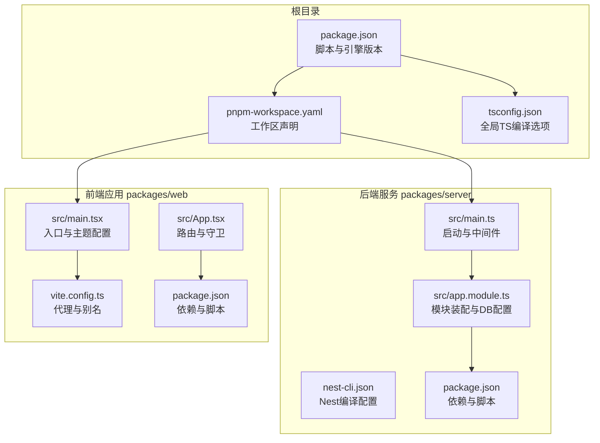
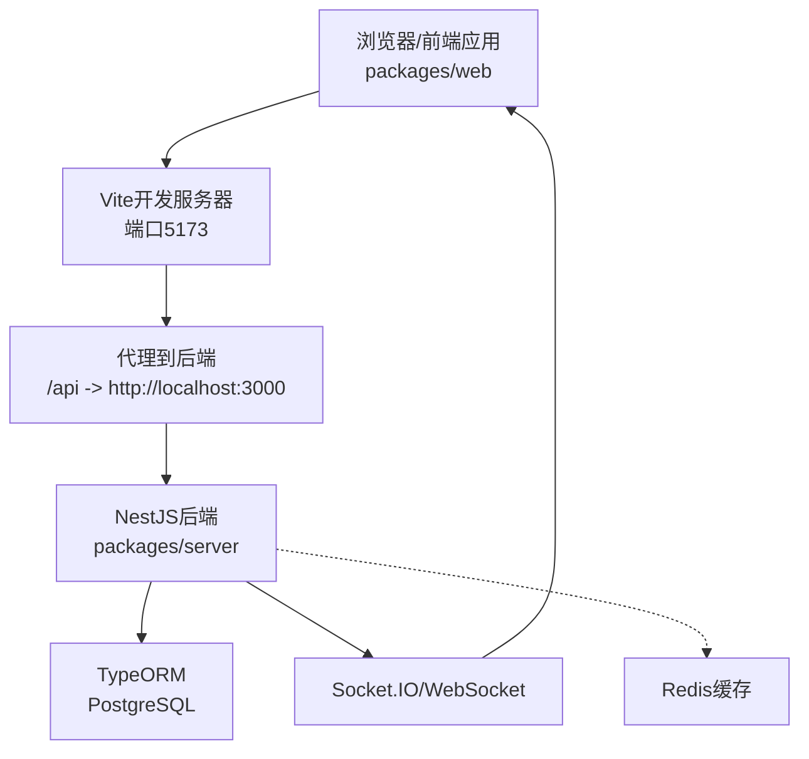
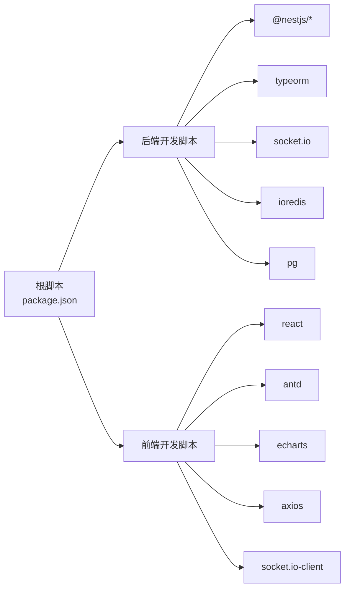

# 调试与性能优化

<cite>
**本文引用的文件**
- [package.json](file://package.json)
- [pnpm-workspace.yaml](file://pnpm-workspace.yaml)
- [tsconfig.json](file://tsconfig.json)
- [packages/server/package.json](file://packages/server/package.json)
- [packages/server/nest-cli.json](file://packages/server/nest-cli.json)
- [packages/server/src/main.ts](file://packages/server/src/main.ts)
- [packages/server/src/app.module.ts](file://packages/server/src/app.module.ts)
- [packages/web/package.json](file://packages/web/package.json)
- [packages/web/vite.config.ts](file://packages/web/vite.config.ts)
- [packages/web/src/main.tsx](file://packages/web/src/main.tsx)
- [packages/web/src/App.tsx](file://packages/web/src/App.tsx)
</cite>

## 目录
1. [简介](#简介)
2. [项目结构](#项目结构)
3. [核心组件](#核心组件)
4. [架构总览](#架构总览)
5. [详细组件分析](#详细组件分析)
6. [依赖分析](#依赖分析)
7. [性能考虑](#性能考虑)
8. [故障排查指南](#故障排查指南)
9. [结论](#结论)
10. [附录](#附录)

## 简介
本文件面向Jiaoyi项目的开发者与运维人员，系统化梳理开发与生产环境下的调试与性能优化实践，覆盖以下主题：
- 开发环境调试：断点设置、变量监控、Node.js应用调试、TypeScript源码映射、异步代码调试
- React应用调试：组件状态检查、路由与权限守卫调试、性能分析工具使用
- 数据库与缓存：查询优化、迁移与种子脚本、Redis缓存策略、内存泄漏检测
- WebSocket与实时通信：连接调试、事件监听、网络问题排查
- 性能基准测试、瓶颈分析与优化策略
- 生产环境监控、日志分析与故障排查

## 项目结构
Jiaoyi采用Monorepo结构，通过pnpm工作区管理前后端两个包：
- packages/server：基于NestJS的后端服务，提供REST/WebSocket接口、数据库ORM、认证授权、定时任务等
- packages/web：基于Vite + React的前端应用，提供路由、主题、图表与WebSocket客户端

**图示来源**
- [package.json:1-24](file://package.json#L1-L24)
- [pnpm-workspace.yaml:1-3](file://pnpm-workspace.yaml#L1-L3)
- [tsconfig.json:1-17](file://tsconfig.json#L1-L17)
- [packages/server/src/main.ts:1-29](file://packages/server/src/main.ts#L1-L29)
- [packages/server/src/app.module.ts:1-51](file://packages/server/src/app.module.ts#L1-L51)
- [packages/server/nest-cli.json:1-9](file://packages/server/nest-cli.json#L1-L9)
- [packages/web/src/main.tsx:1-80](file://packages/web/src/main.tsx#L1-L80)
- [packages/web/src/App.tsx:1-58](file://packages/web/src/App.tsx#L1-L58)
- [packages/web/vite.config.ts:1-28](file://packages/web/vite.config.ts#L1-L28)

**章节来源**
- [package.json:1-24](file://package.json#L1-L24)
- [pnpm-workspace.yaml:1-3](file://pnpm-workspace.yaml#L1-L3)
- [tsconfig.json:1-17](file://tsconfig.json#L1-L17)

## 核心组件
- 后端启动与中间件
  - 全局验证管道启用白名单与转换
  - CORS启用，支持凭证传递
  - 端口从配置服务读取，默认3000
- 数据库与ORM
  - TypeORM异步配置，PostgreSQL连接参数来自环境变量
  - development模式下开启日志
  - 自动运行迁移与同步关闭
- 前端入口与主题
  - Ant Design主题深色算法与自定义Token
  - 路由与私有路由守卫（基于localStorage令牌）
- 构建与开发脚本
  - 根级脚本统一调用各包过滤器脚本
  - TS编译生成sourceMap便于调试

**章节来源**
- [packages/server/src/main.ts:1-29](file://packages/server/src/main.ts#L1-L29)
- [packages/server/src/app.module.ts:15-51](file://packages/server/src/app.module.ts#L15-L51)
- [packages/web/src/main.tsx:1-80](file://packages/web/src/main.tsx#L1-L80)
- [packages/web/src/App.tsx:12-31](file://packages/web/src/App.tsx#L12-L31)
- [package.json:6-13](file://package.json#L6-L13)
- [tsconfig.json:12-13](file://tsconfig.json#L12-L13)

## 架构总览
后端通过NestJS提供REST与WebSocket服务，前端通过Vite构建并使用代理访问后端；数据库为PostgreSQL，缓存使用Redis。

**图示来源**
- [packages/web/vite.config.ts:18-26](file://packages/web/vite.config.ts#L18-L26)
- [packages/server/src/main.ts:19-23](file://packages/server/src/main.ts#L19-L23)
- [packages/server/src/app.module.ts:21-37](file://packages/server/src/app.module.ts#L21-L37)

## 详细组件分析

### 后端调试与性能优化
- Node.js应用调试
  - 使用脚本启动调试模式，启用Inspector并监听源文件变化
  - 在IDE中附加调试器，结合TS源码映射定位断点
- TypeScript源码映射
  - 编译选项启用sourceMap与declarationMap，便于断点命中与类型提示
- 异步代码调试
  - 控制器/服务中的Promise/async函数可在调用栈中逐步跟踪
  - 使用全局ValidationPipe进行输入校验，便于在边界处快速定位异常
- 数据库查询优化
  - development模式开启ORM日志，观察SQL执行情况
  - 避免N+1查询，优先使用关系预加载或批量查询
  - 对高频查询建立索引，定期审查慢查询日志
- 缓存策略
  - 使用Redis作为缓存层，热点数据短时缓存，避免重复计算
  - 缓存键命名规范，设置合理TTL，防止缓存雪崩
- 内存泄漏检测
  - 定期检查长连接与事件监听器是否正确释放
  - 使用Node.js内置heap与profiler工具定位大对象与泄漏点
- WebSocket连接调试
  - 检查连接握手、鉴权流程与错误事件
  - 实时事件订阅与广播需记录关键指标，避免消息风暴
- 性能基准测试
  - 接口压测：使用工具对登录、下单、行情等关键路径进行压力测试
  - 瓶颈分析：结合火焰图与CPU/内存剖析，定位热点函数与阻塞点
- 生产环境监控
  - 结合日志与APM工具，监控请求延迟、错误率与资源占用
  - 建立告警阈值，快速响应异常波动

**章节来源**
- [packages/server/package.json:12-18](file://packages/server/package.json#L12-L18)
- [packages/server/src/main.ts:13-17](file://packages/server/src/main.ts#L13-L17)
- [packages/server/src/app.module.ts:34](file://packages/server/src/app.module.ts#L34)
- [tsconfig.json:12-13](file://tsconfig.json#L12-L13)

### 前端调试与性能优化
- 组件状态检查
  - 使用React DevTools检查组件树、Props与State
  - 关注路由守卫逻辑，确保令牌存在时才渲染受保护页面
- 性能分析工具
  - 使用React Profiler测量组件重渲染频率
  - 分析图表组件（如K线图）的渲染开销，必要时引入虚拟化或分页
- 路由与权限
  - 私有路由守卫基于localStorage令牌判断，注意令牌过期与刷新策略
- WebSocket客户端
  - 前端通过socket.io-client连接后端，需处理重连、心跳与错误事件
- 构建与开发
  - Vite代理将/api转发至后端，便于本地联调
  - 类型检查与ESLint保障代码质量

**章节来源**
- [packages/web/src/App.tsx:12-31](file://packages/web/src/App.tsx#L12-L31)
- [packages/web/src/main.tsx:1-80](file://packages/web/src/main.tsx#L1-L80)
- [packages/web/vite.config.ts:18-26](file://packages/web/vite.config.ts#L18-L26)
- [packages/web/package.json:6-12](file://packages/web/package.json#L6-L12)

### 数据库与缓存调试
- 连接与迁移
  - 通过环境变量配置数据库连接，development模式开启ORM日志
  - 使用迁移脚本维护结构演进，避免直接同步生产库
- 种子数据
  - 提供初始化脚本，便于快速搭建测试数据
- 缓存
  - Redis用于高频读取场景，建议实现多级缓存与失效策略

**章节来源**
- [packages/server/src/app.module.ts:21-37](file://packages/server/src/app.module.ts#L21-L37)
- [packages/server/package.json:20-24](file://packages/server/package.json#L20-L24)

### WebSocket连接调试
- 连接与事件
  - 检查握手阶段的认证与权限
  - 订阅关键市场事件，记录事件到达时间与数据量
- 网络问题排查
  - 观察断线重连次数与延迟
  - 检查代理与防火墙对WebSocket的支持

**章节来源**
- [packages/server/src/common/events/events.gateway.ts](file://packages/server/src/common/events/events.gateway.ts)
- [packages/web/src/services/websocket.ts](file://packages/web/src/services/websocket.ts)

## 依赖分析
- 工作区与脚本
  - 根级脚本统一调度前后端开发与构建
  - TypeScript全局配置启用sourceMap，便于调试
- 后端依赖
  - NestJS生态、TypeORM、Socket.IO、Redis、PostgreSQL驱动
- 前端依赖
  - React、Ant Design、图表库、Axios、Socket.IO客户端

**图示来源**
- [package.json:6-13](file://package.json#L6-L13)
- [packages/server/package.json:26-49](file://packages/server/package.json#L26-L49)
- [packages/web/package.json:13-24](file://packages/web/package.json#L13-L24)

**章节来源**
- [package.json:6-13](file://package.json#L6-L13)
- [packages/server/package.json:26-49](file://packages/server/package.json#L26-L49)
- [packages/web/package.json:13-24](file://packages/web/package.json#L13-L24)

## 性能考虑
- 编译与调试
  - 启用sourceMap与declarationMap，提升断点命中率与类型提示准确性
- 后端性能
  - 使用全局验证管道减少无效请求
  - ORM日志仅在开发环境开启，生产关闭以降低开销
  - Redis缓存热点数据，避免重复查询数据库
- 前端性能
  - 图表组件按需渲染，避免全量重绘
  - 路由守卫在客户端侧快速判定，减少无意义渲染
- 基准测试与瓶颈分析
  - 对关键接口与交易流程进行压测，识别CPU/IO瓶颈
  - 使用剖析工具定位热点函数，优化算法与数据结构

**章节来源**
- [tsconfig.json:12-13](file://tsconfig.json#L12-L13)
- [packages/server/src/main.ts:13-17](file://packages/server/src/main.ts#L13-L17)
- [packages/server/src/app.module.ts:34](file://packages/server/src/app.module.ts#L34)

## 故障排查指南
- 启动与端口
  - 后端默认端口3000，前端默认5173，确认端口占用
- CORS与鉴权
  - 确认CORS允许来源与凭证，检查JWT令牌格式与过期时间
- 数据库连接
  - 检查环境变量与网络连通性，development模式下查看ORM日志
- 代理与跨域
  - Vite代理将/api转发至后端，确认目标地址与变更源
- WebSocket
  - 检查握手、认证与事件订阅，关注断线重连与错误事件
- 日志与监控
  - 开发环境开启ORM日志，生产环境接入统一日志与APM

**章节来源**
- [packages/server/src/main.ts:19-23](file://packages/server/src/main.ts#L19-L23)
- [packages/web/vite.config.ts:20-24](file://packages/web/vite.config.ts#L20-L24)
- [packages/server/src/app.module.ts:21-37](file://packages/server/src/app.module.ts#L21-L37)

## 结论
通过完善的调试与性能优化策略，Jiaoyi项目能够在开发与生产环境中保持高稳定性与高性能。建议持续完善：
- 建立标准化的调试流程与断点规范
- 强化数据库与缓存的监控与告警
- 将性能测试纳入CI/CD流水线
- 完善生产环境的日志与可观测性体系

## 附录
- 开发命令速查
  - 后端开发：使用脚本启动调试模式，结合IDE断点调试
  - 前端开发：Vite热更新，配合代理与路由守卫调试
- TypeScript与SourceMap
  - 确保编译选项开启sourceMap与declarationMap，便于断点与类型提示

**章节来源**
- [package.json:6-13](file://package.json#L6-L13)
- [tsconfig.json:12-13](file://tsconfig.json#L12-L13)