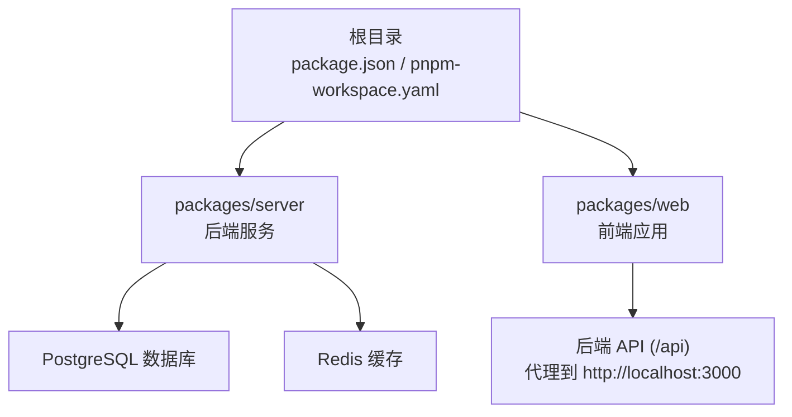
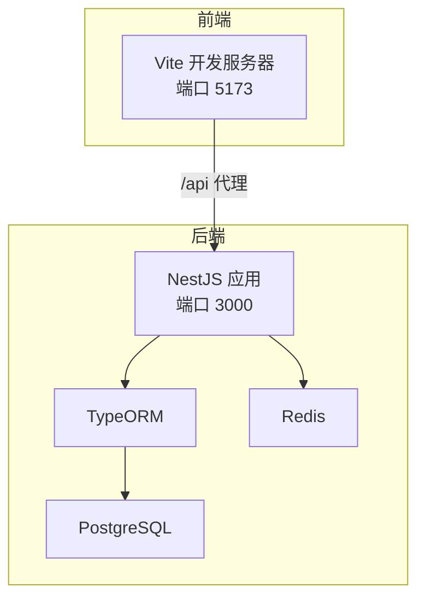
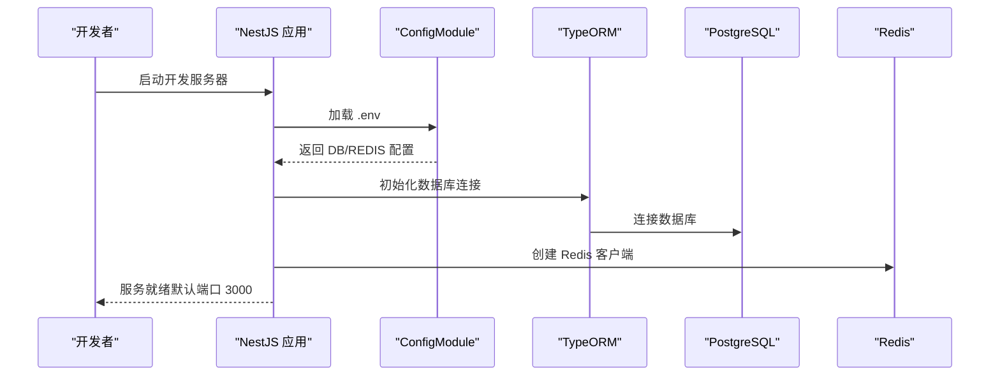
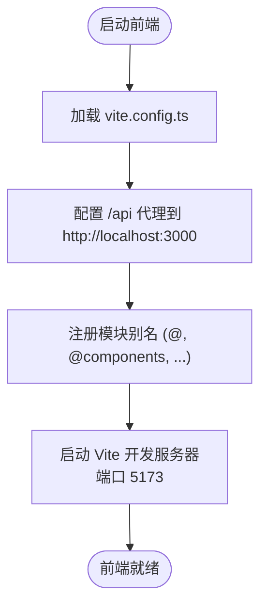
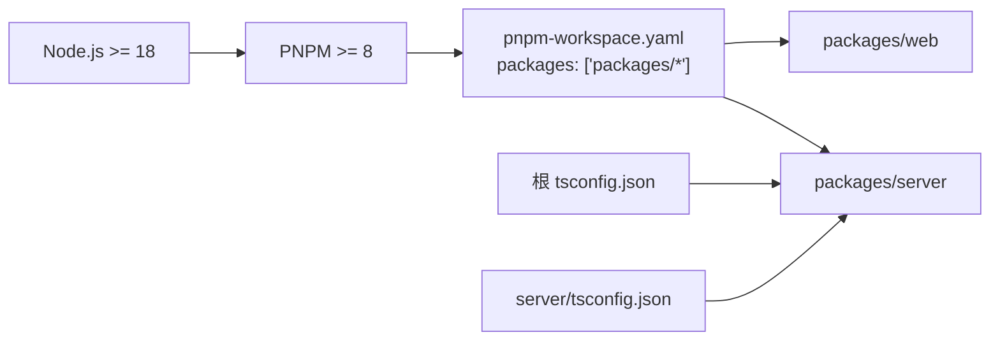

# 快速开始

<cite>
**本文引用的文件**
- [package.json](file://package.json)
- [pnpm-workspace.yaml](file://pnpm-workspace.yaml)
- [tsconfig.json](file://tsconfig.json)
- [packages/server/package.json](file://packages/server/package.json)
- [packages/server/nest-cli.json](file://packages/server/nest-cli.json)
- [packages/server/tsconfig.json](file://packages/server/tsconfig.json)
- [packages/server/src/app.module.ts](file://packages/server/src/app.module.ts)
- [packages/server/src/database/database.module.ts](file://packages/server/src/database/database.module.ts)
- [packages/server/src/database/data-source.ts](file://packages/server/src/database/data-source.ts)
- [packages/web/package.json](file://packages/web/package.json)
- [packages/web/vite.config.ts](file://packages/web/vite.config.ts)
</cite>

## 目录
1. [简介](#简介)
2. [项目结构](#项目结构)
3. [核心组件](#核心组件)
4. [架构总览](#架构总览)
5. [详细组件分析](#详细组件分析)
6. [依赖分析](#依赖分析)
7. [性能考虑](#性能考虑)
8. [故障排查指南](#故障排查指南)
9. [结论](#结论)
10. [附录](#附录)

## 简介
本指南面向首次接触 Jiaoyi 项目的开发者，帮助你在约 30 分钟内完成开发环境搭建与本地运行。你将学会：
- 安装 Node.js 与 PNPM（满足版本要求）
- 使用 pnpm workspace 安装项目依赖
- 配置数据库 PostgreSQL 与缓存 Redis
- 设置环境变量
- 启动后端 NestJS 服务与前端 React 应用
- 常用开发命令与排错方法

## 项目结构
Jiaoyi 是一个基于 PNPM workspace 的单仓库（monorepo）项目，包含两个包：
- packages/server：后端 NestJS 服务
- packages/web：前端 Vite + React 应用

图表来源
- [pnpm-workspace.yaml:1-3](file://pnpm-workspace.yaml#L1-L3)
- [packages/web/vite.config.ts:18-26](file://packages/web/vite.config.ts#L18-L26)
- [packages/server/src/app.module.ts:21-37](file://packages/server/src/app.module.ts#L21-L37)
- [packages/server/src/database/database.module.ts:14-20](file://packages/server/src/database/database.module.ts#L14-L20)

章节来源
- [pnpm-workspace.yaml:1-3](file://pnpm-workspace.yaml#L1-L3)
- [package.json:1-24](file://package.json#L1-L24)

## 核心组件
- 后端服务（NestJS）
  - 使用 TypeORM 连接 PostgreSQL
  - 使用 ioredis 连接 Redis
  - 通过 ConfigModule 加载 .env 环境变量
- 前端应用（Vite + React）
  - 通过代理将 /api 请求转发至后端
  - 提供开发、构建、预览、类型检查、代码规范等脚本

章节来源
- [packages/server/src/app.module.ts:17-37](file://packages/server/src/app.module.ts#L17-L37)
- [packages/server/src/database/database.module.ts:14-20](file://packages/server/src/database/database.module.ts#L14-L20)
- [packages/web/vite.config.ts:18-26](file://packages/web/vite.config.ts#L18-L26)

## 架构总览
下图展示了前后端交互与外部依赖的关系。

图表来源
- [packages/web/vite.config.ts:18-26](file://packages/web/vite.config.ts#L18-L26)
- [packages/server/src/app.module.ts:21-37](file://packages/server/src/app.module.ts#L21-L37)
- [packages/server/src/database/database.module.ts:14-20](file://packages/server/src/database/database.module.ts#L14-L20)

## 详细组件分析

### 后端：NestJS 服务
- 依赖与模块
  - TypeORM + PostgreSQL：在 AppModule 中通过 ConfigModule 动态读取数据库配置
  - ioredis + Redis：在 DatabaseModule 中注入全局 Redis 客户端
- 关键配置点
  - 环境变量加载：ConfigModule.forRoot 指定 .env 文件路径
  - 数据库连接：TypeOrmModule.forRootAsync 从 ConfigService 获取主机、端口、账号、密码、库名等
  - Redis 连接：通过 useFactory 工厂函数读取主机、端口、密码、库号
  - 数据源文件：packages/server/src/database/data-source.ts 同样支持 .env 覆盖

图表来源
- [packages/server/src/app.module.ts:17-37](file://packages/server/src/app.module.ts#L17-L37)
- [packages/server/src/database/database.module.ts:14-20](file://packages/server/src/database/database.module.ts#L14-L20)
- [packages/server/src/database/data-source.ts:5-17](file://packages/server/src/database/data-source.ts#L5-L17)

章节来源
- [packages/server/src/app.module.ts:17-37](file://packages/server/src/app.module.ts#L17-L37)
- [packages/server/src/database/database.module.ts:14-20](file://packages/server/src/database/database.module.ts#L14-L20)
- [packages/server/src/database/data-source.ts:5-17](file://packages/server/src/database/data-source.ts#L5-L17)

### 前端：Vite + React 应用
- 代理配置
  - 将 /api 前缀请求代理到 http://localhost:3000（后端默认端口）
- 别名与开发体验
  - 通过 vite.config.ts 设置 @ 及多个别名，提升导入便捷性
- 脚本命令
  - dev：启动 Vite 开发服务器
  - build：先 TypeScript 类型检查，再打包
  - preview：本地预览生产包
  - lint/typecheck：代码规范与类型检查

图表来源
- [packages/web/vite.config.ts:5-26](file://packages/web/vite.config.ts#L5-L26)

章节来源
- [packages/web/vite.config.ts:5-26](file://packages/web/vite.config.ts#L5-L26)
- [packages/web/package.json:6-12](file://packages/web/package.json#L6-L12)

### 通用开发命令
- 顶层命令（通过 pnpm workspace 调度）
  - 开发：同时启动后端与前端
    - pnpm dev:server
    - pnpm dev:web
  - 构建：分别构建后端与前端
    - pnpm build:server
    - pnpm build:web
    - pnpm build（后端 + 前端）
  - 其他：lint、typecheck（分别对 server 与 web 执行）

章节来源
- [package.json:6-13](file://package.json#L6-L13)

## 依赖分析
- 版本要求
  - Node.js：>= 18.0.0
  - PNPM：>= 8.0.0
- 工作区配置
  - pnpm-workspace.yaml 指定 packages/* 为工作区范围
- 语言与编译
  - 根 tsconfig.json 统一编译选项
  - server 独立 tsconfig.json，包含路径映射与装饰器等配置

图表来源
- [package.json:19-22](file://package.json#L19-L22)
- [pnpm-workspace.yaml:1-3](file://pnpm-workspace.yaml#L1-L3)
- [tsconfig.json:1-17](file://tsconfig.json#L1-L17)
- [packages/server/tsconfig.json:1-27](file://packages/server/tsconfig.json#L1-L27)

章节来源
- [package.json:19-22](file://package.json#L19-L22)
- [pnpm-workspace.yaml:1-3](file://pnpm-workspace.yaml#L1-L3)
- [tsconfig.json:1-17](file://tsconfig.json#L1-L17)
- [packages/server/tsconfig.json:1-27](file://packages/server/tsconfig.json#L1-L27)

## 性能考虑
- 开发阶段建议关闭不必要的日志输出，减少控制台压力
- 前端代理仅用于开发联调，生产部署时需由后端统一处理跨域
- 后端数据库迁移与同步策略已在配置中明确，开发环境谨慎开启同步以避免数据不一致

## 故障排查指南
- Node.js 或 PNPM 版本过低
  - 症状：安装或运行报错
  - 处理：升级 Node.js 至 >= 18，PNPM 至 >= 8
  - 参考：根 package.json 的 engines 字段
- 无法连接数据库
  - 症状：后端启动时报数据库连接失败
  - 排查：
    - 确认 PostgreSQL 已安装并运行
    - 检查 .env 中 DB_HOST/DB_PORT/DB_USERNAME/DB_PASSWORD/DB_DATABASE 是否正确
    - 如使用 data-source.ts，请确认其 .env 路径是否可达
  - 参考：
    - [packages/server/src/app.module.ts:21-37](file://packages/server/src/app.module.ts#L21-L37)
    - [packages/server/src/database/data-source.ts:5-17](file://packages/server/src/database/data-source.ts#L5-L17)
- Redis 连接异常
  - 症状：应用启动时报 Redis 连接错误
  - 排查：
    - 确认 Redis 已安装并运行
    - 检查 .env 中 REDIS_HOST/REDIS_PORT/REDIS_PASSWORD/REDIS_DB
  - 参考：
    - [packages/server/src/database/database.module.ts:14-20](file://packages/server/src/database/database.module.ts#L14-L20)
- 前端无法访问后端接口
  - 症状：浏览器 Network 显示 /api 404 或跨域
  - 排查：
    - 确认后端已启动（默认端口 3000）
    - 确认前端代理配置指向 http://localhost:3000
  - 参考：
    - [packages/web/vite.config.ts:20-24](file://packages/web/vite.config.ts#L20-L24)
- 端口冲突
  - 症状：启动失败提示端口被占用
  - 处理：修改前端（5173）或后端（3000）端口配置
  - 参考：
    - [packages/web/vite.config.ts:18-26](file://packages/web/vite.config.ts#L18-L26)
    - [packages/server/nest-cli.json:5-7](file://packages/server/nest-cli.json#L5-L7)

章节来源
- [package.json:19-22](file://package.json#L19-L22)
- [packages/server/src/app.module.ts:21-37](file://packages/server/src/app.module.ts#L21-L37)
- [packages/server/src/database/data-source.ts:5-17](file://packages/server/src/database/data-source.ts#L5-L17)
- [packages/server/src/database/database.module.ts:14-20](file://packages/server/src/database/database.module.ts#L14-L20)
- [packages/web/vite.config.ts:18-26](file://packages/web/vite.config.ts#L18-L26)
- [packages/server/nest-cli.json:5-7](file://packages/server/nest-cli.json#L5-L7)

## 结论
按照本指南，你可以在 30 分钟内完成环境准备、依赖安装、数据库与缓存配置，并成功启动后端与前端服务。遇到问题时，优先检查 Node.js/PNPM 版本、数据库与 Redis 的连通性、以及前后端端口与代理配置。

## 附录

### 环境变量清单（参考）
- 数据库相关
  - DB_HOST
  - DB_PORT
  - DB_USERNAME
  - DB_PASSWORD
  - DB_DATABASE
- Redis 相关
  - REDIS_HOST
  - REDIS_PORT
  - REDIS_PASSWORD
  - REDIS_DB

章节来源
- [packages/server/src/app.module.ts:24-29](file://packages/server/src/app.module.ts#L24-L29)
- [packages/server/src/database/database.module.ts:16-19](file://packages/server/src/database/database.module.ts#L16-L19)
- [packages/server/src/database/data-source.ts:9-13](file://packages/server/src/database/data-source.ts#L9-L13)