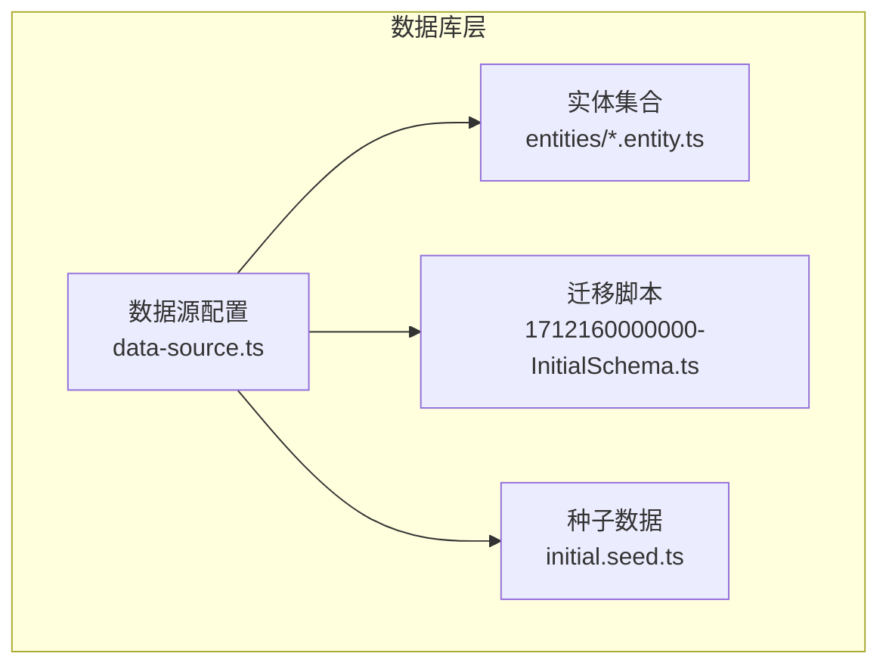
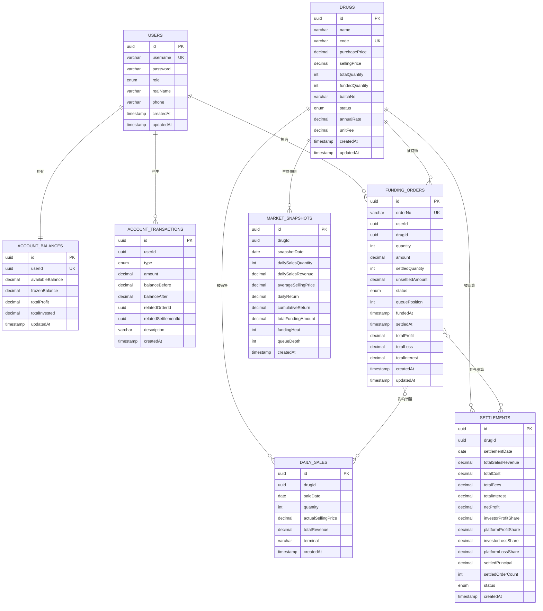
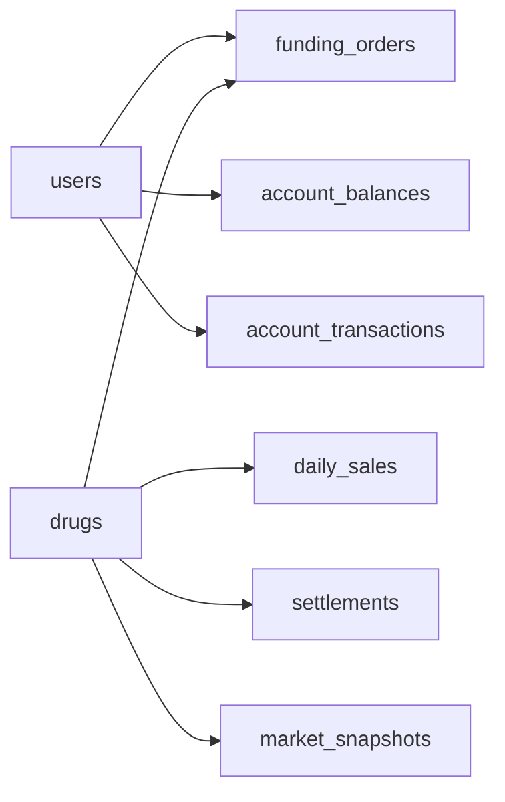

# 实体关系与映射

<cite>
**本文引用的文件**
- [packages/server/src/database/entities/index.ts](file://packages/server/src/database/entities/index.ts)
- [packages/server/src/database/entities/user.entity.ts](file://packages/server/src/database/entities/user.entity.ts)
- [packages/server/src/database/entities/account-balance.entity.ts](file://packages/server/src/database/entities/account-balance.entity.ts)
- [packages/server/src/database/entities/account-transaction.entity.ts](file://packages/server/src/database/entities/account-transaction.entity.ts)
- [packages/server/src/database/entities/drug.entity.ts](file://packages/server/src/database/entities/drug.entity.ts)
- [packages/server/src/database/entities/funding-order.entity.ts](file://packages/server/src/database/entities/funding-order.entity.ts)
- [packages/server/src/database/entities/daily-sales.entity.ts](file://packages/server/src/database/entities/daily-sales.entity.ts)
- [packages/server/src/database/entities/market-snapshot.entity.ts](file://packages/server/src/database/entities/market-snapshot.entity.ts)
- [packages/server/src/database/entities/settlement.entity.ts](file://packages/server/src/database/entities/settlement.entity.ts)
- [packages/server/src/database/data-source.ts](file://packages/server/src/database/data-source.ts)
- [packages/server/src/database/migrations/1712160000000-InitialSchema.ts](file://packages/server/src/database/migrations/1712160000000-InitialSchema.ts)
- [packages/server/src/database/seeds/initial.seed.ts](file://packages/server/src/database/seeds/initial.seed.ts)
</cite>

## 目录
1. [简介](#简介)
2. [项目结构](#项目结构)
3. [核心组件](#核心组件)
4. [架构总览](#架构总览)
5. [详细组件分析](#详细组件分析)
6. [依赖分析](#依赖分析)
7. [性能考虑](#性能考虑)
8. [故障排查指南](#故障排查指南)
9. [结论](#结论)
10. [附录](#附录)

## 简介
本文件面向 Jiaoyi 项目的数据库实体关系映射，系统性梳理实体之间的关联关系（一对多、多对多）、继承关系（如枚举）、外键约束设计原则、级联操作与数据一致性保障机制；给出 ERD 构建方法与索引优化策略；提供复杂查询的 SQL 示例路径、JOIN 操作与性能调优技巧；总结实体关系在业务场景中的应用与最佳实践，并说明数据库迁移过程中如何保持关系与完整性。

## 项目结构
Jiaoyi 的后端采用 TypeORM 管理数据库实体与迁移，核心位于 packages/server/src/database 下，包含实体定义、数据源配置、迁移脚本与种子数据。

图表来源
- [packages/server/src/database/data-source.ts:1-18](file://packages/server/src/database/data-source.ts#L1-L18)
- [packages/server/src/database/migrations/1712160000000-InitialSchema.ts:1-230](file://packages/server/src/database/migrations/1712160000000-InitialSchema.ts#L1-L230)
- [packages/server/src/database/entities/index.ts:1-9](file://packages/server/src/database/entities/index.ts#L1-L9)
- [packages/server/src/database/seeds/initial.seed.ts:1-146](file://packages/server/src/database/seeds/initial.seed.ts#L1-L146)

章节来源
- [packages/server/src/database/data-source.ts:1-18](file://packages/server/src/database/data-source.ts#L1-L18)
- [packages/server/src/database/entities/index.ts:1-9](file://packages/server/src/database/entities/index.ts#L1-L9)

## 核心组件
- 用户 User：系统用户，支持角色区分，与资金账户、交易流水、垫资订单存在一对多关系。
- 药品 Drug：核心标的资产，与垫资订单、日销售、结算、市场快照存在一对多关系。
- 垫资订单 FundingOrder：记录用户的购买申请与状态，与用户、药品多对一。
- 日销售 DailySales：按日统计的销售明细，与药品多对一。
- 结算 Settlement：按日对药品进行收益与费用结算，与药品多对一。
- 资金账户 AccountBalance：一对一绑定用户，记录可用/冻结余额与累计盈亏。
- 资金流水 AccountTransaction：记录账户各类资金变动，与用户多对一。
- 市场快照 MarketSnapshot：记录药品每日市场指标，与药品多对一。

章节来源
- [packages/server/src/database/entities/user.entity.ts:1-58](file://packages/server/src/database/entities/user.entity.ts#L1-L58)
- [packages/server/src/database/entities/drug.entity.ts:1-82](file://packages/server/src/database/entities/drug.entity.ts#L1-L82)
- [packages/server/src/database/entities/funding-order.entity.ts:1-87](file://packages/server/src/database/entities/funding-order.entity.ts#L1-L87)
- [packages/server/src/database/entities/daily-sales.entity.ts:1-43](file://packages/server/src/database/entities/daily-sales.entity.ts#L1-L43)
- [packages/server/src/database/entities/settlement.entity.ts:1-77](file://packages/server/src/database/entities/settlement.entity.ts#L1-L77)
- [packages/server/src/database/entities/account-balance.entity.ts:1-38](file://packages/server/src/database/entities/account-balance.entity.ts#L1-L38)
- [packages/server/src/database/entities/account-transaction.entity.ts:1-62](file://packages/server/src/database/entities/account-transaction.entity.ts#L1-L62)
- [packages/server/src/database/entities/market-snapshot.entity.ts:1-55](file://packages/server/src/database/entities/market-snapshot.entity.ts#L1-L55)

## 架构总览
下图展示实体间的主外键关系与典型查询路径，帮助理解业务数据流与一致性约束。

图表来源
- [packages/server/src/database/migrations/1712160000000-InitialSchema.ts:10-191](file://packages/server/src/database/migrations/1712160000000-InitialSchema.ts#L10-L191)
- [packages/server/src/database/entities/user.entity.ts:1-58](file://packages/server/src/database/entities/user.entity.ts#L1-L58)
- [packages/server/src/database/entities/drug.entity.ts:1-82](file://packages/server/src/database/entities/drug.entity.ts#L1-L82)
- [packages/server/src/database/entities/account-balance.entity.ts:1-38](file://packages/server/src/database/entities/account-balance.entity.ts#L1-L38)
- [packages/server/src/database/entities/account-transaction.entity.ts:1-62](file://packages/server/src/database/entities/account-transaction.entity.ts#L1-L62)
- [packages/server/src/database/entities/funding-order.entity.ts:1-87](file://packages/server/src/database/entities/funding-order.entity.ts#L1-L87)
- [packages/server/src/database/entities/daily-sales.entity.ts:1-43](file://packages/server/src/database/entities/daily-sales.entity.ts#L1-L43)
- [packages/server/src/database/entities/settlement.entity.ts:1-77](file://packages/server/src/database/entities/settlement.entity.ts#L1-L77)
- [packages/server/src/database/entities/market-snapshot.entity.ts:1-55](file://packages/server/src/database/entities/market-snapshot.entity.ts#L1-L55)

## 详细组件分析

### 用户与资金账户
- 关系：一对一（AccountBalance.user ←→ User.accountBalance），通过 userId 唯一键约束保证唯一绑定。
- 设计要点：账户余额字段使用高精度十进制类型，避免浮点误差；更新时间戳用于审计与排序。
- 业务意义：每个用户仅有一个资金账户，便于统一风控与对账。

章节来源
- [packages/server/src/database/entities/user.entity.ts:49-56](file://packages/server/src/database/entities/user.entity.ts#L49-L56)
- [packages/server/src/database/entities/account-balance.entity.ts:34-36](file://packages/server/src/database/entities/account-balance.entity.ts#L34-L36)

### 用户与资金流水
- 关系：一对多（User.accountTransactions ←→ AccountTransaction.user）。
- 设计要点：联合索引（userId, createdAt）支撑按用户分页与时间序列查询；流水记录包含变动前后余额，便于审计。
- 业务意义：完整追踪资金变动轨迹，支持报表与合规要求。

章节来源
- [packages/server/src/database/entities/account-transaction.entity.ts:23-23](file://packages/server/src/database/entities/account-transaction.entity.ts#L23-L23)
- [packages/server/src/database/entities/account-transaction.entity.ts:58-60](file://packages/server/src/database/entities/account-transaction.entity.ts#L58-L60)

### 用户与垫资订单
- 关系：一对多（User.fundingOrders ←→ FundingOrder.user）。
- 设计要点：联合索引（drugId, status, fundedAt）支撑订单队列与状态筛选；订单号唯一确保幂等。
- 业务意义：记录用户购买申请，驱动后续结算与销售统计。

章节来源
- [packages/server/src/database/entities/user.entity.ts:49-50](file://packages/server/src/database/entities/user.entity.ts#L49-L50)
- [packages/server/src/database/entities/funding-order.entity.ts:22-22](file://packages/server/src/database/entities/funding-order.entity.ts#L22-L22)
- [packages/server/src/database/entities/funding-order.entity.ts:79-81](file://packages/server/src/database/entities/funding-order.entity.ts#L79-L81)

### 药品与垫资订单/日销售/结算/市场快照
- 关系：药品与上述实体均为一对多。
- 设计要点：多处联合索引（如 drugId+status+fundedAt、drugId+saleDate、drugId+settlementDate、drugId+snapshotDate）提升统计与报表性能。
- 业务意义：以药品为中心组织全链路数据，支撑销售、结算、收益计算与市场监控。

章节来源
- [packages/server/src/database/entities/drug.entity.ts:66-76](file://packages/server/src/database/entities/drug.entity.ts#L66-L76)
- [packages/server/src/database/entities/daily-sales.entity.ts:13-13](file://packages/server/src/database/entities/daily-sales.entity.ts#L13-L13)
- [packages/server/src/database/entities/settlement.entity.ts:19-19](file://packages/server/src/database/entities/settlement.entity.ts#L19-L19)
- [packages/server/src/database/entities/market-snapshot.entity.ts:13-13](file://packages/server/src/database/entities/market-snapshot.entity.ts#L13-L13)

### 外键约束与级联删除
- 约束范围：funding_orders、daily_sales、settlements、account_transactions、market_snapshots 对 users 与 drugs 的外键均设置为级联删除。
- 设计原则：删除用户或药品时，其产生的下游记录自动清理，避免悬挂数据；同时通过唯一约束与业务校验保证数据一致性。
- 数据一致性：唯一索引（用户名、药品编码、订单号）与枚举字段默认值共同降低异常状态概率。

章节来源
- [packages/server/src/database/migrations/1712160000000-InitialSchema.ts:21-24](file://packages/server/src/database/migrations/1712160000000-InitialSchema.ts#L21-L24)
- [packages/server/src/database/migrations/1712160000000-InitialSchema.ts:42-44](file://packages/server/src/database/migrations/1712160000000-InitialSchema.ts#L42-L44)
- [packages/server/src/database/migrations/1712160000000-InitialSchema.ts:69-71](file://packages/server/src/database/migrations/1712160000000-InitialSchema.ts#L69-L71)
- [packages/server/src/database/migrations/1712160000000-InitialSchema.ts:91-91](file://packages/server/src/database/migrations/1712160000000-InitialSchema.ts#L91-L91)
- [packages/server/src/database/migrations/1712160000000-InitialSchema.ts:120-121](file://packages/server/src/database/migrations/1712160000000-InitialSchema.ts#L120-L121)
- [packages/server/src/database/migrations/1712160000000-InitialSchema.ts:139-142](file://packages/server/src/database/migrations/1712160000000-InitialSchema.ts#L139-L142)
- [packages/server/src/database/migrations/1712160000000-InitialSchema.ts:159-159](file://packages/server/src/database/migrations/1712160000000-InitialSchema.ts#L159-L159)
- [packages/server/src/database/migrations/1712160000000-InitialSchema.ts:184-184](file://packages/server/src/database/migrations/1712160000000-InitialSchema.ts#L184-L184)

### 继承关系与枚举
- 当前代码未实现类继承式继承；但通过枚举（UserRole、DrugStatus、FundingOrderStatus、SettlementStatus、TransactionType）表达状态机，具备“继承”语义上的状态扩展能力。
- 设计优势：集中管理状态值，便于迁移与规则统一；配合默认值减少空值风险。

章节来源
- [packages/server/src/database/entities/user.entity.ts:14-17](file://packages/server/src/database/entities/user.entity.ts#L14-L17)
- [packages/server/src/database/entities/drug.entity.ts:14-19](file://packages/server/src/database/entities/drug.entity.ts#L14-L19)
- [packages/server/src/database/entities/funding-order.entity.ts:14-19](file://packages/server/src/database/entities/funding-order.entity.ts#L14-L19)
- [packages/server/src/database/entities/settlement.entity.ts:12-16](file://packages/server/src/database/entities/settlement.entity.ts#L12-L16)
- [packages/server/src/database/entities/account-transaction.entity.ts:12-20](file://packages/server/src/database/entities/account-transaction.entity.ts#L12-L20)

## 依赖分析
- 实体间耦合度：围绕 User 与 Drug 构建中心辐射型依赖，其他实体主要作为事实表与指标表依附于 User/Drug。
- 外部依赖：PostgreSQL（UUID 扩展、高精度数值类型、索引与约束）；TypeORM（实体装饰器与迁移工具）。
- 迁移依赖顺序：先创建父表（users、drugs），再创建子表（含外键），删除时逆序执行，确保约束不被破坏。

图表来源
- [packages/server/src/database/migrations/1712160000000-InitialSchema.ts:6-191](file://packages/server/src/database/migrations/1712160000000-InitialSchema.ts#L6-L191)

章节来源
- [packages/server/src/database/migrations/1712160000000-InitialSchema.ts:194-228](file://packages/server/src/database/migrations/1712160000000-InitialSchema.ts#L194-L228)

## 性能考虑
- 索引策略
  - 联合索引（drugId, status, fundedAt）：加速订单状态筛选与队列处理。
  - 联合索引（drugId, saleDate）：加速日销售统计与报表。
  - 联合索引（drugId, settlementDate）：加速按日结算汇总。
  - 联合索引（userId, createdAt）：加速用户资金流水分页与时间序列分析。
  - 联合索引（drugId, snapshotDate）：加速市场快照滚动统计。
- 查询建议
  - 使用 EXPLAIN/EXPLAIN ANALYZE 分析慢查询计划，优先命中联合索引。
  - 避免 SELECT *，按需投影字段，减少 IO。
  - 对高频过滤条件（status、date、userId）尽量前置到 WHERE 子句。
  - 使用 LIMIT/分页游标模式控制结果集大小。
- 写入优化
  - 批量插入/更新，减少事务次数。
  - 控制并发写入，避免热点主键争用。
- 审计与归档
  - 将历史数据归档至独立表或分区，降低热表扫描压力。

## 故障排查指南
- 常见问题
  - 外键冲突：尝试删除/更新父记录时出现约束错误，检查是否存在未清理的子记录。
  - 唯一冲突：用户名、药品编码、订单号重复导致插入失败，确认幂等逻辑与去重策略。
  - 索引缺失：复杂 JOIN 或大表扫描导致慢查询，补充联合索引并验证执行计划。
- 排查步骤
  - 确认迁移是否完整执行，表结构与索引是否一致。
  - 使用数据库客户端查看约束与索引定义，核对字段类型与长度。
  - 在开发环境复现最小化用例，逐步缩小问题范围。
- 数据修复
  - 利用迁移脚本的 down 功能回滚到上一个稳定版本，再重新 up 并修正问题。
  - 通过种子数据快速恢复基础数据，验证核心流程。

章节来源
- [packages/server/src/database/migrations/1712160000000-InitialSchema.ts:194-228](file://packages/server/src/database/migrations/1712160000000-InitialSchema.ts#L194-L228)
- [packages/server/src/database/seeds/initial.seed.ts:1-146](file://packages/server/src/database/seeds/initial.seed.ts#L1-L146)

## 结论
Jiaoyi 的实体关系以用户与药品为核心，形成清晰的一对多事实表结构；通过外键级联删除与唯一约束保障数据一致性；联合索引覆盖关键业务维度，满足高频查询需求。遵循本文的 ERD 构建方法、索引策略与性能调优建议，可在保证数据完整性的前提下，持续优化查询性能与业务扩展性。

## 附录

### 实体关系图（ERD）构建方法
- 步骤
  - 明确主键与唯一键（如用户名、药品编码、订单号）。
  - 识别多对一关系并标注外键字段与约束名称。
  - 以中心实体（User/Drug）向外辐射，绘制一对多关系。
  - 标注枚举字段与默认值，体现状态机与默认行为。
- 工具建议
  - 使用数据库可视化工具（如 pgAdmin、DBeaver）导出 E-R 图。
  - 以本节 ERD 为基础，结合实际业务调整属性与关系。

图表来源
- [packages/server/src/database/migrations/1712160000000-InitialSchema.ts:10-191](file://packages/server/src/database/migrations/1712160000000-InitialSchema.ts#L10-L191)

### 数据库索引优化策略
- 命中率优先：将最常用于过滤与排序的字段组合放入联合索引。
- 覆盖查询：在联合索引中包含查询所需全部列，避免回表。
- 更新频率权衡：对写多读少的表谨慎增加索引，平衡写放大。
- 分区与归档：对超大表进行分区或历史归档，降低扫描范围。

### 复杂查询示例（路径）
以下为常见复杂查询的 SQL 示例路径（不直接展示代码内容）：
- 订单状态与时间筛选（联合索引命中）
  - [packages/server/src/database/migrations/1712160000000-InitialSchema.ts:75-77](file://packages/server/src/database/migrations/1712160000000-InitialSchema.ts#L75-L77)
- 日销售汇总（按日期与药品）
  - [packages/server/src/database/migrations/1712160000000-InitialSchema.ts:95-98](file://packages/server/src/database/migrations/1712160000000-InitialSchema.ts#L95-L98)
- 结算按日汇总（按药品与日期）
  - [packages/server/src/database/migrations/1712160000000-InitialSchema.ts:124-127](file://packages/server/src/database/migrations/1712160000000-InitialSchema.ts#L124-L127)
- 资金流水按用户与时间排序
  - [packages/server/src/database/migrations/1712160000000-InitialSchema.ts:163-166](file://packages/server/src/database/migrations/1712160000000-InitialSchema.ts#L163-L166)
- 市场快照滚动统计（按药品与日期）
  - [packages/server/src/database/migrations/1712160000000-InitialSchema.ts:188-191](file://packages/server/src/database/migrations/1712160000000-InitialSchema.ts#L188-L191)

### JOIN 操作与性能调优技巧
- JOIN 顺序：小表驱动大表，优先过滤条件在前。
- 连接字段类型与长度一致：避免隐式转换导致索引失效。
- 使用 EXPLAIN ANALYZE 对比不同索引与连接方式的代价。
- 避免 N+1 查询：批量加载关联实体，减少往返次数。

### 业务场景与最佳实践
- 场景一：用户充值/提现流水查询
  - 最佳实践：按用户+时间倒序分页，利用联合索引；仅返回必要字段。
- 场景二：药品销售与结算报表
  - 最佳实践：按药品+日期聚合，使用物化视图或定时任务预计算关键指标。
- 场景三：订单队列与状态机推进
  - 最佳实践：基于联合索引（drugId, status, fundedAt）高效筛选与更新；幂等处理防止重复结算。
- 场景四：风控与对账
  - 最佳实践：资金账户与流水双写校验，定期对账；异常交易标记与人工复核流程。

### 数据库迁移与完整性维护
- 迁移顺序
  - 先父表（users、drugs），后子表（含外键）；down 时逆序删除。
- 约束与索引
  - 同步创建唯一索引与联合索引，确保查询与一致性。
- 回滚与修复
  - 使用 down 回滚到上一个稳定版本；修正后再 up；必要时借助种子数据恢复基础数据。

章节来源
- [packages/server/src/database/migrations/1712160000000-InitialSchema.ts:6-192](file://packages/server/src/database/migrations/1712160000000-InitialSchema.ts#L6-L192)
- [packages/server/src/database/migrations/1712160000000-InitialSchema.ts:194-228](file://packages/server/src/database/migrations/1712160000000-InitialSchema.ts#L194-L228)
- [packages/server/src/database/seeds/initial.seed.ts:1-146](file://packages/server/src/database/seeds/initial.seed.ts#L1-L146)