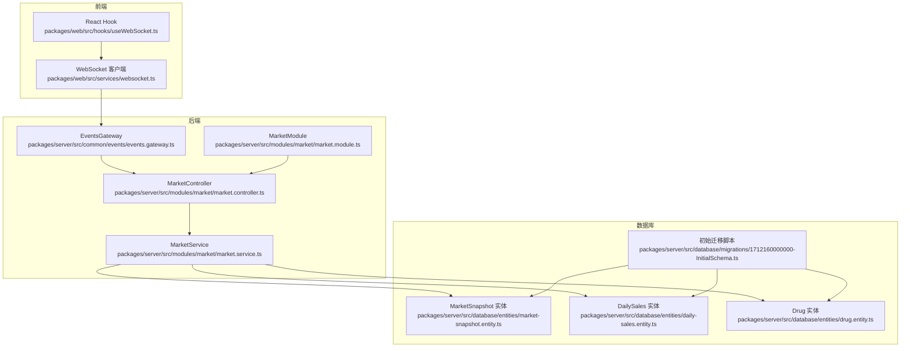
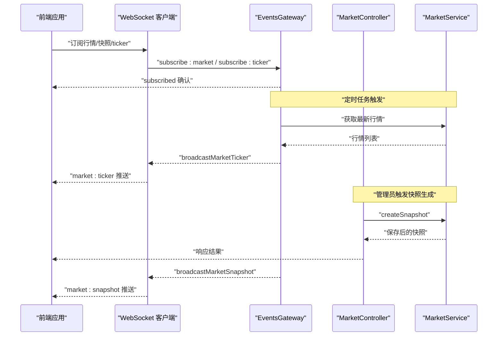
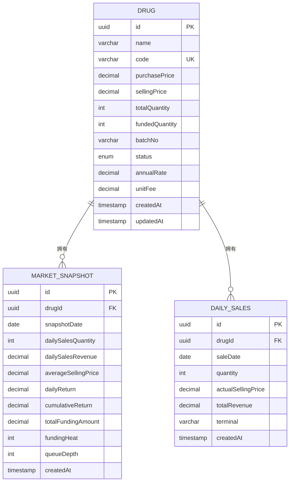
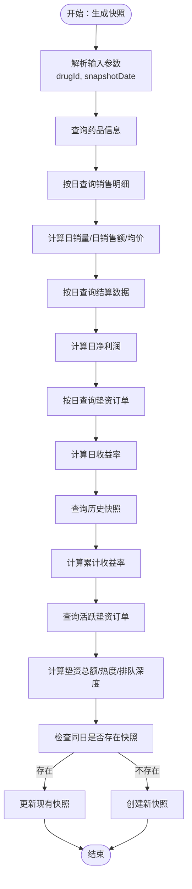
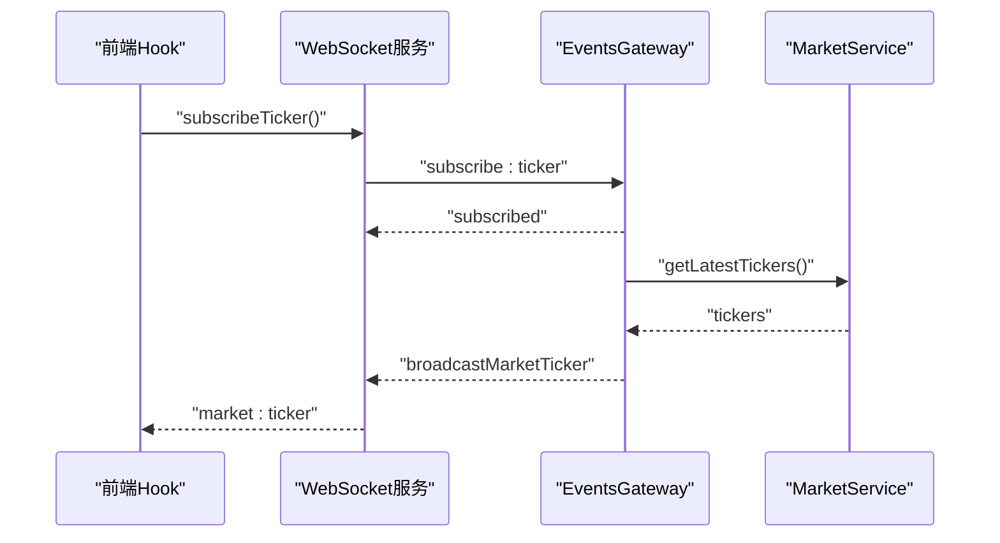
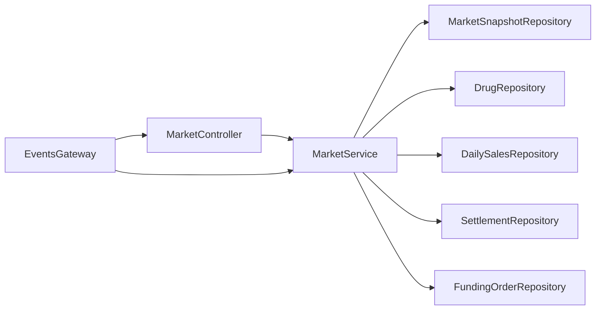

# 市场数据实体

<cite>
**本文引用的文件**
- [packages/server/src/database/entities/market-snapshot.entity.ts](file://packages/server/src/database/entities/market-snapshot.entity.ts)
- [packages/server/src/database/entities/daily-sales.entity.ts](file://packages/server/src/database/entities/daily-sales.entity.ts)
- [packages/server/src/database/entities/drug.entity.ts](file://packages/server/src/database/entities/drug.entity.ts)
- [packages/server/src/modules/market/market.service.ts](file://packages/server/src/modules/market/market.service.ts)
- [packages/server/src/modules/market/market.controller.ts](file://packages/server/src/modules/market/market.controller.ts)
- [packages/server/src/modules/market/market.module.ts](file://packages/server/src/modules/market/market.module.ts)
- [packages/server/src/modules/market/dto/create-snapshot.dto.ts](file://packages/server/src/modules/market/dto/create-snapshot.dto.ts)
- [packages/server/src/modules/market/dto/query-kline.dto.ts](file://packages/server/src/modules/market/dto/query-kline.dto.ts)
- [packages/server/src/common/events/events.gateway.ts](file://packages/server/src/common/events/events.gateway.ts)
- [packages/web/src/services/websocket.ts](file://packages/web/src/services/websocket.ts)
- [packages/web/src/hooks/useWebSocket.ts](file://packages/web/src/hooks/useWebSocket.ts)
- [packages/server/src/database/migrations/1712160000000-InitialSchema.ts](file://packages/server/src/database/migrations/1712160000000-InitialSchema.ts)
</cite>

## 目录
1. [简介](#简介)
2. [项目结构](#项目结构)
3. [核心组件](#核心组件)
4. [架构概览](#架构概览)
5. [详细组件分析](#详细组件分析)
6. [依赖分析](#依赖分析)
7. [性能考虑](#性能考虑)
8. [故障排除指南](#故障排除指南)
9. [结论](#结论)
10. [附录](#附录)

## 简介
本文件面向Jiaoyi项目的市场数据实体，系统性阐述MarketSnapshot市场快照与DailySales每日销售两大核心实体的设计目标、数据结构、存储格式、时间序列管理与历史归档策略，并说明销售数据的统计聚合、趋势分析与报表生成机制。同时覆盖大数据量场景下的查询优化、分区策略与缓存机制建议，以及实时更新流程、异常处理与数据质量监控方案，并解释可视化支持与API接口设计。

## 项目结构
Jiaoyi采用前后端分离的多包结构，市场数据相关的核心代码集中在后端packages/server中，前端packages/web负责WebSocket实时推送与订阅。数据库实体通过TypeORM映射至PostgreSQL，迁移脚本定义了联合索引以支撑高频查询。

**图表来源**
- [packages/server/src/modules/market/market.controller.ts:1-114](file://packages/server/src/modules/market/market.controller.ts#L1-L114)
- [packages/server/src/modules/market/market.service.ts:1-498](file://packages/server/src/modules/market/market.service.ts#L1-L498)
- [packages/server/src/common/events/events.gateway.ts:1-164](file://packages/server/src/common/events/events.gateway.ts#L1-L164)
- [packages/server/src/database/entities/market-snapshot.entity.ts:1-54](file://packages/server/src/database/entities/market-snapshot.entity.ts#L1-L54)
- [packages/server/src/database/entities/daily-sales.entity.ts:1-42](file://packages/server/src/database/entities/daily-sales.entity.ts#L1-L42)
- [packages/server/src/database/entities/drug.entity.ts:1-82](file://packages/server/src/database/entities/drug.entity.ts#L1-L82)
- [packages/server/src/database/migrations/1712160000000-InitialSchema.ts:79-191](file://packages/server/src/database/migrations/1712160000000-InitialSchema.ts#L79-L191)

**章节来源**
- [packages/server/src/modules/market/market.module.ts:1-25](file://packages/server/src/modules/market/market.module.ts#L1-L25)
- [packages/server/src/modules/market/market.controller.ts:1-114](file://packages/server/src/modules/market/market.controller.ts#L1-L114)
- [packages/server/src/modules/market/market.service.ts:1-498](file://packages/server/src/modules/market/market.service.ts#L1-L498)
- [packages/server/src/common/events/events.gateway.ts:1-164](file://packages/server/src/common/events/events.gateway.ts#L1-L164)
- [packages/server/src/database/entities/market-snapshot.entity.ts:1-54](file://packages/server/src/database/entities/market-snapshot.entity.ts#L1-L54)
- [packages/server/src/database/entities/daily-sales.entity.ts:1-42](file://packages/server/src/database/entities/daily-sales.entity.ts#L1-L42)
- [packages/server/src/database/entities/drug.entity.ts:1-82](file://packages/server/src/database/entities/drug.entity.ts#L1-L82)
- [packages/server/src/database/migrations/1712160000000-InitialSchema.ts:79-191](file://packages/server/src/database/migrations/1712160000000-InitialSchema.ts#L79-L191)

## 核心组件
- MarketSnapshot（市场快照）：记录每日关键指标，包括日销量、日销售额、均价、日收益率、累计收益率、垫资总额、垫资热度、排队深度等，按药id与日期建立联合索引，便于快速检索与聚合。
- DailySales（每日销售）：记录每日每笔销售明细，包含数量、实际售价、总营收与终端标识，同样按药id与日期建立联合索引，支撑销售统计与回溯。
- MarketService：提供快照生成、市场总览、K线数据、垫资深度、热门排行、平台统计等服务方法；负责跨实体聚合计算与数据一致性保障。
- MarketController：暴露REST接口，统一鉴权与参数校验，调用MarketService完成业务逻辑。
- EventsGateway：基于WebSocket的事件网关，负责定时推送行情ticker、广播市场快照与行情更新，支持按药品与用户维度分房间订阅。

**章节来源**
- [packages/server/src/database/entities/market-snapshot.entity.ts:12-54](file://packages/server/src/database/entities/market-snapshot.entity.ts#L12-L54)
- [packages/server/src/database/entities/daily-sales.entity.ts:12-42](file://packages/server/src/database/entities/daily-sales.entity.ts#L12-L42)
- [packages/server/src/modules/market/market.service.ts:95-216](file://packages/server/src/modules/market/market.service.ts#L95-L216)
- [packages/server/src/modules/market/market.controller.ts:21-112](file://packages/server/src/modules/market/market.controller.ts#L21-L112)
- [packages/server/src/common/events/events.gateway.ts:48-108](file://packages/server/src/common/events/events.gateway.ts#L48-L108)

## 架构概览
Jiaoyi的市场数据架构围绕“实体-服务-控制器-网关”的分层设计展开。前端通过WebSocket订阅实时行情，后端通过定时任务周期性推送ticker，同时在关键业务节点（如生成快照、发生交易或清算）即时广播相应事件。数据库层面通过联合索引与外键约束保证查询效率与数据完整性。

**图表来源**
- [packages/server/src/common/events/events.gateway.ts:126-143](file://packages/server/src/common/events/events.gateway.ts#L126-L143)
- [packages/server/src/modules/market/market.controller.ts:24-34](file://packages/server/src/modules/market/market.controller.ts#L24-L34)
- [packages/server/src/modules/market/market.service.ts:95-216](file://packages/server/src/modules/market/market.service.ts#L95-L216)
- [packages/web/src/services/websocket.ts:102-120](file://packages/web/src/services/websocket.ts#L102-L120)

## 详细组件分析

### MarketSnapshot（市场快照）实体
- 设计目的：以天为粒度汇总市场关键指标，形成可查询的历史序列，支撑趋势分析、报表生成与风控监控。
- 数据结构要点：
  - 复合主键：UUID
  - 关联字段：drugId（外键至drugs）
  - 时间字段：snapshotDate（日期）
  - 销售指标：dailySalesQuantity（整型）、dailySalesRevenue（货币精度）
  - 价格指标：averageSellingPrice（货币精度）
  - 收益指标：dailyReturn、cumulativeReturn（百分比精度）
  - 资金指标：totalFundingAmount（货币精度）、fundingHeat（整型）、queueDepth（整型）
  - 约束与索引：@Index(['drugId', 'snapshotDate'])，确保按药品与日期的高效查询
- 复杂度分析：单日单药写入O(1)，按日期范围查询O(logN + M)，其中N为索引大小，M为匹配记录数。

**图表来源**
- [packages/server/src/database/entities/market-snapshot.entity.ts:12-54](file://packages/server/src/database/entities/market-snapshot.entity.ts#L12-L54)
- [packages/server/src/database/entities/daily-sales.entity.ts:12-42](file://packages/server/src/database/entities/daily-sales.entity.ts#L12-L42)
- [packages/server/src/database/entities/drug.entity.ts:21-82](file://packages/server/src/database/entities/drug.entity.ts#L21-L82)

**章节来源**
- [packages/server/src/database/entities/market-snapshot.entity.ts:12-54](file://packages/server/src/database/entities/market-snapshot.entity.ts#L12-L54)
- [packages/server/src/database/migrations/1712160000000-InitialSchema.ts:168-191](file://packages/server/src/database/migrations/1712160000000-InitialSchema.ts#L168-L191)

### DailySales（每日销售）实体
- 设计目的：保留每日销售明细，支持销售回溯、对账与更细粒度的统计分析。
- 数据结构要点：
  - 复合主键：UUID
  - 关联字段：drugId（外键至drugs）
  - 时间字段：saleDate（日期）
  - 明细字段：quantity（整型）、actualSellingPrice（货币精度）、totalRevenue（货币精度）、terminal（字符串）
  - 约束与索引：@Index(['drugId', 'saleDate'])，支撑按药与日期的快速检索
- 复杂度分析：单日单药写入O(1)，按日期范围聚合O(logN + K)，K为该日销售笔数。

**章节来源**
- [packages/server/src/database/entities/daily-sales.entity.ts:12-42](file://packages/server/src/database/entities/daily-sales.entity.ts#L12-L42)
- [packages/server/src/database/migrations/1712160000000-InitialSchema.ts:79-98](file://packages/server/src/database/migrations/1712160000000-InitialSchema.ts#L79-L98)

### MarketService（市场服务）
- 快照生成（createSnapshot）：
  - 输入：CreateSnapshotDto（drugId, snapshotDate可选）
  - 流程：按日聚合DailySales与Settlement，结合FundingOrder计算日收益、累计收益、垫资总额、垫资热度与排队深度；若同日存在则更新，否则新增。
  - 关键查询：按drugId与saleDate筛选DailySales；按drugId与settlementDate筛选Settlement；按drugId与fundedAt筛选FundingOrder。
- 市场总览（getMarketOverview）：遍历所有药品，取最新MarketSnapshot作为当日快照，若无则回退至活跃垫资订单计算关键指标。
- K线数据（getDrugKLine）：根据KLinePeriod（7/30/90天/all）计算时间范围，按snapshotDate升序返回KLineData。
- 垫资深度（getDrugDepth）：统计活跃垫资订单的金额分布区间，输出区间统计与总量。
- 全局统计（getMarketStats）：统计药品总数、活跃垫资总额、总销售额、总清算次数与活跃垫资方数量。
- 最新ticker（getLatestTickers）：用于WebSocket定时推送，包含药品ID、名称、代码、现价、日/累计收益与垫资热度。

**图表来源**
- [packages/server/src/modules/market/market.service.ts:95-216](file://packages/server/src/modules/market/market.service.ts#L95-L216)

**章节来源**
- [packages/server/src/modules/market/market.service.ts:95-498](file://packages/server/src/modules/market/market.service.ts#L95-L498)
- [packages/server/src/modules/market/dto/create-snapshot.dto.ts:1-11](file://packages/server/src/modules/market/dto/create-snapshot.dto.ts#L1-L11)
- [packages/server/src/modules/market/dto/query-kline.dto.ts:1-15](file://packages/server/src/modules/market/dto/query-kline.dto.ts#L1-L15)

### MarketController（市场控制器）
- 提供REST接口：
  - POST /market/snapshot（管理员）：触发快照生成
  - GET /market/overview：获取市场总览
  - GET /market/drug/:drugId：获取单药市场详情
  - GET /market/drug/:drugId/kline：获取K线数据
  - GET /market/drug/:drugId/depth：获取垫资深度
  - GET /market/hot-list：获取热门排行
  - GET /market/stats：获取平台统计
- 参数校验与鉴权：使用JwtAuthGuard与RolesGuard，K线接口使用QueryKLineDto进行枚举校验。

**章节来源**
- [packages/server/src/modules/market/market.controller.ts:21-112](file://packages/server/src/modules/market/market.controller.ts#L21-L112)

### EventsGateway（事件网关）与WebSocket推送
- 订阅管理：支持subscribe:market（可按drugId）、subscribe:trades（按userId）、subscribe:ticker三类频道；加入对应房间以便定向推送。
- 广播机制：broadcastMarketUpdate、broadcastMarketSnapshot、broadcastMarketTicker、broadcastFundingUpdate、broadcastSettlementComplete分别推送不同事件。
- 定时推送：每5秒读取MarketService.getLatestTickers并广播market:ticker；首次订阅立即推送一次。
- 前端集成：packages/web/src/services/websocket.ts封装了事件监听、订阅与重连逻辑；hooks/useWebSocket.ts提供React Hook简化接入。

**图表来源**
- [packages/server/src/common/events/events.gateway.ts:66-74](file://packages/server/src/common/events/events.gateway.ts#L66-L74)
- [packages/server/src/common/events/events.gateway.ts:126-143](file://packages/server/src/common/events/events.gateway.ts#L126-L143)
- [packages/web/src/services/websocket.ts:102-120](file://packages/web/src/services/websocket.ts#L102-L120)

**章节来源**
- [packages/server/src/common/events/events.gateway.ts:48-143](file://packages/server/src/common/events/events.gateway.ts#L48-L143)
- [packages/web/src/services/websocket.ts:47-187](file://packages/web/src/services/websocket.ts#L47-L187)
- [packages/web/src/hooks/useWebSocket.ts:1-137](file://packages/web/src/hooks/useWebSocket.ts#L1-L137)

## 依赖分析
- 组件耦合：
  - MarketController仅依赖MarketService，职责清晰，便于测试与扩展。
  - MarketService依赖多个Repository（MarketSnapshot、Drug、DailySales、Settlement、FundingOrder），体现跨实体聚合能力。
  - EventsGateway依赖MarketService进行数据准备，避免在网关层引入复杂业务逻辑。
- 外部依赖：
  - TypeORM负责实体映射与查询；PostgreSQL通过联合索引提升查询性能。
  - NestJS提供WebSockets、Schedule、Validation Pipe等基础设施。
- 潜在循环依赖：未发现模块间循环导入；实体间通过外键关联，避免运行时循环。

**图表来源**
- [packages/server/src/modules/market/market.controller.ts:1-114](file://packages/server/src/modules/market/market.controller.ts#L1-L114)
- [packages/server/src/modules/market/market.service.ts:80-93](file://packages/server/src/modules/market/market.service.ts#L80-L93)
- [packages/server/src/common/events/events.gateway.ts:29-32](file://packages/server/src/common/events/events.gateway.ts#L29-L32)

**章节来源**
- [packages/server/src/modules/market/market.controller.ts:1-114](file://packages/server/src/modules/market/market.controller.ts#L1-L114)
- [packages/server/src/modules/market/market.service.ts:80-93](file://packages/server/src/modules/market/market.service.ts#L80-L93)
- [packages/server/src/common/events/events.gateway.ts:29-32](file://packages/server/src/common/events/events.gateway.ts#L29-L32)

## 性能考虑
- 查询优化：
  - 已建立联合索引：market_snapshots(drugId, snapshotDate)与daily_sales(drugId, saleDate)，显著降低按药与日期的过滤成本。
  - 分页与范围查询：K线与统计接口使用Between与Limit，避免全表扫描。
- 时间序列管理：
  - 快照按自然日生成，避免跨日数据碎片化；历史数据可通过分区策略进一步优化（见下文）。
- 大数据量建议：
  - 分区策略：按月或按季度对market_snapshots与daily_sales进行分区，减少扫描范围。
  - 缓存机制：对热点药品的最新快照与ticker结果进行Redis缓存，设置合理TTL；对聚合统计结果进行定期预计算与缓存。
  - 异步处理：将耗时的统计计算放入队列异步执行，避免阻塞请求。
- 写入优化：
  - 批量写入：合并同一日内的多次快照更新为单次写入。
  - 增量计算：优先复用历史快照中的累计值，减少全量扫描。

[本节为通用性能指导，不直接分析具体文件，故无章节来源]

## 故障排除指南
- WebSocket连接问题：
  - 现象：连接失败或断线重连过多
  - 排查：检查EventsGateway构造函数中的CORS与端口配置；前端wsService在connect_error中记录错误并限制最大重连次数
  - 处理：确认后端允许跨域访问，检查网络连通性与防火墙规则
- 快照生成异常：
  - 现象：找不到药品或计算结果异常
  - 排查：确认CreateSnapshotDto参数正确；检查DailySales、Settlement、FundingOrder数据是否完整
  - 处理：补充缺失数据或调整生成逻辑的时间边界
- 实时推送延迟：
  - 现象：ticker推送不及时
  - 排查：检查定时器是否被清理；确认MarketService.getLatestTickers执行时间
  - 处理：重启定时任务或增加日志定位瓶颈

**章节来源**
- [packages/server/src/common/events/events.gateway.ts:15-38](file://packages/server/src/common/events/events.gateway.ts#L15-L38)
- [packages/web/src/services/websocket.ts:47-100](file://packages/web/src/services/websocket.ts#L47-L100)
- [packages/server/src/modules/market/market.service.ts:95-216](file://packages/server/src/modules/market/market.service.ts#L95-L216)

## 结论
MarketSnapshot与DailySales构成了Jiaoyi市场数据的核心骨架，前者提供稳定的日级指标序列，后者提供明细回溯能力。通过合理的索引设计、跨实体聚合与WebSocket实时推送，系统实现了从数据采集、计算到展示的完整闭环。针对大数据量场景，建议引入分区与缓存策略，并持续优化统计计算与异步化处理，以进一步提升性能与稳定性。

## 附录
- API接口清单（路径/方法/鉴权/说明）
  - POST /market/snapshot（管理员）：生成某药某日的市场快照
  - GET /market/overview：获取市场总览（含最新指标）
  - GET /market/drug/:drugId：获取单药市场详情与垫资统计
  - GET /market/drug/:drugId/kline：获取K线数据（支持7/30/90天/all周期）
  - GET /market/drug/:drugId/depth：获取垫资深度区间统计
  - GET /market/hot-list：获取热门药品排行
  - GET /market/stats：获取平台全局统计
- WebSocket事件清单（频道/说明）
  - subscribe:market / subscribe:trades / subscribe:ticker：订阅不同频道
  - market:update / market:snapshot / market:ticker / funding:update / settlement:complete / system:notification：推送事件

**章节来源**
- [packages/server/src/modules/market/market.controller.ts:21-112](file://packages/server/src/modules/market/market.controller.ts#L21-L112)
- [packages/server/src/common/events/events.gateway.ts:48-124](file://packages/server/src/common/events/events.gateway.ts#L48-L124)
- [packages/web/src/services/websocket.ts:102-120](file://packages/web/src/services/websocket.ts#L102-L120)