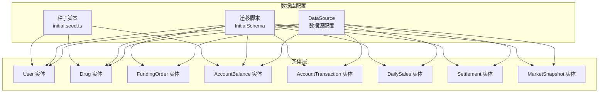
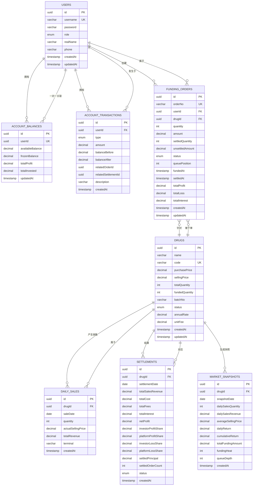
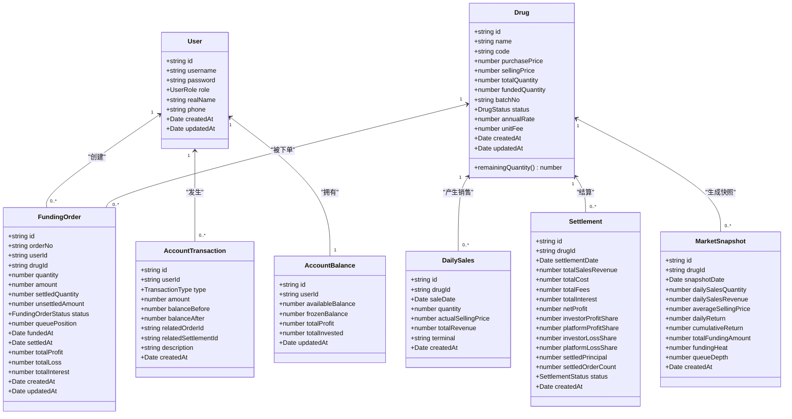
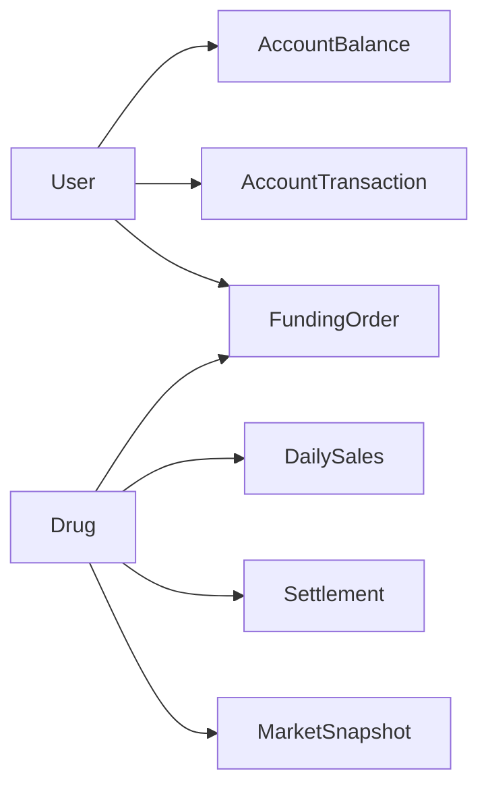

# 数据模型

<cite>
**本文引用的文件**
- [packages/server/src/database/entities/user.entity.ts](file://packages/server/src/database/entities/user.entity.ts)
- [packages/server/src/database/entities/drug.entity.ts](file://packages/server/src/database/entities/drug.entity.ts)
- [packages/server/src/database/entities/funding-order.entity.ts](file://packages/server/src/database/entities/funding-order.entity.ts)
- [packages/server/src/database/entities/account-balance.entity.ts](file://packages/server/src/database/entities/account-balance.entity.ts)
- [packages/server/src/database/entities/daily-sales.entity.ts](file://packages/server/src/database/entities/daily-sales.entity.ts)
- [packages/server/src/database/entities/account-transaction.entity.ts](file://packages/server/src/database/entities/account-transaction.entity.ts)
- [packages/server/src/database/entities/settlement.entity.ts](file://packages/server/src/database/entities/settlement.entity.ts)
- [packages/server/src/database/entities/market-snapshot.entity.ts](file://packages/server/src/database/entities/market-snapshot.entity.ts)
- [packages/server/src/database/data-source.ts](file://packages/server/src/database/data-source.ts)
- [packages/server/src/database/migrations/1712160000000-InitialSchema.ts](file://packages/server/src/database/migrations/1712160000000-InitialSchema.ts)
- [packages/server/src/database/seeds/initial.seed.ts](file://packages/server/src/database/seeds/initial.seed.ts)
- [packages/server/src/database/entities/index.ts](file://packages/server/src/database/entities/index.ts)
</cite>

## 目录
1. [简介](#简介)
2. [项目结构](#项目结构)
3. [核心组件](#核心组件)
4. [架构总览](#架构总览)
5. [详细组件分析](#详细组件分析)
6. [依赖分析](#依赖分析)
7. [性能考量](#性能考量)
8. [故障排查指南](#故障排查指南)
9. [结论](#结论)
10. [附录](#附录)

## 简介
本文件为 Jiaoyi 项目的数据库数据模型文档，聚焦于核心实体与关系映射、主键/外键约束、索引设计、TypeORM 注解使用、数据验证与业务规则、数据生命周期与迁移策略、查询优化与缓存建议、数据安全与访问控制等主题。文档同时提供 ER 图与类图帮助理解实体关系与数据流。

## 项目结构
数据库层采用 TypeORM 配置，通过数据源集中管理实体与迁移脚本，并在迁移中显式定义表结构、约束与索引。种子脚本负责初始化管理员账户、垫资方账户与示例药品数据。

图表来源
- [packages/server/src/database/data-source.ts:1-18](file://packages/server/src/database/data-source.ts#L1-L18)
- [packages/server/src/database/migrations/1712160000000-InitialSchema.ts:1-230](file://packages/server/src/database/migrations/1712160000000-InitialSchema.ts#L1-L230)
- [packages/server/src/database/seeds/initial.seed.ts:1-146](file://packages/server/src/database/seeds/initial.seed.ts#L1-L146)

章节来源
- [packages/server/src/database/data-source.ts:1-18](file://packages/server/src/database/data-source.ts#L1-L18)
- [packages/server/src/database/migrations/1712160000000-InitialSchema.ts:1-230](file://packages/server/src/database/migrations/1712160000000-InitialSchema.ts#L1-L230)
- [packages/server/src/database/seeds/initial.seed.ts:1-146](file://packages/server/src/database/seeds/initial.seed.ts#L1-L146)

## 核心组件
本节概述核心实体及其职责边界与关键字段含义（字段命名与精度以实体定义为准）：

- User：用户主体，区分角色（投资者/管理员），关联资金账户与交易流水。
- Drug：药品信息与状态，记录采购价、销售价、总量、已垫付量、批次号、年化利率、单位费用等。
- FundingOrder：垫付订单，记录下单用户、药品、数量、金额、队列位置、状态、结算进度与收益统计。
- AccountBalance：账户余额，记录可用余额、冻结余额、累计利润、累计投资等。
- AccountTransaction：账户交易流水，记录类型（充值、提现、垫付、回款、分成、利息等）、金额与前后余额、关联单据。
- DailySales：日销售快照，按日聚合销量、实际售价与收入。
- Settlement：结算单，按日对药品进行收入、成本、费用、利息、净利与分润计算。
- MarketSnapshot：市场快照，记录日度销售、均价、日/累计回报、资金热度与排队深度等。

章节来源
- [packages/server/src/database/entities/user.entity.ts:1-58](file://packages/server/src/database/entities/user.entity.ts#L1-L58)
- [packages/server/src/database/entities/drug.entity.ts:1-82](file://packages/server/src/database/entities/drug.entity.ts#L1-L82)
- [packages/server/src/database/entities/funding-order.entity.ts:1-87](file://packages/server/src/database/entities/funding-order.entity.ts#L1-L87)
- [packages/server/src/database/entities/account-balance.entity.ts:1-38](file://packages/server/src/database/entities/account-balance.entity.ts#L1-L38)
- [packages/server/src/database/entities/account-transaction.entity.ts:1-62](file://packages/server/src/database/entities/account-transaction.entity.ts#L1-L62)
- [packages/server/src/database/entities/daily-sales.entity.ts:1-43](file://packages/server/src/database/entities/daily-sales.entity.ts#L1-L43)
- [packages/server/src/database/entities/settlement.entity.ts:1-77](file://packages/server/src/database/entities/settlement.entity.ts#L1-L77)
- [packages/server/src/database/entities/market-snapshot.entity.ts:1-55](file://packages/server/src/database/entities/market-snapshot.entity.ts#L1-L55)

## 架构总览
下图展示实体间的主从关系与外键约束，体现典型的“用户-药品-订单-结算-流水”闭环。

图表来源
- [packages/server/src/database/migrations/1712160000000-InitialSchema.ts:10-191](file://packages/server/src/database/migrations/1712160000000-InitialSchema.ts#L10-L191)
- [packages/server/src/database/entities/user.entity.ts:19-57](file://packages/server/src/database/entities/user.entity.ts#L19-L57)
- [packages/server/src/database/entities/drug.entity.ts:21-81](file://packages/server/src/database/entities/drug.entity.ts#L21-L81)
- [packages/server/src/database/entities/account-balance.entity.ts:11-37](file://packages/server/src/database/entities/account-balance.entity.ts#L11-L37)
- [packages/server/src/database/entities/account-transaction.entity.ts:22-61](file://packages/server/src/database/entities/account-transaction.entity.ts#L22-L61)
- [packages/server/src/database/entities/funding-order.entity.ts:21-86](file://packages/server/src/database/entities/funding-order.entity.ts#L21-L86)
- [packages/server/src/database/entities/daily-sales.entity.ts:12-42](file://packages/server/src/database/entities/daily-sales.entity.ts#L12-L42)
- [packages/server/src/database/entities/settlement.entity.ts:18-76](file://packages/server/src/database/entities/settlement.entity.ts#L18-L76)
- [packages/server/src/database/entities/market-snapshot.entity.ts:12-54](file://packages/server/src/database/entities/market-snapshot.entity.ts#L12-L54)

## 详细组件分析

### User 实体
- 角色枚举：区分投资者与管理员。
- 关系映射：一对一流水账本；一对多：垫付订单；一对多：账户交易流水。
- 时间戳：自动维护创建与更新时间。
- 唯一性：用户名唯一。

章节来源
- [packages/server/src/database/entities/user.entity.ts:14-57](file://packages/server/src/database/entities/user.entity.ts#L14-L57)

### Drug 实体
- 状态枚举：待垫付、垫付中、销售中、已完成。
- 计算属性：剩余可售数量 = 总量 - 已垫付量。
- 关系映射：一对多：垫付订单；一对多：日销售；一对多：结算；一对多：市场快照。
- 精度：价格与金额采用高精度十进制，避免浮点误差。

章节来源
- [packages/server/src/database/entities/drug.entity.ts:14-81](file://packages/server/src/database/entities/drug.entity.ts#L14-L81)

### FundingOrder 实体
- 状态枚举：待处理、持有、部分结算、已结算。
- 关键字段：订单号唯一；用户与药品外键；数量与金额；结算进度与收益统计。
- 索引：联合索引（drugId, status, fundedAt）用于高效查询与排序。
- 关系映射：多对一：用户；多对一：药品。

章节来源
- [packages/server/src/database/entities/funding-order.entity.ts:14-86](file://packages/server/src/database/entities/funding-order.entity.ts#L14-L86)

### AccountBalance 实体
- 唯一约束：用户 ID 唯一，确保一对一关系。
- 字段：可用余额、冻结余额、累计利润、累计投资。
- 更新时间：自动维护。

章节来源
- [packages/server/src/database/entities/account-balance.entity.ts:11-37](file://packages/server/src/database/entities/account-balance.entity.ts#L11-L37)

### AccountTransaction 实体
- 类型枚举：充值、提现、垫付、本金返还、利润分成、亏损分成、利息等。
- 关联：可选关联订单与结算单，便于审计追踪。
- 索引：联合索引（userId, createdAt）支持用户流水分页与时间序列查询。

章节来源
- [packages/server/src/database/entities/account-transaction.entity.ts:12-61](file://packages/server/src/database/entities/account-transaction.entity.ts#L12-L61)

### DailySales 实体
- 聚合维度：按日与药品聚合销量、实际售价与收入。
- 索引：联合索引（drugId, saleDate）支持快速检索某药品的日销售趋势。

章节来源
- [packages/server/src/database/entities/daily-sales.entity.ts:13-42](file://packages/server/src/database/entities/daily-sales.entity.ts#L13-L42)

### Settlement 实体
- 结算维度：按日与药品汇总收入、成本、费用、利息、净利与分润。
- 状态枚举：处理中、已完成、失败。
- 索引：联合索引（drugId, settlementDate）支持按日/药的结算查询。

章节来源
- [packages/server/src/database/entities/settlement.entity.ts:12-76](file://packages/server/src/database/entities/settlement.entity.ts#L12-L76)

### MarketSnapshot 实体
- 快照维度：日度销售、均价、日/累计回报、资金热度、排队深度等。
- 索引：联合索引（drugId, snapshotDate）支持快照检索与趋势分析。

章节来源
- [packages/server/src/database/entities/market-snapshot.entity.ts:12-54](file://packages/server/src/database/entities/market-snapshot.entity.ts#L12-L54)

### 类图（实体与关系）

图表来源
- [packages/server/src/database/entities/user.entity.ts:19-57](file://packages/server/src/database/entities/user.entity.ts#L19-L57)
- [packages/server/src/database/entities/drug.entity.ts:21-81](file://packages/server/src/database/entities/drug.entity.ts#L21-L81)
- [packages/server/src/database/entities/funding-order.entity.ts:21-86](file://packages/server/src/database/entities/funding-order.entity.ts#L21-L86)
- [packages/server/src/database/entities/account-balance.entity.ts:11-37](file://packages/server/src/database/entities/account-balance.entity.ts#L11-L37)
- [packages/server/src/database/entities/account-transaction.entity.ts:22-61](file://packages/server/src/database/entities/account-transaction.entity.ts#L22-L61)
- [packages/server/src/database/entities/daily-sales.entity.ts:12-42](file://packages/server/src/database/entities/daily-sales.entity.ts#L12-L42)
- [packages/server/src/database/entities/settlement.entity.ts:18-76](file://packages/server/src/database/entities/settlement.entity.ts#L18-L76)
- [packages/server/src/database/entities/market-snapshot.entity.ts:12-54](file://packages/server/src/database/entities/market-snapshot.entity.ts#L12-L54)

## 依赖分析
- 外键依赖链：User → AccountBalance、AccountTransaction；User → FundingOrder；Drug → FundingOrder、DailySales、Settlement、MarketSnapshot。
- 级联删除：外键引用均设置为级联删除，保证数据一致性与清理便利性。
- 索引覆盖：联合索引服务于高频查询（订单状态扫描、日销售聚合、结算与快照检索）。

图表来源
- [packages/server/src/database/migrations/1712160000000-InitialSchema.ts:69-121](file://packages/server/src/database/migrations/1712160000000-InitialSchema.ts#L69-L121)

章节来源
- [packages/server/src/database/migrations/1712160000000-InitialSchema.ts:6-191](file://packages/server/src/database/migrations/1712160000000-InitialSchema.ts#L6-L191)

## 性能考量
- 索引策略
  - FundingOrder：(drugId, status, fundedAt) 支持按药品与状态的高效筛选与队列推进。
  - DailySales：(drugId, saleDate) 支持日粒度销售聚合。
  - Settlement：(drugId, settlementDate) 支持日结结算查询。
  - AccountTransaction：(userId, createdAt) 支持用户流水分页与时间序列分析。
- 数值精度
  - 价格与金额统一使用高精度十进制，避免浮点误差累积。
- 查询优化建议
  - 使用投影只选择必要字段，减少网络与解析开销。
  - 对高频过滤条件建立复合索引，避免全表扫描。
  - 分页查询时基于游标或时间窗口，避免深层分页导致的性能退化。
- 缓存策略
  - 市场快照与日销售聚合结果可短期缓存，结合 TTL 与失效策略。
  - 用户账户余额可缓存至会话层，写入后异步刷新。
- 迁移与同步
  - 数据源禁止自动同步（synchronize=false），通过迁移脚本管理结构演进，确保生产环境可控。

章节来源
- [packages/server/src/database/migrations/1712160000000-InitialSchema.ts:74-191](file://packages/server/src/database/migrations/1712160000000-InitialSchema.ts#L74-L191)
- [packages/server/src/database/data-source.ts:16-17](file://packages/server/src/database/data-source.ts#L16-L17)

## 故障排查指南
- 迁移失败
  - 检查 PostgreSQL 是否启用 uuid-ossp 扩展；确认迁移顺序与依赖链正确。
  - 反向迁移时注意索引与表的删除顺序（逆序依赖）。
- 种子数据异常
  - 确认管理员与垫资方账户未重复创建；检查密码哈希是否成功。
  - 初始余额与示例药品需去重插入，避免唯一约束冲突。
- 运行期错误
  - 若出现外键约束错误，检查关联实体是否存在且状态合法。
  - 订单结算与账户流水需保持事务一致性，防止余额不平。

章节来源
- [packages/server/src/database/migrations/1712160000000-InitialSchema.ts:194-228](file://packages/server/src/database/migrations/1712160000000-InitialSchema.ts#L194-L228)
- [packages/server/src/database/seeds/initial.seed.ts:18-110](file://packages/server/src/database/seeds/initial.seed.ts#L18-L110)

## 结论
该数据模型围绕“用户-药品-订单-结算-流水-快照”的完整闭环构建，通过明确的枚举与高精度数值设计、完善的索引策略与严格的外键约束，支撑起垫付与销售场景下的业务流程。配合迁移与种子脚本，实现了结构演进与初始数据的可控管理。建议在后续迭代中持续完善索引覆盖与缓存策略，确保高并发场景下的稳定性与性能。

## 附录

### 数据生命周期管理
- 创建：通过种子脚本初始化管理员、垫资方与示例药品。
- 运行：订单状态流转、日销售与结算生成、账户流水记账。
- 归档：历史结算与日销售可定期归档，降低在线表规模。
- 清理：根据业务规则清理过期或无效订单，保持数据整洁。

章节来源
- [packages/server/src/database/seeds/initial.seed.ts:12-111](file://packages/server/src/database/seeds/initial.seed.ts#L12-L111)

### 数据迁移策略与版本控制
- 迁移脚本：以时间戳命名的迁移文件，定义 up/down 逻辑，确保结构演进可追溯。
- 版本控制：迁移文件纳入版本库，变更需伴随迁移脚本提交与评审。
- 生产部署：禁止自动同步，统一通过迁移命令执行，确保一致性。

章节来源
- [packages/server/src/database/migrations/1712160000000-InitialSchema.ts:3-4](file://packages/server/src/database/migrations/1712160000000-InitialSchema.ts#L3-L4)
- [packages/server/src/database/data-source.ts:14-17](file://packages/server/src/database/data-source.ts#L14-L17)

### 数据安全、隐私保护与访问控制
- 密码存储：种子脚本使用强哈希算法保存密码，避免明文存储。
- 角色权限：用户角色区分管理员与投资者，结合守卫实现访问控制。
- 数据脱敏：对外接口返回应脱敏敏感字段，仅暴露必要信息。
- 审计追踪：账户流水与订单状态变更保留时间戳与操作轨迹，便于审计。

章节来源
- [packages/server/src/database/seeds/initial.seed.ts:24-33](file://packages/server/src/database/seeds/initial.seed.ts#L24-L33)
- [packages/server/src/database/entities/user.entity.ts:30-35](file://packages/server/src/database/entities/user.entity.ts#L30-L35)