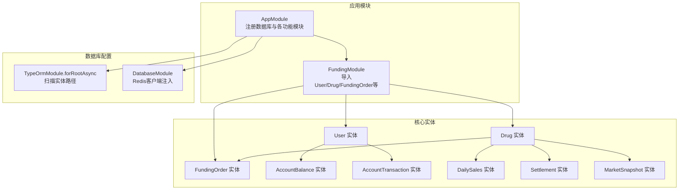
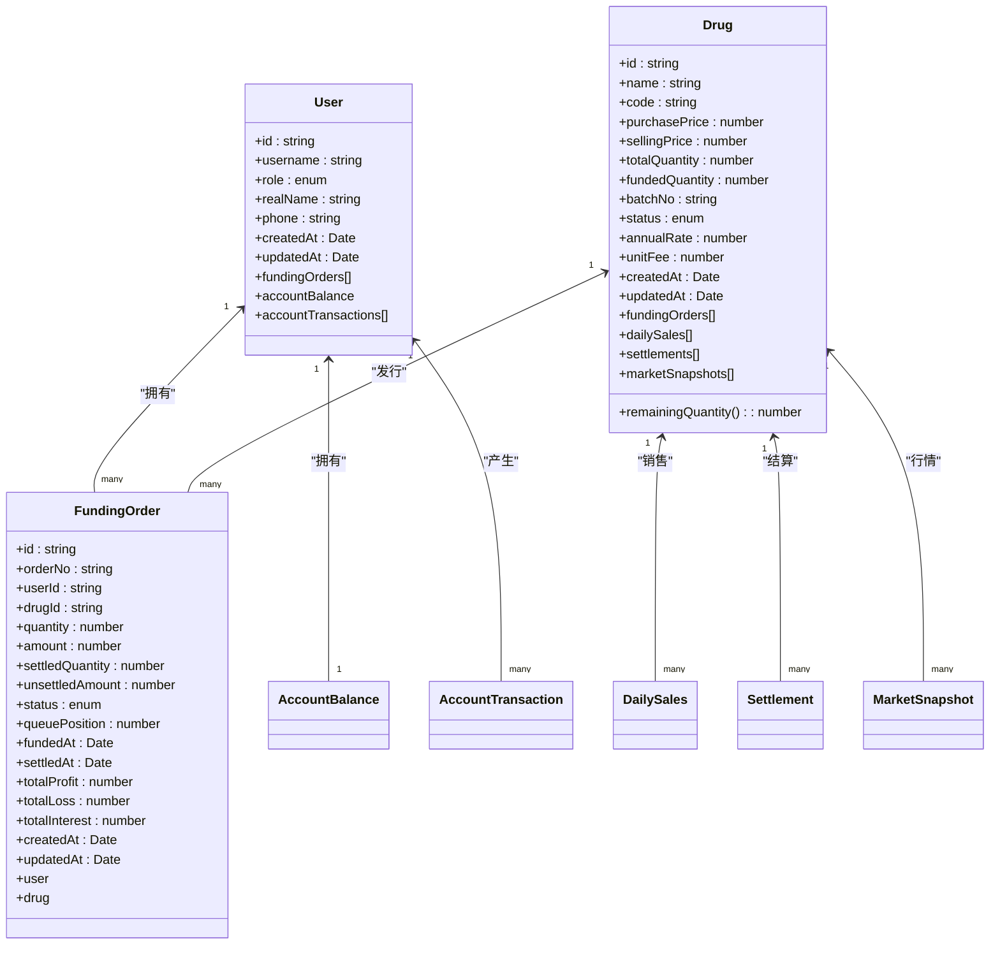
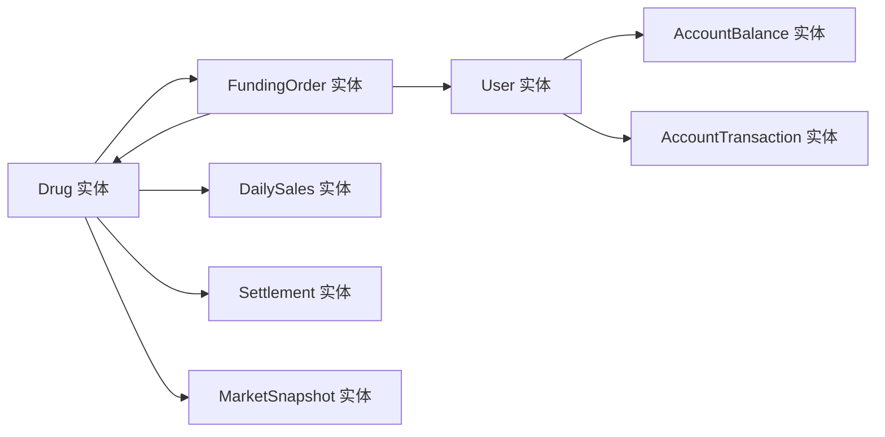

# 核心实体模型

<cite>
**本文引用的文件**
- [packages/server/src/database/entities/user.entity.ts](file://packages/server/src/database/entities/user.entity.ts)
- [packages/server/src/database/entities/drug.entity.ts](file://packages/server/src/database/entities/drug.entity.ts)
- [packages/server/src/database/entities/funding-order.entity.ts](file://packages/server/src/database/entities/funding-order.entity.ts)
- [packages/server/src/database/entities/account-balance.entity.ts](file://packages/server/src/database/entities/account-balance.entity.ts)
- [packages/server/src/database/entities/account-transaction.entity.ts](file://packages/server/src/database/entities/account-transaction.entity.ts)
- [packages/server/src/database/entities/daily-sales.entity.ts](file://packages/server/src/database/entities/daily-sales.entity.ts)
- [packages/server/src/database/entities/settlement.entity.ts](file://packages/server/src/database/entities/settlement.entity.ts)
- [packages/server/src/database/entities/market-snapshot.entity.ts](file://packages/server/src/database/entities/market-snapshot.entity.ts)
- [packages/server/src/database/entities/index.ts](file://packages/server/src/database/entities/index.ts)
- [packages/server/src/database/database.module.ts](file://packages/server/src/database/database.module.ts)
- [packages/server/src/app.module.ts](file://packages/server/src/app.module.ts)
- [packages/server/src/modules/funding/funding.module.ts](file://packages/server/src/modules/funding/funding.module.ts)
</cite>

## 目录
1. [简介](#简介)
2. [项目结构](#项目结构)
3. [核心组件](#核心组件)
4. [架构总览](#架构总览)
5. [详细组件分析](#详细组件分析)
6. [依赖分析](#依赖分析)
7. [性能考虑](#性能考虑)
8. [故障排查指南](#故障排查指南)
9. [结论](#结论)
10. [附录](#附录)

## 简介
本文件聚焦 Jiaoyi 项目的核心实体模型，围绕 User 用户实体、Drug 药品实体与 FundingOrder 垫资订单实体进行系统化梳理。内容涵盖字段定义、数据类型、约束与校验规则、实体间关联关系（主键/外键）、索引策略、TypeORM 装饰器用法、级联行为与软删除机制的现状说明、以及创建/更新/查询的最佳实践与业务规则在数据模型中的落地方式。

## 项目结构
- 实体集中位于 packages/server/src/database/entities 下，采用按领域分层的文件组织方式。
- 应用通过 TypeORM 在 AppModule 中统一注册数据库连接与实体扫描路径，并在各功能模块中按需引入实体。
- Funding 模块显式导入了 User、Drug、FundingOrder 及账户相关实体，体现资金流与订单流的关键耦合点。

图示来源
- [packages/server/src/app.module.ts:15-50](file://packages/server/src/app.module.ts#L15-L50)
- [packages/server/src/database/database.module.ts:1-26](file://packages/server/src/database/database.module.ts#L1-L26)
- [packages/server/src/modules/funding/funding.module.ts:10-22](file://packages/server/src/modules/funding/funding.module.ts#L10-L22)
- [packages/server/src/database/entities/user.entity.ts:19-57](file://packages/server/src/database/entities/user.entity.ts#L19-L57)
- [packages/server/src/database/entities/drug.entity.ts:21-81](file://packages/server/src/database/entities/drug.entity.ts#L21-L81)
- [packages/server/src/database/entities/funding-order.entity.ts:21-86](file://packages/server/src/database/entities/funding-order.entity.ts#L21-L86)

章节来源
- [packages/server/src/app.module.ts:15-50](file://packages/server/src/app.module.ts#L15-L50)
- [packages/server/src/database/database.module.ts:1-26](file://packages/server/src/database/database.module.ts#L1-L26)
- [packages/server/src/modules/funding/funding.module.ts:10-22](file://packages/server/src/modules/funding/funding.module.ts#L10-L22)

## 核心组件
本节对三个核心实体进行字段、类型、约束与验证规则的系统性说明，并指出其在业务流程中的职责边界。

- User 用户实体
  - 主键：UUID
  - 关键字段：username（唯一）、password、role（枚举：investor/admin）、realName（可空）、phone（可空）
  - 时间列：createdAt、updatedAt
  - 关系：一对多（FundingOrder）、一对一（AccountBalance）、一对多（AccountTransaction）

- Drug 药品实体
  - 主键：UUID
  - 关键字段：name、code（唯一）、purchasePrice、sellingPrice、totalQuantity、fundedQuantity（默认0）、batchNo、status（枚举：pending/funding/selling/completed，默认pending）、annualRate（年化利率）、unitFee（单位费用）
  - 计算属性：remainingQuantity = totalQuantity - fundedQuantity
  - 时间列：createdAt、updatedAt
  - 关系：一对多（FundingOrder）、一对多（DailySales）、一对多（Settlement）、一对多（MarketSnapshot）

- FundingOrder 垫资订单实体
  - 主键：UUID
  - 关键字段：orderNo（唯一）、userId、drugId、quantity、amount（decimal 12,2）、settledQuantity（默认0）、unsettledAmount（decimal 12,2 默认0）、status（枚举：pending/holding/partial_settled/settled，默认pending）、queuePosition、fundedAt、settledAt（可空）、totalProfit/totalLoss/totalInterest（decimal 12,2 默认0）
  - 时间列：createdAt、updatedAt
  - 关系：多对一（User）、多对一（Drug）
  - 索引：复合索引（drugId, status, fundedAt）

章节来源
- [packages/server/src/database/entities/user.entity.ts:19-57](file://packages/server/src/database/entities/user.entity.ts#L19-L57)
- [packages/server/src/database/entities/drug.entity.ts:21-81](file://packages/server/src/database/entities/drug.entity.ts#L21-L81)
- [packages/server/src/database/entities/funding-order.entity.ts:21-86](file://packages/server/src/database/entities/funding-order.entity.ts#L21-L86)

## 架构总览
下图展示核心实体之间的关系与典型交互路径，突出 User 作为资金方、Drug 作为标的资产、FundingOrder 作为交易契约的三元关系。

图示来源
- [packages/server/src/database/entities/user.entity.ts:19-57](file://packages/server/src/database/entities/user.entity.ts#L19-L57)
- [packages/server/src/database/entities/drug.entity.ts:21-81](file://packages/server/src/database/entities/drug.entity.ts#L21-L81)
- [packages/server/src/database/entities/funding-order.entity.ts:21-86](file://packages/server/src/database/entities/funding-order.entity.ts#L21-L86)
- [packages/server/src/database/entities/account-balance.entity.ts:11-37](file://packages/server/src/database/entities/account-balance.entity.ts#L11-L37)
- [packages/server/src/database/entities/account-transaction.entity.ts:22-61](file://packages/server/src/database/entities/account-transaction.entity.ts#L22-L61)
- [packages/server/src/database/entities/daily-sales.entity.ts:12-42](file://packages/server/src/database/entities/daily-sales.entity.ts#L12-L42)
- [packages/server/src/database/entities/settlement.entity.ts:18-76](file://packages/server/src/database/entities/settlement.entity.ts#L18-L76)
- [packages/server/src/database/entities/market-snapshot.entity.ts:12-54](file://packages/server/src/database/entities/market-snapshot.entity.ts#L12-L54)

## 详细组件分析

### User 用户实体
- 字段与约束
  - id：UUID 主键
  - username：唯一、非空
  - password：非空
  - role：枚举，默认 investor
  - realName/phone：可空
  - createdAt/updatedAt：自动维护
- 关系
  - 一对多：fundingOrders（由 FundingOrder.user 外键指向）
  - 一对一：accountBalance（由 AccountBalance.userId 唯一键约束）
  - 一对多：accountTransactions（由 AccountTransaction.userId 外键指向）
- 验证与业务规则
  - 角色枚举控制访问权限
  - 账户余额与交易记录与用户一一对应，便于资金流水追踪
- 查询与更新建议
  - 创建：先校验 username 唯一性，再写入用户表
  - 更新：仅允许更新可空字段或受控字段；避免直接修改角色
  - 查询：常用按 username 或 id 查询；结合账户余额与交易记录进行汇总查询时注意连接性能

章节来源
- [packages/server/src/database/entities/user.entity.ts:19-57](file://packages/server/src/database/entities/user.entity.ts#L19-L57)
- [packages/server/src/database/entities/account-balance.entity.ts:11-37](file://packages/server/src/database/entities/account-balance.entity.ts#L11-L37)
- [packages/server/src/database/entities/account-transaction.entity.ts:22-61](file://packages/server/src/database/entities/account-transaction.entity.ts#L22-L61)

### Drug 药品实体
- 字段与约束
  - id：UUID 主键
  - name/code：name 非空；code 唯一
  - 价格与数量：purchasePrice/sellingPrice（decimal 10,2）；totalQuantity（int）；fundedQuantity（int 默认0）
  - 其他：batchNo、status（枚举默认 pending）、annualRate（decimal 5,2 默认5.0）、unitFee（decimal 10,2 默认1.0）
  - createdAt/updatedAt：自动维护
- 计算属性
  - remainingQuantity：totalQuantity - fundedQuantity，用于快速判断剩余可垫付数量
- 关系
  - 一对多：fundingOrders（由 FundingOrder.drug 外键指向）
  - 一对多：dailySales（日销售）
  - 一对多：settlements（结算）
  - 一对多：marketSnapshots（市场快照）
- 验证与业务规则
  - status 枚举驱动生命周期状态机
  - remainingQuantity 作为业务断言依据，确保垫付与销售不超限
- 查询与更新建议
  - 创建：校验 code 唯一性；初始化 totalQuantity 与 fundedQuantity
  - 更新：仅允许更新 price、quantity、status 等受控字段；变更 status 时需配合业务流程
  - 查询：按 code、status、日期区间查询日销售与结算

章节来源
- [packages/server/src/database/entities/drug.entity.ts:21-81](file://packages/server/src/database/entities/drug.entity.ts#L21-L81)
- [packages/server/src/database/entities/daily-sales.entity.ts:12-42](file://packages/server/src/database/entities/daily-sales.entity.ts#L12-L42)
- [packages/server/src/database/entities/settlement.entity.ts:18-76](file://packages/server/src/database/entities/settlement.entity.ts#L18-L76)
- [packages/server/src/database/entities/market-snapshot.entity.ts:12-54](file://packages/server/src/database/entities/market-snapshot.entity.ts#L12-L54)

### FundingOrder 垫资订单实体
- 字段与约束
  - id：UUID 主键
  - orderNo：唯一
  - userId/drugId：UUID 外键
  - 数量与金额：quantity（int）、amount（decimal 12,2）、settledQuantity（int 默认0）、unsettledAmount（decimal 12,2 默认0）
  - 状态与时间：status（枚举默认 pending）、queuePosition、fundedAt、settledAt（可空）
  - 收益与费用：totalProfit/totalLoss/totalInterest（decimal 12,2 默认0）
  - createdAt/updatedAt：自动维护
- 关系
  - 多对一：user（User.fundingOrders）
  - 多对一：drug（Drug.fundingOrders）
- 索引
  - 复合索引（drugId, status, fundedAt），用于高效筛选待结算/排队中的订单
- 验证与业务规则
  - 订单金额与数量、单价一致性校验
  - 状态机推进需满足前置条件（如排队位置、资金可用性）
  - 与 Drug 的 remainingQuantity 协同，防止超额垫付
- 查询与更新建议
  - 创建：生成 orderNo 唯一值；计算 amount = quantity × drug.sellingPrice；设置初始状态与排队位置
  - 更新：仅允许更新 settledQuantity/unsettledAmount/status 等结算相关字段；变更状态时需事务保障
  - 查询：优先使用复合索引字段过滤；分页查询时按 fundedAt 排序

章节来源
- [packages/server/src/database/entities/funding-order.entity.ts:21-86](file://packages/server/src/database/entities/funding-order.entity.ts#L21-L86)

### 关联关系与索引策略
- 主键/外键设计
  - 所有实体主键均为 UUID，避免序列依赖与分布式冲突
  - 外键：FundingOrder.userId → User.id；FundingOrder.drugId → Drug.id；AccountBalance.userId → User.id；AccountTransaction.userId → User.id；DailySales.drugId → Drug.id；Settlement.drugId → Drug.id；MarketSnapshot.drugId → Drug.id
- 索引策略
  - FundingOrder：复合索引（drugId, status, fundedAt），支持高频查询与排序
  - AccountTransaction：复合索引（userId, createdAt），支持用户流水分页与时间范围查询
  - DailySales/Settlement/MarketSnapshot：分别按（drugId, date）或（drugId, settlementDate）建立索引，支撑按药与日期的统计分析
- 级联与软删除
  - 当前实体未见软删除字段与软删除装饰器；删除行为遵循数据库默认约束，建议在需要审计与恢复的场景引入软删除字段与全局过滤器

章节来源
- [packages/server/src/database/entities/funding-order.entity.ts:21-86](file://packages/server/src/database/entities/funding-order.entity.ts#L21-L86)
- [packages/server/src/database/entities/account-transaction.entity.ts:22-61](file://packages/server/src/database/entities/account-transaction.entity.ts#L22-L61)
- [packages/server/src/database/entities/daily-sales.entity.ts:12-42](file://packages/server/src/database/entities/daily-sales.entity.ts#L12-L42)
- [packages/server/src/database/entities/settlement.entity.ts:18-76](file://packages/server/src/database/entities/settlement.entity.ts#L18-L76)
- [packages/server/src/database/entities/market-snapshot.entity.ts:12-54](file://packages/server/src/database/entities/market-snapshot.entity.ts#L12-L54)

### TypeORM 装饰器与实体集成
- 装饰器用法要点
  - Entity：声明表名
  - PrimaryGeneratedColumn：UUID 主键
  - Column：字段定义，含精度/小数位/默认值/唯一/可空等约束
  - CreateDateColumn/UpdateDateColumn：自动时间戳
  - Enum：枚举字段与默认值
  - OneToMany/ManyToOne/OneToOne：关系映射与 JoinColumn
  - Index：复合索引声明
- 模块集成
  - AppModule 使用 TypeOrmModule.forRootAsync 扫描实体路径并启用迁移
  - FundingModule 显式导入 User、Drug、FundingOrder 等核心实体，便于服务与控制器直接注入仓储

章节来源
- [packages/server/src/app.module.ts:21-37](file://packages/server/src/app.module.ts#L21-L37)
- [packages/server/src/modules/funding/funding.module.ts:10-22](file://packages/server/src/modules/funding/funding.module.ts#L10-L22)
- [packages/server/src/database/entities/index.ts:1-8](file://packages/server/src/database/entities/index.ts#L1-L8)

### 业务规则在数据模型中的实现
- 用户角色控制：UserRole 枚举限定访问范围
- 资金与头寸：AccountBalance 与 AccountTransaction 记录可用/冻结余额与流水，支撑风控与对账
- 药品状态机：Drug.status 驱动生命周期，限制垫付/销售/结算阶段的业务操作
- 订单结算：FundingOrder.status 与 settledQuantity/unsettledAmount 字段承载结算进度与损益
- 数据完整性：唯一约束（username、code、orderNo、userId）与外键约束共同保障引用完整

章节来源
- [packages/server/src/database/entities/user.entity.ts:19-57](file://packages/server/src/database/entities/user.entity.ts#L19-L57)
- [packages/server/src/database/entities/account-balance.entity.ts:11-37](file://packages/server/src/database/entities/account-balance.entity.ts#L11-L37)
- [packages/server/src/database/entities/account-transaction.entity.ts:22-61](file://packages/server/src/database/entities/account-transaction.entity.ts#L22-L61)
- [packages/server/src/database/entities/drug.entity.ts:21-81](file://packages/server/src/database/entities/drug.entity.ts#L21-L81)
- [packages/server/src/database/entities/funding-order.entity.ts:21-86](file://packages/server/src/database/entities/funding-order.entity.ts#L21-L86)

### 创建/更新/查询最佳实践
- 创建
  - 用户：校验 username 唯一后写入；初始化账户余额记录
  - 药品：校验 code 唯一；设置初始状态与基础参数
  - 订单：生成 orderNo 唯一值；计算金额；设置初始状态与排队位置
- 更新
  - 仅允许受控字段更新；变更状态需满足前置条件并使用事务
  - 对 decimal 字段进行四舍五入与精度校验
- 查询
  - 优先使用复合索引字段过滤；分页查询时按时间字段排序
  - 聚合查询时注意连接顺序与过滤条件，避免全表扫描

章节来源
- [packages/server/src/database/entities/user.entity.ts:19-57](file://packages/server/src/database/entities/user.entity.ts#L19-L57)
- [packages/server/src/database/entities/drug.entity.ts:21-81](file://packages/server/src/database/entities/drug.entity.ts#L21-L81)
- [packages/server/src/database/entities/funding-order.entity.ts:21-86](file://packages/server/src/database/entities/funding-order.entity.ts#L21-L86)

## 依赖分析
- 组件内聚与耦合
  - User 与账户相关实体强耦合，体现“用户即账户”的设计
  - Drug 与销售、结算、行情实体形成闭环，支撑完整的业务生命周期
  - FundingOrder 作为跨实体的契约，连接用户与药品，是资金流与货物流的交汇点
- 外部依赖
  - TypeORM 提供 ORM 能力与实体扫描
  - PostgreSQL 作为持久化存储
  - Redis 客户端在 DatabaseModule 中注入，可用于缓存与会话存储（与实体无直接耦合）

图示来源
- [packages/server/src/database/entities/user.entity.ts:19-57](file://packages/server/src/database/entities/user.entity.ts#L19-L57)
- [packages/server/src/database/entities/drug.entity.ts:21-81](file://packages/server/src/database/entities/drug.entity.ts#L21-L81)
- [packages/server/src/database/entities/funding-order.entity.ts:21-86](file://packages/server/src/database/entities/funding-order.entity.ts#L21-L86)
- [packages/server/src/database/entities/account-balance.entity.ts:11-37](file://packages/server/src/database/entities/account-balance.entity.ts#L11-L37)
- [packages/server/src/database/entities/account-transaction.entity.ts:22-61](file://packages/server/src/database/entities/account-transaction.entity.ts#L22-L61)
- [packages/server/src/database/entities/daily-sales.entity.ts:12-42](file://packages/server/src/database/entities/daily-sales.entity.ts#L12-L42)
- [packages/server/src/database/entities/settlement.entity.ts:18-76](file://packages/server/src/database/entities/settlement.entity.ts#L18-L76)
- [packages/server/src/database/entities/market-snapshot.entity.ts:12-54](file://packages/server/src/database/entities/market-snapshot.entity.ts#L12-L54)

章节来源
- [packages/server/src/database/entities/user.entity.ts:19-57](file://packages/server/src/database/entities/user.entity.ts#L19-L57)
- [packages/server/src/database/entities/drug.entity.ts:21-81](file://packages/server/src/database/entities/drug.entity.ts#L21-L81)
- [packages/server/src/database/entities/funding-order.entity.ts:21-86](file://packages/server/src/database/entities/funding-order.entity.ts#L21-L86)

## 性能考虑
- 索引优化
  - 为高频查询字段建立复合索引（如 FundingOrder 的（drugId, status, fundedAt））
  - 分页查询时尽量使用稳定排序字段，减少回表
- 类型与精度
  - 金额类字段统一使用 decimal 并设定合理 precision/scale，避免浮点误差
- 连接与聚合
  - 聚合查询时注意连接顺序与过滤条件，必要时拆分子查询或引入物化视图
- 缓存策略
  - 对热点数据（如药品状态、用户余额）引入 Redis 缓存，降低数据库压力

## 故障排查指南
- 常见问题
  - 唯一约束冲突：username/code/orderNo 冲突时检查幂等性与去重逻辑
  - 外键约束失败：确认关联实体存在且状态合法
  - 精度溢出：decimal 字段运算前后进行精度校验与四舍五入处理
- 排查步骤
  - 核对实体装饰器与索引定义，确认查询路径是否命中索引
  - 检查事务边界与并发控制，避免脏写与丢失更新
  - 结合日志与慢查询分析定位瓶颈

章节来源
- [packages/server/src/database/entities/user.entity.ts:19-57](file://packages/server/src/database/entities/user.entity.ts#L19-L57)
- [packages/server/src/database/entities/drug.entity.ts:21-81](file://packages/server/src/database/entities/drug.entity.ts#L21-L81)
- [packages/server/src/database/entities/funding-order.entity.ts:21-86](file://packages/server/src/database/entities/funding-order.entity.ts#L21-L86)

## 结论
User、Drug、FundingOrder 三者构成了 Jiaoyi 的核心业务骨架：用户作为资金方，药品作为标的资产，订单作为契约与结算载体。通过枚举状态机、复合索引与严格的字段约束，系统在数据层面实现了清晰的业务规则与良好的可扩展性。建议后续在需要审计与恢复的场景引入软删除机制，并持续优化热点查询的索引与缓存策略。

## 附录
- 导出入口
  - 实体导出集中在 entities/index.ts，便于模块间统一引用
- 数据库配置
  - TypeORM 在 AppModule 中统一配置，扫描路径包含所有 .entity.ts 文件
- 模块集成
  - FundingModule 显式导入核心实体，便于服务层直接使用仓储

章节来源
- [packages/server/src/database/entities/index.ts:1-8](file://packages/server/src/database/entities/index.ts#L1-L8)
- [packages/server/src/app.module.ts:21-37](file://packages/server/src/app.module.ts#L21-L37)
- [packages/server/src/modules/funding/funding.module.ts:10-22](file://packages/server/src/modules/funding/funding.module.ts#L10-L22)