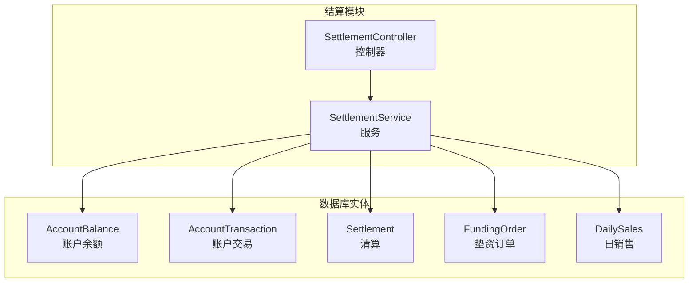
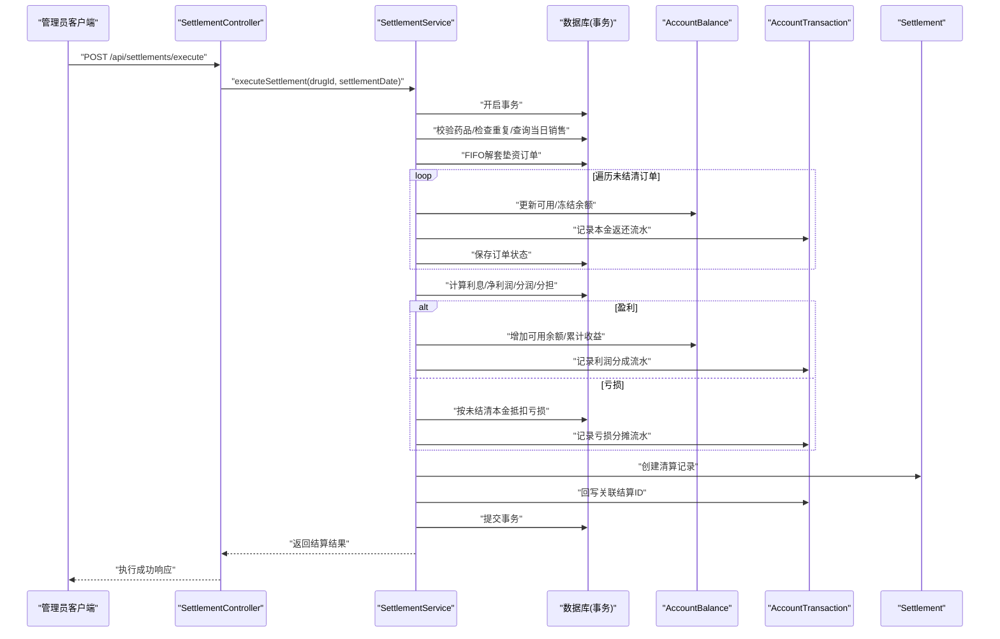
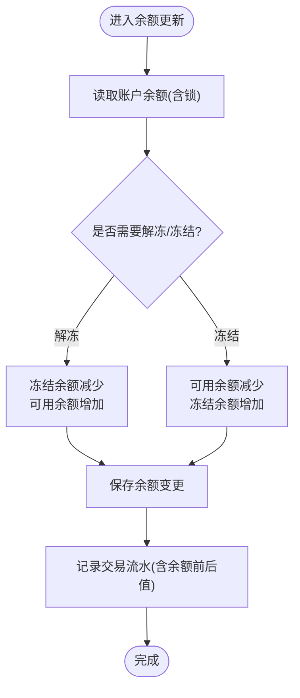
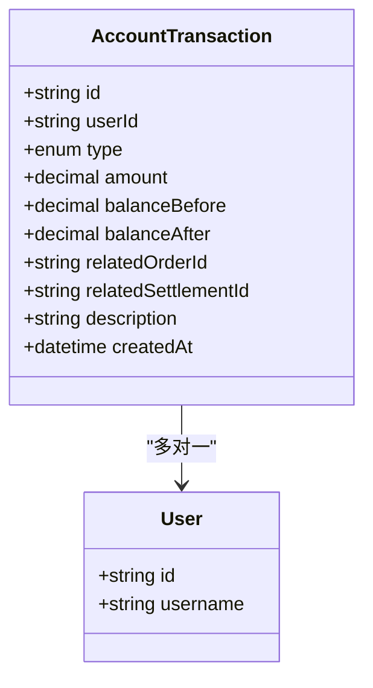
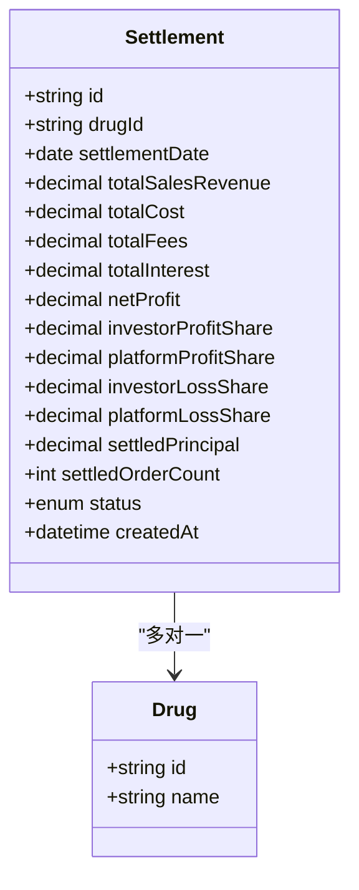
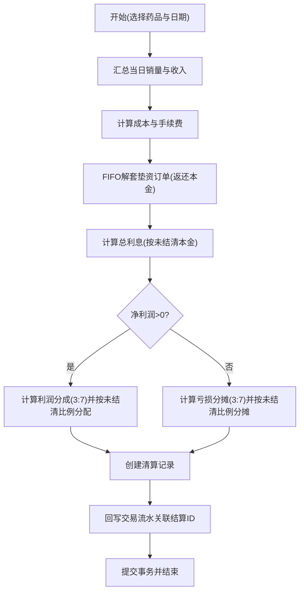
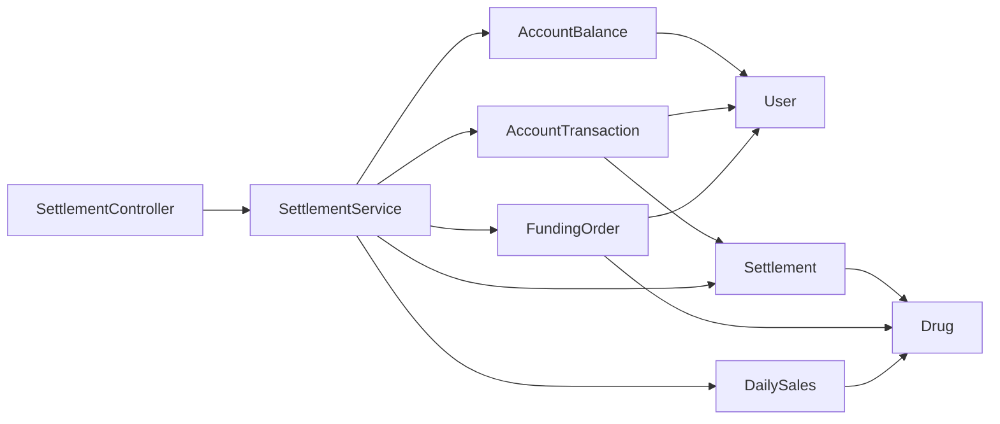

# 财务相关实体

<cite>
**本文引用的文件**
- [packages/server/src/database/entities/account-balance.entity.ts](file://packages/server/src/database/entities/account-balance.entity.ts)
- [packages/server/src/database/entities/account-transaction.entity.ts](file://packages/server/src/database/entities/account-transaction.entity.ts)
- [packages/server/src/database/entities/settlement.entity.ts](file://packages/server/src/database/entities/settlement.entity.ts)
- [packages/server/src/database/entities/funding-order.entity.ts](file://packages/server/src/database/entities/funding-order.entity.ts)
- [packages/server/src/database/entities/daily-sales.entity.ts](file://packages/server/src/database/entities/daily-sales.entity.ts)
- [packages/server/src/modules/settlement/settlement.service.ts](file://packages/server/src/modules/settlement/settlement.service.ts)
- [packages/server/src/modules/settlement/settlement.controller.ts](file://packages/server/src/modules/settlement/settlement.controller.ts)
- [packages/server/src/modules/settlement/dto/execute-settlement.dto.ts](file://packages/server/src/modules/settlement/dto/execute-settlement.dto.ts)
- [packages/server/src/modules/settlement/dto/query-settlement.dto.ts](file://packages/server/src/modules/settlement/dto/query-settlement.dto.ts)
</cite>

## 目录
1. [简介](#简介)
2. [项目结构](#项目结构)
3. [核心组件](#核心组件)
4. [架构总览](#架构总览)
5. [详细组件分析](#详细组件分析)
6. [依赖关系分析](#依赖关系分析)
7. [性能考虑](#性能考虑)
8. [故障排查指南](#故障排查指南)
9. [结论](#结论)
10. [附录](#附录)

## 简介
本文件面向 Jiaoyi 项目的财务领域，系统化梳理与说明三大核心实体及其关联模块：账户余额 AccountBalance、账户交易 AccountTransaction、以及清算 Settlement。内容涵盖数据模型设计、余额计算与交易流水记录机制、清算结算的数据流程、利息计算与资金分配算法，并补充财务数据的准确性保障、审计追踪与合规要点、API 接口示例与错误处理策略，以及安全存储、备份恢复与性能优化建议。

## 项目结构
财务相关代码主要位于服务端 packages/server 的数据库实体层与结算模块中，采用分层组织：
- 数据库实体：定义 AccountBalance、AccountTransaction、Settlement、FundingOrder、DailySales 等核心财务数据模型
- 结算模块：实现 executeSettlement、getSettlementPreview、getSettlements、getSettlementDetail 等业务流程
- 控制器：对外暴露 /api/settlements 相关接口，进行鉴权与参数校验
- DTO：对请求参数进行类型与格式校验

图表来源
- [packages/server/src/database/entities/account-balance.entity.ts:1-38](file://packages/server/src/database/entities/account-balance.entity.ts#L1-L38)
- [packages/server/src/database/entities/account-transaction.entity.ts:1-62](file://packages/server/src/database/entities/account-transaction.entity.ts#L1-L62)
- [packages/server/src/database/entities/settlement.entity.ts:1-77](file://packages/server/src/database/entities/settlement.entity.ts#L1-L77)
- [packages/server/src/database/entities/funding-order.entity.ts:1-87](file://packages/server/src/database/entities/funding-order.entity.ts#L1-L87)
- [packages/server/src/database/entities/daily-sales.entity.ts:1-43](file://packages/server/src/database/entities/daily-sales.entity.ts#L1-L43)
- [packages/server/src/modules/settlement/settlement.service.ts:1-978](file://packages/server/src/modules/settlement/settlement.service.ts#L1-L978)
- [packages/server/src/modules/settlement/settlement.controller.ts:1-151](file://packages/server/src/modules/settlement/settlement.controller.ts#L1-L151)

章节来源
- [packages/server/src/database/entities/account-balance.entity.ts:1-38](file://packages/server/src/database/entities/account-balance.entity.ts#L1-L38)
- [packages/server/src/database/entities/account-transaction.entity.ts:1-62](file://packages/server/src/database/entities/account-transaction.entity.ts#L1-L62)
- [packages/server/src/database/entities/settlement.entity.ts:1-77](file://packages/server/src/database/entities/settlement.entity.ts#L1-L77)
- [packages/server/src/database/entities/funding-order.entity.ts:1-87](file://packages/server/src/database/entities/funding-order.entity.ts#L1-L87)
- [packages/server/src/database/entities/daily-sales.entity.ts:1-43](file://packages/server/src/database/entities/daily-sales.entity.ts#L1-L43)
- [packages/server/src/modules/settlement/settlement.service.ts:1-978](file://packages/server/src/modules/settlement/settlement.service.ts#L1-L978)
- [packages/server/src/modules/settlement/settlement.controller.ts:1-151](file://packages/server/src/modules/settlement/settlement.controller.ts#L1-L151)

## 核心组件
本节聚焦三大财务实体与结算服务的关键字段与职责，帮助快速理解数据模型与业务边界。

- 账户余额 AccountBalance
  - 关键字段：用户标识、可用余额、冻结余额、总收益、总投入、更新时间
  - 作用：记录用户的实时资金状况，支持可用/冻结资金的原子性调整
  - 外键关系：一对一关联用户

- 账户交易 AccountTransaction
  - 关键字段：用户标识、交易类型枚举、金额、余额前后值、关联单据、关联结算、描述、创建时间
  - 作用：完整记录每一笔资金变动的流水，支撑审计与对账
  - 外键关系：多对一关联用户；索引覆盖用户+时间维度

- 清算 Settlement
  - 关键字段：药品标识、清算日期、当日销售额、成本、手续费、利息、净利润、分润/分担、已结算本金、订单数、状态、创建时间
  - 作用：每日汇总生成的财务结算报告，作为对账与分润的权威依据
  - 外键关系：多对一关联药品

章节来源
- [packages/server/src/database/entities/account-balance.entity.ts:11-37](file://packages/server/src/database/entities/account-balance.entity.ts#L11-L37)
- [packages/server/src/database/entities/account-transaction.entity.ts:22-61](file://packages/server/src/database/entities/account-transaction.entity.ts#L22-L61)
- [packages/server/src/database/entities/settlement.entity.ts:18-76](file://packages/server/src/database/entities/settlement.entity.ts#L18-L76)

## 架构总览
下图展示“日清日结”流程的端到端调用链路与数据流：

图表来源
- [packages/server/src/modules/settlement/settlement.controller.ts:32-46](file://packages/server/src/modules/settlement/settlement.controller.ts#L32-L46)
- [packages/server/src/modules/settlement/settlement.service.ts:54-472](file://packages/server/src/modules/settlement/settlement.service.ts#L54-L472)

## 详细组件分析

### 账户余额 AccountBalance 设计与余额计算
- 数据模型
  - 字段精度：decimal(12,2)，满足大额资金与高精度需求
  - 关系：与用户一对一，通过 userId 唯一约束确保唯一性
- 余额计算逻辑
  - 可用余额与冻结余额的增减遵循严格的原子性更新，避免并发场景下的竞态
  - 更新时间字段用于审计与排序
- 并发控制
  - 在关键路径使用悲观锁锁定记录，确保更新一致性

图表来源
- [packages/server/src/modules/settlement/settlement.service.ts:172-202](file://packages/server/src/modules/settlement/settlement.service.ts#L172-L202)
- [packages/server/src/modules/settlement/settlement.service.ts:299-330](file://packages/server/src/modules/settlement/settlement.service.ts#L299-L330)

章节来源
- [packages/server/src/database/entities/account-balance.entity.ts:11-37](file://packages/server/src/database/entities/account-balance.entity.ts#L11-L37)
- [packages/server/src/modules/settlement/settlement.service.ts:172-202](file://packages/server/src/modules/settlement/settlement.service.ts#L172-L202)
- [packages/server/src/modules/settlement/settlement.service.ts:299-330](file://packages/server/src/modules/settlement/settlement.service.ts#L299-L330)

### 账户交易 AccountTransaction 设计与流水记录机制
- 交易类型枚举：充值、提现、垫资、本金返还、利润分成、亏损分摊、利息等
- 流水记录要素：用户、类型、金额、余额前后值、关联单据/结算、描述、时间
- 索引策略：用户+时间复合索引，提升查询效率
- 审计价值：完整保留每笔资金变动的上下文，便于对账与监管检查

图表来源
- [packages/server/src/database/entities/account-transaction.entity.ts:22-61](file://packages/server/src/database/entities/account-transaction.entity.ts#L22-L61)

章节来源
- [packages/server/src/database/entities/account-transaction.entity.ts:12-61](file://packages/server/src/database/entities/account-transaction.entity.ts#L12-L61)

### 清算 Settlement 设计与结算流程
- 清算维度：按药品与日期聚合，生成当日的销售、成本、费用、利息、净利润与分润/分担明细
- 状态机：处理中/已完成/失败，防止重复执行
- 关联关系：与药品建立多对一关系，便于按药品维度统计

图表来源
- [packages/server/src/database/entities/settlement.entity.ts:18-76](file://packages/server/src/database/entities/settlement.entity.ts#L18-L76)

章节来源
- [packages/server/src/database/entities/settlement.entity.ts:12-76](file://packages/server/src/database/entities/settlement.entity.ts#L12-L76)

### 清算结算的数据流程、利息计算与资金分配算法
- 日常销售汇总：按日期聚合销售数量与收入
- 成本与费用：按销量乘以单价与单位手续费计算
- FIFO 解套：按下单时间顺序对垫资订单进行解套，返还本金至可用余额
- 利息计算：基于未结清本金按年化利率日计算，累加入订单与数据库
- 净利润与分润/分担：按销售毛利减去成本、费用与利息得到净利/损；盈利按 3:7 分配，亏损同样按 3:7 分担，均按未结清本金比例分配

图表来源
- [packages/server/src/modules/settlement/settlement.service.ts:54-472](file://packages/server/src/modules/settlement/settlement.service.ts#L54-L472)

章节来源
- [packages/server/src/modules/settlement/settlement.service.ts:54-472](file://packages/server/src/modules/settlement/settlement.service.ts#L54-L472)

### API 接口示例与错误处理策略
- 接口一览（管理员权限）
  - POST /api/settlements/execute：执行日清日结
  - GET /api/settlements/preview：获取清算预览
  - GET /api/settlements/summary/all：获取清算汇总统计
  - GET /api/settlements/my/list：我的清算记录（垫资方）
  - GET /api/settlements/my/stats：我的清算统计（垫资方）
  - GET /api/settlements：清算记录列表
  - GET /api/settlements/:id：清算详情
- 参数校验
  - ExecuteSettlementDto：药品 UUID、日期字符串
  - QuerySettlementDto：药品 UUID、起止日期、分页参数
- 错误处理
  - 药品不存在、重复清算、无销售记录等前置校验抛出相应异常
  - 事务内任何异常均回滚，保证数据一致性

章节来源
- [packages/server/src/modules/settlement/settlement.controller.ts:24-151](file://packages/server/src/modules/settlement/settlement.controller.ts#L24-L151)
- [packages/server/src/modules/settlement/dto/execute-settlement.dto.ts:7-15](file://packages/server/src/modules/settlement/dto/execute-settlement.dto.ts#L7-L15)
- [packages/server/src/modules/settlement/dto/query-settlement.dto.ts:10-42](file://packages/server/src/modules/settlement/dto/query-settlement.dto.ts#L10-L42)

## 依赖关系分析
- 实体间依赖
  - AccountTransaction 依赖 User 与 Settlement（可选）
  - Settlement 依赖 Drug
  - FundingOrder 依赖 User 与 Drug
  - AccountBalance 依赖 User
- 服务层依赖
  - SettlementService 组合多个 Repository 与 DataSource，贯穿事务控制
- 控制器依赖
  - SettlementController 仅依赖 SettlementService，负责鉴权与参数校验

图表来源
- [packages/server/src/database/entities/account-balance.entity.ts:34-36](file://packages/server/src/database/entities/account-balance.entity.ts#L34-L36)
- [packages/server/src/database/entities/account-transaction.entity.ts:58-60](file://packages/server/src/database/entities/account-transaction.entity.ts#L58-L60)
- [packages/server/src/database/entities/settlement.entity.ts:73-75](file://packages/server/src/database/entities/settlement.entity.ts#L73-L75)
- [packages/server/src/database/entities/funding-order.entity.ts:79-85](file://packages/server/src/database/entities/funding-order.entity.ts#L79-L85)
- [packages/server/src/database/entities/daily-sales.entity.ts:39-41](file://packages/server/src/database/entities/daily-sales.entity.ts#L39-L41)
- [packages/server/src/modules/settlement/settlement.service.ts:34-48](file://packages/server/src/modules/settlement/settlement.service.ts#L34-L48)
- [packages/server/src/modules/settlement/settlement.controller.ts:24-26](file://packages/server/src/modules/settlement/settlement.controller.ts#L24-L26)

章节来源
- [packages/server/src/modules/settlement/settlement.service.ts:34-48](file://packages/server/src/modules/settlement/settlement.service.ts#L34-L48)

## 性能考虑
- 索引策略
  - AccountTransaction：用户+时间复合索引，加速按用户与时间范围查询
  - Settlement：药品+日期复合索引，加速按药品与日期检索
  - FundingOrder：药品+状态+时间索引，加速 FIFO 解套与状态筛选
  - DailySales：药品+日期索引，加速按日汇总
- 事务与锁
  - 关键更新使用悲观锁，避免并发写导致的余额不一致
  - 整个结算流程置于单一事务中，失败即回滚
- 数值精度
  - decimal(12,2) 精度统一，避免浮点误差累积
- 分页与查询
  - 清算列表与统计查询支持分页，降低一次性加载压力

章节来源
- [packages/server/src/database/entities/account-transaction.entity.ts:23-23](file://packages/server/src/database/entities/account-transaction.entity.ts#L23-L23)
- [packages/server/src/database/entities/settlement.entity.ts:19-19](file://packages/server/src/database/entities/settlement.entity.ts#L19-L19)
- [packages/server/src/database/entities/funding-order.entity.ts:22-22](file://packages/server/src/database/entities/funding-order.entity.ts#L22-L22)
- [packages/server/src/database/entities/daily-sales.entity.ts:13-13](file://packages/server/src/database/entities/daily-sales.entity.ts#L13-L13)
- [packages/server/src/modules/settlement/settlement.service.ts:64-66](file://packages/server/src/modules/settlement/settlement.service.ts#L64-L66)

## 故障排查指南
- 常见问题与定位
  - “药品不存在”：确认 drugId 是否正确且存在
  - “该药品在某日已完成清算，不能重复清算”：检查 Settlement 表状态
  - “某日没有销售记录，无法清算”：核对 DailySales 数据
- 事务回滚
  - 任一步骤异常将触发回滚，需检查对应实体的更新与保存逻辑
- 审计与复盘
  - 通过 AccountTransaction 与 Settlement 明细核对资金变动与分润/分担
  - 对比 FundingOrder 的 unsettledAmount、totalProfit/totalLoss 与 totalInterest 变化

章节来源
- [packages/server/src/modules/settlement/settlement.service.ts:71-105](file://packages/server/src/modules/settlement/settlement.service.ts#L71-L105)
- [packages/server/src/modules/settlement/settlement.service.ts:464-471](file://packages/server/src/modules/settlement/settlement.service.ts#L464-L471)

## 结论
本文件系统化梳理了 Jiaoyi 项目的财务实体与结算流程，明确了账户余额与交易流水的建模思路、日清日结的七步流程、利息与分润/分担算法，并提供了 API 与错误处理策略。通过严格的事务控制、数值精度与索引策略，保障了财务数据的准确性与性能。建议在生产环境中配合完善的监控、审计与备份策略，持续优化查询与结算批处理性能。

## 附录
- 合规与审计要点
  - 交易流水需保留至少法定年限，支持监管检查
  - 清算记录作为对账与税务凭证，需确保不可篡改
  - 异常与回滚日志应完整记录，便于审计追踪
- 安全与备份
  - 数据库连接与凭据加密存储
  - 定期全量与增量备份，验证恢复流程
- 性能优化建议
  - 批量处理与异步化：将历史结算迁移与报表生成异步化
  - 缓存热点数据：如药品基础信息、用户余额快照
  - 分库分表：按药品或用户维度扩展