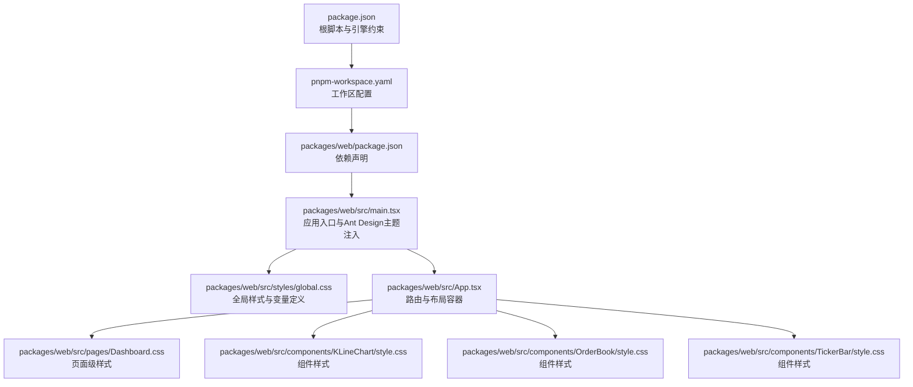
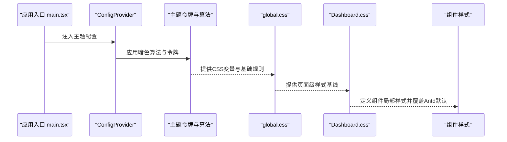
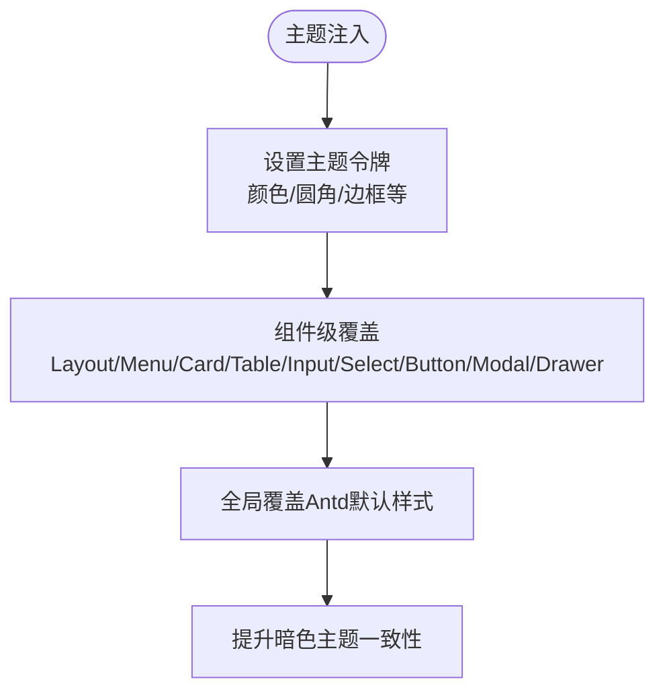
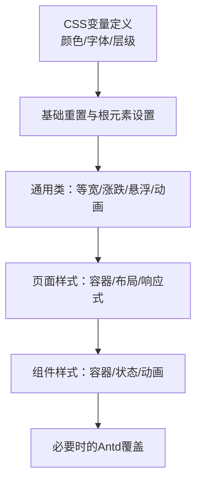
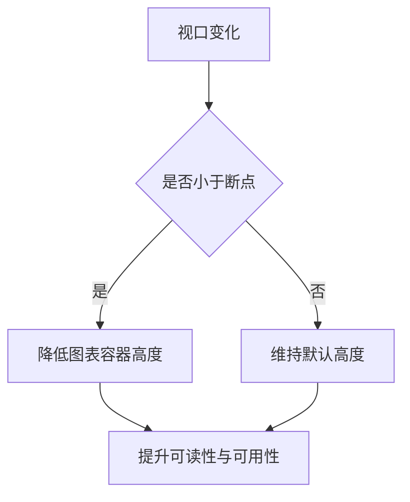
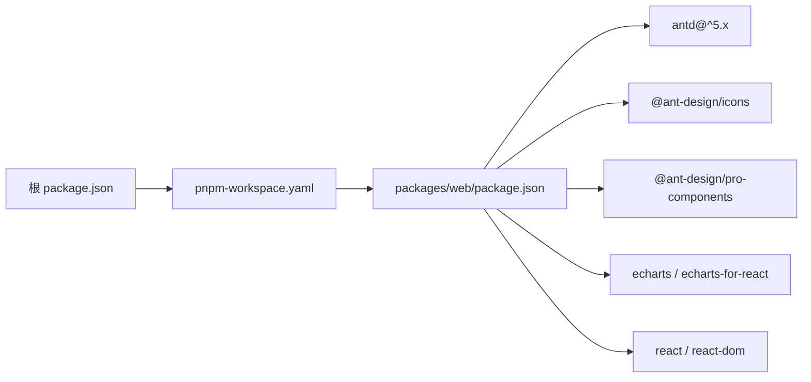

# UI系统

<cite>
**本文引用的文件**
- [package.json](file://package.json)
- [pnpm-workspace.yaml](file://pnpm-workspace.yaml)
- [packages/web/package.json](file://packages/web/package.json)
- [packages/web/src/main.tsx](file://packages/web/src/main.tsx)
- [packages/web/src/styles/global.css](file://packages/web/src/styles/global.css)
- [packages/web/src/pages/Dashboard.css](file://packages/web/src/pages/Dashboard.css)
- [packages/web/src/components/KLineChart/style.css](file://packages/web/src/components/KLineChart/style.css)
- [packages/web/src/components/OrderBook/style.css](file://packages/web/src/components/OrderBook/style.css)
- [packages/web/src/components/TickerBar/style.css](file://packages/web/src/components/TickerBar/style.css)
</cite>

## 目录
1. [引言](#引言)
2. [项目结构](#项目结构)
3. [核心组件](#核心组件)
4. [架构总览](#架构总览)
5. [详细组件分析](#详细组件分析)
6. [依赖分析](#依赖分析)
7. [性能考虑](#性能考虑)
8. [故障排查指南](#故障排查指南)
9. [结论](#结论)
10. [附录](#附录)

## 引言
本文件面向Jiaoyi项目的UI系统，聚焦于Ant Design在暗色交易主题下的集成与定制化配置，涵盖主题变量、样式覆盖与组件扩展策略；同时梳理全局样式组织、CSS模块化与响应式实现方式，给出颜色系统、字体规范与间距标准的落地建议，并总结组件样式复用模式、BEM命名约定与调试技巧。最后提供UI一致性保障、可访问性与跨浏览器兼容性建议，以及样式开发规范与设计系统最佳实践。

## 项目结构
Jiaoyi采用Monorepo组织，前端位于packages/web，使用Vite + React + TypeScript构建，Ant Design v5作为基础UI库，配合@ant-design/pro-components与图标库等生态组件。全局样式通过全局CSS文件集中管理，页面与组件各自维护局部样式文件，形成“全局-页面-组件”三层样式体系。

图表来源
- [packages/web/src/main.tsx](file://packages/web/src/main.tsx)
- [packages/web/src/styles/global.css](file://packages/web/src/styles/global.css)
- [packages/web/src/App.tsx](file://packages/web/src/App.tsx)
- [packages/web/src/pages/Dashboard.css](file://packages/web/src/pages/Dashboard.css)
- [packages/web/src/components/KLineChart/style.css](file://packages/web/src/components/KLineChart/style.css)
- [packages/web/src/components/OrderBook/style.css](file://packages/web/src/components/OrderBook/style.css)
- [packages/web/src/components/TickerBar/style.css](file://packages/web/src/components/TickerBar/style.css)
- [packages/web/package.json](file://packages/web/package.json)
- [pnpm-workspace.yaml](file://pnpm-workspace.yaml)
- [package.json](file://package.json)

章节来源
- [package.json:1-24](file://package.json#L1-L24)
- [pnpm-workspace.yaml:1-3](file://pnpm-workspace.yaml#L1-L3)
- [packages/web/package.json:1-40](file://packages/web/package.json#L1-L40)

## 核心组件
- Ant Design主题注入：在应用入口通过ConfigProvider注入暗色算法与主题令牌，统一控制主色、功能色、文本与背景、边框、圆角等视觉要素，并对Layout、Menu、Card、Table、Input、Select、Button、Modal、Drawer等组件进行深色风格覆盖。
- 全局样式：以CSS自定义属性定义暗色交易主题的主色调、功能色、文字色、边框色与字体族，统一重置、滚动条、链接、等宽字体、涨跌色、卡片悬浮与动画等通用规则。
- 页面样式：Dashboard页面采用Flex布局与响应式断点，结合Ant Design组件的覆盖样式，实现统计卡片、面板卡片、热门列表、图表容器、深度图、活动列表等区域的视觉与交互。
- 组件样式：K线图、订单簿、Ticker栏分别定义独立的容器、状态与动画样式，确保组件内聚与可复用。

章节来源
- [packages/web/src/main.tsx:1-80](file://packages/web/src/main.tsx#L1-L80)
- [packages/web/src/styles/global.css:1-173](file://packages/web/src/styles/global.css#L1-L173)
- [packages/web/src/pages/Dashboard.css:1-413](file://packages/web/src/pages/Dashboard.css#L1-L413)
- [packages/web/src/components/KLineChart/style.css:1-75](file://packages/web/src/components/KLineChart/style.css#L1-L75)
- [packages/web/src/components/OrderBook/style.css:1-68](file://packages/web/src/components/OrderBook/style.css#L1-L68)
- [packages/web/src/components/TickerBar/style.css:1-84](file://packages/web/src/components/TickerBar/style.css#L1-L84)

## 架构总览
下图展示Ant Design主题注入到页面与组件样式的整体流程，体现“主题令牌—全局样式—页面/组件样式”的层级关系与覆盖策略。

图表来源
- [packages/web/src/main.tsx:10-78](file://packages/web/src/main.tsx#L10-L78)
- [packages/web/src/styles/global.css:1-173](file://packages/web/src/styles/global.css#L1-L173)
- [packages/web/src/pages/Dashboard.css:1-413](file://packages/web/src/pages/Dashboard.css#L1-L413)
- [packages/web/src/components/KLineChart/style.css:1-75](file://packages/web/src/components/KLineChart/style.css#L1-L75)
- [packages/web/src/components/OrderBook/style.css:1-68](file://packages/web/src/components/OrderBook/style.css#L1-L68)
- [packages/web/src/components/TickerBar/style.css:1-84](file://packages/web/src/components/TickerBar/style.css#L1-L84)

## 详细组件分析

### Ant Design主题与样式覆盖
- 主题令牌：统一设置主色、成功/错误/警告/信息色、文本与背景、边框、圆角等；组件级覆盖包括Layout、Menu、Card、Table、Input、Select、Button、Modal、Drawer等，确保深色背景下的一致性与可读性。
- 全局覆盖：针对Antd表格、菜单、输入框等组件的关键伪类与状态进行覆盖，保证在深色背景下的对比度与交互反馈。
- 复用策略：通过CSS变量与类名组合，避免重复定义；组件内部样式仅关注自身结构与状态，不污染全局。

图表来源
- [packages/web/src/main.tsx:10-78](file://packages/web/src/main.tsx#L10-L78)
- [packages/web/src/styles/global.css:136-173](file://packages/web/src/styles/global.css#L136-L173)

章节来源
- [packages/web/src/main.tsx:10-78](file://packages/web/src/main.tsx#L10-L78)
- [packages/web/src/styles/global.css:136-173](file://packages/web/src/styles/global.css#L136-L173)

### 全局样式组织与CSS模块化
- 变量与重置：以CSS自定义属性定义颜色、字体族与层级，统一box-sizing、滚动条、链接与选中态；页面根元素高度与宽度设定为100%，便于子组件按需填充。
- 类型与语义：提供等宽字体类、涨跌色类、卡片悬浮类与动画类，便于在页面与组件中快速复用。
- 局部样式：页面与组件样式文件采用扁平命名空间，避免与Antd类名冲突；通过选择器特异性与!important进行必要覆盖时保持最小侵入。

图表来源
- [packages/web/src/styles/global.css:1-173](file://packages/web/src/styles/global.css#L1-L173)
- [packages/web/src/pages/Dashboard.css:1-413](file://packages/web/src/pages/Dashboard.css#L1-L413)
- [packages/web/src/components/KLineChart/style.css:1-75](file://packages/web/src/components/KLineChart/style.css#L1-L75)
- [packages/web/src/components/OrderBook/style.css:1-68](file://packages/web/src/components/OrderBook/style.css#L1-L68)
- [packages/web/src/components/TickerBar/style.css:1-84](file://packages/web/src/components/TickerBar/style.css#L1-L84)

章节来源
- [packages/web/src/styles/global.css:1-173](file://packages/web/src/styles/global.css#L1-L173)

### 响应式设计实现
- 断点策略：在Dashboard页面中针对图表与深度图容器设置响应式高度，适配中小屏幕设备，保证内容可读性与交互可用性。
- 交互细节：活动列表、滚动条等在不同尺寸下保持一致的滚动体验与视觉反馈。

图表来源
- [packages/web/src/pages/Dashboard.css:394-402](file://packages/web/src/pages/Dashboard.css#L394-L402)

章节来源
- [packages/web/src/pages/Dashboard.css:394-402](file://packages/web/src/pages/Dashboard.css#L394-L402)

### 颜色系统、字体规范与间距标准
- 颜色系统：以CSS变量定义主色、功能色（成功/错误/警告）、涨跌色、背景与边框层级，确保在暗色主题下具备足够的对比度与可读性。
- 字体规范：定义基础与等宽字体族，页面文本与数字采用不同字体族以增强可读性与层次感。
- 间距标准：页面内容采用统一的外边距与内边距，组件内部使用紧凑间距，保证信息密度与视觉平衡。

章节来源
- [packages/web/src/styles/global.css:3-32](file://packages/web/src/styles/global.css#L3-L32)
- [packages/web/src/pages/Dashboard.css:76-86](file://packages/web/src/pages/Dashboard.css#L76-L86)

### 组件样式复用模式与BEM命名
- 复用模式：通过通用类（如等宽、涨跌、悬浮）与组件容器类实现跨页面复用；组件内部状态类（如active、hover）与动画类（如fadeIn、pulse）隔离状态与动效。
- 命名约定：采用扁平命名空间，避免深层嵌套；在必要时使用组件前缀区分作用域，减少与Antd类名冲突风险。

章节来源
- [packages/web/src/components/KLineChart/style.css:1-75](file://packages/web/src/components/KLineChart/style.css#L1-L75)
- [packages/web/src/components/OrderBook/style.css:1-68](file://packages/web/src/components/OrderBook/style.css#L1-L68)
- [packages/web/src/components/TickerBar/style.css:1-84](file://packages/web/src/components/TickerBar/style.css#L1-L84)

### 样式调试技巧
- 变量优先：优先通过CSS变量调整颜色与层级，避免硬编码；在全局样式中集中维护变量值。
- 选择器特异性：在覆盖Antd样式时，使用更具体的选择器或合理利用!important，但尽量保持最小覆盖范围。
- 动画与过渡：为hover、focus、loading等状态添加过渡效果，提升交互反馈与可感知性。

章节来源
- [packages/web/src/styles/global.css:112-135](file://packages/web/src/styles/global.css#L112-L135)
- [packages/web/src/pages/Dashboard.css:227-231](file://packages/web/src/pages/Dashboard.css#L227-L231)

## 依赖分析
- 工作区与包管理：根目录与工作区配置确保monorepo结构清晰；前端包管理器与脚本统一管理开发、构建与类型检查。
- 前端依赖：Ant Design v5、ProComponents、图标库、图表库与React生态构成UI层基础；全局样式与组件样式共同驱动视觉表现。

图表来源
- [package.json:1-24](file://package.json#L1-L24)
- [pnpm-workspace.yaml:1-3](file://pnpm-workspace.yaml#L1-L3)
- [packages/web/package.json:13-26](file://packages/web/package.json#L13-L26)

章节来源
- [package.json:1-24](file://package.json#L1-L24)
- [pnpm-workspace.yaml:1-3](file://pnpm-workspace.yaml#L1-L3)
- [packages/web/package.json:13-26](file://packages/web/package.json#L13-L26)

## 性能考虑
- 样式体积：集中管理全局样式与组件样式，避免重复定义；通过CSS变量减少冗余颜色声明。
- 渲染性能：为hover、focus、loading等状态添加轻量过渡；动画采用GPU加速友好的属性（如transform与opacity）。
- 资源加载：在页面与组件样式中按需引入，避免一次性加载过多无关样式。

## 故障排查指南
- 暗色主题不生效：检查ConfigProvider是否包裹应用根节点，确认主题令牌与算法配置正确。
- Antd样式被覆盖异常：核对选择器特异性与!important使用场景，避免过度覆盖导致的样式冲突。
- 滚动条与链接样式：确认全局样式中的滚动条与链接覆盖未被页面或组件样式意外重写。
- 响应式问题：在小屏设备上验证断点逻辑与容器高度设置，确保内容可读性与交互可用性。

章节来源
- [packages/web/src/main.tsx:8-79](file://packages/web/src/main.tsx#L8-L79)
- [packages/web/src/styles/global.css:54-89](file://packages/web/src/styles/global.css#L54-L89)
- [packages/web/src/pages/Dashboard.css:394-402](file://packages/web/src/pages/Dashboard.css#L394-L402)

## 结论
Jiaoyi的UI系统以Ant Design为基础，通过ConfigProvider集中注入暗色主题令牌与算法，并辅以全局CSS变量与局部样式覆盖，实现了统一、可维护且具备良好可读性的视觉体系。页面与组件样式遵循扁平命名与最小覆盖原则，结合响应式断点与动画过渡，提升了用户体验与开发效率。后续可在设计系统层面进一步沉淀原子能力与组件规范，强化一致性与可扩展性。

## 附录
- 设计系统最佳实践建议
  - 建立颜色、字体、间距与阴影的原子规范，统一命名与取值。
  - 将常用类抽象为可复用的工具类，减少重复样式。
  - 在组件库之上建立业务组件层，封装交互与状态，保持样式与逻辑分离。
  - 使用CSS变量与主题令牌驱动多主题切换，预留浅色/深色切换能力。
  - 引入样式lint与格式化工具，统一团队风格与质量。