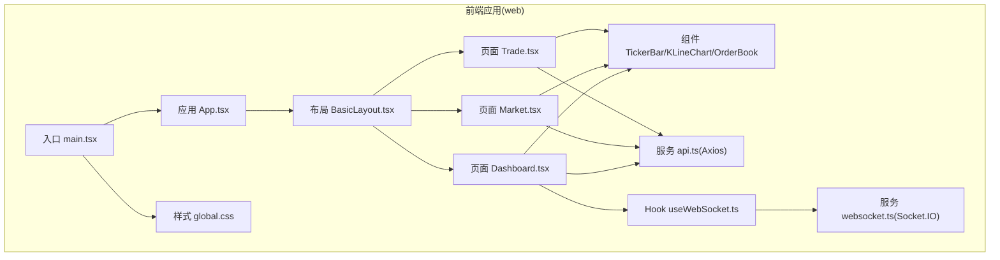
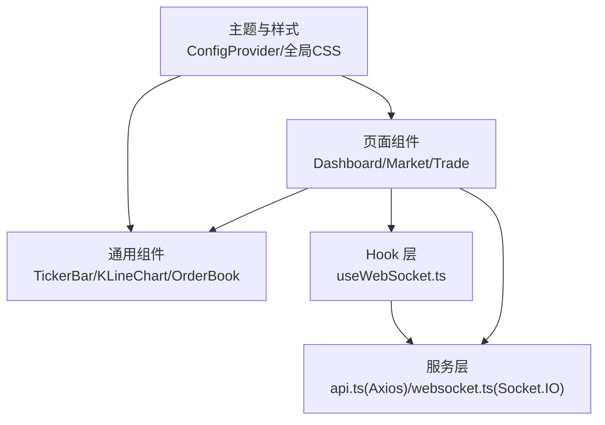
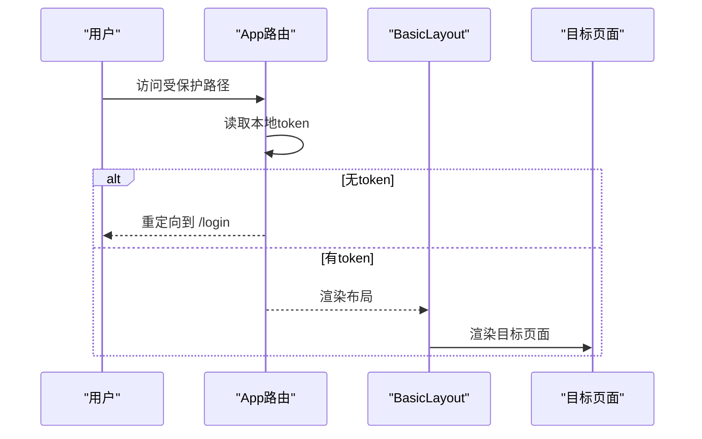
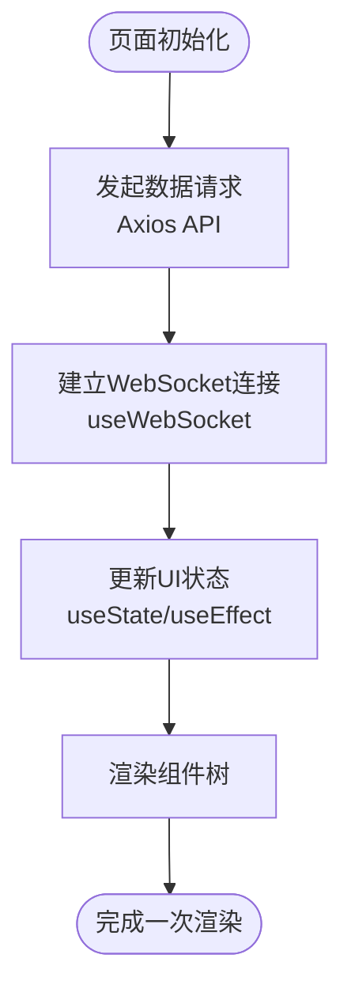
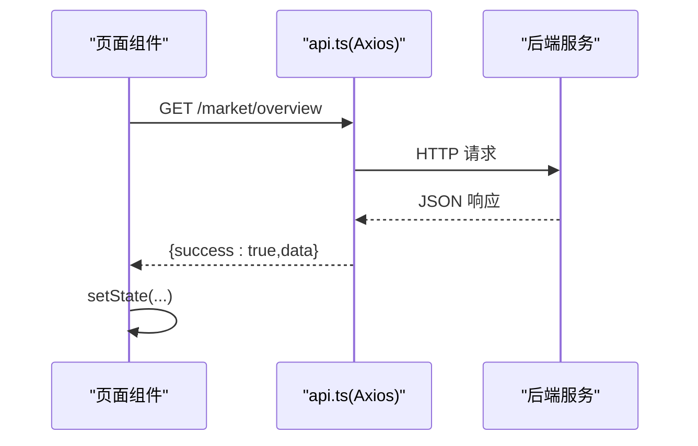
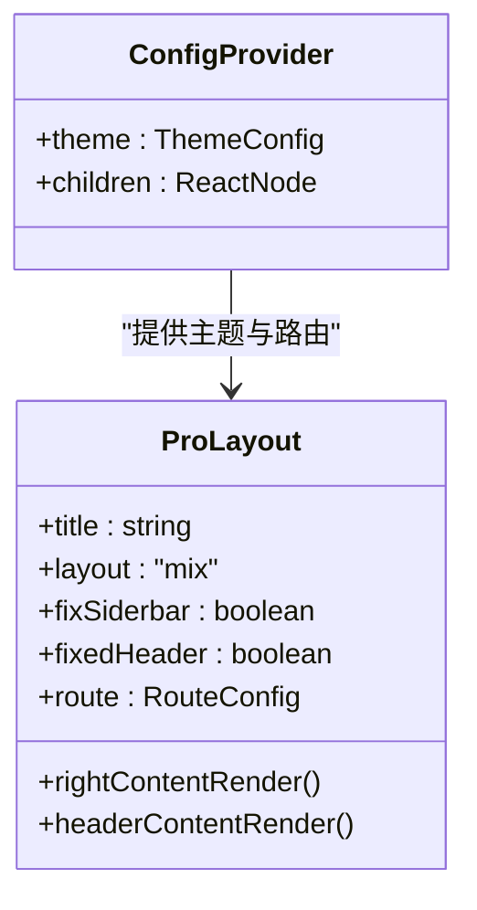
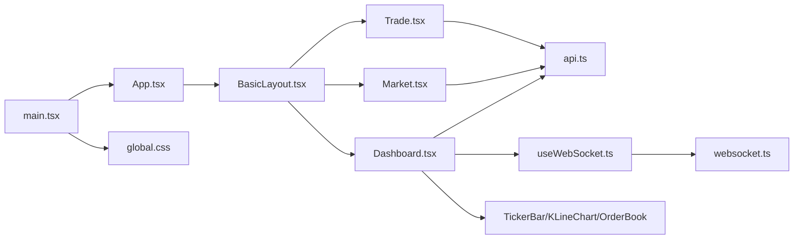

# 前端架构

<cite>
**本文引用的文件**
- [package.json](file://packages/web/package.json)
- [vite.config.ts](file://packages/web/vite.config.ts)
- [tsconfig.json](file://tsconfig.json)
- [main.tsx](file://packages/web/src/main.tsx)
- [App.tsx](file://packages/web/src/App.tsx)
- [BasicLayout.tsx](file://packages/web/src/layouts/BasicLayout.tsx)
- [Dashboard.tsx](file://packages/web/src/pages/Dashboard.tsx)
- [Market.tsx](file://packages/web/src/pages/Market.tsx)
- [Trade.tsx](file://packages/web/src/pages/Trade.tsx)
- [api.ts](file://packages/web/src/services/api.ts)
- [websocket.ts](file://packages/web/src/services/websocket.ts)
- [useWebSocket.ts](file://packages/web/src/hooks/useWebSocket.ts)
- [TickerBar/index.tsx](file://packages/web/src/components/TickerBar/index.tsx)
- [KLineChart/index.tsx](file://packages/web/src/components/KLineChart/index.tsx)
- [OrderBook/index.tsx](file://packages/web/src/components/OrderBook/index.tsx)
- [global.css](file://packages/web/src/styles/global.css)
</cite>

## 目录
1. [引言](#引言)
2. [项目结构](#项目结构)
3. [核心组件](#核心组件)
4. [架构总览](#架构总览)
5. [详细组件分析](#详细组件分析)
6. [依赖关系分析](#依赖关系分析)
7. [性能考量](#性能考量)
8. [故障排查指南](#故障排查指南)
9. [结论](#结论)
10. [附录](#附录)

## 引言
本文件面向 Jiaoyi 项目的前端团队与技术读者，系统化梳理基于 React 的前端架构，涵盖组件结构、状态管理与路由设计、Ant Design 组件库与 UI 设计系统、状态管理策略、数据获取与缓存机制、组件复用与样式体系、主题定制、构建与打包优化、性能调优、响应式与无障碍、跨浏览器兼容性以及前端开发规范与最佳实践。

## 项目结构
Jiaoyi 采用 monorepo 结构，前端位于 packages/web，使用 Vite 作为构建工具，TypeScript 提供类型保障，React 18 作为核心框架，Ant Design 5 与 @ant-design/pro-components 提供企业级 UI 能力，ECharts 用于可视化，Axios 与 Socket.IO 客户端分别负责 HTTP 与实时通信。

**图表来源**
- [main.tsx:1-80](file://packages/web/src/main.tsx#L1-L80)
- [App.tsx:1-58](file://packages/web/src/App.tsx#L1-L58)
- [BasicLayout.tsx:1-267](file://packages/web/src/layouts/BasicLayout.tsx#L1-L267)
- [Dashboard.tsx:1-573](file://packages/web/src/pages/Dashboard.tsx#L1-L573)
- [Market.tsx:1-537](file://packages/web/src/pages/Market.tsx#L1-L537)
- [Trade.tsx:1-984](file://packages/web/src/pages/Trade.tsx#L1-L984)
- [api.ts:1-311](file://packages/web/src/services/api.ts#L1-L311)
- [websocket.ts:1-188](file://packages/web/src/services/websocket.ts#L1-L188)
- [useWebSocket.ts:1-138](file://packages/web/src/hooks/useWebSocket.ts#L1-L138)
- [TickerBar/index.tsx:1-89](file://packages/web/src/components/TickerBar/index.tsx#L1-L89)
- [KLineChart/index.tsx:1-309](file://packages/web/src/components/KLineChart/index.tsx#L1-L309)
- [OrderBook/index.tsx:1-203](file://packages/web/src/components/OrderBook/index.tsx#L1-L203)
- [global.css:1-173](file://packages/web/src/styles/global.css#L1-L173)

**章节来源**
- [package.json:1-39](file://packages/web/package.json#L1-L39)
- [vite.config.ts:1-28](file://packages/web/vite.config.ts#L1-L28)
- [tsconfig.json:1-17](file://tsconfig.json#L1-L17)

## 核心组件
- 应用入口与主题配置：在入口中通过 ConfigProvider 注入暗色主题与品牌色值，并包裹 BrowserRouter 提供路由能力。
- 应用根路由：App.tsx 定义登录页与受保护的混合布局路由，使用私有路由守卫校验本地 token。
- 布局层：BasicLayout.tsx 使用 @ant-design/pro-components 的 ProLayout 构建混合布局，集成菜单、头部右侧信息区、用户下拉等，统一注入全局样式与主题 token。
- 页面层：
  - Dashboard：聚合市场总览、统计卡片、K线图、订单簿、活动流等，使用 ECharts 渲染，配合 WebSocket 实时推送。
  - Market：药品行情列表，支持筛选、分页、进度条与状态标签。
  - Trade：交易面板，包含药品信息、深度图、下单表单与持仓列表。
- 通用组件：TickerBar（滚动行情）、KLineChart（K线与日销量复合图）、OrderBook（垫资深度柱状图）。
- 服务层：api.ts 封装 Axios 实例与拦截器；websocket.ts 封装 Socket.IO 客户端；useWebSocket.ts 提供 Hook 化订阅与事件回调。
- 样式层：global.css 定义 CSS 变量与暗色主题基础样式，覆盖 Ant Design 组件默认样式。

**章节来源**
- [main.tsx:1-80](file://packages/web/src/main.tsx#L1-L80)
- [App.tsx:1-58](file://packages/web/src/App.tsx#L1-L58)
- [BasicLayout.tsx:1-267](file://packages/web/src/layouts/BasicLayout.tsx#L1-L267)
- [Dashboard.tsx:1-573](file://packages/web/src/pages/Dashboard.tsx#L1-L573)
- [Market.tsx:1-537](file://packages/web/src/pages/Market.tsx#L1-L537)
- [Trade.tsx:1-984](file://packages/web/src/pages/Trade.tsx#L1-L984)
- [api.ts:1-311](file://packages/web/src/services/api.ts#L1-L311)
- [websocket.ts:1-188](file://packages/web/src/services/websocket.ts#L1-L188)
- [useWebSocket.ts:1-138](file://packages/web/src/hooks/useWebSocket.ts#L1-L138)
- [TickerBar/index.tsx:1-89](file://packages/web/src/components/TickerBar/index.tsx#L1-L89)
- [KLineChart/index.tsx:1-309](file://packages/web/src/components/KLineChart/index.tsx#L1-L309)
- [OrderBook/index.tsx:1-203](file://packages/web/src/components/OrderBook/index.tsx#L1-L203)
- [global.css:1-173](file://packages/web/src/styles/global.css#L1-L173)

## 架构总览
前端采用“页面-组件-服务-Hook”的分层架构，页面负责业务编排与状态聚合，组件负责 UI 与交互，服务负责网络与实时通信，Hook 抽象跨页面可复用逻辑。

**图表来源**
- [Dashboard.tsx:1-573](file://packages/web/src/pages/Dashboard.tsx#L1-L573)
- [Market.tsx:1-537](file://packages/web/src/pages/Market.tsx#L1-L537)
- [Trade.tsx:1-984](file://packages/web/src/pages/Trade.tsx#L1-L984)
- [TickerBar/index.tsx:1-89](file://packages/web/src/components/TickerBar/index.tsx#L1-L89)
- [KLineChart/index.tsx:1-309](file://packages/web/src/components/KLineChart/index.tsx#L1-L309)
- [OrderBook/index.tsx:1-203](file://packages/web/src/components/OrderBook/index.tsx#L1-L203)
- [api.ts:1-311](file://packages/web/src/services/api.ts#L1-L311)
- [websocket.ts:1-188](file://packages/web/src/services/websocket.ts#L1-L188)
- [useWebSocket.ts:1-138](file://packages/web/src/hooks/useWebSocket.ts#L1-L138)
- [main.tsx:1-80](file://packages/web/src/main.tsx#L1-L80)
- [global.css:1-173](file://packages/web/src/styles/global.css#L1-L173)

## 详细组件分析

### 路由与权限控制
- 登录页与受保护路由：App.tsx 定义 /login 与带 BasicLayout 的受保护路由组；私有路由守卫通过本地存储 token 决定是否放行。
- 布局菜单：BasicLayout.tsx 定义菜单项与图标，点击导航至对应页面；右上角展示余额与用户信息，支持退出登录。

**图表来源**
- [App.tsx:1-58](file://packages/web/src/App.tsx#L1-L58)
- [BasicLayout.tsx:1-267](file://packages/web/src/layouts/BasicLayout.tsx#L1-L267)

**章节来源**
- [App.tsx:1-58](file://packages/web/src/App.tsx#L1-L58)
- [BasicLayout.tsx:1-267](file://packages/web/src/layouts/BasicLayout.tsx#L1-L267)

### 状态管理策略
- 页面内局部状态：各页面通过 useState/useEffect 管理自身状态与副作用，如 Dashboard 的市场总览、统计、K线、深度与活动列表；Market 的筛选与分页；Trade 的药品信息、排队与持仓。
- 组件内局部状态：通用组件内部通过 useState 控制动画、滚动暂停、图表实例等。
- Hook 抽象：useWebSocket 将连接、订阅、事件回调抽象为可复用 Hook，减少页面重复代码。
- 服务层集中：api.ts 统一封装 Axios 请求与响应拦截，统一处理鉴权与错误。

**图表来源**
- [Dashboard.tsx:1-573](file://packages/web/src/pages/Dashboard.tsx#L1-L573)
- [Market.tsx:1-537](file://packages/web/src/pages/Market.tsx#L1-L537)
- [Trade.tsx:1-984](file://packages/web/src/pages/Trade.tsx#L1-L984)
- [useWebSocket.ts:1-138](file://packages/web/src/hooks/useWebSocket.ts#L1-L138)
- [api.ts:1-311](file://packages/web/src/services/api.ts#L1-L311)

**章节来源**
- [Dashboard.tsx:1-573](file://packages/web/src/pages/Dashboard.tsx#L1-L573)
- [Market.tsx:1-537](file://packages/web/src/pages/Market.tsx#L1-L537)
- [Trade.tsx:1-984](file://packages/web/src/pages/Trade.tsx#L1-L984)
- [useWebSocket.ts:1-138](file://packages/web/src/hooks/useWebSocket.ts#L1-L138)
- [api.ts:1-311](file://packages/web/src/services/api.ts#L1-L311)

### 数据获取与缓存机制
- HTTP 请求：api.ts 基于 Axios 创建实例，设置 baseURL=/api，统一添加 Authorization 头；响应拦截器对 401 做临时处理（清理 token 并跳转登录）。
- WebSocket：websocket.ts 封装 Socket.IO 客户端，自动重连、事件转发；useWebSocket.ts 对外暴露 connect/subscribe/unsubscribe 等方法与事件回调。
- 页面缓存策略：当前页面未见集中式缓存（如 Redux/Zustand），主要依赖浏览器缓存与组件内部状态；建议在高频数据场景引入轻量缓存或查询缓存库以降低重复请求。

**图表来源**
- [api.ts:1-311](file://packages/web/src/services/api.ts#L1-L311)
- [Dashboard.tsx:1-573](file://packages/web/src/pages/Dashboard.tsx#L1-L573)
- [Market.tsx:1-537](file://packages/web/src/pages/Market.tsx#L1-L537)

**章节来源**
- [api.ts:1-311](file://packages/web/src/services/api.ts#L1-L311)
- [Dashboard.tsx:1-573](file://packages/web/src/pages/Dashboard.tsx#L1-L573)
- [Market.tsx:1-537](file://packages/web/src/pages/Market.tsx#L1-L537)
- [Trade.tsx:1-984](file://packages/web/src/pages/Trade.tsx#L1-L984)

### Ant Design 组件库与 UI 设计系统
- 主题定制：ConfigProvider 提供算法与 token，覆盖 Layout/Menu/Card/Table/Input/Select/Button/Modal/Drawer 等组件的主题变量，形成统一暗色交易风格。
- ProLayout：提供混合布局、固定侧边栏与头部、菜单路由映射、右侧用户信息与余额展示。
- 组件使用：页面广泛使用 Card/Table/Select/Progress/Tag/Button 等，结合自定义样式覆盖与 CSS 变量，确保视觉一致性。

**图表来源**
- [main.tsx:1-80](file://packages/web/src/main.tsx#L1-L80)
- [BasicLayout.tsx:1-267](file://packages/web/src/layouts/BasicLayout.tsx#L1-L267)

**章节来源**
- [main.tsx:1-80](file://packages/web/src/main.tsx#L1-L80)
- [BasicLayout.tsx:1-267](file://packages/web/src/layouts/BasicLayout.tsx#L1-L267)
- [global.css:1-173](file://packages/web/src/styles/global.css#L1-L173)

### 组件复用模式与样式管理
- 复用模式：
  - 通用组件：TickerBar/KLineChart/OrderBook 以 props 驱动，支持 loading、回调与主题切换。
  - Hook 复用：useWebSocket 将连接、订阅、事件回调抽象为 Hook，Dashboard/Market/Trade 可按需订阅。
  - 服务复用：api.ts 与 websocket.ts 在多页面共享。
- 样式管理：
  - 全局 CSS 变量：定义主色、边框、文字、功能色与等宽字体族。
  - Ant Design 样式覆盖：针对表格、菜单、输入框等进行深色适配。
  - 组件内样式：通过内联样式与 className 控制布局与动画。

**章节来源**
- [TickerBar/index.tsx:1-89](file://packages/web/src/components/TickerBar/index.tsx#L1-L89)
- [KLineChart/index.tsx:1-309](file://packages/web/src/components/KLineChart/index.tsx#L1-L309)
- [OrderBook/index.tsx:1-203](file://packages/web/src/components/OrderBook/index.tsx#L1-L203)
- [useWebSocket.ts:1-138](file://packages/web/src/hooks/useWebSocket.ts#L1-L138)
- [api.ts:1-311](file://packages/web/src/services/api.ts#L1-L311)
- [global.css:1-173](file://packages/web/src/styles/global.css#L1-L173)

### 主题定制与暗色系统
- 主题变量：入口 ConfigProvider 使用暗色算法与 token，覆盖组件 token 与页面容器 token，保证整体风格一致。
- 暗色适配：全局 CSS 定义暗色背景、边框与文字色，Antd 组件覆盖深色系样式，确保高对比度与可读性。

**章节来源**
- [main.tsx:1-80](file://packages/web/src/main.tsx#L1-L80)
- [global.css:1-173](file://packages/web/src/styles/global.css#L1-L173)

### 前端构建流程与打包优化
- 构建工具：Vite 提供快速冷启动与热更新；插件 @vitejs/plugin-react 支持 React Refresh。
- 路径别名：vite.config.ts 配置 @/@components/@pages/@services/@hooks/@utils/@types 等别名，提升开发体验。
- 代理配置：开发服务器代理 /api 到后端服务，便于前后端联调。
- TypeScript：tsconfig.json 启用严格模式与源码映射，便于调试与类型检查。

**章节来源**
- [vite.config.ts:1-28](file://packages/web/vite.config.ts#L1-L28)
- [package.json:1-39](file://packages/web/package.json#L1-L39)
- [tsconfig.json:1-17](file://tsconfig.json#L1-L17)

### 性能调优与优化建议
- 图表性能：ECharts 图表在组件卸载时释放实例，避免内存泄漏；建议在大数据集场景启用 dataZoom 与按需渲染。
- 网络优化：Axios 统一超时与拦截器，建议增加请求去重与缓存策略；WebSocket 自动重连参数可按环境调整。
- 渲染优化：页面内大量 setState 时可考虑拆分组件、使用 useMemo/useCallback；长列表使用虚拟化方案。
- 构建优化：开启产物压缩与资源分包；按需引入 Antd 组件与图标；合理拆分第三方库。

[本节为通用指导，无需特定文件引用]

## 依赖关系分析

**图表来源**
- [main.tsx:1-80](file://packages/web/src/main.tsx#L1-L80)
- [App.tsx:1-58](file://packages/web/src/App.tsx#L1-L58)
- [BasicLayout.tsx:1-267](file://packages/web/src/layouts/BasicLayout.tsx#L1-L267)
- [Dashboard.tsx:1-573](file://packages/web/src/pages/Dashboard.tsx#L1-L573)
- [Market.tsx:1-537](file://packages/web/src/pages/Market.tsx#L1-L537)
- [Trade.tsx:1-984](file://packages/web/src/pages/Trade.tsx#L1-L984)
- [api.ts:1-311](file://packages/web/src/services/api.ts#L1-L311)
- [useWebSocket.ts:1-138](file://packages/web/src/hooks/useWebSocket.ts#L1-L138)
- [websocket.ts:1-188](file://packages/web/src/services/websocket.ts#L1-L188)
- [TickerBar/index.tsx:1-89](file://packages/web/src/components/TickerBar/index.tsx#L1-L89)
- [KLineChart/index.tsx:1-309](file://packages/web/src/components/KLineChart/index.tsx#L1-L309)
- [OrderBook/index.tsx:1-203](file://packages/web/src/components/OrderBook/index.tsx#L1-L203)
- [global.css:1-173](file://packages/web/src/styles/global.css#L1-L173)

**章节来源**
- [main.tsx:1-80](file://packages/web/src/main.tsx#L1-L80)
- [App.tsx:1-58](file://packages/web/src/App.tsx#L1-L58)
- [BasicLayout.tsx:1-267](file://packages/web/src/layouts/BasicLayout.tsx#L1-L267)
- [Dashboard.tsx:1-573](file://packages/web/src/pages/Dashboard.tsx#L1-L573)
- [Market.tsx:1-537](file://packages/web/src/pages/Market.tsx#L1-L537)
- [Trade.tsx:1-984](file://packages/web/src/pages/Trade.tsx#L1-L984)
- [api.ts:1-311](file://packages/web/src/services/api.ts#L1-L311)
- [useWebSocket.ts:1-138](file://packages/web/src/hooks/useWebSocket.ts#L1-L138)
- [websocket.ts:1-188](file://packages/web/src/services/websocket.ts#L1-L188)
- [TickerBar/index.tsx:1-89](file://packages/web/src/components/TickerBar/index.tsx#L1-L89)
- [KLineChart/index.tsx:1-309](file://packages/web/src/components/KLineChart/index.tsx#L1-L309)
- [OrderBook/index.tsx:1-203](file://packages/web/src/components/OrderBook/index.tsx#L1-L203)
- [global.css:1-173](file://packages/web/src/styles/global.css#L1-L173)

## 性能考量
- 图表渲染：K线图与订单簿使用 ECharts，建议在大数据场景启用 dataZoom、滑动缩放与按需渲染，避免一次性渲染过多数据点。
- 网络请求：Axios 统一超时与拦截器，建议引入请求去重与缓存策略；WebSocket 自动重连次数与延迟可按环境调整。
- 渲染优化：页面内大量状态更新时，拆分组件、使用 useMemo/useCallback；长列表使用虚拟化方案。
- 构建优化：开启产物压缩与资源分包；按需引入 Antd 组件与图标；合理拆分第三方库。

[本节为通用指导，无需特定文件引用]

## 故障排查指南
- 登录态失效：响应拦截器对 401 做临时处理（清理 token 并跳转登录）。建议完善 Token 刷新逻辑并在拦截器中统一处理。
- WebSocket 连接异常：websocket.ts 提供自动重连与最大重试次数；若连接频繁断开，检查服务端 ws 地址与网络策略。
- 数据不更新：Dashboard 通过 useWebSocket 订阅 market:ticker 与 funding/settlement 事件；确认订阅是否生效与事件名是否匹配。
- 样式冲突：全局 CSS 与 Antd 覆盖已做深色适配；若出现样式异常，检查覆盖优先级与组件 token 设置。

**章节来源**
- [api.ts:1-311](file://packages/web/src/services/api.ts#L1-L311)
- [websocket.ts:1-188](file://packages/web/src/services/websocket.ts#L1-L188)
- [useWebSocket.ts:1-138](file://packages/web/src/hooks/useWebSocket.ts#L1-L138)
- [Dashboard.tsx:1-573](file://packages/web/src/pages/Dashboard.tsx#L1-L573)

## 结论
Jiaoyi 前端以 React + Ant Design 为核心，结合 ECharts 与 Socket.IO，构建了具备实时行情与交易能力的暗色主题界面。通过清晰的页面-组件-服务-Hook 分层与主题定制，实现了良好的可维护性与一致性。后续可在状态管理、缓存策略、构建优化与性能监控方面进一步完善，以支撑更复杂的业务场景。

## 附录

### 响应式设计与无障碍
- 响应式：页面广泛使用 Antd 的栅格系统与响应式断点，组件在不同屏幕尺寸下保持良好布局。
- 无障碍：建议为关键交互元素补充 aria-label 与键盘导航支持，确保屏幕阅读器友好。

[本节为通用指导，无需特定文件引用]

### 跨浏览器兼容性
- 浏览器要求：脚本与配置要求 Node >= 18、pnpm >= 8；现代浏览器原生支持良好。
- Polyfill：如需兼容旧版浏览器，建议引入必要 polyfill 并在构建阶段进行目标降级。

[本节为通用指导，无需特定文件引用]

### 开发规范与最佳实践
- 目录规范：按页面/组件/服务/Hook/样式组织，使用路径别名提升可读性。
- 类型安全：使用 TypeScript 明确接口与返回值，减少运行时错误。
- 组件设计：单一职责、可复用、可测试；组件 props 与事件回调清晰命名。
- 状态管理：优先使用 React 内部状态；复杂跨页面逻辑使用 Hook 抽象。
- 样式规范：优先使用 CSS 变量与 Antd token；避免内联样式的过度使用。
- 构建与质量：启用 ESLint 与类型检查；提交前执行 lint 与 typecheck。

[本节为通用指导，无需特定文件引用]