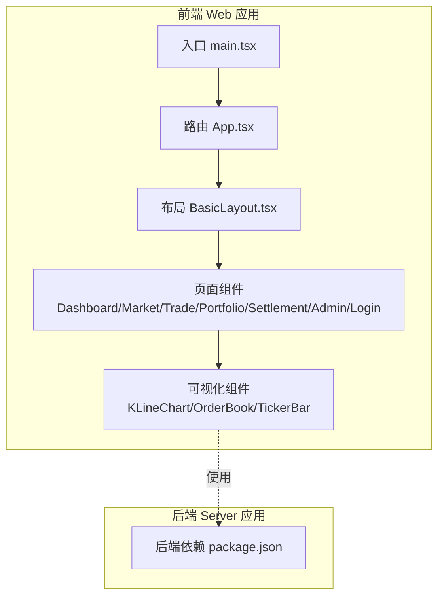
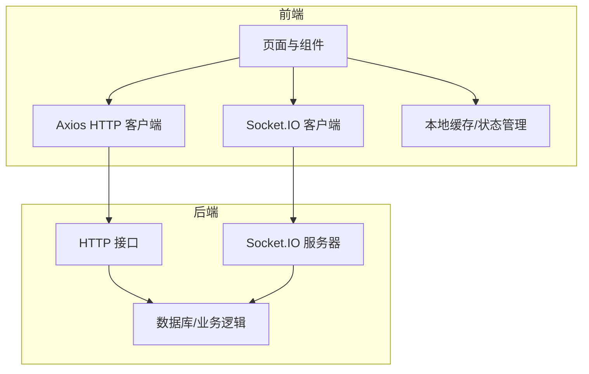
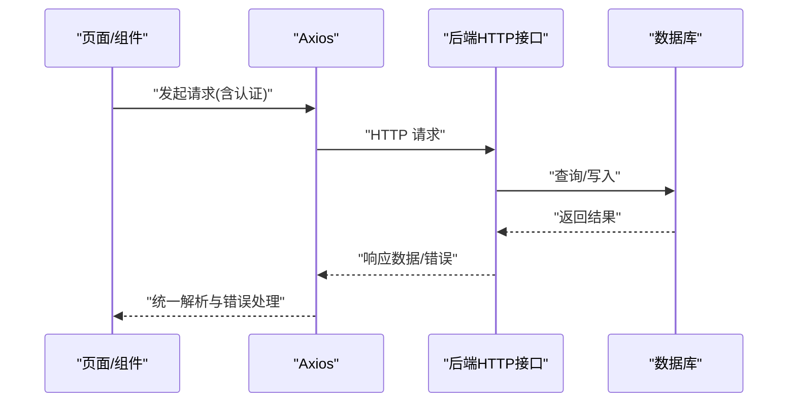
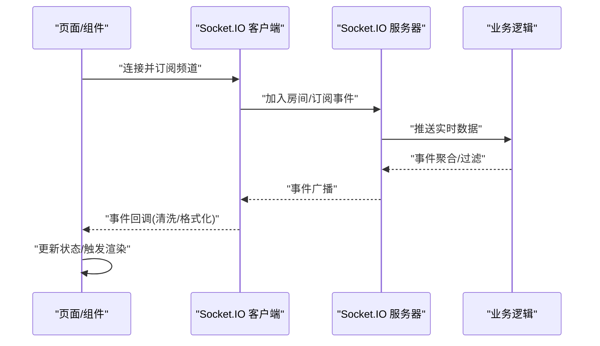
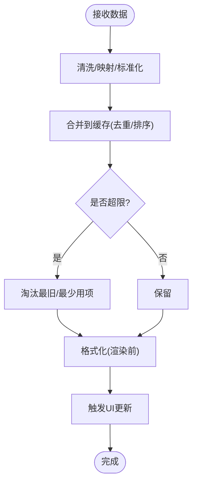
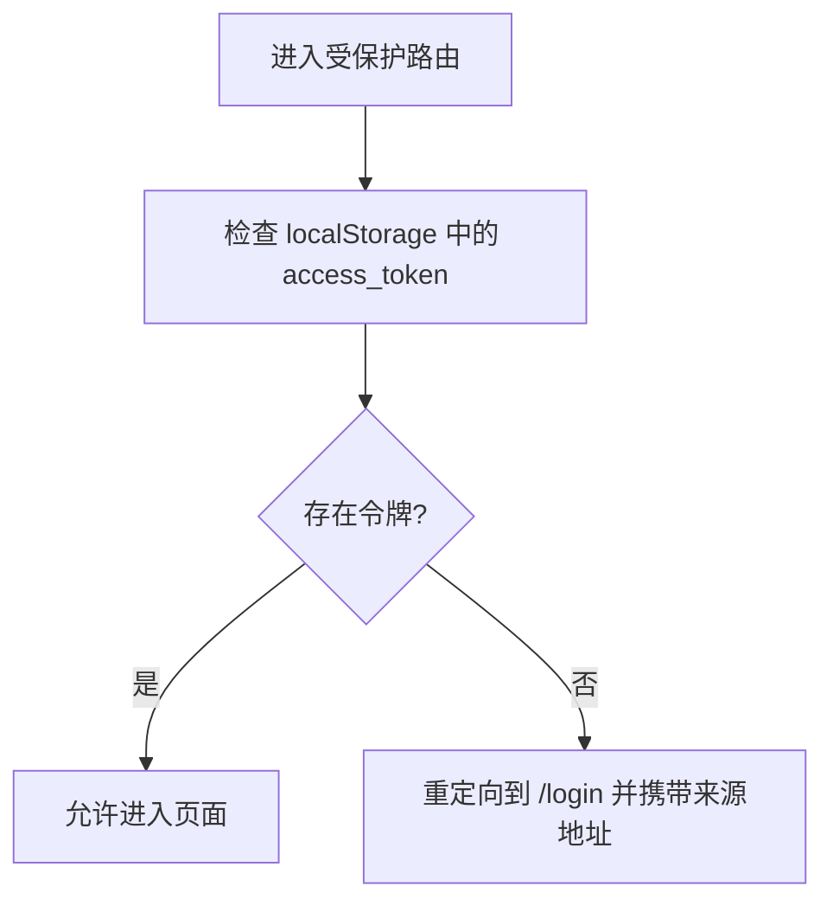
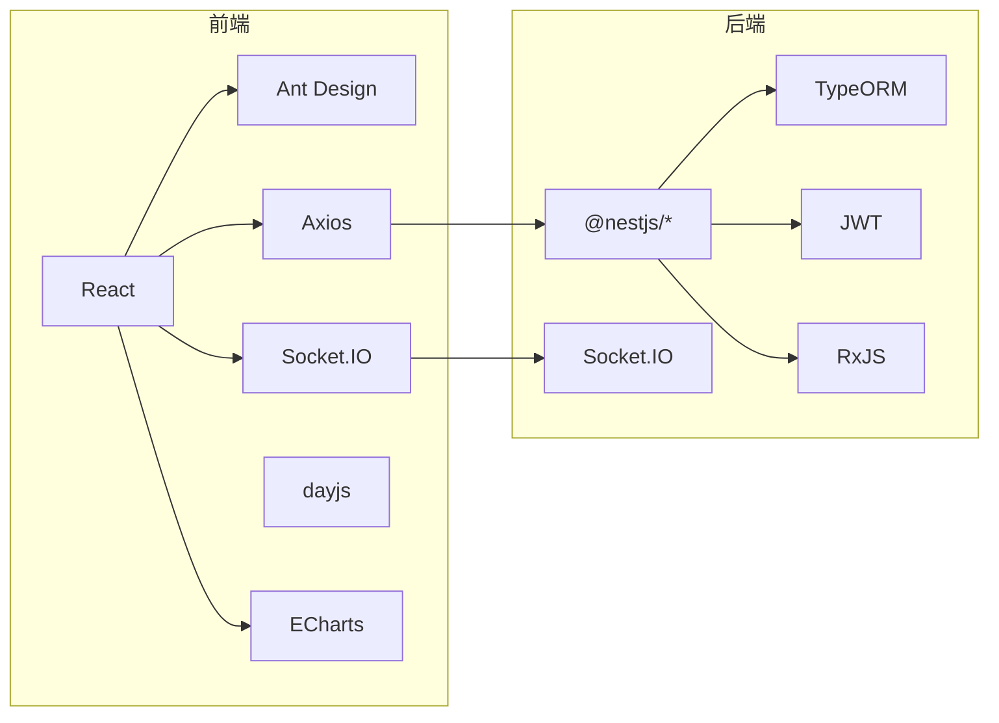

# 数据流

<cite>
**本文引用的文件**
- [packages/web/package.json](file://packages/web/package.json)
- [packages/server/package.json](file://packages/server/package.json)
- [packages/web/src/main.tsx](file://packages/web/src/main.tsx)
- [packages/web/src/App.tsx](file://packages/web/src/App.tsx)
- [packages/web/src/components/KLineChart/index.tsx](file://packages/web/src/components/KLineChart/index.tsx)
- [packages/web/src/components/OrderBook/index.tsx](file://packages/web/src/components/OrderBook/index.tsx)
- [packages/web/src/components/TickerBar/index.tsx](file://packages/web/src/components/TickerBar/index.tsx)
- [packages/web/src/pages/Market.tsx](file://packages/web/src/pages/Market.tsx)
- [packages/web/src/pages/Trade.tsx](file://packages/web/src/pages/Trade.tsx)
- [packages/web/src/pages/Dashboard.tsx](file://packages/web/src/pages/Dashboard.tsx)
- [packages/web/src/pages/Portfolio.tsx](file://packages/web/src/pages/Portfolio.tsx)
- [packages/web/src/pages/Settlement.tsx](file://packages/web/src/pages/Settlement.tsx)
- [packages/web/src/pages/Admin.tsx](file://packages/web/src/pages/Admin.tsx)
- [packages/web/src/pages/Login.tsx](file://packages/web/src/pages/Login.tsx)
- [packages/web/src/layouts/BasicLayout.tsx](file://packages/web/src/layouts/BasicLayout.tsx)
</cite>

## 目录
1. [简介](#简介)
2. [项目结构](#项目结构)
3. [核心组件](#核心组件)
4. [架构总览](#架构总览)
5. [详细组件分析](#详细组件分析)
6. [依赖分析](#依赖分析)
7. [性能考虑](#性能考虑)
8. [故障排查指南](#故障排查指南)
9. [结论](#结论)
10. [附录](#附录)

## 简介
本文件面向Jiaoyi项目，系统性梳理前端数据流设计与实现，覆盖以下主题：
- 前端数据获取与处理：RESTful API调用、WebSocket实时数据订阅、本地数据缓存
- 统一请求处理、错误处理与重试机制
- 数据转换、格式化与状态更新
- 性能优化、缓存策略与内存管理
- 安全、防抖节流与并发控制
- 数据流设计模式与API集成最佳实践

本项目采用前后端分离架构：前端基于React + Ant Design，后端基于NestJS，使用Socket.IO进行实时数据推送，Axios作为HTTP客户端。

## 项目结构
Jiaoyi仓库采用monorepo组织，包含前端Web应用与后端Server两个包。前端通过Vite构建，依赖React、Ant Design、Axios与Socket.IO；后端基于NestJS，集成Socket.IO、TypeORM、JWT等能力。

图表来源
- [packages/web/src/main.tsx:1-80](file://packages/web/src/main.tsx#L1-L80)
- [packages/web/src/App.tsx:1-58](file://packages/web/src/App.tsx#L1-L58)
- [packages/web/src/layouts/BasicLayout.tsx](file://packages/web/src/layouts/BasicLayout.tsx)
- [packages/web/src/pages/Dashboard.tsx](file://packages/web/src/pages/Dashboard.tsx)
- [packages/web/src/pages/Market.tsx](file://packages/web/src/pages/Market.tsx)
- [packages/web/src/pages/Trade.tsx](file://packages/web/src/pages/Trade.tsx)
- [packages/web/src/pages/Portfolio.tsx](file://packages/web/src/pages/Portfolio.tsx)
- [packages/web/src/pages/Settlement.tsx](file://packages/web/src/pages/Settlement.tsx)
- [packages/web/src/pages/Admin.tsx](file://packages/web/src/pages/Admin.tsx)
- [packages/web/src/pages/Login.tsx](file://packages/web/src/pages/Login.tsx)
- [packages/web/src/components/KLineChart/index.tsx](file://packages/web/src/components/KLineChart/index.tsx)
- [packages/web/src/components/OrderBook/index.tsx](file://packages/web/src/components/OrderBook/index.tsx)
- [packages/web/src/components/TickerBar/index.tsx](file://packages/web/src/components/TickerBar/index.tsx)
- [packages/server/package.json:1-94](file://packages/server/package.json#L1-L94)

章节来源
- [packages/web/src/main.tsx:1-80](file://packages/web/src/main.tsx#L1-L80)
- [packages/web/src/App.tsx:1-58](file://packages/web/src/App.tsx#L1-L58)
- [packages/web/package.json:1-40](file://packages/web/package.json#L1-L40)
- [packages/server/package.json:1-94](file://packages/server/package.json#L1-L94)

## 核心组件
- 入口与主题配置：在入口文件中初始化Ant Design主题与路由容器，确保全局样式与路由环境就绪。
- 路由与鉴权：App组件定义路由表，并通过私有路由守卫结合localStorage中的访问令牌进行登录态校验。
- 页面与布局：BasicLayout承载导航与内容区域；各业务页面（Dashboard、Market、Trade、Portfolio、Settlement、Admin、Login）按需渲染。
- 可视化组件：K线图、深度图、行情条等组件负责接收实时/历史数据并进行渲染。

章节来源
- [packages/web/src/main.tsx:1-80](file://packages/web/src/main.tsx#L1-L80)
- [packages/web/src/App.tsx:1-58](file://packages/web/src/App.tsx#L1-L58)
- [packages/web/src/layouts/BasicLayout.tsx](file://packages/web/src/layouts/BasicLayout.tsx)
- [packages/web/src/pages/Dashboard.tsx](file://packages/web/src/pages/Dashboard.tsx)
- [packages/web/src/pages/Market.tsx](file://packages/web/src/pages/Market.tsx)
- [packages/web/src/pages/Trade.tsx](file://packages/web/src/pages/Trade.tsx)
- [packages/web/src/pages/Portfolio.tsx](file://packages/web/src/pages/Portfolio.tsx)
- [packages/web/src/pages/Settlement.tsx](file://packages/web/src/pages/Settlement.tsx)
- [packages/web/src/pages/Admin.tsx](file://packages/web/src/pages/Admin.tsx)
- [packages/web/src/pages/Login.tsx](file://packages/web/src/pages/Login.tsx)
- [packages/web/src/components/KLineChart/index.tsx](file://packages/web/src/components/KLineChart/index.tsx)
- [packages/web/src/components/OrderBook/index.tsx](file://packages/web/src/components/OrderBook/index.tsx)
- [packages/web/src/components/TickerBar/index.tsx](file://packages/web/src/components/TickerBar/index.tsx)

## 架构总览
前端通过Axios发起REST请求，通过Socket.IO订阅实时行情与交易数据；页面与组件根据数据状态更新UI。后端提供HTTP接口与Socket.IO事件通道，配合数据库与业务逻辑层提供数据支撑。

图表来源
- [packages/web/package.json:13-26](file://packages/web/package.json#L13-L26)
- [packages/server/package.json:26-53](file://packages/server/package.json#L26-L53)
- [packages/web/src/components/KLineChart/index.tsx](file://packages/web/src/components/KLineChart/index.tsx)
- [packages/web/src/components/OrderBook/index.tsx](file://packages/web/src/components/OrderBook/index.tsx)
- [packages/web/src/components/TickerBar/index.tsx](file://packages/web/src/components/TickerBar/index.tsx)

## 详细组件分析

### RESTful API 调用与统一处理
- 请求发起：前端页面或组件通过Axios向后端HTTP接口发送请求，获取市场快照、订单簿、账户信息、交易记录等数据。
- 统一处理：建议在页面或组件内封装请求函数，集中处理请求头（如携带JWT）、参数序列化、响应解构与错误拦截。
- 错误处理：对网络异常、HTTP状态码异常、业务错误进行分类处理；可结合全局提示组件反馈用户。
- 重试机制：对幂等GET类请求或瞬时性错误可引入指数退避重试；对非幂等写操作谨慎重试，必要时结合业务ID去重。

图表来源
- [packages/web/package.json](file://packages/web/package.json#L17)
- [packages/server/package.json:26-53](file://packages/server/package.json#L26-L53)

章节来源
- [packages/web/package.json:13-26](file://packages/web/package.json#L13-L26)
- [packages/server/package.json:26-53](file://packages/server/package.json#L26-L53)

### WebSocket 实时数据订阅
- 订阅建立：页面或组件在挂载时通过Socket.IO连接后端，订阅指定频道（如市场快照、逐笔成交、订单簿增量）。
- 数据接收：收到实时事件后，进行数据清洗与格式化，合并到本地缓存或直接驱动组件渲染。
- 断线重连：实现自动重连与回放策略，避免丢失关键增量数据；对离线期间的多条消息进行有序重放。
- 并发控制：同一频道的订阅应避免重复连接；对高频事件进行节流/去抖，降低渲染压力。

图表来源
- [packages/web/package.json](file://packages/web/package.json#L25)
- [packages/server/package.json:33-36](file://packages/server/package.json#L33-L36)
- [packages/web/src/components/KLineChart/index.tsx](file://packages/web/src/components/KLineChart/index.tsx)
- [packages/web/src/components/OrderBook/index.tsx](file://packages/web/src/components/OrderBook/index.tsx)
- [packages/web/src/components/TickerBar/index.tsx](file://packages/web/src/components/TickerBar/index.tsx)

章节来源
- [packages/web/package.json](file://packages/web/package.json#L25)
- [packages/server/package.json:33-36](file://packages/server/package.json#L33-L36)

### 本地数据缓存与状态更新
- 缓存策略：对高频读取的历史数据与静态配置采用内存缓存；对实时数据采用“滑动窗口”或“最近N条”策略，限制内存占用。
- 状态管理：页面级状态用于UI交互；组件级状态用于局部渲染；对跨组件共享的实时数据可采用上下文或集中式状态库。
- 数据转换与格式化：在进入缓存前完成字段映射、单位换算、时间戳标准化；渲染前进行轻量格式化。
- 内存管理：及时清理过期缓存、取消未完成的请求与订阅；在组件卸载时释放资源。

图表来源
- [packages/web/src/components/KLineChart/index.tsx](file://packages/web/src/components/KLineChart/index.tsx)
- [packages/web/src/components/OrderBook/index.tsx](file://packages/web/src/components/OrderBook/index.tsx)
- [packages/web/src/components/TickerBar/index.tsx](file://packages/web/src/components/TickerBar/index.tsx)

章节来源
- [packages/web/src/components/KLineChart/index.tsx](file://packages/web/src/components/KLineChart/index.tsx)
- [packages/web/src/components/OrderBook/index.tsx](file://packages/web/src/components/OrderBook/index.tsx)
- [packages/web/src/components/TickerBar/index.tsx](file://packages/web/src/components/TickerBar/index.tsx)

### 鉴权与路由守卫
- 登录态校验：在App的私有路由守卫中读取localStorage中的访问令牌，决定是否允许进入受保护页面。
- 动态路由：根据登录状态动态跳转至登录页或主页面；支持带来源地址的重定向。

图表来源
- [packages/web/src/App.tsx:13-31](file://packages/web/src/App.tsx#L13-L31)

章节来源
- [packages/web/src/App.tsx:13-31](file://packages/web/src/App.tsx#L13-L31)

### 页面与组件职责
- Dashboard：展示概览指标与快捷入口，可能拉取账户与市场摘要数据。
- Market：展示市场列表与行情快照，订阅实时行情与深度数据。
- Trade：单个标的交易界面，加载历史K线、订单簿与委托薄，支持下单。
- Portfolio：持仓与账户资产统计，订阅资金流水与盈亏变化。
- Settlement：结算相关数据与状态。
- Admin：后台管理功能。
- Login：登录页，提交凭证换取令牌并持久化。

章节来源
- [packages/web/src/pages/Dashboard.tsx](file://packages/web/src/pages/Dashboard.tsx)
- [packages/web/src/pages/Market.tsx](file://packages/web/src/pages/Market.tsx)
- [packages/web/src/pages/Trade.tsx](file://packages/web/src/pages/Trade.tsx)
- [packages/web/src/pages/Portfolio.tsx](file://packages/web/src/pages/Portfolio.tsx)
- [packages/web/src/pages/Settlement.tsx](file://packages/web/src/pages/Settlement.tsx)
- [packages/web/src/pages/Admin.tsx](file://packages/web/src/pages/Admin.tsx)
- [packages/web/src/pages/Login.tsx](file://packages/web/src/pages/Login.tsx)

## 依赖分析
- 前端依赖：React、Ant Design、Axios、Socket.IO、dayjs、echarts等，满足UI、网络、实时与可视化需求。
- 后端依赖：NestJS、Socket.IO、TypeORM、JWT、RxJS等，提供HTTP服务、实时通信与数据持久化能力。

图表来源
- [packages/web/package.json:13-26](file://packages/web/package.json#L13-L26)
- [packages/server/package.json:26-53](file://packages/server/package.json#L26-L53)

章节来源
- [packages/web/package.json:13-26](file://packages/web/package.json#L13-L26)
- [packages/server/package.json:26-53](file://packages/server/package.json#L26-L53)

## 性能考虑
- 请求优化
  - 批量请求：对多个小请求进行合并，减少握手开销。
  - 条件请求：使用ETag/If-None-Match或Last-Modified避免重复传输。
  - 分页与分片：大数据集采用分页或分片加载，避免一次性渲染过多DOM。
- 实时数据优化
  - 事件节流：对高频事件（如逐笔成交）进行节流，降低渲染频率。
  - 增量更新：仅推送变化部分，前端做局部合并，减少全量重绘。
  - 滑动窗口：限制缓存大小，定期清理过期数据。
- 渲染优化
  - 虚拟滚动：长列表采用虚拟化方案。
  - 组件拆分：细粒度组件，按需渲染与记忆化。
- 缓存策略
  - LRU/LFU：热点数据优先保留。
  - 多级缓存：内存缓存 + IndexedDB/LocalStorage，提升离线可用性。
- 内存管理
  - 及时清理：定时器、订阅、事件监听器在组件卸载时释放。
  - 弱引用：对不关键的中间对象使用弱引用，便于GC回收。

## 故障排查指南
- 网络请求失败
  - 检查请求URL、认证头与CORS配置；确认后端接口可达。
  - 对4xx/5xx错误进行分类处理，区分业务错误与系统错误。
- 实时订阅异常
  - 核对频道名称与权限；确认Socket.IO连接状态与重连日志。
  - 对断线重连进行日志记录，定位延迟与丢包原因。
- 数据错乱或渲染异常
  - 校验数据清洗与格式化逻辑；确保时间戳与排序一致性。
  - 对并发写入进行加锁或队列化，避免竞态条件。
- 性能问题
  - 使用浏览器性能面板定位瓶颈；关注主线程阻塞与频繁重排。
  - 对高频事件进行节流/去抖，减少不必要的渲染。

## 结论
Jiaoyi项目在前端侧已具备完善的基础设施（React、Ant Design、Axios、Socket.IO），可在现有基础上进一步完善：
- 统一请求与错误处理层
- 实时数据的断线重连与回放策略
- 本地缓存与状态管理的最佳实践
- 性能优化与内存管理规范
- 安全与并发控制策略

## 附录
- 设计模式建议
  - 观察者模式：用于事件驱动的实时数据流。
  - 策略模式：针对不同接口类型选择不同的缓存与重试策略。
  - 装饰器模式：对请求/响应进行统一拦截与增强。
- API集成最佳实践
  - 明确接口契约与版本管理；对入参与出参进行严格校验。
  - 使用统一的错误码与错误消息格式，便于前端一致化处理。
  - 对敏感操作增加二次确认与风控校验。