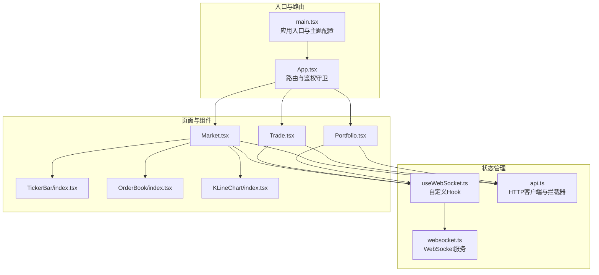
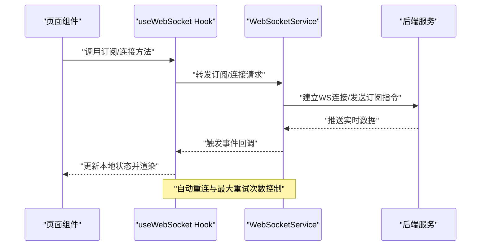
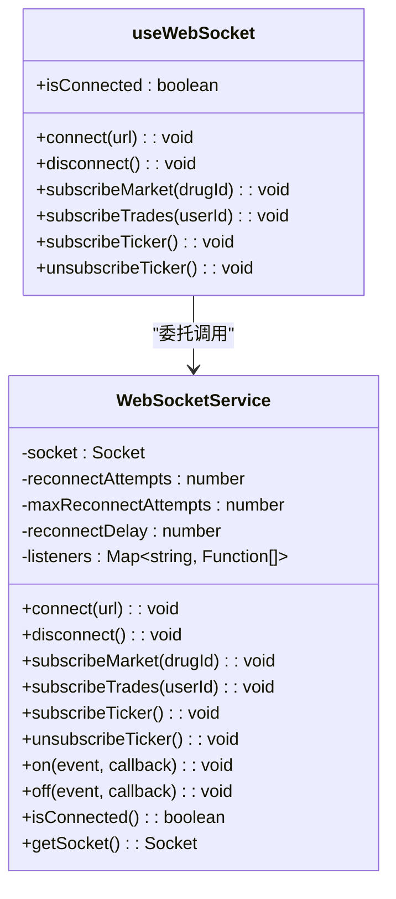
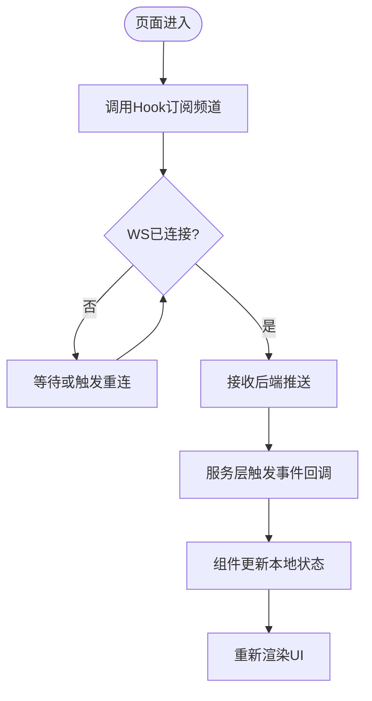
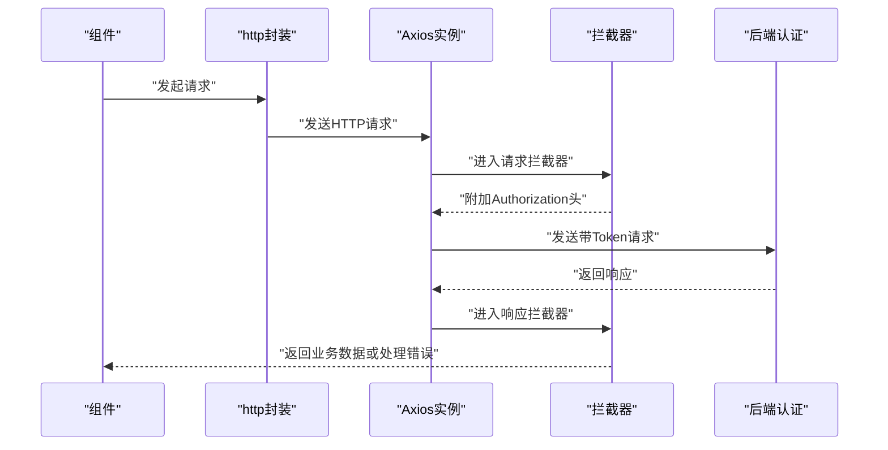
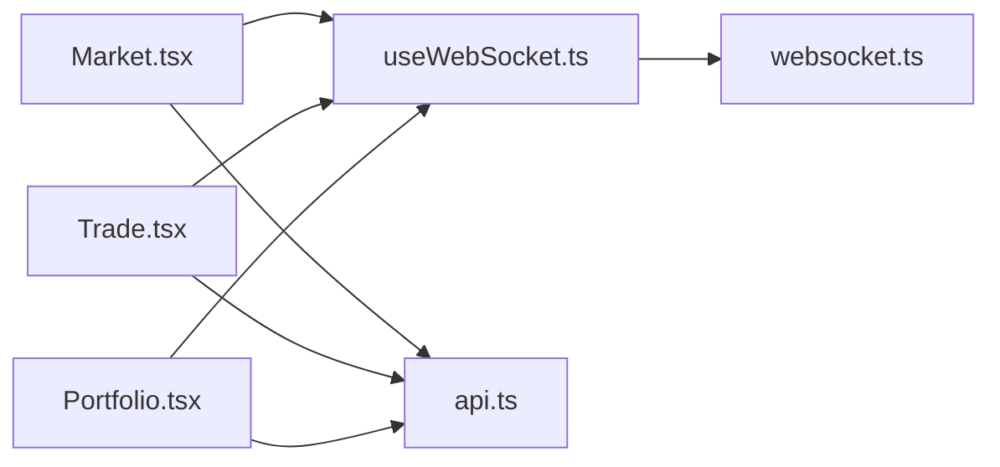

# 状态管理

<cite>
**本文引用的文件**
- [main.tsx](file://packages/web/src/main.tsx)
- [App.tsx](file://packages/web/src/App.tsx)
- [useWebSocket.ts](file://packages/web/src/hooks/useWebSocket.ts)
- [websocket.ts](file://packages/web/src/services/websocket.ts)
- [api.ts](file://packages/web/src/services/api.ts)
- [Market.tsx](file://packages/web/src/pages/Market.tsx)
- [Trade.tsx](file://packages/web/src/pages/Trade.tsx)
- [Portfolio.tsx](file://packages/web/src/pages/Portfolio.tsx)
- [TickerBar/index.tsx](file://packages/web/src/components/TickerBar/index.tsx)
- [OrderBook/index.tsx](file://packages/web/src/components/OrderBook/index.tsx)
- [KLineChart/index.tsx](file://packages/web/src/components/KLineChart/index.tsx)
</cite>

## 目录
1. [引言](#引言)
2. [项目结构](#项目结构)
3. [核心组件](#核心组件)
4. [架构总览](#架构总览)
5. [详细组件分析](#详细组件分析)
6. [依赖关系分析](#依赖关系分析)
7. [性能考量](#性能考量)
8. [故障排查指南](#故障排查指南)
9. [结论](#结论)
10. [附录](#附录)

## 引言
本文件面向Jiaoyi项目的前端状态管理，系统性阐述以下内容：
- WebSocket实时数据的状态同步策略与实现
- 本地状态缓存与全局状态管理的边界划分
- 自定义Hook设计模式与使用场景，重点解析useWebSocket Hook
- 数据流管理、状态更新机制与性能优化策略
- 状态持久化、错误处理与重连机制
- 最佳实践、调试技巧与常见问题解决方案

## 项目结构
Jiaoyi前端采用模块化组织，核心状态管理相关文件分布如下：
- 入口与主题配置：packages/web/src/main.tsx
- 路由与鉴权守卫：packages/web/src/App.tsx
- WebSocket服务与Hook：packages/web/src/services/websocket.ts、packages/web/src/hooks/useWebSocket.ts
- REST API封装：packages/web/src/services/api.ts
- 页面与组件：Market、Trade、Portfolio等页面，以及TickerBar、OrderBook、KLineChart等组件

图表来源
- [main.tsx:1-80](file://packages/web/src/main.tsx#L1-L80)
- [App.tsx:1-58](file://packages/web/src/App.tsx#L1-L58)
- [useWebSocket.ts:1-138](file://packages/web/src/hooks/useWebSocket.ts#L1-L138)
- [websocket.ts:1-188](file://packages/web/src/services/websocket.ts#L1-L188)
- [api.ts:1-330](file://packages/web/src/services/api.ts#L1-L330)
- [Market.tsx](file://packages/web/src/pages/Market.tsx)
- [Trade.tsx](file://packages/web/src/pages/Trade.tsx)
- [Portfolio.tsx](file://packages/web/src/pages/Portfolio.tsx)
- [TickerBar/index.tsx](file://packages/web/src/components/TickerBar/index.tsx)
- [OrderBook/index.tsx](file://packages/web/src/components/OrderBook/index.tsx)
- [KLineChart/index.tsx](file://packages/web/src/components/KLineChart/index.tsx)

章节来源
- [main.tsx:1-80](file://packages/web/src/main.tsx#L1-L80)
- [App.tsx:1-58](file://packages/web/src/App.tsx#L1-L58)

## 核心组件
本节聚焦状态管理的关键构件及其职责：
- WebSocket服务层：统一管理连接、订阅、事件分发与重连策略
- 自定义Hook：对服务层进行封装，提供易用的订阅与连接控制能力
- API服务层：基于Axios的请求/响应拦截器，负责认证态与错误处理
- 页面与组件：消费Hook提供的状态与方法，渲染实时行情与交互

章节来源
- [websocket.ts:1-188](file://packages/web/src/services/websocket.ts#L1-L188)
- [useWebSocket.ts:1-138](file://packages/web/src/hooks/useWebSocket.ts#L1-L138)
- [api.ts:1-330](file://packages/web/src/services/api.ts#L1-L330)

## 架构总览
下图展示从页面到服务层的数据流与控制流：

图表来源
- [useWebSocket.ts:16-135](file://packages/web/src/hooks/useWebSocket.ts#L16-L135)
- [websocket.ts:12-27](file://packages/web/src/services/websocket.ts#L12-L27)
- [websocket.ts:66-99](file://packages/web/src/services/websocket.ts#L66-L99)

## 详细组件分析

### WebSocket服务与Hook设计
- 单例服务：WebSocketService以单例形式导出，集中管理连接、订阅与事件分发
- 事件模型：内部维护事件监听器映射，接收后端推送后统一触发回调
- 重连策略：内置最大重试次数与固定延迟，超过阈值主动断开
- Hook封装：useWebSocket将复杂状态与生命周期管理抽象为简单API，支持按需订阅与取消订阅

图表来源
- [websocket.ts:4-169](file://packages/web/src/services/websocket.ts#L4-L169)
- [useWebSocket.ts:16-135](file://packages/web/src/hooks/useWebSocket.ts#L16-L135)

章节来源
- [websocket.ts:1-188](file://packages/web/src/services/websocket.ts#L1-L188)
- [useWebSocket.ts:1-138](file://packages/web/src/hooks/useWebSocket.ts#L1-L138)

### 数据流与状态更新机制
- 实时数据流：页面通过useWebSocket订阅市场、交易、ticker等频道；服务层在收到后端推送后触发对应事件回调，驱动组件更新
- 本地状态缓存：页面组件可选择性地在本地缓存关键数据（如K线、买卖盘），避免每次均依赖实时推送
- 全局状态管理边界：当前项目未引入集中式全局状态库（如Zustand、Redux），更多采用组件内局部状态与Hook共享逻辑的方式

图表来源
- [useWebSocket.ts:66-98](file://packages/web/src/hooks/useWebSocket.ts#L66-L98)
- [websocket.ts:39-100](file://packages/web/src/services/websocket.ts#L39-L100)

章节来源
- [useWebSocket.ts:66-124](file://packages/web/src/hooks/useWebSocket.ts#L66-L124)
- [websocket.ts:39-100](file://packages/web/src/services/websocket.ts#L39-L100)

### 认证与HTTP状态管理
- 请求拦截：自动注入JWT Token
- 响应拦截：统一处理401未授权（当前实现为直接清理Token并跳转登录页）
- API封装：按业务域拆分模块，便于复用与测试

图表来源
- [api.ts:13-59](file://packages/web/src/services/api.ts#L13-L59)

章节来源
- [api.ts:1-330](file://packages/web/src/services/api.ts#L1-L330)

### 页面与组件中的状态使用
- Market页面：通常需要TickerBar、OrderBook、KLineChart等组件协作展示实时行情
- Trade页面：结合WS推送与API下单接口，实现交易交互
- Portfolio页面：通过API获取账户与持仓信息，结合WS推送的交易/资金变动进行联动

章节来源
- [Market.tsx](file://packages/web/src/pages/Market.tsx)
- [Trade.tsx](file://packages/web/src/pages/Trade.tsx)
- [Portfolio.tsx](file://packages/web/src/pages/Portfolio.tsx)
- [TickerBar/index.tsx](file://packages/web/src/components/TickerBar/index.tsx)
- [OrderBook/index.tsx](file://packages/web/src/components/OrderBook/index.tsx)
- [KLineChart/index.tsx](file://packages/web/src/components/KLineChart/index.tsx)

## 依赖关系分析
- 组件依赖：页面组件依赖useWebSocket Hook；Hook依赖WebSocketService；页面组件还依赖API封装
- 服务依赖：WebSocketService依赖socket.io-client；API封装依赖axios
- 生命周期：useWebSocket在挂载时自动连接并注册事件，在卸载时清理定时器与事件监听

图表来源
- [useWebSocket.ts:1-138](file://packages/web/src/hooks/useWebSocket.ts#L1-L138)
- [websocket.ts:1-188](file://packages/web/src/services/websocket.ts#L1-L188)
- [api.ts:1-330](file://packages/web/src/services/api.ts#L1-L330)
- [Market.tsx](file://packages/web/src/pages/Market.tsx)
- [Trade.tsx](file://packages/web/src/pages/Trade.tsx)
- [Portfolio.tsx](file://packages/web/src/pages/Portfolio.tsx)

章节来源
- [useWebSocket.ts:1-138](file://packages/web/src/hooks/useWebSocket.ts#L1-L138)
- [websocket.ts:1-188](file://packages/web/src/services/websocket.ts#L1-L188)
- [api.ts:1-330](file://packages/web/src/services/api.ts#L1-L330)

## 性能考量
- 连接与订阅粒度：仅在必要时订阅频道，避免不必要的推送导致的渲染压力
- 事件回调收敛：在服务层统一触发回调，减少组件内重复逻辑
- 本地缓存策略：对高频访问且变化不频繁的数据（如历史K线）采用本地缓存，降低网络与计算开销
- 渲染优化：组件内部使用稳定引用与防抖策略，避免无效重渲染
- 重连退避：固定延迟与最大重试次数限制，防止风暴式重连

## 故障排查指南
- 连接失败
  - 检查后端WS地址与端口是否可达
  - 查看浏览器控制台是否存在跨域或证书问题
  - 关注服务层connect_error事件与最大重试次数
- 推送不达
  - 确认订阅指令已正确发送（subscribeMarket/subscribeTicker等）
  - 检查组件是否在卸载前正确移除事件监听
- 状态异常
  - 使用浏览器开发者工具观察事件回调执行情况
  - 在事件回调中增加错误捕获，避免异常中断后续回调
- 鉴权失效
  - 401错误会触发清理Token并跳转登录页，检查Token有效期与存储位置

章节来源
- [websocket.ts:51-59](file://packages/web/src/services/websocket.ts#L51-L59)
- [websocket.ts:142-153](file://packages/web/src/services/websocket.ts#L142-L153)
- [api.ts:34-58](file://packages/web/src/services/api.ts#L34-L58)

## 结论
Jiaoyi前端采用“服务层+自定义Hook”的轻量状态管理模式：WebSocketService负责连接与事件分发，useWebSocket将复杂逻辑封装为直观API；API服务层通过拦截器统一处理认证与错误。该方案具备清晰的职责边界与良好的可扩展性，适合中小型实时交易场景。建议在后续迭代中：
- 明确页面级与组件级状态边界，必要时引入轻量全局状态库
- 对高频事件增加去抖/节流与本地缓存
- 完善Token刷新流程与离线策略

## 附录
- 最佳实践
  - 将订阅与连接控制集中在Hook中，页面仅关注渲染
  - 对事件回调进行错误隔离，避免影响其他回调
  - 合理设置重连参数，平衡实时性与资源消耗
- 调试技巧
  - 在服务层打印连接/断开与订阅确认日志
  - 使用浏览器Network面板观察WS握手与消息收发
  - 在组件中输出关键状态变更，定位渲染异常
- 常见问题
  - 订阅后无数据：确认频道名称与后端一致，检查订阅指令是否发送成功
  - 重连过多：调整最大重试次数与延迟，避免风暴式重连
  - 登录态丢失：确认拦截器是否正确附加Token，401处理逻辑是否生效