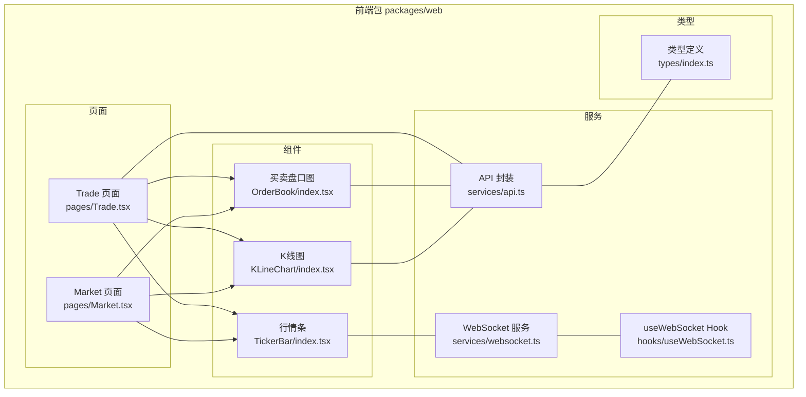
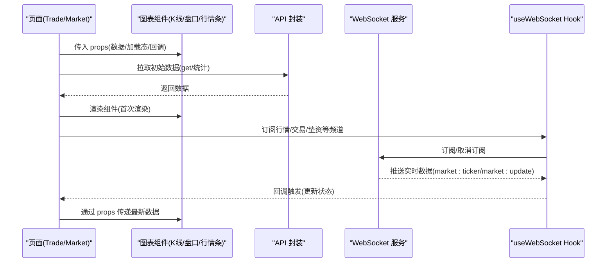
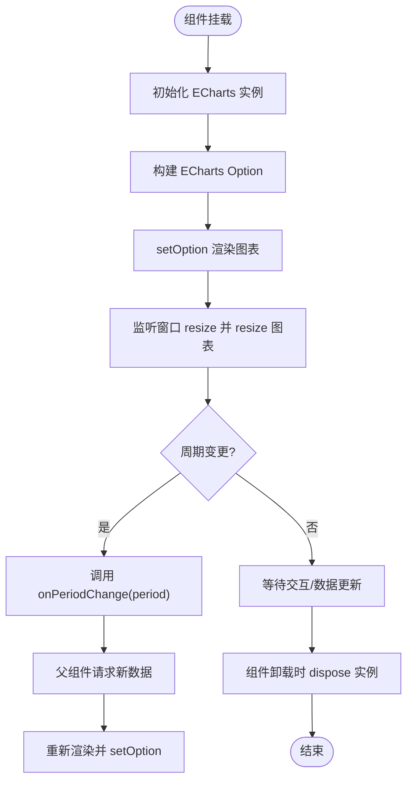
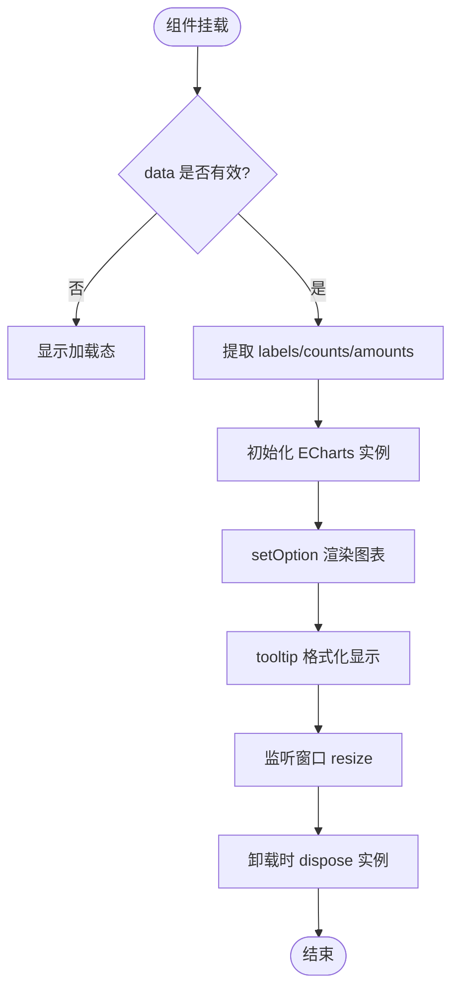
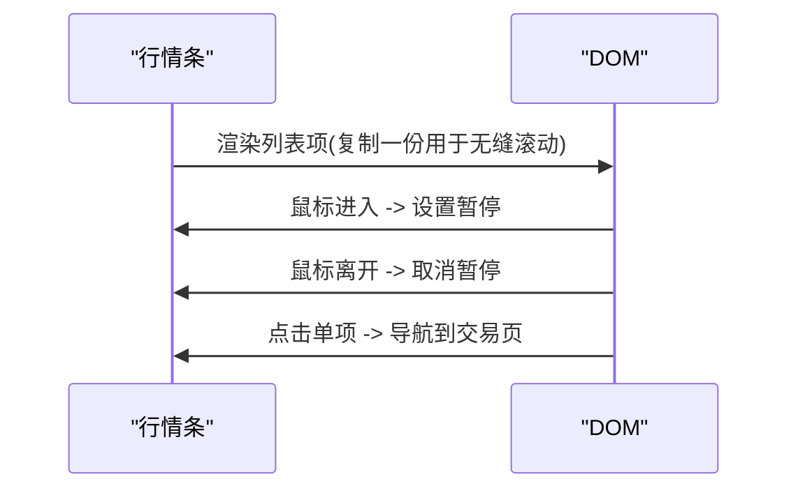
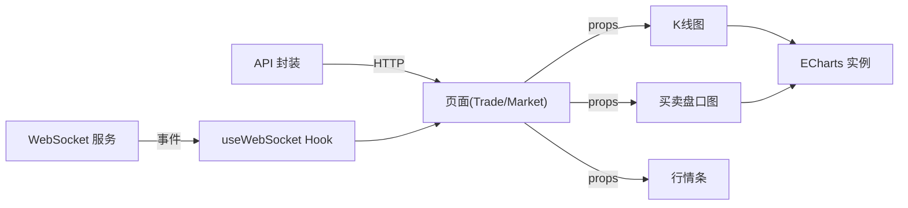

# 组件设计

<cite>
**本文引用的文件**
- [package.json](file://package.json)
- [pnpm-workspace.yaml](file://pnpm-workspace.yaml)
- [tsconfig.json](file://tsconfig.json)
- [K线图/index.tsx](file://packages/web/src/components/KLineChart/index.tsx)
- [K线图/style.css](file://packages/web/src/components/KLineChart/style.css)
- [买卖盘口图/index.tsx](file://packages/web/src/components/OrderBook/index.tsx)
- [买卖盘口图/style.css](file://packages/web/src/components/OrderBook/style.css)
- [行情条/index.tsx](file://packages/web/src/components/TickerBar/index.tsx)
- [行情条/style.css](file://packages/web/src/components/TickerBar/style.css)
- [类型定义/index.ts](file://packages/web/src/types/index.ts)
- [Trade 页面](file://packages/web/src/pages/Trade.tsx)
- [Market 页面](file://packages/web/src/pages/Market.tsx)
- [WebSocket 服务](file://packages/web/src/services/websocket.ts)
- [useWebSocket Hook](file://packages/web/src/hooks/useWebSocket.ts)
- [API 封装](file://packages/web/src/services/api.ts)
</cite>

## 目录
1. [引言](#引言)
2. [项目结构](#项目结构)
3. [核心组件](#核心组件)
4. [架构总览](#架构总览)
5. [详细组件分析](#详细组件分析)
6. [依赖关系分析](#依赖关系分析)
7. [性能考量](#性能考量)
8. [故障排查指南](#故障排查指南)
9. [结论](#结论)
10. [附录](#附录)

## 引言
本设计文档聚焦 Jiaoyi 项目中的自定义图表组件：K线图、买卖盘口图与行情条。文档从设计理念、props 接口、状态管理、事件处理、样式系统与主题适配、可复用性与扩展点、组件间通信与数据流、生命周期管理等方面进行系统化梳理，并提供使用示例与最佳实践建议，帮助开发者高效集成与扩展。

## 项目结构
Jiaoyi 采用 monorepo 结构，前端位于 packages/web，核心图表组件集中于 src/components 下，配套样式文件与页面使用示例位于对应目录。类型定义统一放置于 src/types，网络层通过 axios 封装与 WebSocket 服务对接实时数据。

**图表来源**
- [K线图/index.tsx:1-309](file://packages/web/src/components/KLineChart/index.tsx#L1-L309)
- [买卖盘口图/index.tsx:1-203](file://packages/web/src/components/OrderBook/index.tsx#L1-L203)
- [行情条/index.tsx:1-89](file://packages/web/src/components/TickerBar/index.tsx#L1-L89)
- [Market 页面:1-537](file://packages/web/src/pages/Market.tsx#L1-L537)
- [Trade 页面:1-984](file://packages/web/src/pages/Trade.tsx#L1-L984)
- [WebSocket 服务:1-188](file://packages/web/src/services/websocket.ts#L1-L188)
- [useWebSocket Hook:1-138](file://packages/web/src/hooks/useWebSocket.ts#L1-L138)
- [API 封装:1-330](file://packages/web/src/services/api.ts#L1-L330)
- [类型定义/index.ts:1-104](file://packages/web/src/types/index.ts#L1-L104)

**章节来源**
- [package.json:1-24](file://package.json#L1-L24)
- [pnpm-workspace.yaml:1-3](file://pnpm-workspace.yaml#L1-L3)
- [tsconfig.json:1-17](file://tsconfig.json#L1-L17)

## 核心组件
- K线图：基于 ECharts 的复合图表，支持日收益率曲线与日销量柱状图双轴展示，内置周期切换与响应式适配。
- 买卖盘口图：基于 ECharts 的深度图，展示订单数分布与金额统计，提供渐变色与圆角柱状样式。
- 行情条：纯前端动画滚动的横向行情列表，支持鼠标悬停暂停、点击跳转至交易页。

**章节来源**
- [K线图/index.tsx:1-309](file://packages/web/src/components/KLineChart/index.tsx#L1-L309)
- [买卖盘口图/index.tsx:1-203](file://packages/web/src/components/OrderBook/index.tsx#L1-L203)
- [行情条/index.tsx:1-89](file://packages/web/src/components/TickerBar/index.tsx#L1-L89)

## 架构总览
组件间通过 props 与回调进行解耦；数据由 API 层拉取，WebSocket 提供实时增量更新；Trade 页面同时使用 ECharts-for-react 与自研组件，形成“自研组件 + 第三方图表库”的混合方案。

**图表来源**
- [Trade 页面:1-984](file://packages/web/src/pages/Trade.tsx#L1-L984)
- [Market 页面:1-537](file://packages/web/src/pages/Market.tsx#L1-L537)
- [API 封装:1-330](file://packages/web/src/services/api.ts#L1-L330)
- [WebSocket 服务:1-188](file://packages/web/src/services/websocket.ts#L1-L188)
- [useWebSocket Hook:1-138](file://packages/web/src/hooks/useWebSocket.ts#L1-L138)

## 详细组件分析

### K线图组件
- 设计理念
  - 双轴复合图：上图为日收益率折线（正值绿色、负值红色），下图为日销量柱状图，使用渐变填充增强视觉层次。
  - 主题与交互：深色主题，tooltip 显示日期与系列值，legend 控制显示，grid 分区布局，dataZoom 支持缩放。
  - 周期控制：内置周期选择器，通过回调 onPeriodChange 通知父组件切换周期。
- Props 接口
  - data: KLineData[]（日期、日销量、日销售额、均价、日收益率、总资金）
  - loading?: boolean
  - period?: '7d'|'30d'|'90d'|'all'
  - onPeriodChange?: (period) => void
- 状态管理
  - 内部维护 ECharts 实例与容器引用，使用 useMemo 优化数据转换，避免不必要的 setOption。
  - 在窗口 resize 时自动调整图表尺寸，组件卸载时 dispose 实例防止内存泄漏。
- 事件处理
  - 周期按钮点击触发 onPeriodChange，父组件可据此发起新的 API 请求。
- 样式系统与主题适配
  - 使用独立 CSS 文件，容器采用 flex 布局，按钮组采用深色背景与边框，hover 与 active 状态高亮。
  - ECharts 主题通过初始化时指定 dark，配合组件内样式变量实现一致的主题风格。
- 可复用性与扩展点
  - 通过 props 传入数据与回调，支持不同周期与加载态；series 与 grid 可按需扩展为多指标。
- 生命周期
  - 首次挂载初始化 ECharts；依赖数据变化更新 option；窗口大小变化响应式 resize；卸载时清理实例。

**图表来源**
- [K线图/index.tsx:1-309](file://packages/web/src/components/KLineChart/index.tsx#L1-L309)
- [K线图/style.css:1-75](file://packages/web/src/components/KLineChart/style.css#L1-L75)

**章节来源**
- [K线图/index.tsx:1-309](file://packages/web/src/components/KLineChart/index.tsx#L1-L309)
- [K线图/style.css:1-75](file://packages/web/src/components/KLineChart/style.css#L1-L75)

### 买卖盘口图组件
- 设计理念
  - 深度图展示订单数分布，使用渐变柱状图突出金额变化趋势，tooltip 提供订单数与金额明细。
  - 统计区域展示排队总额与总单数，格式化金额便于阅读。
- Props 接口
  - data: DepthData|null（包含范围数组、总金额、总单数）
  - loading?: boolean
- 状态管理
  - 内部维护 ECharts 实例与容器引用，使用 useMemo 将深度数据转换为 labels/counts/amounts。
  - 响应式 resize 与实例清理。
- 事件处理
  - tooltip 动态格式化显示范围标签、订单数与金额。
- 样式系统与主题适配
  - 容器采用 column 布局，统计区带底边框与高亮数值；图表区域占位 flex: 1。
- 可复用性与扩展点
  - 可扩展为多系列（如买盘/卖盘），或增加更多统计维度。
- 生命周期
  - 首次渲染 setOption；窗口变化 resize；卸载 dispose。

**图表来源**
- [买卖盘口图/index.tsx:1-203](file://packages/web/src/components/OrderBook/index.tsx#L1-L203)
- [买卖盘口图/style.css:1-68](file://packages/web/src/components/OrderBook/style.css#L1-L68)

**章节来源**
- [买卖盘口图/index.tsx:1-203](file://packages/web/src/components/OrderBook/index.tsx#L1-L203)
- [买卖盘口图/style.css:1-68](file://packages/web/src/components/OrderBook/style.css#L1-L68)

### 行情条组件
- 设计理念
  - 无缝循环滚动的横向列表，鼠标悬停暂停，点击单项导航至交易页。
  - 使用 Ant Design 图标展示涨跌方向，数值格式化为百分比。
- Props 接口
  - data: TickerItem[]（药品标识、名称、编码、单价、日收益、累计收益）
  - loading?: boolean
- 状态管理
  - 内部维护是否暂停的状态，复制数据实现无缝循环滚动。
- 事件处理
  - 点击单项触发路由跳转至交易详情页。
- 样式系统与主题适配
  - 深色背景与分隔线，hover 高亮，涨跌使用不同颜色与背景。
- 可复用性与扩展点
  - 可注入点击行为回调、支持自定义格式化函数。
- 生命周期
  - 组件挂载后根据数据长度动态计算动画时长，卸载时无需额外清理。

**图表来源**
- [行情条/index.tsx:1-89](file://packages/web/src/components/TickerBar/index.tsx#L1-L89)
- [行情条/style.css:1-84](file://packages/web/src/components/TickerBar/style.css#L1-L84)

**章节来源**
- [行情条/index.tsx:1-89](file://packages/web/src/components/TickerBar/index.tsx#L1-L89)
- [行情条/style.css:1-84](file://packages/web/src/components/TickerBar/style.css#L1-L84)

## 依赖关系分析
- 组件依赖
  - K线图/盘口图：依赖 ECharts（第三方），通过 useRef/ECharts 实例管理生命周期。
  - 行情条：纯前端实现，依赖 react-router-dom 导航。
- 数据流
  - API 封装提供 getDrugs/getDrugKLine/getDrugDepth/getMarketOverview 等方法，Trade/Market 页面调用并传给组件。
  - WebSocket 服务与 useWebSocket Hook 提供实时订阅能力，事件名覆盖 market/ticker/trade/funding/settlement/system。
- 类型系统
  - types/index.ts 提供用户、药品、市场、交易、持仓、清算等类型，Trade 页面内部也定义了页面级类型，建议逐步统一到全局类型文件。

**图表来源**
- [API 封装:1-330](file://packages/web/src/services/api.ts#L1-L330)
- [WebSocket 服务:1-188](file://packages/web/src/services/websocket.ts#L1-L188)
- [useWebSocket Hook:1-138](file://packages/web/src/hooks/useWebSocket.ts#L1-L138)
- [Trade 页面:1-984](file://packages/web/src/pages/Trade.tsx#L1-L984)
- [Market 页面:1-537](file://packages/web/src/pages/Market.tsx#L1-L537)
- [K线图/index.tsx:1-309](file://packages/web/src/components/KLineChart/index.tsx#L1-L309)
- [买卖盘口图/index.tsx:1-203](file://packages/web/src/components/OrderBook/index.tsx#L1-L203)

**章节来源**
- [API 封装:1-330](file://packages/web/src/services/api.ts#L1-L330)
- [WebSocket 服务:1-188](file://packages/web/src/services/websocket.ts#L1-L188)
- [useWebSocket Hook:1-138](file://packages/web/src/hooks/useWebSocket.ts#L1-L138)
- [Trade 页面:1-984](file://packages/web/src/pages/Trade.tsx#L1-L984)
- [Market 页面:1-537](file://packages/web/src/pages/Market.tsx#L1-L537)

## 性能考量
- 数据转换与渲染
  - 使用 useMemo 缓存数据转换结果，减少 ECharts option 重建频率。
  - 对大数据集（如 K 线）建议分页或采样，避免一次性渲染过多点位。
- 图表生命周期
  - 组件卸载时 dispose 实例，resize 事件监听在组件卸载时移除，避免内存泄漏。
- 动画与滚动
  - 行情条的动画时长与数据长度成正比，建议限制最大长度或使用虚拟滚动。
- 网络与订阅
  - useWebSocket Hook 自动连接与断开，订阅/退订在组件生命周期内管理，避免重复注册。

[本节为通用指导，不直接分析具体文件，故无“章节来源”]

## 故障排查指南
- 图表不显示或空白
  - 检查容器高度是否正确设置（flex: 1/min-height: 0）。
  - 确认数据非空且格式符合预期，必要时在组件内增加空数据提示。
- 图表尺寸异常
  - 确保在窗口 resize 时调用 resize；检查父容器是否触发了布局变化。
- 实时数据未更新
  - 检查 WebSocket 订阅是否成功，事件名是否匹配；确认 useWebSocket 的回调已注册并在组件卸载时正确移除。
- 性能问题
  - 大数据量时考虑减少 series 或启用 ECharts 的大数据优化选项；对频繁 setOption 的场景使用防抖。

**章节来源**
- [K线图/index.tsx:256-275](file://packages/web/src/components/KLineChart/index.tsx#L256-L275)
- [买卖盘口图/index.tsx:144-163](file://packages/web/src/components/OrderBook/index.tsx#L144-L163)
- [useWebSocket Hook:66-124](file://packages/web/src/hooks/useWebSocket.ts#L66-L124)
- [WebSocket 服务:38-100](file://packages/web/src/services/websocket.ts#L38-L100)

## 结论
Jiaoyi 的自定义图表组件以清晰的 props 接口、完善的生命周期管理与主题适配为核心，结合 API 与 WebSocket 形成了稳定的数据驱动方案。K线图与买卖盘口图通过 ECharts 实现专业可视化，行情条以轻量实现提供流畅体验。建议后续在类型统一、大数据优化与组件扩展点方面持续演进。

[本节为总结性内容，不直接分析具体文件，故无“章节来源”]

## 附录

### 组件使用示例与最佳实践
- 在 Market 页面中，将 API 返回的统计数据与药品列表作为 props 传入 K线图/盘口图/行情条，结合 loading 状态提升用户体验。
- 在 Trade 页面中：
  - 使用 API 获取药品详情与历史 K 线数据，传入 K线图组件；
  - 使用 API 获取深度数据，传入盘口图组件；
  - 使用 useWebSocket 订阅 market:ticker，将实时行情推送到行情条组件。
- 最佳实践
  - 统一类型定义，避免页面内重复定义类型；
  - 对高频 setOption 场景进行防抖或合并；
  - 对大数据量图表开启 ECharts 的大数据优化；
  - 为每个组件提供默认占位与错误兜底，提升健壮性。

**章节来源**
- [Market 页面:1-537](file://packages/web/src/pages/Market.tsx#L1-L537)
- [Trade 页面:1-984](file://packages/web/src/pages/Trade.tsx#L1-L984)
- [API 封装:1-330](file://packages/web/src/services/api.ts#L1-L330)
- [useWebSocket Hook:1-138](file://packages/web/src/hooks/useWebSocket.ts#L1-L138)