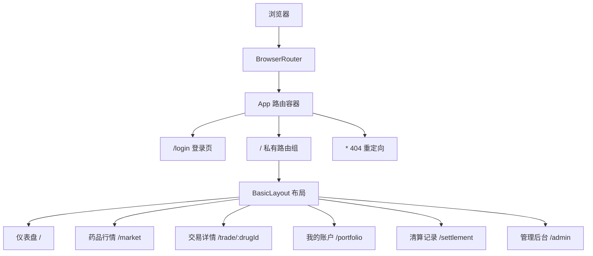
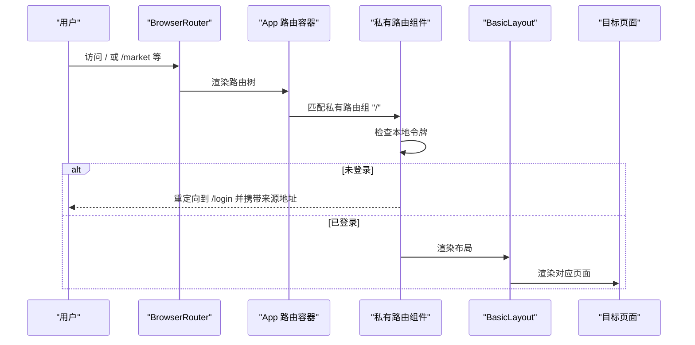
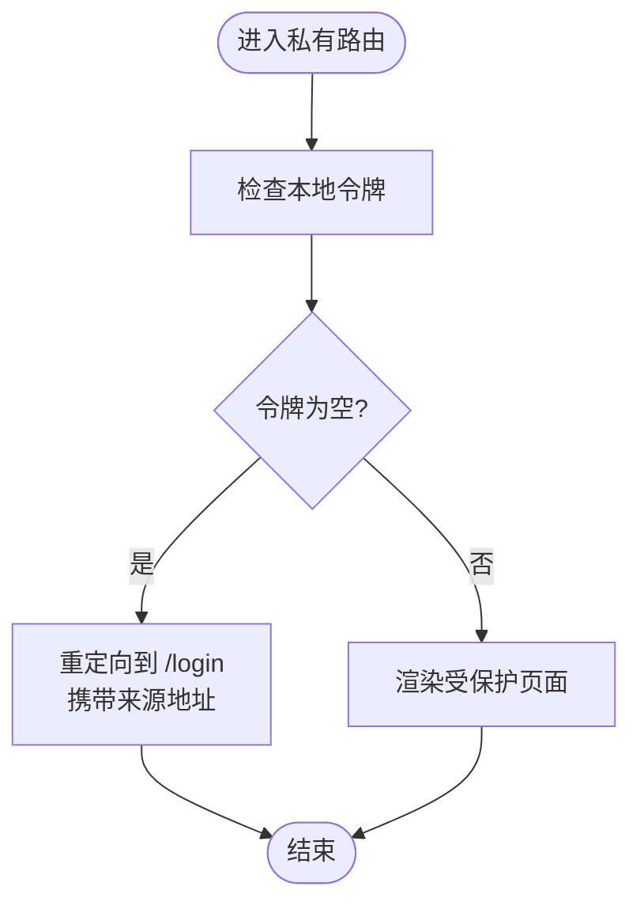
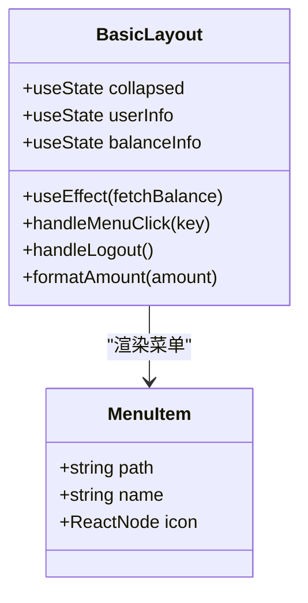
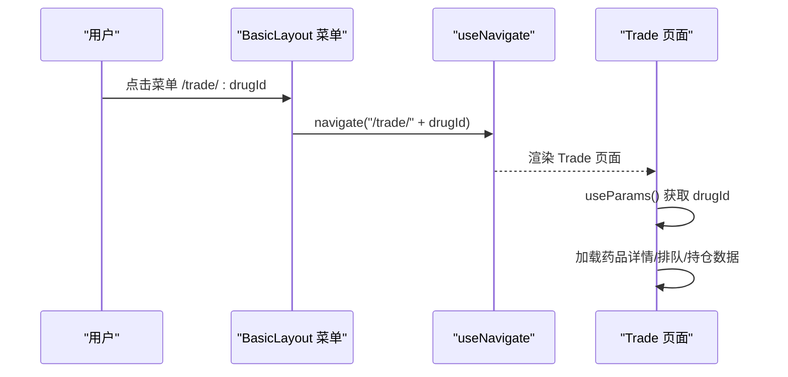
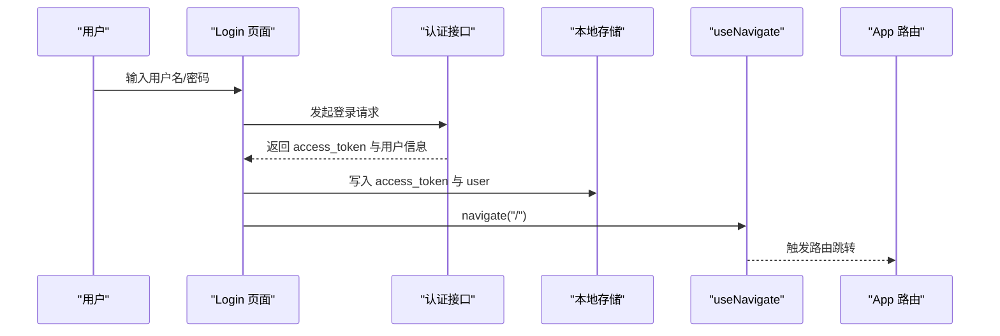
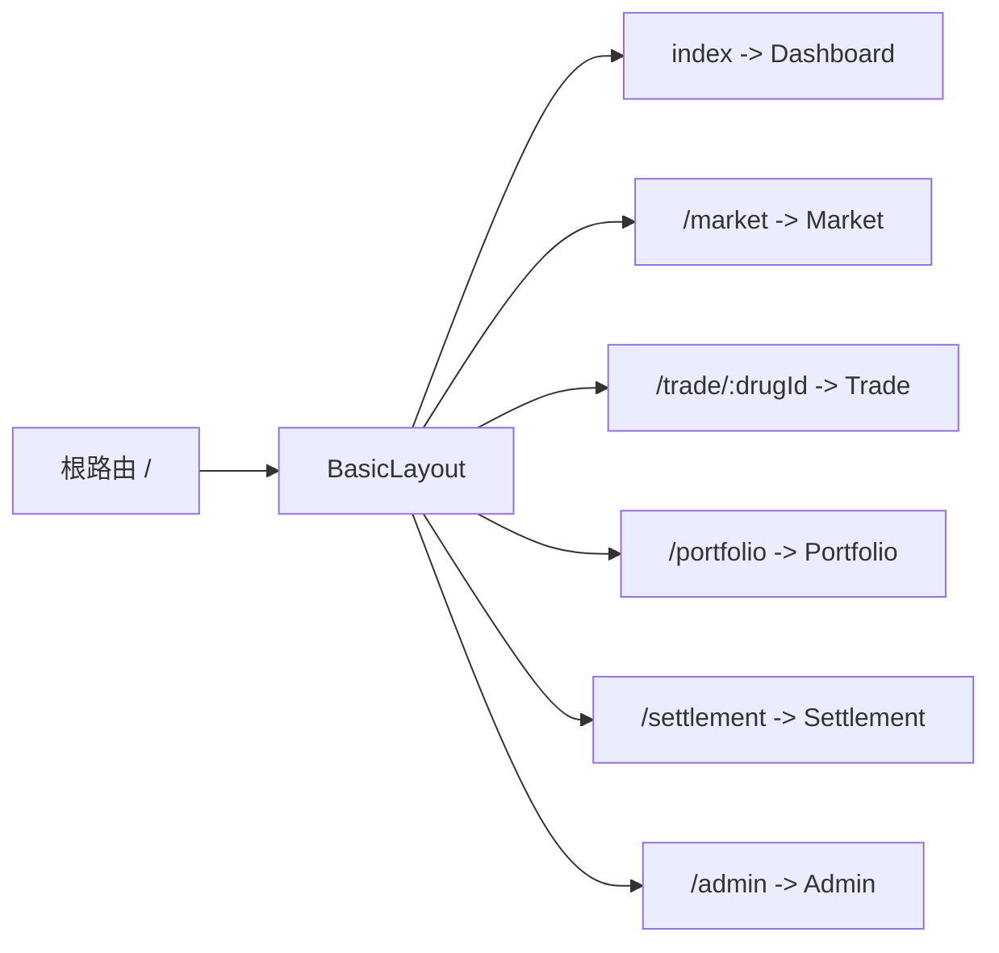
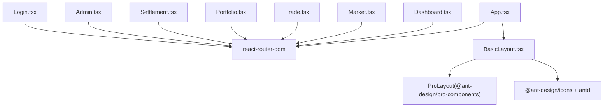

# 路由导航

<cite>
**本文档引用的文件**
- [App.tsx](file://packages/web/src/App.tsx)
- [main.tsx](file://packages/web/src/main.tsx)
- [BasicLayout.tsx](file://packages/web/src/layouts/BasicLayout.tsx)
- [Dashboard.tsx](file://packages/web/src/pages/Dashboard.tsx)
- [Market.tsx](file://packages/web/src/pages/Market.tsx)
- [Trade.tsx](file://packages/web/src/pages/Trade.tsx)
- [Portfolio.tsx](file://packages/web/src/pages/Portfolio.tsx)
- [Settlement.tsx](file://packages/web/src/pages/Settlement.tsx)
- [Admin.tsx](file://packages/web/src/pages/Admin.tsx)
- [Login.tsx](file://packages/web/src/pages/Login.tsx)
</cite>

## 目录
1. [简介](#简介)
2. [项目结构](#项目结构)
3. [核心组件](#核心组件)
4. [架构总览](#架构总览)
5. [详细组件分析](#详细组件分析)
6. [依赖关系分析](#依赖关系分析)
7. [性能考虑](#性能考虑)
8. [故障排除指南](#故障排除指南)
9. [结论](#结论)
10. [附录](#附录)

## 简介
本文件面向Jiaoyi项目的前端路由导航体系，基于React Router v6实现。文档涵盖路由配置、布局与页面组件、导航结构、路由守卫与权限控制、页面间参数传递与状态保持、历史记录管理、嵌套路由与动态路由、以及导航菜单设计与用户体验优化。同时提供路由配置示例与导航最佳实践，帮助开发者快速理解并扩展路由体系。

## 项目结构
Jiaoyi前端采用Vite构建，使用React Router v6进行路由管理。应用通过BrowserRouter包裹根组件，在App.tsx中集中定义路由规则，并通过BasicLayout统一承载导航菜单、面包屑与页面内容区域。

图表来源
- [main.tsx:74-76](file://packages/web/src/main.tsx#L74-L76)
- [App.tsx:35-54](file://packages/web/src/App.tsx#L35-L54)
- [BasicLayout.tsx:124-263](file://packages/web/src/layouts/BasicLayout.tsx#L124-L263)

章节来源
- [main.tsx:1-80](file://packages/web/src/main.tsx#L1-L80)
- [App.tsx:1-58](file://packages/web/src/App.tsx#L1-L58)

## 核心组件
- 路由守卫组件：在私有路由组外层封装，基于本地存储令牌判断访问权限，未登录自动跳转至登录页并携带来源地址。
- 布局组件：BasicLayout负责菜单导航、头部右侧信息展示、面包屑生成与页面内容Outlet渲染。
- 页面组件：Dashboard、Market、Trade、Portfolio、Settlement、Admin等页面按功能模块划分，支持参数传递与状态保持。
- 导航交互：菜单点击触发useNavigate跳转；表格行点击触发到交易页的路由跳转；登录成功后跳转至首页。

章节来源
- [App.tsx:12-31](file://packages/web/src/App.tsx#L12-L31)
- [BasicLayout.tsx:57-112](file://packages/web/src/layouts/BasicLayout.tsx#L57-L112)
- [Dashboard.tsx:477-479](file://packages/web/src/pages/Dashboard.tsx#L477-L479)
- [Market.tsx:281-282](file://packages/web/src/pages/Market.tsx#L281-L282)

## 架构总览
路由采用嵌套路由设计，根路由下挂载BasicLayout，内部再细分各业务页面。路由守卫确保受保护页面仅对已认证用户开放。导航菜单与路由路径一一对应，支持点击跳转与面包屑联动。

图表来源
- [App.tsx:12-31](file://packages/web/src/App.tsx#L12-L31)
- [App.tsx:35-54](file://packages/web/src/App.tsx#L35-L54)
- [BasicLayout.tsx:94-96](file://packages/web/src/layouts/BasicLayout.tsx#L94-L96)

## 详细组件分析

### 路由守卫与权限控制
- 实现方式：自定义PrivateRoute组件，使用useLocation监听路由变化，通过localStorage中的access_token判断登录状态。
- 行为特征：加载中返回空值；未登录时使用Navigate组件重定向到/login并携带from状态；已登录则渲染子组件。
- 适用范围：根路径下的所有受保护页面。

图表来源
- [App.tsx:12-31](file://packages/web/src/App.tsx#L12-L31)

章节来源
- [App.tsx:12-31](file://packages/web/src/App.tsx#L12-L31)

### 布局组件与导航菜单
- 菜单配置：menuItems数组定义菜单项，包含路径、名称与图标，用于Ant Design Pro Layout生成菜单。
- 菜单交互：handleMenuClick通过useNavigate跳转；右上角头像下拉菜单提供退出登录功能。
- 头部右侧信息：展示可用余额与累计收益，格式化货币显示。
- 响应式布局：支持折叠侧边栏与固定头部。

图表来源
- [BasicLayout.tsx:29-55](file://packages/web/src/layouts/BasicLayout.tsx#L29-L55)
- [BasicLayout.tsx:94-112](file://packages/web/src/layouts/BasicLayout.tsx#L94-L112)
- [BasicLayout.tsx:115-122](file://packages/web/src/layouts/BasicLayout.tsx#L115-L122)

章节来源
- [BasicLayout.tsx:29-122](file://packages/web/src/layouts/BasicLayout.tsx#L29-L122)

### 页面组件与路由参数
- 动态路由：/trade/:drugId使用useParams获取药品ID，实现按药品维度的数据加载与展示。
- 参数传递：表格行点击、菜单跳转均通过navigate传入路径参数。
- 状态保持：页面内通过useState/useEffect维护加载状态与数据，结合WebSocket实时更新。

图表来源
- [BasicLayout.tsx:94-96](file://packages/web/src/layouts/BasicLayout.tsx#L94-L96)
- [Trade.tsx:77-119](file://packages/web/src/pages/Trade.tsx#L77-L119)

章节来源
- [Trade.tsx:77-119](file://packages/web/src/pages/Trade.tsx#L77-L119)
- [Dashboard.tsx:477-479](file://packages/web/src/pages/Dashboard.tsx#L477-L479)
- [Market.tsx:281-282](file://packages/web/src/pages/Market.tsx#L281-L282)

### 登录流程与路由跳转
- 登录页：Login组件提供登录/注册双标签页，调用认证接口后写入access_token与用户信息，随后跳转首页。
- 未登录拦截：路由守卫检测不到令牌时自动重定向至登录页，并保留来源地址以便登录后返回。

图表来源
- [Login.tsx:116-133](file://packages/web/src/pages/Login.tsx#L116-L133)
- [App.tsx:26-28](file://packages/web/src/App.tsx#L26-L28)

章节来源
- [Login.tsx:116-133](file://packages/web/src/pages/Login.tsx#L116-L133)
- [App.tsx:26-28](file://packages/web/src/App.tsx#L26-L28)

### 嵌套路由与页面内容渲染
- 嵌套路由：根路由"/"下嵌套多个子路由，如/dashboard、/market、/trade/:drugId等。
- Outlet渲染：BasicLayout通过<Outlet />渲染当前匹配的子路由内容。
- 默认路由：index路由指向Dashboard作为根路径默认页面。

图表来源
- [App.tsx:35-54](file://packages/web/src/App.tsx#L35-L54)
- [BasicLayout.tsx:258-262](file://packages/web/src/layouts/BasicLayout.tsx#L258-L262)

章节来源
- [App.tsx:35-54](file://packages/web/src/App.tsx#L35-L54)
- [BasicLayout.tsx:258-262](file://packages/web/src/layouts/BasicLayout.tsx#L258-L262)

### 导航菜单设计与用户体验优化
- 菜单图标与文案：使用Ant Design图标库与中文命名，提升识别度。
- 右侧信息展示：余额与收益以卡片形式展示，支持负收益颜色提示。
- 交互反馈：菜单点击、按钮悬停等提供视觉反馈，增强可用性。
- 响应式设计：支持侧边栏折叠与深色主题适配。

章节来源
- [BasicLayout.tsx:29-55](file://packages/web/src/layouts/BasicLayout.tsx#L29-L55)
- [BasicLayout.tsx:154-230](file://packages/web/src/layouts/BasicLayout.tsx#L154-L230)

## 依赖关系分析
- App.tsx依赖React Router的Routes、Route、Navigate与useLocation，定义全局路由与守卫。
- BasicLayout依赖@ant-design/pro-components的ProLayout，配合Ant Design组件实现菜单与头部。
- 各页面组件通过useNavigate进行页面间跳转，Trade组件通过useParams接收动态路由参数。
- 登录组件通过useNavigate完成登录后的页面跳转。

图表来源
- [App.tsx:1-11](file://packages/web/src/App.tsx#L1-L11)
- [BasicLayout.tsx:1-15](file://packages/web/src/layouts/BasicLayout.tsx#L1-L15)
- [Login.tsx:1-7](file://packages/web/src/pages/Login.tsx#L1-L7)

章节来源
- [App.tsx:1-11](file://packages/web/src/App.tsx#L1-L11)
- [BasicLayout.tsx:1-15](file://packages/web/src/layouts/BasicLayout.tsx#L1-L15)
- [Login.tsx:1-7](file://packages/web/src/pages/Login.tsx#L1-L7)

## 性能考虑
- 路由切换性能：React Router v6的声明式路由与组件级懒加载结合，减少不必要的重渲染。
- 页面级懒加载：可通过React.lazy与Suspense对大型页面组件进行按需加载，降低首屏负担。
- 状态管理：页面内状态通过useState/useEffect管理，避免跨页面共享导致的状态风暴。
- WebSocket集成：在Dashboard与Trade等页面通过WebSocket订阅增量数据，减少轮询开销。

## 故障排除指南
- 登录后无法跳转：检查localStorage中access_token是否存在，确认PrivateRoute守卫逻辑是否正确执行。
- 菜单点击无效：确认BasicLayout的handleMenuClick是否被正确绑定，navigate调用路径是否与路由定义一致。
- 动态路由参数为空：检查Trade组件useParams读取逻辑，确认URL中是否包含drugId参数。
- 404页面：确认App路由中通配符*是否正确重定向至根路径。

章节来源
- [App.tsx:12-31](file://packages/web/src/App.tsx#L12-L31)
- [BasicLayout.tsx:94-96](file://packages/web/src/layouts/BasicLayout.tsx#L94-L96)
- [Trade.tsx:77-119](file://packages/web/src/pages/Trade.tsx#L77-L119)
- [App.tsx:52](file://packages/web/src/App.tsx#L52)

## 结论
Jiaoyi项目的路由导航体系以React Router v6为核心，结合自定义路由守卫与Ant Design Pro Layout，实现了清晰的嵌套路由结构与良好的用户体验。通过动态路由参数与状态保持机制，页面间跳转流畅且具备响应式交互。建议后续引入路由懒加载与更细粒度的权限控制，进一步提升性能与安全性。

## 附录
- 路由配置示例（路径引用）
  - [根路由与私有路由组:35-54](file://packages/web/src/App.tsx#L35-L54)
  - [路由守卫组件:12-31](file://packages/web/src/App.tsx#L12-L31)
  - [布局菜单与导航:29-112](file://packages/web/src/layouts/BasicLayout.tsx#L29-L112)
  - [动态路由参数读取:77-119](file://packages/web/src/pages/Trade.tsx#L77-L119)
  - [登录后跳转逻辑:116-133](file://packages/web/src/pages/Login.tsx#L116-L133)