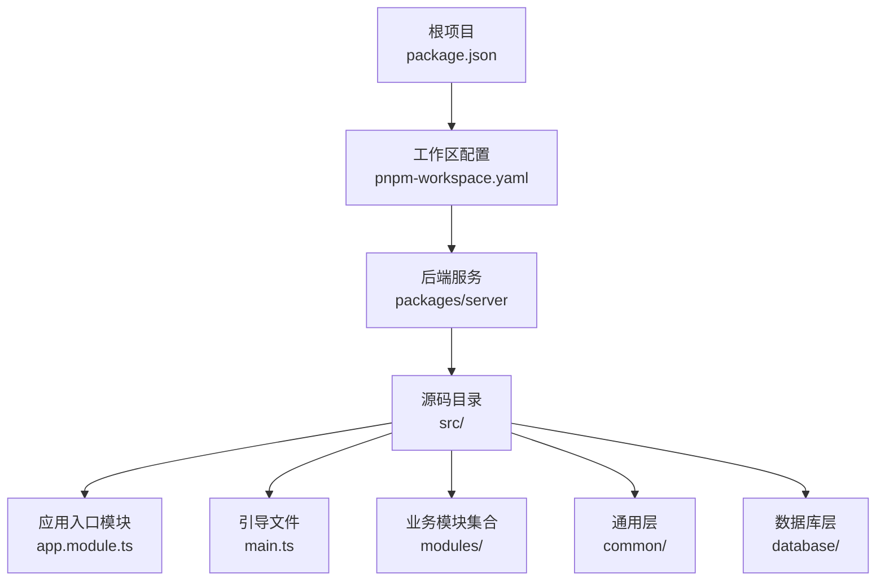
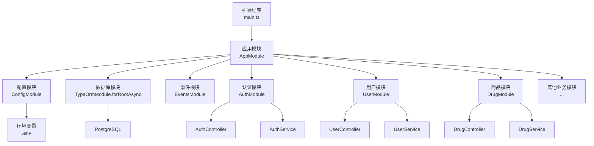
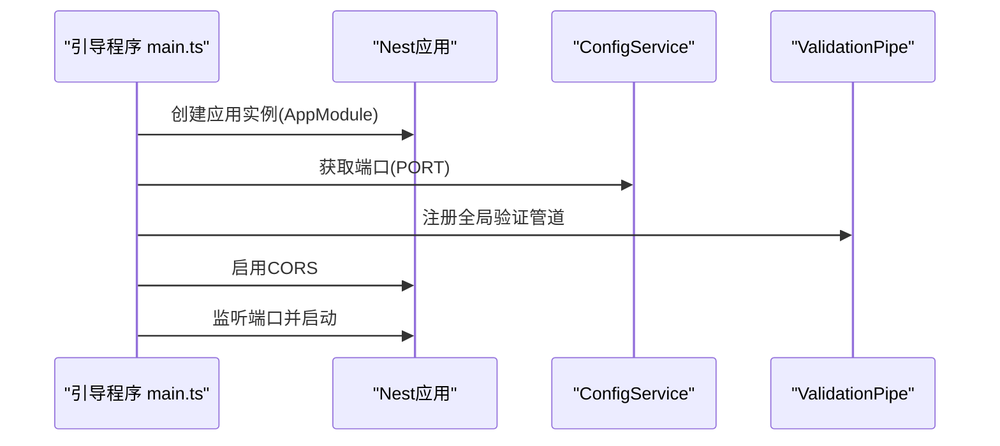
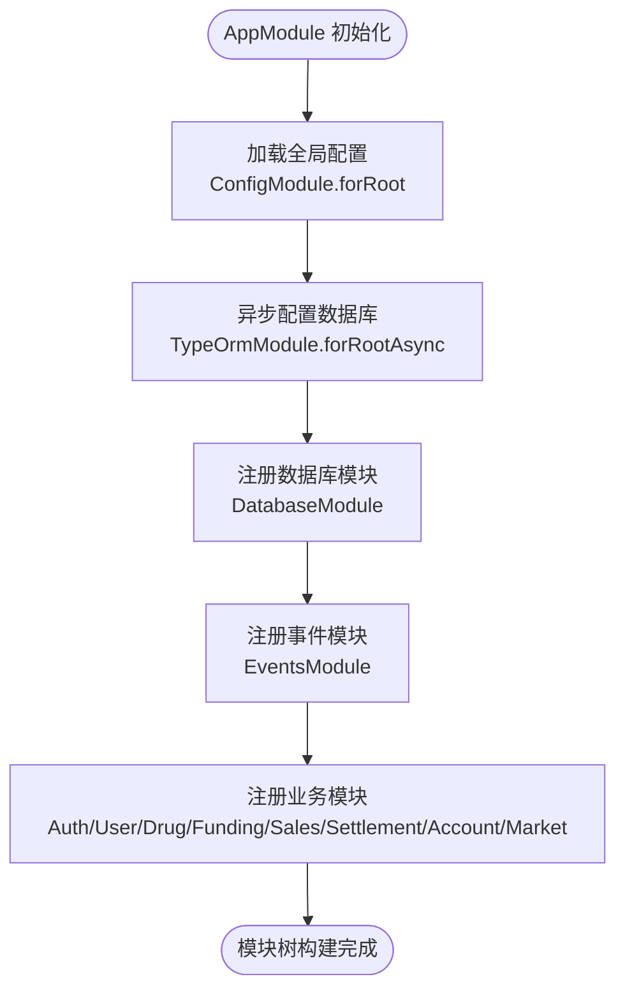
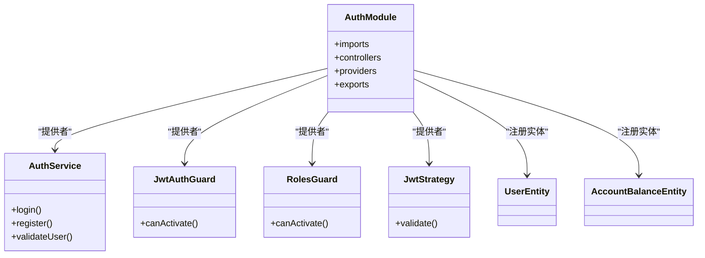
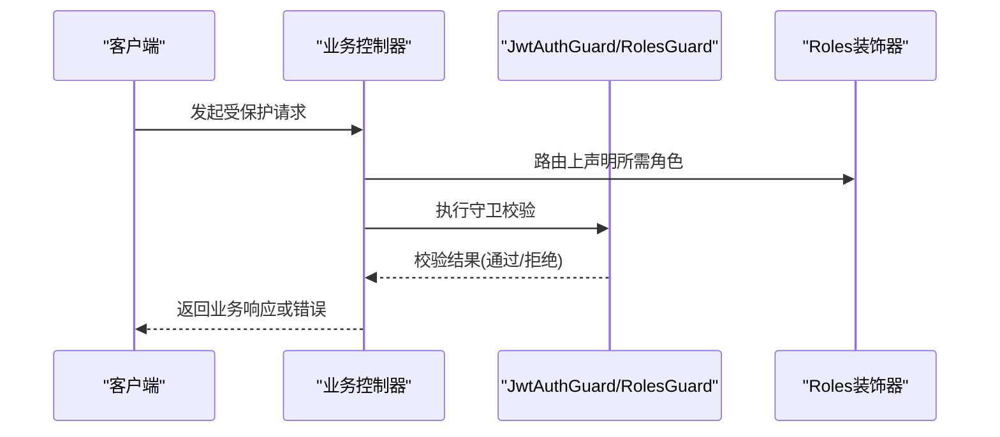
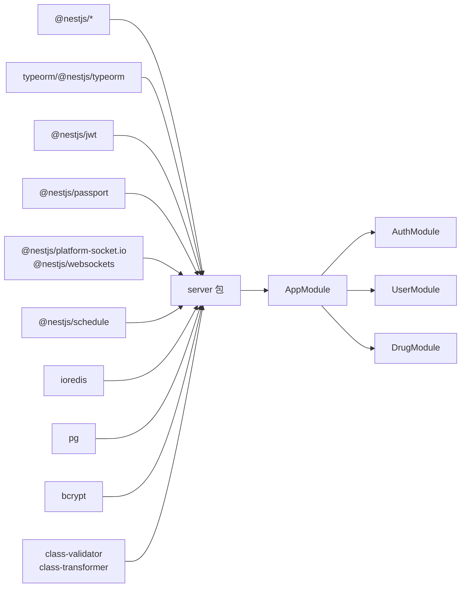

# NestJS框架基础

<cite>
**本文档引用的文件**
- [package.json](file://package.json)
- [pnpm-workspace.yaml](file://pnpm-workspace.yaml)
- [packages/server/src/app.module.ts](file://packages/server/src/app.module.ts)
- [packages/server/src/main.ts](file://packages/server/src/main.ts)
- [packages/server/src/modules/auth/auth.module.ts](file://packages/server/src/modules/auth/auth.module.ts)
- [packages/server/src/modules/user/user.module.ts](file://packages/server/src/modules/user/user.module.ts)
- [packages/server/src/modules/drug/drug.module.ts](file://packages/server/src/modules/drug/drug.module.ts)
- [packages/server/src/common/decorators/roles.decorator.ts](file://packages/server/src/common/decorators/roles.decorator.ts)
- [packages/server/src/common/guards/jwt-auth.guard.ts](file://packages/server/src/common/guards/jwt-auth.guard.ts)
- [packages/server/package.json](file://packages/server/package.json)
</cite>

## 目录
1. [引言](#引言)
2. [项目结构](#项目结构)
3. [核心组件](#核心组件)
4. [架构总览](#架构总览)
5. [详细组件分析](#详细组件分析)
6. [依赖分析](#依赖分析)
7. [性能考虑](#性能考虑)
8. [故障排除指南](#故障排除指南)
9. [结论](#结论)

## 引言
本文件面向Jiaoyi项目的NestJS后端服务，系统性梳理NestJS的核心概念与架构实践，重点覆盖以下主题：
- 模块(Module)、控制器(Controller)、服务(Service)的设计模式与职责边界
- 依赖注入(DI)机制的工作原理与配置方法
- 分层架构实现：表示层、业务层、数据访问层的划分
- 全局配置模块(ConfigModule)的使用与环境变量管理
- 模块导入/导出最佳实践与循环依赖规避策略
- 错误处理机制与生命周期钩子的使用建议

## 项目结构
Jiaoyi采用Monorepo组织，后端服务位于packages/server目录，通过Nest CLI生成的标准结构组织代码。根级脚本统一管理开发、构建与类型检查流程；工作区配置指向packages/*作为子包。

**图表来源**
- [pnpm-workspace.yaml:1-3](file://pnpm-workspace.yaml#L1-L3)
- [packages/server/src/app.module.ts:1-51](file://packages/server/src/app.module.ts#L1-L51)
- [packages/server/src/main.ts:1-29](file://packages/server/src/main.ts#L1-L29)

**章节来源**
- [package.json:1-24](file://package.json#L1-L24)
- [pnpm-workspace.yaml:1-3](file://pnpm-workspace.yaml#L1-L3)

## 核心组件
本节从NestJS三大核心构件入手，结合Jiaoyi实际模块进行说明。

- 模块(Module)
  - 作用：组织控制器、服务、提供者、守卫、装饰器等，形成可复用的功能单元。AppModule作为根模块，集中导入各业务模块与基础设施模块（如数据库、事件、配置）。
  - 关键点：模块间通过exports实现接口暴露，供其他模块按需导入；TypeOrmModule.forFeature用于注册实体到当前模块上下文。

- 控制器(Controller)
  - 作用：接收HTTP请求，调用对应服务处理业务逻辑，并返回响应。每个功能域通常对应一个控制器，例如AuthController、UserController、DrugController等。

- 服务(Service)
  - 作用：封装业务逻辑与数据访问细节，是模块内可注入的提供者。服务通过TypeORM仓库或直接操作实体实现数据持久化。

- 依赖注入(DI)
  - 作用：通过构造函数注入Provider实例，实现松耦合与可测试性。Nest在运行时解析依赖图并完成实例化。
  - 配置：在@Module注解中声明providers，在控制器或服务中通过constructor注入使用。

- 装饰器与守卫
  - 装饰器：如Roles装饰器用于在路由上标注所需角色元数据；守卫JwtAuthGuard、RolesGuard用于鉴权与授权。
  - 通用出口：common/guards与common/decorators提供跨模块共享能力，避免重复定义。

**章节来源**
- [packages/server/src/app.module.ts:15-50](file://packages/server/src/app.module.ts#L15-L50)
- [packages/server/src/modules/auth/auth.module.ts:14-33](file://packages/server/src/modules/auth/auth.module.ts#L14-L33)
- [packages/server/src/modules/user/user.module.ts:8-14](file://packages/server/src/modules/user/user.module.ts#L8-L14)
- [packages/server/src/modules/drug/drug.module.ts:8-14](file://packages/server/src/modules/drug/drug.module.ts#L8-L14)
- [packages/server/src/common/decorators/roles.decorator.ts:1-6](file://packages/server/src/common/decorators/roles.decorator.ts#L1-L6)
- [packages/server/src/common/guards/jwt-auth.guard.ts:1-3](file://packages/server/src/common/guards/jwt-auth.guard.ts#L1-L3)

## 架构总览
下图展示Jiaoyi后端的整体架构：应用入口负责初始化Nest应用、全局管道与CORS配置；根模块聚合所有业务模块与基础设施模块；业务模块各自包含控制器、服务与DTO；通用层提供装饰器与守卫；数据库层通过TypeORM连接PostgreSQL并执行迁移。

**图表来源**
- [packages/server/src/main.ts:6-27](file://packages/server/src/main.ts#L6-L27)
- [packages/server/src/app.module.ts:15-49](file://packages/server/src/app.module.ts#L15-L49)

## 详细组件分析

### 应用入口与全局配置
- 入口文件负责创建Nest应用实例、读取配置并设置全局管道与CORS。
- 全局验证管道启用白名单、自动转换与非白名单禁止，确保输入安全与一致性。
- CORS允许凭据与任意来源，便于前端跨域访问。

**图表来源**
- [packages/server/src/main.ts:6-27](file://packages/server/src/main.ts#L6-L27)

**章节来源**
- [packages/server/src/main.ts:1-29](file://packages/server/src/main.ts#L1-L29)

### 根模块与模块聚合
- 根模块AppModule集中导入配置模块(ConfigModule)、TypeORM配置(TypeOrmModule.forRootAsync)、数据库模块、事件模块以及所有业务模块(AuthModule、UserModule、DrugModule等)。
- ConfigModule.forRoot({ isGlobal: true })将配置服务设为全局可用，便于在其他模块通过ConfigService读取环境变量。

**图表来源**
- [packages/server/src/app.module.ts:15-49](file://packages/server/src/app.module.ts#L15-L49)

**章节来源**
- [packages/server/src/app.module.ts:1-51](file://packages/server/src/app.module.ts#L1-L51)

### 认证模块（AuthModule）
- 功能：提供Passport/JWT认证、用户登录/注册、角色控制等能力。
- 依赖注入：通过JwtModule.registerAsync从ConfigService读取JWT密钥与过期时间；TypeOrmModule.forFeature注册User与AccountBalance实体。
- 导出：AuthService、JwtAuthGuard、RolesGuard供其他模块使用。

**图表来源**
- [packages/server/src/modules/auth/auth.module.ts:14-33](file://packages/server/src/modules/auth/auth.module.ts#L14-L33)

**章节来源**
- [packages/server/src/modules/auth/auth.module.ts:1-34](file://packages/server/src/modules/auth/auth.module.ts#L1-L34)

### 用户模块（UserModule）
- 功能：用户相关业务，如查询、更新等。
- 设计：通过TypeOrmModule.forFeature注册User与AccountBalance实体；仅导出UserService，避免控制器泄露到其他模块。

**章节来源**
- [packages/server/src/modules/user/user.module.ts:1-15](file://packages/server/src/modules/user/user.module.ts#L1-L15)

### 药品模块（DrugModule）
- 功能：药品信息管理与市场快照关联。
- 设计：注册Drug与MarketSnapshot实体，导出DrugService。

**章节来源**
- [packages/server/src/modules/drug/drug.module.ts:1-15](file://packages/server/src/modules/drug/drug.module.ts#L1-L15)

### 角色装饰器与守卫
- 角色装饰器：通过SetMetadata在路由上标记所需角色列表，供RolesGuard读取并校验。
- 守卫出口：common/guards/jwt-auth.guard.ts导出JwtAuthGuard，便于跨模块统一使用。

**图表来源**
- [packages/server/src/common/decorators/roles.decorator.ts:1-6](file://packages/server/src/common/decorators/roles.decorator.ts#L1-L6)
- [packages/server/src/common/guards/jwt-auth.guard.ts:1-3](file://packages/server/src/common/guards/jwt-auth.guard.ts#L1-L3)

**章节来源**
- [packages/server/src/common/decorators/roles.decorator.ts:1-6](file://packages/server/src/common/decorators/roles.decorator.ts#L1-L6)
- [packages/server/src/common/guards/jwt-auth.guard.ts:1-3](file://packages/server/src/common/guards/jwt-auth.guard.ts#L1-L3)

## 依赖分析
- 外部依赖：NestJS核心、Config、TypeORM、Socket.IO、Schedule、JWT、Passport、Pg驱动、Redis、Bcrypt、Class-Validator/Transformer等。
- 内部模块依赖：业务模块通过exports向其他模块提供服务或守卫；通用层提供跨模块共享能力；根模块聚合所有模块。

**图表来源**
- [packages/server/package.json:26-52](file://packages/server/package.json#L26-L52)
- [packages/server/src/app.module.ts:15-49](file://packages/server/src/app.module.ts#L15-L49)

**章节来源**
- [packages/server/package.json:1-93](file://packages/server/package.json#L1-L93)

## 性能考虑
- 数据库连接与迁移：TypeOrmModule.forRootAsync支持延迟加载配置，生产环境关闭同步(synchronize=false)，启用迁移并自动执行(migrationsRun=true)。
- 日志级别：根据NODE_ENV动态开启日志，开发环境开启便于调试，生产环境关闭减少开销。
- 全局管道：ValidationPipe启用白名单与转换，减少无效参数进入业务逻辑，提升安全性与稳定性。
- CORS：允许凭据与任意来源，便于开发阶段联调，生产环境建议限制具体来源。

**章节来源**
- [packages/server/src/app.module.ts:21-37](file://packages/server/src/app.module.ts#L21-L37)
- [packages/server/src/main.ts:13-23](file://packages/server/src/main.ts#L13-L23)

## 故障排除指南
- 环境变量未生效
  - 确认ConfigModule.forRoot已设置为全局(isGlobal: true)，并在.env中正确配置键值。
  - 在需要读取配置的地方通过ConfigService.get(key)获取，默认值可作为第二参数提供。

- 数据库连接失败
  - 检查DB_HOST、DB_PORT、DB_USERNAME、DB_PASSWORD、DB_DATABASE是否正确。
  - 确认PostgreSQL服务可用且网络连通；生产环境应保持synchronize=false。

- JWT签发/校验异常
  - 确认JWT_SECRET与JWT_EXPIRES_IN已在环境变量中配置。
  - 检查JwtAuthGuard与RolesGuard是否正确导入并应用到路由。

- 循环依赖问题
  - 避免模块间直接相互import控制器或服务；通过exports暴露接口，其他模块按需导入。
  - 使用惰性导入或forwardRef（在复杂场景下）以打破循环。

- DTO校验失败
  - 确保ValidationPipe已作为全局管道注册。
  - 检查DTO字段的class-validator装饰器与class-transformer映射是否正确。

**章节来源**
- [packages/server/src/app.module.ts:17-37](file://packages/server/src/app.module.ts#L17-L37)
- [packages/server/src/main.ts:9-17](file://packages/server/src/main.ts#L9-L17)
- [packages/server/src/modules/auth/auth.module.ts:17-26](file://packages/server/src/modules/auth/auth.module.ts#L17-L26)

## 结论
Jiaoyi的NestJS后端遵循标准的模块化架构：根模块聚合业务与基础设施，业务模块按领域拆分，通用层提供跨模块共享能力。通过ConfigModule集中管理环境变量，TypeOrmModule实现数据访问抽象，全局ValidationPipe保障输入安全。模块的导入/导出与守卫/装饰器配合，形成清晰的鉴权与授权体系。遵循本文的最佳实践与排错建议，可在保证可维护性的前提下快速扩展新功能。