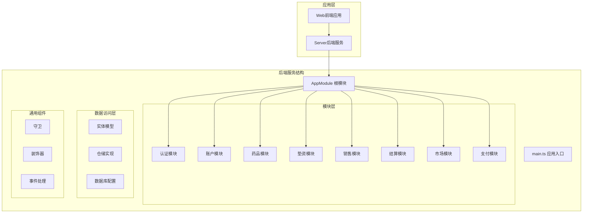
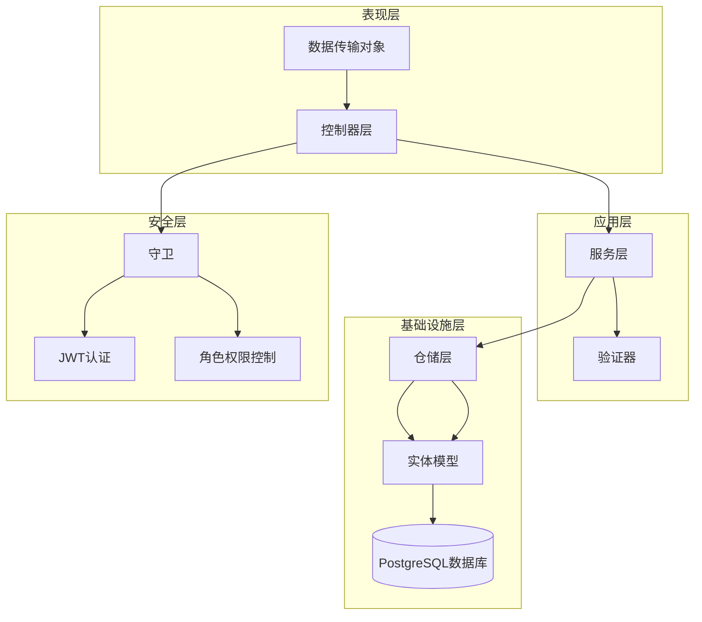
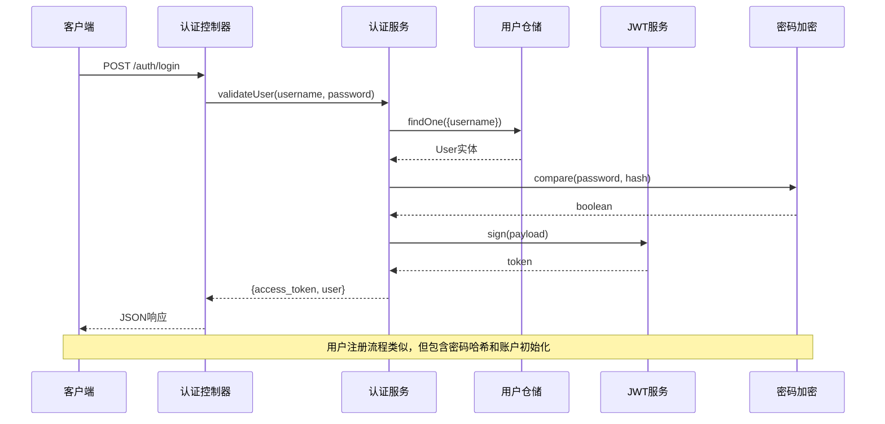
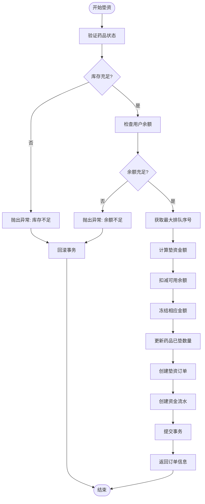
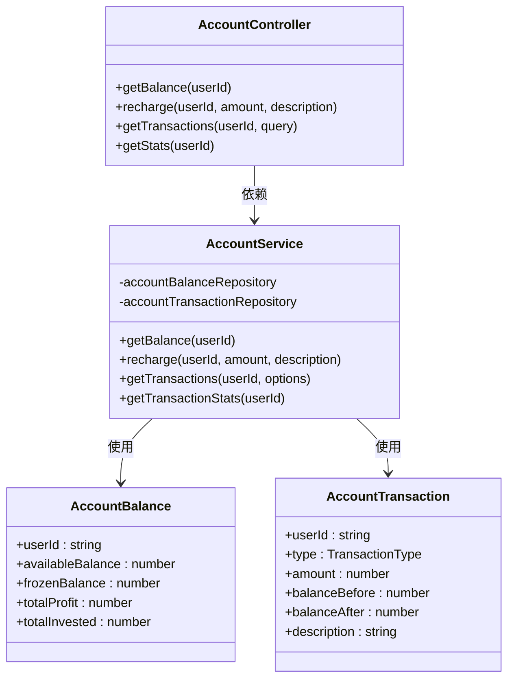
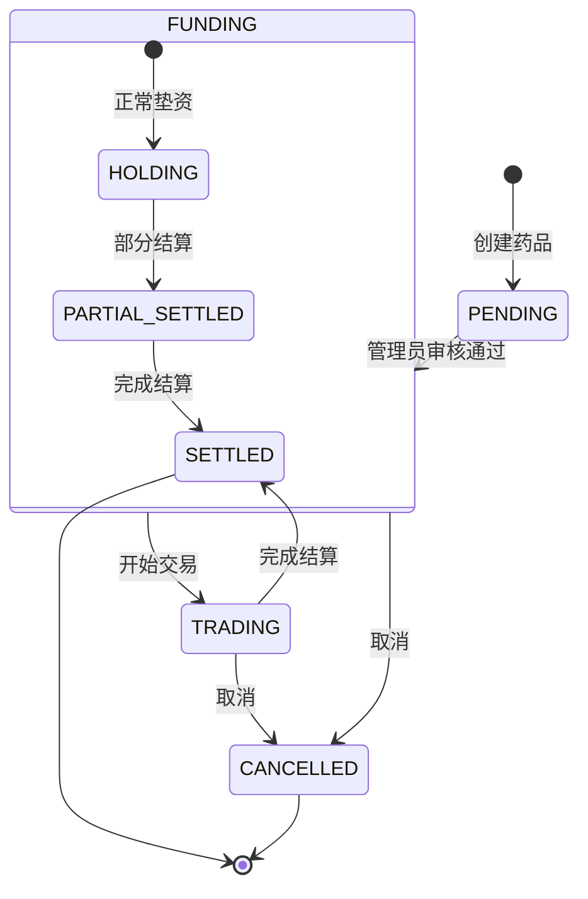
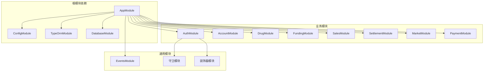
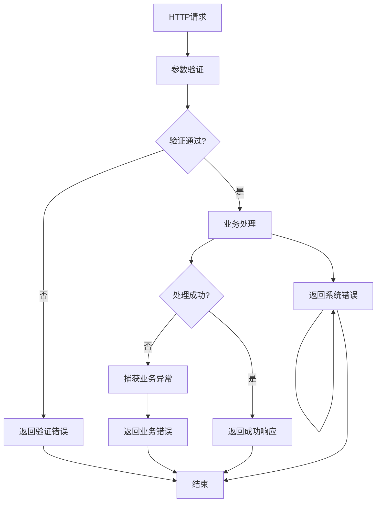

# 分层架构实现

<cite>
**本文档引用的文件**
- [main.ts](file://packages/server/src/main.ts)
- [app.module.ts](file://packages/server/src/app.module.ts)
- [account.controller.ts](file://packages/server/src/modules/account/account.controller.ts)
- [account.service.ts](file://packages/server/src/modules/account/account.service.ts)
- [auth.controller.ts](file://packages/server/src/modules/auth/auth.controller.ts)
- [auth.service.ts](file://packages/server/src/modules/auth/auth.service.ts)
- [drug.controller.ts](file://packages/server/src/modules/drug/drug.controller.ts)
- [drug.service.ts](file://packages/server/src/modules/drug/drug.service.ts)
- [funding.controller.ts](file://packages/server/src/modules/funding/funding.controller.ts)
- [funding.service.ts](file://packages/server/src/modules/funding/funding.service.ts)
- [sales.controller.ts](file://packages/server/src/modules/sales/sales.controller.ts)
- [sales.service.ts](file://packages/server/src/modules/sales/sales.service.ts)
</cite>

## 目录
1. [简介](#简介)
2. [项目结构](#项目结构)
3. [核心组件](#核心组件)
4. [架构概览](#架构概览)
5. [详细组件分析](#详细组件分析)
6. [依赖分析](#依赖分析)
7. [性能考虑](#性能考虑)
8. [故障排除指南](#故障排除指南)
9. [结论](#结论)

## 简介

Jiaoyi项目是一个基于NestJS的药品垫资交易平台，采用标准的三层架构设计。该项目通过清晰的分层架构实现了业务逻辑的分离，提供了完整的RESTful API接口，支持药品交易、资金管理和市场分析等功能。

本项目的核心目标是构建一个稳定、可扩展的药品垫资交易系统，通过分层架构确保代码的可维护性和可测试性。

## 项目结构

项目采用Monorepo结构，主要分为以下层次：

**图表来源**
- [main.ts:1-29](file://packages/server/src/main.ts#L1-L29)
- [app.module.ts:1-53](file://packages/server/src/app.module.ts#L1-L53)

**章节来源**
- [main.ts:1-29](file://packages/server/src/main.ts#L1-L29)
- [app.module.ts:1-53](file://packages/server/src/app.module.ts#L1-L53)

## 核心组件

### 控制器层（Controller Layer）

控制器层负责处理HTTP请求和响应格式化，每个模块都有对应的控制器来处理特定的业务操作。

#### 认证控制器
- 处理用户登录、注册、个人信息获取等认证相关操作
- 使用JWT令牌进行身份验证
- 支持用户名密码验证和JWT令牌签发

#### 账户控制器
- 管理用户账户余额和交易记录
- 提供余额查询、充值、交易历史查询等功能
- 集成JWT身份验证

#### 药品控制器
- 管理药品信息的增删改查操作
- 支持管理员权限控制
- 提供药品统计和历史收益率查询

#### 垫资控制器
- 处理药品垫资订单的创建和管理
- 实现复杂的业务逻辑和事务管理
- 提供排队队列和持仓摘要功能

#### 销售控制器
- 管理每日销售记录的创建、更新和删除
- 支持销售汇总和报表功能
- 集成管理员权限控制

### 服务层（Service Layer）

服务层封装了核心业务逻辑，是应用程序的主要执行单元。

#### 认证服务
- 用户身份验证和密码哈希处理
- JWT令牌生成和验证
- 用户注册和账户初始化

#### 账户服务
- 资金余额管理和交易记录
- 充值和转账业务逻辑
- 交易统计和分析

#### 药品服务
- 药品生命周期管理
- 状态转换和业务规则验证
- 历史数据查询和统计

#### 垫资服务
- 复杂的垫资业务流程
- 数据库事务管理和并发控制
- 排队算法和资金冻结机制

#### 销售服务
- 销售数据的完整性校验
- 清算状态检查和业务约束
- 销售汇总和统计计算

### 数据访问层（Data Access Layer）

数据访问层通过TypeORM实现数据持久化，提供统一的仓储模式。

#### 实体模型
- 定义数据库表结构和关系
- 包含用户、药品、订单、交易等核心实体
- 支持复杂查询和关联操作

#### 仓储实现
- 基于Repository的CRUD操作
- 复杂查询和聚合统计
- 数据验证和业务规则实现

**章节来源**
- [account.controller.ts:1-55](file://packages/server/src/modules/account/account.controller.ts#L1-L55)
- [auth.controller.ts:1-53](file://packages/server/src/modules/auth/auth.controller.ts#L1-L53)
- [drug.controller.ts:1-147](file://packages/server/src/modules/drug/drug.controller.ts#L1-L147)
- [funding.controller.ts:1-147](file://packages/server/src/modules/funding/funding.controller.ts#L1-L147)
- [sales.controller.ts:1-120](file://packages/server/src/modules/sales/sales.controller.ts#L1-L120)

## 架构概览

Jiaoyi项目采用经典的三层架构设计，每层都有明确的职责分工：

**图表来源**
- [main.ts:1-29](file://packages/server/src/main.ts#L1-L29)
- [app.module.ts:1-53](file://packages/server/src/app.module.ts#L1-L53)

### 控制器层职责

控制器层作为系统的入口点，负责：

1. **HTTP请求处理**：接收和解析客户端请求
2. **参数验证**：使用DTO进行输入参数验证
3. **响应格式化**：统一返回JSON格式的响应
4. **权限控制**：集成JWT和角色权限验证
5. **错误处理**：捕获和处理业务异常

### 服务层职责

服务层作为业务逻辑的核心，承担着：

1. **业务规则实现**：执行复杂的业务逻辑和算法
2. **事务管理**：协调多个数据操作的原子性
3. **数据转换**：在不同数据格式之间进行转换
4. **外部集成**：与第三方服务和API进行交互
5. **缓存策略**：实现数据缓存和性能优化

### 数据访问层职责

数据访问层提供数据持久化的抽象：

1. **数据映射**：将数据库记录映射到实体对象
2. **查询优化**：实现高效的数据库查询和索引
3. **连接管理**：管理数据库连接池和事务
4. **迁移管理**：处理数据库结构变更和版本升级
5. **数据一致性**：确保数据的完整性和一致性

**章节来源**
- [main.ts:1-29](file://packages/server/src/main.ts#L1-L29)
- [app.module.ts:1-53](file://packages/server/src/app.module.ts#L1-L53)

## 详细组件分析

### 认证模块分析

认证模块是整个系统安全的基础，实现了完整的用户身份验证流程。

**图表来源**
- [auth.controller.ts:12-23](file://packages/server/src/modules/auth/auth.controller.ts#L12-L23)
- [auth.service.ts:19-47](file://packages/server/src/modules/auth/auth.service.ts#L19-L47)

#### 认证流程特点

1. **密码安全**：使用bcrypt进行密码哈希存储
2. **JWT令牌**：生成短期有效的访问令牌
3. **用户信息脱敏**：返回响应时移除敏感信息
4. **权限验证**：支持角色权限控制

**章节来源**
- [auth.controller.ts:1-53](file://packages/server/src/modules/auth/auth.controller.ts#L1-L53)
- [auth.service.ts:1-100](file://packages/server/src/modules/auth/auth.service.ts#L1-L100)

### 垫资模块分析

垫资模块是最复杂的业务模块，实现了药品垫资的完整流程。

**图表来源**
- [funding.service.ts:52-178](file://packages/server/src/modules/funding/funding.service.ts#L52-L178)

#### 事务管理特点

1. **数据库事务**：使用QueryRunner确保操作原子性
2. **悲观锁**：对关键资源使用pessimistic_write锁
3. **并发控制**：通过排队序号实现公平的资源分配
4. **异常处理**：统一的异常捕获和回滚机制

**章节来源**
- [funding.controller.ts:1-147](file://packages/server/src/modules/funding/funding.controller.ts#L1-L147)
- [funding.service.ts:1-460](file://packages/server/src/modules/funding/funding.service.ts#L1-L460)

### 账户模块分析

账户模块提供了完整的资金管理功能。

**图表来源**
- [account.controller.ts:8-54](file://packages/server/src/modules/account/account.controller.ts#L8-L54)
- [account.service.ts:7-134](file://packages/server/src/modules/account/account.service.ts#L7-L134)

#### 业务逻辑特点

1. **余额管理**：实时计算和更新用户余额
2. **交易记录**：完整记录所有资金变动
3. **统计分析**：提供详细的财务统计信息
4. **数据一致性**：通过事务保证数据完整性

**章节来源**
- [account.controller.ts:1-55](file://packages/server/src/modules/account/account.controller.ts#L1-L55)
- [account.service.ts:1-135](file://packages/server/src/modules/account/account.service.ts#L1-L135)

### 药品模块分析

药品模块管理药品的全生命周期。

**图表来源**
- [drug.service.ts:31-47](file://packages/server/src/modules/drug/drug.service.ts#L31-L47)

#### 状态管理特点

1. **状态机设计**：清晰的状态转换规则
2. **权限控制**：不同状态下的操作权限
3. **业务规则**：状态转换的业务约束
4. **数据统计**：基于状态的统计分析

**章节来源**
- [drug.controller.ts:1-147](file://packages/server/src/modules/drug/drug.controller.ts#L1-L147)
- [drug.service.ts:1-280](file://packages/server/src/modules/drug/drug.service.ts#L1-L280)

## 依赖分析

项目采用模块化设计，各模块之间保持松耦合的依赖关系：

**图表来源**
- [app.module.ts:16-50](file://packages/server/src/app.module.ts#L16-L50)

### 依赖注入模式

项目广泛使用NestJS的依赖注入机制：

1. **构造函数注入**：在服务类中注入所需的依赖
2. **模块级注入**：在模块级别配置和共享依赖
3. **装饰器注入**：使用@CurrentUser等自定义装饰器
4. **仓储注入**：通过@injectRepository注入TypeORM仓库

### 循环依赖处理

项目通过合理的模块拆分避免了循环依赖：

- 控制器只依赖服务，不直接依赖其他控制器
- 服务之间通过接口和DTO进行通信
- 共享的业务逻辑提取到独立的服务中
- 实体模型在数据库模块中集中管理

**章节来源**
- [app.module.ts:1-53](file://packages/server/src/app.module.ts#L1-L53)

## 性能考虑

### 查询优化策略

1. **分页查询**：所有列表查询都支持分页，避免大数据量查询
2. **索引优化**：关键查询字段建立适当的数据库索引
3. **批量操作**：支持批量插入和更新操作
4. **缓存策略**：对频繁访问的数据实施缓存机制

### 事务管理优化

1. **最小事务范围**：尽量缩短事务持有时间
2. **死锁预防**：按固定顺序访问资源
3. **超时处理**：设置合理的事务超时时间
4. **重试机制**：对临时性失败实施重试策略

### 并发控制

1. **乐观锁**：对更新操作实施版本控制
2. **悲观锁**：对关键资源使用数据库锁
3. **队列机制**：通过排队序号控制并发访问
4. **分布式锁**：支持分布式环境下的并发控制

## 故障排除指南

### 常见异常类型

1. **业务异常**：如余额不足、库存不足等业务规则异常
2. **数据异常**：如重复数据、数据不存在等数据完整性异常
3. **系统异常**：如数据库连接失败、网络超时等系统级异常
4. **权限异常**：如未授权访问、权限不足等安全异常

### 错误处理机制

### 调试和监控

1. **日志记录**：详细的请求日志和业务日志
2. **性能监控**：关键操作的执行时间和成功率监控
3. **错误追踪**：异常堆栈和上下文信息记录
4. **健康检查**：数据库连接和外部服务可用性检查

**章节来源**
- [auth.service.ts:49-84](file://packages/server/src/modules/auth/auth.service.ts#L49-L84)
- [funding.service.ts:64-177](file://packages/server/src/modules/funding/funding.service.ts#L64-L177)
- [sales.service.ts:29-164](file://packages/server/src/modules/sales/sales.service.ts#L29-L164)

## 结论

Jiaoyi项目的分层架构设计体现了良好的软件工程实践，通过清晰的职责分离和模块化组织，实现了高内聚、低耦合的系统结构。

### 主要优势

1. **架构清晰**：三层架构层次分明，便于理解和维护
2. **职责明确**：每层都有明确的职责边界和接口定义
3. **可扩展性强**：模块化设计支持功能的灵活扩展
4. **可测试性好**：依赖注入和接口抽象便于单元测试
5. **安全性高**：完善的权限控制和数据验证机制

### 技术亮点

1. **事务管理**：复杂的垫资业务通过数据库事务保证数据一致性
2. **并发控制**：通过排队机制和锁机制实现公平的资源分配
3. **查询优化**：分页查询和索引优化确保系统性能
4. **异常处理**：统一的异常处理机制提升系统稳定性

### 改进建议

1. **微服务化**：随着业务增长，可考虑将部分模块拆分为独立服务
2. **缓存策略**：引入Redis等缓存技术提升查询性能
3. **消息队列**：对耗时操作使用异步处理提升用户体验
4. **监控告警**：完善APM监控和告警机制

通过持续的架构演进和技术优化，Jiaoyi项目将能够更好地支撑业务发展，为用户提供稳定可靠的药品垫资交易平台。