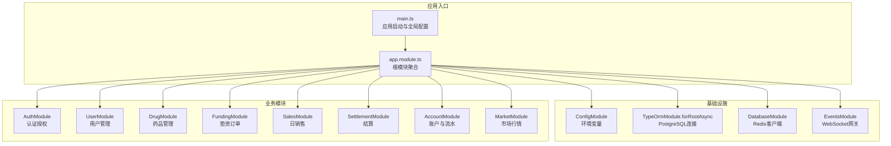
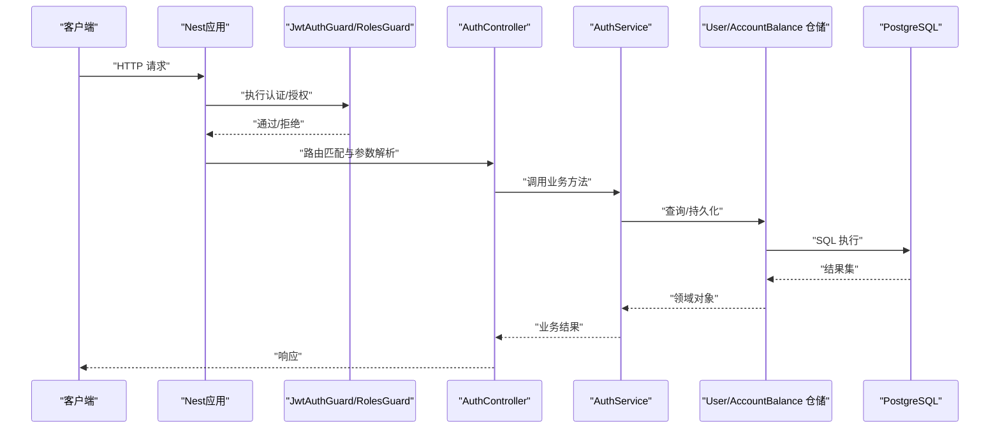
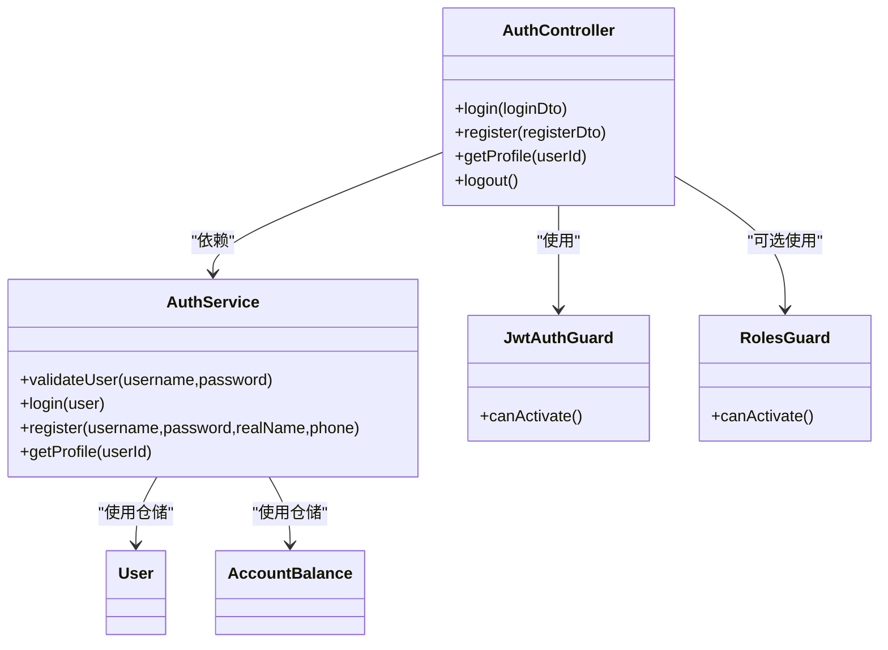
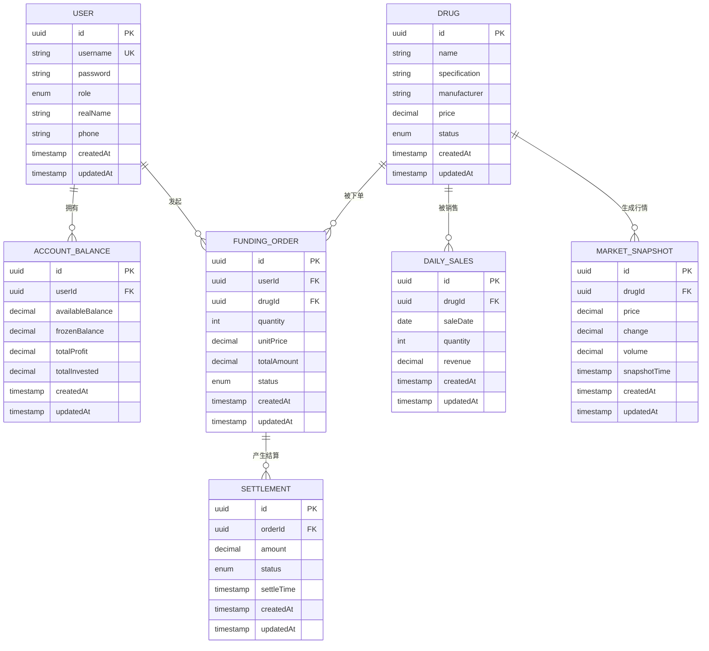
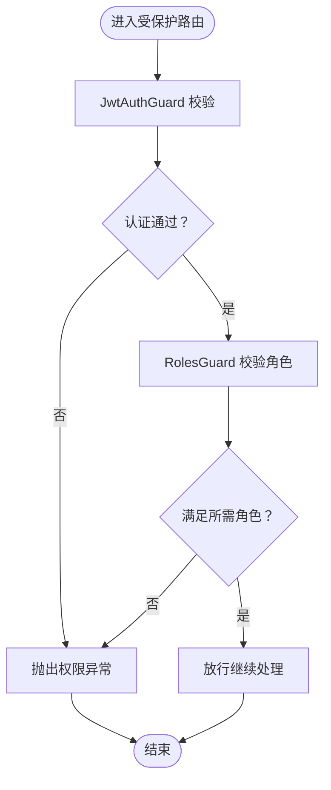
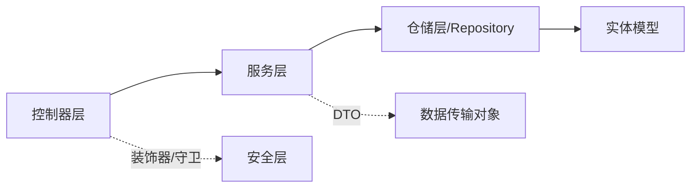
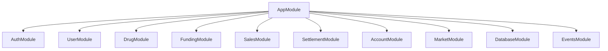

# 后端架构

<cite>
**本文引用的文件**
- [main.ts](file://packages/server/src/main.ts)
- [app.module.ts](file://packages/server/src/app.module.ts)
- [data-source.ts](file://packages/server/src/database/data-source.ts)
- [database.module.ts](file://packages/server/src/database/database.module.ts)
- [auth.module.ts](file://packages/server/src/modules/auth/auth.module.ts)
- [auth.service.ts](file://packages/server/src/modules/auth/auth.service.ts)
- [auth.controller.ts](file://packages/server/src/modules/auth/auth.controller.ts)
- [jwt-auth.guard.ts](file://packages/server/src/modules/auth/guards/jwt-auth.guard.ts)
- [roles.guard.ts](file://packages/server/src/modules/auth/guards/roles.guard.ts)
- [admin.guard.ts](file://packages/server/src/common/guards/admin.guard.ts)
- [roles.decorator.ts](file://packages/server/src/common/decorators/roles.decorator.ts)
- [events.module.ts](file://packages/server/src/common/events/events.module.ts)
- [events.gateway.ts](file://packages/server/src/common/events/events.gateway.ts)
- [user.entity.ts](file://packages/server/src/database/entities/user.entity.ts)
- [account-balance.entity.ts](file://packages/server/src/database/entities/account-balance.entity.ts)
- [drug.entity.ts](file://packages/server/src/database/entities/drug.entity.ts)
- [funding-order.entity.ts](file://packages/server/src/database/entities/funding-order.entity.ts)
- [daily-sales.entity.ts](file://packages/server/src/database/entities/daily-sales.entity.ts)
- [settlement.entity.ts](file://packages/server/src/database/entities/settlement.entity.ts)
- [market-snapshot.entity.ts](file://packages/server/src/database/entities/market-snapshot.entity.ts)
- [account.controller.ts](file://packages/server/src/modules/account/account.controller.ts)
- [account.service.ts](file://packages/server/src/modules/account/account.service.ts)
- [account.module.ts](file://packages/server/src/modules/account/account.module.ts)
- [user.controller.ts](file://packages/server/src/modules/user/user.controller.ts)
- [user.service.ts](file://packages/server/src/modules/user/user.service.ts)
- [user.module.ts](file://packages/server/src/modules/user/user.module.ts)
- [drug.controller.ts](file://packages/server/src/modules/drug/drug.controller.ts)
- [drug.service.ts](file://packages/server/src/modules/drug/drug.service.ts)
- [drug.module.ts](file://packages/server/src/modules/drug/drug.module.ts)
- [funding.controller.ts](file://packages/server/src/modules/funding/funding.controller.ts)
- [funding.service.ts](file://packages/server/src/modules/funding/funding.service.ts)
- [funding.module.ts](file://packages/server/src/modules/funding/funding.module.ts)
- [sales.controller.ts](file://packages/server/src/modules/sales/sales.controller.ts)
- [sales.service.ts](file://packages/server/src/modules/sales/sales.service.ts)
- [sales.module.ts](file://packages/server/src/modules/sales/sales.module.ts)
- [settlement.controller.ts](file://packages/server/src/modules/settlement/settlement.controller.ts)
- [settlement.service.ts](file://packages/server/src/modules/settlement/settlement.service.ts)
- [settlement.module.ts](file://packages/server/src/modules/settlement/settlement.module.ts)
- [market.controller.ts](file://packages/server/src/modules/market/market.controller.ts)
- [market.service.ts](file://packages/server/src/modules/market/market.service.ts)
- [market.module.ts](file://packages/server/src/modules/market/market.module.ts)
- [package.json](file://packages/server/package.json)
- [tsconfig.json](file://packages/server/tsconfig.json)
</cite>

## 目录
1. [简介](#简介)
2. [项目结构](#项目结构)
3. [核心组件](#核心组件)
4. [架构总览](#架构总览)
5. [详细组件分析](#详细组件分析)
6. [依赖分析](#依赖分析)
7. [性能考虑](#性能考虑)
8. [故障排查指南](#故障排查指南)
9. [结论](#结论)
10. [附录](#附录)

## 简介
本文件面向Jiaoyi项目的后端架构文档，围绕NestJS的模块化设计、依赖注入与分层架构展开，系统阐述业务模块组织、模块间依赖与通信机制；TypeORM数据库集成、实体关系映射与数据访问层设计；中间件、拦截器与守卫的安全机制；控制器层、服务层与仓储层职责划分；RESTful API设计原则与错误处理策略，并给出性能优化与扩展性设计方案。

## 项目结构
Jiaoyi采用Monorepo结构，后端位于packages/server目录，使用NestJS作为应用框架，TypeORM负责数据库访问，Redis用于缓存与事件推送，各业务模块按功能域拆分，遵循“按领域分模块”的组织方式。

图表来源
- [main.ts:1-29](file://packages/server/src/main.ts#L1-L29)
- [app.module.ts:1-51](file://packages/server/src/app.module.ts#L1-L51)

章节来源
- [main.ts:1-29](file://packages/server/src/main.ts#L1-L29)
- [app.module.ts:1-51](file://packages/server/src/app.module.ts#L1-L51)
- [package.json:1-24](file://packages/server/package.json#L1-L24)
- [tsconfig.json:1-17](file://packages/server/tsconfig.json#L1-L17)

## 核心组件
- 应用入口与全局配置：在应用启动时启用全局验证管道、CORS跨域支持，并通过ConfigService读取端口等运行参数。
- 根模块聚合：集中导入配置、数据库、事件、以及所有业务模块，形成统一的应用装配中心。
- 数据库模块：以全局Provider形式提供Redis客户端实例，供全应用共享；同时通过TypeORM进行PostgreSQL连接与迁移管理。
- 业务模块：每个业务域独立成模块，包含控制器、服务、DTO、守卫、策略与TypeORM实体/仓储，遵循清晰的分层与职责边界。

章节来源
- [main.ts:1-29](file://packages/server/src/main.ts#L1-L29)
- [app.module.ts:1-51](file://packages/server/src/app.module.ts#L1-L51)
- [database.module.ts:1-26](file://packages/server/src/database/database.module.ts#L1-L26)
- [data-source.ts:1-18](file://packages/server/src/database/data-source.ts#L1-L18)

## 架构总览
下图展示应用启动到请求处理的关键流程，包括模块装配、安全守卫、服务调用与数据库交互。

图表来源
- [main.ts:1-29](file://packages/server/src/main.ts#L1-L29)
- [auth.controller.ts:1-53](file://packages/server/src/modules/auth/auth.controller.ts#L1-L53)
- [auth.service.ts:1-100](file://packages/server/src/modules/auth/auth.service.ts#L1-L100)
- [auth.module.ts:1-34](file://packages/server/src/modules/auth/auth.module.ts#L1-L34)

## 详细组件分析

### 认证与授权模块（AuthModule）
- 职责：提供登录、注册、登出、个人资料查询等能力；封装JWT签发与校验、角色控制。
- 安全机制：Passport JWT策略与守卫；基于元数据的角色守卫；统一的异常处理。
- 依赖注入：JwtModule异步工厂注入ConfigService；TypeORM forFeature注册User与AccountBalance实体仓储；导出AuthService供其他模块复用。

图表来源
- [auth.controller.ts:1-53](file://packages/server/src/modules/auth/auth.controller.ts#L1-L53)
- [auth.service.ts:1-100](file://packages/server/src/modules/auth/auth.service.ts#L1-L100)
- [jwt-auth.guard.ts:1-6](file://packages/server/src/modules/auth/guards/jwt-auth.guard.ts#L1-L6)
- [roles.guard.ts:1-27](file://packages/server/src/modules/auth/guards/roles.guard.ts#L1-L27)

章节来源
- [auth.module.ts:1-34](file://packages/server/src/modules/auth/auth.module.ts#L1-L34)
- [auth.controller.ts:1-53](file://packages/server/src/modules/auth/auth.controller.ts#L1-L53)
- [auth.service.ts:1-100](file://packages/server/src/modules/auth/auth.service.ts#L1-L100)
- [jwt-auth.guard.ts:1-6](file://packages/server/src/modules/auth/guards/jwt-auth.guard.ts#L1-L6)
- [roles.guard.ts:1-27](file://packages/server/src/modules/auth/guards/roles.guard.ts#L1-L27)

### 数据访问层与实体模型
- 数据库连接：通过TypeORM forRootAsync加载PostgreSQL配置，扫描实体与迁移文件，关闭自动同步，生产环境开启日志开关。
- 实体设计：涵盖用户、账户余额、药品、垫资订单、日销售、结算、市场快照等核心业务实体，体现清晰的领域建模。
- 仓储模式：在模块内通过forFeature注册实体仓储，服务层以依赖注入方式获取Repository，实现数据访问与业务逻辑分离。

图表来源
- [app.module.ts:21-37](file://packages/server/src/app.module.ts#L21-L37)
- [user.entity.ts](file://packages/server/src/database/entities/user.entity.ts)
- [account-balance.entity.ts](file://packages/server/src/database/entities/account-balance.entity.ts)
- [drug.entity.ts](file://packages/server/src/database/entities/drug.entity.ts)
- [funding-order.entity.ts](file://packages/server/src/database/entities/funding-order.entity.ts)
- [daily-sales.entity.ts](file://packages/server/src/database/entities/daily-sales.entity.ts)
- [settlement.entity.ts](file://packages/server/src/database/entities/settlement.entity.ts)
- [market-snapshot.entity.ts](file://packages/server/src/database/entities/market-snapshot.entity.ts)

章节来源
- [app.module.ts:21-37](file://packages/server/src/app.module.ts#L21-L37)
- [data-source.ts:1-18](file://packages/server/src/database/data-source.ts#L1-L18)
- [database.module.ts:1-26](file://packages/server/src/database/database.module.ts#L1-L26)

### 通用安全机制（守卫与装饰器）
- JwtAuthGuard：基于Passport的JWT认证守卫，统一拦截受保护路由。
- RolesGuard：通过元数据声明所需角色集合，动态校验用户角色。
- AdminGuard：针对管理员权限的快速守卫实现，未登录或非管理员直接拒绝。
- 角色装饰器：提供便捷的@Roles装饰器用于标注控制器/方法所需角色。

图表来源
- [jwt-auth.guard.ts:1-6](file://packages/server/src/modules/auth/guards/jwt-auth.guard.ts#L1-L6)
- [roles.guard.ts:1-27](file://packages/server/src/modules/auth/guards/roles.guard.ts#L1-L27)
- [admin.guard.ts:1-32](file://packages/server/src/common/guards/admin.guard.ts#L1-L32)
- [roles.decorator.ts](file://packages/server/src/common/decorators/roles.decorator.ts)

章节来源
- [jwt-auth.guard.ts:1-6](file://packages/server/src/modules/auth/guards/jwt-auth.guard.ts#L1-L6)
- [roles.guard.ts:1-27](file://packages/server/src/modules/auth/guards/roles.guard.ts#L1-L27)
- [admin.guard.ts:1-32](file://packages/server/src/common/guards/admin.guard.ts#L1-L32)
- [roles.decorator.ts](file://packages/server/src/common/decorators/roles.decorator.ts)

### 业务模块分层与职责
- 控制器层（Controller）：定义REST接口、参数绑定、状态码与守卫使用，不直接处理业务逻辑。
- 服务层（Service）：封装业务规则、协调仓储与外部服务、处理事务边界与异常。
- 仓储层（Repository）：基于TypeORM的Repository抽象，提供类型安全的数据访问方法。
- DTO层：输入输出参数校验与转换，配合ValidationPipe进行白名单与转换。
- 模块层（Module）：聚合控制器、服务、守卫、策略、实体仓储，形成高内聚低耦合的业务单元。

图表来源
- [auth.controller.ts:1-53](file://packages/server/src/modules/auth/auth.controller.ts#L1-L53)
- [auth.service.ts:1-100](file://packages/server/src/modules/auth/auth.service.ts#L1-L100)
- [auth.module.ts:1-34](file://packages/server/src/modules/auth/auth.module.ts#L1-L34)

章节来源
- [auth.controller.ts:1-53](file://packages/server/src/modules/auth/auth.controller.ts#L1-L53)
- [auth.service.ts:1-100](file://packages/server/src/modules/auth/auth.service.ts#L1-L100)
- [auth.module.ts:1-34](file://packages/server/src/modules/auth/auth.module.ts#L1-L34)

### 公共模块与事件推送
- EventsModule：提供WebSocket网关，用于实时事件推送（如市场行情更新、订单状态变更等），提升用户体验与系统响应性。
- 事件网关：通过Gateway与Socket.IO风格的事件机制，向订阅者广播状态变化。

章节来源
- [events.module.ts](file://packages/server/src/common/events/events.module.ts)
- [events.gateway.ts](file://packages/server/src/common/events/events.gateway.ts)

## 依赖分析
- 模块耦合：根模块聚合所有子模块；业务模块彼此解耦，仅通过公共服务或实体间接交互。
- 外部依赖：PostgreSQL（TypeORM）、Redis（缓存/事件）、JWT（认证）、Bcrypt（密码哈希）。
- 循环依赖：当前结构避免了模块间的循环导入，通过服务导出与依赖注入降低耦合。

图表来源
- [app.module.ts:1-51](file://packages/server/src/app.module.ts#L1-L51)

章节来源
- [app.module.ts:1-51](file://packages/server/src/app.module.ts#L1-L51)

## 性能考虑
- 数据库层面
  - 使用连接池与只读查询分离，避免长事务占用连接。
  - 对高频查询建立合适索引，结合DTO分页与投影字段减少网络开销。
  - 迁移与同步分离，生产禁用自动同步，确保Schema演进可控。
- 缓存与事件
  - Redis用于热点数据缓存与会话存储，降低数据库压力。
  - WebSocket事件推送替代轮询，减少无效请求。
- 应用层面
  - 全局ValidationPipe启用白名单与转换，减少脏数据处理成本。
  - 按需懒加载模块与延迟初始化，缩短冷启动时间。
- 可扩展性
  - 业务模块独立部署与水平扩展，通过消息队列解耦异步任务。
  - API版本化与向后兼容策略，保障演进稳定性。

## 故障排查指南
- 认证失败
  - 检查JWT密钥与过期配置，确认客户端携带有效Token。
  - 排查JwtAuthGuard是否正确装配于受保护路由。
- 权限不足
  - 确认@Roles装饰器声明的角色集合与用户实际角色一致。
  - 检查RolesGuard反射元数据是否正确传递至守卫。
- 数据库连接问题
  - 核对环境变量与TypeORM配置，确认PostgreSQL可达且迁移已执行。
  - 生产环境关闭synchronize，使用迁移脚本管理Schema变更。
- Redis不可用
  - 检查Redis连接参数与网络连通性，确认DatabaseModule提供的Redis客户端可用。
- WebSocket事件未推送
  - 验证EventsModule装配与网关初始化，检查客户端连接状态与频道订阅。

章节来源
- [jwt-auth.guard.ts:1-6](file://packages/server/src/modules/auth/guards/jwt-auth.guard.ts#L1-L6)
- [roles.guard.ts:1-27](file://packages/server/src/modules/auth/guards/roles.guard.ts#L1-L27)
- [admin.guard.ts:1-32](file://packages/server/src/common/guards/admin.guard.ts#L1-L32)
- [app.module.ts:21-37](file://packages/server/src/app.module.ts#L21-L37)
- [database.module.ts:1-26](file://packages/server/src/database/database.module.ts#L1-L26)

## 结论
Jiaoyi后端以NestJS为核心，采用模块化与分层架构，结合TypeORM与Redis构建高性能、可扩展的业务系统。通过统一的认证授权体系与严格的DTO校验，保障系统的安全性与一致性。建议持续完善监控与可观测性、引入消息队列与缓存策略，进一步提升系统吞吐与稳定性。

## 附录
- RESTful设计原则
  - 资源命名使用名词复数，路径层级清晰，动词通过HTTP方法表达。
  - 统一状态码语义，错误响应包含明确的错误码与提示信息。
  - 分页查询与过滤参数标准化，支持排序与范围查询。
- 错误处理策略
  - 使用Nest内置异常类与自定义异常，结合拦截器统一格式化响应。
  - 区分业务异常与系统异常，避免泄露敏感信息。
- 开发与运维
  - 使用monorepo与pnpm工作区管理多包依赖，保持版本一致。
  - TypeScript严格模式与类型检查贯穿开发流程，提升代码质量。