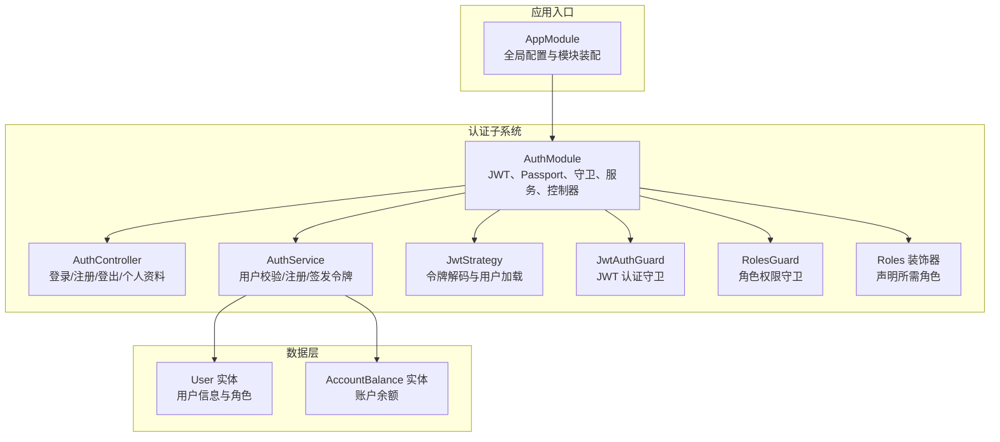
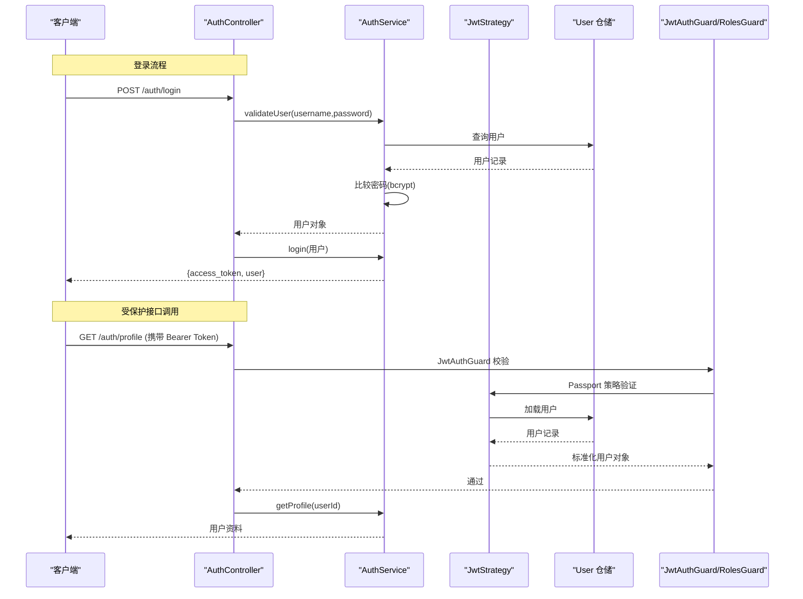
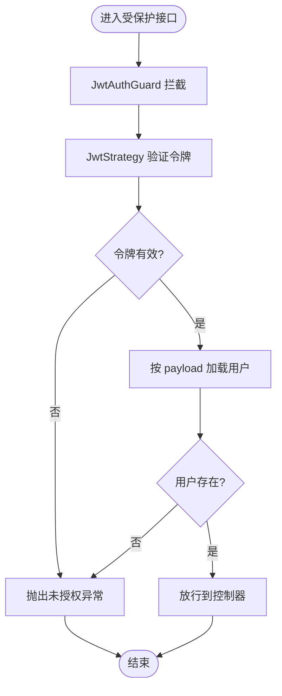
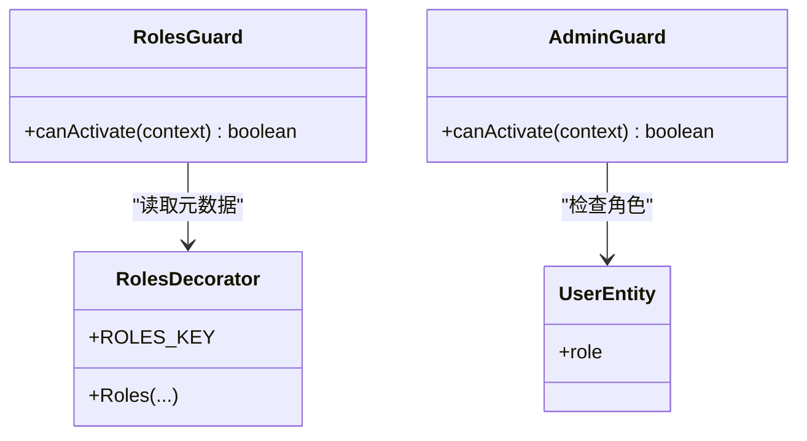
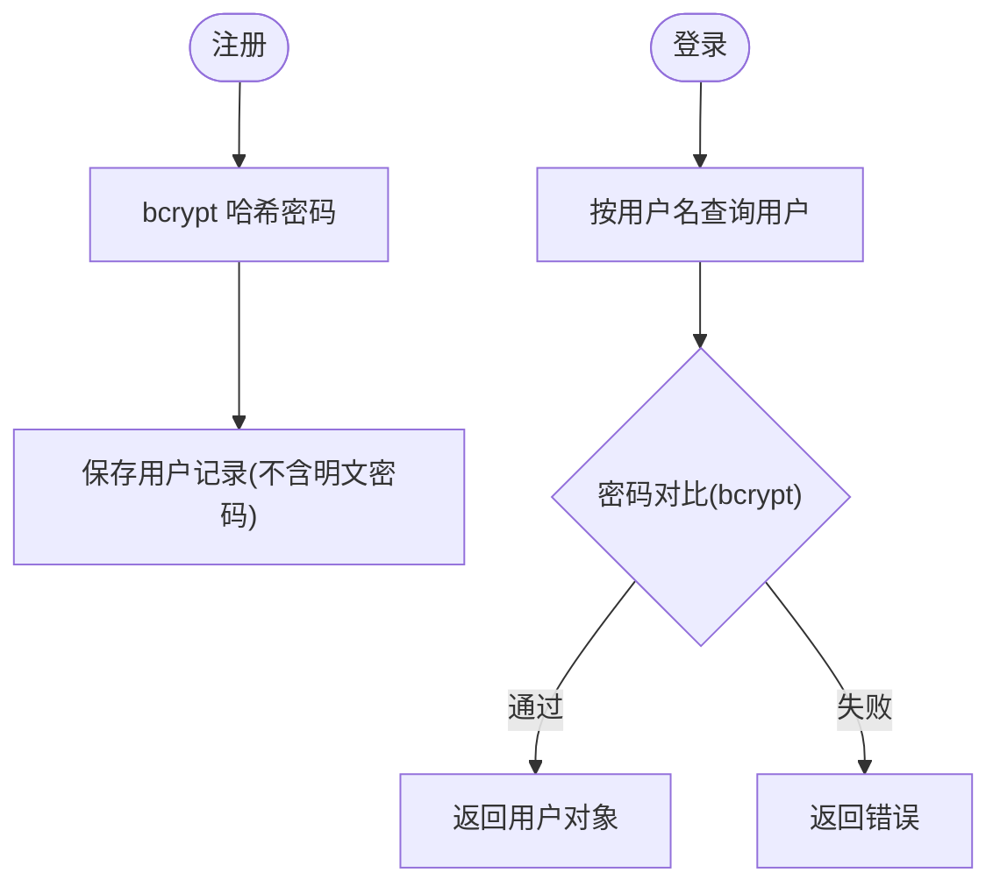
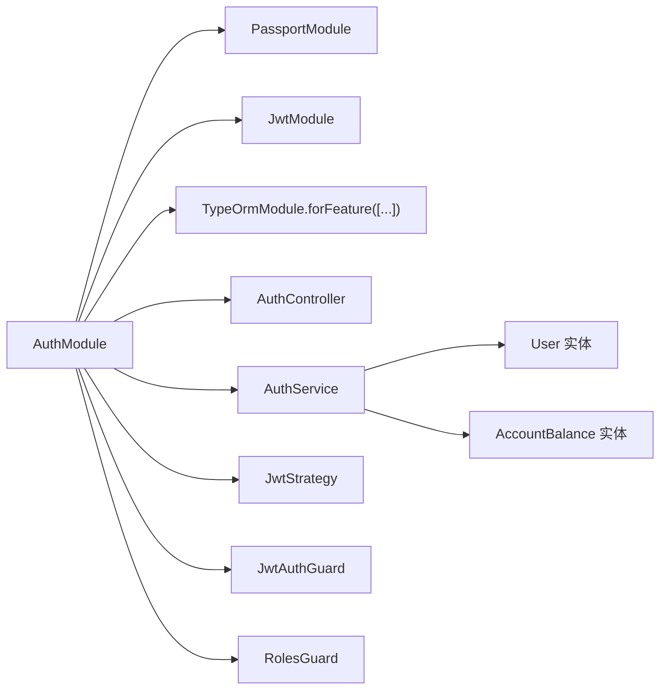

# 安全机制

<cite>
**本文引用的文件**
- [app.module.ts](file://packages/server/src/app.module.ts)
- [auth.module.ts](file://packages/server/src/modules/auth/auth.module.ts)
- [auth.controller.ts](file://packages/server/src/modules/auth/auth.controller.ts)
- [auth.service.ts](file://packages/server/src/modules/auth/auth.service.ts)
- [jwt.strategy.ts](file://packages/server/src/modules/auth/jwt.strategy.ts)
- [jwt-auth.guard.ts](file://packages/server/src/modules/auth/guards/jwt-auth.guard.ts)
- [roles.guard.ts](file://packages/server/src/modules/auth/guards/roles.guard.ts)
- [roles.decorator.ts](file://packages/server/src/common/decorators/roles.decorator.ts)
- [admin.guard.ts](file://packages/server/src/common/guards/admin.guard.ts)
- [user.entity.ts](file://packages/server/src/database/entities/user.entity.ts)
- [account-balance.entity.ts](file://packages/server/src/database/entities/account-balance.entity.ts)
</cite>

## 目录
1. [引言](#引言)
2. [项目结构](#项目结构)
3. [核心组件](#核心组件)
4. [架构总览](#架构总览)
5. [详细组件分析](#详细组件分析)
6. [依赖关系分析](#依赖关系分析)
7. [性能考量](#性能考量)
8. [故障排查指南](#故障排查指南)
9. [结论](#结论)
10. [附录](#附录)

## 引言
本文件系统性梳理 Jiaoyi 项目的安全机制，重点覆盖以下方面：
- JWT 令牌认证的实现原理与配置要点
- 用户角色管理与权限控制策略（含 JWT Auth Guard 与 Roles Guard 的使用）
- 密码加密存储与验证流程
- CSRF 防护与 XSS 攻击防范建议
- API 限流与防暴力破解策略
- 安全中间件与拦截器的实现指南
- 会话管理与令牌刷新机制
- 安全审计与日志记录最佳实践

本说明面向不同技术背景的读者，既提供高层概览，也给出可落地的实现参考。

## 项目结构
Jiaoyi 采用 NestJS 单体架构，安全相关能力集中在服务端 packages/server 中，核心模块包括：
- 应用入口与全局配置：AppModule
- 认证模块：AuthModule（包含控制器、服务、守卫、策略、DTO、装饰器）
- 数据模型：User、AccountBalance 等实体
- 公共守卫与装饰器：AdminGuard、Roles 装饰器等

图表来源
- [app.module.ts:16-52](file://packages/server/src/app.module.ts#L16-L52)
- [auth.module.ts:14-34](file://packages/server/src/modules/auth/auth.module.ts#L14-L34)
- [auth.controller.ts:8-53](file://packages/server/src/modules/auth/auth.controller.ts#L8-L53)
- [auth.service.ts:9-17](file://packages/server/src/modules/auth/auth.service.ts#L9-L17)
- [jwt.strategy.ts:9-21](file://packages/server/src/modules/auth/jwt.strategy.ts#L9-L21)
- [jwt-auth.guard.ts:4-5](file://packages/server/src/modules/auth/guards/jwt-auth.guard.ts#L4-L5)
- [roles.guard.ts:9-11](file://packages/server/src/modules/auth/guards/roles.guard.ts#L9-L11)
- [roles.decorator.ts:3-5](file://packages/server/src/common/decorators/roles.decorator.ts#L3-L5)
- [user.entity.ts](file://packages/server/src/database/entities/user.entity.ts)
- [account-balance.entity.ts](file://packages/server/src/database/entities/account-balance.entity.ts)

章节来源
- [app.module.ts:16-52](file://packages/server/src/app.module.ts#L16-L52)
- [auth.module.ts:14-34](file://packages/server/src/modules/auth/auth.module.ts#L14-L34)

## 核心组件
本节聚焦安全机制的关键构件及其职责：
- 认证模块装配：注册 Passport 默认策略为 jwt，异步配置 JWT 秘钥与过期时间，并注入用户与账户余额仓储
- JWT 策略：从 Authorization 头部解析 Bearer 令牌，校验签名与过期，加载用户并返回标准化用户对象
- 认证守卫：基于 Passport 的 JwtAuthGuard，统一拦截受保护路由
- 角色守卫与装饰器：通过反射读取控制器/方法上声明的角色元数据，进行角色匹配
- 管理员守卫：快速限定 admin 角色访问
- 认证服务：用户凭据校验、密码哈希与比较、JWT 签发、用户注册与账户初始化
- 控制器接口：登录、注册、登出、个人资料查询

章节来源
- [auth.module.ts:14-34](file://packages/server/src/modules/auth/auth.module.ts#L14-L34)
- [jwt.strategy.ts:9-38](file://packages/server/src/modules/auth/jwt.strategy.ts#L9-L38)
- [jwt-auth.guard.ts:4-5](file://packages/server/src/modules/auth/guards/jwt-auth.guard.ts#L4-L5)
- [roles.guard.ts:9-26](file://packages/server/src/modules/auth/guards/roles.guard.ts#L9-L26)
- [roles.decorator.ts:3-5](file://packages/server/src/common/decorators/roles.decorator.ts#L3-L5)
- [admin.guard.ts:13-31](file://packages/server/src/common/guards/admin.guard.ts#L13-L31)
- [auth.service.ts:9-99](file://packages/server/src/modules/auth/auth.service.ts#L9-L99)
- [auth.controller.ts:8-53](file://packages/server/src/modules/auth/auth.controller.ts#L8-L53)

## 架构总览
下图展示认证与授权在系统中的交互路径，涵盖令牌签发、验证、角色检查以及用户信息加载：

图表来源
- [auth.controller.ts:12-44](file://packages/server/src/modules/auth/auth.controller.ts#L12-L44)
- [auth.service.ts:19-47](file://packages/server/src/modules/auth/auth.service.ts#L19-L47)
- [jwt.strategy.ts:23-37](file://packages/server/src/modules/auth/jwt.strategy.ts#L23-L37)
- [jwt-auth.guard.ts:4-5](file://packages/server/src/modules/auth/guards/jwt-auth.guard.ts#L4-L5)
- [roles.guard.ts:13-25](file://packages/server/src/modules/auth/guards/roles.guard.ts#L13-L25)

## 详细组件分析

### JWT 令牌认证与配置
- 令牌签发
  - 使用 JwtService 对用户标识、用户名、角色等信息进行签名，生成 access_token
  - 返回结构包含 access_token 与用户简要信息
- 令牌验证
  - JwtStrategy 从 Authorization 头解析 Bearer 令牌
  - 校验签名与过期时间，失败时抛出未授权异常
  - 成功后根据 payload 加载用户并返回标准化用户对象
- 配置要点
  - JWT 秘钥与过期时间通过 ConfigService 注入
  - 过期时间默认值可在配置中调整
- 会话管理与刷新
  - 当前实现为无状态令牌，未内置刷新令牌逻辑
  - 建议引入刷新令牌（Refresh Token）与黑名单机制，以支持安全的令牌轮换

图表来源
- [jwt-auth.guard.ts:4-5](file://packages/server/src/modules/auth/guards/jwt-auth.guard.ts#L4-L5)
- [jwt.strategy.ts:16-37](file://packages/server/src/modules/auth/jwt.strategy.ts#L16-L37)
- [auth.controller.ts:40-44](file://packages/server/src/modules/auth/auth.controller.ts#L40-L44)

章节来源
- [auth.module.ts:17-26](file://packages/server/src/modules/auth/auth.module.ts#L17-L26)
- [auth.service.ts:31-47](file://packages/server/src/modules/auth/auth.service.ts#L31-L47)
- [jwt.strategy.ts:16-37](file://packages/server/src/modules/auth/jwt.strategy.ts#L16-L37)

### 用户角色管理与权限控制
- 角色枚举与实体
  - 用户实体包含角色字段，用于区分不同权限级别
- 角色装饰器
  - Roles(...) 装饰器用于在控制器或方法上声明所需角色
- 角色守卫
  - RolesGuard 通过 Reflector 读取元数据，判断当前用户角色是否满足要求
- 管理员守卫
  - AdminGuard 提供更直接的 admin 权限校验，未登录或非管理员将被拒绝

图表来源
- [roles.guard.ts:9-26](file://packages/server/src/modules/auth/guards/roles.guard.ts#L9-L26)
- [roles.decorator.ts:3-5](file://packages/server/src/common/decorators/roles.decorator.ts#L3-L5)
- [admin.guard.ts:13-31](file://packages/server/src/common/guards/admin.guard.ts#L13-L31)
- [user.entity.ts](file://packages/server/src/database/entities/user.entity.ts)

章节来源
- [roles.guard.ts:9-26](file://packages/server/src/modules/auth/guards/roles.guard.ts#L9-L26)
- [roles.decorator.ts:3-5](file://packages/server/src/common/decorators/roles.decorator.ts#L3-L5)
- [admin.guard.ts:13-31](file://packages/server/src/common/guards/admin.guard.ts#L13-L31)
- [user.entity.ts](file://packages/server/src/database/entities/user.entity.ts)

### 密码加密存储与验证
- 存储策略
  - 注册时使用 bcrypt 对明文密码进行哈希处理，仅保存哈希值
- 验证流程
  - 登录时先按用户名查询用户，再使用 bcrypt.compare 对比密码哈希
  - 校验通过后返回不含敏感字段的用户对象
- 安全建议
  - 使用足够高的成本因子（如 12+）
  - 定期轮换密钥与策略参数
  - 对密码重置流程增加二次验证

图表来源
- [auth.service.ts:49-85](file://packages/server/src/modules/auth/auth.service.ts#L49-L85)
- [auth.service.ts:19-29](file://packages/server/src/modules/auth/auth.service.ts#L19-L29)

章节来源
- [auth.service.ts:49-85](file://packages/server/src/modules/auth/auth.service.ts#L49-L85)
- [auth.service.ts:19-29](file://packages/server/src/modules/auth/auth.service.ts#L19-L29)

### CSRF 防护与 XSS 防范
- CSRF 防护建议
  - 启用 SameSite Cookie 策略（首选 Strict 或 Lax）
  - 在跨域场景下，结合后端 CORS 白名单与自定义 CSRF Token 机制
  - 对关键操作（修改密码、转账）强制二次校验
- XSS 防范建议
  - 前端对输出内容进行严格转义与白名单过滤
  - 后端响应头设置 Content-Security-Policy，限制脚本执行源
  - 对富文本输入进行严格的 HTML 过滤与标签剥离

[本节为通用安全建议，不直接分析具体文件]

### API 限流与防暴力破解
- 限流策略
  - 基于 IP 或用户维度进行速率限制（例如每分钟请求数）
  - 登录接口单独限流，失败次数过多临时封禁
- 防暴力破解
  - 登录失败计数与冷却时间
  - 引入验证码（图形/短信/邮件）作为额外校验
  - 多因子认证（MFA）增强登录安全

[本节为通用安全建议，不直接分析具体文件]

### 安全中间件与拦截器实现指南
- 自定义拦截器
  - 在请求进入业务逻辑前统一记录上下文信息（IP、UA、路由、用户标识）
  - 对敏感操作进行审计标记
- 全局异常过滤器
  - 将敏感错误细节屏蔽，仅返回通用提示
  - 记录堆栈与上下文以便追踪
- 安全校验
  - 在拦截器中集成参数校验与输入净化
  - 对文件上传与外部链接进行安全扫描

[本节为通用安全建议，不直接分析具体文件]

### 会话管理与令牌刷新机制
- 当前实现
  - 采用无状态 JWT，未内置刷新令牌与黑名单
- 推荐方案
  - 引入 Refresh Token：登录成功发放 Access Token 与 Refresh Token
  - 刷新流程：Access Token 过期时，使用 Refresh Token 申请新的 Access Token
  - 黑名单：撤销的 Refresh Token 纳入黑名单，防止复用
  - 安全存储：Refresh Token 仅在 HTTPS、HttpOnly、Secure Cookie 中传输

[本节为通用安全建议，不直接分析具体文件]

### 安全审计与日志记录最佳实践
- 审计范围
  - 登录/登出、权限变更、资金操作、敏感配置修改
- 日志规范
  - 结构化日志，包含时间戳、用户标识、IP、UA、操作类型、结果
  - 敏感字段脱敏（如密码、手机号掩码显示）
- 存储与检索
  - 分级存储（本地/集中式日志系统），保留周期合规
  - 建立查询与告警机制（异常登录、频繁失败、越权尝试）

[本节为通用安全建议，不直接分析具体文件]

## 依赖关系分析
认证模块内部依赖关系如下：

图表来源
- [auth.module.ts:14-34](file://packages/server/src/modules/auth/auth.module.ts#L14-L34)
- [auth.service.ts:9-17](file://packages/server/src/modules/auth/auth.service.ts#L9-L17)
- [user.entity.ts](file://packages/server/src/database/entities/user.entity.ts)
- [account-balance.entity.ts](file://packages/server/src/database/entities/account-balance.entity.ts)

章节来源
- [auth.module.ts:14-34](file://packages/server/src/modules/auth/auth.module.ts#L14-L34)

## 性能考量
- 密码哈希成本因子
  - 建议在生产环境提升至 12+，平衡安全与性能
- 数据库索引
  - 用户名建立唯一索引，加速登录查询
- 缓存策略
  - 对热点用户信息进行短期缓存，降低数据库压力
- 令牌大小
  - payload 字段尽量精简，避免过长载荷影响网络与解析性能

[本节提供一般性指导，不直接分析具体文件]

## 故障排查指南
- 常见问题定位
  - 令牌无效：检查 JWT_SECRET 是否正确、过期时间是否合理、请求头格式是否符合 Bearer 规范
  - 用户不存在：确认用户 ID 是否正确、数据库连接与迁移是否完成
  - 角色拒绝：核对控制器/方法上的角色声明与用户实际角色
- 错误处理
  - 未登录/权限不足：AdminGuard 与 RolesGuard 会抛出相应异常
  - 登录失败：AuthService.validateUser 返回空表示凭据错误
- 日志与监控
  - 开启详细日志，定位鉴权链路异常
  - 对异常登录与越权尝试建立告警

章节来源
- [jwt.strategy.ts:23-30](file://packages/server/src/modules/auth/jwt.strategy.ts#L23-L30)
- [admin.guard.ts:21-29](file://packages/server/src/common/guards/admin.guard.ts#L21-L29)
- [auth.service.ts:19-29](file://packages/server/src/modules/auth/auth.service.ts#L19-L29)

## 结论
Jiaoyi 的安全体系以 JWT 为核心，配合 Passport 与守卫实现认证与授权。当前实现具备基础的无状态令牌、角色控制与密码哈希机制。为进一步强化安全，建议补充：
- 刷新令牌与黑名单机制
- CSRF 与 XSS 防护策略
- API 限流与防暴力破解
- 完善的安全审计与日志体系
- 参数校验与输入净化的拦截器实现

[本节为总结性内容，不直接分析具体文件]

## 附录
- 关键实现位置参考
  - JWT 配置与过期时间：[auth.module.ts:17-26](file://packages/server/src/modules/auth/auth.module.ts#L17-L26)
  - 令牌解析与用户加载：[jwt.strategy.ts:16-37](file://packages/server/src/modules/auth/jwt.strategy.ts#L16-L37)
  - 登录与注册流程：[auth.controller.ts:12-38](file://packages/server/src/modules/auth/auth.controller.ts#L12-L38)
  - 密码哈希与校验：[auth.service.ts:49-85](file://packages/server/src/modules/auth/auth.service.ts#L49-L85), [auth.service.ts:19-29](file://packages/server/src/modules/auth/auth.service.ts#L19-L29)
  - 角色装饰器与守卫：[roles.decorator.ts:3-5](file://packages/server/src/common/decorators/roles.decorator.ts#L3-L5), [roles.guard.ts:9-26](file://packages/server/src/modules/auth/guards/roles.guard.ts#L9-L26)
  - 管理员守卫：[admin.guard.ts:13-31](file://packages/server/src/common/guards/admin.guard.ts#L13-L31)
  - 用户与账户实体：[user.entity.ts](file://packages/server/src/database/entities/user.entity.ts), [account-balance.entity.ts](file://packages/server/src/database/entities/account-balance.entity.ts)