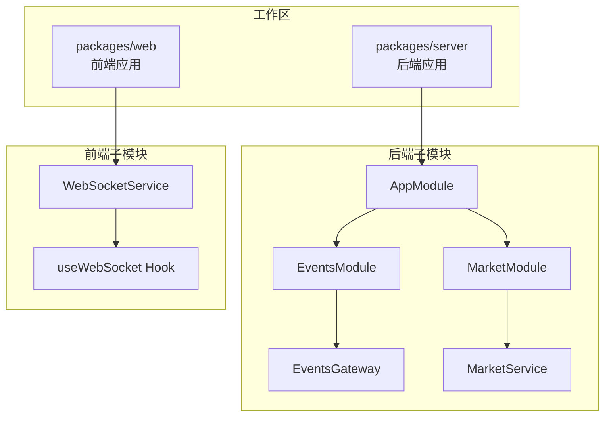
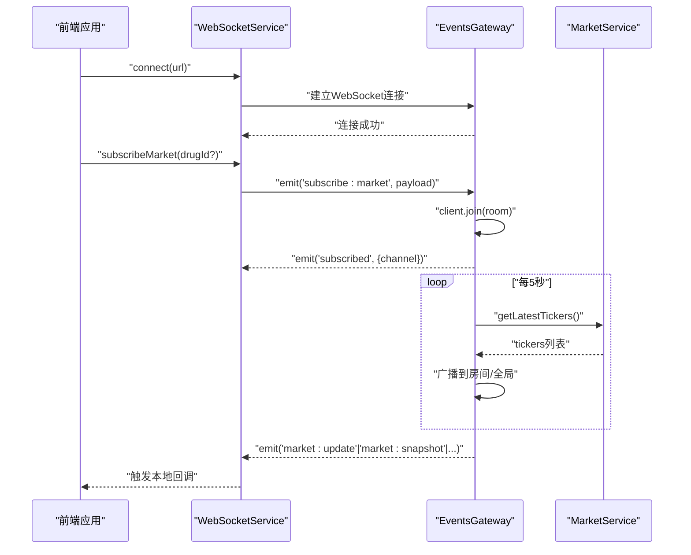
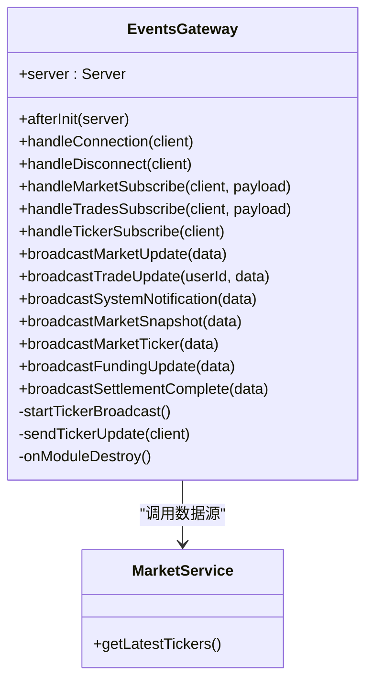
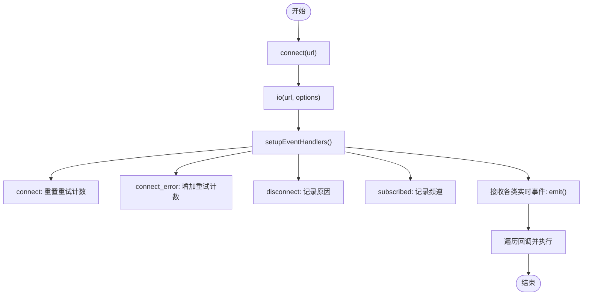
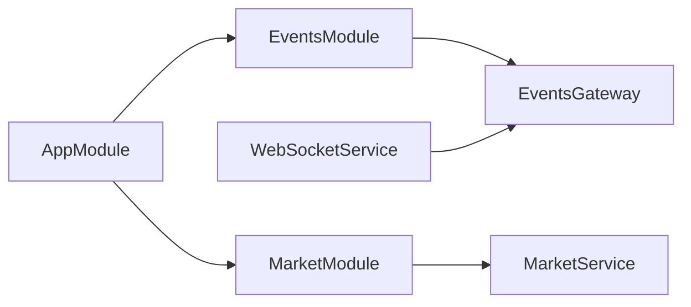

# 实时通信架构

<cite>
**本文档引用的文件**
- [package.json](file://package.json)
- [pnpm-workspace.yaml](file://pnpm-workspace.yaml)
- [app.module.ts](file://packages/server/src/app.module.ts)
- [events.gateway.ts](file://packages/server/src/common/events/events.gateway.ts)
- [events.module.ts](file://packages/server/src/common/events/events.module.ts)
- [market.module.ts](file://packages/server/src/modules/market/market.module.ts)
- [market.service.ts](file://packages/server/src/modules/market/market.service.ts)
- [jwt-auth.guard.ts](file://packages/server/src/common/guards/jwt-auth.guard.ts)
- [websocket.ts](file://packages/web/src/services/websocket.ts)
- [useWebSocket.ts](file://packages/web/src/hooks/useWebSocket.ts)
</cite>

## 目录
1. [简介](#简介)
2. [项目结构](#项目结构)
3. [核心组件](#核心组件)
4. [架构概览](#架构概览)
5. [详细组件分析](#详细组件分析)
6. [依赖关系分析](#依赖关系分析)
7. [性能考量](#性能考量)
8. [故障排查指南](#故障排查指南)
9. [结论](#结论)
10. [附录](#附录)

## 简介
本文件面向Jiaoyi项目的实时通信架构，重点阐述基于NestJS与Socket.IO的WebSocket网关（Events Gateway）实现原理、配置方法与运行机制；解释实时事件的发布订阅模式与消息路由；说明客户端连接管理、房间管理与广播策略；并提供性能优化、负载均衡、错误处理与重连机制、安全与权限控制以及实时监控与调试工具的实践指南。

## 项目结构
Jiaoyi采用Monorepo组织，通过工作区管理前后端包：
- packages/server：后端NestJS应用，包含WebSocket网关、业务模块与数据库集成
- packages/web：前端React应用，包含WebSocket客户端封装与React Hook

图表来源
- [pnpm-workspace.yaml:1-3](file://pnpm-workspace.yaml#L1-L3)
- [app.module.ts:1-53](file://packages/server/src/app.module.ts#L1-L53)
- [events.module.ts:1-15](file://packages/server/src/common/events/events.module.ts#L1-L15)
- [events.gateway.ts:1-165](file://packages/server/src/common/events/events.gateway.ts#L1-L165)
- [market.module.ts:1-26](file://packages/server/src/modules/market/market.module.ts#L1-L26)
- [market.service.ts:1-498](file://packages/server/src/modules/market/market.service.ts#L1-L498)
- [websocket.ts:1-187](file://packages/web/src/services/websocket.ts#L1-L187)
- [useWebSocket.ts:1-137](file://packages/web/src/hooks/useWebSocket.ts#L1-L137)

章节来源
- [pnpm-workspace.yaml:1-3](file://pnpm-workspace.yaml#L1-L3)
- [package.json:1-24](file://package.json#L1-L24)

## 核心组件
- WebSocket网关（EventsGateway）：负责Socket.IO服务器初始化、连接生命周期管理、订阅消息处理、定时广播与房间管理
- 事件模块（EventsModule）：装配ScheduleModule与MarketModule，导出EventsGateway
- 市场模块（MarketModule/MarketService）：提供实时行情数据源，支持定时获取最新tickers
- 前端WebSocket服务（WebSocketService）：封装socket.io-client，提供连接、断开、订阅、事件监听与重连机制
- React Hook（useWebSocket）：简化前端订阅流程，自动注册/注销事件监听器

章节来源
- [events.gateway.ts:1-165](file://packages/server/src/common/events/events.gateway.ts#L1-L165)
- [events.module.ts:1-15](file://packages/server/src/common/events/events.module.ts#L1-L15)
- [market.service.ts:470-496](file://packages/server/src/modules/market/market.service.ts#L470-L496)
- [websocket.ts:1-187](file://packages/web/src/services/websocket.ts#L1-L187)
- [useWebSocket.ts:1-137](file://packages/web/src/hooks/useWebSocket.ts#L1-L137)

## 架构概览
下图展示从客户端到服务端的实时通信路径，包括订阅、房间分发与定时广播：

图表来源
- [events.gateway.ts:48-74](file://packages/server/src/common/events/events.gateway.ts#L48-L74)
- [events.gateway.ts:126-143](file://packages/server/src/common/events/events.gateway.ts#L126-L143)
- [market.service.ts:470-496](file://packages/server/src/modules/market/market.service.ts#L470-L496)
- [websocket.ts:102-120](file://packages/web/src/services/websocket.ts#L102-L120)

## 详细组件分析

### WebSocket网关（EventsGateway）
- 网关配置
  - 命名空间：/ws
  - CORS：允许任意来源
- 生命周期钩子
  - 初始化：启动定时任务，周期性获取最新行情并广播
  - 连接/断开：记录日志
- 订阅消息
  - subscribe:market：加入drug:{id}房间或全局房间
  - subscribe:trades：加入user:{id}房间
  - subscribe:ticker：加入ticker房间，并立即推送一次当前行情
- 广播策略
  - 市场行情、快照、垫资、清算等事件分别广播至全局或对应房间
  - ticker广播同时向ticker房间与全局广播
- 资源清理
  - 模块销毁时清理定时器

图表来源
- [events.gateway.ts:15-165](file://packages/server/src/common/events/events.gateway.ts#L15-L165)
- [market.service.ts:470-496](file://packages/server/src/modules/market/market.service.ts#L470-L496)

章节来源
- [events.gateway.ts:15-74](file://packages/server/src/common/events/events.gateway.ts#L15-L74)
- [events.gateway.ts:76-124](file://packages/server/src/common/events/events.gateway.ts#L76-L124)
- [events.gateway.ts:126-163](file://packages/server/src/common/events/events.gateway.ts#L126-L163)

### 事件模块（EventsModule）
- 引入ScheduleModule以支持定时任务
- 引入MarketModule以访问MarketService
- 导出EventsGateway供AppModule装配

章节来源
- [events.module.ts:1-15](file://packages/server/src/common/events/events.module.ts#L1-L15)

### 市场模块与服务（MarketModule/MarketService）
- 提供getLatestTickers接口，用于定时广播的行情数据源
- 支持按药品维度聚合统计，便于房间级精准推送

章节来源
- [market.module.ts:1-26](file://packages/server/src/modules/market/market.module.ts#L1-L26)
- [market.service.ts:470-496](file://packages/server/src/modules/market/market.service.ts#L470-L496)

### 前端WebSocket服务（WebSocketService）
- 连接管理：支持URL配置、自动重连、最大重试次数与延迟
- 事件处理：统一设置连接、断开、错误、订阅确认与各类实时事件回调
- 订阅接口：market、trades、ticker订阅与取消
- 回调管理：内部维护事件监听器Map，支持添加/移除
- 状态查询：提供连接状态检查与socket实例获取

图表来源
- [websocket.ts:11-100](file://packages/web/src/services/websocket.ts#L11-L100)
- [websocket.ts:122-153](file://packages/web/src/services/websocket.ts#L122-L153)

章节来源
- [websocket.ts:1-187](file://packages/web/src/services/websocket.ts#L1-L187)

### React Hook（useWebSocket）
- 封装连接、断开、订阅与事件监听注册/注销
- 自动连接开关与连接状态轮询
- 钩子返回统一的API，便于组件使用

章节来源
- [useWebSocket.ts:1-137](file://packages/web/src/hooks/useWebSocket.ts#L1-L137)

## 依赖关系分析
- AppModule装配EventsModule与MarketModule，使EventsGateway可注入MarketService
- EventsGateway依赖ScheduleModule进行定时任务调度
- 前端通过socket.io-client与后端同名命名空间/ws通信

图表来源
- [app.module.ts:16-50](file://packages/server/src/app.module.ts#L16-L50)
- [events.module.ts:6-12](file://packages/server/src/common/events/events.module.ts#L6-L12)
- [events.gateway.ts:29-32](file://packages/server/src/common/events/events.gateway.ts#L29-L32)
- [websocket.ts:18](file://packages/web/src/services/websocket.ts#L18)

章节来源
- [app.module.ts:16-50](file://packages/server/src/app.module.ts#L16-L50)
- [events.module.ts:6-12](file://packages/server/src/common/events/events.module.ts#L6-L12)

## 性能考量
- 广播策略优化
  - 对于全局广播与房间广播分别处理，避免重复推送
  - ticker广播同时向ticker房间与全局，确保覆盖所有订阅者
- 数据聚合与批处理
  - 定时任务中批量获取最新tickers，减少数据库查询频率
- 房间粒度控制
  - 按药品与用户维度划分房间，降低广播规模
- 前端事件去抖
  - 在前端对高频事件进行节流/去抖处理，避免UI过度刷新

[本节为通用性能建议，无需特定文件引用]

## 故障排查指南
- 连接问题
  - 检查CORS配置与命名空间一致性
  - 确认前端URL与后端网关配置一致
- 订阅问题
  - 核对订阅事件名称与payload格式
  - 确认房间加入逻辑与事件广播目标一致
- 定时任务异常
  - 查看网关日志中的错误输出
  - 确保MarketService可用且无阻塞操作
- 前端重连
  - 检查最大重试次数与延迟参数
  - 关注connect_error事件，定位网络或认证问题

章节来源
- [events.gateway.ts:34-38](file://packages/server/src/common/events/events.gateway.ts#L34-L38)
- [events.gateway.ts:139-142](file://packages/server/src/common/events/events.gateway.ts#L139-L142)
- [websocket.ts:51-59](file://packages/web/src/services/websocket.ts#L51-L59)

## 结论
Jiaoyi的实时通信架构以NestJS与Socket.IO为核心，通过事件网关实现订阅、房间与广播的清晰分离；配合定时任务与服务层数据聚合，形成高效稳定的行情推送体系。前端提供统一的WebSocket服务与Hook，简化订阅与事件处理。后续可在认证、限流与负载均衡方面进一步增强。

[本节为总结性内容，无需特定文件引用]

## 附录

### 安全与权限控制
- 认证守卫
  - 通过JwtAuthGuard统一鉴权入口，建议在EventsGateway中结合认证守卫限制订阅与广播
- 权限边界
  - trades房间按userId隔离，market房间按drugId隔离，避免越权访问
- 传输安全
  - 建议在生产环境启用TLS与受控CORS白名单

章节来源
- [jwt-auth.guard.ts:1-2](file://packages/server/src/common/guards/jwt-auth.guard.ts#L1-L2)

### 负载均衡与扩展
- 多实例部署
  - 使用Redis适配器共享会话与房间状态
  - 通过反向代理实现粘性会话或无状态分发
- 广播一致性
  - 依赖外部存储或消息队列确保跨实例事件一致性

[本节为通用扩展建议，无需特定文件引用]

### 实时监控与调试
- 后端
  - 利用网关日志记录连接、断开与错误事件
  - 监控定时任务执行耗时与失败率
- 前端
  - 使用浏览器开发者工具观察WebSocket帧与事件回调
  - 在Hook中增加连接状态可视化与事件计数

[本节为通用运维建议，无需特定文件引用]