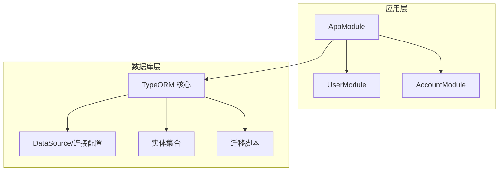
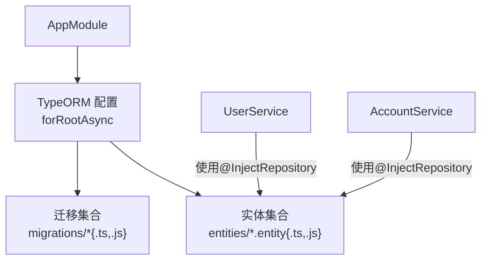
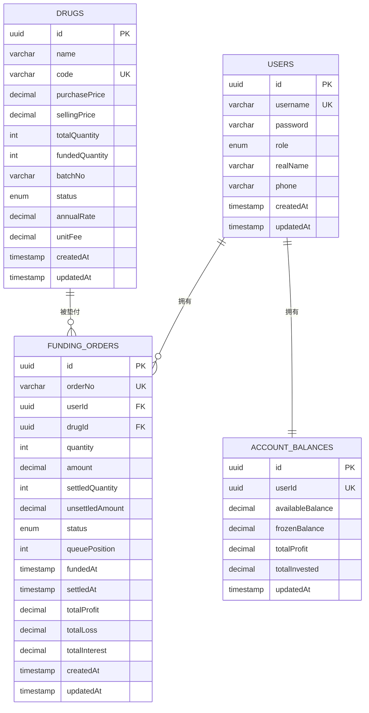
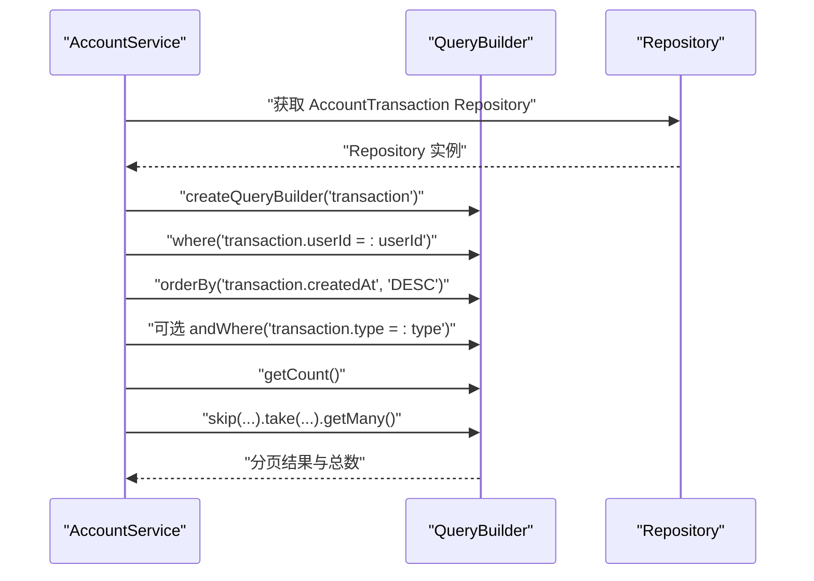
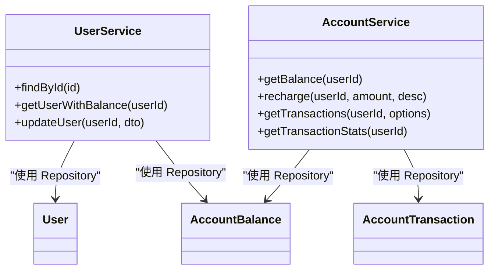
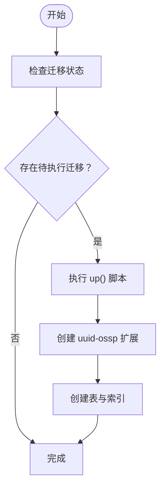
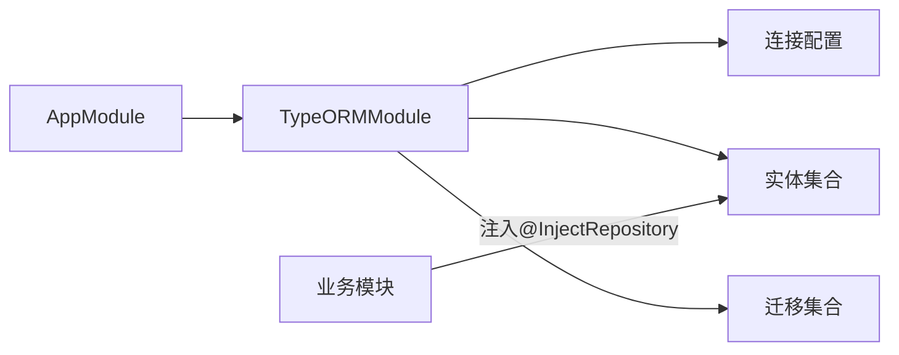

# 数据库集成

<cite>
**本文引用的文件**
- [packages/server/src/database/data-source.ts](file://packages/server/src/database/data-source.ts)
- [packages/server/src/database/database.module.ts](file://packages/server/src/database/database.module.ts)
- [packages/server/src/database/entities/index.ts](file://packages/server/src/database/entities/index.ts)
- [packages/server/src/database/entities/user.entity.ts](file://packages/server/src/database/entities/user.entity.ts)
- [packages/server/src/database/entities/drug.entity.ts](file://packages/server/src/database/entities/drug.entity.ts)
- [packages/server/src/database/entities/funding-order.entity.ts](file://packages/server/src/database/entities/funding-order.entity.ts)
- [packages/server/src/database/entities/account-balance.entity.ts](file://packages/server/src/database/entities/account-balance.entity.ts)
- [packages/server/src/database/migrations/1712160000000-InitialSchema.ts](file://packages/server/src/database/migrations/1712160000000-InitialSchema.ts)
- [packages/server/src/modules/user/user.service.ts](file://packages/server/src/modules/user/user.service.ts)
- [packages/server/src/modules/account/account.service.ts](file://packages/server/src/modules/account/account.service.ts)
- [packages/server/src/app.module.ts](file://packages/server/src/app.module.ts)
</cite>

## 目录
1. [简介](#简介)
2. [项目结构](#项目结构)
3. [核心组件](#核心组件)
4. [架构总览](#架构总览)
5. [详细组件分析](#详细组件分析)
6. [依赖分析](#依赖分析)
7. [性能考虑](#性能考虑)
8. [故障排查指南](#故障排查指南)
9. [结论](#结论)
10. [附录](#附录)

## 简介
本文件面向 Jiaoyi 项目的数据库集成，系统性说明 TypeORM 在 NestJS 中的集成配置与使用方式，涵盖实体定义、关系映射、数据注解、连接配置、连接池与事务处理、仓储模式与数据访问层设计、数据库迁移与版本管理、查询构建器（QueryBuilder）使用与性能优化，以及连接监控与故障处理机制。目标是帮助开发者快速理解并正确扩展数据库层功能。

## 项目结构
Jiaoyi 采用 monorepo 结构，数据库相关代码集中在 server 包中，主要由以下模块组成：
- 数据源与连接：通过 TypeORM 的 DataSource 或 forRootAsync 配置 PostgreSQL 连接，并加载实体与迁移文件。
- 实体与关系：在 entities 目录下定义业务实体及关系映射，统一导出便于模块引用。
- 迁移与种子：在 migrations 目录下维护数据库版本演进脚本；seeds 提供初始数据。
- 仓储与服务：在各业务模块的服务中使用 @InjectRepository 注入 Repository，实现数据访问层。
- 应用模块：AppModule 统一注册 TypeORM、数据库模块与业务模块。

图表来源
- [packages/server/src/app.module.ts:16-50](file://packages/server/src/app.module.ts#L16-L50)
- [packages/server/src/database/data-source.ts:7-17](file://packages/server/src/database/data-source.ts#L7-L17)

章节来源
- [packages/server/src/app.module.ts:16-50](file://packages/server/src/app.module.ts#L16-L50)
- [packages/server/src/database/data-source.ts:7-17](file://packages/server/src/database/data-source.ts#L7-L17)

## 核心组件
- 数据源与连接配置
  - 使用 TypeORM 的 forRootAsync 动态注入环境变量，配置 PostgreSQL 主机、端口、用户名、密码、数据库名、实体路径、迁移路径、是否自动同步、是否运行迁移、日志开关等。
  - 该配置位于应用模块中，确保全局可用。
- 实体与关系映射
  - 实体通过装饰器声明表结构、列类型、约束与枚举值。
  - 使用 OneToMany、ManyToOne、OneToOne 等装饰器建立实体间关系，并通过 JoinColumn 指定外键字段。
  - 关系字段在实体类中以属性形式暴露，便于查询时进行联表或懒加载。
- 查询构建器（QueryBuilder）
  - 在服务层通过 Repository.getQueryBuilder 获取 QueryBuilder，支持链式条件拼装、排序、分页、聚合统计等。
  - 常见用法包括按用户过滤、按类型筛选、分页查询、计数统计等。
- 仓储模式（Repository Pattern）
  - 通过 @InjectRepository 注入具体实体的 Repository，封装 CRUD 与复杂查询逻辑，提升可测试性与复用性。
- 迁移与版本管理
  - 迁移脚本以时间戳命名，包含 up/down 方法，按依赖顺序创建与回滚表结构与索引。
  - 运行迁移时会自动创建数据库扩展（如 uuid-ossp），并在 down 时按依赖逆序删除。

章节来源
- [packages/server/src/app.module.ts:22-38](file://packages/server/src/app.module.ts#L22-L38)
- [packages/server/src/database/entities/user.entity.ts:19-57](file://packages/server/src/database/entities/user.entity.ts#L19-L57)
- [packages/server/src/database/entities/drug.entity.ts:21-81](file://packages/server/src/database/entities/drug.entity.ts#L21-L81)
- [packages/server/src/database/entities/funding-order.entity.ts:21-86](file://packages/server/src/database/entities/funding-order.entity.ts#L21-L86)
- [packages/server/src/database/entities/account-balance.entity.ts:11-37](file://packages/server/src/database/entities/account-balance.entity.ts#L11-L37)
- [packages/server/src/database/migrations/1712160000000-InitialSchema.ts:6-228](file://packages/server/src/database/migrations/1712160000000-InitialSchema.ts#L6-L228)

## 架构总览
下图展示应用模块如何初始化 TypeORM、加载实体与迁移，并在业务模块中通过仓储访问数据库。

图表来源
- [packages/server/src/app.module.ts:22-38](file://packages/server/src/app.module.ts#L22-L38)
- [packages/server/src/modules/user/user.service.ts:10-15](file://packages/server/src/modules/user/user.service.ts#L10-L15)
- [packages/server/src/modules/account/account.service.ts:9-14](file://packages/server/src/modules/account/account.service.ts#L9-L14)

## 详细组件分析

### 实体与关系映射
- 用户（User）
  - 字段：主键（UUID）、唯一用户名、密码、角色枚举、实名与电话、创建与更新时间。
  - 关系：一对多（资金订单）、一对一（账户余额）、一对多（账户流水）。
- 药品（Drug）
  - 字段：名称、唯一编码、采购价、销售价、总量、已垫付数量、批次号、状态枚举、年化利率、单位费用、创建与更新时间。
  - 关系：一对多（资金订单）、一对多（日销售）、一对多（结算）、一对多（市场快照）。
- 资金订单（FundingOrder）
  - 字段：唯一订单号、用户ID、药品ID、数量、金额、已结算数量、未结算金额、状态枚举、队列位置、垫付时间、结算时间、累计收益/亏损/利息、创建与更新时间。
  - 关系：多对一（用户）、多对一（药品）。
- 账户余额（AccountBalance）
  - 字段：用户ID（唯一）、可用余额、冻结余额、累计收益、累计投资、更新时间。
  - 关系：一对一（用户）。
- 其他实体（AccountTransaction、DailySales、Settlement、MarketSnapshot、PaymentOrder）在迁移脚本中定义，包含相应字段与索引。

图表来源
- [packages/server/src/database/entities/user.entity.ts:19-57](file://packages/server/src/database/entities/user.entity.ts#L19-L57)
- [packages/server/src/database/entities/drug.entity.ts:21-81](file://packages/server/src/database/entities/drug.entity.ts#L21-L81)
- [packages/server/src/database/entities/funding-order.entity.ts:21-86](file://packages/server/src/database/entities/funding-order.entity.ts#L21-L86)
- [packages/server/src/database/entities/account-balance.entity.ts:11-37](file://packages/server/src/database/entities/account-balance.entity.ts#L11-L37)

章节来源
- [packages/server/src/database/entities/user.entity.ts:19-57](file://packages/server/src/database/entities/user.entity.ts#L19-L57)
- [packages/server/src/database/entities/drug.entity.ts:21-81](file://packages/server/src/database/entities/drug.entity.ts#L21-L81)
- [packages/server/src/database/entities/funding-order.entity.ts:21-86](file://packages/server/src/database/entities/funding-order.entity.ts#L21-L86)
- [packages/server/src/database/entities/account-balance.entity.ts:11-37](file://packages/server/src/database/entities/account-balance.entity.ts#L11-L37)

### 查询构建器（QueryBuilder）使用与性能优化
- 分页查询
  - 在账户流水查询中，通过 QueryBuilder 链式组装 where 条件、排序、分页参数，并使用 getCount 计算总数，实现分页返回。
- 条件筛选
  - 支持按用户ID过滤、按交易类型筛选，动态拼接 where 子句。
- 聚合统计
  - 使用 select('SUM(t.amount)', 'total') 对充值与垫付金额进行求和统计，结合 where 与 andWhere 实现精确统计。
- 性能优化建议
  - 为高频查询字段建立联合索引（如资金订单的 drugId+status+fundedAt，日销售的 drugId+saleDate，结算的 drugId+settlementDate，账户流水的 userId+createdAt，市场快照的 drugId+snapshotDate）。
  - 使用 select('COUNT(*)') 或 getCount 替代全量加载，减少内存占用。
  - 合理设置分页大小，避免超大偏移导致的性能问题。

图表来源
- [packages/server/src/modules/account/account.service.ts:69-104](file://packages/server/src/modules/account/account.service.ts#L69-L104)

章节来源
- [packages/server/src/modules/account/account.service.ts:69-133](file://packages/server/src/modules/account/account.service.ts#L69-L133)

### 仓储模式（Repository Pattern）实现
- 注入与使用
  - 在服务构造函数中通过 @InjectRepository 注入对应实体的 Repository，封装数据访问逻辑。
- 常见操作
  - 单条查询：findOne（带 where 条件）。
  - 更新：update（按主键更新指定字段）。
  - 创建与保存：create + save（用于初始化默认余额等场景）。
- 错误处理
  - 当查询不到记录时抛出 NotFoundException，保证上层调用明确感知资源缺失。

图表来源
- [packages/server/src/modules/user/user.service.ts:10-65](file://packages/server/src/modules/user/user.service.ts#L10-L65)
- [packages/server/src/modules/account/account.service.ts:9-134](file://packages/server/src/modules/account/account.service.ts#L9-L134)

章节来源
- [packages/server/src/modules/user/user.service.ts:10-65](file://packages/server/src/modules/user/user.service.ts#L10-L65)
- [packages/server/src/modules/account/account.service.ts:9-134](file://packages/server/src/modules/account/account.service.ts#L9-L134)

### 数据库连接配置、连接池与事务处理
- 连接配置
  - 通过 TypeORM 的 forRootAsync 从 ConfigService 注入环境变量，配置 PostgreSQL 连接参数、实体与迁移路径、是否自动同步、是否执行迁移、日志开关等。
- 连接池
  - TypeORM 默认使用连接池，可通过额外配置项（如最大连接数、空闲超时等）进一步细化，但当前仓库未显式配置。
- 事务处理
  - 项目未直接展示显式事务 API 使用示例；在需要强一致性的批量写入场景（如充值与流水同时落库），建议使用 QueryRunner 或在 Repository 层使用事务上下文，确保原子性。

章节来源
- [packages/server/src/app.module.ts:22-38](file://packages/server/src/app.module.ts#L22-L38)

### 迁移策略与版本管理
- 迁移脚本
  - 采用时间戳命名（如 1712160000000-InitialSchema.ts），包含 up/down 方法，按依赖顺序创建与删除表、索引与数据库扩展（uuid-ossp）。
- 版本演进
  - 新增表或修改现有表时，应新增迁移文件，保持 down 可回滚，确保生产环境安全升级。
- 初始化与开发
  - 开发环境可启用 migrationsRun=true，启动时自动执行迁移；生产环境建议通过 CI/CD 控制迁移执行。

图表来源
- [packages/server/src/database/migrations/1712160000000-InitialSchema.ts:6-228](file://packages/server/src/database/migrations/1712160000000-InitialSchema.ts#L6-L228)

章节来源
- [packages/server/src/database/migrations/1712160000000-InitialSchema.ts:6-228](file://packages/server/src/database/migrations/1712160000000-InitialSchema.ts#L6-L228)

### 数据注解与实体导出
- 实体导出
  - entities/index.ts 统一导出常用实体与枚举，便于模块间共享引用，降低导入分散度。
- 注解要点
  - 主键：@PrimaryGeneratedColumn('uuid') 使用 UUID。
  - 唯一约束：@Column({ unique: true })。
  - 枚举：@Column({ type: 'enum', enum: Enum })。
  - 时间列：@CreateDateColumn()、@UpdateDateColumn()。
  - 关系：@OneToMany、@ManyToOne、@OneToOne 并配合 @JoinColumn 指定外键。

章节来源
- [packages/server/src/database/entities/index.ts:1-10](file://packages/server/src/database/entities/index.ts#L1-L10)
- [packages/server/src/database/entities/user.entity.ts:24-35](file://packages/server/src/database/entities/user.entity.ts#L24-L35)
- [packages/server/src/database/entities/drug.entity.ts:29-58](file://packages/server/src/database/entities/drug.entity.ts#L29-L58)
- [packages/server/src/database/entities/funding-order.entity.ts:27-52](file://packages/server/src/database/entities/funding-order.entity.ts#L27-L52)

## 依赖分析
- 模块耦合
  - AppModule 作为入口，集中注册 TypeORM、数据库模块与业务模块，形成清晰的依赖层次。
  - 业务模块（如 UserModule、AccountModule）通过 @InjectRepository 使用仓储，不直接依赖底层连接，降低耦合。
- 外部依赖
  - TypeORM（PostgreSQL）、dotenv（环境变量加载）、ioredis（Redis 客户端，用于缓存/会话等，非数据库层直接依赖）。

图表来源
- [packages/server/src/app.module.ts:16-50](file://packages/server/src/app.module.ts#L16-L50)

章节来源
- [packages/server/src/app.module.ts:16-50](file://packages/server/src/app.module.ts#L16-L50)

## 性能考虑
- 索引策略
  - 已在迁移中为高频查询字段建立联合索引，建议持续评估查询计划与覆盖度。
- 查询优化
  - 使用 QueryBuilder 的 where/andWhere 与 orderBy，避免一次性加载全量数据；必要时使用 select 投影减少字段传输。
  - 分页查询使用 skip/take，注意大数据量场景下的偏移成本，可考虑基于游标（cursor-based pagination）替代。
- 写入优化
  - 对于批量写入（如充值与流水），建议使用事务包裹，减少锁竞争与回滚风险。
- 日志与监控
  - development 环境开启日志，便于定位慢查询；生产环境建议关闭或降级日志级别，避免 I/O 影响。

## 故障排查指南
- 连接失败
  - 检查 .env 文件中的数据库连接参数（主机、端口、用户名、密码、数据库名）是否正确。
  - 确认 PostgreSQL 服务可用且网络可达。
- 迁移异常
  - 若迁移执行失败，检查迁移脚本中的 SQL 语法与依赖顺序；down 回滚需按逆序删除，确保无外键约束冲突。
- 查询性能差
  - 检查是否缺少必要索引；确认 QueryBuilder 是否遗漏了 where 条件或排序字段未命中索引。
- 事务一致性问题
  - 对涉及多表写入的流程，使用事务包裹；若使用 QueryRunner，请确保异常时回滚并释放资源。
- 缓存与会话
  - Redis 客户端通过 DatabaseModule 注入，若出现连接问题，检查 Redis 地址、端口、密码与数据库编号配置。

章节来源
- [packages/server/src/database/database.module.ts:12-19](file://packages/server/src/database/database.module.ts#L12-L19)

## 结论
Jiaoyi 的数据库层基于 TypeORM 在 NestJS 中实现了清晰的分层与职责划分：应用模块负责连接与迁移配置，实体与关系映射体现业务模型，仓储模式封装数据访问，QueryBuilder 提供灵活的查询能力。配合迁移脚本与索引策略，系统具备良好的可维护性与扩展性。建议在后续迭代中补充显式事务示例、连接池参数调优与监控告警，以进一步提升稳定性与可观测性。

## 附录
- 环境变量参考
  - DB_HOST、DB_PORT、DB_USERNAME、DB_PASSWORD、DB_DATABASE
  - NODE_ENV（影响日志开关）
  - REDIS_HOST、REDIS_PORT、REDIS_PASSWORD、REDIS_DB（Redis 客户端配置）

章节来源
- [packages/server/src/app.module.ts:22-38](file://packages/server/src/app.module.ts#L22-L38)
- [packages/server/src/database/database.module.ts:12-19](file://packages/server/src/database/database.module.ts#L12-L19)