# 模块系统设计

<cite>
**本文档引用的文件**
- [package.json](file://package.json)
- [pnpm-workspace.yaml](file://pnpm-workspace.yaml)
- [tsconfig.json](file://tsconfig.json)
- [packages/server/src/app.module.ts](file://packages/server/src/app.module.ts)
- [packages/server/src/modules/auth/auth.module.ts](file://packages/server/src/modules/auth/auth.module.ts)
- [packages/server/src/modules/drug/drug.module.ts](file://packages/server/src/modules/drug/drug.module.ts)
- [packages/server/src/modules/funding/funding.module.ts](file://packages/server/src/modules/funding/funding.module.ts)
- [packages/server/src/modules/account/account.module.ts](file://packages/server/src/modules/account/account.module.ts)
- [packages/server/src/modules/sales/sales.module.ts](file://packages/server/src/modules/sales/sales.module.ts)
- [packages/server/src/modules/settlement/settlement.module.ts](file://packages/server/src/modules/settlement/settlement.module.ts)
- [packages/server/src/modules/market/market.module.ts](file://packages/server/src/modules/market/market.module.ts)
- [packages/server/src/modules/payment/payment.module.ts](file://packages/server/src/modules/payment/payment.module.ts)
- [packages/server/src/modules/user/user.module.ts](file://packages/server/src/modules/user/user.module.ts)
</cite>

## 目录
1. [简介](#简介)
2. [项目结构](#项目结构)
3. [核心组件](#核心组件)
4. [架构总览](#架构总览)
5. [详细组件分析](#详细组件分析)
6. [依赖分析](#依赖分析)
7. [性能考虑](#性能考虑)
8. [故障排除指南](#故障排除指南)
9. [结论](#结论)
10. [附录](#附录)

## 简介
本设计文档围绕 Jiaoyi 项目的 NestJS 模块化架构展开，系统性阐述模块的导入、导出与依赖管理机制；明确各业务模块（如 AuthModule、DrugModule、FundingModule 等）的职责划分；解释模块间通信与接口设计；总结共享模块的创建与复用策略；给出模块懒加载与预加载的配置方法；提供模块测试与 Mock 策略建议；并归纳模块配置的最佳实践与命名规范。

## 项目结构
Jiaoyi 采用 monorepo 结构，通过 pnpm 工作区管理多个包。服务端位于 packages/server，前端位于 packages/web。服务端使用 NestJS 构建，模块化组织清晰，遵循“按功能域划分”的模块设计原则。

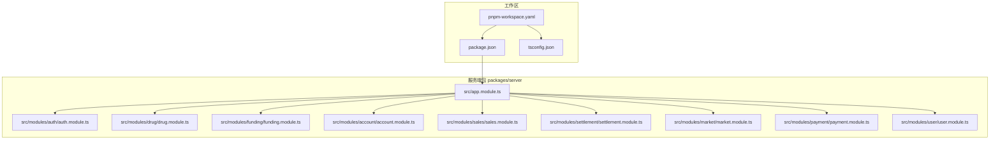

**图表来源**
- [pnpm-workspace.yaml:1-3](file://pnpm-workspace.yaml#L1-L3)
- [package.json:1-24](file://package.json#L1-L24)
- [packages/server/src/app.module.ts:1-53](file://packages/server/src/app.module.ts#L1-L53)

**章节来源**
- [pnpm-workspace.yaml:1-3](file://pnpm-workspace.yaml#L1-L3)
- [package.json:1-24](file://package.json#L1-L24)
- [tsconfig.json:1-17](file://tsconfig.json#L1-L17)

## 核心组件
- 应用根模块：AppModule 负责全局配置与业务模块聚合，集中导入配置模块、数据库模块、事件模块以及所有业务模块。
- 数据库模块：DatabaseModule 提供 TypeORM 连接与迁移配置，统一实体扫描路径。
- 共享模块：AuthModule 向外导出认证与授权相关的服务与守卫，供其他模块复用。
- 业务模块：按领域拆分，每个模块自包含控制器、服务、DTO、实体与模块定义，职责单一且内聚。

关键特性：
- 导入与导出：模块通过 imports 引入依赖，通过 exports 将服务或守卫暴露给其他模块。
- 依赖注入：模块内部通过 providers 注册服务，控制器通过构造函数注入所需服务。
- 配置中心：ConfigModule 全局注册，配合 ConfigService 统一读取环境变量。

**章节来源**
- [packages/server/src/app.module.ts:1-53](file://packages/server/src/app.module.ts#L1-L53)
- [packages/server/src/modules/auth/auth.module.ts:1-34](file://packages/server/src/modules/auth/auth.module.ts#L1-L34)

## 架构总览
下图展示 AppModule 如何聚合各业务模块，并通过共享模块（AuthModule）提供认证能力，支付模块依赖账户模块进行资金处理。

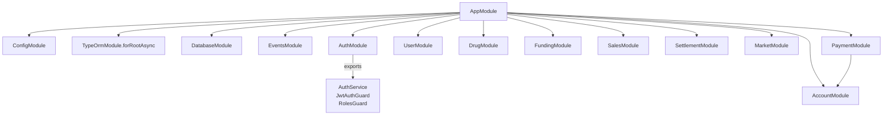

**图表来源**
- [packages/server/src/app.module.ts:16-50](file://packages/server/src/app.module.ts#L16-L50)
- [packages/server/src/modules/auth/auth.module.ts:14-32](file://packages/server/src/modules/auth/auth.module.ts#L14-L32)
- [packages/server/src/modules/payment/payment.module.ts:8-16](file://packages/server/src/modules/payment/payment.module.ts#L8-L16)

## 详细组件分析

### 认证模块（AuthModule）
职责：
- 提供用户登录、注册、角色校验与 JWT 签发能力。
- 对外导出 AuthService、JwtAuthGuard、RolesGuard，供其他模块复用。

实现要点：
- 使用 PassportModule 与 JwtModule，结合 ConfigService 动态配置密钥与过期时间。
- 通过 TypeOrmModule.forFeature 注入 User、AccountBalance 实体。
- 控制器负责对外接口，服务封装业务逻辑，守卫用于路由级鉴权。

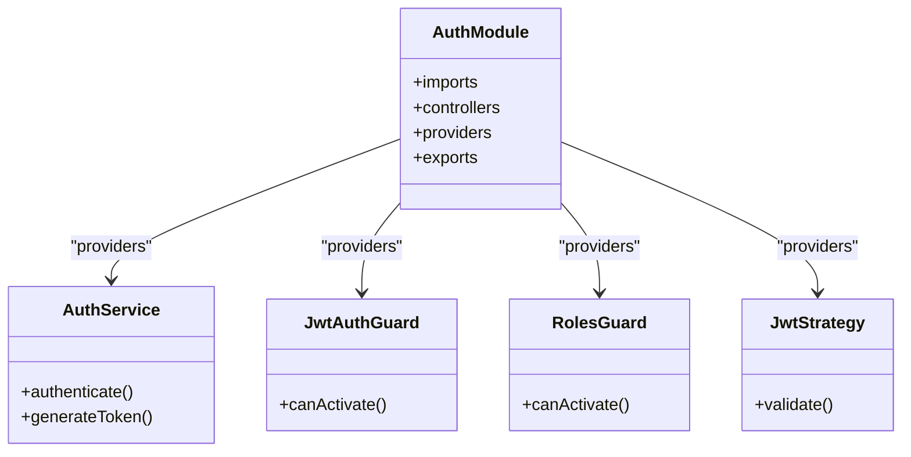

**图表来源**
- [packages/server/src/modules/auth/auth.module.ts:14-32](file://packages/server/src/modules/auth/auth.module.ts#L14-L32)

**章节来源**
- [packages/server/src/modules/auth/auth.module.ts:1-34](file://packages/server/src/modules/auth/auth.module.ts#L1-L34)

### 药品模块（DrugModule）
职责：
- 管理药品信息与市场快照数据，提供查询与状态更新接口。

实现要点：
- 通过 TypeOrmModule.forFeature 注入 Drug、MarketSnapshot 实体。
- 暴露 DrugService 供上层模块调用。

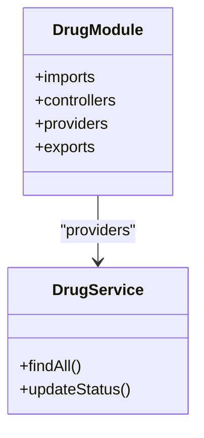

**图表来源**
- [packages/server/src/modules/drug/drug.module.ts:8-14](file://packages/server/src/modules/drug/drug.module.ts#L8-L14)

**章节来源**
- [packages/server/src/modules/drug/drug.module.ts:1-15](file://packages/server/src/modules/drug/drug.module.ts#L1-L15)

### 资金模块（FundingModule）
职责：
- 处理垫资订单，关联 Drug、AccountBalance、AccountTransaction 等实体。

实现要点：
- 通过 TypeOrmModule.forFeature 注入多实体，确保跨表事务一致性。
- 暴露 FundingService 作为领域服务入口。

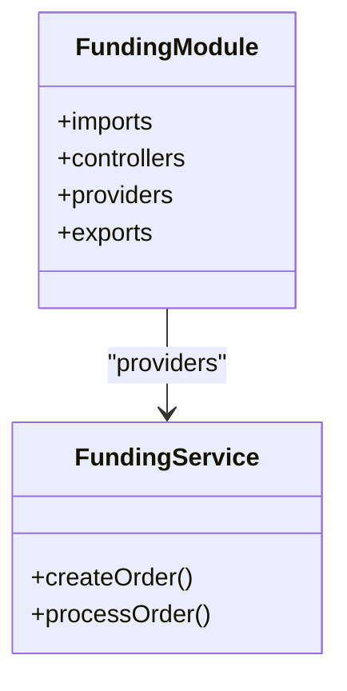

**图表来源**
- [packages/server/src/modules/funding/funding.module.ts:10-22](file://packages/server/src/modules/funding/funding.module.ts#L10-L22)

**章节来源**
- [packages/server/src/modules/funding/funding.module.ts:1-24](file://packages/server/src/modules/funding/funding.module.ts#L1-L24)

### 账户模块（AccountModule）
职责：
- 管理账户余额与交易流水，为支付与结算提供基础能力。

实现要点：
- 注入 AccountBalance、AccountTransaction 实体。
- 暴露 AccountService 供其他模块调用。

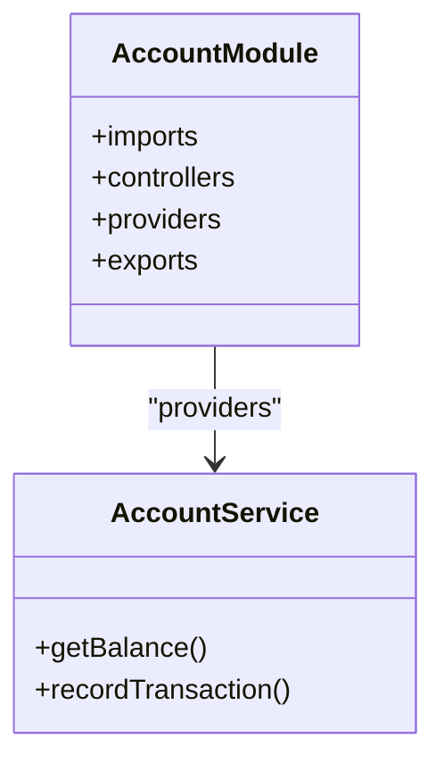

**图表来源**
- [packages/server/src/modules/account/account.module.ts:8-14](file://packages/server/src/modules/account/account.module.ts#L8-L14)

**章节来源**
- [packages/server/src/modules/account/account.module.ts:1-15](file://packages/server/src/modules/account/account.module.ts#L1-L15)

### 销售模块（SalesModule）
职责：
- 统计每日销售数据，与 Drug、Settlement 实体协作。

实现要点：
- 注入 DailySales、Drug、Settlement 实体。
- 暴露 SalesService 作为统计与计算入口。

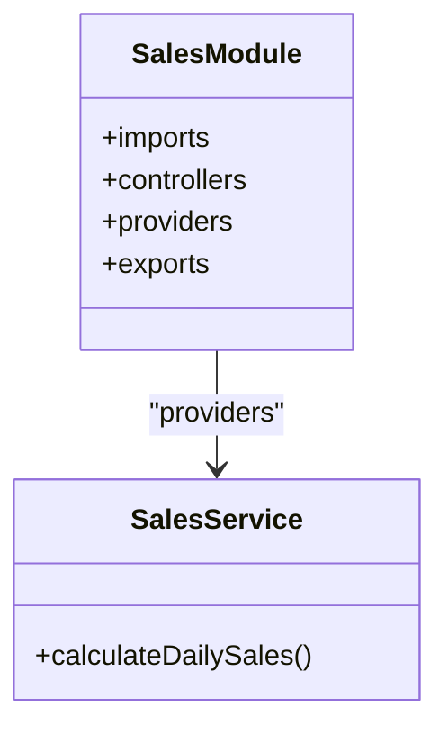

**图表来源**
- [packages/server/src/modules/sales/sales.module.ts:9-15](file://packages/server/src/modules/sales/sales.module.ts#L9-L15)

**章节来源**
- [packages/server/src/modules/sales/sales.module.ts:1-16](file://packages/server/src/modules/sales/sales.module.ts#L1-L16)

### 结算模块（SettlementModule）
职责：
- 执行结算流程，协调 FundingOrder、DailySales、Drug、AccountBalance、AccountTransaction 等实体。

实现要点：
- 注入多实体，保证结算过程的数据一致性。
- 暴露 SettlementService 作为结算领域服务。

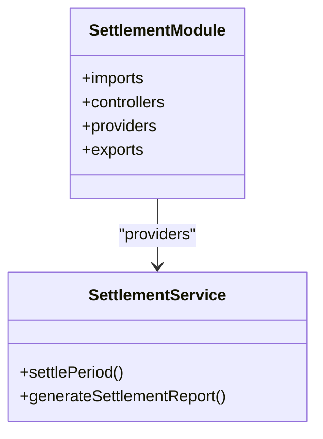

**图表来源**
- [packages/server/src/modules/settlement/settlement.module.ts:12-26](file://packages/server/src/modules/settlement/settlement.module.ts#L12-L26)

**章节来源**
- [packages/server/src/modules/settlement/settlement.module.ts:1-28](file://packages/server/src/modules/settlement/settlement.module.ts#L1-L28)

### 市场模块（MarketModule）
职责：
- 提供市场快照、行情数据查询，与 Drug、DailySales、Settlement、FundingOrder 协同。

实现要点：
- 注入 MarketSnapshot 及相关实体。
- 暴露 MarketService 作为市场数据服务。

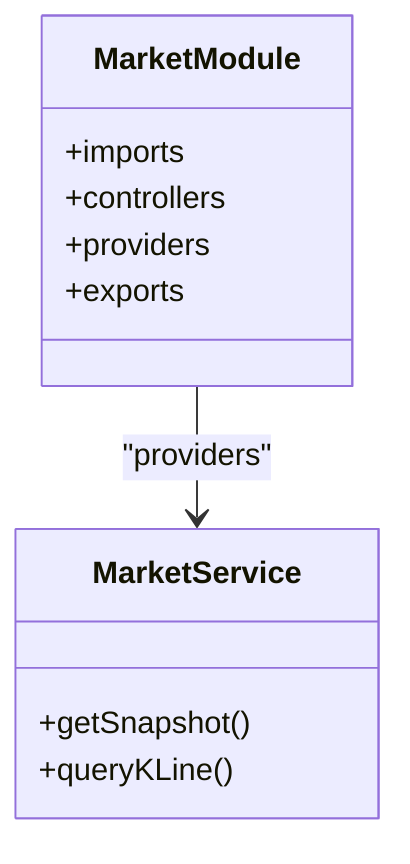

**图表来源**
- [packages/server/src/modules/market/market.module.ts:11-25](file://packages/server/src/modules/market/market.module.ts#L11-L25)

**章节来源**
- [packages/server/src/modules/market/market.module.ts:1-26](file://packages/server/src/modules/market/market.module.ts#L1-L26)

### 支付模块（PaymentModule）
职责：
- 处理支付订单，集成第三方支付（如支付宝、微信），并与 AccountModule 协作完成资金变动。

实现要点：
- 注入 PaymentOrder 实体与 AccountModule。
- 暴露 PaymentService，并提供 AlipayService、WechatPayService。

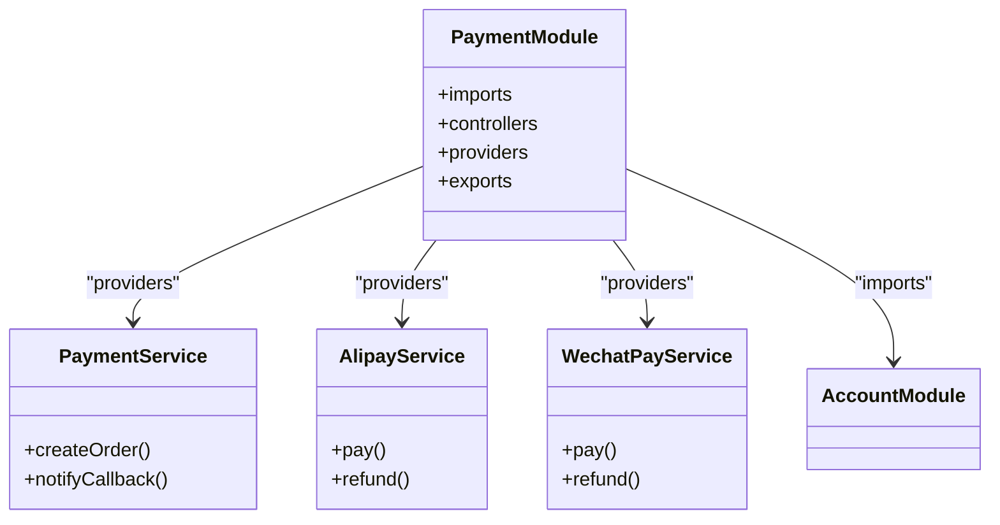

**图表来源**
- [packages/server/src/modules/payment/payment.module.ts:10-16](file://packages/server/src/modules/payment/payment.module.ts#L10-L16)

**章节来源**
- [packages/server/src/modules/payment/payment.module.ts:1-17](file://packages/server/src/modules/payment/payment.module.ts#L1-L17)

### 用户模块（UserModule）
职责：
- 管理用户信息与账户余额，为认证与资金相关功能提供支持。

实现要点：
- 注入 User、AccountBalance 实体。
- 暴露 UserService。

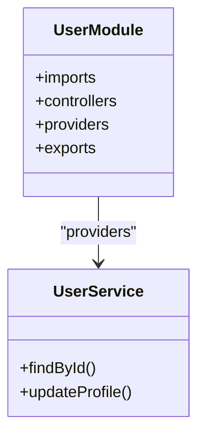

**图表来源**
- [packages/server/src/modules/user/user.module.ts:8-14](file://packages/server/src/modules/user/user.module.ts#L8-L14)

**章节来源**
- [packages/server/src/modules/user/user.module.ts:1-15](file://packages/server/src/modules/user/user.module.ts#L1-L15)

## 依赖分析
- 模块耦合度：AppModule 作为聚合根，集中导入各业务模块；业务模块之间通过共享模块（如 AuthModule）与公共模块（如 AccountModule、DatabaseModule）间接耦合。
- 导出与复用：AuthModule 对外导出 AuthService、JwtAuthGuard、RolesGuard，避免重复实现；PaymentModule 依赖 AccountModule，形成清晰的领域边界。
- 数据访问：各模块通过 TypeOrmModule.forFeature 注入所需实体，保持数据访问的内聚性。

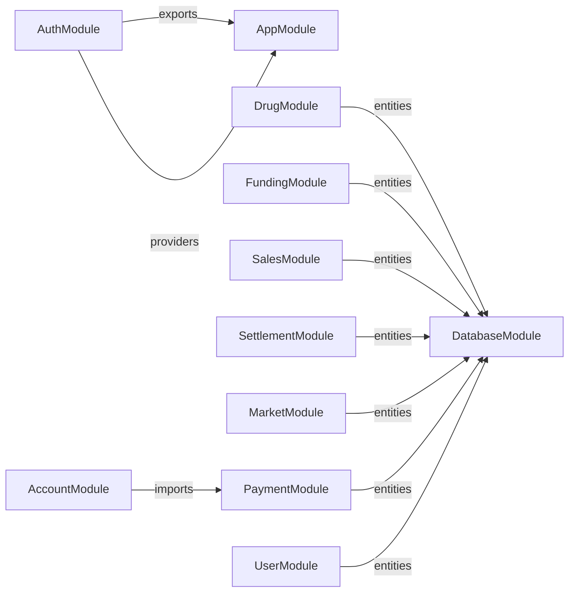

**图表来源**
- [packages/server/src/app.module.ts:41-49](file://packages/server/src/app.module.ts#L41-L49)
- [packages/server/src/modules/auth/auth.module.ts:30-31](file://packages/server/src/modules/auth/auth.module.ts#L30-L31)
- [packages/server/src/modules/payment/payment.module.ts:11](file://packages/server/src/modules/payment/payment.module.ts#L11)

**章节来源**
- [packages/server/src/app.module.ts:1-53](file://packages/server/src/app.module.ts#L1-L53)
- [packages/server/src/modules/auth/auth.module.ts:1-34](file://packages/server/src/modules/auth/auth.module.ts#L1-L34)
- [packages/server/src/modules/payment/payment.module.ts:1-17](file://packages/server/src/modules/payment/payment.module.ts#L1-L17)

## 性能考虑
- 懒加载策略：对非核心模块（如 MarketModule、SalesModule）可启用惰性加载，减少启动时初始化成本。
- 预加载策略：对高频使用的模块（如 AuthModule、AccountModule）在应用启动阶段预热，提升首次请求响应速度。
- 数据库连接池：通过 TypeORM 的连接池参数优化并发与超时设置，避免高负载下的连接争用。
- 缓存与事件：结合 EventsModule 与缓存中间件，降低重复计算与数据库压力。

## 故障排除指南
- 模块未导出导致注入失败：检查目标模块是否在 exports 中声明所需服务或守卫。
- 实体未注册：确认 TypeOrmModule.forFeature 中包含对应实体，或在 DatabaseModule 统一注册。
- 配置缺失：检查 ConfigModule 是否全局注册，ConfigService 是否正确读取环境变量。
- 守卫不生效：确认 JwtAuthGuard、RolesGuard 在控制器或路由上正确应用。

## 结论
Jiaoyi 的模块系统以 AppModule 为核心，通过共享模块与业务模块的清晰分工，实现了高内聚、低耦合的架构设计。模块间通过导出与导入机制协作，配合统一的配置与数据库模块，保障了系统的可维护性与扩展性。建议在后续迭代中进一步完善懒加载与预加载策略，并加强模块测试与 Mock 策略，以提升整体质量与交付效率。

## 附录

### 模块懒加载与预加载配置方法
- 懒加载：在根模块导入时，将非核心模块延迟到首次访问时再加载，减少启动时间。
- 预加载：在应用启动阶段显式预热高频模块，缩短首请求延迟。
- 配置位置：通常在根模块的 imports 列表中进行选择性启用。

### 模块测试与 Mock 策略
- 服务层测试：使用 @nestjs/testing 创建测试模块，通过 Test.createTestingModule 注入被测服务与 MockProvider 替换外部依赖。
- 控制器测试：通过 Test.createTestingModule 注入控制器与服务 Mock，验证路由行为与返回值。
- 守卫与拦截器：通过 MockAuthGuard、MockRolesGuard 等替换真实守卫，聚焦业务逻辑验证。
- 数据访问：使用 InMemoryRepository 或测试数据库，隔离外部依赖。

### 模块配置最佳实践与命名规范
- 命名规范：模块文件以 Module 结尾，如 AuthModule；服务以 Service 结尾，如 AuthService；控制器以 Controller 结尾，如 AuthController。
- 导出策略：仅导出必要的服务与守卫，避免过度导出造成模块间隐式耦合。
- 配置管理：统一通过 ConfigModule 与 ConfigService 管理环境变量，避免硬编码。
- 实体注册：在模块内通过 TypeOrmModule.forFeature 注册实体，保持数据访问边界清晰。