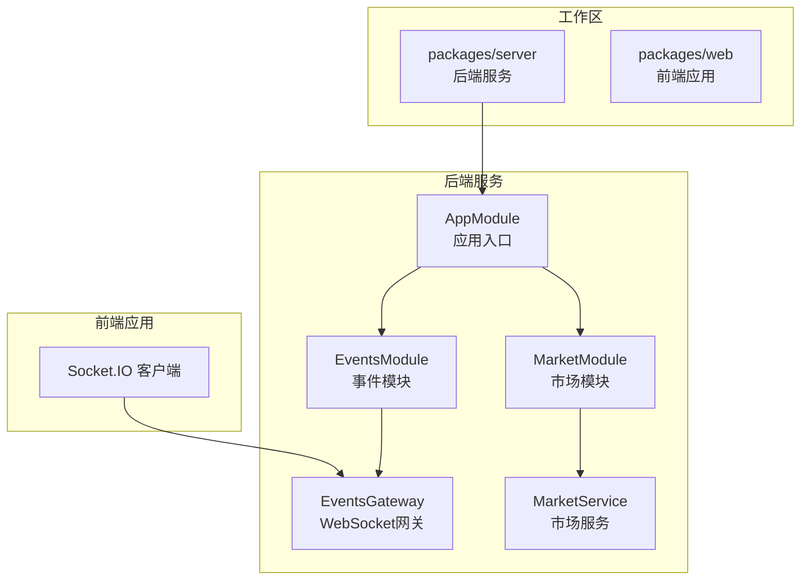
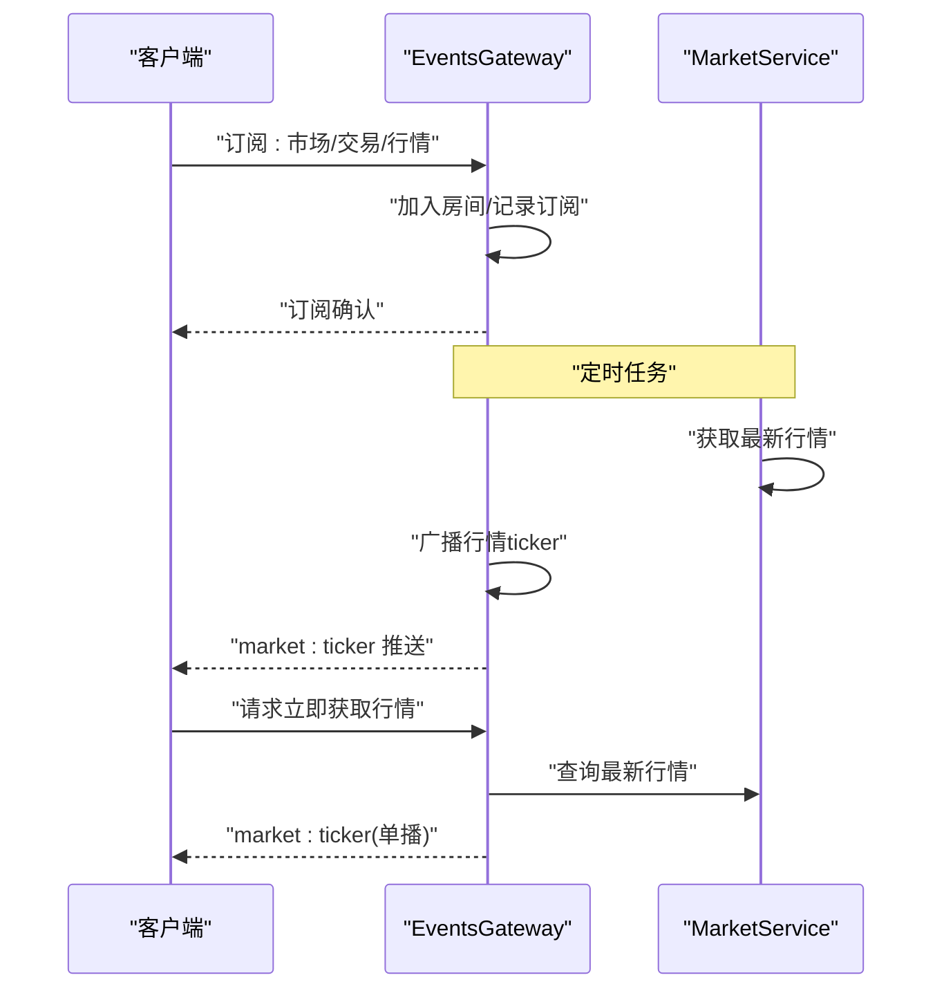
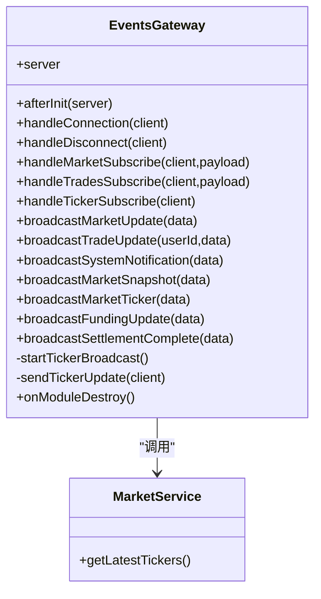
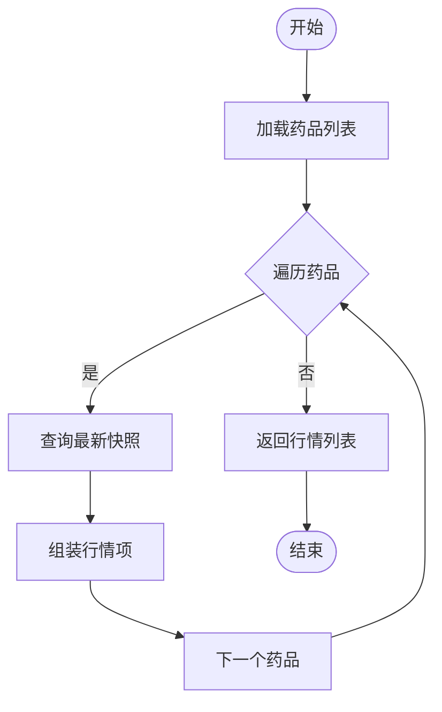
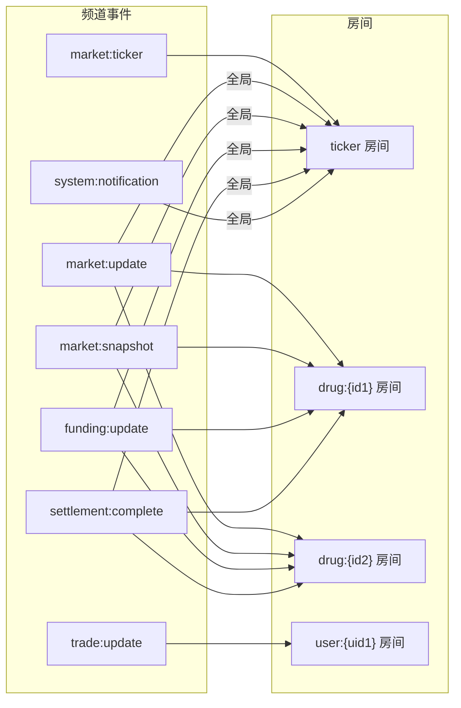
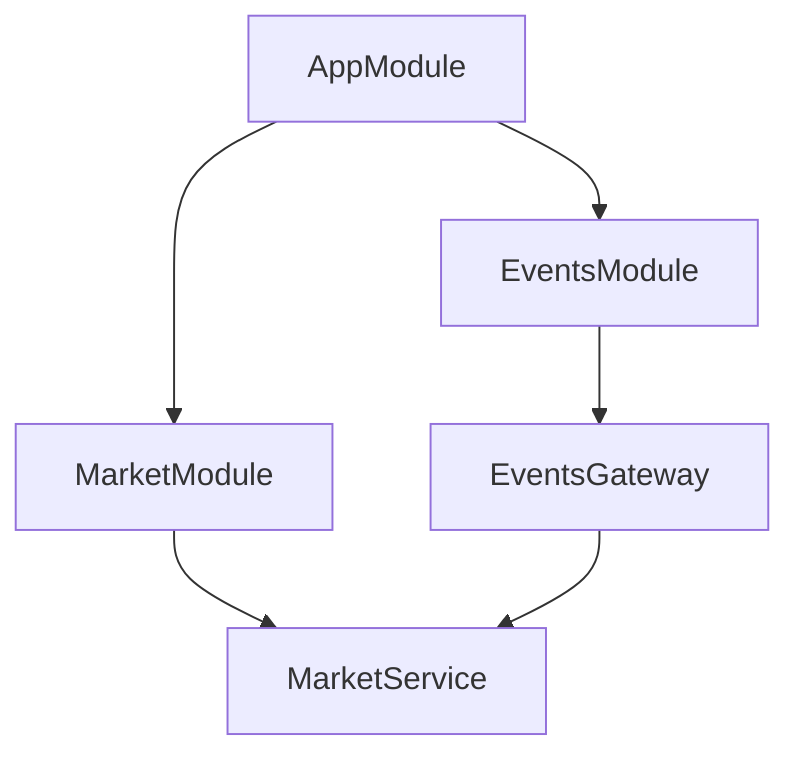

# 实时通信架构

<cite>
**本文引用的文件**
- [package.json](file://package.json)
- [pnpm-workspace.yaml](file://pnpm-workspace.yaml)
- [app.module.ts](file://packages/server/src/app.module.ts)
- [events.gateway.ts](file://packages/server/src/common/events/events.gateway.ts)
- [events.module.ts](file://packages/server/src/common/events/events.module.ts)
- [market.service.ts](file://packages/server/src/modules/market/market.service.ts)
- [market.module.ts](file://packages/server/src/modules/market/market.module.ts)
</cite>

## 目录
1. [引言](#引言)
2. [项目结构](#项目结构)
3. [核心组件](#核心组件)
4. [架构总览](#架构总览)
5. [详细组件分析](#详细组件分析)
6. [依赖关系分析](#依赖关系分析)
7. [性能考量](#性能考量)
8. [故障排查指南](#故障排查指南)
9. [结论](#结论)
10. [附录](#附录)

## 引言
本文件面向Jiaoyi项目的实时通信架构，聚焦于基于NestJS与Socket.IO的WebSocket网关实现，系统化阐述事件广播策略、客户端订阅管理、实时数据推送机制、消息格式与状态同步、连接池与心跳断线重连策略，并结合市场行情、交易通知与实时图表更新场景给出落地实现细节。同时提供性能优化、负载均衡与扩展性建议，以及调试与监控方案。

## 项目结构
Jiaoyi采用Monorepo组织，通过工作区脚本统一管理前后端开发与构建流程。实时通信能力由后端服务模块提供，前端通过Socket.IO客户端接入。

**图示来源**
- [pnpm-workspace.yaml:1-3](file://pnpm-workspace.yaml#L1-L3)
- [package.json:6-13](file://package.json#L6-L13)
- [app.module.ts:15-48](file://packages/server/src/app.module.ts#L15-L48)
- [events.module.ts:6-13](file://packages/server/src/common/events/events.module.ts#L6-L13)
- [events.gateway.ts:15-21](file://packages/server/src/common/events/events.gateway.ts#L15-L21)
- [market.module.ts:11-24](file://packages/server/src/modules/market/market.module.ts#L11-L24)

**章节来源**
- [pnpm-workspace.yaml:1-3](file://pnpm-workspace.yaml#L1-L3)
- [package.json:6-13](file://package.json#L6-L13)
- [app.module.ts:15-48](file://packages/server/src/app.module.ts#L15-L48)

## 核心组件
- WebSocket网关：负责WebSocket生命周期管理、事件订阅与广播、定时推送与清理。
- 市场服务：提供实时行情数据聚合与查询，支撑tick行情、快照与深度等数据的推送。
- 应用模块：装配配置、数据库、调度与业务模块，启用事件模块以暴露WebSocket网关。
- 事件模块：整合调度与市场模块，向容器注册网关实例。

关键职责与交互：
- 网关接收客户端订阅请求，按频道加入房间或直接回发确认。
- 网关定时从市场服务拉取最新行情并广播至对应频道与房间。
- 网关提供点对点推送接口，支持按用户或药品维度定向通知。

**章节来源**
- [events.gateway.ts:22-38](file://packages/server/src/common/events/events.gateway.ts#L22-L38)
- [events.gateway.ts:48-74](file://packages/server/src/common/events/events.gateway.ts#L48-L74)
- [events.gateway.ts:126-143](file://packages/server/src/common/events/events.gateway.ts#L126-L143)
- [market.service.ts:474-496](file://packages/server/src/modules/market/market.service.ts#L474-L496)
- [events.module.ts:6-13](file://packages/server/src/common/events/events.module.ts#L6-L13)
- [app.module.ts:15-48](file://packages/server/src/app.module.ts#L15-L48)

## 架构总览
下图展示从客户端到服务端的实时通信路径，涵盖订阅、广播与定时推送：

**图示来源**
- [events.gateway.ts:48-74](file://packages/server/src/common/events/events.gateway.ts#L48-L74)
- [events.gateway.ts:126-143](file://packages/server/src/common/events/events.gateway.ts#L126-L143)
- [market.service.ts:474-496](file://packages/server/src/modules/market/market.service.ts#L474-L496)

## 详细组件分析

### WebSocket网关（EventsGateway）
- 网关配置
  - 命名空间：/ws
  - 跨域：允许任意来源
- 生命周期钩子
  - 初始化：启动定时广播任务
  - 连接建立：记录客户端ID
  - 连接断开：记录断开事件
- 订阅与房间
  - 市场订阅：可按药品维度加入房间
  - 交易订阅：按用户维度加入房间
  - 行情订阅：加入全局ticker房间
- 广播策略
  - 市场更新：广播至全局与对应药品房间
  - 交易更新：按用户房间定向推送
  - 系统通知：广播至全局
  - 快照与ticker：分别广播至全局与房间
  - 垫资与清算：广播至全局与对应药品房间
- 定时推送
  - 每5秒从市场服务获取最新行情并广播
  - 断开时清理定时器，避免内存泄漏

**图示来源**
- [events.gateway.ts:22-38](file://packages/server/src/common/events/events.gateway.ts#L22-L38)
- [events.gateway.ts:48-74](file://packages/server/src/common/events/events.gateway.ts#L48-L74)
- [events.gateway.ts:76-124](file://packages/server/src/common/events/events.gateway.ts#L76-L124)
- [events.gateway.ts:126-143](file://packages/server/src/common/events/events.gateway.ts#L126-L143)
- [events.gateway.ts:145-156](file://packages/server/src/common/events/events.gateway.ts#L145-L156)
- [market.service.ts:474-496](file://packages/server/src/modules/market/market.service.ts#L474-L496)

**章节来源**
- [events.gateway.ts:15-21](file://packages/server/src/common/events/events.gateway.ts#L15-L21)
- [events.gateway.ts:34-46](file://packages/server/src/common/events/events.gateway.ts#L34-L46)
- [events.gateway.ts:48-74](file://packages/server/src/common/events/events.gateway.ts#L48-L74)
- [events.gateway.ts:76-124](file://packages/server/src/common/events/events.gateway.ts#L76-L124)
- [events.gateway.ts:126-143](file://packages/server/src/common/events/events.gateway.ts#L126-L143)
- [events.gateway.ts:145-156](file://packages/server/src/common/events/events.gateway.ts#L145-L156)
- [events.gateway.ts:158-163](file://packages/server/src/common/events/events.gateway.ts#L158-L163)

### 市场服务（MarketService）
- 数据聚合
  - 生成每日行情快照，计算日收益、累计收益、垫资热度、队列深度等指标
  - 提供市场总览、单药详情、K线、深度数据、热门排行与平台统计
- 实时行情
  - 提供获取所有药品最新行情列表的方法，供网关定时广播使用
- 复杂度与性能
  - 快照生成涉及多表聚合，建议在数据库层面建立合适索引
  - 最新行情查询按药品循环查询最新快照，建议缓存热点药品数据

**图示来源**
- [market.service.ts:474-496](file://packages/server/src/modules/market/market.service.ts#L474-L496)

**章节来源**
- [market.service.ts:98-216](file://packages/server/src/modules/market/market.service.ts#L98-L216)
- [market.service.ts:221-282](file://packages/server/src/modules/market/market.service.ts#L221-L282)
- [market.service.ts:287-327](file://packages/server/src/modules/market/market.service.ts#L287-L327)
- [market.service.ts:332-373](file://packages/server/src/modules/market/market.service.ts#L332-L373)
- [market.service.ts:378-428](file://packages/server/src/modules/market/market.service.ts#L378-L428)
- [market.service.ts:433-469](file://packages/server/src/modules/market/market.service.ts#L433-L469)
- [market.service.ts:474-496](file://packages/server/src/modules/market/market.service.ts#L474-L496)

### 订阅与房间模型
- 房间命名规范
  - 药品维度：drug:{drugId}
  - 用户维度：user:{userId}
  - 全局ticker房间：ticker
- 订阅事件
  - subscribe:market：按药品加入房间
  - subscribe:trades：按用户加入房间
  - subscribe:ticker：加入全局ticker房间并可立即回发一次行情
- 广播目标
  - 市场更新：全局+药品房间
  - 交易更新：用户房间
  - 系统通知：全局
  - 快照与ticker：全局+房间
  - 垫资与清算：全局+药品房间

**图示来源**
- [events.gateway.ts:48-74](file://packages/server/src/common/events/events.gateway.ts#L48-L74)
- [events.gateway.ts:76-124](file://packages/server/src/common/events/events.gateway.ts#L76-L124)

**章节来源**
- [events.gateway.ts:48-74](file://packages/server/src/common/events/events.gateway.ts#L48-L74)
- [events.gateway.ts:76-124](file://packages/server/src/common/events/events.gateway.ts#L76-L124)

### 实时数据推送与消息格式
- 行情ticker
  - 字段：timestamp、tickers[]
  - tickers项字段：drugId、drugName、drugCode、sellingPrice、dailyReturn、cumulativeReturn、fundingHeat
- 市场快照
  - 字段：同行情快照，按药品维度推送
- 交易更新
  - 字段：根据业务实体定义，按用户房间推送
- 系统通知
  - 字段：通用通知体，按全局推送
- 垫资与清算
  - 字段：垫资/清算相关业务字段，按全局与药品房间推送

消息格式与字段来源于服务层数据模型与网关广播方法，确保客户端解析一致性。

**章节来源**
- [events.gateway.ts:126-143](file://packages/server/src/common/events/events.gateway.ts#L126-L143)
- [events.gateway.ts:145-156](file://packages/server/src/common/events/events.gateway.ts#L145-L156)
- [market.service.ts:474-496](file://packages/server/src/modules/market/market.service.ts#L474-L496)

### 连接池管理、心跳与断线重连
- 连接池管理
  - 使用Socket.IO服务端实例承载连接，房间作为逻辑分组，避免物理连接池概念
- 心跳检测
  - 代码中未显式配置心跳参数；建议在生产环境通过Socket.IO选项设置合适的pingInterval与pingTimeout
- 断线重连
  - 代码中未实现自动重连逻辑；建议在客户端侧启用Socket.IO的reconnection策略，并在网关侧处理重连后的订阅恢复

[本节为通用实践建议，不直接分析具体文件]

### 实时图表更新、市场行情推送与交易通知
- 实时图表更新
  - 通过定时ticker广播与按需单播相结合，满足K线、深度图等高频更新需求
- 市场行情推送
  - 全局ticker房间用于推送全量摘要，药品房间用于精准推送
- 交易通知
  - 按用户房间定向推送，确保私有信息不泄露

**章节来源**
- [events.gateway.ts:126-143](file://packages/server/src/common/events/events.gateway.ts#L126-L143)
- [events.gateway.ts:145-156](file://packages/server/src/common/events/events.gateway.ts#L145-L156)
- [events.gateway.ts:76-124](file://packages/server/src/common/events/events.gateway.ts#L76-L124)

## 依赖关系分析
- 应用模块装配事件模块与市场模块，使网关与服务可用
- 事件模块启用调度模块，驱动定时任务
- 网关依赖市场服务进行数据查询与聚合

**图示来源**
- [app.module.ts:15-48](file://packages/server/src/app.module.ts#L15-L48)
- [events.module.ts:6-13](file://packages/server/src/common/events/events.module.ts#L6-L13)
- [market.module.ts:11-24](file://packages/server/src/modules/market/market.module.ts#L11-L24)

**章节来源**
- [app.module.ts:15-48](file://packages/server/src/app.module.ts#L15-L48)
- [events.module.ts:6-13](file://packages/server/src/common/events/events.module.ts#L6-L13)
- [market.module.ts:11-24](file://packages/server/src/modules/market/market.module.ts#L11-L24)

## 性能考量
- 定时任务频率
  - ticker广播周期为5秒，建议根据客户端刷新频率与网络带宽调整
- 数据库访问
  - 最新行情查询按药品循环查询快照，建议引入缓存层（如Redis）存储最近tick数据
- 房间规模
  - 房间数量与订阅人数成正比，建议限制单房间最大订阅数并实施房间清理策略
- 广播粒度
  - 对于高频更新，优先使用房间广播而非全局广播，减少无效传输
- 内存与资源
  - 在模块销毁阶段清理定时器，避免内存泄漏

[本节提供通用指导，不直接分析具体文件]

## 故障排查指南
- 日志定位
  - 网关初始化、连接与断开均输出日志，便于定位连接问题
- 错误处理
  - 定时广播与单播均包含try/catch保护，异常会被记录但不影响其他客户端
- 常见问题
  - 订阅无响应：检查客户端是否正确加入房间，服务端是否正确广播
  - 行情不更新：检查定时任务是否运行，市场服务是否正常查询数据
  - 重连丢失订阅：建议在客户端启用自动重连并在重连后重新订阅

**章节来源**
- [events.gateway.ts:34-46](file://packages/server/src/common/events/events.gateway.ts#L34-L46)
- [events.gateway.ts:132-142](file://packages/server/src/common/events/events.gateway.ts#L132-L142)
- [events.gateway.ts:147-155](file://packages/server/src/common/events/events.gateway.ts#L147-L155)

## 结论
Jiaoyi的实时通信架构以NestJS与Socket.IO为基础，通过事件网关实现订阅管理与广播策略，结合市场服务的数据聚合能力，形成覆盖行情、交易与系统通知的完整推送体系。建议在生产环境中完善心跳与断线重连、引入缓存与限流、优化数据库索引与广播粒度，以提升稳定性与扩展性。

## 附录
- 开发与构建
  - 通过工作区脚本统一管理前后端开发与构建
- 配置与部署
  - 建议在部署时开启Socket.IO的心跳参数与客户端重连策略，并配置反向代理支持WebSocket升级

**章节来源**
- [package.json:6-13](file://package.json#L6-L13)
- [pnpm-workspace.yaml:1-3](file://pnpm-workspace.yaml#L1-L3)