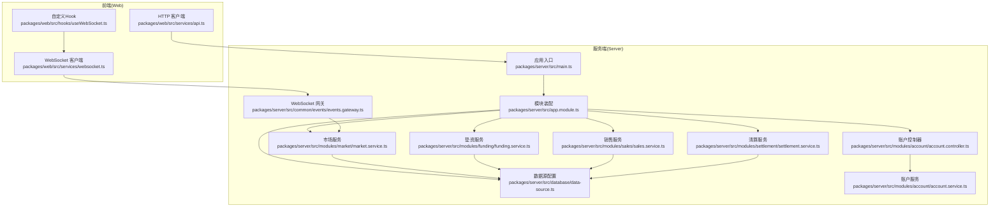
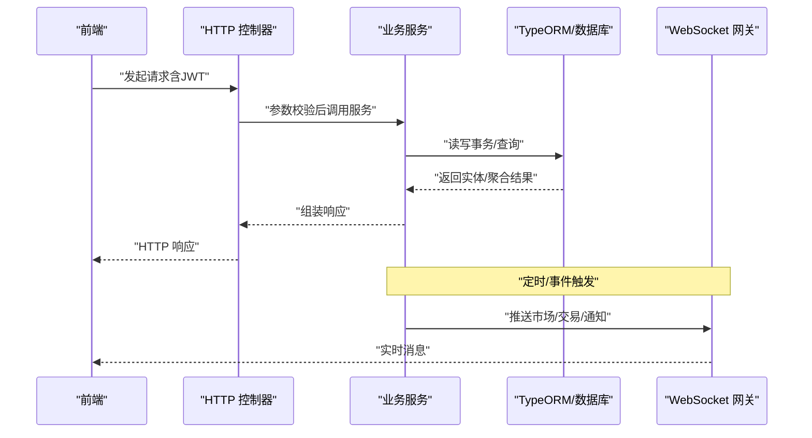
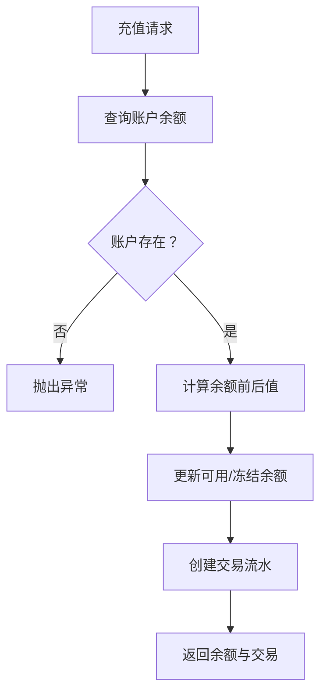
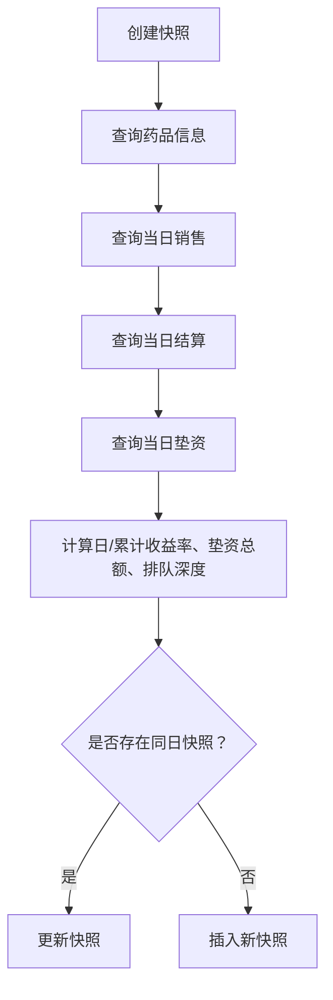
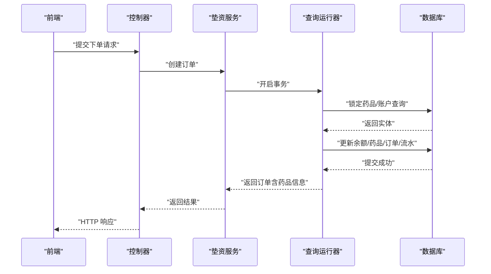
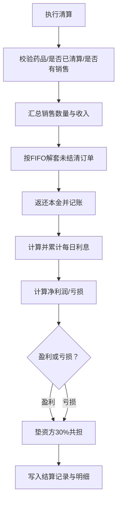
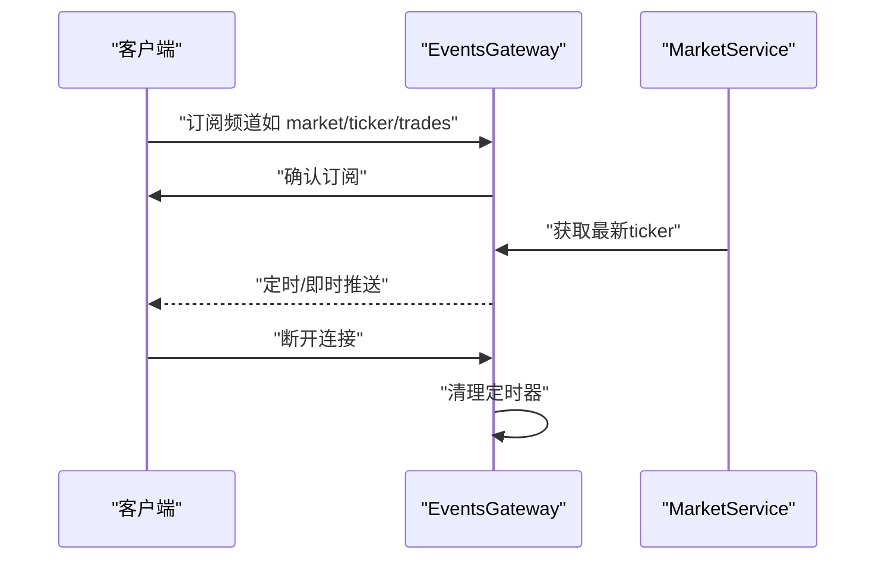
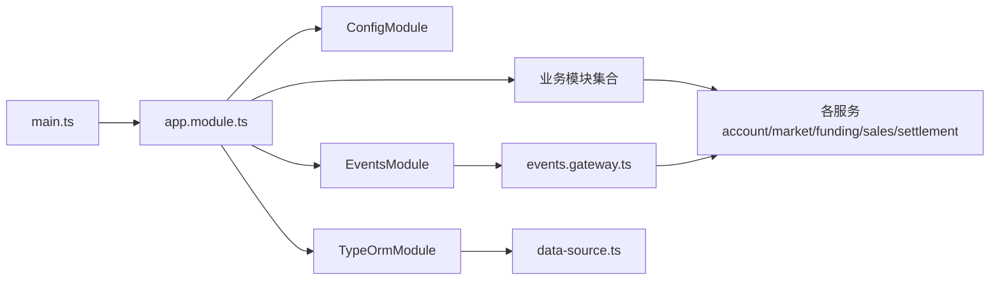

# 数据流架构

<cite>
**本文引用的文件**
- [packages/server/src/main.ts](file://packages/server/src/main.ts)
- [packages/server/src/app.module.ts](file://packages/server/src/app.module.ts)
- [packages/server/src/common/events/events.gateway.ts](file://packages/server/src/common/events/events.gateway.ts)
- [packages/server/src/database/data-source.ts](file://packages/server/src/database/data-source.ts)
- [packages/server/src/modules/account/account.controller.ts](file://packages/server/src/modules/account/account.controller.ts)
- [packages/server/src/modules/account/account.service.ts](file://packages/server/src/modules/account/account.service.ts)
- [packages/server/src/modules/market/market.service.ts](file://packages/server/src/modules/market/market.service.ts)
- [packages/server/src/modules/funding/funding.service.ts](file://packages/server/src/modules/funding/funding.service.ts)
- [packages/server/src/modules/sales/sales.service.ts](file://packages/server/src/modules/sales/sales.service.ts)
- [packages/server/src/modules/settlement/settlement.service.ts](file://packages/server/src/modules/settlement/settlement.service.ts)
- [packages/web/src/services/api.ts](file://packages/web/src/services/api.ts)
- [packages/web/src/services/websocket.ts](file://packages/web/src/services/websocket.ts)
- [packages/web/src/hooks/useWebSocket.ts](file://packages/web/src/hooks/useWebSocket.ts)
</cite>

## 目录
1. [引言](#引言)
2. [项目结构](#项目结构)
3. [核心组件](#核心组件)
4. [架构总览](#架构总览)
5. [详细组件分析](#详细组件分析)
6. [依赖关系分析](#依赖关系分析)
7. [性能考量](#性能考量)
8. [故障排查指南](#故障排查指南)
9. [结论](#结论)
10. [附录](#附录)

## 引言
本文件面向Jiaoyi项目的“数据流架构”，系统化梳理从前端请求到数据库写入的完整数据链路，解释实时数据推送的数据处理管道与事件驱动机制，说明缓存策略、数据同步与一致性保障，给出API请求处理流程、响应格式与错误传播机制，并总结数据验证、过滤与转换的实现方式，以及数据流监控、性能分析与故障排查方法。

## 项目结构
Jiaoyi采用Monorepo组织，分为服务端（packages/server）与前端（packages/web）。服务端基于NestJS，使用TypeORM连接PostgreSQL；前端基于Vite+React，通过HTTP与WebSocket与后端交互。

图表来源
- [packages/server/src/main.ts:1-29](file://packages/server/src/main.ts#L1-L29)
- [packages/server/src/app.module.ts:1-51](file://packages/server/src/app.module.ts#L1-L51)
- [packages/server/src/database/data-source.ts:1-18](file://packages/server/src/database/data-source.ts#L1-L18)
- [packages/server/src/common/events/events.gateway.ts:1-165](file://packages/server/src/common/events/events.gateway.ts#L1-L165)
- [packages/server/src/modules/account/account.controller.ts:1-55](file://packages/server/src/modules/account/account.controller.ts#L1-L55)
- [packages/server/src/modules/account/account.service.ts:1-135](file://packages/server/src/modules/account/account.service.ts#L1-L135)
- [packages/server/src/modules/market/market.service.ts:1-498](file://packages/server/src/modules/market/market.service.ts#L1-L498)
- [packages/server/src/modules/funding/funding.service.ts:1-460](file://packages/server/src/modules/funding/funding.service.ts#L1-L460)
- [packages/server/src/modules/sales/sales.service.ts:1-305](file://packages/server/src/modules/sales/sales.service.ts#L1-L305)
- [packages/server/src/modules/settlement/settlement.service.ts:1-978](file://packages/server/src/modules/settlement/settlement.service.ts#L1-L978)
- [packages/web/src/services/api.ts](file://packages/web/src/services/api.ts)
- [packages/web/src/services/websocket.ts](file://packages/web/src/services/websocket.ts)
- [packages/web/src/hooks/useWebSocket.ts](file://packages/web/src/hooks/useWebSocket.ts)

章节来源
- [packages/server/src/main.ts:1-29](file://packages/server/src/main.ts#L1-L29)
- [packages/server/src/app.module.ts:1-51](file://packages/server/src/app.module.ts#L1-L51)
- [packages/server/src/database/data-source.ts:1-18](file://packages/server/src/database/data-source.ts#L1-L18)

## 核心组件
- 应用入口与全局配置：启用全局验证管道、CORS、加载环境变量并监听端口。
- 模块装配：集中注册数据库、认证、用户、药品、垫资、销售、结算、市场、事件等模块。
- 数据源：TypeORM连接PostgreSQL，启用迁移与日志。
- WebSocket网关：统一管理订阅、广播与定时推送，支持多频道消息路由。
- 业务服务：账户、市场、垫资、销售、结算五大领域服务，封装数据聚合与复杂业务逻辑。
- 控制器：对JWT鉴权进行保护，接收DTO参数，调用服务层并返回标准化响应。

章节来源
- [packages/server/src/main.ts:1-29](file://packages/server/src/main.ts#L1-L29)
- [packages/server/src/app.module.ts:1-51](file://packages/server/src/app.module.ts#L1-L51)
- [packages/server/src/common/events/events.gateway.ts:1-165](file://packages/server/src/common/events/events.gateway.ts#L1-L165)
- [packages/server/src/modules/account/account.controller.ts:1-55](file://packages/server/src/modules/account/account.controller.ts#L1-L55)
- [packages/server/src/modules/account/account.service.ts:1-135](file://packages/server/src/modules/account/account.service.ts#L1-L135)
- [packages/server/src/modules/market/market.service.ts:1-498](file://packages/server/src/modules/market/market.service.ts#L1-L498)
- [packages/server/src/modules/funding/funding.service.ts:1-460](file://packages/server/src/modules/funding/funding.service.ts#L1-L460)
- [packages/server/src/modules/sales/sales.service.ts:1-305](file://packages/server/src/modules/sales/sales.service.ts#L1-L305)
- [packages/server/src/modules/settlement/settlement.service.ts:1-978](file://packages/server/src/modules/settlement/settlement.service.ts#L1-L978)

## 架构总览
Jiaoyi采用“请求-处理-持久化-事件广播”的数据流闭环：
- 前端通过HTTP API提交请求，经由控制器进入服务层，服务层通过TypeORM访问数据库，完成数据写入或聚合查询。
- 实时数据通过WebSocket网关订阅与广播，定时任务周期性推送行情快照与ticker。
- 一致性通过数据库事务保障，错误通过异常抛出与全局管道传播，前端根据响应与事件进行状态更新。

图表来源
- [packages/server/src/main.ts:12-23](file://packages/server/src/main.ts#L12-L23)
- [packages/server/src/common/events/events.gateway.ts:126-143](file://packages/server/src/common/events/events.gateway.ts#L126-L143)
- [packages/server/src/modules/market/market.service.ts:474-496](file://packages/server/src/modules/market/market.service.ts#L474-L496)

## 详细组件分析

### 账户模块（Account）
- 职责：查询余额、充值、交易流水分页与统计。
- 数据流：余额不存在时自动初始化；充值时更新可用余额与冻结余额，记录交易流水；交易查询支持类型筛选与分页；统计聚合充值与垫资总额。
- 关键点：余额与交易表分离，保证资金变动可追溯；统计接口聚合多表数据。

图表来源
- [packages/server/src/modules/account/account.service.ts:36-67](file://packages/server/src/modules/account/account.service.ts#L36-L67)

章节来源
- [packages/server/src/modules/account/account.controller.ts:12-53](file://packages/server/src/modules/account/account.controller.ts#L12-L53)
- [packages/server/src/modules/account/account.service.ts:16-135](file://packages/server/src/modules/account/account.service.ts#L16-L135)

### 市场模块（Market）
- 职责：生成每日行情快照、计算日/累计收益率、聚合垫资热度与排队深度、提供K线与深度数据、计算平台统计。
- 数据流：按药品与日期聚合销售、结算、垫资数据，计算指标并写入快照表；提供最新ticker用于定时推送。
- 关键点：快照去重更新、FIFO队列深度统计、全局统计聚合。

图表来源
- [packages/server/src/modules/market/market.service.ts:98-216](file://packages/server/src/modules/market/market.service.ts#L98-L216)

章节来源
- [packages/server/src/modules/market/market.service.ts:95-498](file://packages/server/src/modules/market/market.service.ts#L95-L498)

### 垫资模块（Funding）
- 职责：创建垫资订单、查询订单、队列与持仓摘要、统计与排队队列。
- 数据流：事务内校验药品状态与库存、校验用户余额、扣减可用余额并增加冻结余额、更新药品已垫数量、创建订单并记录流水。
- 关键点：悲观锁保证并发安全；FIFO队列位置；每日利息计算与收益估算。

图表来源
- [packages/server/src/modules/funding/funding.service.ts:52-178](file://packages/server/src/modules/funding/funding.service.ts#L52-L178)

章节来源
- [packages/server/src/modules/funding/funding.service.ts:1-460](file://packages/server/src/modules/funding/funding.service.ts#L1-L460)

### 销售模块（Sales）
- 职责：新增/更新/删除销售记录，按日期与药品汇总，防止重复与已清算修改。
- 数据流：校验药品存在、检查同日同终端重复、检查是否已清算；更新时重新计算总销售额；汇总时按终端拆分。
- 关键点：与结算状态联动，避免对已清算数据进行变更。

章节来源
- [packages/server/src/modules/sales/sales.service.ts:26-305](file://packages/server/src/modules/sales/sales.service.ts#L26-L305)

### 清算模块（Settlement）
- 职责：执行日清日结，按FIFO解套、计算利息、3:7分润/共担、生成结算记录与明细。
- 数据流：事务内汇总销售、按FIFO解套、返还本金、计算利息、分润/共担、写入结算记录并回写交易流水关联。
- 关键点：严格前置校验、悲观锁、事务原子性、分润与共担按未结清本金比例分配。

图表来源
- [packages/server/src/modules/settlement/settlement.service.ts:54-472](file://packages/server/src/modules/settlement/settlement.service.ts#L54-L472)

章节来源
- [packages/server/src/modules/settlement/settlement.service.ts:1-978](file://packages/server/src/modules/settlement/settlement.service.ts#L1-L978)

### WebSocket 实时推送（EventsGateway）
- 职责：订阅管理、频道广播、定时推送ticker、按药品/用户房间隔离。
- 数据流：客户端订阅频道，服务端加入房间；定时从市场服务获取最新ticker广播；事件触发时向对应房间推送。
- 关键点：房间模型支持精准推送；定时器清理；异常日志记录。

图表来源
- [packages/server/src/common/events/events.gateway.ts:48-108](file://packages/server/src/common/events/events.gateway.ts#L48-L108)
- [packages/server/src/common/events/events.gateway.ts:126-143](file://packages/server/src/common/events/events.gateway.ts#L126-L143)
- [packages/server/src/modules/market/market.service.ts:474-496](file://packages/server/src/modules/market/market.service.ts#L474-L496)

章节来源
- [packages/server/src/common/events/events.gateway.ts:1-165](file://packages/server/src/common/events/events.gateway.ts#L1-L165)

### 前端集成（HTTP/WebSocket）
- HTTP客户端：封装API请求与响应处理。
- WebSocket客户端：建立连接、订阅频道、接收消息。
- 自定义Hook：封装WebSocket生命周期与事件处理。

章节来源
- [packages/web/src/services/api.ts](file://packages/web/src/services/api.ts)
- [packages/web/src/services/websocket.ts](file://packages/web/src/services/websocket.ts)
- [packages/web/src/hooks/useWebSocket.ts](file://packages/web/src/hooks/useWebSocket.ts)

## 依赖关系分析
- 入口依赖：main.ts依赖AppModule；AppModule依赖ConfigModule、TypeOrmModule、各业务模块与EventsModule。
- 数据依赖：各服务通过注入Repository/DataSource访问数据库；EventsGateway依赖MarketService获取ticker。
- 前端依赖：Web模块通过HTTP与WebSocket与服务端通信。

图表来源
- [packages/server/src/main.ts:1-29](file://packages/server/src/main.ts#L1-L29)
- [packages/server/src/app.module.ts:15-48](file://packages/server/src/app.module.ts#L15-L48)
- [packages/server/src/database/data-source.ts:1-18](file://packages/server/src/database/data-source.ts#L1-L18)
- [packages/server/src/common/events/events.gateway.ts:1-165](file://packages/server/src/common/events/events.gateway.ts#L1-L165)

章节来源
- [packages/server/src/app.module.ts:1-51](file://packages/server/src/app.module.ts#L1-L51)

## 性能考量
- 数据库层面
  - 使用悲观锁与事务保证并发一致性，避免脏写。
  - 复杂聚合查询使用索引友好的条件（如Between/LessThanOrEqual），减少全表扫描。
  - 快照表按日期与药品维度聚合，降低实时查询压力。
- 服务层层面
  - 分页查询与总数统计分离，避免大结果集。
  - 统一使用ValidationPipe进行白名单与类型转换，减少无效计算。
- 实时推送层面
  - 定时器每5秒推送ticker，避免高频查询；房间模型减少广播范围。
- 前端层面
  - 通过订阅频道与增量更新，降低无效渲染。

## 故障排查指南
- 请求处理
  - 全局ValidationPipe会拒绝非白名单字段与类型不匹配请求；若出现400，检查DTO与请求体。
  - JWT鉴权失败返回401/403，检查Token有效性与权限。
- 数据一致性
  - 事务异常会自动回滚；若出现部分写入，检查服务层异常捕获与回滚逻辑。
- 实时推送
  - 订阅确认与房间加入失败时，检查频道名称与payload；定时推送失败查看日志与MarketService返回。
- 数据库
  - 迁移未执行导致表结构不一致，检查migrationsRun与logging配置；生产环境禁止synchronize。

章节来源
- [packages/server/src/main.ts:12-17](file://packages/server/src/main.ts#L12-L17)
- [packages/server/src/common/events/events.gateway.ts:126-143](file://packages/server/src/common/events/events.gateway.ts#L126-L143)
- [packages/server/src/app.module.ts:21-37](file://packages/server/src/app.module.ts#L21-L37)

## 结论
Jiaoyi的数据流以“事务+事件”为核心：业务请求通过控制器进入服务层，服务层在数据库事务中完成幂等写入与复杂计算；实时数据通过WebSocket网关按频道广播，形成“请求-事务-事件”的闭环。通过严格的DTO校验、事务与房间广播机制，系统在高并发场景下保持一致性与低延迟。

## 附录
- API请求处理流程
  - 鉴权：JWT鉴权守卫保护控制器。
  - 参数：ValidationPipe进行白名单与类型转换。
  - 业务：服务层执行领域逻辑与数据库操作。
  - 响应：标准化对象返回。
- 错误传播机制
  - 业务异常：抛出特定异常（NotFound/BadRequest/Forbidden等），由框架转换为HTTP错误码。
  - WebSocket异常：记录日志并继续运行，避免影响其他连接。
- 数据验证、过滤与转换
  - DTO定义参数约束与默认值；ValidationPipe自动过滤非白名单字段并转换类型。
- 监控与分析
  - 开发模式下TypeORM开启logging，便于调试SQL。
  - WebSocket网关记录连接/断开与定时推送错误日志。
  - 建议在生产环境引入APM与数据库慢查询分析工具。