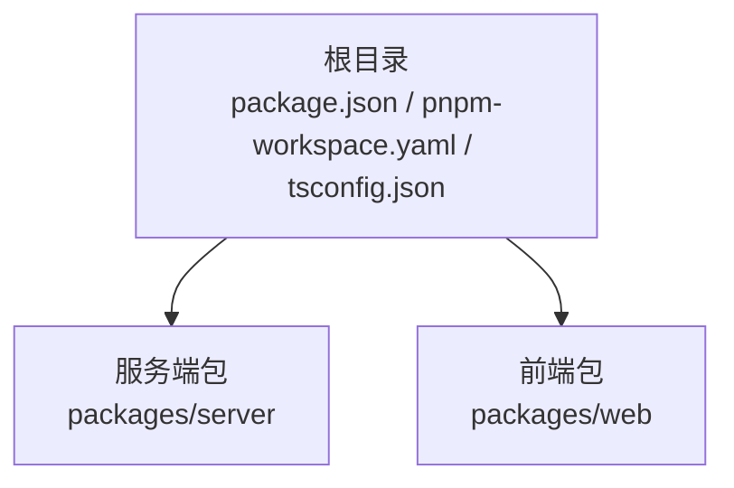
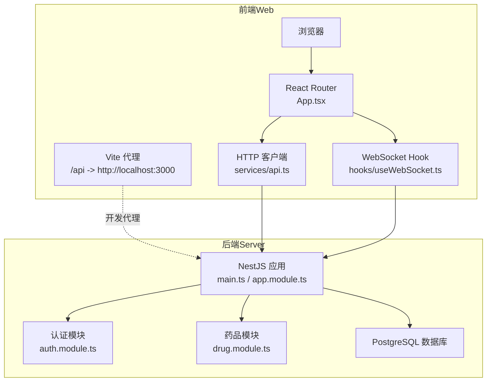
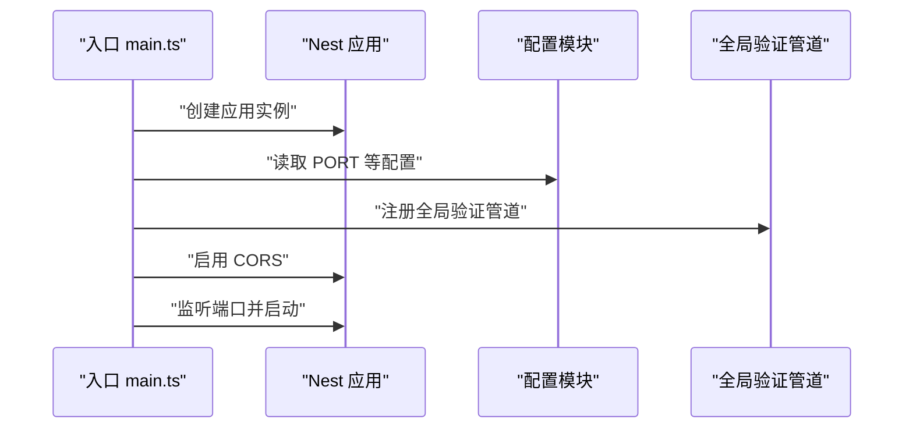
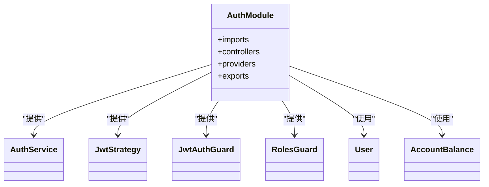
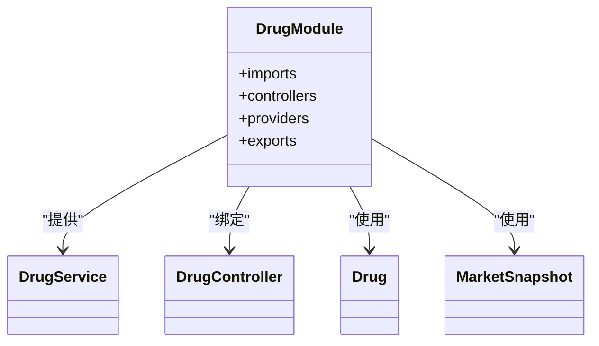
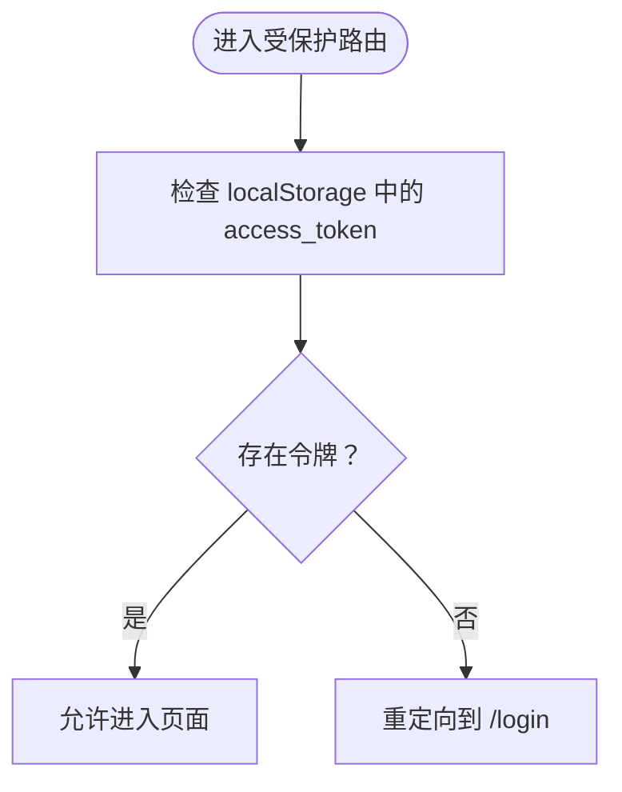
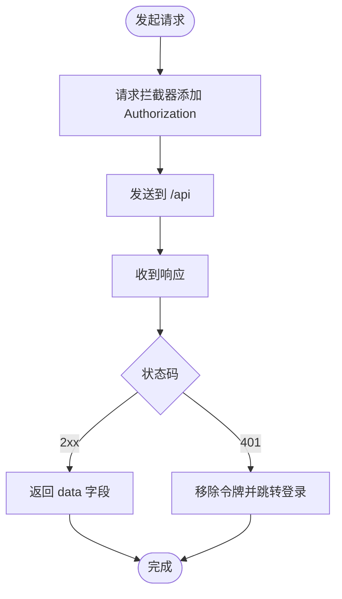
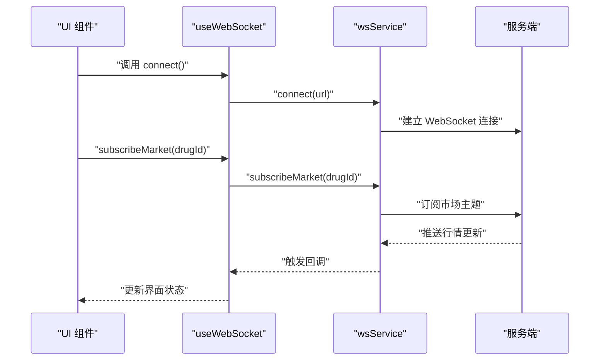
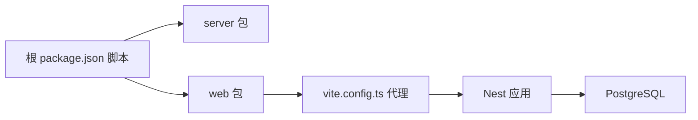

# 整体架构设计

<cite>
**本文引用的文件**
- [package.json](file://package.json)
- [pnpm-workspace.yaml](file://pnpm-workspace.yaml)
- [tsconfig.json](file://tsconfig.json)
- [packages/server/src/main.ts](file://packages/server/src/main.ts)
- [packages/server/src/app.module.ts](file://packages/server/src/app.module.ts)
- [packages/server/src/modules/auth/auth.module.ts](file://packages/server/src/modules/auth/auth.module.ts)
- [packages/server/src/modules/drug/drug.module.ts](file://packages/server/src/modules/drug/drug.module.ts)
- [packages/web/vite.config.ts](file://packages/web/vite.config.ts)
- [packages/web/src/App.tsx](file://packages/web/src/App.tsx)
- [packages/web/src/services/api.ts](file://packages/web/src/services/api.ts)
- [packages/web/src/hooks/useWebSocket.ts](file://packages/web/src/hooks/useWebSocket.ts)
</cite>

## 目录
1. [引言](#引言)
2. [项目结构](#项目结构)
3. [核心组件](#核心组件)
4. [架构总览](#架构总览)
5. [详细组件分析](#详细组件分析)
6. [依赖分析](#依赖分析)
7. [性能考量](#性能考量)
8. [故障排查指南](#故障排查指南)
9. [结论](#结论)
10. [附录](#附录)

## 引言
本文件面向 Jiaoyi（药品垫资交易平台）项目的整体架构设计，聚焦 Monorepo 架构模式与前后端分离策略，系统化阐述技术栈选择、模块化组织、边界划分、数据流与控制流，并给出可扩展性、可维护性与性能方面的实践建议。文档同时提供系统上下文图、组件关系图与数据流向图，帮助不同背景读者快速理解并参与开发。

## 项目结构
Jiaoyi 采用 pnpm workspace 的 Monorepo 组织方式，将服务端（packages/server）与前端（packages/web）置于同一仓库，通过统一的脚本与类型配置进行协同开发与构建。根级配置定义了工作区范围、脚本入口以及 TypeScript 编译选项；子包各自维护独立的依赖与构建配置，便于按需扩展与隔离。

图表来源
- [pnpm-workspace.yaml:1-3](file://pnpm-workspace.yaml#L1-L3)
- [package.json:1-24](file://package.json#L1-L24)

章节来源
- [pnpm-workspace.yaml:1-3](file://pnpm-workspace.yaml#L1-L3)
- [package.json:1-24](file://package.json#L1-L24)
- [tsconfig.json:1-17](file://tsconfig.json#L1-L17)

## 核心组件
- 服务端（NestJS + PostgreSQL）
  - 应用入口负责初始化 Nest 应用、注册全局验证管道与 CORS、读取环境变量并启动监听。
  - 根模块集中导入配置模块、TypeORM 配置、数据库模块与各业务模块，形成清晰的领域边界。
  - 示例模块（认证、药品等）展示典型的控制器-服务-实体分层与依赖注入。
- 前端（React + Vite）
  - 应用路由采用 React Router，内置私有路由守卫，基于本地存储令牌判断访问权限。
  - 服务层以 Axios 封装统一请求与响应拦截，集中处理鉴权头与错误处理。
  - WebSocket Hook 提供行情、交易、结算等主题的订阅与连接管理。

章节来源
- [packages/server/src/main.ts:1-29](file://packages/server/src/main.ts#L1-L29)
- [packages/server/src/app.module.ts:1-51](file://packages/server/src/app.module.ts#L1-L51)
- [packages/server/src/modules/auth/auth.module.ts:1-34](file://packages/server/src/modules/auth/auth.module.ts#L1-L34)
- [packages/server/src/modules/drug/drug.module.ts:1-15](file://packages/server/src/modules/drug/drug.module.ts#L1-L15)
- [packages/web/src/App.tsx:1-58](file://packages/web/src/App.tsx#L1-L58)
- [packages/web/src/services/api.ts:1-311](file://packages/web/src/services/api.ts#L1-L311)
- [packages/web/src/hooks/useWebSocket.ts:1-138](file://packages/web/src/hooks/useWebSocket.ts#L1-L138)

## 架构总览
Jiaoyi 采用“Monorepo + 前后端分离”的工程化架构。前端通过 Vite 开发服务器运行，开发时经代理将 /api 前缀转发至本地服务端；生产部署时可将前端产物托管于反向代理之后，服务端提供 REST 与 WebSocket 接口。认证采用 JWT 策略，业务模块围绕药品、垫资、销售、结算、账户等维度划分，数据库使用 PostgreSQL 并通过 TypeORM 管理实体与迁移。

图表来源
- [packages/web/vite.config.ts:1-28](file://packages/web/vite.config.ts#L1-L28)
- [packages/web/src/App.tsx:1-58](file://packages/web/src/App.tsx#L1-L58)
- [packages/web/src/services/api.ts:1-311](file://packages/web/src/services/api.ts#L1-L311)
- [packages/web/src/hooks/useWebSocket.ts:1-138](file://packages/web/src/hooks/useWebSocket.ts#L1-L138)
- [packages/server/src/main.ts:1-29](file://packages/server/src/main.ts#L1-L29)
- [packages/server/src/app.module.ts:1-51](file://packages/server/src/app.module.ts#L1-L51)
- [packages/server/src/modules/auth/auth.module.ts:1-34](file://packages/server/src/modules/auth/auth.module.ts#L1-L34)
- [packages/server/src/modules/drug/drug.module.ts:1-15](file://packages/server/src/modules/drug/drug.module.ts#L1-L15)

## 详细组件分析

### 服务端应用启动流程
服务端通过 NestFactory 创建应用实例，启用全局验证管道与 CORS，随后从配置模块读取端口并启动监听。该流程确保请求在进入业务逻辑前完成参数清洗与跨域放行。

图表来源
- [packages/server/src/main.ts:1-29](file://packages/server/src/main.ts#L1-L29)

章节来源
- [packages/server/src/main.ts:1-29](file://packages/server/src/main.ts#L1-L29)

### 认证模块与安全策略
认证模块集成 Passport 与 JWT，通过异步工厂从配置模块读取密钥与过期时间，注册守卫与策略，并在控制器与服务间导出以供其他模块复用。该设计将认证能力解耦为可插拔的模块单元。

图表来源
- [packages/server/src/modules/auth/auth.module.ts:1-34](file://packages/server/src/modules/auth/auth.module.ts#L1-L34)

章节来源
- [packages/server/src/modules/auth/auth.module.ts:1-34](file://packages/server/src/modules/auth/auth.module.ts#L1-L34)

### 药品模块与领域建模
药品模块通过 TypeORM 映射实体与控制器，体现“控制器-服务-实体”三层职责。模块内聚性强，边界清晰，便于后续扩展更多药品相关的业务能力（如历史、统计、队列等）。

图表来源
- [packages/server/src/modules/drug/drug.module.ts:1-15](file://packages/server/src/modules/drug/drug.module.ts#L1-L15)

章节来源
- [packages/server/src/modules/drug/drug.module.ts:1-15](file://packages/server/src/modules/drug/drug.module.ts#L1-L15)

### 前端路由与鉴权流程
前端路由在进入受保护页面前检查本地令牌，未登录则重定向至登录页。该策略简化了客户端侧的鉴权逻辑，配合服务端 JWT 使用，保证会话一致性。

图表来源
- [packages/web/src/App.tsx:12-31](file://packages/web/src/App.tsx#L12-L31)

章节来源
- [packages/web/src/App.tsx:1-58](file://packages/web/src/App.tsx#L1-L58)

### HTTP 客户端与错误处理
HTTP 客户端以 Axios 实例封装，统一设置基础路径、超时与请求头；请求拦截器自动附加 Bearer Token；响应拦截器对 401 场景进行处理（当前为临时跳转登录）。该设计便于后续接入刷新令牌机制。

图表来源
- [packages/web/src/services/api.ts:12-59](file://packages/web/src/services/api.ts#L12-L59)

章节来源
- [packages/web/src/services/api.ts:1-311](file://packages/web/src/services/api.ts#L1-L311)

### WebSocket 订阅与连接管理
WebSocket Hook 提供连接、断开、订阅与取消订阅等操作，并通过事件回调处理多类主题（行情、交易、结算、通知等）。该抽象将实时通信与 UI 组件解耦，便于在多个页面复用。

图表来源
- [packages/web/src/hooks/useWebSocket.ts:32-97](file://packages/web/src/hooks/useWebSocket.ts#L32-L97)

章节来源
- [packages/web/src/hooks/useWebSocket.ts:1-138](file://packages/web/src/hooks/useWebSocket.ts#L1-L138)

## 依赖分析
- Monorepo 工作区
  - pnpm workspace 将 packages/server 与 packages/web 纳入同一工作区，根脚本统一调度各包的开发、构建、类型检查与 Lint。
- 前端依赖
  - Vite 提供开发服务器与代理配置，将 /api 请求转发至本地服务端；别名映射提升模块引用效率。
- 后端依赖
  - NestJS 提供模块化框架；TypeORM 负责 ORM 与迁移；配置模块集中管理环境变量；认证模块集成 JWT 与守卫。
- 前后端交互
  - 前端通过 /api 前缀访问后端 REST 接口；WebSocket 用于实时行情与系统通知。

图表来源
- [package.json:6-13](file://package.json#L6-L13)
- [pnpm-workspace.yaml:1-3](file://pnpm-workspace.yaml#L1-L3)
- [packages/web/vite.config.ts:18-26](file://packages/web/vite.config.ts#L18-L26)
- [packages/server/src/app.module.ts:21-37](file://packages/server/src/app.module.ts#L21-L37)

章节来源
- [package.json:1-24](file://package.json#L1-L24)
- [pnpm-workspace.yaml:1-3](file://pnpm-workspace.yaml#L1-L3)
- [packages/web/vite.config.ts:1-28](file://packages/web/vite.config.ts#L1-L28)
- [packages/server/src/app.module.ts:1-51](file://packages/server/src/app.module.ts#L1-L51)

## 性能考量
- 服务端
  - 启用全局验证管道减少脏数据进入业务层；TypeORM 在开发环境开启日志便于调试，生产关闭以降低开销。
  - 模块化拆分有助于按需加载与懒编译，降低冷启动成本。
- 前端
  - Vite 的快速热更新与按需打包提升开发体验；代理仅在开发阶段生效，避免生产冗余。
  - Axios 统一拦截器减少重复逻辑，提高网络层稳定性。
- 实时通信
  - WebSocket 采用事件驱动与主题订阅，避免轮询带来的带宽与 CPU 开销。
- 数据库
  - 使用迁移与同步开关控制 Schema 变更，开发环境便于迭代，生产默认关闭同步以保障一致性。

章节来源
- [packages/server/src/main.ts:12-23](file://packages/server/src/main.ts#L12-L23)
- [packages/server/src/app.module.ts:31-35](file://packages/server/src/app.module.ts#L31-L35)
- [packages/web/vite.config.ts:18-26](file://packages/web/vite.config.ts#L18-L26)
- [packages/web/src/services/api.ts:12-59](file://packages/web/src/services/api.ts#L12-L59)
- [packages/web/src/hooks/useWebSocket.ts:32-97](file://packages/web/src/hooks/useWebSocket.ts#L32-L97)

## 故障排查指南
- 服务端无法启动或端口占用
  - 检查配置模块是否正确读取端口；确认端口未被占用。
- CORS 导致跨域失败
  - 确认已启用 CORS 并允许来源与凭据。
- 鉴权失败或频繁 401
  - 检查本地存储的 access_token 是否存在；确认请求拦截器已附加 Authorization 头。
- WebSocket 连接异常
  - 确认代理地址与服务端 WebSocket 端点一致；检查连接状态与订阅主题是否正确。
- 数据库连接问题
  - 核对数据库主机、端口、账号、密码与数据库名；确认迁移已执行且同步关闭。

章节来源
- [packages/server/src/main.ts:19-23](file://packages/server/src/main.ts#L19-L23)
- [packages/web/src/services/api.ts:12-59](file://packages/web/src/services/api.ts#L12-L59)
- [packages/web/src/hooks/useWebSocket.ts:32-97](file://packages/web/src/hooks/useWebSocket.ts#L32-L97)
- [packages/server/src/app.module.ts:21-37](file://packages/server/src/app.module.ts#L21-L37)

## 结论
Jiaoyi 的架构以 Monorepo 为工程基座，前后端分离明确职责边界，服务端以 NestJS + TypeORM 构建高内聚模块，前端以 React + Vite 提供高效开发体验。通过统一的脚本与配置，团队可在保持一致性的同时灵活扩展业务模块与前端页面。建议后续完善 WebSocket 刷新与错误恢复、增强服务端监控与日志聚合、引入缓存与限流策略以进一步提升性能与稳定性。

## 附录
- 架构演进路线图（建议）
  - 短期
    - 完善前端 Token 刷新与错误恢复链路。
    - 增加服务端健康检查与指标上报。
  - 中期
    - 引入消息队列与任务调度，支撑异步结算与报表。
    - 前端增加缓存与离线提示，优化弱网体验。
  - 长期
    - 服务端微服务化拆分（按业务域），前端多 SPA 或微前端化。
    - 引入可观测性平台（APM/日志/告警）与自动化测试体系。