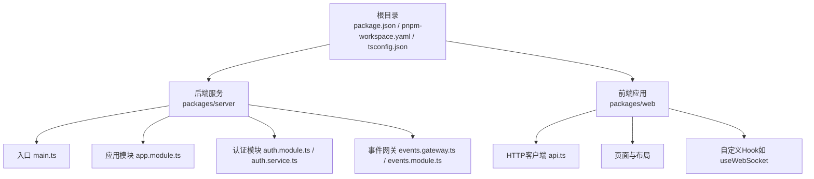
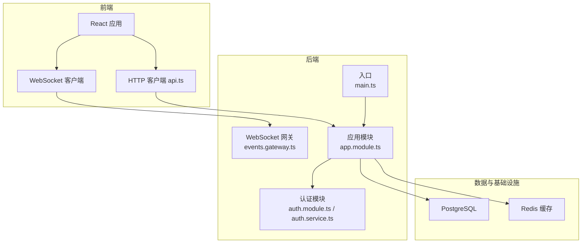
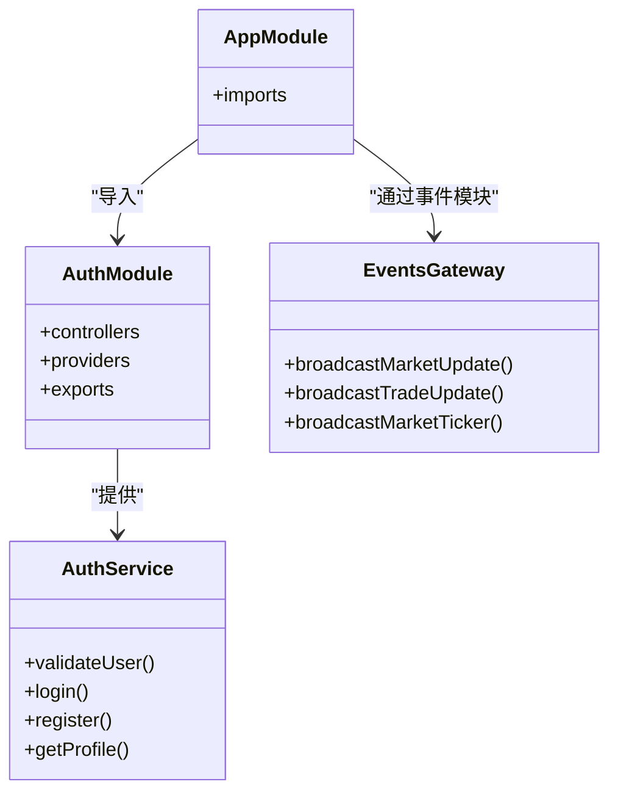
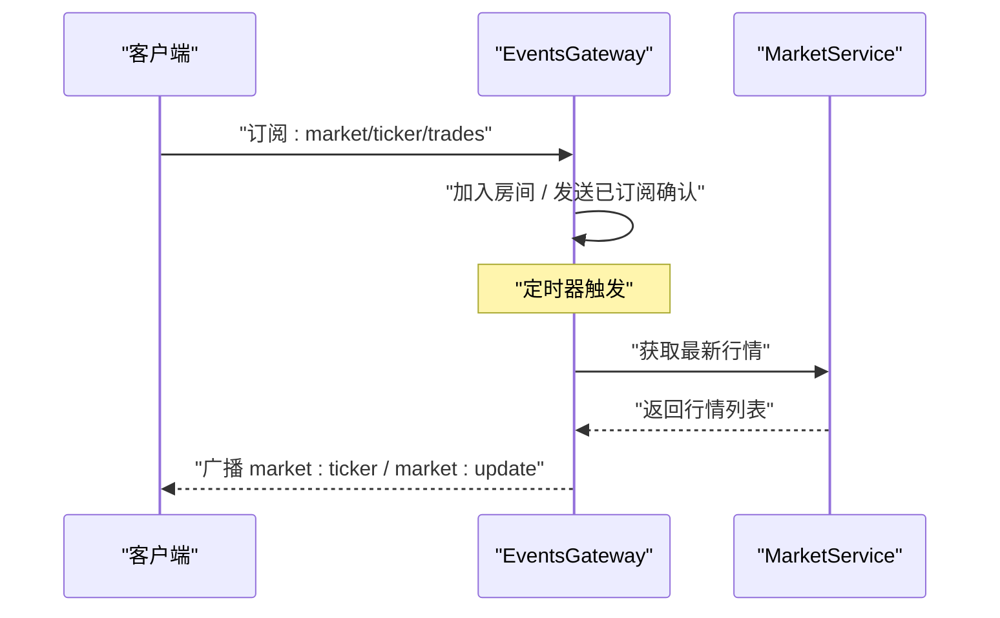
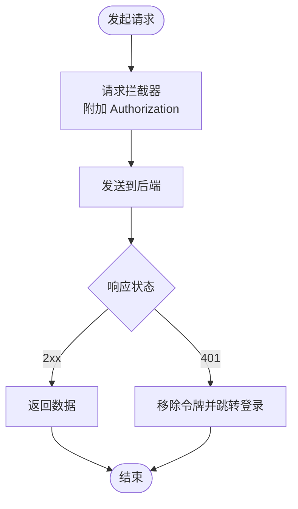
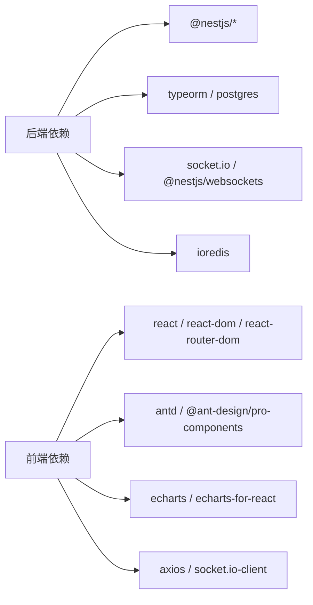

# 系统架构

<cite>
**本文引用的文件**
- [package.json](file://package.json)
- [pnpm-workspace.yaml](file://pnpm-workspace.yaml)
- [tsconfig.json](file://tsconfig.json)
- [packages/server/nest-cli.json](file://packages/server/nest-cli.json)
- [packages/server/package.json](file://packages/server/package.json)
- [packages/server/src/main.ts](file://packages/server/src/main.ts)
- [packages/server/src/app.module.ts](file://packages/server/src/app.module.ts)
- [packages/server/src/modules/auth/auth.module.ts](file://packages/server/src/modules/auth/auth.module.ts)
- [packages/server/src/modules/auth/auth.service.ts](file://packages/server/src/modules/auth/auth.service.ts)
- [packages/server/src/common/events/events.module.ts](file://packages/server/src/common/events/events.module.ts)
- [packages/server/src/common/events/events.gateway.ts](file://packages/server/src/common/events/events.gateway.ts)
- [packages/web/package.json](file://packages/web/package.json)
- [packages/web/src/services/api.ts](file://packages/web/src/services/api.ts)
</cite>

## 目录
1. [引言](#引言)
2. [项目结构](#项目结构)
3. [核心组件](#核心组件)
4. [架构总览](#架构总览)
5. [详细组件分析](#详细组件分析)
6. [依赖分析](#依赖分析)
7. [性能考虑](#性能考虑)
8. [故障排查指南](#故障排查指南)
9. [结论](#结论)
10. [附录](#附录)

## 引言
本文件面向Jiaoyi项目，系统性阐述其Monorepo架构与前后端分离设计，重点覆盖：
- 前后端职责划分与交互边界
- NestJS后端的模块化、依赖注入与分层架构
- React前端的组件结构、状态管理与路由设计
- WebSocket实时通信与事件驱动模式
- 数据流、集成点与系统边界
- 架构决策的技术考量与权衡
- 基础设施要求、可扩展性与部署拓扑建议

## 项目结构
Jiaoyi采用基于pnpm workspaces的Monorepo组织方式，根目录通过脚本统一编排前后端开发与构建流程；后端以NestJS为核心，前端以Vite + React为主。

图表来源
- [package.json:1-24](file://package.json#L1-L24)
- [pnpm-workspace.yaml:1-3](file://pnpm-workspace.yaml#L1-L3)
- [tsconfig.json:1-17](file://tsconfig.json#L1-L17)
- [packages/server/src/main.ts:1-29](file://packages/server/src/main.ts#L1-L29)
- [packages/server/src/app.module.ts:1-51](file://packages/server/src/app.module.ts#L1-L51)
- [packages/server/src/modules/auth/auth.module.ts:1-34](file://packages/server/src/modules/auth/auth.module.ts#L1-L34)
- [packages/server/src/modules/auth/auth.service.ts:1-100](file://packages/server/src/modules/auth/auth.service.ts#L1-L100)
- [packages/server/src/common/events/events.module.ts:1-15](file://packages/server/src/common/events/events.module.ts#L1-L15)
- [packages/server/src/common/events/events.gateway.ts:1-165](file://packages/server/src/common/events/events.gateway.ts#L1-L165)
- [packages/web/src/services/api.ts:1-311](file://packages/web/src/services/api.ts#L1-L311)

章节来源
- [package.json:6-13](file://package.json#L6-L13)
- [pnpm-workspace.yaml:1-3](file://pnpm-workspace.yaml#L1-L3)
- [tsconfig.json:1-17](file://tsconfig.json#L1-L17)

## 核心组件
- 后端服务（NestJS）
  - 应用入口负责初始化容器、注册全局验证管道与CORS，并按配置启动HTTP服务。
  - 应用模块集中导入配置、数据库、各业务模块与事件模块。
  - 认证模块提供JWT策略、守卫与仓储注入，支撑登录、注册与用户资料查询。
  - 事件模块与事件网关实现WebSocket网关、订阅通道与定时广播。
- 前端应用（React + Vite）
  - 通过Axios实例封装统一请求、鉴权头注入与错误处理。
  - 提供认证、用户、药品、市场、垫资、账户、销售、清算等API集合。
  - 页面与布局组件承载UI与交互，自定义Hook抽象网络与实时通信。

章节来源
- [packages/server/src/main.ts:6-27](file://packages/server/src/main.ts#L6-L27)
- [packages/server/src/app.module.ts:15-48](file://packages/server/src/app.module.ts#L15-L48)
- [packages/server/src/modules/auth/auth.module.ts:14-32](file://packages/server/src/modules/auth/auth.module.ts#L14-L32)
- [packages/server/src/modules/auth/auth.service.ts:9-17](file://packages/server/src/modules/auth/auth.service.ts#L9-L17)
- [packages/server/src/common/events/events.module.ts:6-12](file://packages/server/src/common/events/events.module.ts#L6-L12)
- [packages/server/src/common/events/events.gateway.ts:22-32](file://packages/server/src/common/events/events.gateway.ts#L22-L32)
- [packages/web/src/services/api.ts:3-24](file://packages/web/src/services/api.ts#L3-L24)
- [packages/web/src/services/api.ts:62-77](file://packages/web/src/services/api.ts#L62-L77)

## 架构总览
Jiaoyi采用“前端渲染 + 后端服务 + 实时推送”的整体架构。前端通过REST API与WebSocket与后端交互；后端以模块化方式组织业务域，使用TypeORM进行数据持久化，Redis用于缓存（由依赖声明体现），并通过定时任务周期性推送行情快照。

图表来源
- [packages/server/src/main.ts:1-29](file://packages/server/src/main.ts#L1-L29)
- [packages/server/src/app.module.ts:1-51](file://packages/server/src/app.module.ts#L1-L51)
- [packages/server/src/modules/auth/auth.module.ts:1-34](file://packages/server/src/modules/auth/auth.module.ts#L1-L34)
- [packages/server/src/modules/auth/auth.service.ts:1-100](file://packages/server/src/modules/auth/auth.service.ts#L1-L100)
- [packages/server/src/common/events/events.gateway.ts:1-165](file://packages/server/src/common/events/events.gateway.ts#L1-L165)
- [packages/web/src/services/api.ts:1-311](file://packages/web/src/services/api.ts#L1-L311)

## 详细组件分析

### 后端：模块化与依赖注入
- 模块组织
  - 应用模块集中导入配置、数据库、业务模块与事件模块，形成清晰的领域边界。
  - 认证模块引入Passport/JWT策略与守卫，注入用户与账户余额实体仓储，提供登录、注册、用户资料查询能力。
- 依赖注入
  - 服务通过构造函数注入仓储与JWT服务，便于测试与替换。
  - 全局验证管道启用白名单、转换与非白名单禁止，提升输入安全性。
- 分层架构
  - 控制器负责请求映射与参数校验
  - 服务封装业务规则与事务边界
  - 仓储对接数据库实体
  - 网关负责实时事件发布

图表来源
- [packages/server/src/app.module.ts:15-48](file://packages/server/src/app.module.ts#L15-L48)
- [packages/server/src/modules/auth/auth.module.ts:14-32](file://packages/server/src/modules/auth/auth.module.ts#L14-L32)
- [packages/server/src/modules/auth/auth.service.ts:9-17](file://packages/server/src/modules/auth/auth.service.ts#L9-L17)
- [packages/server/src/common/events/events.gateway.ts:22-32](file://packages/server/src/common/events/events.gateway.ts#L22-L32)

章节来源
- [packages/server/src/app.module.ts:15-48](file://packages/server/src/app.module.ts#L15-L48)
- [packages/server/src/modules/auth/auth.module.ts:14-32](file://packages/server/src/modules/auth/auth.module.ts#L14-L32)
- [packages/server/src/modules/auth/auth.service.ts:9-17](file://packages/server/src/modules/auth/auth.service.ts#L9-L17)

### 后端：WebSocket实时通信与事件驱动
- 网关配置
  - 使用Socket.IO作为WebSocket服务器，开启跨域支持，设置命名空间。
  - 提供连接生命周期钩子与消息订阅处理。
- 订阅与广播
  - 支持市场行情、交易、ticker、快照、垫资、清算等多通道订阅。
  - 通过房间（room）隔离不同药品或用户维度的消息。
- 定时推送
  - 启动定时器周期拉取最新行情并广播ticker，确保前端实时更新。
- 错误处理
  - 在广播与推送过程中捕获异常并记录日志，避免中断连接。

图表来源
- [packages/server/src/common/events/events.gateway.ts:48-74](file://packages/server/src/common/events/events.gateway.ts#L48-L74)
- [packages/server/src/common/events/events.gateway.ts:126-143](file://packages/server/src/common/events/events.gateway.ts#L126-L143)
- [packages/server/src/common/events/events.gateway.ts:146-156](file://packages/server/src/common/events/events.gateway.ts#L146-L156)

章节来源
- [packages/server/src/common/events/events.gateway.ts:15-20](file://packages/server/src/common/events/events.gateway.ts#L15-L20)
- [packages/server/src/common/events/events.gateway.ts:48-74](file://packages/server/src/common/events/events.gateway.ts#L48-L74)
- [packages/server/src/common/events/events.gateway.ts:126-143](file://packages/server/src/common/events/events.gateway.ts#L126-L143)

### 前端：HTTP客户端与API封装
- Axios实例
  - 统一基础URL、超时与请求头；在请求拦截器中自动附加JWT令牌。
  - 在响应拦截器中处理401未授权（当前实现为清理本地令牌并跳转登录页）。
- API集合
  - 按领域拆分：认证、用户、药品、市场、垫资、账户、销售、清算等。
  - 保留兼容旧接口名称，便于平滑迁移。
- 与后端的集成点
  - 所有REST调用均通过统一的Axios实例发起，遵循后端路由约定。

图表来源
- [packages/web/src/services/api.ts:3-24](file://packages/web/src/services/api.ts#L3-L24)
- [packages/web/src/services/api.ts:26-59](file://packages/web/src/services/api.ts#L26-L59)

章节来源
- [packages/web/src/services/api.ts:3-24](file://packages/web/src/services/api.ts#L3-L24)
- [packages/web/src/services/api.ts:62-311](file://packages/web/src/services/api.ts#L62-L311)

### 前端：组件结构、状态管理与路由设计
- 组件结构
  - 页面级组件位于pages目录，布局组件位于layouts目录，通用可视化组件位于components目录。
  - 自定义Hook（如useWebSocket）抽象网络与实时通信。
- 状态管理
  - 当前仓库未发现集中式状态库（如Zustand/Redux），前端状态主要由React组件与Hook管理。
- 路由设计
  - 使用React Router进行页面路由管理，页面包括仪表盘、市场、交易、持仓、结算、管理员等。

章节来源
- [packages/web/package.json:13-38](file://packages/web/package.json#L13-L38)

## 依赖分析
- 后端依赖
  - NestJS生态：Web框架、Socket.IO、Schedule、TypeORM、JWT、Passport等。
  - 数据库：PostgreSQL（TypeORM配置于应用模块）。
  - 缓存：ioredis（依赖声明）。
- 前端依赖
  - React、Ant Design、React Router、ECharts、Axios、Socket.IO客户端等。

图表来源
- [packages/server/package.json:26-48](file://packages/server/package.json#L26-L48)
- [packages/web/package.json:13-24](file://packages/web/package.json#L13-L24)

章节来源
- [packages/server/package.json:26-48](file://packages/server/package.json#L26-L48)
- [packages/web/package.json:13-24](file://packages/web/package.json#L13-L24)

## 性能考虑
- WebSocket广播
  - 定时器周期推送需结合实际数据量与带宽评估频率，避免过度广播导致延迟与资源消耗。
  - 房间分组可降低无效广播范围，提高命中率。
- HTTP请求
  - 统一拦截器减少重复逻辑，但需注意请求头与重试策略对性能的影响。
- 数据库与缓存
  - TypeORM同步关闭、迁移运行与日志级别需根据环境调整，生产环境建议关闭同步并启用迁移。
  - Redis可用于热点数据与会话存储，需规划容量与过期策略。
- 前端渲染
  - 图表组件按需加载与懒加载可优化首屏性能；路由与页面组件的分割有助于代码分割。

## 故障排查指南
- WebSocket连接问题
  - 检查网关命名空间与跨域配置；确认客户端订阅频道与房间加入逻辑。
  - 关注定时器与服务生命周期，确保模块销毁时清理定时器。
- 认证与授权
  - 登录/注册失败通常由用户存在性或密码校验异常导致；检查仓储查询与哈希比对。
  - 401错误由拦截器处理，确认本地令牌有效性与后端签发策略。
- 数据库与迁移
  - 生产环境禁用同步，启用迁移并确保迁移脚本正确执行。
- 日志与监控
  - 网关与服务内均有日志输出，定位异常时优先查看相关日志。

章节来源
- [packages/server/src/common/events/events.gateway.ts:126-143](file://packages/server/src/common/events/events.gateway.ts#L126-L143)
- [packages/server/src/modules/auth/auth.service.ts:49-85](file://packages/server/src/modules/auth/auth.service.ts#L49-L85)
- [packages/web/src/services/api.ts:26-59](file://packages/web/src/services/api.ts#L26-L59)

## 结论
Jiaoyi通过Monorepo统一管理前后端，后端以NestJS模块化与依赖注入实现清晰的业务边界与可维护性，前端以Axios与Socket.IO实现与后端的稳定交互。WebSocket事件驱动模式有效支撑了市场行情的实时推送。后续可在认证Token刷新、状态管理方案、缓存策略与可观测性方面进一步完善。

## 附录
- 基础设施要求
  - 后端：Node.js ≥ 18，PostgreSQL，Redis（可选），Socket.IO服务端。
  - 前端：现代浏览器，Vite构建工具链。
- 可扩展性
  - 模块化设计便于新增业务域；WebSocket通道可按需扩展；数据库迁移与缓存策略需随业务增长迭代。
- 部署拓扑建议
  - 前端静态资源可部署至CDN或反向代理；后端服务可容器化并横向扩展；WebSocket需确保负载均衡下的一致性或无状态策略。