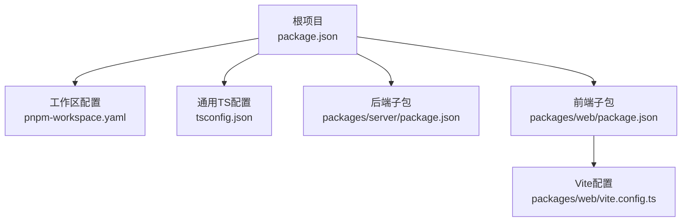
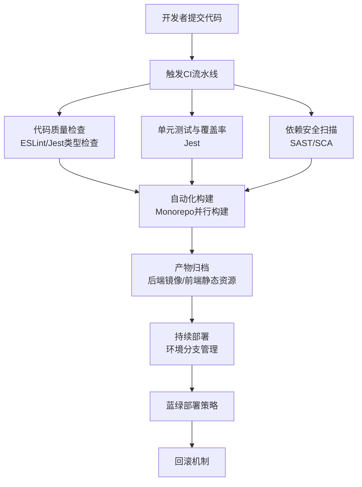
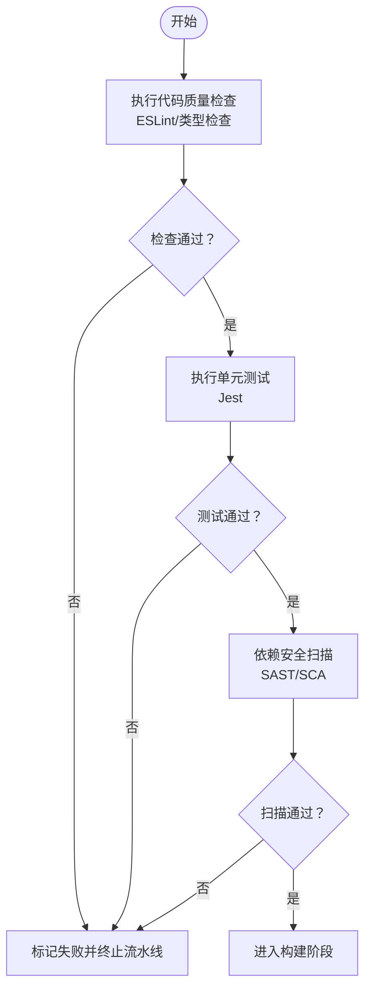
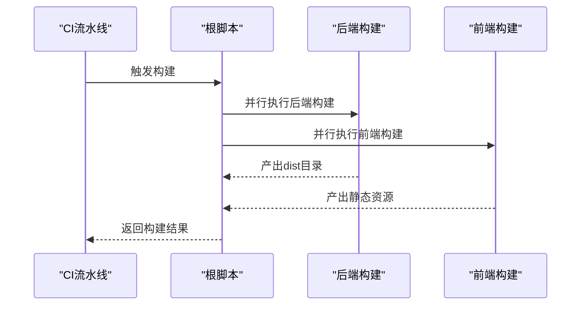
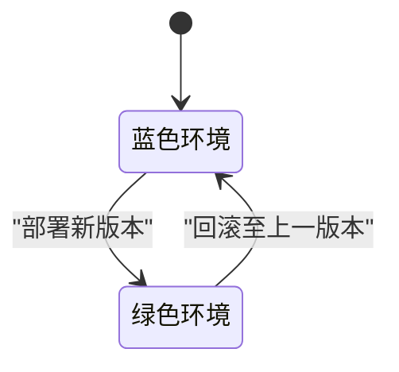
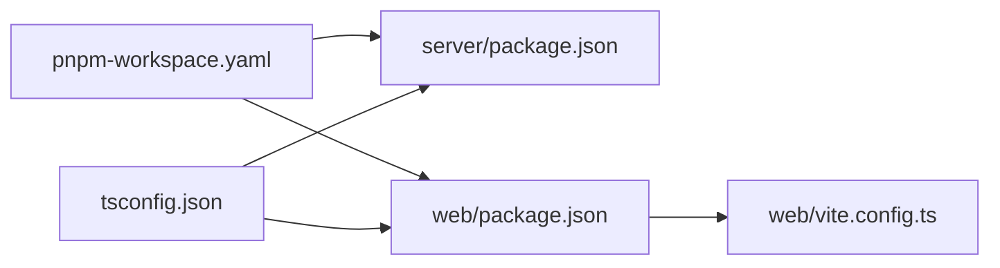

# CI/CD流程

<cite>
**本文档引用的文件**
- [package.json](file://package.json)
- [pnpm-workspace.yaml](file://pnpm-workspace.yaml)
- [tsconfig.json](file://tsconfig.json)
- [packages/server/package.json](file://packages/server/package.json)
- [packages/web/package.json](file://packages/web/package.json)
- [packages/web/vite.config.ts](file://packages/web/vite.config.ts)
</cite>

## 目录
1. [简介](#简介)
2. [项目结构](#项目结构)
3. [核心组件](#核心组件)
4. [架构总览](#架构总览)
5. [详细组件分析](#详细组件分析)
6. [依赖关系分析](#依赖关系分析)
7. [性能考虑](#性能考虑)
8. [故障排除指南](#故障排除指南)
9. [结论](#结论)
10. [附录](#附录)

## 简介
本文件面向Jiaoyi项目的CI/CD流程设计与实施，基于当前仓库中的Monorepo结构与构建脚本，系统化地规划持续集成（代码质量检查、单元测试、依赖安全扫描）、自动化构建（Monorepo构建策略、前后端分别构建与产物打包）以及持续部署（环境分支管理、蓝绿部署策略与回滚机制）。同时提供部署脚本编写要点（环境变量配置、数据库迁移、静态资源部署）、发布管理（版本标签、变更日志与发布通知）及测试策略（性能回归测试与安全漏洞扫描）的自动化建议。

## 项目结构
Jiaoyi采用基于pnpm workspaces的Monorepo组织方式，根目录通过工作区配置声明子包范围，并在根级与各子包中定义了统一的TypeScript编译配置与构建脚本。前端位于packages/web，后端位于packages/server，二者均具备独立的开发、构建、类型检查、代码质量与测试脚本。

**图表来源**
- [package.json:1-24](file://package.json#L1-L24)
- [pnpm-workspace.yaml:1-3](file://pnpm-workspace.yaml#L1-L3)
- [tsconfig.json:1-17](file://tsconfig.json#L1-L17)
- [packages/server/package.json:1-90](file://packages/server/package.json#L1-L90)
- [packages/web/package.json:1-39](file://packages/web/package.json#L1-L39)
- [packages/web/vite.config.ts](file://packages/web/vite.config.ts)

**章节来源**
- [package.json:1-24](file://package.json#L1-L24)
- [pnpm-workspace.yaml:1-3](file://pnpm-workspace.yaml#L1-L3)
- [tsconfig.json:1-17](file://tsconfig.json#L1-L17)
- [packages/server/package.json:1-90](file://packages/server/package.json#L1-L90)
- [packages/web/package.json:1-39](file://packages/web/package.json#L1-L39)

## 核心组件
- 根级构建与质量脚本：提供统一入口，支持并行执行前后端构建、类型检查与代码质量检查。
- 子包构建脚本：后端使用Nest CLI进行构建与开发；前端使用Vite进行开发与生产构建。
- 测试与覆盖率：后端使用Jest，配置了覆盖率收集与测试环境；前端使用ESLint进行代码质量检查。
- 数据库迁移：后端提供TypeORM迁移生成、运行与回退命令，便于数据库演进管理。
- 工作区与类型配置：统一的TypeScript编译选项与排除规则，确保跨包一致性。

**章节来源**
- [package.json:6-14](file://package.json#L6-L14)
- [packages/server/package.json:8-24](file://packages/server/package.json#L8-L24)
- [packages/server/package.json:72-88](file://packages/server/package.json#L72-L88)
- [packages/web/package.json:6-12](file://packages/web/package.json#L6-L12)

## 架构总览
下图展示了从代码提交到产物发布的整体CI/CD流程：代码推送触发流水线，依次执行代码质量检查、单元测试、依赖安全扫描与构建；构建产物分别交付后端服务镜像与前端静态资源；随后进入持续部署阶段，按环境分支策略进行蓝绿部署与回滚。

[此图为概念性流程图，不直接映射具体源码文件，故无图表来源]

## 详细组件分析

### 持续集成管道设计
- 代码质量检查：前端通过ESLint执行静态检查；后端通过TypeScript类型检查与ESLint共同保障质量。
- 单元测试执行：后端使用Jest进行测试与覆盖率统计；前端通过ESLint报告未使用规则等潜在问题。
- 依赖安全扫描：建议在CI中集成SAST与SCA工具，对依赖树进行漏洞扫描与许可证合规检查。

[此图为概念性流程图，不直接映射具体源码文件，故无图表来源]

**章节来源**
- [packages/web/package.json:10](file://packages/web/package.json#L10)
- [packages/server/package.json:14](file://packages/server/package.json#L14)
- [packages/server/package.json:19](file://packages/server/package.json#L19)
- [packages/server/package.json:72-88](file://packages/server/package.json#L72-L88)

### 自动化构建流程
- Monorepo构建策略：根级脚本并行执行前后端构建，确保构建顺序与资源利用效率。
- 前后端分别构建：
  - 后端：使用Nest CLI进行构建，产物位于dist目录，适合容器化部署。
  - 前端：使用Vite进行生产构建，产物位于构建输出目录（由Vite配置决定）。
- 产物打包：后端以可执行产物为核心；前端静态资源需配合Web服务器或CDN分发。

**图表来源**
- [package.json:11](file://package.json#L11)
- [packages/server/package.json:9](file://packages/server/package.json#L9)
- [packages/web/package.json:8](file://packages/web/package.json#L8)

**章节来源**
- [package.json:11](file://package.json#L11)
- [packages/server/package.json:9](file://packages/server/package.json#L9)
- [packages/web/package.json:8](file://packages/web/package.json#L8)

### 持续部署流程
- 环境分支管理：建议采用Git分支策略（如主干保护、功能分支、发布分支），结合环境标签区分开发/预发/生产。
- 蓝绿部署策略：通过两套相同规模的生产环境（蓝/绿）交替切换，新版本先部署至备用环境，健康检查通过后再切换流量。
- 回滚机制：若健康检查失败或监控告警触发，立即切回上一个稳定版本并恢复流量。

[此图为概念性状态图，不直接映射具体源码文件，故无图表来源]

### 部署脚本编写要点
- 环境变量配置：在部署前注入后端所需的数据库连接、Redis、JWT密钥等敏感配置。
- 数据库迁移：在部署前置入迁移脚本，确保数据库结构与应用版本一致。
- 静态资源部署：将前端构建产物上传至CDN或Web服务器根目录，确保缓存与版本号策略正确。

[本节为通用实践指导，不直接分析具体文件，故无章节来源]

### 发布管理
- 版本标签：遵循语义化版本，在合并PR时打标签并生成发布说明。
- 变更日志：自动生成变更日志，汇总本次发布的重要修复、改进与破坏性变更。
- 发布通知：在发布完成后向团队与相关方发送通知，同步部署状态与注意事项。

[本节为通用实践指导，不直接分析具体文件，故无章节来源]

### 测试策略集成
- 性能回归测试：在CI中加入性能基准测试，对比关键接口响应时间与吞吐量，防止性能退化。
- 安全漏洞扫描：在依赖安装后执行安全扫描，阻断存在高危漏洞的依赖进入生产。

[本节为通用实践指导，不直接分析具体文件，故无章节来源]

## 依赖关系分析
- 工作区与包管理：pnpm工作区声明了子包范围，根级脚本通过过滤器调用子包脚本，实现统一的开发与构建体验。
- 类型配置共享：根级TypeScript配置被所有子包继承，保证编译选项一致。
- 前端构建依赖：Vite配置文件用于控制构建行为，应与根级TypeScript配置协同。

**图表来源**
- [pnpm-workspace.yaml:1-3](file://pnpm-workspace.yaml#L1-L3)
- [packages/server/package.json:1-90](file://packages/server/package.json#L1-L90)
- [packages/web/package.json:1-39](file://packages/web/package.json#L1-L39)
- [tsconfig.json:1-17](file://tsconfig.json#L1-L17)
- [packages/web/vite.config.ts](file://packages/web/vite.config.ts)

**章节来源**
- [pnpm-workspace.yaml:1-3](file://pnpm-workspace.yaml#L1-L3)
- [tsconfig.json:1-17](file://tsconfig.json#L1-L17)
- [packages/web/vite.config.ts](file://packages/web/vite.config.ts)

## 性能考虑
- 并行构建：根级脚本已支持并行执行前后端构建，建议在CI中充分利用多核资源提升吞吐。
- 缓存策略：在CI中启用pnpm缓存与TypeScript增量编译，减少重复构建时间。
- 部署优化：前端静态资源启用长期缓存与版本化命名，后端镜像层优化与多阶段构建减少体积。

[本节为通用实践指导，不直接分析具体文件，故无章节来源]

## 故障排除指南
- 构建失败排查：优先检查TypeScript编译错误与ESLint违规；确认根级与子包脚本路径正确。
- 测试失败排查：查看Jest覆盖率报告与测试日志，定位失败用例与异常堆栈。
- 数据库迁移问题：核对迁移文件生成与执行顺序，必要时使用回退命令恢复到上一版本。
- 部署异常：检查环境变量是否完整、数据库连接是否可达、静态资源路径是否正确。

**章节来源**
- [packages/server/package.json:20-24](file://packages/server/package.json#L20-L24)
- [packages/server/package.json:72-88](file://packages/server/package.json#L72-L88)

## 结论
本CI/CD流程以Monorepo为基础，结合根级与子包脚本，实现了从代码质量检查、单元测试、依赖安全扫描到自动化构建与部署的闭环。通过蓝绿部署与回滚机制，可有效降低发布风险；配合版本标签、变更日志与发布通知，形成完整的发布管理体系。建议在现有基础上补充具体的CI平台配置与部署脚本模板，以实现端到端自动化。

## 附录
- 建议的CI平台配置要点：
  - 触发条件：主分支保护、Pull Request触发、手动触发。
  - 步骤编排：质量检查 → 单元测试 → 安全扫描 → 构建 → 产物归档 → 部署 → 健康检查 → 回滚（可选）。
  - 密钥与变量：使用平台提供的机密存储管理环境变量与容器镜像仓库凭据。
- 部署脚本模板建议：
  - 环境变量注入：在部署前读取对应环境的变量文件并写入配置。
  - 数据库迁移：在启动前执行迁移命令，确保数据库结构一致。
  - 静态资源：将前端构建产物上传至CDN或Web服务器，并清理旧版本缓存。

[本节为通用实践指导，不直接分析具体文件，故无章节来源]