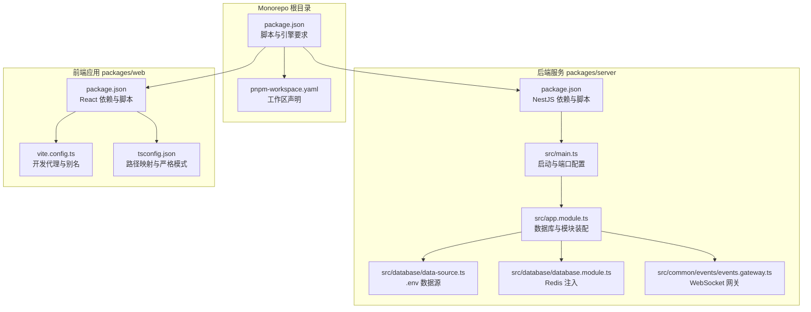
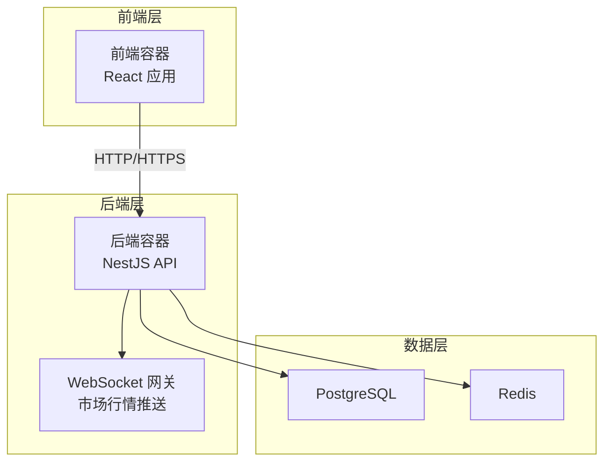
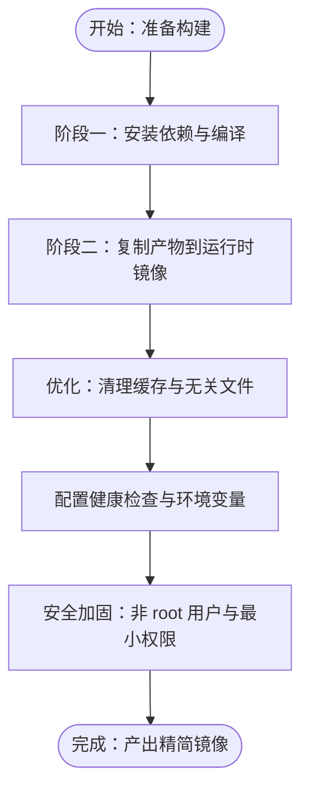
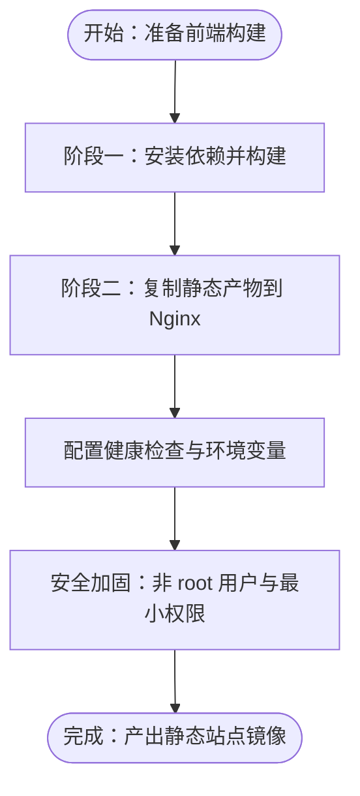
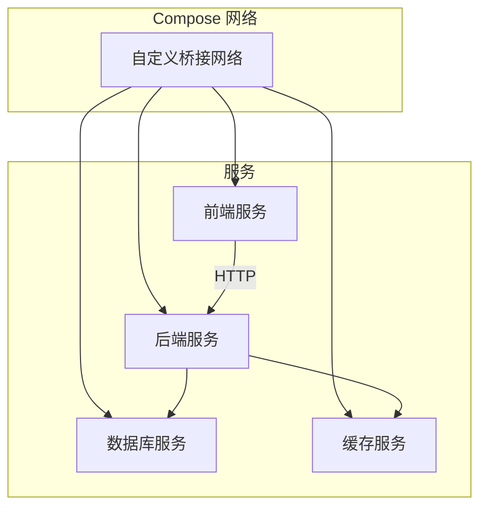
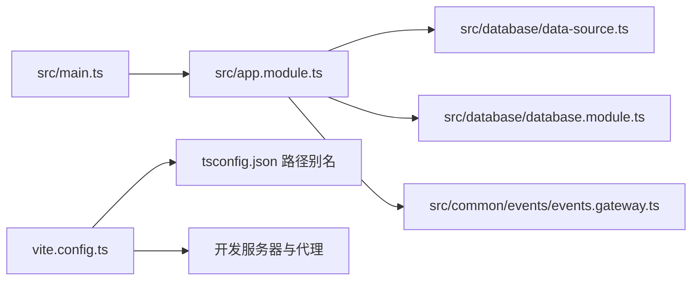

# 容器化部署

<cite>
**本文引用的文件**
- [package.json](file://package.json)
- [pnpm-workspace.yaml](file://pnpm-workspace.yaml)
- [packages/server/package.json](file://packages/server/package.json)
- [packages/server/nest-cli.json](file://packages/server/nest-cli.json)
- [packages/server/src/main.ts](file://packages/server/src/main.ts)
- [packages/server/src/app.module.ts](file://packages/server/src/app.module.ts)
- [packages/server/src/database/data-source.ts](file://packages/server/src/database/data-source.ts)
- [packages/server/src/database/database.module.ts](file://packages/server/src/database/database.module.ts)
- [packages/server/src/common/events/events.gateway.ts](file://packages/server/src/common/events/events.gateway.ts)
- [packages/web/package.json](file://packages/web/package.json)
- [packages/web/vite.config.ts](file://packages/web/vite.config.ts)
- [packages/web/tsconfig.json](file://packages/web/tsconfig.json)
</cite>

## 目录
1. [简介](#简介)
2. [项目结构](#项目结构)
3. [核心组件](#核心组件)
4. [架构总览](#架构总览)
5. [详细组件分析](#详细组件分析)
6. [依赖关系分析](#依赖关系分析)
7. [性能考量](#性能考量)
8. [故障排查指南](#故障排查指南)
9. [结论](#结论)
10. [附录](#附录)

## 简介
本文件面向 Jiaoyi 项目的容器化部署，围绕后端 NestJS API 与前端 React 应用的镜像构建、Compose 编排、运行时配置（健康检查、日志、资源限制）、安全与网络策略、以及升级与版本管理进行系统性说明。文档以仓库现有配置为依据，结合实际代码行为给出可落地的容器化建议。

## 项目结构
Jiaoyi 采用 monorepo 结构，使用 pnpm workspace 管理前后端两个子包：
- packages/server：NestJS 后端 API，提供 REST 与 WebSocket 能力，连接 PostgreSQL 与 Redis。
- packages/web：React 前端应用，通过 Vite 开发服务器与代理访问后端 API。

**图表来源**
- [package.json:1-24](file://package.json#L1-L24)
- [pnpm-workspace.yaml:1-3](file://pnpm-workspace.yaml#L1-L3)
- [packages/server/package.json:1-90](file://packages/server/package.json#L1-L90)
- [packages/server/src/main.ts:1-29](file://packages/server/src/main.ts#L1-L29)
- [packages/server/src/app.module.ts:1-51](file://packages/server/src/app.module.ts#L1-L51)
- [packages/server/src/database/data-source.ts:1-18](file://packages/server/src/database/data-source.ts#L1-L18)
- [packages/server/src/database/database.module.ts:1-25](file://packages/server/src/database/database.module.ts#L1-L25)
- [packages/server/src/common/events/events.gateway.ts:1-164](file://packages/server/src/common/events/events.gateway.ts#L1-L164)
- [packages/web/package.json:1-39](file://packages/web/package.json#L1-L39)
- [packages/web/vite.config.ts:1-28](file://packages/web/vite.config.ts#L1-L28)
- [packages/web/tsconfig.json:1-32](file://packages/web/tsconfig.json#L1-L32)

**章节来源**
- [package.json:1-24](file://package.json#L1-L24)
- [pnpm-workspace.yaml:1-3](file://pnpm-workspace.yaml#L1-L3)

## 核心组件
- 后端 API（NestJS）
  - 启动入口读取配置并监听端口，默认端口来自环境变量；启用全局验证管道与 CORS。
  - 使用 TypeORM 连接 PostgreSQL，支持迁移与日志开关；通过 ConfigModule 从 .env 加载配置。
  - 提供 WebSocket 网关用于市场行情推送。
- 前端应用（React/Vite）
  - 开发服务器默认端口与代理规则，将 /api 请求转发至后端；提供多级路径别名便于模块化开发。
  - TypeScript 配置启用严格模式与 bundler 模式，提升类型安全性与打包效率。

**章节来源**
- [packages/server/src/main.ts:1-29](file://packages/server/src/main.ts#L1-L29)
- [packages/server/src/app.module.ts:15-50](file://packages/server/src/app.module.ts#L15-L50)
- [packages/server/src/database/data-source.ts:1-18](file://packages/server/src/database/data-source.ts#L1-L18)
- [packages/server/src/database/database.module.ts:1-25](file://packages/server/src/database/database.module.ts#L1-L25)
- [packages/server/src/common/events/events.gateway.ts:15-22](file://packages/server/src/common/events/events.gateway.ts#L15-L22)
- [packages/web/vite.config.ts:18-26](file://packages/web/vite.config.ts#L18-L26)
- [packages/web/tsconfig.json:2-27](file://packages/web/tsconfig.json#L2-L27)

## 架构总览
下图展示容器化后的典型拓扑：前端容器通过反向代理或直接访问后端容器；后端容器连接数据库与缓存，并通过 WebSocket 推送实时数据。

[此图为概念性架构示意，不直接映射具体源码文件，故无“图表来源”标注]

## 详细组件分析

### 后端 API 容器化策略
- 基础镜像与运行时
  - 建议基于官方 Node.js LTS 镜像作为基础，确保二进制兼容与安全补丁及时性。
  - 生产镜像应最小化安装依赖，避免在镜像内保留开发工具链。
- 多阶段构建
  - 阶段一：使用完整 Node 环境执行构建（TypeScript 编译、产物生成）。
  - 阶段二：仅复制 dist 产物到精简运行时镜像，减少攻击面与体积。
- 依赖管理
  - 使用 pnpm 管理 monorepo 依赖，构建阶段仅安装生产依赖，避免测试与开发依赖进入最终镜像。
- 运行参数
  - 通过环境变量控制端口、数据库与缓存地址、日志级别等。
  - 启用健康检查探测 HTTP 端点与数据库连通性。
- 安全与网络
  - 限制容器网络访问，仅开放必要端口；对数据库与缓存使用受控网络隔离。
  - 使用只读根文件系统与非 root 用户运行，降低权限风险。

[此流程图为通用构建策略说明，不直接映射具体源码文件，故无“图表来源”标注]

**章节来源**
- [packages/server/package.json:8-24](file://packages/server/package.json#L8-L24)
- [packages/server/nest-cli.json:5-7](file://packages/server/nest-cli.json#L5-L7)
- [packages/server/src/main.ts:9-26](file://packages/server/src/main.ts#L9-L26)
- [packages/server/src/app.module.ts:21-37](file://packages/server/src/app.module.ts#L21-L37)
- [packages/server/src/database/data-source.ts:7-17](file://packages/server/src/database/data-source.ts#L7-L17)
- [packages/server/src/database/database.module.ts:12-20](file://packages/server/src/database/database.module.ts#L12-L20)

### 前端应用容器化策略
- 基础镜像与构建
  - 使用轻量级 Nginx 或静态站点服务镜像承载构建产物；或在 Node 运行时镜像中预构建并导出静态文件。
- 多阶段构建
  - 阶段一：安装依赖并执行构建，生成静态资源。
  - 阶段二：仅复制静态产物到 Nginx 容器，提供高并发静态服务能力。
- 运行参数
  - 通过环境变量注入 API 地址（在容器网络内指向后端服务），避免硬编码。
  - 配置健康检查探测 200 OK 的首页或静态资源可达性。
- 安全与网络
  - 仅暴露 80/443 端口；启用 HTTPS 与安全响应头。
  - 使用只读文件系统与非 root 用户运行。

[此流程图为通用构建策略说明，不直接映射具体源码文件，故无“图表来源”标注]

**章节来源**
- [packages/web/package.json:6-12](file://packages/web/package.json#L6-L12)
- [packages/web/vite.config.ts:1-28](file://packages/web/vite.config.ts#L1-L28)
- [packages/web/tsconfig.json:1-32](file://packages/web/tsconfig.json#L1-L32)

### Docker Compose 编排配置要点
- 服务定义
  - 后端服务：映射端口、挂载 .env 文件、声明数据库与缓存依赖。
  - 前端服务：映射端口、挂载构建产物或通过后端反向代理访问。
- 网络配置
  - 自定义桥接网络，使服务间可通过服务名通信；数据库与缓存置于独立网络或隔离网络。
- 卷挂载
  - 将 .env、日志目录与静态资源目录映射到宿主机，便于维护与备份。
- 环境变量
  - 在 compose 中集中管理数据库、缓存与 API 端口等敏感信息，避免硬编码。

[此图为概念性编排示意，不直接映射具体源码文件，故无“图表来源”标注]

### 健康检查、日志管理与资源限制
- 健康检查
  - 后端：HTTP GET 探针检测 /health 或 /api 端点；数据库连通性探针可选。
  - 前端：静态站点可用性探针检测首页返回状态。
- 日志管理
  - 统一输出到 stdout/stderr，交由编排平台收集；按需开启访问日志与错误日志。
- 资源限制
  - 为后端与前端分别设置 CPU/内存上限与启动超时，避免资源争用。

[本节为通用最佳实践说明，不直接映射具体源码文件，故无“章节来源”标注]

### 安全配置、权限管理与网络安全
- 安全配置
  - 使用只读根文件系统、禁用特权模式、移除不必要的 Linux 功能。
- 权限管理
  - 以非 root 用户运行容器；仅授予容器所需最小权限。
- 网络安全
  - 仅开放必要端口；使用防火墙与网络策略限制入站/出站流量；TLS 终止于边缘或反向代理。

[本节为通用最佳实践说明，不直接映射具体源码文件，故无“章节来源”标注]

### 升级、回滚与版本管理
- 版本管理
  - 以语义化版本管理镜像标签；主分支默认标签指向最新稳定版本。
- 升级策略
  - 蓝绿/金丝雀发布：先部署新版本服务，逐步切换流量；失败时快速回滚。
- 回滚策略
  - 记录镜像标签与部署时间；回滚时恢复上一个稳定版本。
- 数据迁移
  - 在升级前执行数据库迁移；迁移失败时回滚迁移脚本并恢复旧版后端。

[本节为通用最佳实践说明，不直接映射具体源码文件，故无“章节来源”标注]

## 依赖关系分析
后端服务的关键依赖链：启动入口 -> 应用模块 -> 数据源与数据库模块 -> WebSocket 网关；前端依赖链：开发服务器 -> 代理配置 -> 路径别名 -> 构建产物。

**图表来源**
- [packages/server/src/main.ts:1-29](file://packages/server/src/main.ts#L1-L29)
- [packages/server/src/app.module.ts:1-51](file://packages/server/src/app.module.ts#L1-L51)
- [packages/server/src/database/data-source.ts:1-18](file://packages/server/src/database/data-source.ts#L1-L18)
- [packages/server/src/database/database.module.ts:1-25](file://packages/server/src/database/database.module.ts#L1-L25)
- [packages/server/src/common/events/events.gateway.ts:15-22](file://packages/server/src/common/events/events.gateway.ts#L15-L22)
- [packages/web/vite.config.ts:1-28](file://packages/web/vite.config.ts#L1-L28)
- [packages/web/tsconfig.json:1-32](file://packages/web/tsconfig.json#L1-L32)

**章节来源**
- [packages/server/src/main.ts:1-29](file://packages/server/src/main.ts#L1-L29)
- [packages/server/src/app.module.ts:15-50](file://packages/server/src/app.module.ts#L15-L50)
- [packages/server/src/database/data-source.ts:1-18](file://packages/server/src/database/data-source.ts#L1-L18)
- [packages/server/src/database/database.module.ts:1-25](file://packages/server/src/database/database.module.ts#L1-L25)
- [packages/server/src/common/events/events.gateway.ts:15-22](file://packages/server/src/common/events/events.gateway.ts#L15-L22)
- [packages/web/vite.config.ts:1-28](file://packages/web/vite.config.ts#L1-L28)
- [packages/web/tsconfig.json:1-32](file://packages/web/tsconfig.json#L1-L32)

## 性能考量
- 后端
  - 合理设置并发与连接池大小；启用数据库与缓存连接复用；对热点接口进行缓存与限流。
- 前端
  - 启用 Gzip/Brotli 压缩；CDN 分发静态资源；懒加载与代码分割降低首屏延迟。
- 容器层面
  - 使用 SSD 存储与合适的 CPU/内存配额；监控容器指标，动态扩缩容。

[本节为通用性能建议，不直接映射具体源码文件，故无“章节来源”标注]

## 故障排查指南
- 启动失败
  - 检查端口占用与权限；确认 .env 中数据库与缓存地址正确；查看容器日志定位异常。
- 数据库连接问题
  - 校验主机名、端口、凭据与网络连通性；确认迁移已执行且成功。
- WebSocket 不可用
  - 检查网关 CORS 配置与代理转发；确认前端与后端服务在同一网络。
- 前端无法访问后端
  - 校验代理目标地址与跨域设置；确认后端已启用 CORS 并允许来源。

**章节来源**
- [packages/server/src/main.ts:19-23](file://packages/server/src/main.ts#L19-L23)
- [packages/server/src/app.module.ts:21-37](file://packages/server/src/app.module.ts#L21-L37)
- [packages/server/src/common/events/events.gateway.ts:17-20](file://packages/server/src/common/events/events.gateway.ts#L17-L20)
- [packages/web/vite.config.ts:20-25](file://packages/web/vite.config.ts#L20-L25)

## 结论
通过多阶段构建与最小化运行时镜像，结合严格的环境变量与网络隔离策略，Jiaoyi 的前后端可在容器环境中实现高效、安全与可维护的交付。配合健康检查、日志与资源限制，可进一步提升系统的稳定性与可观测性。建议在生产中采用蓝绿/金丝雀发布与版本化管理，确保平滑升级与快速回滚。

## 附录
- 关键配置参考
  - 后端端口与 CORS：[packages/server/src/main.ts:9-23](file://packages/server/src/main.ts#L9-L23)
  - 数据库连接与迁移：[packages/server/src/app.module.ts:21-37](file://packages/server/src/app.module.ts#L21-L37), [packages/server/src/database/data-source.ts:7-17](file://packages/server/src/database/data-source.ts#L7-L17)
  - Redis 注入：[packages/server/src/database/database.module.ts:12-20](file://packages/server/src/database/database.module.ts#L12-L20)
  - WebSocket 网关：[packages/server/src/common/events/events.gateway.ts:15-22](file://packages/server/src/common/events/events.gateway.ts#L15-L22)
  - 前端代理与别名：[packages/web/vite.config.ts:18-26](file://packages/web/vite.config.ts#L18-L26), [packages/web/tsconfig.json:18-27](file://packages/web/tsconfig.json#L18-L27)