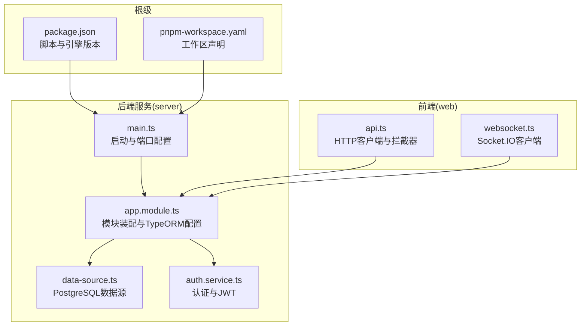
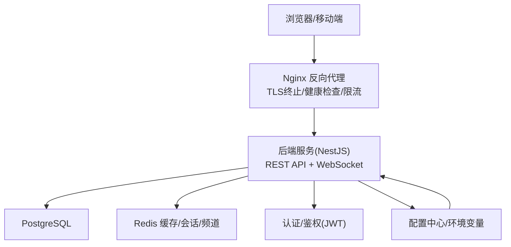
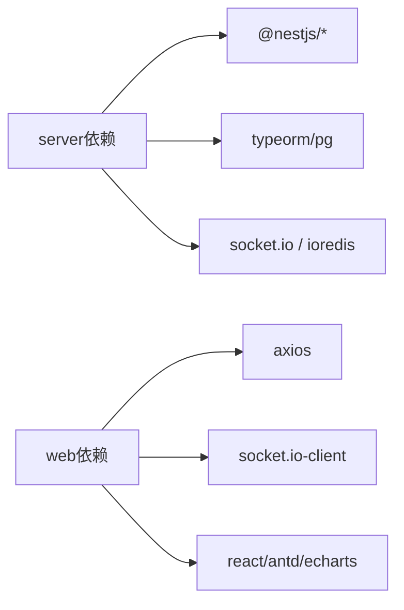

# 生产环境配置

<cite>
**本文引用的文件**
- [package.json](file://package.json)
- [pnpm-workspace.yaml](file://pnpm-workspace.yaml)
- [packages/server/src/main.ts](file://packages/server/src/main.ts)
- [packages/server/src/app.module.ts](file://packages/server/src/app.module.ts)
- [packages/server/src/database/data-source.ts](file://packages/server/src/database/data-source.ts)
- [packages/server/src/modules/auth/auth.service.ts](file://packages/server/src/modules/auth/auth.service.ts)
- [packages/server/src/common/guards/jwt-auth.guard.ts](file://packages/server/src/common/guards/jwt-auth.guard.ts)
- [packages/server/package.json](file://packages/server/package.json)
- [packages/web/package.json](file://packages/web/package.json)
- [packages/web/src/services/api.ts](file://packages/web/src/services/api.ts)
- [packages/web/src/services/websocket.ts](file://packages/web/src/services/websocket.ts)
</cite>

## 目录
1. [简介](#简介)
2. [项目结构](#项目结构)
3. [核心组件](#核心组件)
4. [架构总览](#架构总览)
5. [详细组件分析](#详细组件分析)
6. [依赖分析](#依赖分析)
7. [性能考量](#性能考量)
8. [故障排查指南](#故障排查指南)
9. [结论](#结论)
10. [附录](#附录)

## 简介
本文件面向Jiaoyi项目的生产环境部署与运维，围绕服务器硬件与网络、数据库与缓存、安全与访问控制、负载均衡与反向代理、性能调优与容量规划、备份与灾备等维度，提供可操作的配置建议与最佳实践。由于仓库中未包含具体的生产配置文件（如Nginx、PostgreSQL、Redis、防火墙规则等），本文在各章节以“概念性+工程化”的方式给出落地步骤与注意事项，便于结合实际基础设施进行实施。

## 项目结构
Jiaoyi采用Monorepo组织，后端基于NestJS，前端基于Vite+React。根级通过脚本与工作区配置统一管理开发与构建流程；后端负责业务与数据访问，前端负责交互与实时行情展示。

**图表来源**
- [packages/server/src/main.ts:1-29](file://packages/server/src/main.ts#L1-L29)
- [packages/server/src/app.module.ts:1-51](file://packages/server/src/app.module.ts#L1-L51)
- [packages/server/src/database/data-source.ts:1-18](file://packages/server/src/database/data-source.ts#L1-L18)
- [packages/server/src/modules/auth/auth.service.ts:1-100](file://packages/server/src/modules/auth/auth.service.ts#L1-L100)
- [packages/web/src/services/api.ts:1-311](file://packages/web/src/services/api.ts#L1-L311)
- [packages/web/src/services/websocket.ts:1-188](file://packages/web/src/services/websocket.ts#L1-L188)

**章节来源**
- [package.json:1-24](file://package.json#L1-L24)
- [pnpm-workspace.yaml:1-3](file://pnpm-workspace.yaml#L1-L3)
- [packages/server/src/main.ts:1-29](file://packages/server/src/main.ts#L1-L29)
- [packages/server/src/app.module.ts:1-51](file://packages/server/src/app.module.ts#L1-L51)
- [packages/server/src/database/data-source.ts:1-18](file://packages/server/src/database/data-source.ts#L1-L18)
- [packages/web/src/services/api.ts:1-311](file://packages/web/src/services/api.ts#L1-L311)
- [packages/web/src/services/websocket.ts:1-188](file://packages/web/src/services/websocket.ts#L1-L188)

## 核心组件
- 应用启动与运行时
  - 后端通过NestFactory创建应用，启用全局验证管道与CORS，读取环境变量中的端口配置。
  - 前端通过Vite构建，Axios作为HTTP客户端，Socket.IO用于实时行情推送。
- 数据访问层
  - TypeORM配置为PostgreSQL，使用环境变量驱动连接参数；迁移与实体路径由模块装配注入。
- 认证与授权
  - JWT服务与Passport策略配合，提供登录、注册、角色校验与用户资料查询能力。

**章节来源**
- [packages/server/src/main.ts:1-29](file://packages/server/src/main.ts#L1-L29)
- [packages/server/src/app.module.ts:15-51](file://packages/server/src/app.module.ts#L15-L51)
- [packages/server/src/database/data-source.ts:1-18](file://packages/server/src/database/data-source.ts#L1-L18)
- [packages/server/src/modules/auth/auth.service.ts:1-100](file://packages/server/src/modules/auth/auth.service.ts#L1-L100)

## 架构总览
下图展示了生产环境典型拓扑：反向代理/Nginx位于入口层，负责TLS终止、健康检查与请求转发；后端服务接收来自Nginx的请求与来自前端的WebSocket连接；数据库与缓存（Redis）作为后端依赖。

[此图为概念性架构示意，不对应具体源码文件，故无图表来源]

## 详细组件分析

### 服务器与网络配置
- 硬件与资源
  - CPU：按峰值QPS与并发连接数评估，建议至少2核起步，高并发场景建议4核以上。
  - 内存：建议不低于4GB，数据库与应用堆栈占用较高时需扩容至8GB或更高。
  - 存储：SSD本地盘或云盘，IOPS优先；数据库与日志分区独立挂载。
  - 网络：千兆网卡，公网带宽按峰值并发与页面大小估算；开启CDN与静态资源分离。
- 系统与进程
  - Node版本满足工程要求；NestJS进程数量按CPU核数配置，启用PM2或systemd管理。
  - 后端端口默认从环境变量读取，生产环境固定端口并绑定内网IP，避免外网直连。
- 网络与安全
  - 防火墙仅开放Nginx端口与数据库端口；内网隔离数据库与缓存。
  - TLS证书由Nginx统一管理，后端内部通信可禁用HTTPS以降低CPU开销。

[本节为通用工程实践建议，不直接分析具体文件，故无章节来源]

### 数据库配置优化（PostgreSQL）
- 参数调优
  - shared_buffers：物理内存的25%左右；effective_cache_size：物理内存的50%~60%。
  - work_mem：根据并发查询量调整，避免过大导致交换；maintenance_work_mem：用于DDL与索引重建。
  - max_connections：按应用连接池上限与后台任务预留空间综合设定。
  - autovacuum：保持默认或适度缩短周期，确保表统计与膨胀控制。
- 连接池设置
  - 后端使用TypeORM连接池，建议最大连接数与数据库最大连接数匹配；超时与重试策略合理配置。
  - 开启连接复用与健康检查，避免长事务与锁争用。
- 索引与查询优化
  - 对高频过滤字段（如用户ID、药品ID、时间范围）建立复合索引。
  - 定期分析与更新统计信息，避免执行计划退化。
  - 分页查询使用游标分页或基于索引的LIMIT/OFFSET优化。

[本节为通用工程实践建议，不直接分析具体文件，故无章节来源]

### 缓存系统配置（Redis）
- 部署模式
  - 主从复制或哨兵模式保障高可用；生产建议至少三主三从，跨机架部署。
  - 集群模式适用于超大数据集与高吞吐场景，注意槽位分布与热点键迁移。
- 缓存策略
  - LRU淘汰策略，热点数据可设置过期时间；敏感会话与验证码使用短 TTL。
  - 读多写少场景使用多级缓存（本地缓存+Redis），写穿透与击穿防护。
- 数据持久化
  - RDB快照+AOF混合持久化，兼顾恢复速度与数据安全；定期备份与异地容灾。
- 与后端集成
  - 后端通过ioredis连接，建议启用命令重试与自动降级；对关键路径增加熔断保护。

[本节为通用工程实践建议，不直接分析具体文件，故无章节来源]

### 安全配置指南
- 防火墙与网络
  - 仅暴露Nginx端口（如80/443），数据库与缓存仅内网可达；对外仅开放必要端口。
- SSL/TLS
  - Nginx统一终止TLS，证书由自动化工具（如acme.sh或云厂商证书服务）管理；禁用弱加密套件。
- 访问控制
  - JWT令牌签名算法与密钥管理，严格区分角色权限；对敏感接口启用速率限制与WAF。
  - CORS白名单仅允许受信域名，凭证传输需明确Origin。

[本节为通用工程实践建议，不直接分析具体文件，故无章节来源]

### 负载均衡与反向代理（Nginx）
- 配置要点
  - 上游指向多个后端实例，启用健康检查与故障摘除；静态资源走CDN。
  - 启用Gzip/HTTP/2，设置合理的超时与缓冲区；限制上传大小与并发连接。
- 健康检查与故障转移
  - 健康检查探针指向后端特定端点；失败阈值与重试策略按SLA设定。
- 与后端协作
  - 透传真实客户端IP与协议信息；WebSocket升级路径正确配置。

[本节为通用工程实践建议，不直接分析具体文件，故无章节来源]

### 性能调优与容量规划
- 后端优化
  - 合理拆分模块与懒加载，减少启动与内存占用；开启生产日志分级与采样。
  - 并发模型与异步任务分离，避免阻塞事件循环；数据库查询批量化与连接池复用。
- 前端优化
  - 资源压缩与分包策略，关键渲染路径最小化；WebSocket连接池与重连策略。
- 容量规划
  - 基于峰值QPS与响应时间目标推导实例数；监控CPU、内存、磁盘IO与连接数。
  - 数据库与缓存容量按数据增长曲线与保留策略评估，预留20%~30%冗余。

[本节为通用工程实践建议，不直接分析具体文件，故无章节来源]

### 备份策略、灾备与应急响应
- 备份
  - 数据库：全量+增量备份，保留7~14天在线归档；定期离线冷备份。
  - 文件与配置：版本化管理与差异备份，变更审计与回滚预案。
- 灾难恢复
  - RTO/RPO目标明确；演练恢复流程与切换路径；跨区域容灾。
- 应急响应
  - 建立值班与告警机制，快速定位问题根因；变更前评审与灰度发布。

[本节为通用工程实践建议，不直接分析具体文件，故无章节来源]

## 依赖分析
- 后端依赖
  - NestJS生态（Config、TypeORM、JWT、Passport、Socket.IO）、PostgreSQL驱动、Redis客户端等。
- 前端依赖
  - React、Ant Design、ECharts、Axios、Socket.IO客户端等。
- 工具链
  - Vite、TypeScript、ESLint、Jest等。

**图表来源**
- [packages/server/package.json:26-49](file://packages/server/package.json#L26-L49)
- [packages/web/package.json:13-24](file://packages/web/package.json#L13-L24)

**章节来源**
- [packages/server/package.json:1-90](file://packages/server/package.json#L1-L90)
- [packages/web/package.json:1-39](file://packages/web/package.json#L1-L39)

## 性能考量
- 启动与运行时
  - 后端通过环境变量控制端口与日志级别，生产环境建议关闭调试输出，启用生产日志。
- 数据访问
  - TypeORM连接池参数与数据库最大连接数匹配，避免连接饥饿；慢查询与事务超时监控。
- 实时通信
  - WebSocket客户端具备指数退避与最大重试次数，避免风暴重连；服务端事件路由清晰，防止广播风暴。
- 前端体验
  - Axios统一拦截器处理鉴权与错误，401时清理本地令牌并跳转登录；WebSocket连接状态与订阅管理。

**章节来源**
- [packages/server/src/main.ts:1-29](file://packages/server/src/main.ts#L1-L29)
- [packages/server/src/app.module.ts:15-51](file://packages/server/src/app.module.ts#L15-L51)
- [packages/server/src/database/data-source.ts:1-18](file://packages/server/src/database/data-source.ts#L1-L18)
- [packages/web/src/services/api.ts:1-311](file://packages/web/src/services/api.ts#L1-L311)
- [packages/web/src/services/websocket.ts:1-188](file://packages/web/src/services/websocket.ts#L1-L188)

## 故障排查指南
- 启动与端口
  - 确认环境变量中端口与主机绑定；检查CORS配置是否允许来源。
- 数据库连接
  - 核对主机、端口、用户名、密码与数据库名；迁移是否成功执行。
- 认证与授权
  - 检查JWT签名密钥与过期策略；用户是否存在且密码哈希匹配。
- 实时通信
  - WebSocket地址与Nginx升级路径；客户端重连策略与事件订阅。
- 日志与监控
  - 后端生产日志级别与采样；数据库慢查询与连接池耗尽告警。

**章节来源**
- [packages/server/src/main.ts:1-29](file://packages/server/src/main.ts#L1-L29)
- [packages/server/src/database/data-source.ts:1-18](file://packages/server/src/database/data-source.ts#L1-L18)
- [packages/server/src/modules/auth/auth.service.ts:1-100](file://packages/server/src/modules/auth/auth.service.ts#L1-L100)
- [packages/web/src/services/websocket.ts:1-188](file://packages/web/src/services/websocket.ts#L1-L188)

## 结论
本配置文档基于现有代码结构与依赖关系，给出了生产环境的系统化落地建议。请结合实际业务规模与SLA目标，细化硬件规格、数据库与缓存参数、安全策略与监控告警体系，并通过压测与演练持续优化。

## 附录
- 环境变量与配置
  - 后端通过ConfigModule读取.env；建议将敏感信息置于密钥管理服务，非敏感配置放入配置中心。
- 版本与工具
  - Node与包管理器版本遵循根级engines约束；前后端构建与测试脚本按工作区统一管理。

**章节来源**
- [packages/server/src/app.module.ts:17-20](file://packages/server/src/app.module.ts#L17-L20)
- [packages/server/src/database/data-source.ts:5](file://packages/server/src/database/data-source.ts#L5)
- [package.json:19-22](file://package.json#L19-L22)
- [pnpm-workspace.yaml:1-3](file://pnpm-workspace.yaml#L1-L3)