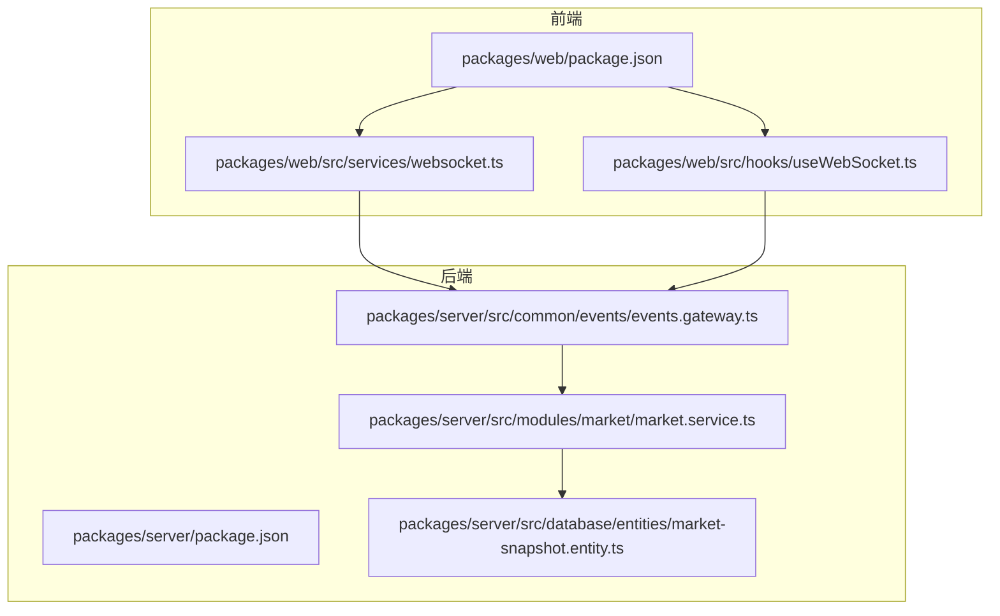
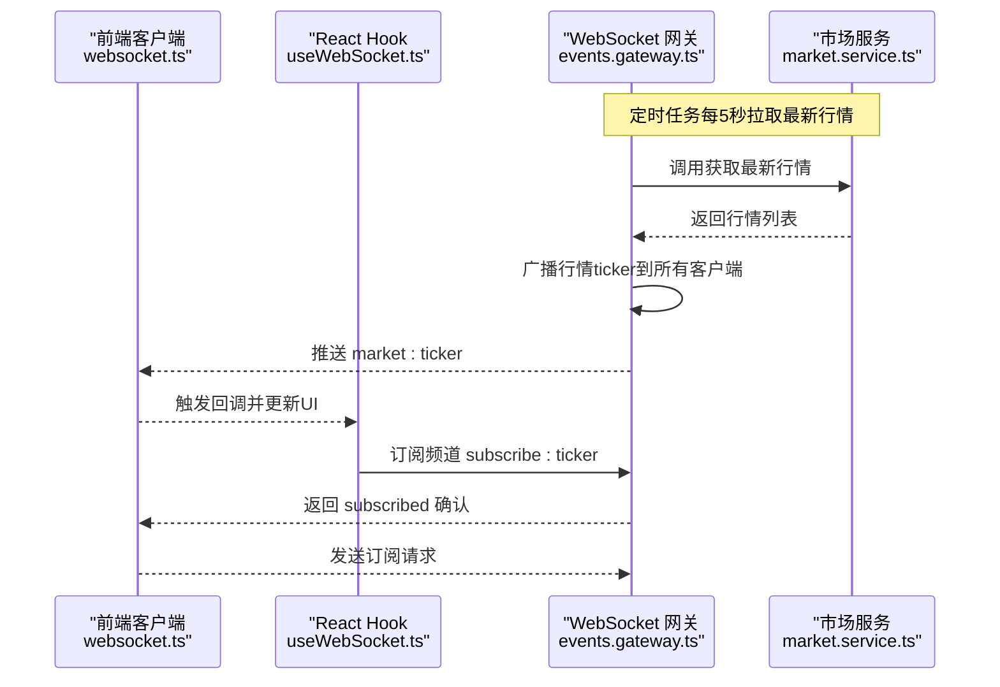
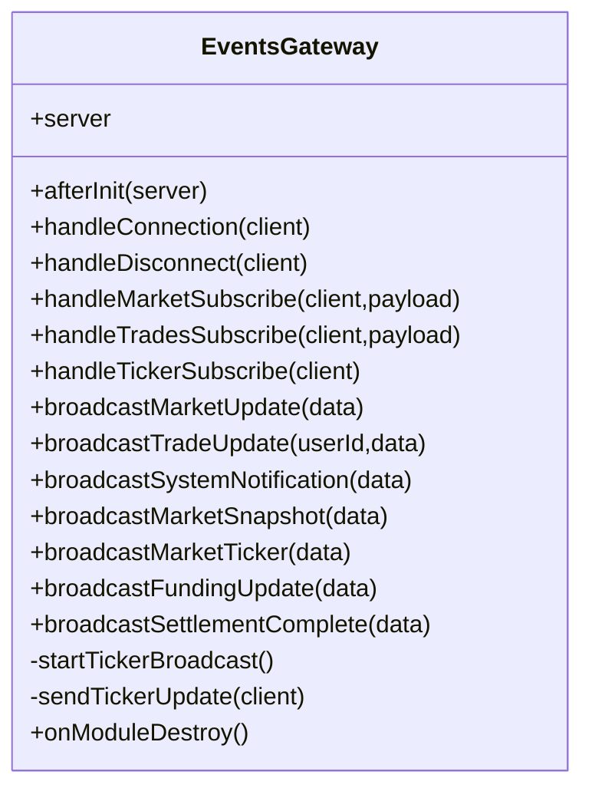
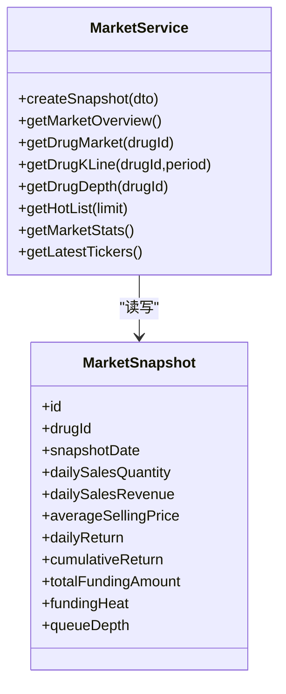
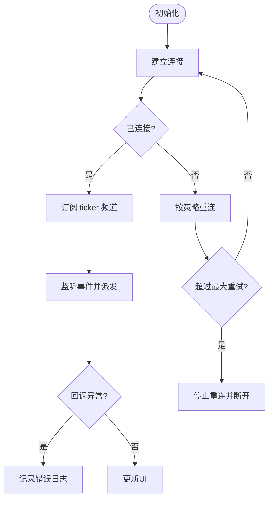
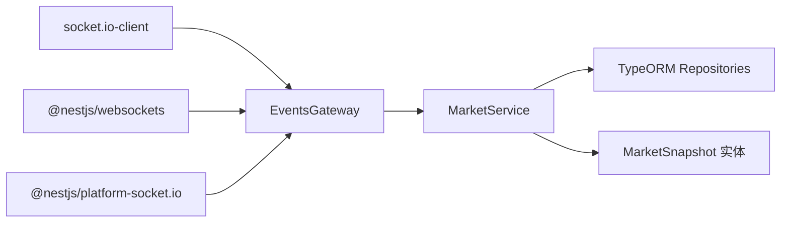

# 监控告警

<cite>
**本文引用的文件**   
- [packages/server/package.json](file://packages/server/package.json)
- [packages/web/package.json](file://packages/web/package.json)
- [packages/server/src/common/events/events.gateway.ts](file://packages/server/src/common/events/events.gateway.ts)
- [packages/server/src/modules/market/market.service.ts](file://packages/server/src/modules/market/market.service.ts)
- [packages/server/src/database/entities/market-snapshot.entity.ts](file://packages/server/src/database/entities/market-snapshot.entity.ts)
- [packages/web/src/services/websocket.ts](file://packages/web/src/services/websocket.ts)
- [packages/web/src/hooks/useWebSocket.ts](file://packages/web/src/hooks/useWebSocket.ts)
</cite>

## 目录
1. [简介](#简介)
2. [项目结构](#项目结构)
3. [核心组件](#核心组件)
4. [架构总览](#架构总览)
5. [组件详解](#组件详解)
6. [依赖关系分析](#依赖关系分析)
7. [性能与监控要点](#性能与监控要点)
8. [故障排查指南](#故障排查指南)
9. [结论](#结论)
10. [附录](#附录)

## 简介
本文件面向 Jiaoyi 项目的监控告警体系，围绕应用性能监控、实时数据监控、日志管理、告警规则与仪表板搭建进行系统化说明，并给出故障诊断流程、性能瓶颈识别方法与容量规划建议。当前仓库中已具备 WebSocket 实时推送与行情快照等关键能力，可作为监控与告警的数据来源与触发点。

## 项目结构
后端采用 NestJS 架构，前端使用 React + Vite，二者通过 WebSocket 实时通信。后端提供 WebSocket 网关与行情服务，前端提供 WebSocket 客户端封装与 React Hook 封装。

**图表来源**
- [packages/web/package.json:1-39](file://packages/web/package.json#L1-L39)
- [packages/server/package.json:1-90](file://packages/server/package.json#L1-L90)
- [packages/web/src/services/websocket.ts:1-187](file://packages/web/src/services/websocket.ts#L1-L187)
- [packages/web/src/hooks/useWebSocket.ts:1-137](file://packages/web/src/hooks/useWebSocket.ts#L1-L137)
- [packages/server/src/common/events/events.gateway.ts:1-165](file://packages/server/src/common/events/events.gateway.ts#L1-L165)
- [packages/server/src/modules/market/market.service.ts:1-498](file://packages/server/src/modules/market/market.service.ts#L1-L498)
- [packages/server/src/database/entities/market-snapshot.entity.ts:1-54](file://packages/server/src/database/entities/market-snapshot.entity.ts#L1-L54)

**章节来源**
- [packages/web/package.json:1-39](file://packages/web/package.json#L1-L39)
- [packages/server/package.json:1-90](file://packages/server/package.json#L1-L90)

## 核心组件
- WebSocket 网关：负责连接生命周期管理、频道订阅、定时广播与异常日志记录。
- 市场服务：负责生成/查询行情快照、计算收益与资金热度等指标，供网关广播。
- 前端 WebSocket 客户端：封装连接、重连、订阅、事件派发与连接状态检查。
- 前端 React Hook：对客户端进行 React 化封装，便于在组件中使用。

**章节来源**
- [packages/server/src/common/events/events.gateway.ts:1-165](file://packages/server/src/common/events/events.gateway.ts#L1-L165)
- [packages/server/src/modules/market/market.service.ts:1-498](file://packages/server/src/modules/market/market.service.ts#L1-L498)
- [packages/web/src/services/websocket.ts:1-187](file://packages/web/src/services/websocket.ts#L1-L187)
- [packages/web/src/hooks/useWebSocket.ts:1-137](file://packages/web/src/hooks/useWebSocket.ts#L1-L137)

## 架构总览
下图展示了从后端网关到前端客户端的实时数据通路，以及关键监控点位。

**图表来源**
- [packages/server/src/common/events/events.gateway.ts:126-143](file://packages/server/src/common/events/events.gateway.ts#L126-L143)
- [packages/server/src/modules/market/market.service.ts:471-496](file://packages/server/src/modules/market/market.service.ts#L471-L496)
- [packages/web/src/services/websocket.ts:102-120](file://packages/web/src/services/websocket.ts#L102-L120)
- [packages/web/src/hooks/useWebSocket.ts:56-64](file://packages/web/src/hooks/useWebSocket.ts#L56-L64)

## 组件详解

### WebSocket 网关（EventsGateway）
- 功能职责
  - 初始化网关、记录连接/断开事件。
  - 处理订阅消息：市场、交易、ticker 等频道。
  - 定时广播行情 ticker（默认每5秒）。
  - 对各类业务事件进行广播（市场更新、交易更新、系统通知、快照、垫资、清算完成）。
- 关键监控点
  - 定时任务执行耗时与异常日志。
  - 广播失败或异常错误日志。
  - 订阅/退订事件的处理耗时与异常。
- 性能关注
  - 房间数量与广播规模可能影响 CPU 与内存。
  - 频繁广播需评估网络带宽与客户端处理能力。

**图表来源**
- [packages/server/src/common/events/events.gateway.ts:15-165](file://packages/server/src/common/events/events.gateway.ts#L15-L165)

**章节来源**
- [packages/server/src/common/events/events.gateway.ts:1-165](file://packages/server/src/common/events/events.gateway.ts#L1-L165)

### 市场服务（MarketService）
- 功能职责
  - 生成/更新市场快照（日销量、日收入、均价、日收益、累计收益、垫资总额、资金热度、排队深度）。
  - 提供市场总览、单药详情、K线数据、垫资深度、热门排行、平台统计等接口。
  - 为网关提供最新 ticker 数据。
- 关键监控点
  - 快照生成的数据库写入耗时与异常。
  - 统计聚合（求和、去重、排序）的耗时与结果正确性。
  - 最新 ticker 的生成与广播链路耗时。
- 性能关注
  - 大量药品与订单时，聚合与查询成本上升。
  - 建议对高频查询建立索引与缓存。

**图表来源**
- [packages/server/src/modules/market/market.service.ts:98-216](file://packages/server/src/modules/market/market.service.ts#L98-L216)
- [packages/server/src/database/entities/market-snapshot.entity.ts:12-54](file://packages/server/src/database/entities/market-snapshot.entity.ts#L12-L54)

**章节来源**
- [packages/server/src/modules/market/market.service.ts:1-498](file://packages/server/src/modules/market/market.service.ts#L1-L498)
- [packages/server/src/database/entities/market-snapshot.entity.ts:1-54](file://packages/server/src/database/entities/market-snapshot.entity.ts#L1-L54)

### 前端 WebSocket 客户端与 Hook
- 功能职责
  - 连接/断开、自动重连、最大重试次数与延迟控制。
  - 订阅/退订频道，统一事件派发。
  - 暴露连接状态检查与事件注册/注销。
  - React Hook 将连接、订阅、事件处理与清理逻辑封装。
- 关键监控点
  - 连接状态变化与错误事件。
  - 订阅确认与消息到达时间。
  - 回调异常捕获与日志输出。
- 性能关注
  - 多个订阅同时触发时的事件派发成本。
  - 频繁订阅/退订的资源释放与内存泄漏风险。

**图表来源**
- [packages/web/src/services/websocket.ts:11-169](file://packages/web/src/services/websocket.ts#L11-L169)
- [packages/web/src/hooks/useWebSocket.ts:66-124](file://packages/web/src/hooks/useWebSocket.ts#L66-L124)

**章节来源**
- [packages/web/src/services/websocket.ts:1-187](file://packages/web/src/services/websocket.ts#L1-L187)
- [packages/web/src/hooks/useWebSocket.ts:1-137](file://packages/web/src/hooks/useWebSocket.ts#L1-L137)

## 依赖关系分析
- 前端依赖 socket.io-client，后端依赖 @nestjs/websockets 与 socket.io。
- 市场服务依赖 TypeORM 实体与仓储，生成/查询市场快照。
- 网关依赖市场服务以获取最新 ticker 并进行广播。

**图表来源**
- [packages/web/package.json:23](file://packages/web/package.json#L23)
- [packages/server/package.json:33-36](file://packages/server/package.json#L33-L36)
- [packages/server/src/common/events/events.gateway.ts:12-13](file://packages/server/src/common/events/events.gateway.ts#L12-L13)
- [packages/server/src/modules/market/market.service.ts:80-93](file://packages/server/src/modules/market/market.service.ts#L80-L93)
- [packages/server/src/database/entities/market-snapshot.entity.ts:12-54](file://packages/server/src/database/entities/market-snapshot.entity.ts#L12-L54)

**章节来源**
- [packages/web/package.json:1-39](file://packages/web/package.json#L1-L39)
- [packages/server/package.json:1-90](file://packages/server/package.json#L1-L90)

## 性能与监控要点
- 关键指标建议
  - 后端
    - WebSocket 连接数、活跃房间数、每房间消息数。
    - ticker 广播耗时、广播失败率。
    - 市场快照生成耗时、数据库写入 QPS。
    - 订阅/退订处理耗时、异常率。
  - 前端
    - 连接建立耗时、重连次数与总耗时。
    - 消息到达延迟（客户端收到时间 - 服务器广播时间）。
    - 事件回调异常次数。
- 基准设置
  - ticker 广播周期：当前为 5 秒，建议根据业务吞吐与客户端负载设定上限。
  - 重连策略：最大重试次数与初始延迟可根据网络波动调整。
- 异常检测
  - 后端：对定时广播与订阅处理中的异常进行日志记录与报警。
  - 前端：对连接错误、订阅确认超时、回调异常进行告警。

**章节来源**
- [packages/server/src/common/events/events.gateway.ts:126-143](file://packages/server/src/common/events/events.gateway.ts#L126-L143)
- [packages/web/src/services/websocket.ts:11-169](file://packages/web/src/services/websocket.ts#L11-L169)

## 故障排查指南
- WebSocket 连接问题
  - 检查前端连接日志与重连次数，确认是否达到最大重试。
  - 检查后端连接/断开日志，定位异常原因。
- 订阅与消息接收
  - 确认订阅频道是否正确，后端是否返回订阅成功。
  - 检查前端事件监听是否注册成功，回调是否抛出异常。
- 广播与延迟
  - 后端定时任务是否正常执行，ticker 是否按时推送。
  - 前端消息到达时间与服务器广播时间差值是否异常。
- 数据一致性
  - 快照生成是否成功，数据库写入是否出现异常。
  - 最新 ticker 数据是否与快照一致。

**章节来源**
- [packages/web/src/services/websocket.ts:42-100](file://packages/web/src/services/websocket.ts#L42-L100)
- [packages/server/src/common/events/events.gateway.ts:34-46](file://packages/server/src/common/events/events.gateway.ts#L34-L46)
- [packages/server/src/modules/market/market.service.ts:98-216](file://packages/server/src/modules/market/market.service.ts#L98-L216)

## 结论
Jiaoyi 已具备完善的 WebSocket 实时通路与市场快照能力，可作为监控与告警的核心数据源。建议在此基础上补充 Prometheus 指标导出、Grafana 仪表板与告警规则，覆盖连接、广播、订阅、数据生成与客户端延迟等关键路径，形成闭环的可观测性体系。

## 附录

### 日志管理与级别
- 后端日志
  - 使用 NestJS Logger 记录网关初始化、连接/断开、广播异常等事件。
  - 建议区分 info、warn、error 级别，便于检索与告警。
- 前端日志
  - 连接状态、错误事件、回调异常均应记录。
  - 建议区分开发/生产环境的日志输出策略。

**章节来源**
- [packages/server/src/common/events/events.gateway.ts:26-46](file://packages/server/src/common/events/events.gateway.ts#L26-L46)
- [packages/web/src/services/websocket.ts:42-152](file://packages/web/src/services/websocket.ts#L42-L152)

### 告警规则设计示例
- 连接与可用性
  - 连接失败率（后端）> 阈值（如 1%）持续 5 分钟。
  - 客户端重连次数（前端）> 阈值（如 3 次/分钟）。
- 广播与延迟
  - ticker 广播间隔偏差 > 阈值（如 ±10%）。
  - 客户端平均延迟 > 阈值（如 500ms）。
- 数据健康
  - 快照生成耗时 > 阈值（如 100ms）。
  - 订阅/退订异常率 > 阈值（如 0.1%）。

### 监控仪表板建议
- 后端
  - 连接数趋势、房间数、广播耗时、异常计数。
  - ticker 广播周期与延迟分布。
- 前端
  - 连接状态、重连次数、消息到达延迟、回调异常。
- 业务指标
  - 日销量、日收入、日收益、累计收益、垫资总额、资金热度、排队深度。

### 容量规划建议
- 后端
  - 评估房间数量与广播规模对 CPU/内存的影响，预留扩容空间。
  - 对高频查询建立索引与缓存，避免热点查询阻塞。
- 前端
  - 控制订阅数量与消息频率，避免 UI 卡顿。
  - 对事件回调进行节流/去抖，降低渲染压力。