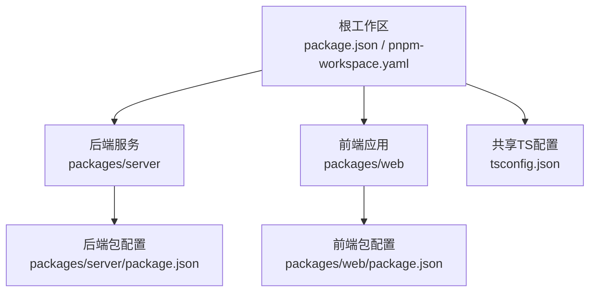
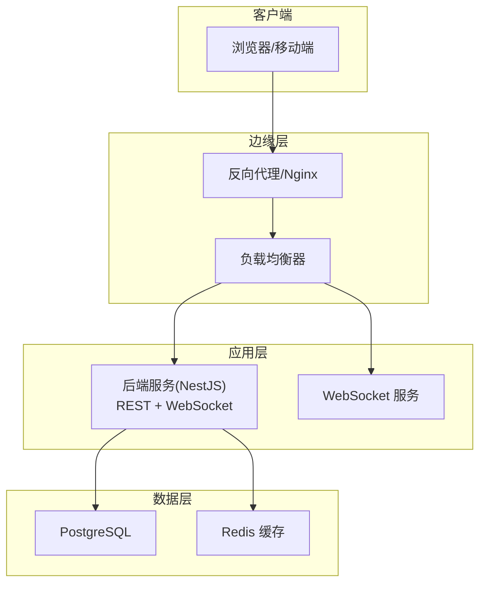
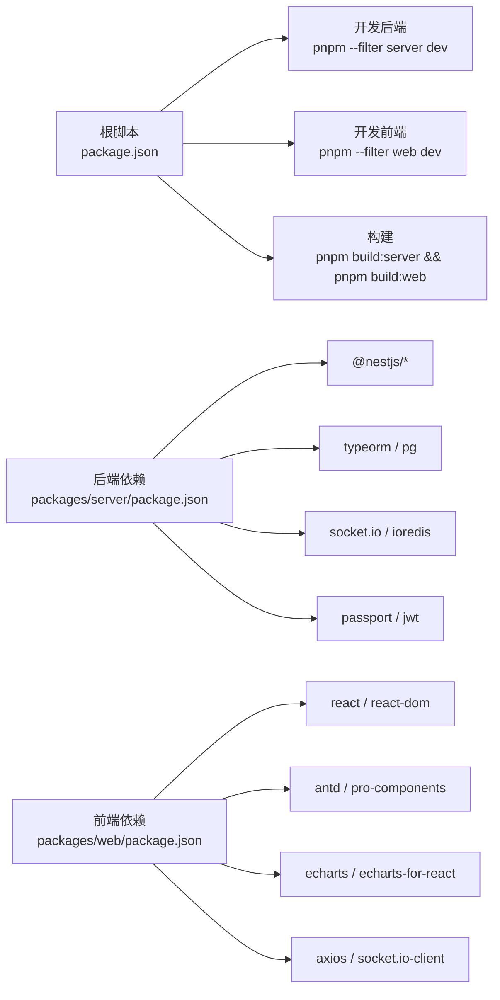

# 部署运维

<cite>
**本文引用的文件**
- [package.json](file://package.json)
- [pnpm-workspace.yaml](file://pnpm-workspace.yaml)
- [tsconfig.json](file://tsconfig.json)
- [packages/server/package.json](file://packages/server/package.json)
- [packages/server/nest-cli.json](file://packages/server/nest-cli.json)
- [packages/web/package.json](file://packages/web/package.json)
- [packages/web/vite.config.ts](file://packages/web/vite.config.ts)
</cite>

## 目录
1. [简介](#简介)
2. [项目结构](#项目结构)
3. [核心组件](#核心组件)
4. [架构总览](#架构总览)
5. [详细组件分析](#详细组件分析)
6. [依赖分析](#依赖分析)
7. [性能考量](#性能考量)
8. [故障排除指南](#故障排除指南)
9. [结论](#结论)
10. [附录](#附录)

## 简介
本部署运维文档面向Jiaoyi药品垫资交易平台的生产环境与CI/CD落地实践，基于当前仓库中的monorepo结构与子包配置进行系统化梳理。文档覆盖以下方面：
- 生产环境配置要求：服务器规格、网络与安全基线
- Docker容器化方案：镜像构建、容器编排与环境变量
- CI/CD流程设计：自动化测试、构建与部署流水线
- 监控告警：应用监控、性能指标与日志采集
- 负载均衡、反向代理与SSL证书
- 备份恢复与灾难恢复
- 扩展性、性能调优与容量规划
- 故障排除与运维最佳实践

说明：当前仓库未包含Dockerfile、Kubernetes清单或CI配置文件，因此本文件在“容器化”“CI/CD”“监控告警”等章节提供通用工程化建议与落地步骤，便于团队按需补充具体实现。

## 项目结构
Jiaoyi采用pnpm monorepo组织，根目录通过脚本统一管理前后端开发与构建；子包分别承载后端服务（NestJS）与前端应用（Vite + React），并共享TypeScript基础配置。

**图示来源**
- [package.json:6-13](file://package.json#L6-L13)
- [pnpm-workspace.yaml:1-3](file://pnpm-workspace.yaml#L1-L3)
- [packages/server/package.json:1-90](file://packages/server/package.json#L1-L90)
- [packages/web/package.json:1-39](file://packages/web/package.json#L1-L39)
- [tsconfig.json:1-17](file://tsconfig.json#L1-L17)

**章节来源**
- [package.json:1-24](file://package.json#L1-L24)
- [pnpm-workspace.yaml:1-3](file://pnpm-workspace.yaml#L1-L3)
- [tsconfig.json:1-17](file://tsconfig.json#L1-L17)

## 核心组件
- 后端服务（Server）
  - 框架：NestJS
  - 运行模式：开发/生产命令由子包脚本定义
  - 数据库：TypeORM + PostgreSQL
  - 缓存：Redis（ioredis）
  - 认证：Passport（本地与JWT）、JWT模块
  - 定时任务：@nestjs/schedule
  - 实时通信：Socket.IO（WebSockets）
  - 配置加载：@nestjs/config + dotenv
- 前端应用（Web）
  - 构建工具：Vite
  - 框架：React + Ant Design Pro 组件体系
  - 图表：ECharts
  - 网络：Axios
  - 实时：Socket.IO 客户端
  - 类型检查：TypeScript

**章节来源**
- [packages/server/package.json:26-49](file://packages/server/package.json#L26-L49)
- [packages/server/package.json:8-24](file://packages/server/package.json#L8-L24)
- [packages/web/package.json:13-24](file://packages/web/package.json#L13-L24)
- [packages/web/package.json:6-12](file://packages/web/package.json#L6-L12)

## 架构总览
下图展示Jiaoyi在生产环境中的典型部署拓扑：前端静态资源由反向代理提供，后端服务通过负载均衡分发请求，数据库与缓存作为后端依赖，实时通道通过WebSocket连接。

[本图为概念性架构示意，不直接映射到具体源码文件，故无“图示来源”]

## 详细组件分析

### 后端服务（NestJS）部署要点
- 进程与端口
  - 应用监听端口由运行脚本与配置模块共同决定，生产启动命令见子包脚本。
  - WebSocket通过Socket.IO独立端口或复用HTTP端口，需在反向代理中正确转发。
- 数据库与缓存
  - TypeORM数据源与迁移脚本已内置，生产环境需确保连接字符串与凭据安全注入。
  - Redis用于会话/缓存，需与后端配置模块对接。
- 认证与授权
  - Passport本地策略与JWT策略配合使用，生产需启用HTTPS与安全头。
- 定时任务
  - 使用调度模块执行周期性任务，需保证单实例部署或分布式锁。
- 日志与可观测性
  - NestJS默认日志可结合统一格式化输出，建议接入结构化日志与集中式日志平台。

**章节来源**
- [packages/server/package.json:8-24](file://packages/server/package.json#L8-L24)
- [packages/server/package.json:26-49](file://packages/server/package.json#L26-L49)

### 前端应用（Vite + React）部署要点
- 构建产物
  - Vite构建生成静态资源，需由反向代理提供服务。
- 路由与历史模式
  - 若使用History路由，需在反向代理中回退至index.html以支持刷新。
- 实时通信
  - Socket.IO客户端需指向正确的WebSocket地址，注意跨域与反代路径前缀。
- 安全基线
  - 开启HTTPS、安全响应头、内容安全策略（CSP）等。

**章节来源**
- [packages/web/package.json:6-12](file://packages/web/package.json#L6-L12)
- [packages/web/package.json:13-24](file://packages/web/package.json#L13-L24)

### 配置与环境变量
- 共享TS配置
  - 统一编译目标与严格类型检查，便于前后端一致的类型安全。
- 后端配置模块
  - 使用@nestjs/config加载环境变量，建议区分开发/测试/生产三套env文件。
- 前端构建参数
  - Vite可通过环境变量控制构建行为（如API基础路径、是否启用预览）。

**章节来源**
- [tsconfig.json:1-17](file://tsconfig.json#L1-L17)
- [packages/server/package.json:28-36](file://packages/server/package.json#L28-L36)
- [packages/web/package.json:6-12](file://packages/web/package.json#L6-L12)

## 依赖分析
- 工作区与脚本
  - 根脚本统一触发子包开发/构建/测试/类型检查，便于CI流水线复用。
- 包依赖关系
  - 后端依赖NestJS生态、TypeORM、Socket.IO、Redis、JWT等；前端依赖React、Ant Design、ECharts、Axios等。
- 开发工具链
  - ESLint、Jest、TypeScript、Vite等工具贯穿前后端，保障质量与效率。

**图示来源**
- [package.json:6-13](file://package.json#L6-L13)
- [packages/server/package.json:26-49](file://packages/server/package.json#L26-L49)
- [packages/web/package.json:13-24](file://packages/web/package.json#L13-L24)

**章节来源**
- [package.json:1-24](file://package.json#L1-L24)
- [packages/server/package.json:1-90](file://packages/server/package.json#L1-L90)
- [packages/web/package.json:1-39](file://packages/web/package.json#L1-L39)

## 性能考量
- 前端性能
  - 代码分割、懒加载、图片与图表按需渲染；构建时开启压缩与Tree Shaking。
- 后端性能
  - 连接池大小与超时配置、查询优化、缓存命中率、限流与熔断策略。
- 实时通信
  - WebSocket连接数与消息频率控制，避免广播风暴；必要时引入房间与权限校验。
- 存储与缓存
  - PostgreSQL索引与物化视图优化；Redis键空间过期策略与内存淘汰。
- 反向代理与负载均衡
  - 合理设置超时、缓冲区与健康检查；启用Gzip/HTTP/2；前置CDN加速静态资源。

[本节为通用性能指导，不直接分析具体文件，故无“章节来源”]

## 故障排除指南
- 启动失败
  - 检查Node版本与包管理器版本约束；确认环境变量与配置文件存在且权限正确。
- 数据库连接问题
  - 校验连接串、网络连通性、SSL模式与防火墙；查看迁移脚本执行状态。
- WebSocket不可达
  - 检查反向代理WS升级配置、路径前缀、跨域头与防火墙放行。
- 前端白屏或路由异常
  - 确认静态资源路径、History路由回退规则、CSP与HTTPS。
- 性能瓶颈
  - 分析慢查询、缓存命中率、CPU/内存占用与并发峰值；逐步定位热点接口与组件。

[本节为通用运维指导，不直接分析具体文件，故无“章节来源”]

## 结论
本文件基于现有仓库配置，给出了Jiaoyi项目的生产部署与运维实施建议。由于当前仓库未包含容器化与CI配置文件，建议团队按“附录”中的步骤补充Dockerfile、Kubernetes清单与CI流水线，以实现标准化、自动化的交付流程。

[本节为总结性内容，不直接分析具体文件，故无“章节来源”]

## 附录

### A. 生产环境配置要求
- 服务器规格
  - CPU：建议≥2核；内存≥4GB；SSD存储≥50GB剩余空间。
  - 网络：带宽≥100Mbps；开放端口：80/443（反向代理）、应用端口（后端）、WebSocket端口、数据库端口、Redis端口。
- 系统与软件
  - 操作系统：Linux（Ubuntu/CentOS）长期支持版。
  - 运行时：Node ≥ 18；PostgreSQL ≥ 13；Redis ≥ 6；Docker（可选）。
- 安全基线
  - 防火墙仅放行必要端口；启用HTTPS与安全响应头；定期更新系统与依赖；最小权限原则管理密钥与证书。

[本节为通用工程实践，不直接分析具体文件，故无“章节来源”]

### B. Docker容器化部署方案
- 镜像构建
  - 为后端与前端分别构建镜像；后端镜像包含Node运行时与依赖安装；前端镜像基于Nginx提供静态资源。
- 容器编排
  - 使用Compose/Kubernetes编排；分离后端、数据库、缓存与反向代理；设置健康检查与重启策略。
- 环境变量
  - 通过配置文件或Secrets注入数据库连接串、Redis地址、JWT密钥、反向代理上游地址等。

[本节为通用工程实践，不直接分析具体文件，故无“章节来源”]

### C. CI/CD流程设计
- 自动化测试
  - 在PR中执行单元测试与类型检查；覆盖率阈值与Lint报告。
- 构建与打包
  - 分别构建后端与前端；生成可复现的构建产物与依赖锁定文件。
- 部署管道
  - 预发布环境先行验证；生产环境采用蓝绿/金丝雀发布；回滚策略与变更审计。

[本节为通用工程实践，不直接分析具体文件，故无“章节来源”]

### D. 监控告警系统
- 应用监控
  - 后端：NestJS指标导出、健康检查端点；前端：页面性能与错误上报。
- 性能指标
  - QPS、P95/P99延迟、错误率、数据库慢查询、Redis命中率、WebSocket连接数。
- 日志采集
  - 结构化日志输出；集中式日志平台收集；敏感字段脱敏；日志轮转与保留策略。

[本节为通用工程实践，不直接分析具体文件，故无“章节来源”]

### E. 负载均衡、反向代理与SSL证书
- 负载均衡
  - 健康检查、会话保持（可选）、故障转移；后端实例扩缩容与滚动更新。
- 反向代理
  - 静态资源直出、Gzip压缩、HTTP/2、CORS与安全头；WS升级与路径前缀处理。
- SSL证书
  - 自动续期（ACME/Let’s Encrypt）；强密码套件与TLS版本；HSTS与OCSP Stapling。

[本节为通用工程实践，不直接分析具体文件，故无“章节来源”]

### F. 备份恢复与灾难恢复
- 备份策略
  - 数据库定时快照与增量备份；对象存储归档静态资源；配置与密钥加密备份。
- 恢复演练
  - 定期演练RTO/RPO目标；验证恢复流程与数据一致性。
- 灾难恢复
  - 多可用区/多地域部署；主备切换预案与通知机制。

[本节为通用工程实践，不直接分析具体文件，故无“章节来源”]

### G. 扩展性、性能调优与容量规划
- 扩展性
  - 无状态后端水平扩展；读写分离与只读副本；缓存层与消息队列解耦。
- 性能调优
  - 查询优化、连接池与超时、缓存策略、CDN与静态资源优化。
- 容量规划
  - 基于QPS、峰值并发、存储增长模型与成本预算制定扩容计划。

[本节为通用工程实践，不直接分析具体文件，故无“章节来源”]