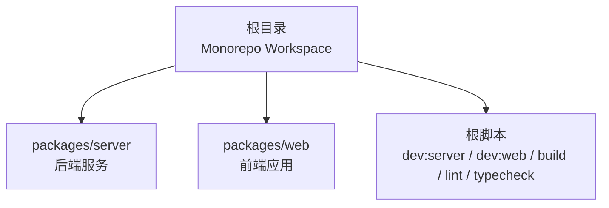
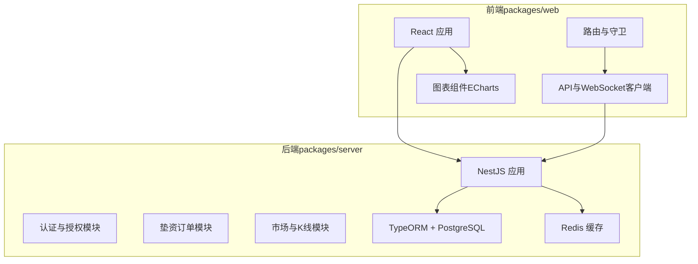
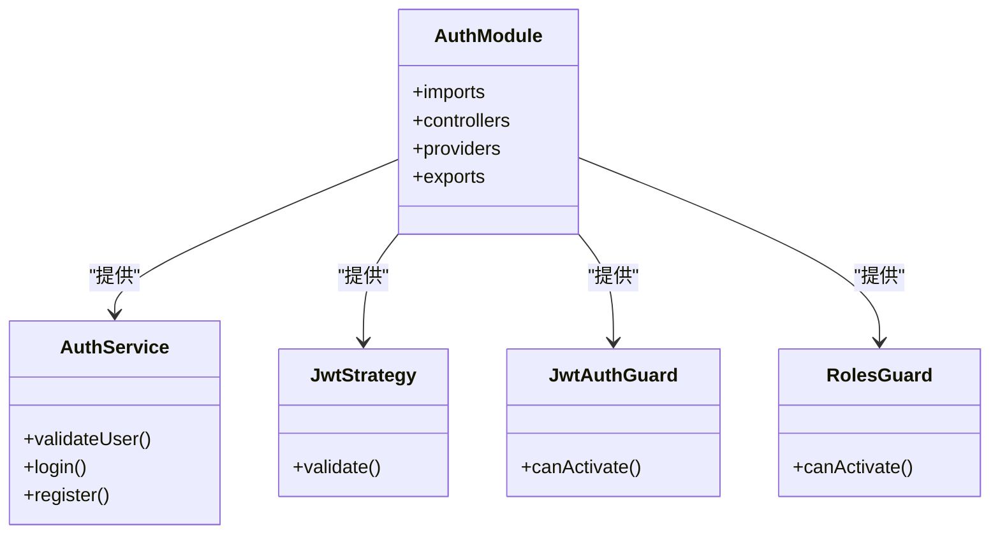
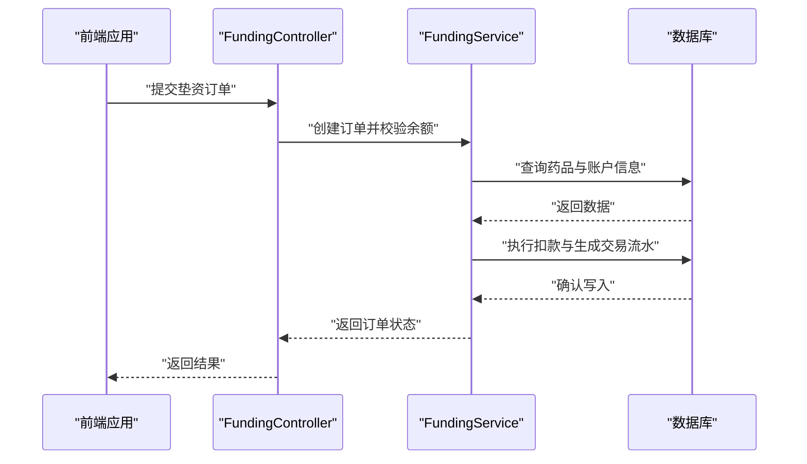
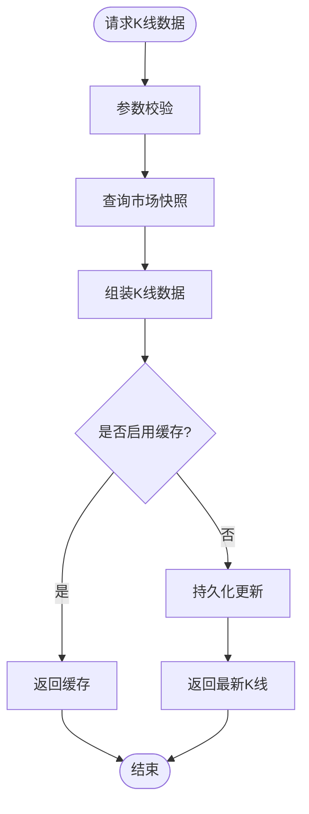
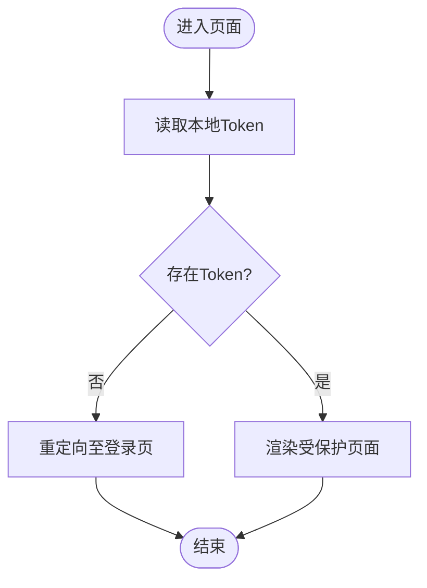
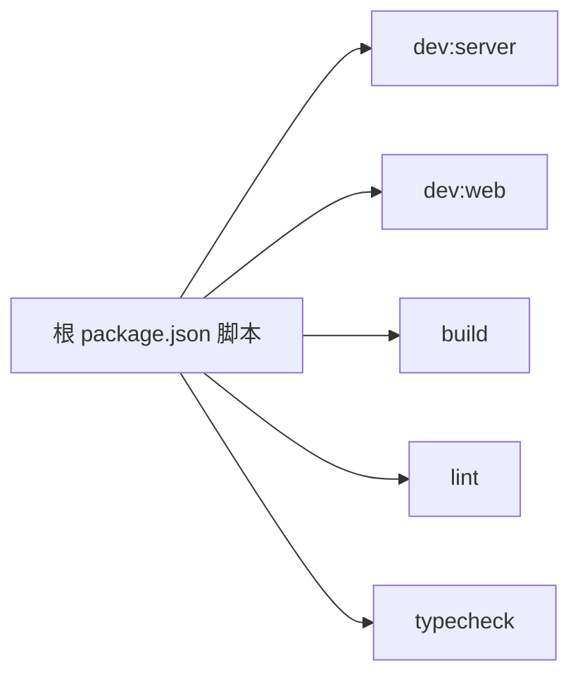

# 项目概述

<cite>
**本文档引用的文件**
- [package.json](file://package.json)
- [pnpm-workspace.yaml](file://pnpm-workspace.yaml)
- [tsconfig.json](file://tsconfig.json)
- [packages/server/package.json](file://packages/server/package.json)
- [packages/server/src/main.ts](file://packages/server/src/main.ts)
- [packages/server/src/app.module.ts](file://packages/server/src/app.module.ts)
- [packages/server/src/modules/auth/auth.module.ts](file://packages/server/src/modules/auth/auth.module.ts)
- [packages/server/src/modules/funding/funding.module.ts](file://packages/server/src/modules/funding/funding.module.ts)
- [packages/server/src/modules/market/market.module.ts](file://packages/server/src/modules/market/market.module.ts)
- [packages/web/package.json](file://packages/web/package.json)
- [packages/web/src/App.tsx](file://packages/web/src/App.tsx)
</cite>

## 目录
1. [引言](#引言)
2. [项目结构](#项目结构)
3. [核心组件](#核心组件)
4. [架构总览](#架构总览)
5. [详细组件分析](#详细组件分析)
6. [依赖关系分析](#依赖关系分析)
7. [性能考虑](#性能考虑)
8. [故障排除指南](#故障排除指南)
9. [结论](#结论)
10. [附录](#附录)

## 引言
Jiaoyi药品垫资交易平台是一个基于Monorepo架构构建的药品交易与资金管理一体化系统。该项目旨在为医药流通领域提供高效、透明、可审计的垫资交易服务，通过前后端分离的设计实现实时行情、订单撮合、资金结算与风险控制的协同工作。

- 核心价值
  - 提升药品流通效率：通过标准化流程与自动化工具降低交易成本与时间。
  - 增强资金安全：基于账户体系与交易流水的全链路审计能力。
  - 实时市场反馈：集成K线图、盘口数据与结算状态，支持多方决策。
- 目标用户群体
  - 药品批发商与分销商：进行垫资采购与销售。
  - 医疗机构采购部门：集中采购与库存管理。
  - 平台运营与风控人员：监控市场、执行结算与合规检查。
- 技术栈选择与整体架构理念
  - 前端采用React + TypeScript + Vite，结合Ant Design与图表库，提供现代化交互体验。
  - 后端采用NestJS + TypeScript + PostgreSQL，配合TypeORM与Redis，确保高并发下的稳定性与一致性。
  - 通过Monorepo统一管理前后端代码，提升协作效率与版本一致性。
- 差异化优势
  - 模块化业务域：围绕“用户、药品、资金、市场、销售、结算”划分清晰模块，便于扩展与维护。
  - 实时通信：内置WebSocket网关，支撑K线与盘口数据的实时推送。
  - 完整生命周期：从注册登录、药品管理、下单垫资到日终结算闭环覆盖。

## 项目结构
本项目采用Monorepo结构，根目录通过工作区配置统一管理前后端子包，确保共享类型定义、编译配置与脚本命令的一致性。

**图表来源**
- [pnpm-workspace.yaml:1-3](file://pnpm-workspace.yaml#L1-L3)
- [package.json:6-13](file://package.json#L6-L13)

**章节来源**
- [pnpm-workspace.yaml:1-3](file://pnpm-workspace.yaml#L1-L3)
- [package.json:6-13](file://package.json#L6-L13)
- [tsconfig.json:1-17](file://tsconfig.json#L1-L17)

## 核心组件
- 后端服务（packages/server）
  - 基于NestJS的企业级框架，提供REST与WebSocket双栈接口。
  - 集成认证授权、角色守卫、JWT策略与全局验证管道。
  - 使用PostgreSQL作为主存储，Redis用于缓存与会话扩展。
- 前端应用（packages/web）
  - 基于React 18与Vite的SPA，路由包含仪表盘、市场、交易、持仓、结算与管理后台。
  - 内置路由守卫，基于本地Token实现登录态校验。
  - 集成Ant Design组件库与ECharts图表，提供丰富的可视化能力。
- Monorepo与开发工具
  - 统一TypeScript编译配置，根脚本统一触发前后端开发、构建、测试与类型检查。
  - 支持跨包脚本调用（如过滤器模式），提升开发效率。

**章节来源**
- [packages/server/package.json:8-24](file://packages/server/package.json#L8-L24)
- [packages/server/src/main.ts:1-29](file://packages/server/src/main.ts#L1-L29)
- [packages/server/src/app.module.ts:1-51](file://packages/server/src/app.module.ts#L1-L51)
- [packages/web/package.json:6-12](file://packages/web/package.json#L6-L12)
- [packages/web/src/App.tsx:1-58](file://packages/web/src/App.tsx#L1-L58)
- [package.json:6-13](file://package.json#L6-L13)

## 架构总览
系统采用前后端分离与模块化微服务风格的Monorepo组织方式，后端以NestJS为核心，前端以React为核心，二者通过HTTP与WebSocket进行数据与事件通信。

**图表来源**
- [packages/server/src/app.module.ts:15-48](file://packages/server/src/app.module.ts#L15-L48)
- [packages/server/src/modules/auth/auth.module.ts:14-33](file://packages/server/src/modules/auth/auth.module.ts#L14-L33)
- [packages/server/src/modules/funding/funding.module.ts:10-23](file://packages/server/src/modules/funding/funding.module.ts#L10-L23)
- [packages/server/src/modules/market/market.module.ts:11-25](file://packages/server/src/modules/market/market.module.ts#L11-L25)
- [packages/web/src/App.tsx:1-58](file://packages/web/src/App.tsx#L1-L58)

## 详细组件分析

### 认证与授权模块（Auth）
该模块负责用户身份认证、角色权限控制与JWT签发，是平台安全的基石。

**图表来源**
- [packages/server/src/modules/auth/auth.module.ts:14-33](file://packages/server/src/modules/auth/auth.module.ts#L14-L33)

**章节来源**
- [packages/server/src/modules/auth/auth.module.ts:14-33](file://packages/server/src/modules/auth/auth.module.ts#L14-L33)

### 垫资订单模块（Funding）
垫资订单模块处理药品购买的资金垫付流程，贯穿下单、扣款、记账与对账的完整闭环。

**图表来源**
- [packages/server/src/modules/funding/funding.module.ts:10-23](file://packages/server/src/modules/funding/funding.module.ts#L10-L23)

**章节来源**
- [packages/server/src/modules/funding/funding.module.ts:10-23](file://packages/server/src/modules/funding/funding.module.ts#L10-L23)

### 市场与K线模块（Market）
市场模块负责生成与查询市场快照、K线数据与日销售统计，支撑交易决策与风控分析。

**图表来源**
- [packages/server/src/modules/market/market.module.ts:11-25](file://packages/server/src/modules/market/market.module.ts#L11-L25)

**章节来源**
- [packages/server/src/modules/market/market.module.ts:11-25](file://packages/server/src/modules/market/market.module.ts#L11-L25)

### 前端路由与登录态守卫
前端应用通过路由守卫与本地Token实现登录态校验，保障受保护页面的安全访问。

**图表来源**
- [packages/web/src/App.tsx:12-31](file://packages/web/src/App.tsx#L12-L31)

**章节来源**
- [packages/web/src/App.tsx:12-31](file://packages/web/src/App.tsx#L12-L31)

## 依赖关系分析
- Monorepo与包管理
  - 根脚本统一调度子包开发与构建，避免重复配置与环境差异。
  - 工作区声明确保子包在本地开发时可被正确解析。
- 后端依赖
  - NestJS生态（Config、JWT、Passport、WebSockets、Schedule）与TypeORM、PostgreSQL、Redis构成稳定的服务层。
- 前端依赖
  - React生态（React Router、Ant Design、ECharts）与Vite构建工具提供高效的开发体验。

**图表来源**
- [package.json:6-13](file://package.json#L6-L13)

**章节来源**
- [package.json:6-13](file://package.json#L6-L13)
- [pnpm-workspace.yaml:1-3](file://pnpm-workspace.yaml#L1-L3)

## 性能考虑
- 数据库与缓存
  - 使用TypeORM与PostgreSQL进行结构化数据管理；Redis用于热点数据与会话缓存，建议合理设置TTL与淘汰策略。
- 并发与实时性
  - WebSocket网关支持高频数据推送，需注意连接数与消息队列的背压处理。
- 前端性能
  - 图表组件按需加载与懒渲染，减少首屏压力；路由守卫避免无意义的渲染。
- 可观测性
  - 建议接入日志与指标采集，结合NestJS的拦截器与中间件完善链路追踪。

## 故障排除指南
- 开发启动失败
  - 确认Node与pnpm版本满足根引擎要求；检查工作区配置与子包依赖安装。
- 端口冲突
  - 后端默认监听端口可通过配置注入；前端Vite端口可在子包配置中调整。
- 认证异常
  - 检查JWT密钥与过期时间配置；确认客户端存储的Token未过期。
- 数据库迁移
  - 使用子包提供的迁移脚本生成与执行迁移；确保连接参数正确。

**章节来源**
- [package.json:19-22](file://package.json#L19-L22)
- [packages/server/src/main.ts:9-23](file://packages/server/src/main.ts#L9-L23)
- [packages/server/src/app.module.ts:21-37](file://packages/server/src/app.module.ts#L21-L37)
- [packages/server/package.json:20-24](file://packages/server/package.json#L20-L24)

## 结论
Jiaoyi项目通过Monorepo与前后端分离的架构设计，实现了药品垫资交易的标准化与自动化。模块化的业务域划分、完善的认证授权体系与实时数据推送能力，使其在同类平台中具备良好的扩展性与运维效率。建议在生产环境中进一步完善可观测性、缓存策略与安全加固，以支撑更大规模的业务增长。

## 附录

### 快速开始指南
- 环境要求
  - Node.js 版本满足根引擎要求；pnpm 版本满足根引擎要求。
- 安装步骤
  - 在根目录安装依赖（工作区自动解析子包）。
  - 初始化数据库：执行迁移与种子数据脚本。
- 基本使用流程
  - 启动后端服务与前端应用，访问前端页面完成登录与交易操作。
  - 通过管理后台查看结算与风控指标。

**章节来源**
- [package.json:19-22](file://package.json#L19-L22)
- [package.json:6-13](file://package.json#L6-L13)
- [packages/server/package.json:20-24](file://packages/server/package.json#L20-L24)
- [packages/web/src/App.tsx:33-55](file://packages/web/src/App.tsx#L33-L55)